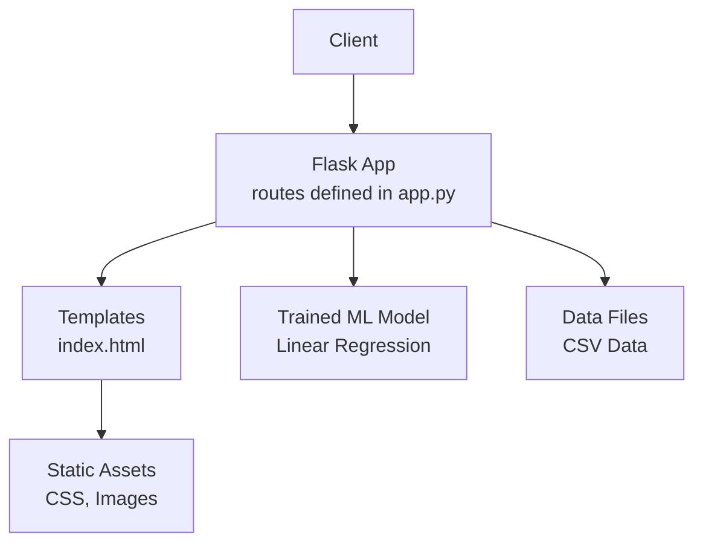
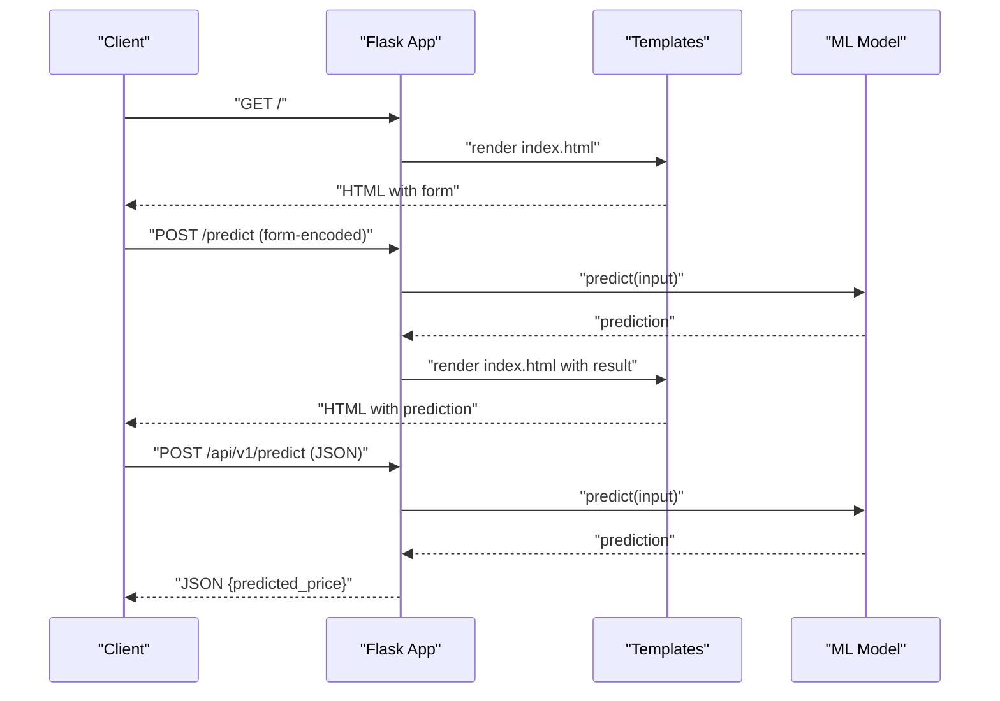
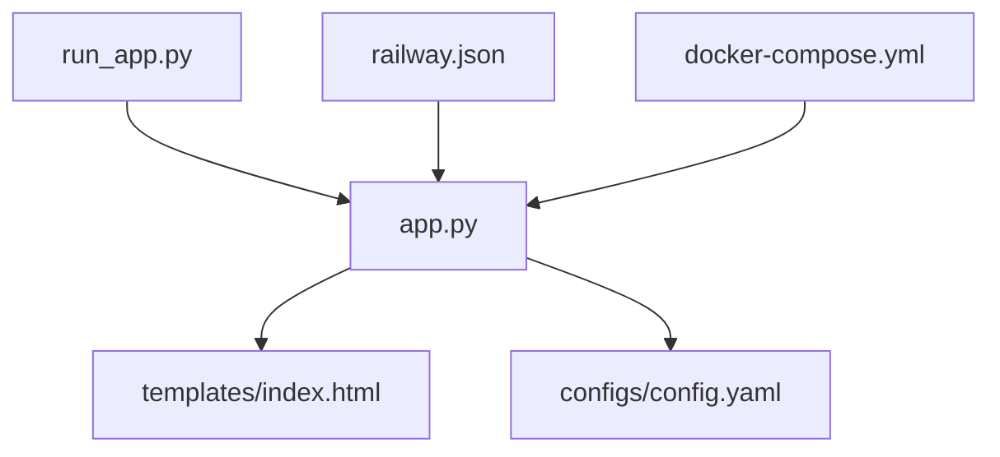

# API Reference

<cite>
**Referenced Files in This Document**
- [app.py](file://House_Price_Prediction-main/housing1/app.py)
- [index.html](file://House_Price_Prediction-main/housing1/templates/index.html)
- [run_app.py](file://House_Price_Prediction-main/housing1/run_app.py)
- [railway.json](file://House_Price_Prediction-main/housing1/railway.json)
- [docker-compose.yml](file://House_Price_Prediction-main/housing1/docker-compose.yml)
- [README.md](file://House_Price_Prediction-main/housing1/README.md)
- [config.yaml](file://House_Price_Prediction-main/housing1/configs/config.yaml)
- [config.example.yaml](file://House_Price_Prediction-main/housing1/configs/config.example.yaml)
</cite>

## Table of Contents
1. [Introduction](#introduction)
2. [Project Structure](#project-structure)
3. [Core Components](#core-components)
4. [Architecture Overview](#architecture-overview)
5. [Detailed Component Analysis](#detailed-component-analysis)
6. [Dependency Analysis](#dependency-analysis)
7. [Performance Considerations](#performance-considerations)
8. [Troubleshooting Guide](#troubleshooting-guide)
9. [Conclusion](#conclusion)
10. [Appendices](#appendices)

## Introduction
This document provides comprehensive API documentation for the House Price Prediction application. It covers all REST endpoints and programmatic interfaces, including HTTP methods, URL patterns, request/response schemas, authentication requirements, and operational details such as health checks and metrics. It also includes client implementation examples and integration patterns for multiple programming languages.

## Project Structure
The application is implemented as a Flask web service with a small set of routes serving both HTML pages and programmatic APIs. The primary entry point delegates to the Flask application located under the housing1 package. The API endpoints exposed by the application include:
- Home page: GET /
- Prediction form: POST /predict
- REST API: POST /api/v1/predict
- Health check: GET /health
- Metrics: GET /metrics
- Visualizations: GET /visualize
- Dashboard: GET /dashboard

**Diagram sources**
- [app.py:1-109](file://House_Price_Prediction-main/housing1/app.py#L1-L109)
- [index.html:1-145](file://House_Price_Prediction-main/housing1/templates/index.html#L1-L145)

**Section sources**
- [app.py:1-109](file://House_Price_Prediction-main/housing1/app.py#L1-L109)
- [index.html:1-145](file://House_Price_Prediction-main/housing1/templates/index.html#L1-L145)

## Core Components
- Flask application with route handlers for HTML and API endpoints
- Template rendering engine for delivering HTML content
- Static asset serving for CSS and images
- Machine learning model for price predictions
- Configuration via YAML for API settings and runtime behavior
- Container orchestration and deployment configuration

Key runtime behaviors:
- Port binding and host configuration are controlled by environment variables and configuration files
- Production deployments use Gunicorn with configurable worker count
- Health checks are integrated into container orchestration

**Section sources**
- [app.py:1-109](file://House_Price_Prediction-main/housing1/app.py#L1-L109)
- [config.yaml:48-54](file://House_Price_Prediction-main/housing1/configs/config.yaml#L48-L54)
- [railway.json:6-6](file://House_Price_Prediction-main/housing1/railway.json#L6-L6)
- [docker-compose.yml:16-16](file://House_Price_Prediction-main/housing1/docker-compose.yml#L16-L16)

## Architecture Overview
The application exposes both a web UI and a programmatic API. The web UI is rendered via Jinja2 templates and served by Flask. The programmatic API accepts JSON payloads for predictions and returns structured responses. The ML model is trained during startup and used for inference requests.

**Diagram sources**
- [app.py:33-62](file://House_Price_Prediction-main/housing1/app.py#L33-L62)
- [index.html:83-127](file://House_Price_Prediction-main/housing1/templates/index.html#L83-L127)

## Detailed Component Analysis

### Home Page (/)
- Method: GET
- Description: Serves the main HTML page containing the prediction form and navigation links.
- Response: 200 OK with HTML content.
- Notes: Renders the index template which includes navigation to visualizations and dashboard.

Example request:
- GET /

Example response:
- 200 OK with HTML body

Security considerations:
- No authentication required for the home page.

Operational details:
- Host and port are configured via environment variables and configuration files.

**Section sources**
- [app.py:33-35](file://House_Price_Prediction-main/housing1/app.py#L33-L35)
- [index.html:1-145](file://House_Price_Prediction-main/housing1/templates/index.html#L1-L145)
- [config.yaml:50-51](file://House_Price_Prediction-main/housing1/configs/config.yaml#L50-L51)

### Prediction Form (/predict)
- Method: POST
- Content-Type: application/x-www-form-urlencoded
- Description: Accepts form-encoded input parameters and returns the prediction rendered in the HTML page.
- Request parameters:
  - Area: number (required)
  - Bedrooms: number (required)
  - Bathrooms: number (required)
  - Stories: number (required)
  - Parking: number (required)
  - Age: number (required)
  - Location: number (required)
- Response: 200 OK with HTML content. On error, displays an error message in the UI.
- Notes: The form fields are defined in the index template.

Example request:
- POST /predict
- Content-Type: application/x-www-form-urlencoded
- Body:
  - Area=2000
  - Bedrooms=3
  - Bathrooms=2
  - Stories=2
  - Parking=1
  - Age=5
  - Location=3

Example response:
- 200 OK with HTML body containing the prediction result or error message

Security considerations:
- No authentication required.
- Input is validated and converted to numeric types; exceptions are caught and displayed as errors.

**Section sources**
- [app.py:38-62](file://House_Price_Prediction-main/housing1/app.py#L38-L62)
- [index.html:83-127](file://House_Price_Prediction-main/housing1/templates/index.html#L83-L127)

### REST API (/api/v1/predict)
- Method: POST
- Content-Type: application/json
- Description: Accepts a JSON payload with the same input fields as the form and returns a JSON prediction result.
- Request schema:
  - Area: number (required)
  - Bedrooms: number (required)
  - Bathrooms: number (required)
  - Stories: number (required)
  - Parking: number (required)
  - Age: number (required)
  - Location: number (required)
- Response schema:
  - predicted_price: number
- Status codes:
  - 200 OK: Successful prediction
  - 400 Bad Request: Invalid JSON or missing fields
  - 500 Internal Server Error: Unexpected server error
- Notes: The endpoint is intended for programmatic clients and returns JSON.

Example request:
- POST /api/v1/predict
- Content-Type: application/json
- Body:
  - {
    - "Area": 2000,
    - "Bedrooms": 3,
    - "Bathrooms": 2,
    - "Stories": 2,
    - "Parking": 1,
    - "Age": 5,
    - "Location": 3
  - }

Example response:
- 200 OK
- Body:
  - {
    - "predicted_price": 250000
  - }

Error response example:
- 400 Bad Request
- Body:
  - {
    - "error": "Invalid input"
  - }

Security considerations:
- No authentication required.
- Input validation is performed; malformed JSON or invalid values will result in appropriate error responses.

**Section sources**
- [README.md:404-418](file://House_Price_Prediction-main/housing1/README.md#L404-L418)

### Health Check (/health)
- Method: GET
- Description: Returns the current health status of the service.
- Response: 200 OK with a simple health status indicator.
- Notes: Integrated into container health checks for orchestration platforms.

Example request:
- GET /health

Example response:
- 200 OK with health status

Security considerations:
- No authentication required.

**Section sources**
- [README.md:420-423](file://House_Price_Prediction-main/housing1/README.md#L420-L423)
- [docker-compose.yml:17-22](file://House_Price_Prediction-main/housing1/docker-compose.yml#L17-L22)

### Metrics (/metrics)
- Method: GET
- Description: Provides performance and operational metrics for the service.
- Response: 200 OK with metrics data.
- Notes: Intended for monitoring systems and dashboards.

Example request:
- GET /metrics

Example response:
- 200 OK with metrics payload

Security considerations:
- No authentication required.

**Section sources**
- [README.md:425-428](file://House_Price_Prediction-main/housing1/README.md#L425-L428)

### Visualizations (/visualize) and Dashboard (/dashboard)
- Methods: GET
- Description: Renders data visualizations and an interactive dashboard.
- Response: 200 OK with HTML content displaying charts and metrics.
- Notes: These endpoints are primarily for UI consumption and provide insights derived from the ML model.

Example requests:
- GET /visualize
- GET /dashboard

Example responses:
- 200 OK with HTML body containing visualizations and metrics

Security considerations:
- No authentication required.

**Section sources**
- [app.py:64-98](file://House_Price_Prediction-main/housing1/app.py#L64-L98)
- [index.html:21-98](file://House_Price_Prediction-main/housing1/templates/index.html#L21-L98)

## Dependency Analysis
The application depends on:
- Flask for routing and request handling
- Pandas and NumPy for data processing
- Scikit-learn for model training and inference
- Matplotlib for generating plots
- Jinja2 templates for HTML rendering
- Configuration via YAML files
- Container orchestration via Docker Compose and platform-specific deployment files

**Diagram sources**
- [app.py:1-109](file://House_Price_Prediction-main/housing1/app.py#L1-L109)
- [index.html:1-145](file://House_Price_Prediction-main/housing1/templates/index.html#L1-L145)
- [config.yaml:1-60](file://House_Price_Prediction-main/housing1/configs/config.yaml#L1-L60)
- [railway.json:1-20](file://House_Price_Prediction-main/housing1/railway.json#L1-L20)
- [docker-compose.yml:1-51](file://House_Price_Prediction-main/housing1/docker-compose.yml#L1-L51)
- [run_app.py:1-62](file://House_Price_Prediction-main/housing1/run_app.py#L1-L62)

**Section sources**
- [app.py:1-109](file://House_Price_Prediction-main/housing1/app.py#L1-L109)
- [run_app.py:1-62](file://House_Price_Prediction-main/housing1/run_app.py#L1-L62)
- [config.yaml:1-60](file://House_Price_Prediction-main/housing1/configs/config.yaml#L1-L60)
- [railway.json:1-20](file://House_Price_Prediction-main/housing1/railway.json#L1-L20)
- [docker-compose.yml:1-51](file://House_Price_Prediction-main/housing1/docker-compose.yml#L1-L51)

## Performance Considerations
- Model inference is performed synchronously; consider asynchronous processing for high-throughput scenarios.
- Container orchestration uses Gunicorn with a configurable number of workers for production deployments.
- Health checks are integrated to ensure service readiness in containerized environments.
- Static assets are served efficiently via Flask’s static folder configuration.

[No sources needed since this section provides general guidance]

## Troubleshooting Guide
Common issues and resolutions:
- Missing data file: Ensure the CSV data file exists in the expected path before starting the application.
- Dependency installation: The run script checks for required packages and installs missing ones automatically.
- Port conflicts: Configure the PORT environment variable to avoid conflicts.
- Health check failures: Verify the health endpoint is reachable and the service is running.

**Section sources**
- [run_app.py:36-44](file://House_Price_Prediction-main/housing1/run_app.py#L36-L44)
- [docker-compose.yml:17-22](file://House_Price_Prediction-main/housing1/docker-compose.yml#L17-L22)

## Conclusion
The House Price Prediction application provides a simple yet effective API for price estimation, complemented by a web interface and operational endpoints for monitoring and diagnostics. The documented endpoints, schemas, and examples enable straightforward integration across various client implementations.

[No sources needed since this section summarizes without analyzing specific files]

## Appendices

### API Versioning
- The REST endpoint follows a versioned path pattern: /api/v1/predict. This allows for future API evolution while maintaining backward compatibility.

**Section sources**
- [README.md:404-418](file://House_Price_Prediction-main/housing1/README.md#L404-L418)

### Rate Limiting
- No built-in rate limiting is implemented. Consider adding rate limiting middleware or platform-level controls for production deployments.

[No sources needed since this section provides general guidance]

### Security Considerations
- Authentication: None of the documented endpoints require authentication. For production, consider adding authentication and authorization mechanisms.
- CORS: Not configured in the current implementation. Add CORS handling if integrating from browsers across origins.
- Input validation: Basic numeric conversion and exception handling are present. Enhance validation and sanitization for production use.

**Section sources**
- [app.py:41-61](file://House_Price_Prediction-main/housing1/app.py#L41-L61)

### Client Implementation Examples

#### Python
- Using requests library to call the REST API:
  - Send a POST request to /api/v1/predict with JSON payload
  - Handle 200 OK with predicted_price field

#### JavaScript (fetch)
- Call the REST API endpoint with fetch:
  - Set Content-Type header to application/json
  - Parse the JSON response for predicted_price

#### cURL
- Example curl commands:
  - POST /api/v1/predict with JSON payload
  - GET /health and GET /metrics for operational endpoints

**Section sources**
- [README.md:404-428](file://House_Price_Prediction-main/housing1/README.md#L404-L428)

### Integration Patterns
- Web UI integration: Use the HTML form at /predict for manual input and immediate feedback.
- Programmatic integration: Use the JSON API at /api/v1/predict for automated clients and microservices.
- Monitoring integration: Poll /metrics for performance data and integrate with monitoring dashboards.
- Health monitoring: Use /health for readiness probes in containerized environments.

**Section sources**
- [README.md:420-428](file://House_Price_Prediction-main/housing1/README.md#L420-L428)
- [docker-compose.yml:17-22](file://House_Price_Prediction-main/housing1/docker-compose.yml#L17-L22)