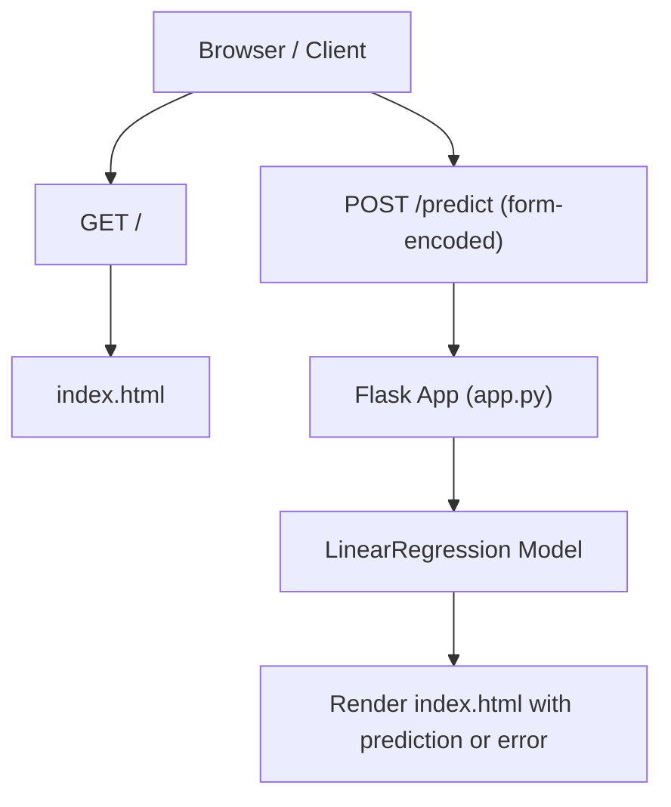
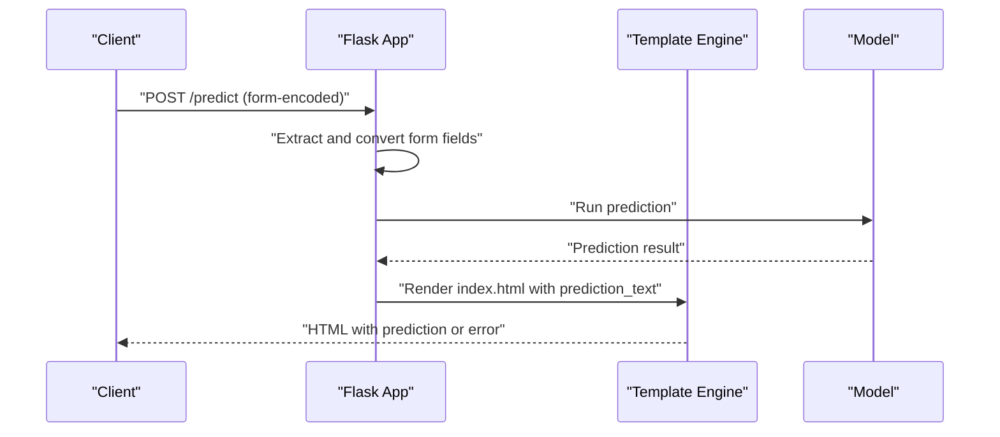
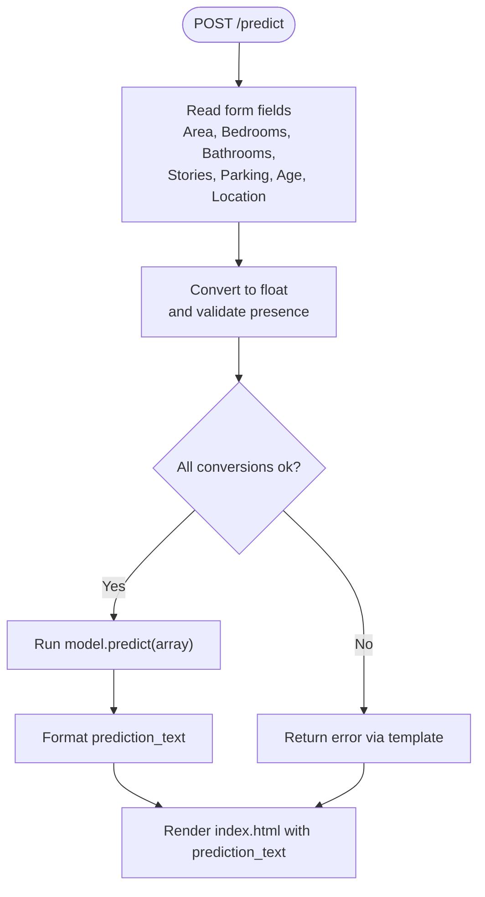
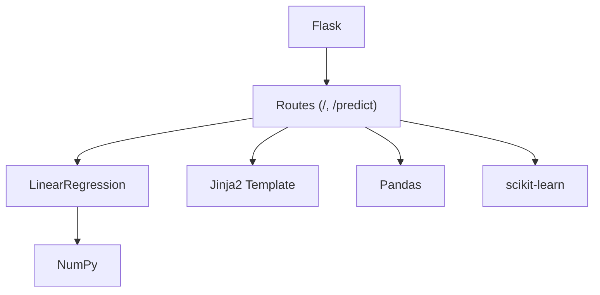

# Core Endpoints

<cite>
**Referenced Files in This Document**
- [app.py](file://House_Price_Prediction-main/housing1/app.py)
- [index.html](file://House_Price_Prediction-main/housing1/templates/index.html)
- [config.yaml](file://House_Price_Prediction-main/housing1/configs/config.yaml)
- [config.example.yaml](file://House_Price_Prediction-main/housing1/configs/config.example.yaml)
- [requirements.txt](file://requirements.txt)
</cite>

## Table of Contents
1. [Introduction](#introduction)
2. [Project Structure](#project-structure)
3. [Core Components](#core-components)
4. [Architecture Overview](#architecture-overview)
5. [Detailed Component Analysis](#detailed-component-analysis)
6. [Dependency Analysis](#dependency-analysis)
7. [Performance Considerations](#performance-considerations)
8. [Troubleshooting Guide](#troubleshooting-guide)
9. [Conclusion](#conclusion)

## Introduction
This document provides detailed API documentation for the core prediction endpoints of the House Price Prediction application. It focuses on:
- The main prediction endpoint POST /predict with form-encoded data handling for house feature inputs (Area, Bedrooms, Bathrooms, Stories, Parking, Age, Location).
- The home page endpoint GET / that serves the main HTML interface.
- Request/response examples, validation rules, error handling, response formatting, and client implementation guidance for submitting form data programmatically.

## Project Structure
The application is a Flask-based web service that loads a pre-trained model and exposes two primary routes:
- GET / renders the HTML form and displays results.
- POST /predict accepts form-encoded data, validates and converts inputs, runs inference, and returns the rendered template with the predicted price or an error message.

**Diagram sources**
- [app.py:37-66](file://House_Price_Prediction-main/housing1/app.py#L37-L66)
- [index.html:83-127](file://House_Price_Prediction-main/housing1/templates/index.html#L83-L127)

**Section sources**
- [app.py:14-39](file://House_Price_Prediction-main/housing1/app.py#L14-L39)
- [index.html:12-19](file://House_Price_Prediction-main/housing1/templates/index.html#L12-L19)

## Core Components
- Flask application entry and routing:
  - GET / returns the main HTML interface.
  - POST /predict handles form submissions, performs type conversion, runs inference, and returns the result via the template.
- HTML template:
  - Provides the form with fields for Area, Bedrooms, Bathrooms, Stories, Parking, Age, and Location.
  - Displays prediction results or error messages returned by the backend.

Key implementation references:
- Route definitions and handlers: [app.py:37-66](file://House_Price_Prediction-main/housing1/app.py#L37-L66)
- HTML form definition: [index.html:83-127](file://House_Price_Prediction-main/housing1/templates/index.html#L83-L127)

**Section sources**
- [app.py:37-66](file://House_Price_Prediction-main/housing1/app.py#L37-L66)
- [index.html:83-127](file://House_Price_Prediction-main/housing1/templates/index.html#L83-L127)

## Architecture Overview
The prediction flow is a simple request-response cycle:
- The client submits a form to POST /predict.
- The backend extracts form fields, converts them to numeric values, constructs a model input array, predicts the price, and renders the result in the template.

**Diagram sources**
- [app.py:42-66](file://House_Price_Prediction-main/housing1/app.py#L42-L66)
- [index.html:129-136](file://House_Price_Prediction-main/housing1/templates/index.html#L129-L136)

## Detailed Component Analysis

### Endpoint: GET /
- Purpose: Serve the main HTML interface containing the prediction form.
- Behavior:
  - Renders index.html without any prediction result.
  - The form action targets POST /predict.
- Typical response: 200 OK with HTML body.

Validation and behavior references:
- Route handler: [app.py:37-39](file://House_Price_Prediction-main/housing1/app.py#L37-L39)
- Template rendering: [index.html:83-127](file://House_Price_Prediction-main/housing1/templates/index.html#L83-L127)

**Section sources**
- [app.py:37-39](file://House_Price_Prediction-main/housing1/app.py#L37-L39)
- [index.html:83-127](file://House_Price_Prediction-main/housing1/templates/index.html#L83-L127)

### Endpoint: POST /predict
- Method: POST
- Content-Type: application/x-www-form-urlencoded (form-encoded)
- Purpose: Accept house feature inputs, validate and convert them, run inference, and return the result.

Parameters (form fields):
- Area: number (required)
- Bedrooms: number (required)
- Bathrooms: number (required)
- Stories: number (required)
- Parking: number (required)
- Age: number (required)
- Location: integer (1, 2, or 3) (required)

Data type requirements:
- All numeric fields are converted to float internally.
- Location is converted to float and expected to match one of the allowed integer values.

Validation rules:
- Required fields: All seven fields must be present in the form payload.
- Type conversion: Each field is parsed as a floating-point number.
- Location domain: Only values 1, 2, or 3 are accepted (as per the HTML select options).

Error handling:
- On successful prediction: Returns index.html with a formatted prediction_text indicating the predicted price.
- On errors (e.g., missing fields, invalid types, model exceptions): Returns index.html with an error message derived from the exception.

Response formatting:
- The backend injects prediction_text into the template context.
- The template displays either the predicted price or an error message.

Request examples:
- Minimal valid form-encoded payload:
  - Area=2000&Bedrooms=3&Bathrooms=2&Stories=1&Parking=2&Age=10&Location=1
- Invalid payload (missing required field):
  - Area=2000&Bedrooms=3&Bathrooms=2&Stories=1&Parking=2&Age=10

Response examples:
- Success:
  - HTML body containing a prediction_text indicating the predicted price.
- Error:
  - HTML body containing an error message reflecting the exception.

Implementation references:
- Route handler and inference logic: [app.py:42-66](file://House_Price_Prediction-main/housing1/app.py#L42-L66)
- HTML form and result display: [index.html:83-127](file://House_Price_Prediction-main/housing1/templates/index.html#L83-L127), [index.html:129-136](file://House_Price_Prediction-main/housing1/templates/index.html#L129-L136)

**Diagram sources**
- [app.py:42-66](file://House_Price_Prediction-main/housing1/app.py#L42-L66)
- [index.html:129-136](file://House_Price_Prediction-main/housing1/templates/index.html#L129-L136)

**Section sources**
- [app.py:42-66](file://House_Price_Prediction-main/housing1/app.py#L42-L66)
- [index.html:83-127](file://House_Price_Prediction-main/housing1/templates/index.html#L83-L127)
- [index.html:129-136](file://House_Price_Prediction-main/housing1/templates/index.html#L129-L136)

### HTML Form and Client Implementation Notes
- The form is defined in index.html with method=post and action=/predict.
- Field types in the template:
  - All numeric fields use input type number with required attributes.
  - Location uses a select element with three integer options: 1, 2, 3.
- Client implementation examples (conceptual):
  - Using JavaScript fetch with FormData:
    - Create a FormData object, append the seven fields, and send a POST request to /predict.
  - Using curl:
    - curl -X POST -F "Area=2000" -F "Bedrooms=3" -F "Bathrooms=2" -F "Stories=1" -F "Parking=2" -F "Age=10" -F "Location=1" http://host:port/predict
  - Using Python requests:
    - Prepare a dictionary with the seven keys and values, pass it as data to POST /predict.

References:
- Form definition: [index.html:83-127](file://House_Price_Prediction-main/housing1/templates/index.html#L83-L127)
- Route binding: [app.py:37-39](file://House_Price_Prediction-main/housing1/app.py#L37-L39)

**Section sources**
- [index.html:83-127](file://House_Price_Prediction-main/housing1/templates/index.html#L83-L127)
- [app.py:37-39](file://House_Price_Prediction-main/housing1/app.py#L37-L39)

## Dependency Analysis
External dependencies relevant to the API:
- Flask: Web framework for routing and templating.
- NumPy: Numerical operations for model input preparation.
- Pandas: Data handling during development and visualization (not used directly in API).
- scikit-learn: LinearRegression model used for inference.
- gunicorn: Production WSGI server (used by the wrapper app).

References:
- Flask app and routes: [app.py:14-39](file://House_Price_Prediction-main/housing1/app.py#L14-L39)
- Dependencies list: [requirements.txt:2-21](file://requirements.txt#L2-L21)

**Diagram sources**
- [app.py:14-39](file://House_Price_Prediction-main/housing1/app.py#L14-L39)
- [requirements.txt:2-21](file://requirements.txt#L2-L21)

**Section sources**
- [app.py:14-39](file://House_Price_Prediction-main/housing1/app.py#L14-L39)
- [requirements.txt:2-21](file://requirements.txt#L2-L21)

## Performance Considerations
- Model inference is a single-sample prediction using a linear regression model, which is computationally lightweight.
- The application uses a non-interactive Matplotlib backend for visualization-related routes; inference routes do not trigger heavy plotting.
- For production deployments, consider:
  - Scaling with gunicorn workers as configured in the API settings.
  - Keeping the model persisted and loaded once at startup (as implemented) to avoid repeated training overhead.

[No sources needed since this section provides general guidance]

## Troubleshooting Guide
Common issues and resolutions:
- Missing form fields:
  - Symptom: Error message displayed on the page.
  - Cause: One or more required fields are absent in the POST payload.
  - Resolution: Ensure all seven fields are included in the form submission.
- Invalid numeric values:
  - Symptom: Error message indicating a conversion problem.
  - Cause: Non-numeric values passed for numeric fields.
  - Resolution: Submit valid numbers for Area, Bedrooms, Bathrooms, Stories, Parking, and Age.
- Invalid Location value:
  - Symptom: Error message if Location is outside the allowed set {1, 2, 3}.
  - Cause: Location must match one of the select options.
  - Resolution: Use Location values 1, 2, or 3.
- Unexpected exceptions:
  - Symptom: Generic error message displayed.
  - Cause: Unhandled runtime errors during prediction.
  - Resolution: Verify model readiness and input shape; check server logs.

References:
- Error handling in route: [app.py:64-65](file://House_Price_Prediction-main/housing1/app.py#L64-L65)
- Template error display: [index.html:129-136](file://House_Price_Prediction-main/housing1/templates/index.html#L129-L136)

**Section sources**
- [app.py:64-65](file://House_Price_Prediction-main/housing1/app.py#L64-L65)
- [index.html:129-136](file://House_Price_Prediction-main/housing1/templates/index.html#L129-L136)

## Conclusion
The core API consists of a simple and robust prediction endpoint that accepts form-encoded inputs, validates and converts them, runs inference, and returns a user-friendly result via the HTML template. The GET / endpoint provides the form interface. By adhering to the documented parameter requirements and error handling behavior, clients can reliably submit predictions and receive formatted responses.