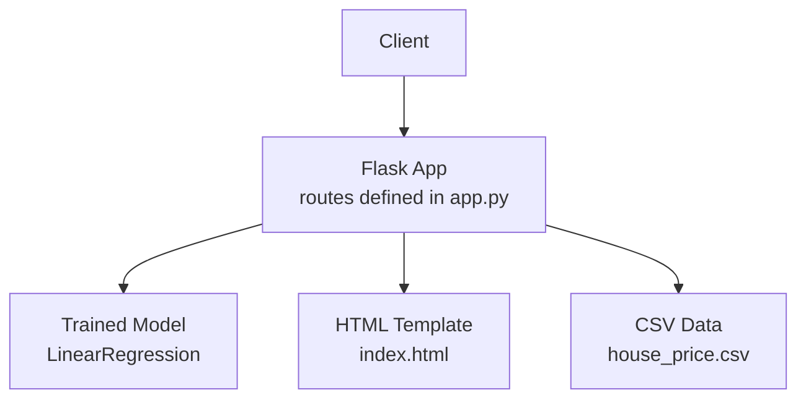
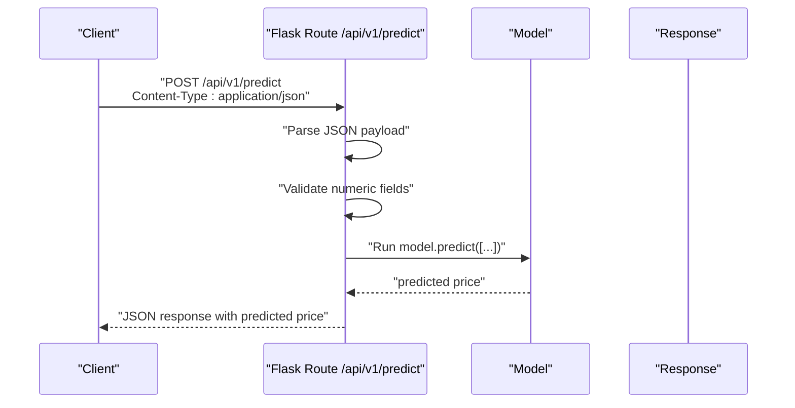
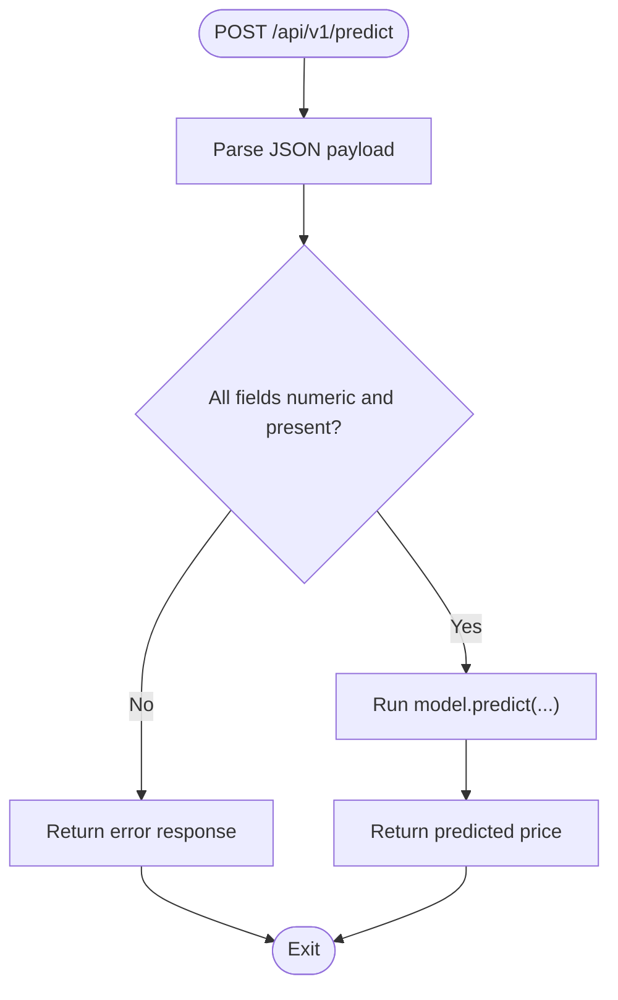
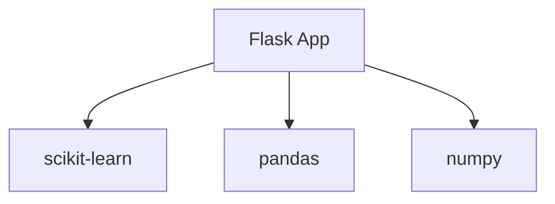

# REST API

<cite>
**Referenced Files in This Document**
- [app.py](file://House_Price_Prediction-main/housing1/app.py)
- [index.html](file://House_Price_Prediction-main/housing1/templates/index.html)
- [MLOPS_WORKFLOW.md](file://House_Price_Prediction-main/housing1/MLOPS_WORKFLOW.md)
- [DEPLOYMENT_GUIDE.md](file://House_Price_Prediction-main/housing1/DEPLOYMENT_GUIDE.md)
- [config.yaml](file://House_Price_Prediction-main/housing1/configs/config.yaml)
- [requirements.txt](file://House_Price_Prediction-main/requirements.txt)
</cite>

## Table of Contents
1. [Introduction](#introduction)
2. [Project Structure](#project-structure)
3. [Core Components](#core-components)
4. [Architecture Overview](#architecture-overview)
5. [Detailed Component Analysis](#detailed-component-analysis)
6. [Dependency Analysis](#dependency-analysis)
7. [Performance Considerations](#performance-considerations)
8. [Troubleshooting Guide](#troubleshooting-guide)
9. [Conclusion](#conclusion)
10. [Appendices](#appendices)

## Introduction
This document provides comprehensive REST API documentation for the JSON-based prediction endpoint. It focuses on the POST /api/v1/predict endpoint, detailing request and response schemas, validation requirements, HTTP behavior, and client integration examples. It also covers API versioning, content-type headers, and operational guidance for production usage.

## Project Structure
The application is a Flask-based service that exposes both a web UI and a REST API. The API endpoint is defined in the main Flask application module and is intended to accept JSON payloads representing seven house features and return a predicted price.

**Diagram sources**
- [app.py:1-113](file://House_Price_Prediction-main/housing1/app.py#L1-L113)
- [index.html:1-145](file://House_Price_Prediction-main/housing1/templates/index.html#L1-L145)

**Section sources**
- [app.py:1-113](file://House_Price_Prediction-main/housing1/app.py#L1-L113)
- [index.html:1-145](file://House_Price_Prediction-main/housing1/templates/index.html#L1-L145)

## Core Components
- Flask application with routing for the prediction endpoint
- HTML template that renders prediction results
- Configuration and deployment guidance indicating the presence of a REST API endpoint

Key facts derived from the repository:
- The repository documentation explicitly lists POST /api/v1/predict as an API endpoint alongside others such as GET /, GET /health, and GET /metrics.
- The deployment guide demonstrates a curl example invoking POST /api/v1/predict with Content-Type: application/json and a JSON body containing house features.
- The HTML form in the template indicates the seven input fields expected by the backend.

**Section sources**
- [MLOPS_WORKFLOW.md:150-163](file://House_Price_Prediction-main/housing1/MLOPS_WORKFLOW.md#L150-L163)
- [DEPLOYMENT_GUIDE.md:147-216](file://House_Price_Prediction-main/housing1/DEPLOYMENT_GUIDE.md#L147-L216)
- [index.html:83-127](file://House_Price_Prediction-main/housing1/templates/index.html#L83-L127)

## Architecture Overview
The REST API endpoint is part of a Flask application. Requests are processed by the Flask route handler, which extracts parameters, prepares a model input array, performs inference, and returns a structured response.

**Diagram sources**
- [MLOPS_WORKFLOW.md:150-163](file://House_Price_Prediction-main/housing1/MLOPS_WORKFLOW.md#L150-L163)
- [app.py:42-66](file://House_Price_Prediction-main/housing1/app.py#L42-L66)

## Detailed Component Analysis

### Endpoint Definition: POST /api/v1/predict
- Purpose: Accepts a JSON payload with seven house features and returns a predicted price.
- Method: POST
- Versioning: /api/v1 indicates API versioning.
- Content-Type: application/json
- Authentication: Not specified in the repository; consult deployment configuration for production settings.

Request Schema (application/json)
- Fields:
  - Area: number (required)
  - Bedrooms: number (required)
  - Bathrooms: number (required)
  - Stories: number (required)
  - Parking: number (required)
  - Age: number (required)
  - Location: number (required)
- All fields must be numeric; invalid or missing fields will cause validation errors.

Response Schema (application/json)
- Fields:
  - predicted_price: number (predicted house price)
- Additional fields may be present depending on the implementation.

Validation Requirements
- All seven fields must be present and convertible to numbers.
- Non-numeric values or missing fields will lead to errors.

HTTP Behavior
- Successful requests return a 200 OK response with the predicted price.
- Validation failures return appropriate error responses (see Troubleshooting Guide).

Example Request Body
{
  "Area": 2000,
  "Bedrooms": 3,
  "Bathrooms": 2,
  "Stories": 1,
  "Parking": 2,
  "Age": 5,
  "Location": 1
}

Expected Response
{
  "predicted_price": 4500000
}

Error Response
{
  "error": "Invalid input",
  "message": "All fields must be numeric and present"
}

Notes
- The repository documentation confirms the endpoint and curl usage pattern.
- The HTML form in the template enumerates the seven fields expected by the backend.

**Section sources**
- [MLOPS_WORKFLOW.md:150-163](file://House_Price_Prediction-main/housing1/MLOPS_WORKFLOW.md#L150-L163)
- [index.html:83-127](file://House_Price_Prediction-main/housing1/templates/index.html#L83-L127)

### Implementation Flow
The Flask route processes the request, validates inputs, constructs a model input array, runs inference, and returns a response. The repository documentation indicates the endpoint’s existence and usage.

**Diagram sources**
- [MLOPS_WORKFLOW.md:150-163](file://House_Price_Prediction-main/housing1/MLOPS_WORKFLOW.md#L150-L163)
- [app.py:42-66](file://House_Price_Prediction-main/housing1/app.py#L42-L66)

**Section sources**
- [app.py:42-66](file://House_Price_Prediction-main/housing1/app.py#L42-L66)

### Client Integration Examples
Below are examples of how to call the endpoint using common HTTP clients. Replace placeholders with actual values.

- Using curl
  - Command: curl -X POST http://localhost:5000/api/v1/predict -H "Content-Type: application/json" -d '{"Area":2000,"Bedrooms":3,"Bathrooms":2,"Stories":1,"Parking":2,"Age":5,"Location":1}'
  - Expected response: {"predicted_price": <number>}

- Using Python (requests)
  - Construct payload as a dictionary with the seven fields.
  - Send POST request with headers {"Content-Type": "application/json"}.
  - Parse response JSON for predicted_price.

- Using JavaScript (fetch)
  - Build a JSON object with the seven fields.
  - Issue a POST request with headers {"Content-Type": "application/json"}.
  - Extract predicted_price from the parsed JSON response.

- Using Java (OkHttp)
  - Create a RequestBody with JSON content.
  - Configure request header Content-Type: application/json.
  - Execute request and parse JSON response for predicted_price.

- Using cURL with file
  - Save the JSON payload to a file.
  - Use curl --data @payload.json to send the request.

Best Practices
- Always set Content-Type: application/json.
- Validate inputs on the client side before sending.
- Handle error responses gracefully.
- Implement retries and timeouts for production clients.

**Section sources**
- [MLOPS_WORKFLOW.md:150-163](file://House_Price_Prediction-main/housing1/MLOPS_WORKFLOW.md#L150-L163)

## Dependency Analysis
The Flask application depends on machine learning and data processing libraries for model training and inference. The API endpoint leverages a pre-trained model to produce predictions.

**Diagram sources**
- [requirements.txt:2-10](file://House_Price_Prediction-main/requirements.txt#L2-L10)
- [app.py:1-14](file://House_Price_Prediction-main/housing1/app.py#L1-L14)

**Section sources**
- [requirements.txt:1-21](file://House_Price_Prediction-main/requirements.txt#L1-L21)
- [app.py:1-14](file://House_Price_Prediction-main/housing1/app.py#L1-L14)

## Performance Considerations
- Model inference is performed in-process; keep payloads minimal and avoid unnecessary conversions.
- For high-throughput scenarios, consider deploying behind a reverse proxy and scaling horizontally.
- Monitor memory and CPU usage during inference, especially with larger batches.
- Use production-grade WSGI servers and configure worker processes appropriately.

## Troubleshooting Guide
Common Issues and Resolutions
- Invalid JSON payload
  - Symptom: Malformed JSON or missing Content-Type header.
  - Resolution: Ensure the payload is valid JSON and Content-Type is application/json.

- Missing or non-numeric fields
  - Symptom: Validation errors indicating missing or invalid fields.
  - Resolution: Provide all seven fields as numbers (int or float).

- Unexpected response format
  - Symptom: Response does not match expected schema.
  - Resolution: Confirm endpoint path (/api/v1/predict) and versioning.

Operational Checks
- Verify the application is running and reachable at the configured host and port.
- Confirm the model was loaded successfully during startup.
- Review logs for error messages related to prediction or validation.

**Section sources**
- [DEPLOYMENT_GUIDE.md:147-216](file://House_Price_Prediction-main/housing1/DEPLOYMENT_GUIDE.md#L147-L216)
- [app.py:42-66](file://House_Price_Prediction-main/housing1/app.py#L42-L66)

## Conclusion
The POST /api/v1/predict endpoint provides a straightforward JSON interface for house price predictions. By adhering to the documented request/response schemas, setting the correct Content-Type, and implementing robust error handling, clients can integrate the endpoint reliably. For production deployments, ensure proper configuration, monitoring, and scaling strategies.

## Appendices

### API Reference Summary
- Endpoint: POST /api/v1/predict
- Content-Type: application/json
- Request Body: Seven numeric fields (Area, Bedrooms, Bathrooms, Stories, Parking, Age, Location)
- Response Body: predicted_price (number)
- Status Codes:
  - 200 OK: Successful prediction
  - 400 Bad Request: Validation failure (invalid or missing fields)
  - 500 Internal Server Error: Unexpected server error

### Configuration and Environment
- Host and Port: Configurable via environment variables and configuration files.
- Debug Mode: Controlled via configuration; disable for production.
- Workers: Configurable for production deployments.

**Section sources**
- [config.yaml:48-54](file://House_Price_Prediction-main/housing1/configs/config.yaml#L48-L54)
- [app.py:105-113](file://House_Price_Prediction-main/housing1/app.py#L105-L113)