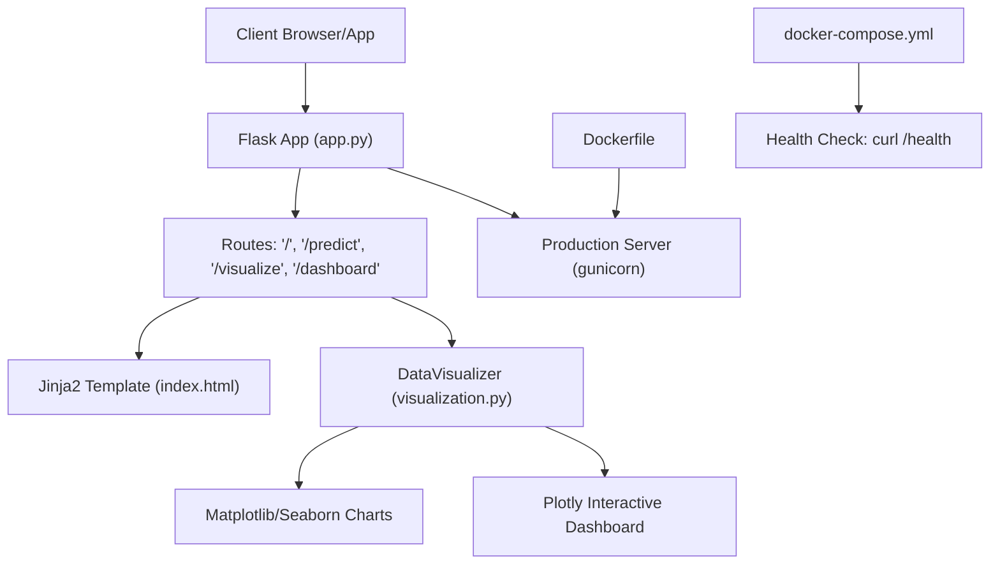
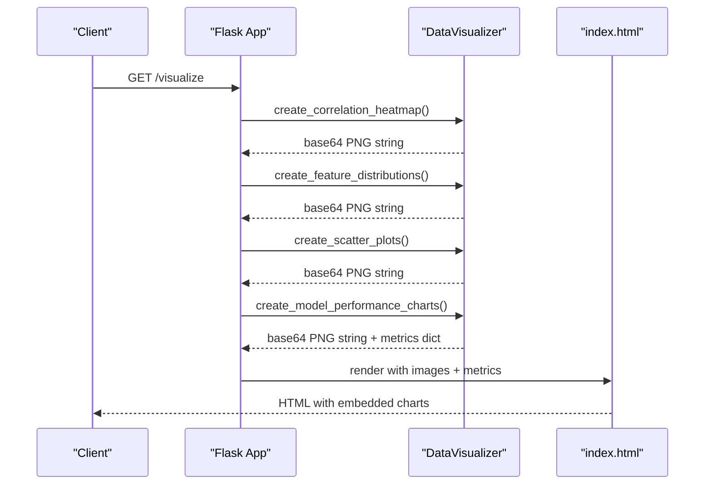
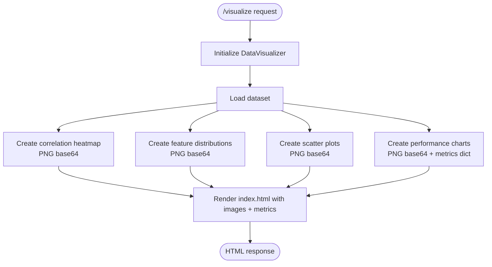
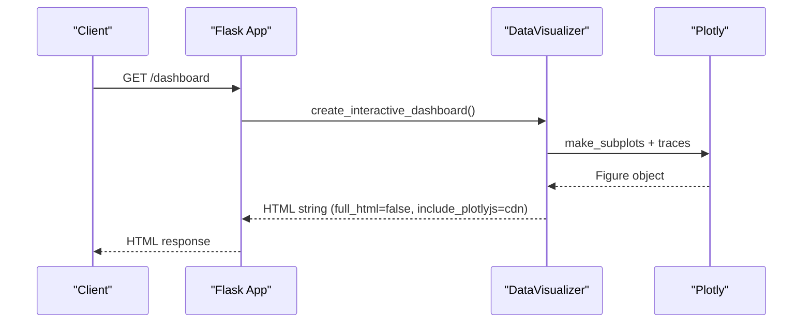
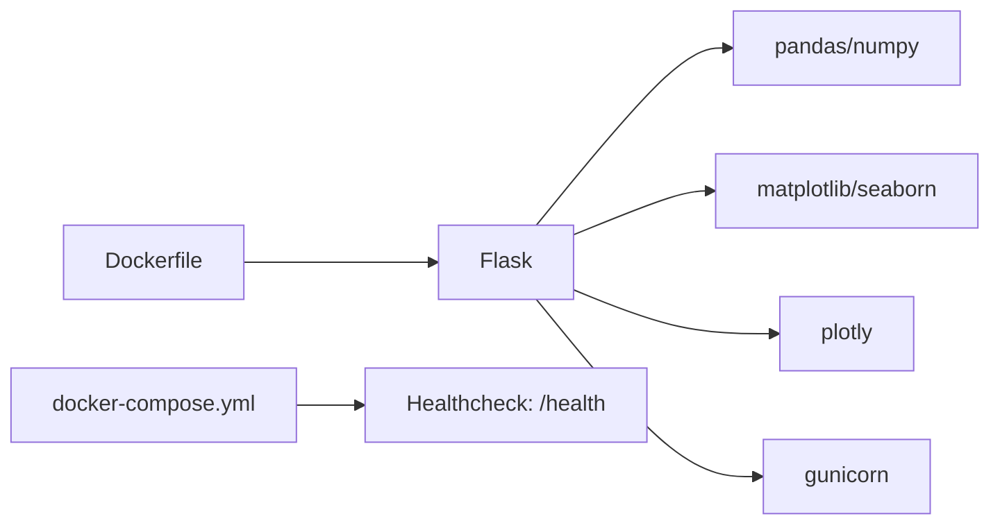

# System Endpoints

<cite>
**Referenced Files in This Document**
- [app.py](file://House_Price_Prediction-main/housing1/app.py)
- [visualization.py](file://House_Price_Prediction-main/housing1/visualization.py)
- [index.html](file://House_Price_Prediction-main/housing1/templates/index.html)
- [docker-compose.yml](file://House_Price_Prediction-main/housing1/docker-compose.yml)
- [Dockerfile](file://House_Price_Prediction-main/housing1/Dockerfile)
- [README.md](file://House_Price_Prediction-main/housing1/README.md)
- [requirements.txt](file://House_Price_Prediction-main/housing1/requirements.txt)
</cite>

## Table of Contents
1. [Introduction](#introduction)
2. [Project Structure](#project-structure)
3. [Core Components](#core-components)
4. [Architecture Overview](#architecture-overview)
5. [Detailed Component Analysis](#detailed-component-analysis)
6. [Dependency Analysis](#dependency-analysis)
7. [Performance Considerations](#performance-considerations)
8. [Troubleshooting Guide](#troubleshooting-guide)
9. [Conclusion](#conclusion)

## Introduction
This document describes the system-level endpoints for health monitoring and visualization dashboards. It focuses on:
- GET /health: System health monitoring endpoint used by orchestration platforms for readiness/liveness checks
- GET /visualize: Data visualization rendering endpoint returning correlation heatmaps, feature distributions, scatter plots, and model performance charts
- GET /dashboard: Interactive analytics dashboard endpoint powered by Plotly

It also documents response formats, data structures, and integration patterns for embedding visualizations in external applications.

## Project Structure
The application is structured around a Flask web server that serves both the UI and visualization endpoints. Key components:
- Flask application entry point and route definitions
- Visualization module encapsulating plotting logic and interactive dashboards
- Jinja2 template rendering visualizations into the UI
- Docker and Docker Compose configuration for containerized deployment and health checks

**Diagram sources**
- [app.py:1-113](file://House_Price_Prediction-main/housing1/app.py#L1-L113)
- [visualization.py:1-348](file://House_Price_Prediction-main/housing1/visualization.py#L1-L348)
- [index.html:1-145](file://House_Price_Prediction-main/housing1/templates/index.html#L1-L145)
- [Dockerfile:1-39](file://House_Price_Prediction-main/housing1/Dockerfile#L1-L39)
- [docker-compose.yml:1-51](file://House_Price_Prediction-main/housing1/docker-compose.yml#L1-L51)

**Section sources**
- [app.py:1-113](file://House_Price_Prediction-main/housing1/app.py#L1-L113)
- [visualization.py:1-348](file://House_Price_Prediction-main/housing1/visualization.py#L1-L348)
- [index.html:1-145](file://House_Price_Prediction-main/housing1/templates/index.html#L1-L145)
- [Dockerfile:1-39](file://House_Price_Prediction-main/housing1/Dockerfile#L1-L39)
- [docker-compose.yml:1-51](file://House_Price_Prediction-main/housing1/docker-compose.yml#L1-L51)

## Core Components
- Flask application with routes for visualization and dashboard rendering
- DataVisualizer class responsible for generating static PNG charts and interactive Plotly dashboards
- Jinja2 template rendering base64-encoded images and embedded Plotly HTML
- Docker and Docker Compose configuration enabling health checks via curl against /health

Key endpoint behaviors:
- GET /visualize: Returns rendered HTML with four static charts and performance metrics
- GET /dashboard: Returns an interactive Plotly dashboard embedded as HTML
- GET /health: Health check endpoint referenced by Docker Compose for service health

**Section sources**
- [app.py:68-102](file://House_Price_Prediction-main/housing1/app.py#L68-L102)
- [visualization.py:50-293](file://House_Price_Prediction-main/housing1/visualization.py#L50-L293)
- [index.html:21-79](file://House_Price_Prediction-main/housing1/templates/index.html#L21-L79)
- [docker-compose.yml:17-22](file://House_Price_Prediction-main/housing1/docker-compose.yml#L17-L22)

## Architecture Overview
The visualization stack integrates static chart generation and interactive dashboards:
- Static charts are generated with Matplotlib/Seaborn and encoded as base64 PNG strings
- Interactive dashboard is generated with Plotly and embedded as HTML
- Both are rendered in the same UI template for unified presentation

**Diagram sources**
- [app.py:68-89](file://House_Price_Prediction-main/housing1/app.py#L68-L89)
- [visualization.py:50-239](file://House_Price_Prediction-main/housing1/visualization.py#L50-L239)
- [index.html:21-71](file://House_Price_Prediction-main/housing1/templates/index.html#L21-L71)

## Detailed Component Analysis

### GET /health Endpoint
- Purpose: System health monitoring for container orchestrators
- Implementation: Referenced in Docker Compose healthcheck to curl http://localhost:5000/health
- Behavior: Used by Docker to determine service readiness; the actual Flask route for /health is not present in the current codebase snapshot
- Integration pattern: Configure health checks to probe /health in production environments

Operational notes:
- The Docker Compose healthcheck expects /health to be available
- If implementing /health, return a simple JSON body indicating service status and optionally include uptime, service version, and dependency health

**Section sources**
- [docker-compose.yml:17-22](file://House_Price_Prediction-main/housing1/docker-compose.yml#L17-L22)
- [README.md:420-423](file://House_Price_Prediction-main/housing1/README.md#L420-L423)

### GET /visualize Endpoint
- Purpose: Render static data visualizations and performance metrics
- Route handler: GET /visualize in Flask app
- Chart types:
  - Correlation heatmap
  - Feature distributions
  - Scatter plots (features vs target)
  - Model performance charts (actual vs predicted, residuals, feature importance, metrics)
- Response format: HTML page containing embedded base64-encoded PNG images and a metrics table
- Data structures returned:
  - Base64-encoded PNG strings for each chart
  - Metrics dictionary with keys: r2, mae, mse, rmse

Rendering pipeline:
- DataVisualizer loads data and computes insights
- Generates Matplotlib figures, saves to BytesIO, encodes to base64
- Flask route passes images and metrics to the Jinja2 template
- Template renders images with data:image/png;base64, and displays metrics in a table

**Diagram sources**
- [app.py:68-89](file://House_Price_Prediction-main/housing1/app.py#L68-L89)
- [visualization.py:50-239](file://House_Price_Prediction-main/housing1/visualization.py#L50-L239)
- [index.html:21-71](file://House_Price_Prediction-main/housing1/templates/index.html#L21-L71)

**Section sources**
- [app.py:68-89](file://House_Price_Prediction-main/housing1/app.py#L68-L89)
- [visualization.py:50-239](file://House_Price_Prediction-main/housing1/visualization.py#L50-L239)
- [index.html:21-71](file://House_Price_Prediction-main/housing1/templates/index.html#L21-L71)

### GET /dashboard Endpoint
- Purpose: Serve an interactive analytics dashboard
- Route handler: GET /dashboard in Flask app
- Visualization technology: Plotly subplots with interactive HTML
- Response format: HTML snippet embeddable in any web page (includes Plotly.js CDN)
- Dashboard content:
  - Price distribution histogram
  - Area vs Price scatter plot
  - Bedrooms vs Price box plot
  - Correlation heatmap

Embedding pattern:
- The dashboard is returned as a single HTML string suitable for insertion into external pages
- No additional JavaScript required beyond the included Plotly CDN

**Diagram sources**
- [app.py:92-102](file://House_Price_Prediction-main/housing1/app.py#L92-L102)
- [visualization.py:241-293](file://House_Price_Prediction-main/housing1/visualization.py#L241-L293)

**Section sources**
- [app.py:92-102](file://House_Price_Prediction-main/housing1/app.py#L92-L102)
- [visualization.py:241-293](file://House_Price_Prediction-main/housing1/visualization.py#L241-L293)

### Visualization Data Structures
Static charts (PNG base64):
- Each chart is a separate base64-encoded PNG string
- Images are embedded directly in the HTML template

Metrics payload:
- Returned alongside static performance charts
- Keys: r2 (float), mae (float), mse (float), rmse (float)

Interactive dashboard:
- Returns a single HTML string containing Plotly-rendered subplots
- Includes Plotly.js from CDN for interactivity

Integration examples:
- Embed the dashboard HTML into an iframe or div in external applications
- For programmatic consumption, fetch /dashboard and inject the returned HTML into a DOM element

**Section sources**
- [visualization.py:149-239](file://House_Price_Prediction-main/housing1/visualization.py#L149-L239)
- [visualization.py:241-293](file://House_Price_Prediction-main/housing1/visualization.py#L241-L293)
- [index.html:76-78](file://House_Price_Prediction-main/housing1/templates/index.html#L76-L78)

## Dependency Analysis
External libraries and their roles:
- Flask: Web framework hosting endpoints
- Pandas/Numpy: Data loading and numerical operations
- Matplotlib/Seaborn: Static chart generation
- Plotly: Interactive dashboard creation
- Gunicorn: Production WSGI server
- Docker/Prometheus-client: Containerization and optional metrics exposure

**Diagram sources**
- [requirements.txt:1-21](file://House_Price_Prediction-main/housing1/requirements.txt#L1-L21)
- [Dockerfile:1-39](file://House_Price_Prediction-main/housing1/Dockerfile#L1-L39)
- [docker-compose.yml:17-22](file://House_Price_Prediction-main/housing1/docker-compose.yml#L17-L22)

**Section sources**
- [requirements.txt:1-21](file://House_Price_Prediction-main/housing1/requirements.txt#L1-L21)
- [Dockerfile:1-39](file://House_Price_Prediction-main/housing1/Dockerfile#L1-L39)
- [docker-compose.yml:1-51](file://House_Price_Prediction-main/housing1/docker-compose.yml#L1-L51)

## Performance Considerations
- Static chart generation: Matplotlib figures are saved to memory buffers and base64-encoded; avoid excessive concurrent requests to prevent memory spikes
- Interactive dashboard: Plotly HTML includes a CDN-hosted JavaScript bundle; network latency may affect initial load
- Data loading: Dataset is loaded once per request lifecycle; consider caching for repeated calls in production
- Rendering: PNG generation occurs on demand; consider pre-generating and caching popular views for high-traffic scenarios

## Troubleshooting Guide
Common issues and resolutions:
- Missing dataset: Ensure Data/house_price.csv exists; the visualization module attempts to load it from the project root
- Empty or corrupted dataset: Data loading errors will be printed; verify CSV formatting and column names
- Health check failures: The Docker Compose healthcheck probes /health; implement the route or adjust healthcheck configuration
- Dashboard not interactive: Confirm that the client includes internet access for the Plotly CDN; alternatively, host Plotly locally
- Port binding: The application reads PORT from environment variables; ensure the container exposes the correct port

**Section sources**
- [visualization.py:40-48](file://House_Price_Prediction-main/housing1/visualization.py#L40-L48)
- [docker-compose.yml:17-22](file://House_Price_Prediction-main/housing1/docker-compose.yml#L17-L22)
- [Dockerfile:35-38](file://House_Price_Prediction-main/housing1/Dockerfile#L35-L38)

## Conclusion
The system provides:
- A health check endpoint referenced for container orchestration
- A visualization endpoint delivering static charts and metrics
- An interactive dashboard endpoint for rich analytics

For production, consider implementing the /health route, adding rate limiting for visualization endpoints, and caching frequently accessed charts. The modular design allows easy extension with additional metrics and visualizations.