# Architecture & Design

<cite>
**Referenced Files in This Document**
- [app.py](file://House_Price_Prediction-main/housing1/app.py)
- [main.py](file://House_Price_Prediction-main/housing1/main.py)
- [src/__init__.py](file://House_Price_Prediction-main/housing1/src/__init__.py)
- [src/config.py](file://House_Price_Prediction-main/housing1/src/config.py)
- [src/data.py](file://House_Price_Prediction-main/housing1/src/data.py)
- [src/model.py](file://House_Price_Prediction-main/housing1/src/model.py)
- [src/monitoring.py](file://House_Price_Prediction-main/housing1/src/monitoring.py)
- [src/tracking.py](file://House_Price_Prediction-main/housing1/src/tracking.py)
- [src/validation.py](file://House_Price_Prediction-main/housing1/src/validation.py)
- [visualization.py](file://House_Price_Prediction-main/housing1/visualization.py)
- [configs/config.yaml](file://House_Price_Prediction-main/housing1/configs/config.yaml)
- [requirements.txt](file://House_Price_Prediction-main/housing1/requirements.txt)
- [.github/workflows/mlops_pipeline.yml](file://House_Price_Prediction-main/housing1/.github/workflows/mlops_pipeline.yml)
- [docker-compose.yml](file://House_Price_Prediction-main/housing1/docker-compose.yml)
- [Dockerfile](file://House_Price_Prediction-main/housing1/Dockerfile)
- [templates/index.html](file://House_Price_Prediction-main/housing1/templates/index.html)
- [setup.py](file://House_Price_Prediction-main/housing1/setup.py)
- [pyproject.toml](file://House_Price_Prediction-main/housing1/pyproject.toml)
</cite>

## Table of Contents
1. [Introduction](#introduction)
2. [Project Structure](#project-structure)
3. [Core Components](#core-components)
4. [Architecture Overview](#architecture-overview)
5. [Detailed Component Analysis](#detailed-component-analysis)
6. [Dependency Analysis](#dependency-analysis)
7. [Performance Considerations](#performance-considerations)
8. [Troubleshooting Guide](#troubleshooting-guide)
9. [Conclusion](#conclusion)
10. [Appendices](#appendices)

## Introduction
This document describes the architecture and design of the House Price Prediction MLOps system. It explains how the Flask web application integrates with modular Python components for data processing, model training, monitoring, and visualization. The system follows MLOps best practices with YAML-based configuration, a factory-like model creation mechanism, and a strategy-like selection of algorithms. It also documents infrastructure requirements, deployment topology, and cross-cutting concerns such as security, monitoring, and disaster recovery.

## Project Structure
The project is organized around a Flask web application and a modular Python package under src/. Configuration is centralized via YAML, while MLOps workflows are defined in GitHub Actions. Docker and docker-compose support containerized deployment and orchestration.

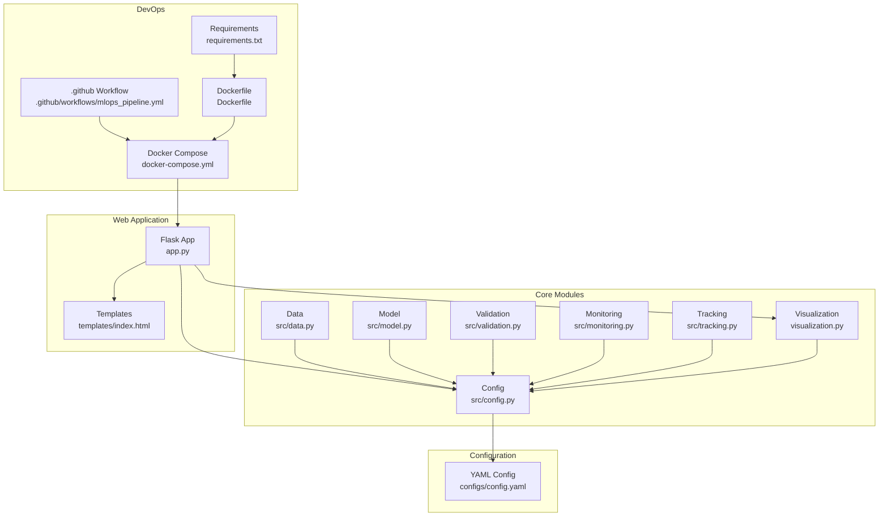

**Diagram sources**
- [app.py:1-109](file://House_Price_Prediction-main/housing1/app.py#L1-L109)
- [src/config.py:1-63](file://House_Price_Prediction-main/housing1/src/config.py#L1-L63)
- [src/data.py:1-109](file://House_Price_Prediction-main/housing1/src/data.py#L1-L109)
- [src/model.py:1-155](file://House_Price_Prediction-main/housing1/src/model.py#L1-L155)
- [src/validation.py:1-243](file://House_Price_Prediction-main/housing1/src/validation.py#L1-L243)
- [src/monitoring.py:1-218](file://House_Price_Prediction-main/housing1/src/monitoring.py#L1-L218)
- [src/tracking.py:1-218](file://House_Price_Prediction-main/housing1/src/tracking.py#L1-L218)
- [visualization.py:1-344](file://House_Price_Prediction-main/housing1/visualization.py#L1-L344)
- [configs/config.yaml:1-60](file://House_Price_Prediction-main/housing1/configs/config.yaml#L1-L60)
- [.github/workflows/mlops_pipeline.yml:1-180](file://House_Price_Prediction-main/housing1/.github/workflows/mlops_pipeline.yml#L1-L180)
- [docker-compose.yml:1-52](file://House_Price_Prediction-main/housing1/docker-compose.yml#L1-L52)
- [Dockerfile:1-39](file://House_Price_Prediction-main/housing1/Dockerfile#L1-L39)
- [requirements.txt:1-24](file://House_Price_Prediction-main/housing1/requirements.txt#L1-L24)
- [templates/index.html:1-145](file://House_Price_Prediction-main/housing1/templates/index.html#L1-L145)

**Section sources**
- [app.py:1-109](file://House_Price_Prediction-main/housing1/app.py#L1-L109)
- [src/config.py:1-63](file://House_Price_Prediction-main/housing1/src/config.py#L1-L63)
- [configs/config.yaml:1-60](file://House_Price_Prediction-main/housing1/configs/config.yaml#L1-L60)
- [.github/workflows/mlops_pipeline.yml:1-180](file://House_Price_Prediction-main/housing1/.github/workflows/mlops_pipeline.yml#L1-L180)
- [docker-compose.yml:1-52](file://House_Price_Prediction-main/housing1/docker-compose.yml#L1-L52)
- [Dockerfile:1-39](file://House_Price_Prediction-main/housing1/Dockerfile#L1-L39)
- [requirements.txt:1-24](file://House_Price_Prediction-main/housing1/requirements.txt#L1-L24)
- [templates/index.html:1-145](file://House_Price_Prediction-main/housing1/templates/index.html#L1-L145)

## Core Components
- Flask Web Application: Serves prediction forms, renders visualizations, and exposes routes for inference and dashboards.
- Configuration Manager: Loads and exposes YAML-based configuration for data paths, model settings, training parameters, monitoring thresholds, and API settings.
- Data Pipeline: Loads CSV data, validates schema and quality, prepares features, splits into train/test sets, and persists processed datasets.
- Model Trainer/Evaluator: Factory-style model creation supporting linear regression, random forest, and gradient boosting; evaluates metrics and saves models.
- Validation and Drift Detection: Validates schema/dtypes, detects data drift using configurable methods, and reports quality metrics.
- Monitoring and Logging: Centralized logging, prediction and performance logs, drift alerts, and degradation tracking.
- Experiment Tracking and Registry: Tracks runs, metrics, and artifacts; registers model versions with metadata.
- Visualization: Generates static charts and interactive dashboards for insights and performance.
- DevOps: GitHub Actions workflow for CI/CD, Docker image build, model validation, and optional deployment stages.

**Section sources**
- [app.py:33-98](file://House_Price_Prediction-main/housing1/app.py#L33-L98)
- [src/config.py:10-63](file://House_Price_Prediction-main/housing1/src/config.py#L10-L63)
- [src/data.py:13-109](file://House_Price_Prediction-main/housing1/src/data.py#L13-L109)
- [src/model.py:17-155](file://House_Price_Prediction-main/housing1/src/model.py#L17-L155)
- [src/validation.py:14-243](file://House_Price_Prediction-main/housing1/src/validation.py#L14-L243)
- [src/monitoring.py:15-218](file://House_Price_Prediction-main/housing1/src/monitoring.py#L15-L218)
- [src/tracking.py:14-218](file://House_Price_Prediction-main/housing1/src/tracking.py#L14-L218)
- [visualization.py:23-344](file://House_Price_Prediction-main/housing1/visualization.py#L23-L344)

## Architecture Overview
The system follows a layered architecture:
- Presentation Layer: Flask routes and Jinja templates render prediction forms, visualizations, and dashboards.
- Business Logic Layer: Modular components encapsulate data processing, model training, validation, monitoring, and tracking.
- Persistence Layer: YAML configuration, CSV datasets, processed data, trained models, logs, and experiment artifacts.
- Orchestration Layer: GitHub Actions workflow automates testing, building, validating models, and deploying to environments.

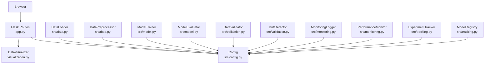

**Diagram sources**
- [app.py:1-109](file://House_Price_Prediction-main/housing1/app.py#L1-L109)
- [visualization.py:23-344](file://House_Price_Prediction-main/housing1/visualization.py#L23-L344)
- [src/config.py:10-63](file://House_Price_Prediction-main/housing1/src/config.py#L10-L63)
- [src/data.py:13-109](file://House_Price_Prediction-main/housing1/src/data.py#L13-L109)
- [src/model.py:17-155](file://House_Price_Prediction-main/housing1/src/model.py#L17-L155)
- [src/validation.py:14-243](file://House_Price_Prediction-main/housing1/src/validation.py#L14-L243)
- [src/monitoring.py:15-218](file://House_Price_Prediction-main/housing1/src/monitoring.py#L15-L218)
- [src/tracking.py:14-218](file://House_Price_Prediction-main/housing1/src/tracking.py#L14-L218)

## Detailed Component Analysis

### Flask Web Application (MVC-like)
- Routes:
  - GET "/": Renders the prediction form.
  - POST "/predict": Accepts form inputs, prepares a feature vector, performs inference, and returns a rendered page with the predicted price.
  - GET "/visualize": Renders static visualizations and metrics.
  - GET "/dashboard": Renders an interactive Plotly dashboard.
- Template Integration: Uses Jinja templates to render dynamic content and pass visualization assets.
- Environment-aware startup: Reads PORT from environment and toggles debug mode depending on deployment context.

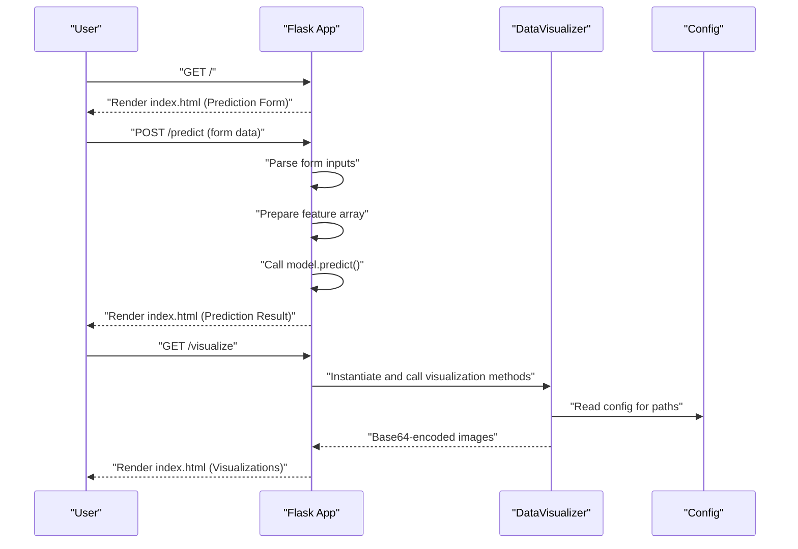

**Diagram sources**
- [app.py:33-98](file://House_Price_Prediction-main/housing1/app.py#L33-L98)
- [visualization.py:23-344](file://House_Price_Prediction-main/housing1/visualization.py#L23-L344)
- [src/config.py:10-63](file://House_Price_Prediction-main/housing1/src/config.py#L10-L63)

**Section sources**
- [app.py:33-98](file://House_Price_Prediction-main/housing1/app.py#L33-L98)
- [templates/index.html:1-145](file://House_Price_Prediction-main/housing1/templates/index.html#L1-L145)

### Configuration Management (YAML-based)
- Loads configuration from a YAML file with sections for project, data, model, training, experiment tracking, monitoring, API, and logging.
- Provides getters for nested keys and defaults, enabling decoupled configuration access across modules.

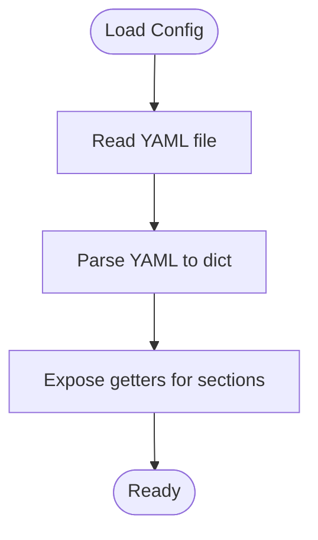

**Diagram sources**
- [src/config.py:17-37](file://House_Price_Prediction-main/housing1/src/config.py#L17-L37)
- [configs/config.yaml:1-60](file://House_Price_Prediction-main/housing1/configs/config.yaml#L1-L60)

**Section sources**
- [src/config.py:10-63](file://House_Price_Prediction-main/housing1/src/config.py#L10-L63)
- [configs/config.yaml:1-60](file://House_Price_Prediction-main/housing1/configs/config.yaml#L1-L60)

### Data Processing Pipeline
- DataLoader: Loads CSV data with robust error handling.
- DataPreprocessor: Separates features/target, splits into train/test sets, and saves processed datasets.

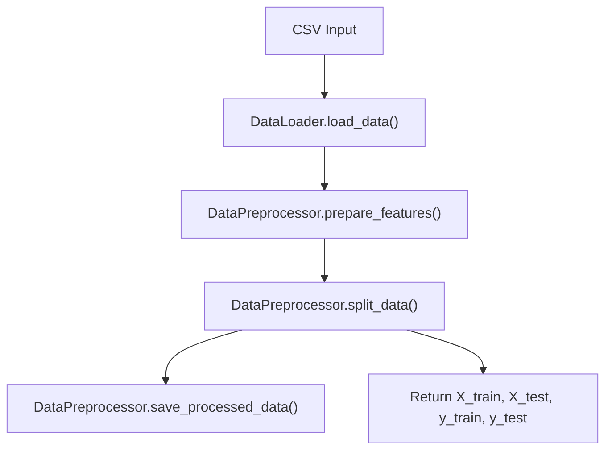

**Diagram sources**
- [src/data.py:20-109](file://House_Price_Prediction-main/housing1/src/data.py#L20-L109)

**Section sources**
- [src/data.py:13-109](file://House_Price_Prediction-main/housing1/src/data.py#L13-L109)

### Model Training and Evaluation (Factory + Strategy)
- ModelTrainer supports multiple algorithms via a configuration-driven factory:
  - linear_regression
  - random_forest
  - gradient_boosting
- ModelEvaluator computes MAE, MSE, RMSE, R² and compares multiple models.
- Models are persisted using joblib and registered with metadata.

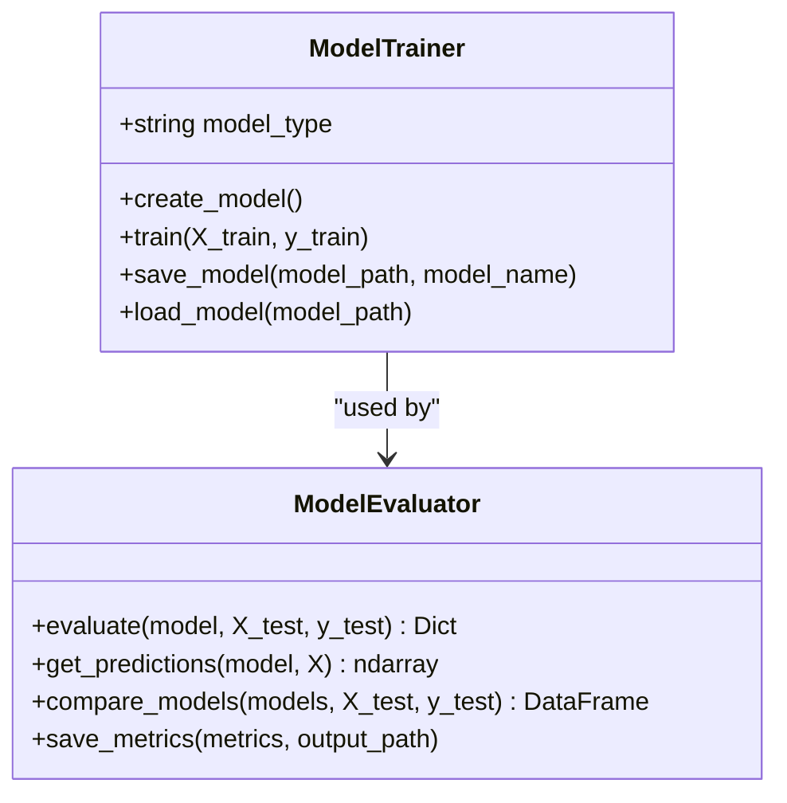

**Diagram sources**
- [src/model.py:17-155](file://House_Price_Prediction-main/housing1/src/model.py#L17-L155)

**Section sources**
- [src/model.py:17-155](file://House_Price_Prediction-main/housing1/src/model.py#L17-L155)

### Validation and Drift Detection
- DataValidator: Enforces schema and data quality checks, generates a quality score.
- DriftDetector: Computes drift using KS test, PSI, or mean-shift thresholds against reference statistics.

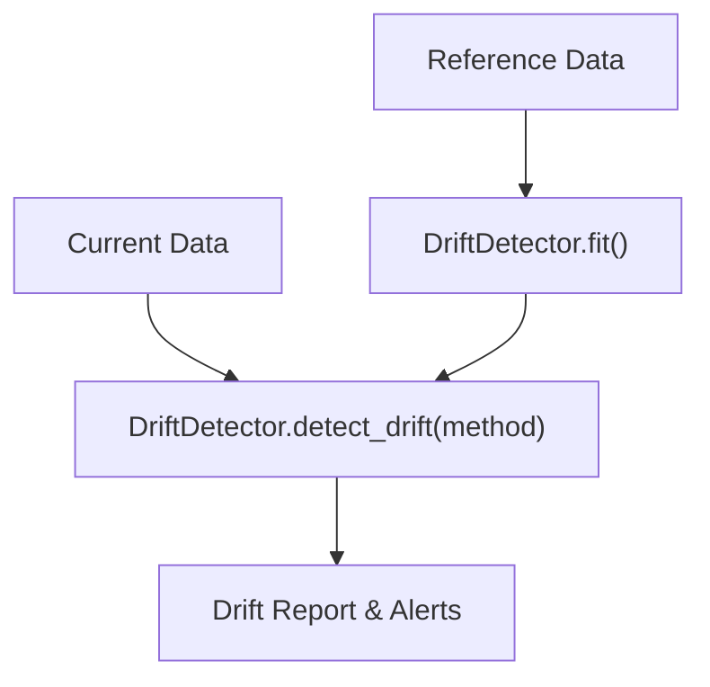

**Diagram sources**
- [src/validation.py:124-243](file://House_Price_Prediction-main/housing1/src/validation.py#L124-L243)

**Section sources**
- [src/validation.py:14-243](file://House_Price_Prediction-main/housing1/src/validation.py#L14-L243)

### Monitoring and Logging
- MonitoringLogger: Logs predictions, performance metrics, drift alerts, and degradation events to files and console.
- PerformanceMonitor: Compares current metrics to baseline thresholds and raises alerts.

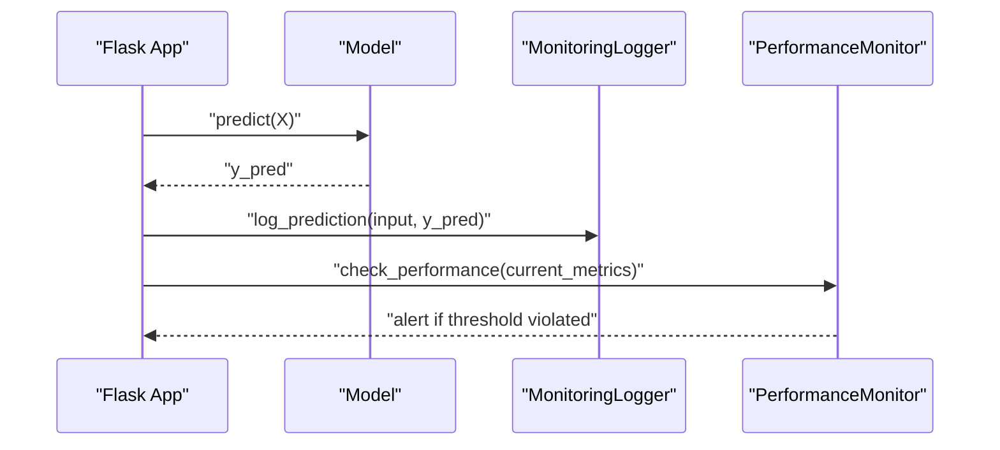

**Diagram sources**
- [app.py:38-62](file://House_Price_Prediction-main/housing1/app.py#L38-L62)
- [src/monitoring.py:15-218](file://House_Price_Prediction-main/housing1/src/monitoring.py#L15-L218)

**Section sources**
- [src/monitoring.py:15-218](file://House_Price_Prediction-main/housing1/src/monitoring.py#L15-L218)

### Experiment Tracking and Model Registry
- ExperimentTracker: Starts runs, logs parameters/metrics/artifacts, saves run metadata, and compares runs.
- ModelRegistry: Registers model versions with metrics and metadata, maintains latest version.

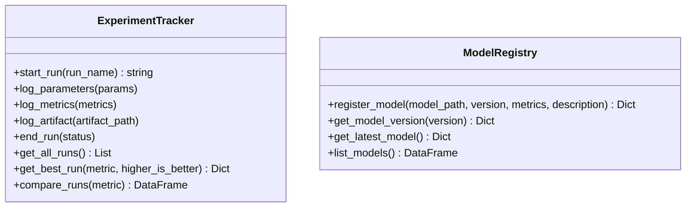

**Diagram sources**
- [src/tracking.py:14-218](file://House_Price_Prediction-main/housing1/src/tracking.py#L14-L218)

**Section sources**
- [src/tracking.py:14-218](file://House_Price_Prediction-main/housing1/src/tracking.py#L14-L218)

### Visualization Module
- DataVisualizer: Creates correlation heatmaps, feature distributions, scatter plots, performance charts, and interactive dashboards using Matplotlib, Seaborn, and Plotly.

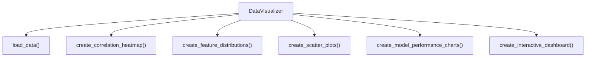

**Diagram sources**
- [visualization.py:23-344](file://House_Price_Prediction-main/housing1/visualization.py#L23-L344)

**Section sources**
- [visualization.py:23-344](file://House_Price_Prediction-main/housing1/visualization.py#L23-L344)

### MLOps Pipeline Integration
- GitHub Actions workflow:
  - Tests, linting, type checking, and coverage.
  - Builds Docker image and uploads as artifact.
  - Validates model training and minimum performance thresholds.
  - Deploys to staging and production with optional integration tests and notifications.

```mermaid
sequenceDiagram
GitPush["Git Push/PR"] --> GH["GitHub Actions"]
GH->>Test["Run tests, lint, type check"]
GH->>Build["Build Docker image"]
GH->>Validate["Validate model training"]
GH->>Deploy["Deploy to staging/production"]
GH->>Notify["Send notifications"]
```

**Diagram sources**
- [.github/workflows/mlops_pipeline.yml:1-180](file://House_Price_Prediction-main/housing1/.github/workflows/mlops_pipeline.yml#L1-L180)

**Section sources**
- [.github/workflows/mlops_pipeline.yml:1-180](file://House_Price_Prediction-main/housing1/.github/workflows/mlops_pipeline.yml#L1-L180)

## Dependency Analysis
- Internal Dependencies:
  - Flask app depends on visualization and configuration modules.
  - Data, model, validation, monitoring, and tracking modules depend on configuration.
- External Dependencies:
  - Flask, scikit-learn, pandas, numpy, matplotlib/seaborn/plotly, gunicorn, pyyaml, joblib, prometheus-client, pytest, flake8, mypy.

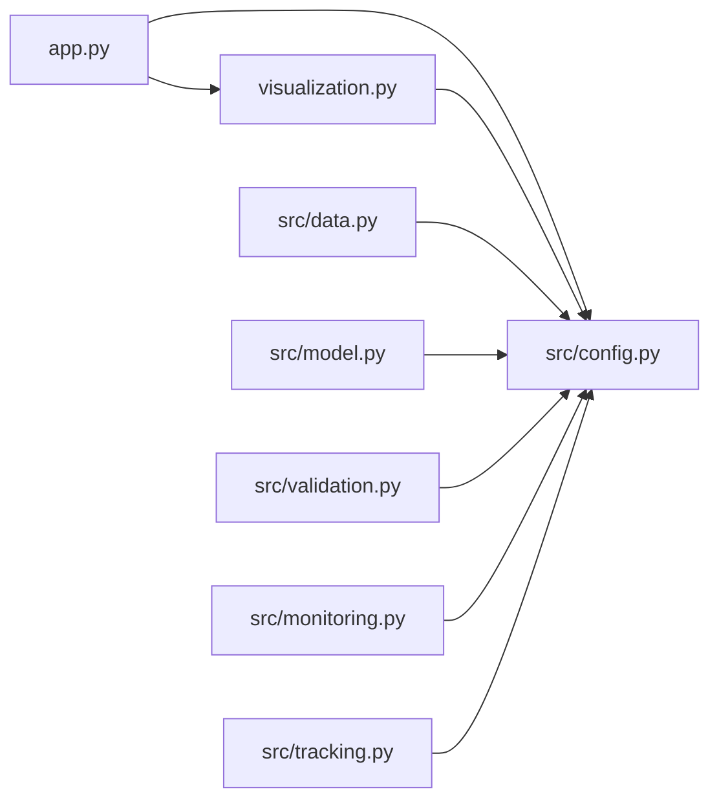

**Diagram sources**
- [app.py:1-109](file://House_Price_Prediction-main/housing1/app.py#L1-L109)
- [visualization.py:1-344](file://House_Price_Prediction-main/housing1/visualization.py#L1-L344)
- [src/config.py:1-63](file://House_Price_Prediction-main/housing1/src/config.py#L1-L63)
- [src/data.py:1-109](file://House_Price_Prediction-main/housing1/src/data.py#L1-L109)
- [src/model.py:1-155](file://House_Price_Prediction-main/housing1/src/model.py#L1-L155)
- [src/validation.py:1-243](file://House_Price_Prediction-main/housing1/src/validation.py#L1-L243)
- [src/monitoring.py:1-218](file://House_Price_Prediction-main/housing1/src/monitoring.py#L1-L218)
- [src/tracking.py:1-218](file://House_Price_Prediction-main/housing1/src/tracking.py#L1-L218)

**Section sources**
- [requirements.txt:1-24](file://House_Price_Prediction-main/housing1/requirements.txt#L1-L24)

## Performance Considerations
- Model Persistence: Using joblib for serialization improves performance for large numpy arrays and scikit-learn estimators.
- Visualization Rendering: Matplotlib Agg backend ensures non-interactive rendering suitable for web serving.
- Inference Throughput: Containerized deployment with Gunicorn workers scales concurrent requests; tune worker count and port exposure per environment.
- Data Processing: Persisting processed datasets reduces repeated computation and enables reproducible splits.

[No sources needed since this section provides general guidance]

## Troubleshooting Guide
- Configuration Issues:
  - Ensure config.yaml exists and is readable; verify paths for raw data, processed data, and model save locations.
- Data Loading Failures:
  - Confirm CSV path matches configured raw_path and contains expected columns.
- Model Persistence/Loading:
  - Verify model save_path and file naming align with configuration; ensure joblib compatibility.
- Monitoring and Alerts:
  - Check logs directory permissions and log file paths; review drift and degradation thresholds.
- DevOps and Deployment:
  - Validate Dockerfile build steps, docker-compose service mapping, and environment variables.

**Section sources**
- [src/config.py:17-37](file://House_Price_Prediction-main/housing1/src/config.py#L17-L37)
- [src/data.py:20-30](file://House_Price_Prediction-main/housing1/src/data.py#L20-L30)
- [src/model.py:62-87](file://House_Price_Prediction-main/housing1/src/model.py#L62-L87)
- [src/monitoring.py:18-42](file://House_Price_Prediction-main/housing1/src/monitoring.py#L18-L42)
- [docker-compose.yml:8-23](file://House_Price_Prediction-main/housing1/docker-compose.yml#L8-L23)

## Conclusion
The House Price Prediction MLOps system integrates a Flask web application with modular Python components for data, modeling, validation, monitoring, and visualization. YAML-based configuration centralizes settings, while factory and strategy patterns enable flexible model creation and evaluation. The GitHub Actions workflow automates CI/CD, and Docker/compose provide containerized deployment. The architecture balances simplicity with MLOps maturity, supporting reproducibility, observability, and scalable delivery.

[No sources needed since this section summarizes without analyzing specific files]

## Appendices

### Infrastructure Requirements and Deployment Topology
- Runtime:
  - Python 3.10, Flask, scikit-learn, pandas, numpy, matplotlib, seaborn, plotly, gunicorn.
- Storage:
  - Persistent volumes for data, models, logs, experiments, and artifacts.
- Networking:
  - Port 5000 exposed; configure reverse proxy/load balancer in production.
- Optional Observability:
  - Prometheus/Grafana stacks can be enabled via docker-compose service blocks.

**Section sources**
- [requirements.txt:1-24](file://House_Price_Prediction-main/housing1/requirements.txt#L1-L24)
- [docker-compose.yml:1-52](file://House_Price_Prediction-main/housing1/docker-compose.yml#L1-L52)
- [Dockerfile:1-39](file://House_Price_Prediction-main/housing1/Dockerfile#L1-L39)

### Security, Monitoring, and Disaster Recovery
- Security:
  - Restrict file permissions for logs and models; avoid exposing sensitive configuration values in templates.
  - Use environment variables for secrets and disable debug mode in production.
- Monitoring:
  - Centralize logs and metrics; integrate Prometheus client for metrics scraping.
- Disaster Recovery:
  - Back up models, logs, and experiment artifacts; maintain immutable model registry entries.

[No sources needed since this section provides general guidance]

### Technology Stack Integration and Compatibility
- Python Packaging and Tooling:
  - Black, isort, pytest, mypy, coverage configured via pyproject.toml.
- Version Compatibility:
  - Python 3.10; Flask, scikit-learn, pandas, numpy, matplotlib, seaborn, plotly, gunicorn pinned in requirements.txt.

**Section sources**
- [pyproject.toml:1-57](file://House_Price_Prediction-main/housing1/pyproject.toml#L1-L57)
- [requirements.txt:1-24](file://House_Price_Prediction-main/housing1/requirements.txt#L1-L24)

### System Context Diagram: Data Flow from CSV to Inference to Visualization
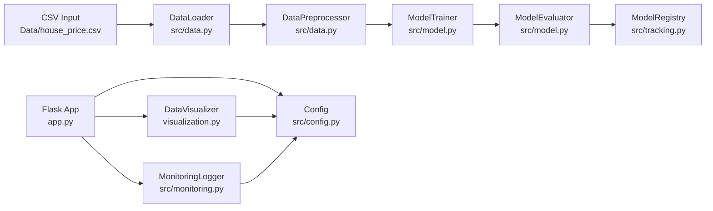

**Diagram sources**
- [src/data.py:20-109](file://House_Price_Prediction-main/housing1/src/data.py#L20-L109)
- [src/model.py:17-155](file://House_Price_Prediction-main/housing1/src/model.py#L17-L155)
- [src/tracking.py:134-218](file://House_Price_Prediction-main/housing1/src/tracking.py#L134-L218)
- [visualization.py:23-344](file://House_Price_Prediction-main/housing1/visualization.py#L23-L344)
- [src/monitoring.py:15-218](file://House_Price_Prediction-main/housing1/src/monitoring.py#L15-L218)
- [app.py:1-109](file://House_Price_Prediction-main/housing1/app.py#L1-L109)
- [src/config.py:10-63](file://House_Price_Prediction-main/housing1/src/config.py#L10-L63)