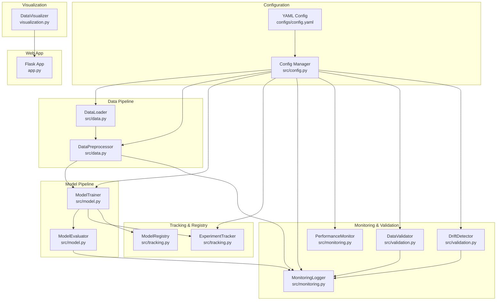
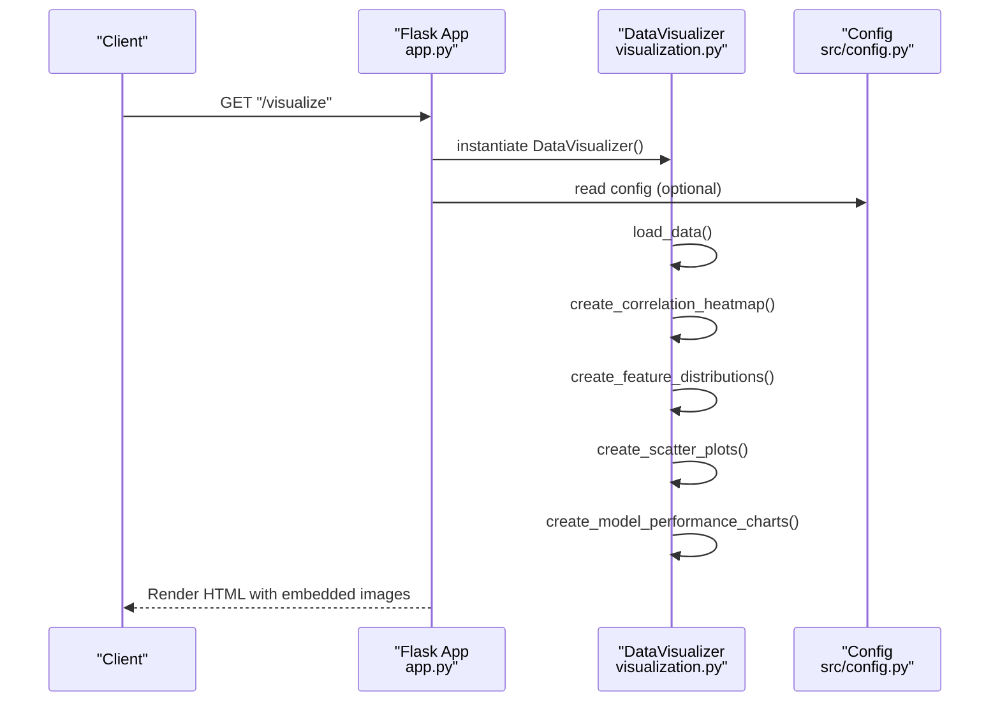
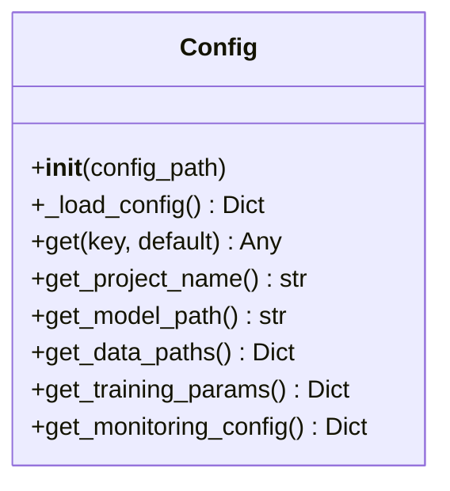
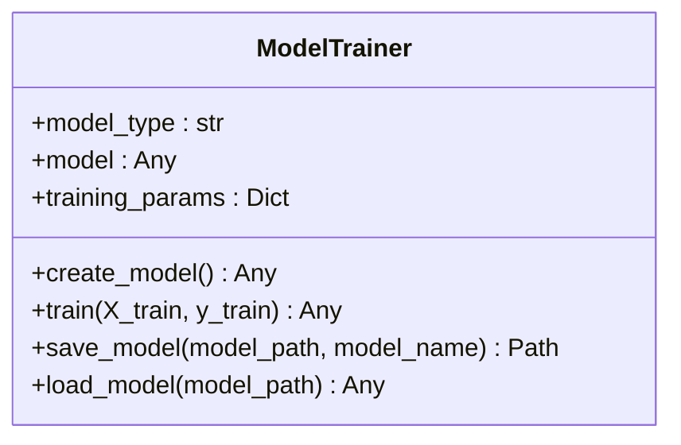
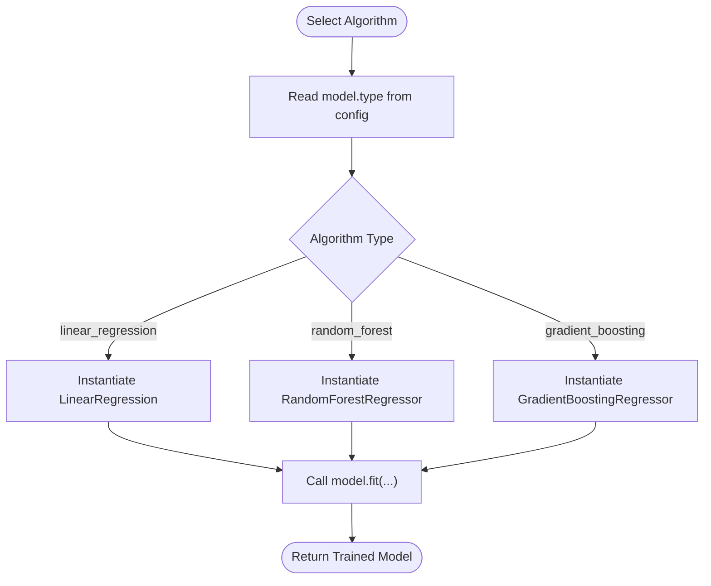
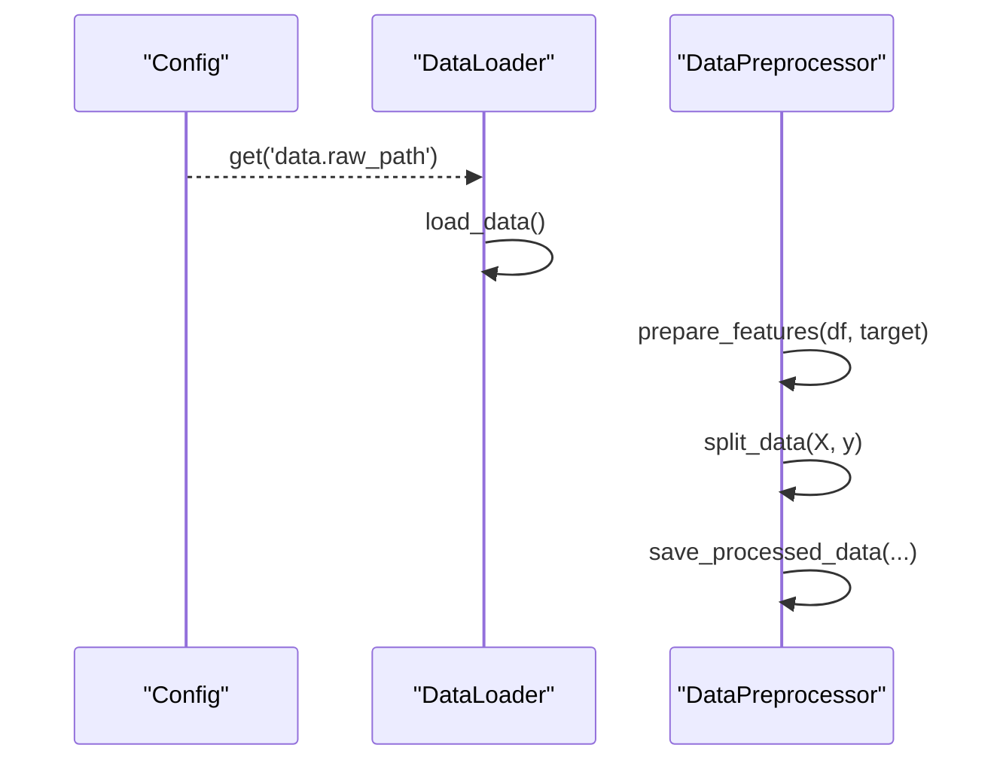
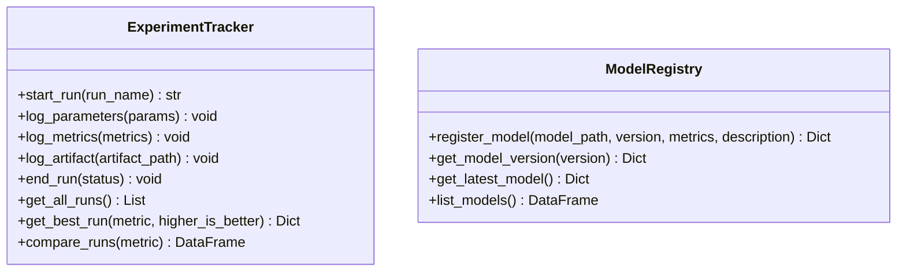
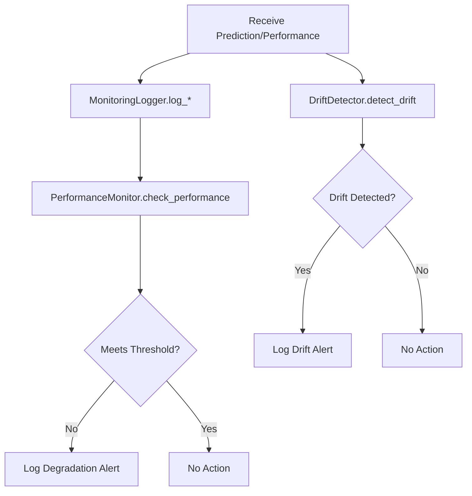
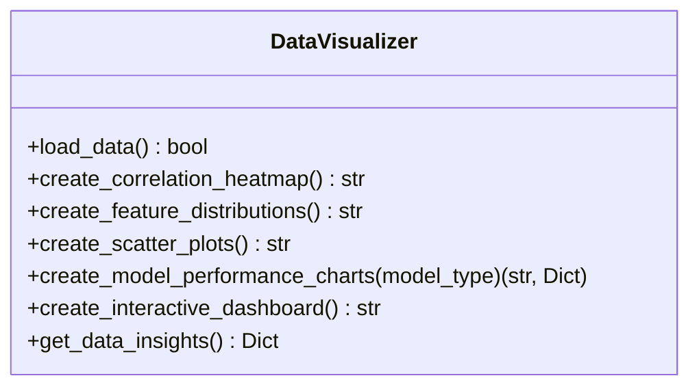
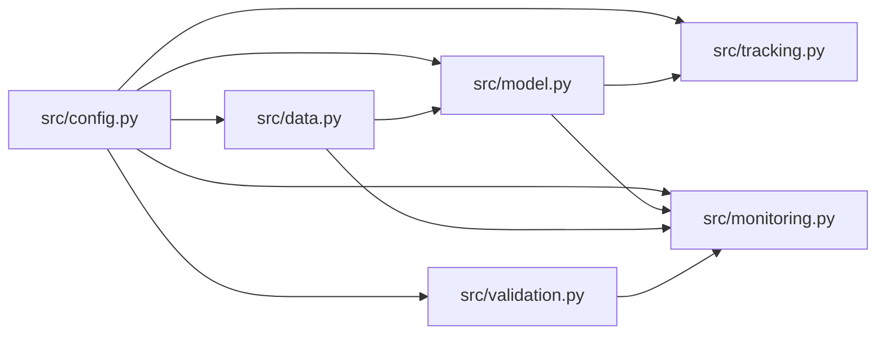

# Component Design Patterns

<cite>
**Referenced Files in This Document**
- [config.py](file://House_Price_Prediction-main/housing1/src/config.py)
- [config.yaml](file://House_Price_Prediction-main/housing1/configs/config.yaml)
- [config.example.yaml](file://House_Price_Prediction-main/housing1/configs/config.example.yaml)
- [data.py](file://House_Price_Prediction-main/housing1/src/data.py)
- [model.py](file://House_Price_Prediction-main/housing1/src/model.py)
- [tracking.py](file://House_Price_Prediction-main/housing1/src/tracking.py)
- [monitoring.py](file://House_Price_Prediction-main/housing1/src/monitoring.py)
- [validation.py](file://House_Price_Prediction-main/housing1/src/validation.py)
- [test_components.py](file://House_Price_Prediction-main/housing1/tests/test_components.py)
- [visualization.py](file://House_Price_Prediction-main/housing1/visualization.py)
- [app.py](file://House_Price_Prediction-main/housing1/app.py)
</cite>

## Table of Contents
1. [Introduction](#introduction)
2. [Project Structure](#project-structure)
3. [Core Components](#core-components)
4. [Architecture Overview](#architecture-overview)
5. [Detailed Component Analysis](#detailed-component-analysis)
6. [Dependency Analysis](#dependency-analysis)
7. [Performance Considerations](#performance-considerations)
8. [Troubleshooting Guide](#troubleshooting-guide)
9. [Conclusion](#conclusion)

## Introduction
This document explains the component design patterns implemented in the MLOps pipeline for house price prediction. It focuses on:
- Factory pattern for model creation
- Strategy-like selection of ML algorithms via configuration
- Configuration pattern for centralized settings management

It also documents the modular architecture separating configuration management, data processing, model training, and experiment tracking, and provides concrete examples mapped to actual code.

## Project Structure
The project follows a layered, feature-based organization:
- Configuration: centralized YAML configuration and a Python configuration manager
- Data: data loading, preprocessing, and saving
- Model: training, evaluation, and persistence
- Experiment tracking: run lifecycle, metrics, artifacts, and model registry
- Monitoring: logging, drift detection, and performance checks
- Validation: schema and quality validation plus drift detection
- Visualization: standalone module for charts and dashboards
- Web app: Flask routes for prediction and visualization

**Diagram sources**
- [config.py:10-63](file://House_Price_Prediction-main/housing1/src/config.py#L10-L63)
- [config.yaml:1-60](file://House_Price_Prediction-main/housing1/configs/config.yaml#L1-L60)
- [data.py:13-109](file://House_Price_Prediction-main/housing1/src/data.py#L13-L109)
- [model.py:17-155](file://House_Price_Prediction-main/housing1/src/model.py#L17-L155)
- [tracking.py:14-218](file://House_Price_Prediction-main/housing1/src/tracking.py#L14-L218)
- [monitoring.py:15-218](file://House_Price_Prediction-main/housing1/src/monitoring.py#L15-L218)
- [validation.py:14-243](file://House_Price_Prediction-main/housing1/src/validation.py#L14-L243)
- [visualization.py:23-348](file://House_Price_Prediction-main/housing1/visualization.py#L23-L348)
- [app.py:14-113](file://House_Price_Prediction-main/housing1/app.py#L14-L113)

**Section sources**
- [config.py:10-63](file://House_Price_Prediction-main/housing1/src/config.py#L10-L63)
- [config.yaml:1-60](file://House_Price_Prediction-main/housing1/configs/config.yaml#L1-L60)

## Core Components
This section highlights the three primary design patterns and how they are implemented.

- Configuration Pattern
  - Centralized settings via YAML and a Python Config class
  - Provides typed getters for nested keys and convenience methods for common sections
  - Used by all components to avoid scattered configuration logic

- Factory Pattern (Model Creation)
  - ModelTrainer.create_model selects and instantiates a concrete ML model based on configuration
  - Encapsulates instantiation logic and avoids client code duplication

- Strategy-like Algorithm Selection
  - The model type is chosen from configuration, enabling swapping between algorithms without changing code
  - Training parameters are also pulled from configuration, keeping behavior configurable

Concrete examples:
- Configuration pattern: [Config.get:26-37](file://House_Price_Prediction-main/housing1/src/config.py#L26-L37), [Config.get_training_params:54-55](file://House_Price_Prediction-main/housing1/src/config.py#L54-L55)
- Factory pattern: [ModelTrainer.create_model:25-45](file://House_Price_Prediction-main/housing1/src/model.py#L25-L45)
- Strategy-like selection: [ModelTrainer.__init__:20-23](file://House_Price_Prediction-main/housing1/src/model.py#L20-L23), [config.yaml model.type](file://House_Price_Prediction-main/housing1/configs/config.yaml#L19)

**Section sources**
- [config.py:10-63](file://House_Price_Prediction-main/housing1/src/config.py#L10-L63)
- [model.py:17-88](file://House_Price_Prediction-main/housing1/src/model.py#L17-L88)
- [config.yaml:17-31](file://House_Price_Prediction-main/housing1/configs/config.yaml#L17-L31)

## Architecture Overview
The system is modular with clear separation of concerns:
- Configuration Management: src/config.py reads configs/config.yaml and exposes getters
- Data Processing: src/data.py handles loading, validation, and splitting
- Model Training/Evaluation: src/model.py trains, evaluates, and persists models
- Experiment Tracking: src/tracking.py logs runs, metrics, and artifacts; maintains a model registry
- Monitoring: src/monitoring.py logs predictions/performance and detects drift/degradation
- Validation: src/validation.py validates schema/quality and detects data drift
- Visualization: visualization.py creates charts and dashboards
- Web App: app.py serves prediction and visualization endpoints

**Diagram sources**
- [app.py:68-89](file://House_Price_Prediction-main/housing1/app.py#L68-L89)
- [visualization.py:23-348](file://House_Price_Prediction-main/housing1/visualization.py#L23-L348)
- [config.py:10-63](file://House_Price_Prediction-main/housing1/src/config.py#L10-L63)

## Detailed Component Analysis

### Configuration Pattern
- Purpose: Provide a single source of truth for all pipeline settings
- Implementation:
  - YAML file defines project, data, model, training, experiment, monitoring, API, and logging settings
  - Config class loads YAML, supports nested key retrieval, and exposes convenience getters
- Benefits:
  - Centralized settings reduce duplication and improve maintainability
  - Easy to swap environments by editing YAML
- Example usage:
  - [Config.get:26-37](file://House_Price_Prediction-main/housing1/src/config.py#L26-L37)
  - [Config.get_training_params:54-55](file://House_Price_Prediction-main/housing1/src/config.py#L54-L55)
  - [config.yaml:1-60](file://House_Price_Prediction-main/housing1/configs/config.yaml#L1-L60)

**Diagram sources**
- [config.py:10-63](file://House_Price_Prediction-main/housing1/src/config.py#L10-L63)

**Section sources**
- [config.py:10-63](file://House_Price_Prediction-main/housing1/src/config.py#L10-L63)
- [config.yaml:1-60](file://House_Price_Prediction-main/housing1/configs/config.yaml#L1-L60)
- [config.example.yaml:1-53](file://House_Price_Prediction-main/housing1/configs/config.example.yaml#L1-L53)

### Factory Pattern for Model Creation
- Purpose: Encapsulate model instantiation logic and enable dynamic selection based on configuration
- Implementation:
  - ModelTrainer.create_model chooses a concrete regressor based on configured model type
  - Training parameters are read from configuration to configure the instantiated model
- Benefits:
  - Removes branching in client code
  - Simplifies adding new models by extending the factory logic
- Example usage:
  - [ModelTrainer.create_model:25-45](file://House_Price_Prediction-main/housing1/src/model.py#L25-L45)
  - [ModelTrainer.__init__:20-23](file://House_Price_Prediction-main/housing1/src/model.py#L20-L23)
  - [config.yaml model.type](file://House_Price_Prediction-main/housing1/configs/config.yaml#L19)

**Diagram sources**
- [model.py:17-88](file://House_Price_Prediction-main/housing1/src/model.py#L17-L88)

**Section sources**
- [model.py:17-88](file://House_Price_Prediction-main/housing1/src/model.py#L17-L88)
- [config.yaml:17-31](file://House_Price_Prediction-main/housing1/configs/config.yaml#L17-L31)

### Strategy-like Algorithm Selection
- Purpose: Allow interchangeable ML algorithms without modifying client code
- Implementation:
  - The model type is selected from configuration (e.g., linear regression, random forest, gradient boosting)
  - ModelTrainer delegates training to the selected model instance
- Benefits:
  - Enables A/B testing of algorithms by changing configuration
  - Keeps training logic consistent across models
- Example usage:
  - [ModelTrainer.__init__:20-23](file://House_Price_Prediction-main/housing1/src/model.py#L20-L23)
  - [config.yaml model.type](file://House_Price_Prediction-main/housing1/configs/config.yaml#L19)

**Diagram sources**
- [model.py:20-45](file://House_Price_Prediction-main/housing1/src/model.py#L20-L45)
- [config.yaml:17-31](file://House_Price_Prediction-main/housing1/configs/config.yaml#L17-L31)

**Section sources**
- [model.py:20-45](file://House_Price_Prediction-main/housing1/src/model.py#L20-L45)
- [config.yaml:17-31](file://House_Price_Prediction-main/housing1/configs/config.yaml#L17-L31)

### Data Processing Pipeline
- DataLoader: loads CSV data and validates presence
- DataPreprocessor: separates features/target, splits data, saves processed datasets
- Integration with configuration: paths and split parameters are read from config

**Diagram sources**
- [data.py:13-109](file://House_Price_Prediction-main/housing1/src/data.py#L13-L109)
- [config.py:10-63](file://House_Price_Prediction-main/housing1/src/config.py#L10-L63)
- [config.yaml:9-16](file://House_Price_Prediction-main/housing1/configs/config.yaml#L9-L16)

**Section sources**
- [data.py:13-109](file://House_Price_Prediction-main/housing1/src/data.py#L13-L109)
- [config.yaml:9-16](file://House_Price_Prediction-main/housing1/configs/config.yaml#L9-L16)

### Experiment Tracking and Model Registry
- ExperimentTracker: manages run lifecycle, logs parameters/metrics/artifacts, and persists runs
- ModelRegistry: registers model versions, tracks metrics, and maintains metadata
- Both components read configuration for experiment settings and paths

**Diagram sources**
- [tracking.py:14-218](file://House_Price_Prediction-main/housing1/src/tracking.py#L14-L218)

**Section sources**
- [tracking.py:14-218](file://House_Price_Prediction-main/housing1/src/tracking.py#L14-L218)
- [config.yaml:35-46](file://House_Price_Prediction-main/housing1/configs/config.yaml#L35-L46)

### Monitoring and Validation
- MonitoringLogger: logs predictions, performance metrics, drift alerts, and saves logs
- PerformanceMonitor: compares current metrics against baseline thresholds
- DataValidator: validates schema and data quality
- DriftDetector: detects feature drift using multiple methods

**Diagram sources**
- [monitoring.py:15-218](file://House_Price_Prediction-main/housing1/src/monitoring.py#L15-L218)
- [validation.py:124-243](file://House_Price_Prediction-main/housing1/src/validation.py#L124-L243)

**Section sources**
- [monitoring.py:15-218](file://House_Price_Prediction-main/housing1/src/monitoring.py#L15-L218)
- [validation.py:14-243](file://House_Price_Prediction-main/housing1/src/validation.py#L14-L243)
- [config.yaml:41-46](file://House_Price_Prediction-main/housing1/configs/config.yaml#L41-L46)

### Visualization Module
- DataVisualizer: loads data and generates correlation heatmaps, distributions, scatter plots, performance charts, and interactive dashboards
- Used by the web app to serve visualizations

**Diagram sources**
- [visualization.py:23-348](file://House_Price_Prediction-main/housing1/visualization.py#L23-L348)

**Section sources**
- [visualization.py:23-348](file://House_Price_Prediction-main/housing1/visualization.py#L23-L348)
- [app.py:68-102](file://House_Price_Prediction-main/housing1/app.py#L68-L102)

## Dependency Analysis
- Cohesion: Each module encapsulates a single responsibility (configuration, data, model, tracking, monitoring, validation, visualization)
- Coupling: Components depend on the Config class for settings, reducing tight coupling to hardcoded values
- External dependencies: scikit-learn, pandas, numpy, flask, matplotlib, plotly, pyyaml, mlflow-compatible tracking

**Diagram sources**
- [config.py:10-63](file://House_Price_Prediction-main/housing1/src/config.py#L10-L63)
- [data.py:13-109](file://House_Price_Prediction-main/housing1/src/data.py#L13-L109)
- [model.py:17-155](file://House_Price_Prediction-main/housing1/src/model.py#L17-L155)
- [tracking.py:14-218](file://House_Price_Prediction-main/housing1/src/tracking.py#L14-L218)
- [monitoring.py:15-218](file://House_Price_Prediction-main/housing1/src/monitoring.py#L15-L218)
- [validation.py:14-243](file://House_Price_Prediction-main/housing1/src/validation.py#L14-L243)

**Section sources**
- [config.py:10-63](file://House_Price_Prediction-main/housing1/src/config.py#L10-L63)
- [data.py:13-109](file://House_Price_Prediction-main/housing1/src/data.py#L13-L109)
- [model.py:17-155](file://House_Price_Prediction-main/housing1/src/model.py#L17-L155)
- [tracking.py:14-218](file://House_Price_Prediction-main/housing1/src/tracking.py#L14-L218)
- [monitoring.py:15-218](file://House_Price_Prediction-main/housing1/src/monitoring.py#L15-L218)
- [validation.py:14-243](file://House_Price_Prediction-main/housing1/src/validation.py#L14-L243)

## Performance Considerations
- Centralized configuration reduces repeated IO and parsing overhead
- Using joblib for model persistence improves performance for large numpy arrays
- Avoid heavy computations in web routes; offload to background jobs or batch processing
- Use appropriate test/train splits and save processed datasets for reproducibility

## Troubleshooting Guide
- Configuration errors:
  - Missing or malformed YAML: Config._load_config handles missing files and returns empty config
  - Nested key access: Config.get supports dot notation; defaults prevent crashes
  - References: [Config._load_config:17-24](file://House_Price_Prediction-main/housing1/src/config.py#L17-L24), [Config.get:26-37](file://House_Price_Prediction-main/housing1/src/config.py#L26-L37)

- Data loading/splitting:
  - DataLoader raises explicit exceptions for missing files
  - DataPreprocessor enforces target column presence and prints split sizes
  - References: [DataLoader.load_data:20-30](file://House_Price_Prediction-main/housing1/src/data.py#L20-L30), [DataPreprocessor.split_data:69-88](file://House_Price_Prediction-main/housing1/src/data.py#L69-L88)

- Model training/persistence:
  - ModelTrainer.save_model requires a trained model; otherwise raises an error
  - ModelTrainer.load_model validates file existence
  - References: [ModelTrainer.save_model:62-77](file://House_Price_Prediction-main/housing1/src/model.py#L62-L77), [ModelTrainer.load_model:79-87](file://House_Price_Prediction-main/housing1/src/model.py#L79-L87)

- Experiment tracking:
  - ExperimentTracker.start_run/end_run manage run lifecycle; artifacts and metrics are logged
  - References: [ExperimentTracker.start_run:25-41](file://House_Price_Prediction-main/housing1/src/tracking.py#L25-L41), [ExperimentTracker.end_run:61-73](file://House_Price_Prediction-main/housing1/src/tracking.py#L61-L73)

- Monitoring and validation:
  - MonitoringLogger logs drift and degradation with severity levels
  - DriftDetector supports multiple methods (KS test, PSI, mean shift)
  - References: [MonitoringLogger.log_drift_alert:82-94](file://House_Price_Prediction-main/housing1/src/monitoring.py#L82-L94), [DriftDetector.detect_drift:143-199](file://House_Price_Prediction-main/housing1/src/validation.py#L143-L199)

**Section sources**
- [config.py:17-37](file://House_Price_Prediction-main/housing1/src/config.py#L17-L37)
- [data.py:20-30](file://House_Price_Prediction-main/housing1/src/data.py#L20-L30)
- [data.py:69-88](file://House_Price_Prediction-main/housing1/src/data.py#L69-L88)
- [model.py:62-87](file://House_Price_Prediction-main/housing1/src/model.py#L62-L87)
- [tracking.py:25-73](file://House_Price_Prediction-main/housing1/src/tracking.py#L25-L73)
- [monitoring.py:82-120](file://House_Price_Prediction-main/housing1/src/monitoring.py#L82-L120)
- [validation.py:143-199](file://House_Price_Prediction-main/housing1/src/validation.py#L143-L199)

## Conclusion
The project demonstrates robust design patterns:
- Configuration Pattern centralizes settings for easy maintenance and environment switching
- Factory Pattern encapsulates model instantiation, simplifying algorithm selection
- Strategy-like selection enables interchangeable ML algorithms via configuration

The modular architecture cleanly separates concerns across configuration, data, modeling, tracking, monitoring, and visualization, making the system extensible and maintainable. Unit tests validate core behaviors, ensuring reliability during changes.