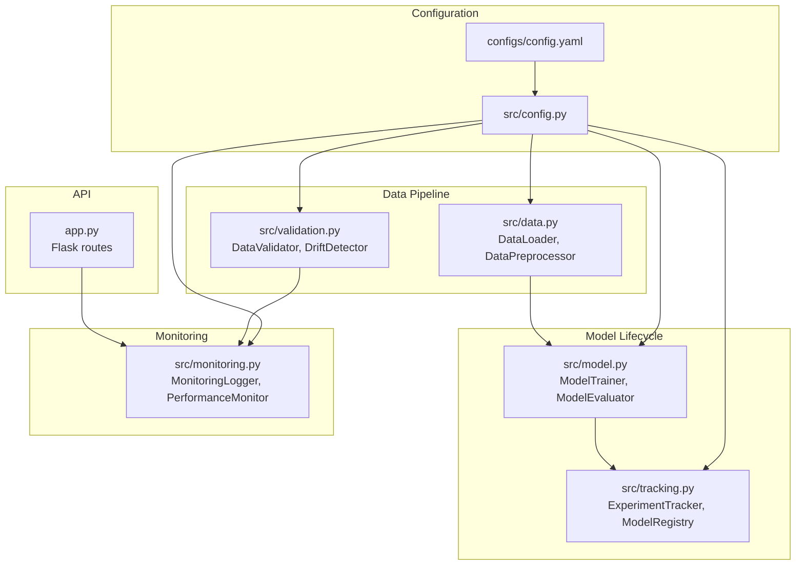
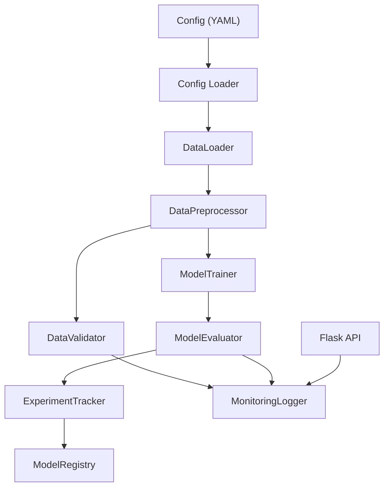
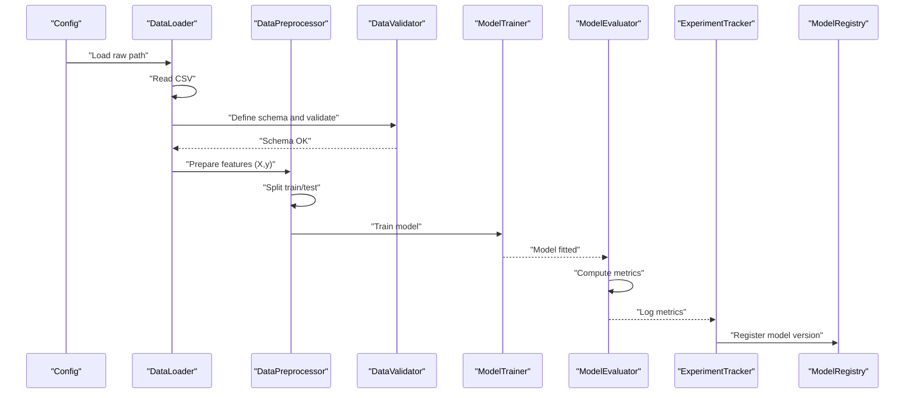
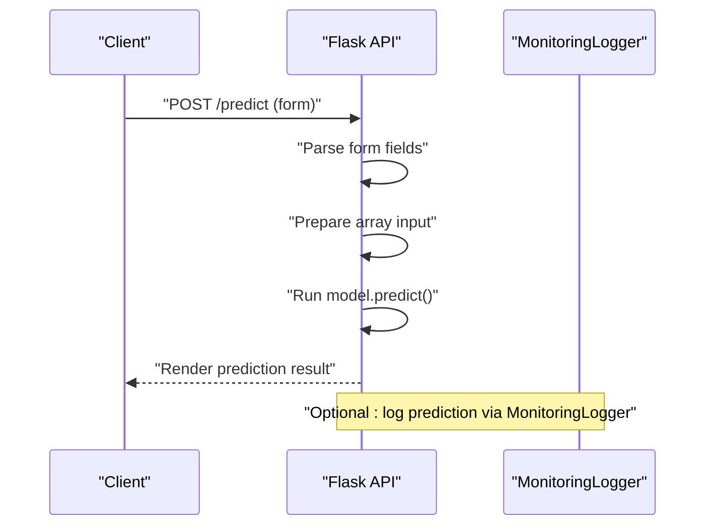
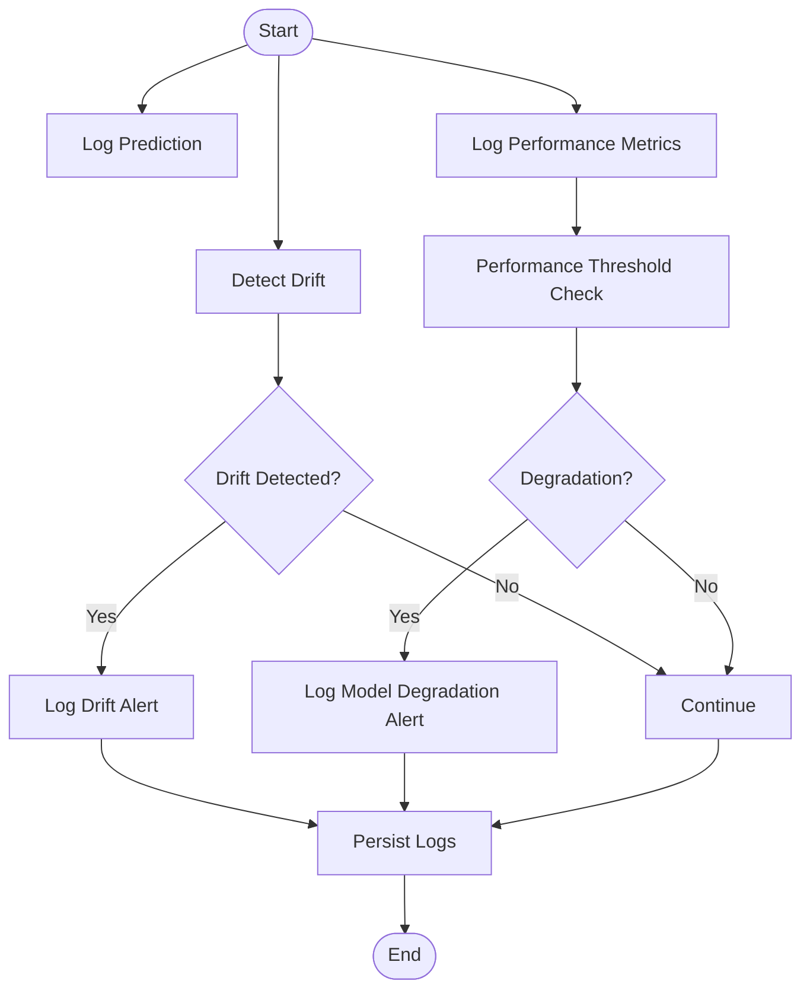
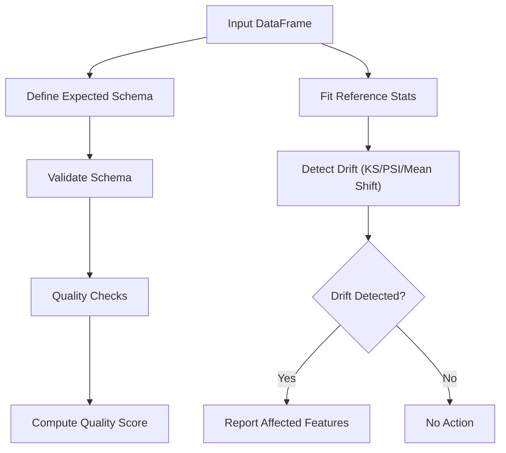
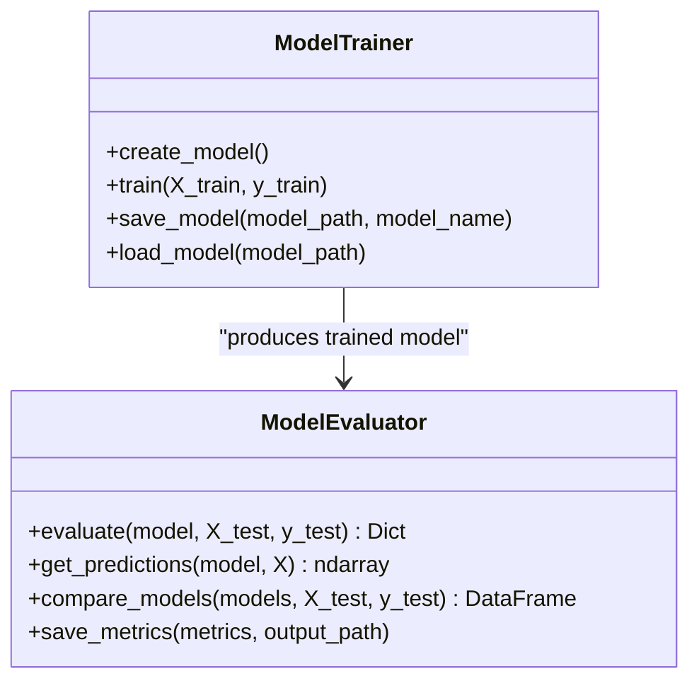
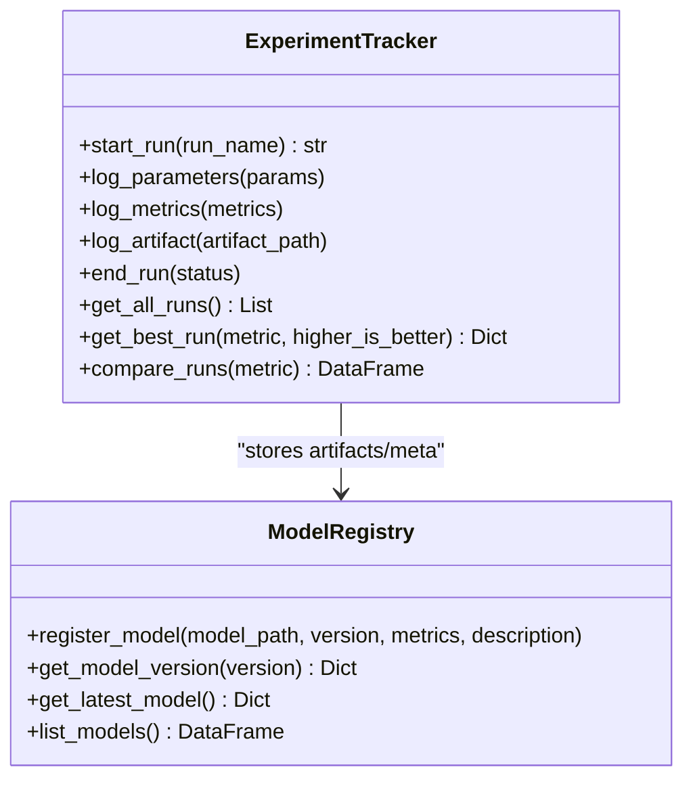
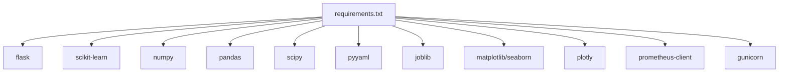

# Data Flow and Processing

<cite>
**Referenced Files in This Document**
- [config.yaml](file://configs/config.yaml)
- [config.example.yaml](file://configs/config.example.yaml)
- [config.py](file://src/config.py)
- [data.py](file://src/data.py)
- [validation.py](file://src/validation.py)
- [monitoring.py](file://src/monitoring.py)
- [model.py](file://src/model.py)
- [tracking.py](file://src/tracking.py)
- [app.py](file://app.py)
- [requirements.txt](file://requirements.txt)
- [README.md](file://README.md)
- [test_components.py](file://tests/test_components.py)
</cite>

## Table of Contents
1. [Introduction](#introduction)
2. [Project Structure](#project-structure)
3. [Core Components](#core-components)
4. [Architecture Overview](#architecture-overview)
5. [Detailed Component Analysis](#detailed-component-analysis)
6. [Dependency Analysis](#dependency-analysis)
7. [Performance Considerations](#performance-considerations)
8. [Troubleshooting Guide](#troubleshooting-guide)
9. [Conclusion](#conclusion)

## Introduction
This document explains the complete data pipeline architecture for the house price prediction system, covering the training pipeline from data validation through preprocessing to model training and evaluation, the prediction flow from API requests through validation to model inference and response generation, and the monitoring flow for tracking predictions and detecting drift. It also documents data transformation processes, quality checks, validation rules, error handling, and performance considerations.

## Project Structure
The project follows a modular layout with clear separation of concerns:
- Configuration management via YAML and a Python configuration wrapper
- Data ingestion and preprocessing utilities
- Model training and evaluation components
- Experiment tracking and model registry
- Data validation and drift detection
- Monitoring and logging
- A Flask-based API for serving predictions
- Tests validating each component’s behavior

**Diagram sources**
- [config.yaml:1-60](file://configs/config.yaml#L1-L60)
- [config.py:10-63](file://src/config.py#L10-L63)
- [data.py:13-109](file://src/data.py#L13-L109)
- [validation.py:14-243](file://src/validation.py#L14-L243)
- [model.py:17-155](file://src/model.py#L17-L155)
- [tracking.py:14-218](file://src/tracking.py#L14-L218)
- [monitoring.py:15-218](file://src/monitoring.py#L15-L218)
- [app.py:1-113](file://app.py#L1-L113)

**Section sources**
- [README.md:53-98](file://README.md#L53-L98)
- [config.yaml:1-60](file://configs/config.yaml#L1-L60)
- [config.py:10-63](file://src/config.py#L10-L63)

## Core Components
- Configuration: Centralized YAML configuration with a Python wrapper to fetch nested keys and defaults.
- Data ingestion and preprocessing: Loads CSV data, computes summaries, separates features/target, splits datasets, and persists processed data.
- Validation and drift: Validates schema and data quality, computes a quality score, and detects drift using configurable methods and thresholds.
- Model lifecycle: Creates, trains, evaluates, saves, and loads models; compares multiple models and persists metrics.
- Experiment tracking and registry: Starts and ends experiment runs, logs parameters/metrics/artifacts, and registers model versions with metadata.
- Monitoring: Logs predictions, performance metrics, drift alerts, and model degradation; persists logs to files.
- API: Provides a Flask endpoint to serve predictions from a pre-trained model.

**Section sources**
- [config.py:26-58](file://src/config.py#L26-L58)
- [data.py:20-109](file://src/data.py#L20-L109)
- [validation.py:28-122](file://src/validation.py#L28-L122)
- [validation.py:143-243](file://src/validation.py#L143-L243)
- [model.py:25-87](file://src/model.py#L25-L87)
- [model.py:96-155](file://src/model.py#L96-L155)
- [tracking.py:25-132](file://src/tracking.py#L25-L132)
- [tracking.py:150-218](file://src/tracking.py#L150-L218)
- [monitoring.py:43-147](file://src/monitoring.py#L43-L147)
- [monitoring.py:162-218](file://src/monitoring.py#L162-L218)
- [app.py:42-66](file://app.py#L42-L66)

## Architecture Overview
The pipeline integrates configuration-driven components to orchestrate data ingestion, validation, preprocessing, training, evaluation, tracking, and monitoring. The API consumes a pre-trained model and logs prediction outcomes for observability.

**Diagram sources**
- [config.yaml:1-60](file://configs/config.yaml#L1-L60)
- [config.py:10-63](file://src/config.py#L10-L63)
- [data.py:13-109](file://src/data.py#L13-L109)
- [validation.py:14-243](file://src/validation.py#L14-L243)
- [model.py:17-155](file://src/model.py#L17-L155)
- [tracking.py:14-218](file://src/tracking.py#L14-L218)
- [monitoring.py:15-218](file://src/monitoring.py#L15-L218)
- [app.py:1-113](file://app.py#L1-L113)

## Detailed Component Analysis

### Training Pipeline Flow
The training pipeline orchestrates data ingestion, validation, preprocessing, training, evaluation, and experiment tracking.

**Diagram sources**
- [config.py:42-52](file://src/config.py#L42-L52)
- [data.py:20-109](file://src/data.py#L20-L109)
- [validation.py:21-122](file://src/validation.py#L21-L122)
- [model.py:25-87](file://src/model.py#L25-L87)
- [model.py:96-155](file://src/model.py#L96-L155)
- [tracking.py:25-132](file://src/tracking.py#L25-L132)
- [tracking.py:150-218](file://src/tracking.py#L150-L218)

**Section sources**
- [data.py:20-109](file://src/data.py#L20-L109)
- [validation.py:28-122](file://src/validation.py#L28-L122)
- [model.py:47-87](file://src/model.py#L47-L87)
- [model.py:96-155](file://src/model.py#L96-L155)
- [tracking.py:25-132](file://src/tracking.py#L25-L132)
- [tracking.py:150-218](file://src/tracking.py#L150-L218)

### Prediction Flow
The prediction flow handles API requests, validates inputs, performs inference, and logs outcomes.

**Diagram sources**
- [app.py:42-66](file://app.py#L42-L66)
- [monitoring.py:43-60](file://src/monitoring.py#L43-L60)

**Section sources**
- [app.py:42-66](file://app.py#L42-L66)
- [monitoring.py:43-60](file://src/monitoring.py#L43-L60)

### Monitoring Flow
The monitoring flow tracks predictions, performance metrics, drift alerts, and model degradation.

**Diagram sources**
- [monitoring.py:43-147](file://src/monitoring.py#L43-L147)
- [monitoring.py:162-218](file://src/monitoring.py#L162-L218)
- [validation.py:143-243](file://src/validation.py#L143-L243)

**Section sources**
- [monitoring.py:43-147](file://src/monitoring.py#L43-L147)
- [monitoring.py:162-218](file://src/monitoring.py#L162-L218)
- [validation.py:143-243](file://src/validation.py#L143-L243)

### Data Validation and Drift Detection
- Schema validation ensures expected columns and dtypes.
- Data quality checks compute missing values, duplicates, outliers, and a composite quality score.
- Drift detection supports KS test, PSI, and mean-shift methods against a reference distribution.

**Diagram sources**
- [validation.py:21-122](file://src/validation.py#L21-L122)
- [validation.py:132-243](file://src/validation.py#L132-L243)

**Section sources**
- [validation.py:28-122](file://src/validation.py#L28-L122)
- [validation.py:143-243](file://src/validation.py#L143-L243)

### Model Training and Evaluation
- ModelTrainer creates and trains models based on configuration.
- ModelEvaluator computes MAE, MSE, RMSE, and R²; supports comparison across models.

**Diagram sources**
- [model.py:17-155](file://src/model.py#L17-L155)

**Section sources**
- [model.py:25-87](file://src/model.py#L25-L87)
- [model.py:96-155](file://src/model.py#L96-L155)

### Experiment Tracking and Registry
- ExperimentTracker starts runs, logs parameters and metrics, and persists run artifacts.
- ModelRegistry manages model versions, metadata, and latest model selection.

**Diagram sources**
- [tracking.py:14-218](file://src/tracking.py#L14-L218)

**Section sources**
- [tracking.py:25-132](file://src/tracking.py#L25-L132)
- [tracking.py:150-218](file://src/tracking.py#L150-L218)

## Dependency Analysis
External dependencies include Flask, scikit-learn, NumPy, Pandas, SciPy, PyYAML, and optional MLOps tools. The configuration drives behavior across components.

**Diagram sources**
- [requirements.txt:1-24](file://requirements.txt#L1-L24)

**Section sources**
- [requirements.txt:1-24](file://requirements.txt#L1-L24)
- [config.yaml:28-41](file://configs/config.yaml#L28-L41)

## Performance Considerations
- Data I/O: Use efficient CSV reading and avoid repeated disk I/O by caching loaded dataframes during a single run.
- Preprocessing: Leverage vectorized operations and avoid unnecessary copies; persist processed datasets for reproducibility.
- Model training: Use appropriate solvers and tolerances; consider parallelism for tree-based models; tune early stopping parameters.
- Evaluation: Batch predictions when feasible; cache metrics for dashboards.
- Monitoring: Asynchronous logging and periodic aggregation reduce overhead; ensure log rotation and retention policies.
- API: Use production WSGI servers; enable compression; limit payload sizes; implement rate limiting.

## Troubleshooting Guide
Common issues and resolutions:
- Data file not found: Verify the raw path in configuration and ensure the file exists.
- Schema mismatches: Align input columns and dtypes with the expected schema; fix typos and missing fields.
- Drift alerts: Investigate feature distributions; retrain with recent data; adjust thresholds.
- Model degradation: Compare metrics against baseline; retrain with fresh data; validate feature engineering.
- API errors: Check form parsing and type casting; wrap prediction logic in try/catch blocks; return user-friendly messages.

**Section sources**
- [data.py:27-30](file://src/data.py#L27-L30)
- [validation.py:28-49](file://src/validation.py#L28-L49)
- [monitoring.py:82-120](file://src/monitoring.py#L82-L120)
- [app.py:64-66](file://app.py#L64-L66)

## Conclusion
The pipeline integrates configuration-driven components to automate data ingestion, validation, preprocessing, training, evaluation, and monitoring. Robust validation and drift detection help maintain data and model quality, while experiment tracking and registry support reproducible model management. The API provides a straightforward prediction endpoint with logging for observability. Applying the performance recommendations and troubleshooting guidance will improve reliability and throughput.