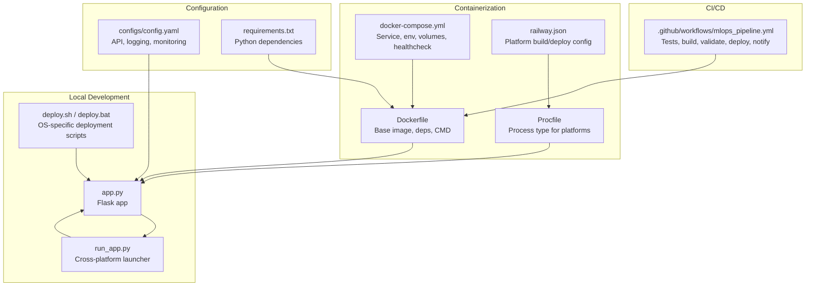
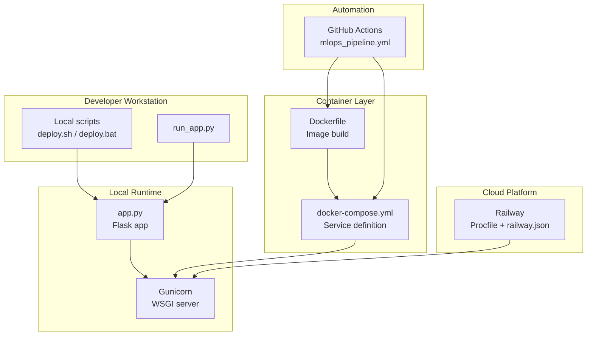
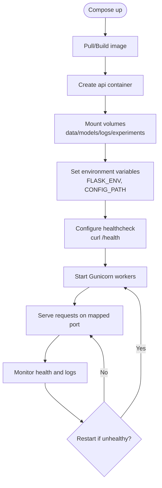
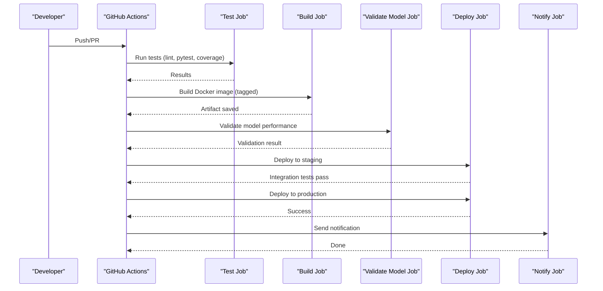
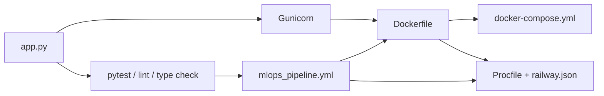

# Deployment Architecture

<cite>
**Referenced Files in This Document**
- [DEPLOYMENT_GUIDE.md](file://DEPLOYMENT_GUIDE.md)
- [DEPLOYMENT_COMPLETE.md](file://DEPLOYMENT_COMPLETE.md)
- [docker-compose.yml](file://docker-compose.yml)
- [Dockerfile](file://Dockerfile)
- [Procfile](file://Procfile)
- [RAILWAY_DEPLOYMENT.md](file://RAILWAY_DEPLOYMENT.md)
- [RAILWAY_READY.md](file://RAILWAY_READY.md)
- [railway.json](file://railway.json)
- [.github/workflows/mlops_pipeline.yml](file://.github/workflows/mlops_pipeline.yml)
- [requirements.txt](file://requirements.txt)
- [configs/config.yaml](file://configs/config.yaml)
- [app.py](file://app.py)
- [deploy.sh](file://deploy.sh)
- [deploy.bat](file://deploy.bat)
- [run_app.py](file://run_app.py)
</cite>

## Table of Contents
1. [Introduction](#introduction)
2. [Project Structure](#project-structure)
3. [Core Components](#core-components)
4. [Architecture Overview](#architecture-overview)
5. [Detailed Component Analysis](#detailed-component-analysis)
6. [Dependency Analysis](#dependency-analysis)
7. [Performance Considerations](#performance-considerations)
8. [Troubleshooting Guide](#troubleshooting-guide)
9. [Conclusion](#conclusion)
10. [Appendices](#appendices)

## Introduction
This document describes the deployment architecture for the House Price Prediction application. It covers development environment setup, production Docker containerization, and the CI/CD pipeline. It also documents horizontal and vertical scaling strategies, container orchestration with Docker Compose, and integration with cloud platforms such as Railway. Infrastructure requirements, security considerations, and monitoring setup for production environments are addressed, along with deployment topologies, failover strategies, and disaster recovery planning. Practical examples of deployment configurations and scaling scenarios are provided.

## Project Structure
The repository organizes deployment assets across scripts, configuration files, and CI/CD workflows. Key elements include:
- Application entrypoint and runtime configuration
- Containerization definitions for local and cloud platforms
- Orchestration with Docker Compose
- Cloud platform deployment guides and configuration
- CI/CD pipeline for automated testing, building, validating, and deploying

**Diagram sources**
- [app.py](file://app.py)
- [run_app.py](file://run_app.py)
- [deploy.sh](file://deploy.sh)
- [deploy.bat](file://deploy.bat)
- [Dockerfile](file://Dockerfile)
- [docker-compose.yml](file://docker-compose.yml)
- [Procfile](file://Procfile)
- [railway.json](file://railway.json)
- [.github/workflows/mlops_pipeline.yml](file://.github/workflows/mlops_pipeline.yml)
- [configs/config.yaml](file://configs/config.yaml)
- [requirements.txt](file://requirements.txt)

**Section sources**
- [DEPLOYMENT_GUIDE.md](file://DEPLOYMENT_GUIDE.md)
- [DEPLOYMENT_COMPLETE.md](file://DEPLOYMENT_COMPLETE.md)
- [docker-compose.yml](file://docker-compose.yml)
- [Dockerfile](file://Dockerfile)
- [Procfile](file://Procfile)
- [RAILWAY_DEPLOYMENT.md](file://RAILWAY_DEPLOYMENT.md)
- [RAILWAY_READY.md](file://RAILWAY_READY.md)
- [railway.json](file://railway.json)
- [.github/workflows/mlops_pipeline.yml](file://.github/workflows/mlops_pipeline.yml)
- [requirements.txt](file://requirements.txt)
- [configs/config.yaml](file://configs/config.yaml)
- [app.py](file://app.py)
- [deploy.sh](file://deploy.sh)
- [deploy.bat](file://deploy.bat)
- [run_app.py](file://run_app.py)

## Core Components
- Application runtime: Flask app with environment-aware port binding and routes for prediction, visualization, and dashboard.
- Containerization: Dockerfile defines the base image, installs Python dependencies, exposes a port, and runs the app via Gunicorn.
- Orchestration: docker-compose.yml defines a single service with environment variables, mounted volumes for persistent data and logs, health checks, and restart policies.
- Platform deployment: Railway integration via Procfile and railway.json for buildpack-style deployment and process startup.
- CI/CD pipeline: GitHub Actions workflow orchestrates linting, unit tests, coverage reporting, Docker image build, model validation, and staged deployment to staging and production.
- Configuration: YAML configuration file defines API host/port, worker count, logging, and monitoring thresholds.

**Section sources**
- [app.py](file://app.py)
- [Dockerfile](file://Dockerfile)
- [docker-compose.yml](file://docker-compose.yml)
- [Procfile](file://Procfile)
- [railway.json](file://railway.json)
- [.github/workflows/mlops_pipeline.yml](file://.github/workflows/mlops_pipeline.yml)
- [configs/config.yaml](file://configs/config.yaml)

## Architecture Overview
The deployment architecture supports multiple environments:
- Local development with optional virtual environment activation and dependency installation
- Production containerization with Gunicorn as the WSGI server
- Orchestration via Docker Compose for single-service deployments
- Cloud deployment to Railway using Procfile and platform configuration
- CI/CD automation with GitHub Actions for testing, building, validating, and deploying

**Diagram sources**
- [deploy.sh](file://deploy.sh)
- [deploy.bat](file://deploy.bat)
- [run_app.py](file://run_app.py)
- [app.py](file://app.py)
- [Dockerfile](file://Dockerfile)
- [docker-compose.yml](file://docker-compose.yml)
- [Procfile](file://Procfile)
- [railway.json](file://railway.json)
- [.github/workflows/mlops_pipeline.yml](file://.github/workflows/mlops_pipeline.yml)

## Detailed Component Analysis

### Development Environment Setup
- Local quick start: OS-specific deployment scripts automate virtual environment creation, dependency installation, and application launch.
- Cross-platform launcher: run_app.py verifies dependencies and data presence, then starts the Flask app.
- Manual setup: virtual environment activation followed by installing dependencies and running the Flask app.

Practical example paths:
- [deploy.sh](file://deploy.sh)
- [deploy.bat](file://deploy.bat)
- [run_app.py](file://run_app.py)
- [requirements.txt](file://requirements.txt)

**Section sources**
- [deploy.sh](file://deploy.sh)
- [deploy.bat](file://deploy.bat)
- [run_app.py](file://run_app.py)
- [requirements.txt](file://requirements.txt)

### Production Docker Containerization
- Base image and environment: slim Python image, environment variables for Python behavior and Flask host binding.
- Dependencies: system build tools installed, Python dependencies from requirements.txt, project copied into the image.
- Ports and entrypoint: port exposure and Gunicorn command with worker count.
- Railway compatibility: Procfile and railway.json define process type and platform build/deploy behavior.

Practical example paths:
- [Dockerfile](file://Dockerfile)
- [Procfile](file://Procfile)
- [railway.json](file://railway.json)
- [requirements.txt](file://requirements.txt)

**Section sources**
- [Dockerfile](file://Dockerfile)
- [Procfile](file://Procfile)
- [railway.json](file://railway.json)
- [requirements.txt](file://requirements.txt)

### Container Orchestration with Docker Compose
- Single service: api service with port mapping, environment variables, mounted volumes for data, models, logs, and experiments.
- Health checks: HTTP health endpoint with retry/backoff configuration.
- Restart policy: unless-stopped for resilience.
- Worker configuration: Gunicorn workers defined in the command.

Practical example paths:
- [docker-compose.yml](file://docker-compose.yml)
- [configs/config.yaml](file://configs/config.yaml)

**Diagram sources**
- [docker-compose.yml](file://docker-compose.yml)
- [configs/config.yaml](file://configs/config.yaml)

**Section sources**
- [docker-compose.yml](file://docker-compose.yml)
- [configs/config.yaml](file://configs/config.yaml)

### CI/CD Pipeline Architecture
- Triggers: pushes to main/develop branches and pull requests to main.
- Jobs:
  - test: set up Python, install dev dependencies, lint, run tests, upload coverage.
  - build: set up Docker Buildx, build tagged image, save as artifact.
  - validate-model: set up Python, install dependencies, train model, compute R² threshold check.
  - deploy: download artifact, deploy to staging, run integration tests, deploy to production.
  - notify: send notifications on completion.

**Diagram sources**
- [.github/workflows/mlops_pipeline.yml](file://.github/workflows/mlops_pipeline.yml)

**Section sources**
- [.github/workflows/mlops_pipeline.yml](file://.github/workflows/mlops_pipeline.yml)

### Cloud Platform Integration (Railway)
- Railway CLI and dashboard deployment methods are documented.
- Project structure and required files are outlined for Railway.
- Railway-specific configuration includes Dockerfile, Procfile, railway.json, requirements.txt, and environment variables.
- Continuous deployment via GitHub integration is supported.

Practical example paths:
- [RAILWAY_DEPLOYMENT.md](file://RAILWAY_DEPLOYMENT.md)
- [RAILWAY_READY.md](file://RAILWAY_READY.md)
- [Procfile](file://Procfile)
- [railway.json](file://railway.json)
- [Dockerfile](file://Dockerfile)
- [requirements.txt](file://requirements.txt)

**Section sources**
- [RAILWAY_DEPLOYMENT.md](file://RAILWAY_DEPLOYMENT.md)
- [RAILWAY_READY.md](file://RAILWAY_READY.md)
- [Procfile](file://Procfile)
- [railway.json](file://railway.json)
- [Dockerfile](file://Dockerfile)
- [requirements.txt](file://requirements.txt)

### Horizontal and Vertical Scaling Strategies
- Vertical scaling: increase Gunicorn worker count and CPU/memory resources per container. Configuration examples:
  - Docker Compose command defines worker count for the api service.
  - railway.json start command defines worker count for Railway deployments.
  - configs/config.yaml defines worker count for API configuration.
- Horizontal scaling: run multiple replicas behind a load balancer. For Docker Compose, scale the service; for cloud platforms, use platform-native autoscaling or multiple instances.

Practical example paths:
- [docker-compose.yml](file://docker-compose.yml)
- [railway.json](file://railway.json)
- [configs/config.yaml](file://configs/config.yaml)

**Section sources**
- [docker-compose.yml](file://docker-compose.yml)
- [railway.json](file://railway.json)
- [configs/config.yaml](file://configs/config.yaml)

### Load Balancer Configuration and Gunicorn Worker Management
- Gunicorn configuration is centralized in multiple places:
  - Dockerfile CMD sets bind address, port, and worker count.
  - docker-compose.yml command sets bind address, port, and worker count.
  - Procfile defines process type and Gunicorn invocation with workers.
  - railway.json startCommand defines process and worker count.
  - configs/config.yaml defines host, port, debug, and workers for API configuration.
- For production, set debug to false, use environment variables for port, and tune workers based on CPU cores.

Practical example paths:
- [Dockerfile](file://Dockerfile)
- [docker-compose.yml](file://docker-compose.yml)
- [Procfile](file://Procfile)
- [railway.json](file://railway.json)
- [configs/config.yaml](file://configs/config.yaml)
- [app.py](file://app.py)

**Section sources**
- [Dockerfile](file://Dockerfile)
- [docker-compose.yml](file://docker-compose.yml)
- [Procfile](file://Procfile)
- [railway.json](file://railway.json)
- [configs/config.yaml](file://configs/config.yaml)
- [app.py](file://app.py)

### Security Considerations
- Environment variables: use environment variables for port binding and configuration; avoid hardcoding secrets.
- Debug mode: disable debug in production deployments.
- Reverse proxy: consider placing a reverse proxy (e.g., Nginx) in front of Gunicorn for TLS termination, rate limiting, and request buffering.
- Data and logs: mount volumes for data, models, logs, and experiments to persist and secure artifacts.
- Dependency hygiene: keep dependencies updated and validated during CI/CD.

Practical example paths:
- [app.py](file://app.py)
- [configs/config.yaml](file://configs/config.yaml)
- [docker-compose.yml](file://docker-compose.yml)
- [requirements.txt](file://requirements.txt)

**Section sources**
- [app.py](file://app.py)
- [configs/config.yaml](file://configs/config.yaml)
- [docker-compose.yml](file://docker-compose.yml)
- [requirements.txt](file://requirements.txt)

### Monitoring Setup for Production
- Health checks: docker-compose.yml includes a healthcheck probing the application’s health endpoint.
- Metrics client: Prometheus client is included in requirements for exposing metrics.
- Logging: configs/config.yaml defines logging level, format, and file path.
- Visualization: application routes support dashboards and visualizations; integrate with external monitoring dashboards if needed.

Practical example paths:
- [docker-compose.yml](file://docker-compose.yml)
- [requirements.txt](file://requirements.txt)
- [configs/config.yaml](file://configs/config.yaml)

**Section sources**
- [docker-compose.yml](file://docker-compose.yml)
- [requirements.txt](file://requirements.txt)
- [configs/config.yaml](file://configs/config.yaml)

### Deployment Topologies, Failover, and Disaster Recovery
- Topology: single-service containerized deployment with optional volume persistence for data and logs.
- Failover: use restart policies and health checks to recover unhealthy containers; orchestrate multiple replicas for high availability.
- Disaster recovery: maintain backups of models and logs; rebuild images from Dockerfile; redeploy from CI/CD artifacts.

Practical example paths:
- [docker-compose.yml](file://docker-compose.yml)
- [Dockerfile](file://Dockerfile)
- [.github/workflows/mlops_pipeline.yml](file://.github/workflows/mlops_pipeline.yml)

**Section sources**
- [docker-compose.yml](file://docker-compose.yml)
- [Dockerfile](file://Dockerfile)
- [.github/workflows/mlops_pipeline.yml](file://.github/workflows/mlops_pipeline.yml)

## Dependency Analysis
The deployment stack depends on:
- Flask application for serving routes and rendering templates
- Gunicorn as the production WSGI server
- Docker for containerization
- Railway for cloud deployment
- GitHub Actions for CI/CD automation

**Diagram sources**
- [app.py](file://app.py)
- [Dockerfile](file://Dockerfile)
- [docker-compose.yml](file://docker-compose.yml)
- [Procfile](file://Procfile)
- [railway.json](file://railway.json)
- [.github/workflows/mlops_pipeline.yml](file://.github/workflows/mlops_pipeline.yml)

**Section sources**
- [app.py](file://app.py)
- [Dockerfile](file://Dockerfile)
- [docker-compose.yml](file://docker-compose.yml)
- [Procfile](file://Procfile)
- [railway.json](file://railway.json)
- [.github/workflows/mlops_pipeline.yml](file://.github/workflows/mlops_pipeline.yml)

## Performance Considerations
- Worker tuning: adjust Gunicorn worker count based on CPU cores and workload characteristics.
- Port binding: use environment variables for port binding to accommodate platform-specific requirements.
- Health checks: configure health probes to ensure readiness and liveness.
- Volume mounts: persist data and logs to reduce cold-start overhead and improve reliability.

[No sources needed since this section provides general guidance]

## Troubleshooting Guide
Common issues and resolutions:
- Missing dependencies: install requirements using the provided scripts or Pip.
- Data file not found: ensure the CSV data file exists in the expected directory.
- Port conflicts: change port or stop the process currently using the port.
- Application status verification: use curl or browser to confirm the application is reachable.

Practical example paths:
- [DEPLOYMENT_GUIDE.md](file://DEPLOYMENT_GUIDE.md)
- [deploy.sh](file://deploy.sh)
- [deploy.bat](file://deploy.bat)
- [run_app.py](file://run_app.py)

**Section sources**
- [DEPLOYMENT_GUIDE.md](file://DEPLOYMENT_GUIDE.md)
- [deploy.sh](file://deploy.sh)
- [deploy.bat](file://deploy.bat)
- [run_app.py](file://run_app.py)

## Conclusion
The deployment architecture combines local development scripts, robust containerization with Docker, orchestration via Docker Compose, and cloud deployment to Railway. The CI/CD pipeline automates testing, building, validation, and staged deployments. With environment-aware configuration, health checks, and worker tuning, the system supports both horizontal and vertical scaling. Security, monitoring, and disaster recovery considerations are integrated through configuration and operational practices.

[No sources needed since this section summarizes without analyzing specific files]

## Appendices

### Practical Deployment Configurations
- Local development: use OS-specific deployment scripts to set up the environment and launch the application.
  - [deploy.sh](file://deploy.sh)
  - [deploy.bat](file://deploy.bat)
- Production containerization: build the Docker image and run with Gunicorn.
  - [Dockerfile](file://Dockerfile)
  - [requirements.txt](file://requirements.txt)
- Orchestration: define service, environment variables, volumes, and health checks.
  - [docker-compose.yml](file://docker-compose.yml)
- Cloud deployment: configure Railway with Procfile and platform settings.
  - [Procfile](file://Procfile)
  - [railway.json](file://railway.json)
  - [RAILWAY_DEPLOYMENT.md](file://RAILWAY_DEPLOYMENT.md)
- CI/CD: configure GitHub Actions workflow for automated pipelines.
  - [.github/workflows/mlops_pipeline.yml](file://.github/workflows/mlops_pipeline.yml)

**Section sources**
- [deploy.sh](file://deploy.sh)
- [deploy.bat](file://deploy.bat)
- [Dockerfile](file://Dockerfile)
- [requirements.txt](file://requirements.txt)
- [docker-compose.yml](file://docker-compose.yml)
- [Procfile](file://Procfile)
- [railway.json](file://railway.json)
- [RAILWAY_DEPLOYMENT.md](file://RAILWAY_DEPLOYMENT.md)
- [.github/workflows/mlops_pipeline.yml](file://.github/workflows/mlops_pipeline.yml)