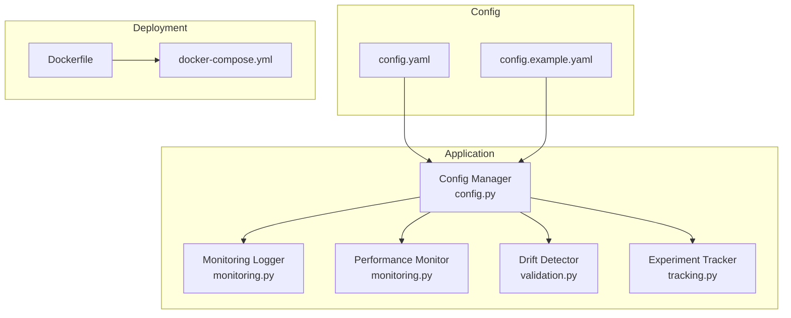
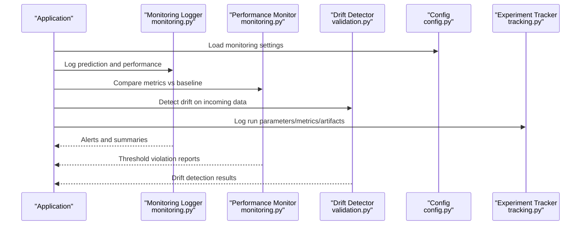
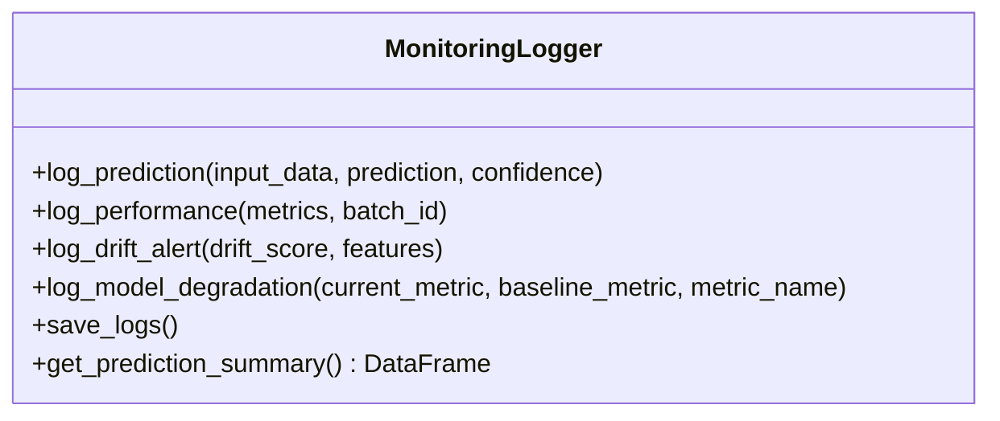
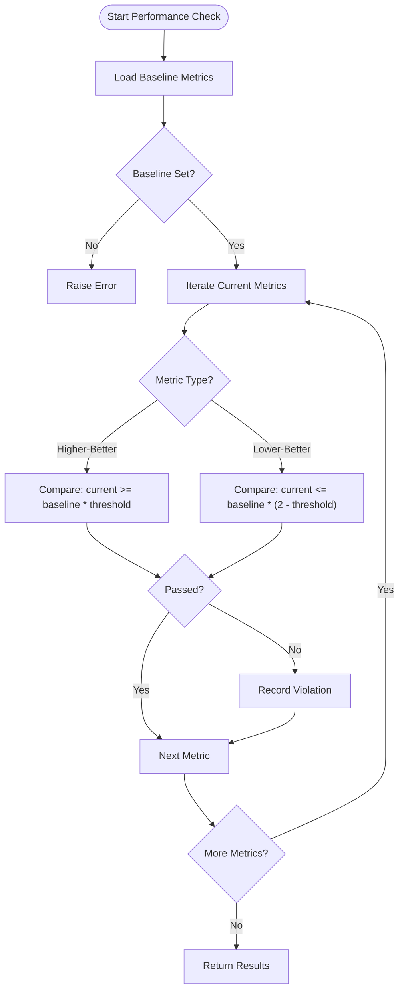
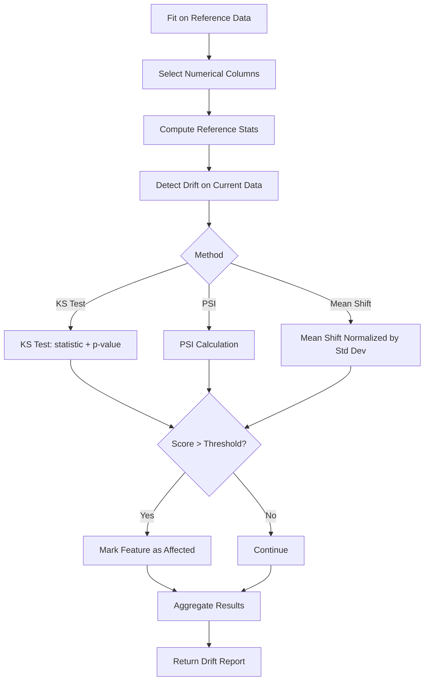
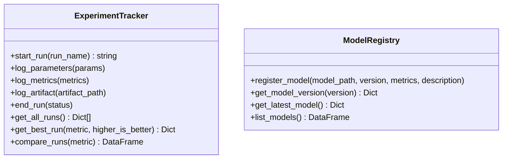
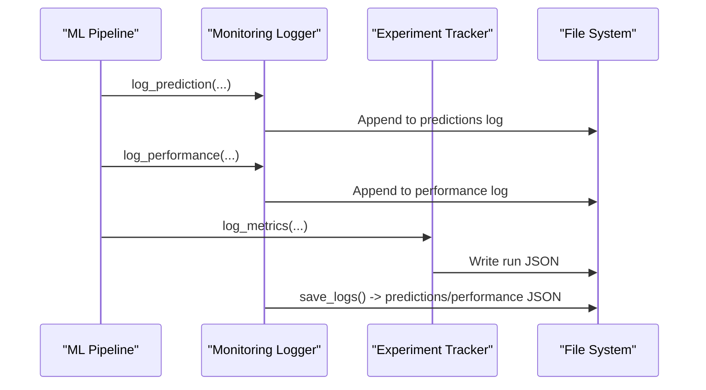
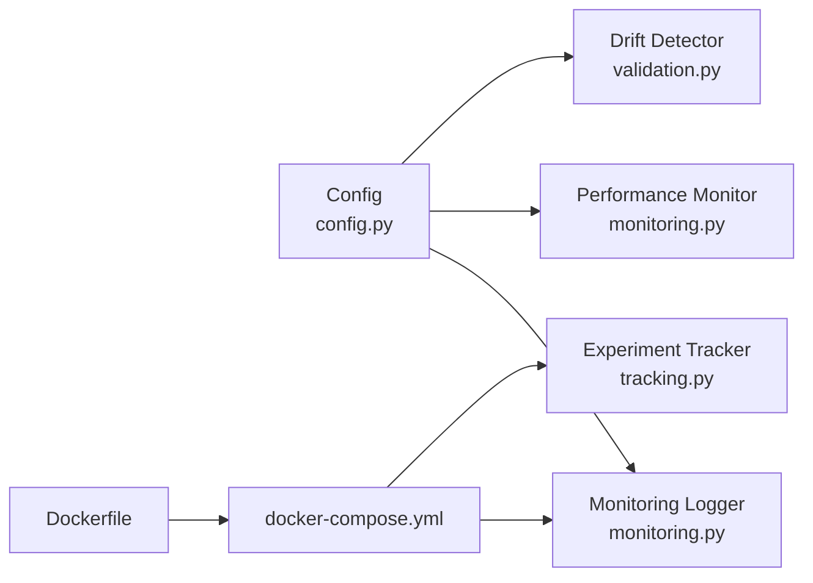

# Monitoring and Observability

<cite>
**Referenced Files in This Document**
- [monitoring.py](file://House_Price_Prediction-main/housing1/src/monitoring.py)
- [validation.py](file://House_Price_Prediction-main/housing1/src/validation.py)
- [config.py](file://House_Price_Prediction-main/housing1/src/config.py)
- [config.yaml](file://House_Price_Prediction-main/housing1/configs/config.yaml)
- [config.example.yaml](file://House_Price_Prediction-main/housing1/configs/config.example.yaml)
- [tracking.py](file://House_Price_Prediction-main/housing1/src/tracking.py)
- [Dockerfile](file://House_Price_Prediction-main/housing1/Dockerfile)
- [docker-compose.yml](file://House_Price_Prediction-main/housing1/docker-compose.yml)
</cite>

## Table of Contents
1. [Introduction](#introduction)
2. [Project Structure](#project-structure)
3. [Core Components](#core-components)
4. [Architecture Overview](#architecture-overview)
5. [Detailed Component Analysis](#detailed-component-analysis)
6. [Dependency Analysis](#dependency-analysis)
7. [Performance Considerations](#performance-considerations)
8. [Troubleshooting Guide](#troubleshooting-guide)
9. [Conclusion](#conclusion)
10. [Appendices](#appendices)

## Introduction
This document describes the monitoring and observability architecture for the house price prediction system. It explains how performance monitoring, drift detection, and alerting are implemented, how logs are structured and persisted, and how metrics are collected and analyzed. It also documents configuration options for thresholds and alerting, outlines integration points with external monitoring systems, and provides guidance for dashboard creation and troubleshooting workflows. Security considerations and performance optimization tips for monitoring overhead are included.

## Project Structure
The monitoring and observability features are implemented across several modules:
- Monitoring logger and performance monitor for runtime logging and alerting
- Drift detection utilities for data drift and model performance degradation
- Configuration management for centralized settings
- Experiment tracking and model registry for historical metrics and artifacts
- Container deployment configuration supporting health checks and persistent storage

**Diagram sources**
- [config.py:10-63](file://House_Price_Prediction-main/housing1/src/config.py#L10-L63)
- [monitoring.py:15-218](file://House_Price_Prediction-main/housing1/src/monitoring.py#L15-L218)
- [validation.py:124-243](file://House_Price_Prediction-main/housing1/src/validation.py#L124-L243)
- [tracking.py:14-218](file://House_Price_Prediction-main/housing1/src/tracking.py#L14-L218)
- [config.yaml:41-60](file://House_Price_Prediction-main/housing1/configs/config.yaml#L41-L60)
- [config.example.yaml:37-53](file://House_Price_Prediction-main/housing1/configs/config.example.yaml#L37-L53)
- [Dockerfile:1-39](file://House_Price_Prediction-main/housing1/Dockerfile#L1-L39)
- [docker-compose.yml:1-51](file://House_Price_Prediction-main/housing1/docker-compose.yml#L1-L51)

**Section sources**
- [config.py:10-63](file://House_Price_Prediction-main/housing1/src/config.py#L10-L63)
- [config.yaml:41-60](file://House_Price_Prediction-main/housing1/configs/config.yaml#L41-L60)
- [config.example.yaml:37-53](file://House_Price_Prediction-main/housing1/configs/config.example.yaml#L37-L53)
- [Dockerfile:1-39](file://House_Price_Prediction-main/housing1/Dockerfile#L1-L39)
- [docker-compose.yml:1-51](file://House_Price_Prediction-main/housing1/docker-compose.yml#L1-L51)

## Core Components
- Monitoring Logger: Structured logging for predictions, performance metrics, drift alerts, and model degradation alerts. Supports file and console handlers with a standardized format.
- Performance Monitor: Compares current metrics against baseline thresholds and generates alerts with severity levels.
- Drift Detector: Computes drift scores using statistical tests and PSI, and reports affected features.
- Experiment Tracker: Logs experiment runs, parameters, metrics, and artifacts to JSON files for historical analysis.
- Model Registry: Manages model versions and metadata for auditing and rollback.
- Configuration: Centralized YAML configuration for monitoring thresholds, logging, and API settings.

**Section sources**
- [monitoring.py:15-218](file://House_Price_Prediction-main/housing1/src/monitoring.py#L15-L218)
- [validation.py:124-243](file://House_Price_Prediction-main/housing1/src/validation.py#L124-L243)
- [tracking.py:14-218](file://House_Price_Prediction-main/housing1/src/tracking.py#L14-L218)
- [config.py:57-58](file://House_Price_Prediction-main/housing1/src/config.py#L57-L58)
- [config.yaml:41-60](file://House_Price_Prediction-main/housing1/configs/config.yaml#L41-L60)
- [config.example.yaml:37-53](file://House_Price_Prediction-main/housing1/configs/config.example.yaml#L37-L53)

## Architecture Overview
The monitoring architecture integrates runtime logging, drift detection, and performance checks with persistent storage and optional containerized deployment with health checks.

**Diagram sources**
- [monitoring.py:43-121](file://House_Price_Prediction-main/housing1/src/monitoring.py#L43-L121)
- [monitoring.py:152-218](file://House_Price_Prediction-main/housing1/src/monitoring.py#L152-L218)
- [validation.py:143-199](file://House_Price_Prediction-main/housing1/src/validation.py#L143-L199)
- [config.py:57-58](file://House_Price_Prediction-main/housing1/src/config.py#L57-L58)
- [tracking.py:25-82](file://House_Price_Prediction-main/housing1/src/tracking.py#L25-L82)

## Detailed Component Analysis

### Monitoring Logger
- Responsibilities:
  - Logs individual predictions with input features, prediction value, and confidence.
  - Logs performance metrics with batch identifiers.
  - Emits drift alerts with severity derived from drift scores.
  - Emits model degradation alerts with percentage change calculations.
  - Persists logs to JSON files for later analysis.
  - Provides summary retrieval for downstream analytics.

- Logging architecture:
  - Uses Python logging with file and console handlers.
  - Structured JSON entries for predictions and performance logs.
  - Timestamped entries with standardized fields.

- Alerting:
  - Drift alerts: Severity HIGH/MEDIUM based on drift score thresholds.
  - Degradation alerts: Severity CRITICAL/WARNING based on percentage drop thresholds.

**Diagram sources**
- [monitoring.py:15-147](file://House_Price_Prediction-main/housing1/src/monitoring.py#L15-L147)

**Section sources**
- [monitoring.py:15-147](file://House_Price_Prediction-main/housing1/src/monitoring.py#L15-L147)
- [monitoring.py:82-121](file://House_Price_Prediction-main/housing1/src/monitoring.py#L82-L121)

### Performance Monitor
- Responsibilities:
  - Sets baseline metrics from training or validation.
  - Compares current metrics against baseline using configurable thresholds.
  - Determines pass/fail per metric and aggregates violations.
  - Generates alerts with severity levels.

- Threshold logic:
  - For metrics where higher is better (e.g., R²), compares against baseline × threshold.
  - For error metrics (e.g., MAE, MSE, RMSE), compares against baseline × (2 − threshold) to account for inverse relationship.

**Diagram sources**
- [monitoring.py:157-201](file://House_Price_Prediction-main/housing1/src/monitoring.py#L157-L201)

**Section sources**
- [monitoring.py:149-218](file://House_Price_Prediction-main/housing1/src/monitoring.py#L149-L218)

### Drift Detector
- Responsibilities:
  - Builds reference statistics from historical data.
  - Computes drift scores using multiple methods:
    - Kolmogorov-Smirnov test (KS test)
    - Population Stability Index (PSI)
    - Simple mean-shift normalized by standard deviation
  - Reports affected features and detailed drift statistics.

- Outputs:
  - Drift detected flag
  - Per-feature drift scores
  - Details including reference/current means
  - Feature lists with drift

**Diagram sources**
- [validation.py:132-199](file://House_Price_Prediction-main/housing1/src/validation.py#L132-L199)
- [validation.py:201-224](file://House_Price_Prediction-main/housing1/src/validation.py#L201-L224)

**Section sources**
- [validation.py:124-243](file://House_Price_Prediction-main/housing1/src/validation.py#L124-L243)

### Experiment Tracker and Model Registry
- Experiment Tracker:
  - Starts and ends runs with timestamps and status.
  - Logs parameters, metrics, and artifacts.
  - Persists runs as JSON files for historical analysis and comparison.

- Model Registry:
  - Registers model versions with metrics and metadata.
  - Maintains latest active model and copies artifacts for auditability.

**Diagram sources**
- [tracking.py:14-218](file://House_Price_Prediction-main/housing1/src/tracking.py#L14-L218)

**Section sources**
- [tracking.py:14-218](file://House_Price_Prediction-main/housing1/src/tracking.py#L14-L218)

### Logging Architecture and Metrics Collection
- Structured JSON logging:
  - Predictions log: timestamped entries with input features, prediction, and confidence.
  - Performance log: timestamped entries with batch ID and metrics dictionary.
  - Alerts: structured entries with type, severity, and contextual details.
- Persistence:
  - Logs saved to timestamped JSON files under a logs directory.
  - Predictions and performance logs separated for clarity.
- Metrics collection:
  - Experiment Tracker persists run-level metrics and parameters.
  - Drift Detector computes per-feature drift scores for targeted monitoring.

**Diagram sources**
- [monitoring.py:43-139](file://House_Price_Prediction-main/housing1/src/monitoring.py#L43-L139)
- [tracking.py:49-82](file://House_Price_Prediction-main/housing1/src/tracking.py#L49-L82)

**Section sources**
- [monitoring.py:15-147](file://House_Price_Prediction-main/housing1/src/monitoring.py#L15-L147)
- [tracking.py:14-132](file://House_Price_Prediction-main/housing1/src/tracking.py#L14-L132)

## Dependency Analysis
- Configuration-driven monitoring:
  - Monitoring thresholds and frequencies are configured centrally and consumed by monitoring components.
- Component coupling:
  - Monitoring Logger depends on configuration for log paths and formats.
  - Performance Monitor reads baseline metrics and thresholds from configuration.
  - Drift Detector reads drift threshold from configuration.
- External integration points:
  - Container deployment exposes health checks and mounts directories for logs and experiments.
  - Optional Prometheus/Grafana services can be enabled via docker-compose for external monitoring.

**Diagram sources**
- [config.py:57-58](file://House_Price_Prediction-main/housing1/src/config.py#L57-L58)
- [monitoring.py:15-218](file://House_Price_Prediction-main/housing1/src/monitoring.py#L15-L218)
- [validation.py:124-243](file://House_Price_Prediction-main/housing1/src/validation.py#L124-L243)
- [Dockerfile:1-39](file://House_Price_Prediction-main/housing1/Dockerfile#L1-L39)
- [docker-compose.yml:1-51](file://House_Price_Prediction-main/housing1/docker-compose.yml#L1-L51)

**Section sources**
- [config.py:57-58](file://House_Price_Prediction-main/housing1/src/config.py#L57-L58)
- [config.yaml:41-60](file://House_Price_Prediction-main/housing1/configs/config.yaml#L41-L60)
- [docker-compose.yml:17-23](file://House_Price_Prediction-main/housing1/docker-compose.yml#L17-L23)

## Performance Considerations
- Logging overhead:
  - Prefer asynchronous logging or batching for high-throughput scenarios.
  - Limit verbosity in production; adjust log levels accordingly.
- Drift detection cost:
  - Use representative samples for drift checks to reduce compute overhead.
  - Choose appropriate drift detection method based on data characteristics.
- Metrics comparisons:
  - Cache baseline metrics to avoid repeated computation.
  - Use efficient data structures for metric comparisons.
- Container deployment:
  - Health checks reduce downtime visibility; ensure they align with monitoring cadence.
  - Mount persistent volumes for logs and experiments to prevent data loss.

[No sources needed since this section provides general guidance]

## Troubleshooting Guide
- No baseline metrics set:
  - Symptom: Performance Monitor raises an error when checking performance.
  - Action: Initialize baseline metrics before invoking checks.
- Missing reference data for drift:
  - Symptom: Drift Detector raises an error when detecting drift.
  - Action: Fit the detector with reference data before calling detect_drift.
- Drift alerts flooding:
  - Symptom: High-frequency drift alerts despite minor shifts.
  - Action: Adjust drift threshold in configuration to reduce sensitivity.
- Degradation alerts not triggering:
  - Symptom: Performance drops go unnoticed.
  - Action: Lower degradation thresholds or review baseline values.
- Logs not persisting:
  - Symptom: Expected JSON logs not found.
  - Action: Verify log directory permissions and mount points in deployment.
- Experiment runs not appearing:
  - Symptom: Runs not visible in experiment tracker.
  - Action: Confirm run completion and JSON file presence in experiments directory.

**Section sources**
- [monitoring.py:167-168](file://House_Price_Prediction-main/housing1/src/monitoring.py#L167-L168)
- [validation.py:149-150](file://House_Price_Prediction-main/housing1/src/validation.py#L149-L150)
- [config.yaml:41-46](file://House_Price_Prediction-main/housing1/configs/config.yaml#L41-L46)
- [docker-compose.yml:11-16](file://House_Price_Prediction-main/housing1/docker-compose.yml#L11-L16)

## Conclusion
The system provides a practical foundation for monitoring and observability, combining structured logging, drift detection, and performance checks with persistent storage and configuration-driven thresholds. By leveraging the Experiment Tracker and Model Registry, teams can maintain historical context for model performance and artifacts. Integrating external tools via container orchestration enables scalable dashboards and alerting. Proper tuning of thresholds and operational practices ensures effective monitoring with minimal overhead.

[No sources needed since this section summarizes without analyzing specific files]

## Appendices

### Configuration Options for Monitoring
- Monitoring thresholds and frequencies:
  - drift_threshold: Threshold for drift detection.
  - performance_threshold: Threshold for performance comparisons.
  - check_frequency: How often monitoring checks are executed.
  - alerts_email: Contact for alert notifications.
- Logging:
  - level: Logging level for the application.
  - format: Log record format string.
  - file: Default log file path for application logs.

**Section sources**
- [config.yaml:41-60](file://House_Price_Prediction-main/housing1/configs/config.yaml#L41-L60)
- [config.example.yaml:37-53](file://House_Price_Prediction-main/housing1/configs/config.example.yaml#L37-L53)

### Integration with External Monitoring Tools
- Health checks:
  - Application exposes a health endpoint for containerized deployments.
- Optional services:
  - Prometheus and Grafana can be enabled via docker-compose to collect metrics and visualize dashboards.
- Persistent storage:
  - Mounted volumes for logs, models, and experiments support long-term retention and analysis.

**Section sources**
- [docker-compose.yml:17-23](file://House_Price_Prediction-main/housing1/docker-compose.yml#L17-L23)
- [docker-compose.yml:25-47](file://House_Price_Prediction-main/housing1/docker-compose.yml#L25-L47)
- [Dockerfile:31-38](file://House_Price_Prediction-main/housing1/Dockerfile#L31-L38)

### Example Monitoring Dashboards and Workflows
- Dashboard ideas:
  - Drift scores over time by feature.
  - Model performance metrics (R², MAE, RMSE) with baseline bands.
  - Alert frequency and severity distribution.
- Workflow:
  - Daily drift scan and performance comparison.
  - Automated alert routing based on severity.
  - Incident response: investigate drift features, retrain model, and update baselines.

[No sources needed since this section provides general guidance]

### Security Considerations for Monitoring Data
- Data minimization:
  - Avoid logging sensitive personal information in prediction inputs.
- Access control:
  - Restrict access to logs, experiments, and metrics directories.
- Transport and storage:
  - Encrypt logs and artifacts at rest and in transit.
- Audit trails:
  - Maintain immutable records of model versions and metrics for compliance.

[No sources needed since this section provides general guidance]