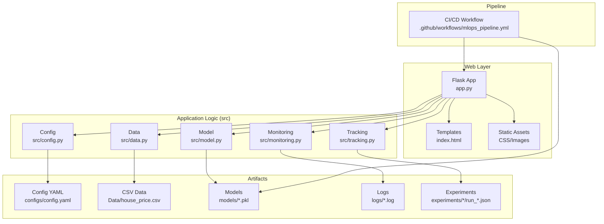
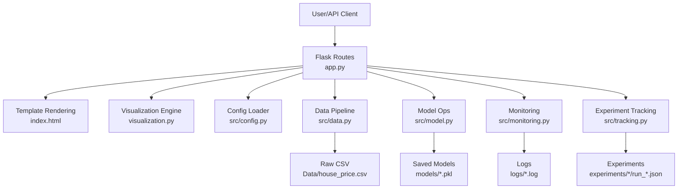
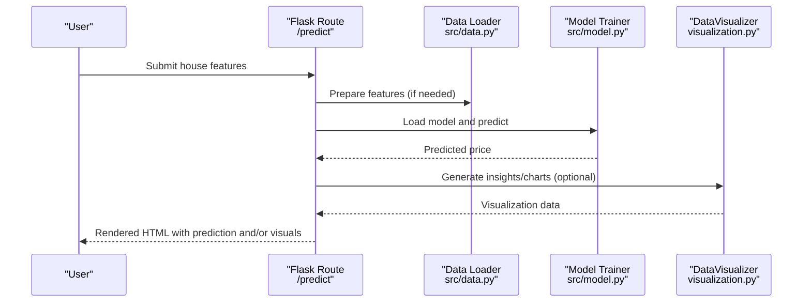
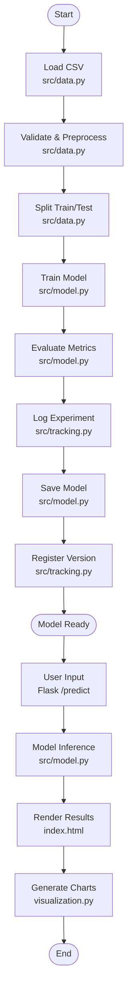
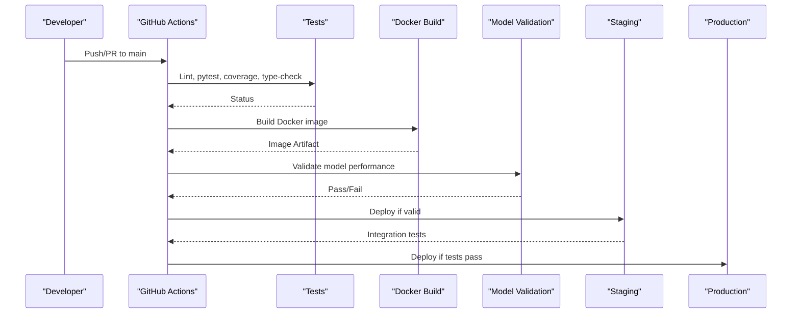
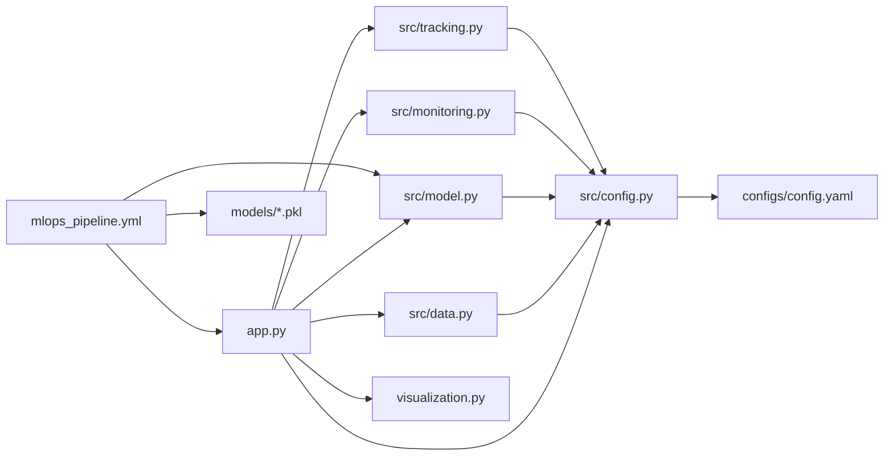

# System Overview

<cite>
**Referenced Files in This Document**
- [app.py](file://House_Price_Prediction-main/housing1/app.py)
- [index.html](file://House_Price_Prediction-main/housing1/templates/index.html)
- [visualization.py](file://House_Price_Prediction-main/housing1/visualization.py)
- [config.yaml](file://House_Price_Prediction-main/housing1/configs/config.yaml)
- [config.py](file://House_Price_Prediction-main/housing1/src/config.py)
- [data.py](file://House_Price_Prediction-main/housing1/src/data.py)
- [model.py](file://House_Price_Prediction-main/housing1/src/model.py)
- [monitoring.py](file://House_Price_Prediction-main/housing1/src/monitoring.py)
- [tracking.py](file://House_Price_Prediction-main/housing1/src/tracking.py)
- [mlops_pipeline.yml](file://House_Price_Prediction-main/housing1/.github/workflows/mlops_pipeline.yml)
- [ARCHITECTURE.md](file://House_Price_Prediction-main/housing1/ARCHITECTURE.md)
- [MLOPS_WORKFLOW.md](file://House_Price_Prediction-main/housing1/MLOPS_WORKFLOW.md)
- [requirements.txt](file://House_Price_Prediction-main/housing1/requirements.txt)
</cite>

## Table of Contents
1. [Introduction](#introduction)
2. [Project Structure](#project-structure)
3. [Core Components](#core-components)
4. [Architecture Overview](#architecture-overview)
5. [Detailed Component Analysis](#detailed-component-analysis)
6. [Dependency Analysis](#dependency-analysis)
7. [Performance Considerations](#performance-considerations)
8. [Troubleshooting Guide](#troubleshooting-guide)
9. [Conclusion](#conclusion)

## Introduction
This document presents a comprehensive system overview of the House Price Prediction MLOps architecture. It explains the overall design principles, high-level components, and their relationships. The system follows an MVC-like pattern with Flask routes serving as the controller layer, modular Python components implementing the model and view logic, and an integrated MLOps pipeline covering training, evaluation, experiment tracking, model registry, monitoring, and CI/CD. The documentation includes system context diagrams showing data flow from CSV input through model inference to web visualization, and it provides both beginner-friendly conceptual explanations and technical details for experienced developers.

## Project Structure
The project is organized around a clear separation of concerns:
- Web application entrypoint and routes: Flask app with HTML templates and static assets
- Modular MLOps source code under src/: configuration, data handling, model lifecycle, monitoring, and experiment tracking
- Configuration files under configs/: centralized YAML configuration
- Data and artifacts: CSV datasets, processed splits, trained models, logs, and experiments
- MLOps pipeline: GitHub Actions workflow automating testing, building, validating, and deploying the model and API
- Documentation: architecture and workflow guides

**Diagram sources**
- [app.py:1-113](file://House_Price_Prediction-main/housing1/app.py#L1-L113)
- [index.html:1-145](file://House_Price_Prediction-main/housing1/templates/index.html#L1-L145)
- [config.py:1-63](file://House_Price_Prediction-main/housing1/src/config.py#L1-L63)
- [data.py:1-109](file://House_Price_Prediction-main/housing1/src/data.py#L1-L109)
- [model.py:1-155](file://House_Price_Prediction-main/housing1/src/model.py#L1-L155)
- [monitoring.py:1-218](file://House_Price_Prediction-main/housing1/src/monitoring.py#L1-L218)
- [tracking.py:1-218](file://House_Price_Prediction-main/housing1/src/tracking.py#L1-L218)
- [config.yaml:1-60](file://House_Price_Prediction-main/housing1/configs/config.yaml#L1-L60)
- [mlops_pipeline.yml:1-180](file://House_Price_Prediction-main/housing1/.github/workflows/mlops_pipeline.yml#L1-L180)

**Section sources**
- [ARCHITECTURE.md:273-294](file://House_Price_Prediction-main/housing1/ARCHITECTURE.md#L273-L294)
- [requirements.txt:1-24](file://House_Price_Prediction-main/housing1/requirements.txt#L1-L24)

## Core Components
- Flask application and routing: Provides the web interface and API endpoints for prediction, visualization, and dashboard rendering.
- Configuration management: Centralized YAML configuration loaded via a Python Config class for paths, model settings, training parameters, and monitoring thresholds.
- Data pipeline: Loads CSV data, validates and preprocesses it, and saves processed splits for reproducibility.
- Model lifecycle: Trains scikit-learn models, evaluates metrics, persists models, and registers versions.
- Experiment tracking: Starts runs, logs parameters and metrics, compares runs, and maintains a registry of model versions.
- Monitoring: Logs predictions and performance, detects drift, and raises alerts based on configurable thresholds.
- Visualization: Generates static charts and an interactive dashboard for data insights and model performance.
- CI/CD pipeline: Automates testing, building, model validation, and deployment stages.

**Section sources**
- [app.py:37-113](file://House_Price_Prediction-main/housing1/app.py#L37-L113)
- [config.py:10-63](file://House_Price_Prediction-main/housing1/src/config.py#L10-L63)
- [config.yaml:1-60](file://House_Price_Prediction-main/housing1/configs/config.yaml#L1-L60)
- [data.py:13-109](file://House_Price_Prediction-main/housing1/src/data.py#L13-L109)
- [model.py:17-155](file://House_Price_Prediction-main/housing1/src/model.py#L17-L155)
- [tracking.py:14-218](file://House_Price_Prediction-main/housing1/src/tracking.py#L14-L218)
- [monitoring.py:15-218](file://House_Price_Prediction-main/housing1/src/monitoring.py#L15-L218)
- [visualization.py:23-348](file://House_Price_Prediction-main/housing1/visualization.py#L23-L348)
- [mlops_pipeline.yml:1-180](file://House_Price_Prediction-main/housing1/.github/workflows/mlops_pipeline.yml#L1-L180)

## Architecture Overview
The system follows an MVC-like pattern:
- Model: Data loaders, preprocessors, trainers, evaluators, and monitors encapsulate machine learning logic.
- View: Flask templates render predictions, visualizations, and dashboards.
- Controller: Flask routes handle requests, orchestrate data loading and model inference, and render appropriate views.

**Diagram sources**
- [app.py:37-113](file://House_Price_Prediction-main/housing1/app.py#L37-L113)
- [index.html:1-145](file://House_Price_Prediction-main/housing1/templates/index.html#L1-L145)
- [visualization.py:23-348](file://House_Price_Prediction-main/housing1/visualization.py#L23-L348)
- [config.py:10-63](file://House_Price_Prediction-main/housing1/src/config.py#L10-L63)
- [data.py:13-109](file://House_Price_Prediction-main/housing1/src/data.py#L13-L109)
- [model.py:17-155](file://House_Price_Prediction-main/housing1/src/model.py#L17-L155)
- [monitoring.py:15-218](file://House_Price_Prediction-main/housing1/src/monitoring.py#L15-L218)
- [tracking.py:14-218](file://House_Price_Prediction-main/housing1/src/tracking.py#L14-L218)

## Detailed Component Analysis

### MVC Pattern with Flask Routes
- Controller: Flask routes define endpoints for home, prediction, visualization, and dashboard pages. They collect form inputs, prepare features, call model inference, and render templates with context variables.
- View: Jinja2 templates render the UI, including navigation, prediction forms, visualization images, and interactive dashboards.
- Model: Modular components encapsulate data loading, preprocessing, training, evaluation, monitoring, and experiment tracking.

**Diagram sources**
- [app.py:42-66](file://House_Price_Prediction-main/housing1/app.py#L42-L66)
- [data.py:55-88](file://House_Price_Prediction-main/housing1/src/data.py#L55-L88)
- [model.py:79-87](file://House_Price_Prediction-main/housing1/src/model.py#L79-L87)
- [visualization.py:295-316](file://House_Price_Prediction-main/housing1/visualization.py#L295-L316)

**Section sources**
- [app.py:37-113](file://House_Price_Prediction-main/housing1/app.py#L37-L113)
- [index.html:1-145](file://House_Price_Prediction-main/housing1/templates/index.html#L1-L145)

### Data Flow: CSV Input to Model Inference to Web Visualization
- Data ingestion: CSV is loaded and validated; features and targets are separated; train/test splits are generated and persisted.
- Training and evaluation: Models are trained, evaluated with multiple metrics, tracked, and saved; versions are registered.
- Inference: The Flask app loads the trained model and predicts prices for user inputs.
- Visualization: Static charts and an interactive dashboard are rendered in the browser.

**Diagram sources**
- [data.py:20-109](file://House_Price_Prediction-main/housing1/src/data.py#L20-L109)
- [model.py:47-87](file://House_Price_Prediction-main/housing1/src/model.py#L47-L87)
- [tracking.py:25-74](file://House_Price_Prediction-main/housing1/src/tracking.py#L25-L74)
- [app.py:42-66](file://House_Price_Prediction-main/housing1/app.py#L42-L66)
- [index.html:80-138](file://House_Price_Prediction-main/housing1/templates/index.html#L80-L138)
- [visualization.py:50-239](file://House_Price_Prediction-main/housing1/visualization.py#L50-L239)

**Section sources**
- [MLOPS_WORKFLOW.md:37-63](file://House_Price_Prediction-main/housing1/MLOPS_WORKFLOW.md#L37-L63)
- [ARCHITECTURE.md:53-86](file://House_Price_Prediction-main/housing1/ARCHITECTURE.md#L53-L86)

### MLOps Pipeline Integration
- CI/CD workflow automates linting, testing, type checking, Docker image building, model validation, and deployment to staging and production.
- The pipeline validates model performance thresholds and deploys artifacts conditionally.

**Diagram sources**
- [mlops_pipeline.yml:1-180](file://House_Price_Prediction-main/housing1/.github/workflows/mlops_pipeline.yml#L1-L180)

**Section sources**
- [mlops_pipeline.yml:9-180](file://House_Price_Prediction-main/housing1/.github/workflows/mlops_pipeline.yml#L9-L180)
- [MLOPS_WORKFLOW.md:209-230](file://House_Price_Prediction-main/housing1/MLOPS_WORKFLOW.md#L209-L230)

### Technology Stack Integration Points
- Backend: Flask handles routing and templating; Gunicorn serves in production; NumPy/Pandas/SciKit-learn power ML operations.
- Data & ML: CSV ingestion, preprocessing, model training and evaluation, and serialization with joblib.
- DevOps: Docker containerization and GitHub Actions orchestration.
- Monitoring: Custom logging and structured JSON logs for observability.
- Visualization: Matplotlib/Seaborn for static charts and Plotly for interactive dashboards.

**Section sources**
- [requirements.txt:1-24](file://House_Price_Prediction-main/housing1/requirements.txt#L1-L24)
- [ARCHITECTURE.md:204-228](file://House_Price_Prediction-main/housing1/ARCHITECTURE.md#L204-L228)

## Dependency Analysis
The Flask application depends on modular components that share configuration and data paths. The MLOps modules coordinate training, evaluation, tracking, and monitoring. The CI/CD workflow integrates these components end-to-end.

**Diagram sources**
- [app.py:1-113](file://House_Price_Prediction-main/housing1/app.py#L1-L113)
- [config.py:10-63](file://House_Price_Prediction-main/housing1/src/config.py#L10-L63)
- [data.py:13-109](file://House_Price_Prediction-main/housing1/src/data.py#L13-L109)
- [model.py:17-155](file://House_Price_Prediction-main/housing1/src/model.py#L17-L155)
- [monitoring.py:15-218](file://House_Price_Prediction-main/housing1/src/monitoring.py#L15-L218)
- [tracking.py:14-218](file://House_Price_Prediction-main/housing1/src/tracking.py#L14-L218)
- [visualization.py:23-348](file://House_Price_Prediction-main/housing1/visualization.py#L23-L348)
- [config.yaml:1-60](file://House_Price_Prediction-main/housing1/configs/config.yaml#L1-L60)
- [mlops_pipeline.yml:1-180](file://House_Price_Prediction-main/housing1/.github/workflows/mlops_pipeline.yml#L1-L180)

**Section sources**
- [ARCHITECTURE.md:88-149](file://House_Price_Prediction-main/housing1/ARCHITECTURE.md#L88-L149)

## Performance Considerations
- Model persistence: Joblib is used for efficient serialization of scikit-learn models.
- Visualization rendering: Charts are encoded as base64 PNGs embedded in templates to avoid extra requests.
- Production serving: Gunicorn workers serve the Flask app behind a reverse proxy in production environments.
- Monitoring overhead: Logging and alerts are configured to minimize impact while providing actionable signals.

[No sources needed since this section provides general guidance]

## Troubleshooting Guide
Common issues and remedies:
- Model performance drops: Investigate data drift, validate input quality, retrain with recent data, and consider feature engineering.
- API slow response: Check server resources, increase workers in production, optimize model loading, and use caching.
- High error rate: Verify input validation, review error logs, add robust try-catch blocks, and improve error messages.

**Section sources**
- [MLOPS_WORKFLOW.md:361-381](file://House_Price_Prediction-main/housing1/MLOPS_WORKFLOW.md#L361-L381)

## Conclusion
The House Price Prediction MLOps architecture cleanly separates concerns across configuration, data, modeling, monitoring, and experiment tracking, while exposing a simple Flask-based web interface and API. The CI/CD pipeline ensures automated quality gates and safe deployments. Together, these components deliver a scalable, observable, and maintainable system suitable for iterative model development and production inference.