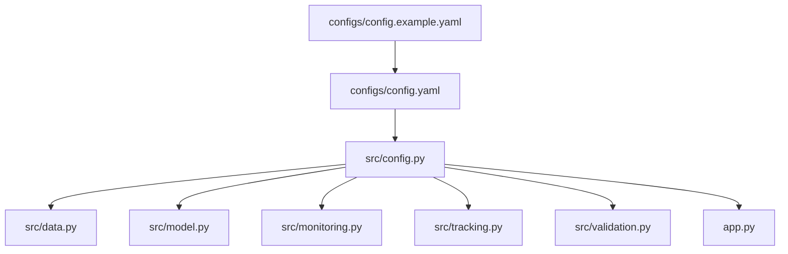
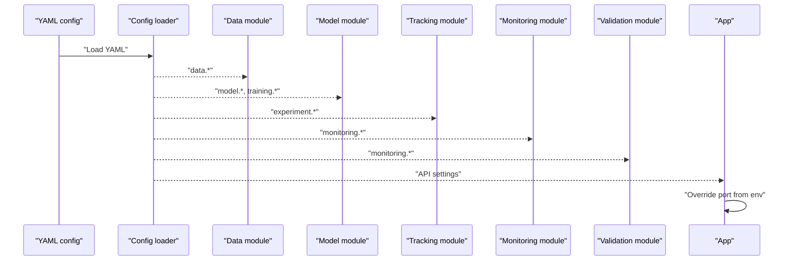
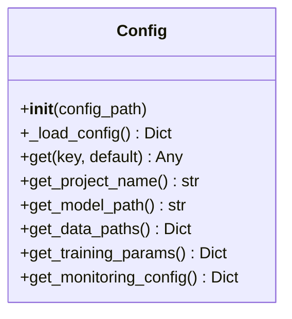
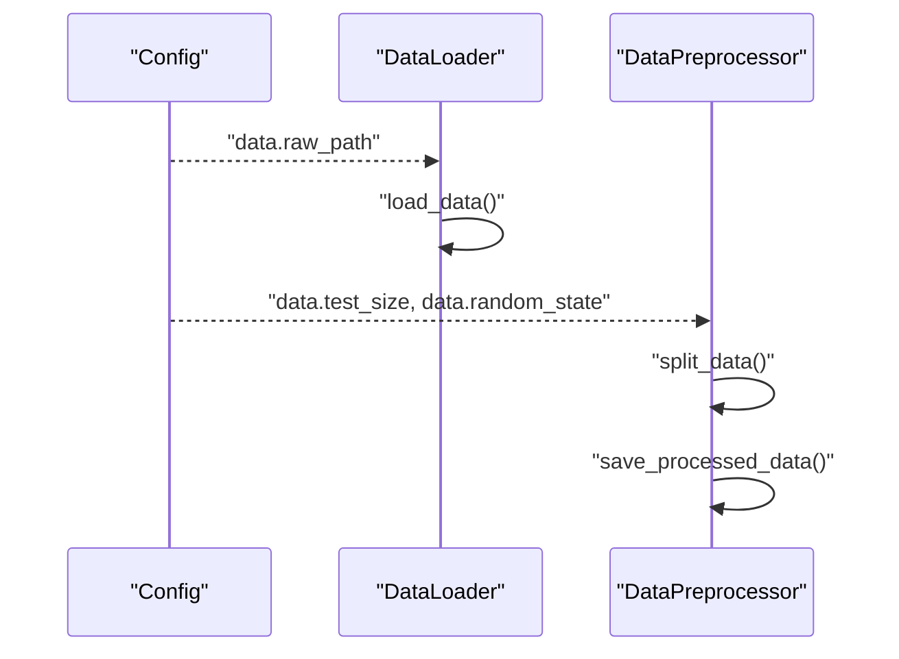
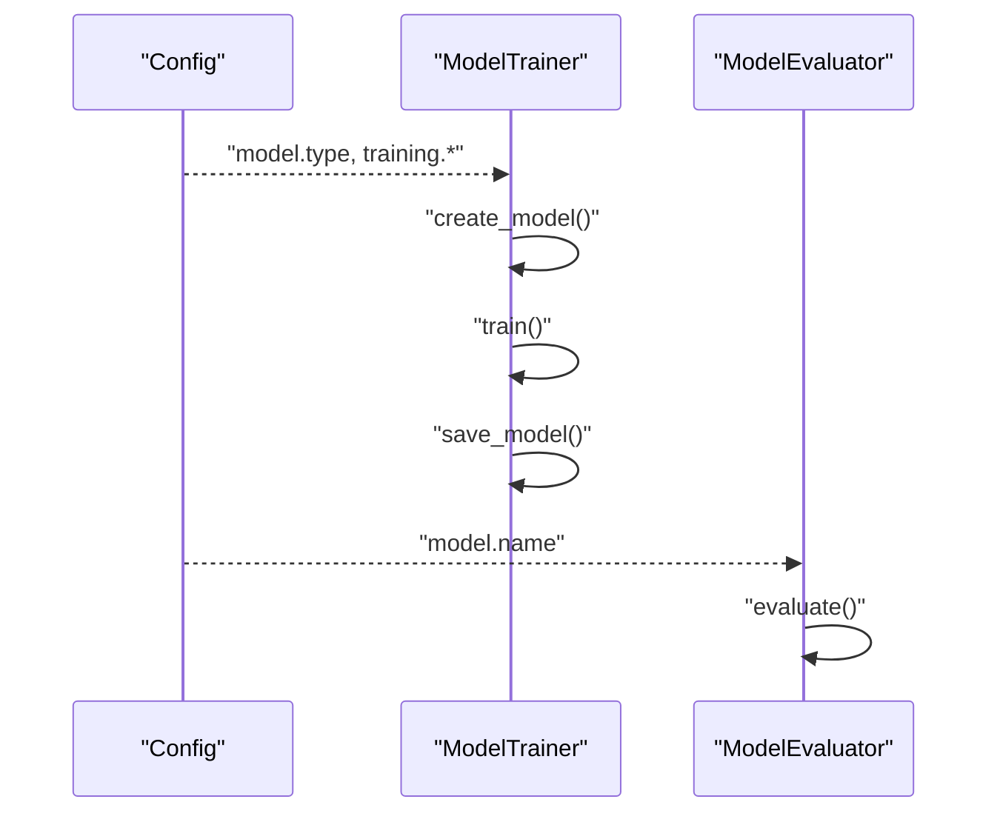
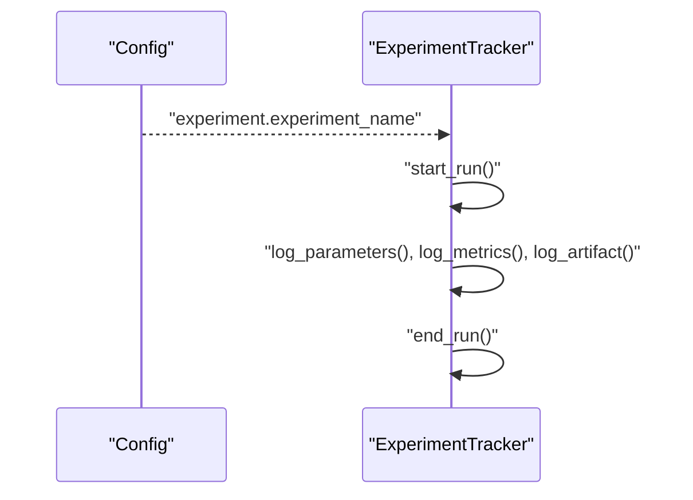
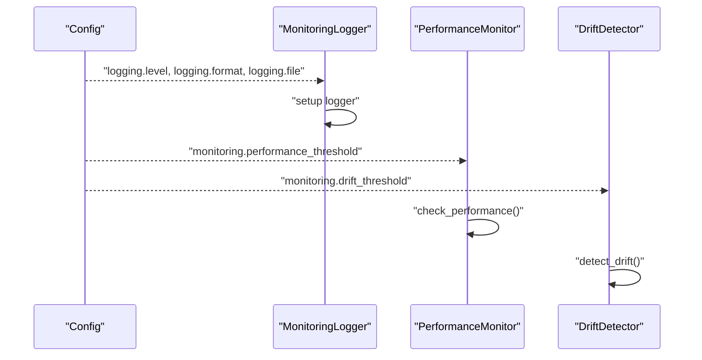
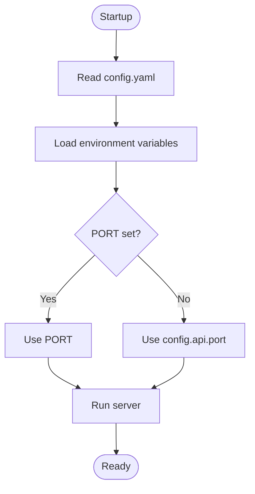
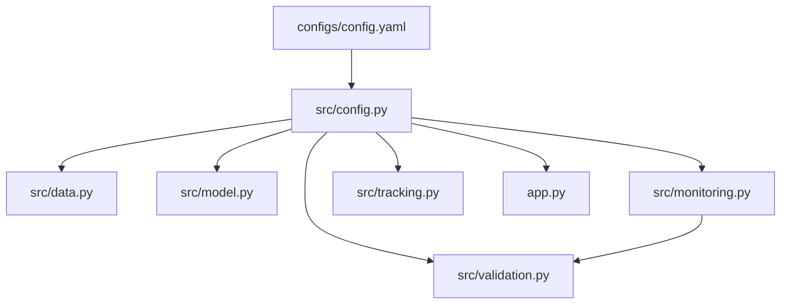

# Configuration Management

<cite>
**Referenced Files in This Document**
- [config.yaml](file://configs/config.yaml)
- [config.example.yaml](file://configs/config.example.yaml)
- [config.py](file://src/config.py)
- [data.py](file://src/data.py)
- [model.py](file://src/model.py)
- [monitoring.py](file://src/monitoring.py)
- [tracking.py](file://src/tracking.py)
- [validation.py](file://src/validation.py)
- [docker-compose.yml](file://docker-compose.yml)
- [app.py](file://app.py)
</cite>

## Table of Contents
1. [Introduction](#introduction)
2. [Project Structure](#project-structure)
3. [Core Components](#core-components)
4. [Architecture Overview](#architecture-overview)
5. [Detailed Component Analysis](#detailed-component-analysis)
6. [Dependency Analysis](#dependency-analysis)
7. [Performance Considerations](#performance-considerations)
8. [Troubleshooting Guide](#troubleshooting-guide)
9. [Conclusion](#conclusion)
10. [Appendices](#appendices)

## Introduction
This document explains the YAML-based configuration system used across the MLOps pipeline for house price prediction. It covers the structure of config.yaml, the Python configuration loader, environment-specific overrides, defaults, validation, and error handling. It also documents how configuration drives data loading, model training, experiment tracking, monitoring, and logging, and provides best practices for managing configuration across environments.

## Project Structure
The configuration system centers around a single YAML file and a small Python loader that exposes configuration values to the rest of the application. Supporting modules consume configuration to drive data ingestion, training, evaluation, monitoring, and experiment tracking.

**Diagram sources**
- [config.yaml](file://configs/config.yaml)
- [config.example.yaml](file://configs/config.example.yaml)
- [config.py](file://src/config.py)
- [data.py](file://src/data.py)
- [model.py](file://src/model.py)
- [monitoring.py](file://src/monitoring.py)
- [tracking.py](file://src/tracking.py)
- [validation.py](file://src/validation.py)
- [app.py](file://app.py)

**Section sources**
- [config.yaml](file://configs/config.yaml)
- [config.example.yaml](file://configs/config.example.yaml)
- [config.py](file://src/config.py)

## Core Components
- YAML configuration file defines project metadata, data paths, model settings, training parameters, experiment tracking, monitoring thresholds, API settings, and logging configuration.
- The Python configuration loader reads YAML, supports nested key retrieval via dot notation, and provides convenience getters for common sections.
- Environment variables override selected runtime settings (for example, API port), while YAML remains the primary source of truth.

Key configuration areas:
- Project: name, version, description
- Data: raw and processed paths, splits, seeds
- Model: type, name, save path, metrics
- Training: solver parameters and early stopping
- Experiment: tracking URI and experiment name
- Monitoring: drift and performance thresholds, check frequency, alert contact
- API: host, port, debug flag, worker count
- Logging: level, format, file path

Practical customization examples:
- Adjust data paths: update raw and processed locations under data.
- Change model hyperparameters: adjust training parameters or model type/metrics.
- Set monitoring thresholds: tune drift and performance thresholds.
- Configure logging: change level, format, and output file.

Best practices:
- Keep secrets out of YAML; use environment variables or external secret stores.
- Maintain separate environment-specific YAML files or overlays.
- Version configuration alongside code and document breaking changes.
- Validate configuration at startup and fail fast on critical misconfiguration.

**Section sources**
- [config.yaml](file://configs/config.yaml)
- [config.example.yaml](file://configs/config.example.yaml)
- [config.py](file://src/config.py)
- [docker-compose.yml](file://docker-compose.yml)

## Architecture Overview
Configuration flows from YAML to the loader and then to all system components. The loader centralizes access and provides defaults. Some runtime values are overridden by environment variables.

**Diagram sources**
- [config.py](file://src/config.py)
- [data.py](file://src/data.py)
- [model.py](file://src/model.py)
- [tracking.py](file://src/tracking.py)
- [monitoring.py](file://src/monitoring.py)
- [validation.py](file://src/validation.py)
- [app.py](file://app.py)

## Detailed Component Analysis

### YAML Configuration Structure
The YAML file organizes settings into logical groups:
- project: project metadata
- data: data paths and splits
- model: model type, name, save path, metrics
- training: solver and early stopping parameters
- experiment: MLflow-style tracking settings
- monitoring: drift and performance thresholds, alerting
- api: host, port, debug, workers
- logging: level, format, file

Example reference paths:
- Project metadata: [config.yaml](file://configs/config.yaml)
- Data paths and splits: [config.yaml](file://configs/config.yaml)
- Model settings and metrics: [config.yaml](file://configs/config.yaml)
- Training parameters: [config.yaml](file://configs/config.yaml)
- Experiment tracking: [config.yaml](file://configs/config.yaml)
- Monitoring thresholds: [config.yaml](file://configs/config.yaml)
- API settings: [config.yaml](file://configs/config.yaml)
- Logging configuration: [config.yaml](file://configs/config.yaml)

**Section sources**
- [config.yaml](file://configs/config.yaml)

### Python Configuration Loader
The loader:
- Reads YAML safely and returns a dictionary
- Provides dot-notation access to nested keys
- Returns defaults when keys are missing
- Exposes convenience getters for common sections

Key behaviors:
- Loads from a configurable path
- Gracefully handles missing files by returning an empty dictionary
- Supports nested retrieval for deep keys
- Offers helpers for data paths, model save path, training params, and monitoring config

**Diagram sources**
- [config.py](file://src/config.py)

**Section sources**
- [config.py](file://src/config.py)

### Data Loading and Preprocessing
Data components read configuration to locate datasets and control splits:
- DataLoader uses the configured raw path
- DataPreprocessor reads test size and random state from configuration
- Saves processed datasets to the configured processed directory

**Diagram sources**
- [config.py](file://src/config.py)
- [data.py](file://src/data.py)

**Section sources**
- [data.py](file://src/data.py)
- [config.py](file://src/config.py)

### Model Training and Evaluation
Model components use configuration to select model type and training parameters:
- ModelTrainer creates and trains a model based on configuration
- Training parameters are read from configuration
- Model save path and name come from configuration

**Diagram sources**
- [config.py](file://src/config.py)
- [model.py](file://src/model.py)

**Section sources**
- [model.py](file://src/model.py)
- [config.py](file://src/config.py)

### Experiment Tracking
Experiment tracking reads configuration for experiment naming and persistence:
- Uses configured experiment name and tracking directory
- Logs runs, parameters, metrics, and artifacts
- Persists runs to JSON files for later inspection

**Diagram sources**
- [config.py](file://src/config.py)
- [tracking.py](file://src/tracking.py)

**Section sources**
- [tracking.py](file://src/tracking.py)
- [config.py](file://src/config.py)

### Monitoring and Logging
Monitoring and logging components use configuration for thresholds and logging setup:
- MonitoringLogger initializes logging with configured level and format
- PerformanceMonitor applies configured thresholds for performance checks
- DriftDetector uses configured thresholds for drift detection

**Diagram sources**
- [config.py](file://src/config.py)
- [monitoring.py](file://src/monitoring.py)
- [validation.py](file://src/validation.py)

**Section sources**
- [monitoring.py](file://src/monitoring.py)
- [validation.py](file://src/validation.py)
- [config.py](file://src/config.py)

### API and Environment Overrides
The API server reads the port from an environment variable, allowing deployment platforms to override the default port without changing YAML:
- Port override: [app.py](file://app.py)
- Container environment variables: [docker-compose.yml](file://docker-compose.yml)

**Diagram sources**
- [app.py](file://app.py)
- [docker-compose.yml](file://docker-compose.yml)

**Section sources**
- [app.py](file://app.py)
- [docker-compose.yml](file://docker-compose.yml)

## Dependency Analysis
Configuration is consumed by multiple modules. The loader acts as a central dependency, while some modules depend on others indirectly (for example, monitoring depends on validation’s drift detector).

**Diagram sources**
- [config.yaml](file://configs/config.yaml)
- [config.py](file://src/config.py)
- [data.py](file://src/data.py)
- [model.py](file://src/model.py)
- [monitoring.py](file://src/monitoring.py)
- [tracking.py](file://src/tracking.py)
- [validation.py](file://src/validation.py)
- [app.py](file://app.py)

**Section sources**
- [config.py](file://src/config.py)
- [data.py](file://src/data.py)
- [model.py](file://src/model.py)
- [monitoring.py](file://src/monitoring.py)
- [tracking.py](file://src/tracking.py)
- [validation.py](file://src/validation.py)
- [app.py](file://app.py)

## Performance Considerations
- Centralized configuration reduces repeated IO and parsing overhead.
- Using dot-notation access avoids deep nested lookups in hot paths.
- Prefer environment overrides for deployment-specific values (like port) to avoid re-parsing YAML during runtime.

## Troubleshooting Guide
Common issues and resolutions:
- Missing configuration file: The loader prints a message and returns an empty dictionary. Ensure the config path exists or set an environment override.
- Missing keys: The loader returns defaults; verify YAML structure and key names.
- Data path errors: Ensure raw and processed paths exist and are readable/writable.
- Model save/load failures: Confirm model save path permissions and that a model was trained.
- Monitoring thresholds: Tune drift and performance thresholds based on observed baselines.
- Logging misconfiguration: Verify logging level and file path; ensure the directory exists.

**Section sources**
- [config.py](file://src/config.py)
- [data.py](file://src/data.py)
- [model.py](file://src/model.py)
- [monitoring.py](file://src/monitoring.py)
- [validation.py](file://src/validation.py)

## Conclusion
The configuration system provides a clean separation between settings and logic. YAML defines behavior, the loader supplies defaults and accessors, and environment variables handle deployment-specific overrides. By following best practices—keeping secrets out of YAML, maintaining environment-specific files, and validating configuration at startup—you can achieve reliable, maintainable, and secure deployments.

## Appendices

### Practical Customization Examples
- Customize data paths:
  - Update raw and processed paths under data.
  - Reference: [config.yaml](file://configs/config.yaml)
- Adjust model hyperparameters:
  - Modify training parameters or model type/metrics.
  - Reference: [config.yaml](file://configs/config.yaml)
- Set monitoring thresholds:
  - Tune drift and performance thresholds.
  - Reference: [config.yaml](file://configs/config.yaml)
- Configure logging:
  - Change level, format, and output file.
  - Reference: [config.yaml](file://configs/config.yaml)

### Best Practices
- Secrets handling:
  - Store sensitive values in environment variables or secret managers; do not commit secrets to YAML.
- Environment-specific settings:
  - Maintain separate YAML files per environment (for example, dev, staging, prod) or use overlays.
- Configuration versioning:
  - Track changes to config.yaml alongside code; document breaking changes.
- Validation and defaults:
  - Validate configuration at startup and fail fast on critical misconfiguration.