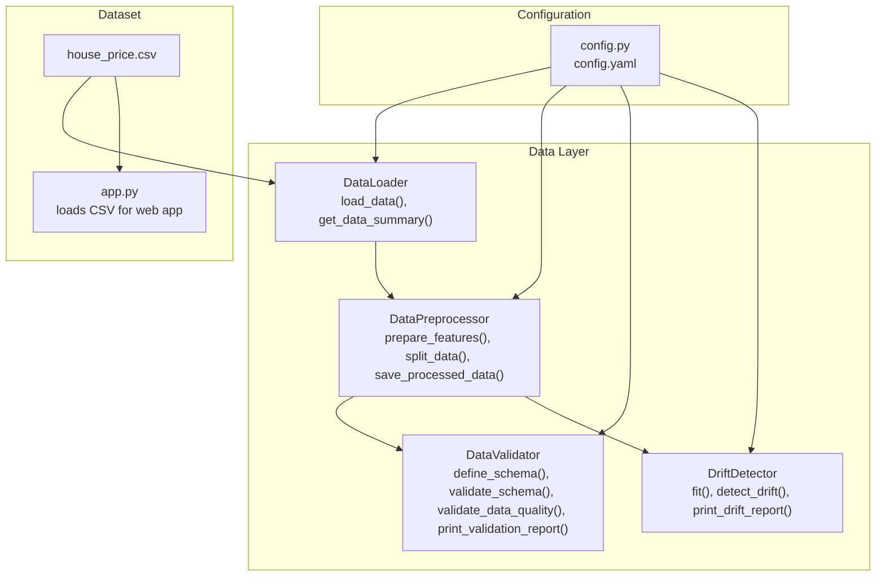
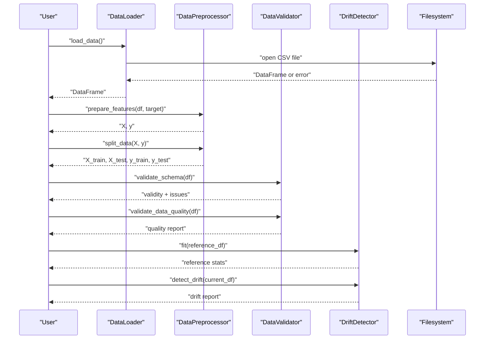
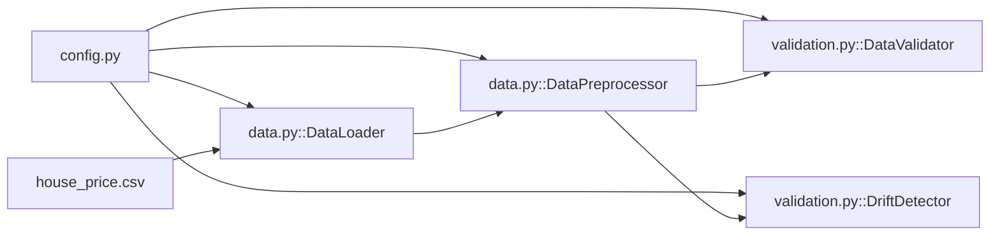
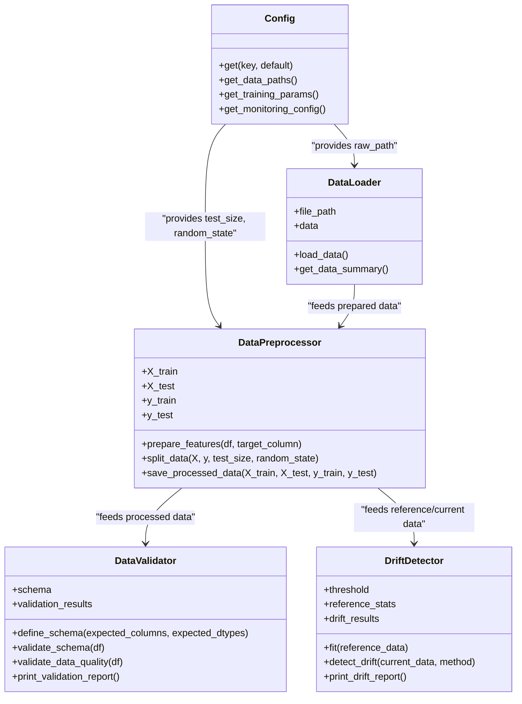
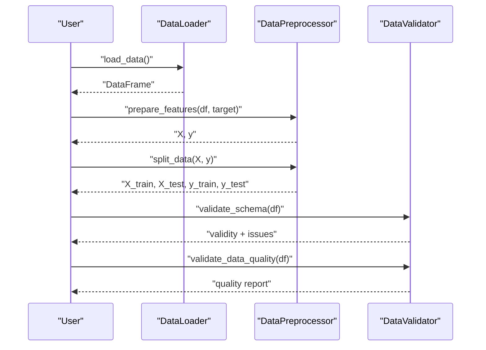

# Data Loading and Validation

<cite>
**Referenced Files in This Document**
- [data.py](file://House_Price_Prediction-main/housing1/src/data.py)
- [validation.py](file://House_Price_Prediction-main/housing1/src/validation.py)
- [config.py](file://House_Price_Prediction-main/housing1/src/config.py)
- [config.yaml](file://House_Price_Prediction-main/housing1/configs/config.yaml)
- [house_price.csv](file://House_Price_Prediction-main/housing1/Data/house_price.csv)
- [test_components.py](file://House_Price_Prediction-main/housing1/tests/test_components.py)
- [app.py](file://House_Price_Prediction-main/housing1/app.py)
</cite>

## Table of Contents
1. [Introduction](#introduction)
2. [Project Structure](#project-structure)
3. [Core Components](#core-components)
4. [Architecture Overview](#architecture-overview)
5. [Detailed Component Analysis](#detailed-component-analysis)
6. [Dependency Analysis](#dependency-analysis)
7. [Performance Considerations](#performance-considerations)
8. [Troubleshooting Guide](#troubleshooting-guide)
9. [Conclusion](#conclusion)
10. [Appendices](#appendices)

## Introduction
This document explains the data loading and validation system used in the house price prediction MLOps pipeline. It focuses on:
- How CSV data is loaded and validated
- Error handling for missing files and exceptions
- Data validation processes including schema checks, data type verification, missing value detection, and integrity checks
- Data summary functionality that reports shape, column names, missing value counts, and data types
- Practical examples for loading different CSV formats, handling encoding issues, and validating data quality
- Best practices for integrating these components into machine learning pipelines

## Project Structure
The data loading and validation system is implemented in the src package and configured via YAML. The primary files involved are:
- Data loading and preprocessing: [data.py](file://House_Price_Prediction-main/housing1/src/data.py)
- Data validation and drift detection: [validation.py](file://House_Price_Prediction-main/housing1/src/validation.py)
- Configuration management: [config.py](file://House_Price_Prediction-main/housing1/src/config.py), [config.yaml](file://House_Price_Prediction-main/housing1/configs/config.yaml)
- Example dataset: [house_price.csv](file://House_Price_Prediction-main/housing1/Data/house_price.csv)
- Tests demonstrating usage: [test_components.py](file://House_Price_Prediction-main/housing1/tests/test_components.py)
- Web app demonstrating CSV loading: [app.py](file://House_Price_Prediction-main/housing1/app.py)

**Diagram sources**
- [data.py:13-109](file://House_Price_Prediction-main/housing1/src/data.py#L13-L109)
- [validation.py:14-243](file://House_Price_Prediction-main/housing1/src/validation.py#L14-L243)
- [config.py:10-63](file://House_Price_Prediction-main/housing1/src/config.py#L10-L63)
- [config.yaml:1-60](file://House_Price_Prediction-main/housing1/configs/config.yaml#L1-L60)
- [house_price.csv:1-12](file://House_Price_Prediction-main/housing1/Data/house_price.csv#L1-L12)
- [app.py:1-113](file://House_Price_Prediction-main/housing1/app.py#L1-L113)

**Section sources**
- [data.py:1-109](file://House_Price_Prediction-main/housing1/src/data.py#L1-L109)
- [validation.py:1-243](file://House_Price_Prediction-main/housing1/src/validation.py#L1-L243)
- [config.py:1-63](file://House_Price_Prediction-main/housing1/src/config.py#L1-L63)
- [config.yaml:1-60](file://House_Price_Prediction-main/housing1/configs/config.yaml#L1-L60)
- [house_price.csv:1-12](file://House_Price_Prediction-main/housing1/Data/house_price.csv#L1-L12)
- [app.py:1-113](file://House_Price_Prediction-main/housing1/app.py#L1-L113)

## Core Components
- DataLoader: Loads CSV data, handles missing file errors, and prints basic metadata. Provides a summary dictionary with shape, columns, missing values, and dtypes.
- DataPreprocessor: Separates features and target, splits datasets, and saves processed data to disk.
- DataValidator: Validates schema (column presence and dtypes), performs comprehensive data quality checks (missing values, duplicates, outliers), and prints a structured report.
- DriftDetector: Compares current data against reference statistics using multiple methods (Kolmogorov-Smirnov, PSI, mean-shift) and reports drift.

**Section sources**
- [data.py:13-109](file://House_Price_Prediction-main/housing1/src/data.py#L13-L109)
- [validation.py:14-243](file://House_Price_Prediction-main/housing1/src/validation.py#L14-L243)
- [config.py:45-52](file://House_Price_Prediction-main/housing1/src/config.py#L45-L52)

## Architecture Overview
The system follows a layered approach:
- Configuration layer resolves paths and hyperparameters from YAML.
- Data layer loads CSV files and prepares data for modeling.
- Validation layer ensures schema correctness and data quality.
- Drift layer monitors distribution shifts over time.

**Diagram sources**
- [data.py:20-42](file://House_Price_Prediction-main/housing1/src/data.py#L20-L42)
- [data.py:55-88](file://House_Price_Prediction-main/housing1/src/data.py#L55-L88)
- [validation.py:28-49](file://House_Price_Prediction-main/housing1/src/validation.py#L28-L49)
- [validation.py:51-99](file://House_Price_Prediction-main/housing1/src/validation.py#L51-L99)
- [validation.py:132-199](file://House_Price_Prediction-main/housing1/src/validation.py#L132-L199)

## Detailed Component Analysis

### DataLoader
Responsibilities:
- Load CSV data from a configurable path.
- Handle missing file and general exceptions with clear messages.
- Provide a summary dictionary containing shape, column names, missing value counts, and dtypes.

Key behaviors:
- Uses configuration to resolve the raw data path if none is provided.
- On successful load, prints shape information.
- On failure, raises exceptions with actionable messages.

Common usage patterns:
- Initialize with a file path or rely on configuration.
- Call load_data() before accessing summary or preprocessing.
- Use get_data_summary() to quickly inspect data characteristics.

Error handling:
- Raises FileNotFoundError when the CSV path does not exist.
- Catches generic exceptions and re-raises with a descriptive message.

Practical examples:
- Loading the example dataset from the repository.
- Handling missing file scenarios during CI/CD or deployment.

**Section sources**
- [data.py:13-42](file://House_Price_Prediction-main/housing1/src/data.py#L13-L42)
- [config.py:45-52](file://House_Price_Prediction-main/housing1/src/config.py#L45-L52)
- [config.yaml:10-14](file://House_Price_Prediction-main/housing1/configs/config.yaml#L10-L14)
- [house_price.csv:1-12](file://House_Price_Prediction-main/housing1/Data/house_price.csv#L1-L12)

### DataPreprocessor
Responsibilities:
- Separate features and target variables.
- Split data into training and testing sets with configurable sizes and random state.
- Save processed datasets to disk for reproducibility.

Key behaviors:
- Validates that the target column exists.
- Uses configuration for test size and random state.
- Saves combined datasets (features + target) for train and test sets.

Integration points:
- Works with DataLoader’s DataFrame output.
- Reads configuration for paths and split parameters.

**Section sources**
- [data.py:45-109](file://House_Price_Prediction-main/housing1/src/data.py#L45-L109)
- [config.py:45-52](file://House_Price_Prediction-main/housing1/src/config.py#L45-L52)
- [config.yaml:13-15](file://House_Price_Prediction-main/housing1/configs/config.yaml#L13-L15)

### DataValidator
Responsibilities:
- Define expected schema (columns and dtypes).
- Validate schema compliance.
- Compute comprehensive data quality report including missing values, duplicates, and outliers.
- Print a human-readable validation report.

Schema validation:
- Compares expected columns and dtypes against the DataFrame.
- Reports mismatches and missing columns.

Quality checks:
- Missing values: count and percentage per column.
- Duplicates: total duplicate rows.
- Outliers: detected via IQR for numeric columns.
- Quality score: derived from penalties for missing values, outliers, and duplicates.

Report printing:
- Summarizes totals, missing values, outliers, and quality score.
- Lists missing values and outliers per column.

**Section sources**
- [validation.py:14-122](file://House_Price_Prediction-main/housing1/src/validation.py#L14-L122)
- [validation.py:28-49](file://House_Price_Prediction-main/housing1/src/validation.py#L28-L49)
- [validation.py:51-99](file://House_Price_Prediction-main/housing1/src/validation.py#L51-L99)
- [validation.py:101-122](file://House_Price_Prediction-main/housing1/src/validation.py#L101-L122)

### DriftDetector
Responsibilities:
- Fit on reference data to capture baseline statistics.
- Detect drift in current data using multiple methods:
  - Kolmogorov-Smirnov test
  - Population Stability Index (PSI)
  - Mean-shift normalized by reference standard deviation
- Report whether drift was detected and details per feature.

Key behaviors:
- Requires reference statistics to be fitted first.
- Supports configurable thresholds.
- Prints a structured drift report.

**Section sources**
- [validation.py:124-243](file://House_Price_Prediction-main/housing1/src/validation.py#L124-L243)
- [validation.py:132-199](file://House_Price_Prediction-main/housing1/src/validation.py#L132-L199)
- [validation.py:201-224](file://House_Price_Prediction-main/housing1/src/validation.py#L201-L224)
- [validation.py:226-243](file://House_Price_Prediction-main/housing1/src/validation.py#L226-L243)

### Configuration Management
Responsibilities:
- Load YAML configuration.
- Provide nested key access with dot notation.
- Expose data paths, sizes, and random seeds.

Key behaviors:
- Safe loading with fallback to empty dict if file is missing.
- Returns defaults for missing keys.
- Supplies data-related configuration to DataLoader and DataPreprocessor.

**Section sources**
- [config.py:10-63](file://House_Price_Prediction-main/housing1/src/config.py#L10-L63)
- [config.yaml:1-60](file://House_Price_Prediction-main/housing1/configs/config.yaml#L1-L60)

## Dependency Analysis
The components depend on configuration and pandas/numpy for data operations. There are no circular dependencies among the core modules.

**Diagram sources**
- [config.py:45-52](file://House_Price_Prediction-main/housing1/src/config.py#L45-L52)
- [data.py:16-18](file://House_Price_Prediction-main/housing1/src/data.py#L16-L18)
- [validation.py:17-19](file://House_Price_Prediction-main/housing1/src/validation.py#L17-L19)

**Section sources**
- [config.py:1-63](file://House_Price_Prediction-main/housing1/src/config.py#L1-L63)
- [data.py:1-109](file://House_Price_Prediction-main/housing1/src/data.py#L1-L109)
- [validation.py:1-243](file://House_Price_Prediction-main/housing1/src/validation.py#L1-L243)

## Performance Considerations
- CSV loading: Using pandas read_csv is efficient for typical datasets. For very large files, consider chunking or specifying dtypes to reduce memory usage.
- Schema validation: Column and dtype checks are O(n) per column; acceptable for moderate feature counts.
- Outlier detection: IQR-based method is linear-time per numeric column; keep in mind overhead for many numeric features.
- Drift detection: KS test and PSI are computationally inexpensive for small-to-moderate feature sets; consider sampling for very large datasets.
- Saving processed data: Concatenation and CSV writes are straightforward; ensure sufficient disk space and avoid frequent writes in tight loops.

[No sources needed since this section provides general guidance]

## Troubleshooting Guide
Common issues and resolutions:
- Missing data file:
  - Symptom: FileNotFoundError raised during load_data().
  - Resolution: Verify the raw path in configuration and ensure the file exists at runtime.
- Unexpected exception during load:
  - Symptom: Generic exception raised with a descriptive message.
  - Resolution: Inspect underlying pandas errors (e.g., malformed CSV) and fix the file.
- No data summary available:
  - Symptom: ValueError indicating no data loaded.
  - Resolution: Call load_data() before get_data_summary().
- Target column not found:
  - Symptom: ValueError when preparing features.
  - Resolution: Confirm the target column name matches the dataset.
- Drift detection requires reference:
  - Symptom: ValueError when detecting drift without fitting reference.
  - Resolution: Call fit() with reference data before detect_drift().
- Encoding issues:
  - Symptom: UnicodeDecodeError or garbled characters.
  - Resolution: Specify encoding in pandas read_csv (e.g., UTF-8) and ensure dataset encoding matches.

Best practices:
- Always validate schema and quality before training.
- Use configuration-driven paths to avoid hardcoding.
- Log and print summaries to track data health.
- Monitor drift regularly and re-train when drift is detected.

**Section sources**
- [data.py:20-42](file://House_Price_Prediction-main/housing1/src/data.py#L20-L42)
- [data.py:55-67](file://House_Price_Prediction-main/housing1/src/data.py#L55-L67)
- [validation.py:132-150](file://House_Price_Prediction-main/housing1/src/validation.py#L132-L150)
- [validation.py:168-184](file://House_Price_Prediction-main/housing1/src/validation.py#L168-L184)

## Conclusion
The data loading and validation system provides robust mechanisms for loading CSV data, summarizing it, validating schema and quality, and monitoring drift. By leveraging configuration-driven paths and clear error handling, it integrates cleanly into MLOps pipelines. Applying the best practices and troubleshooting steps outlined here will help ensure reliable data ingestion and high-quality model training.

[No sources needed since this section summarizes without analyzing specific files]

## Appendices

### Practical Examples

- Loading the example CSV:
  - Use DataLoader to load the dataset from the repository’s Data folder.
  - Access summary statistics to confirm shape and dtypes.

- Handling encoding issues:
  - If encountering encoding problems, pass an encoding parameter to pandas read_csv and align it with the dataset’s encoding.

- Validating data quality:
  - Define a schema with expected columns and dtypes.
  - Run comprehensive quality checks to detect missing values, duplicates, and outliers.
  - Review the printed report to prioritize remediation actions.

- Monitoring drift:
  - Fit drift detector on a representative reference dataset.
  - Periodically compare current data distributions and act on detected drift.

**Section sources**
- [house_price.csv:1-12](file://House_Price_Prediction-main/housing1/Data/house_price.csv#L1-L12)
- [data.py:20-42](file://House_Price_Prediction-main/housing1/src/data.py#L20-L42)
- [validation.py:28-49](file://House_Price_Prediction-main/housing1/src/validation.py#L28-L49)
- [validation.py:51-99](file://House_Price_Prediction-main/housing1/src/validation.py#L51-L99)
- [validation.py:132-199](file://House_Price_Prediction-main/housing1/src/validation.py#L132-L199)

### Class Diagrams

**Diagram sources**
- [config.py:10-63](file://House_Price_Prediction-main/housing1/src/config.py#L10-L63)
- [data.py:13-109](file://House_Price_Prediction-main/housing1/src/data.py#L13-L109)
- [validation.py:14-243](file://House_Price_Prediction-main/housing1/src/validation.py#L14-L243)

### Sequence Diagrams

**Diagram sources**
- [data.py:20-42](file://House_Price_Prediction-main/housing1/src/data.py#L20-L42)
- [data.py:55-88](file://House_Price_Prediction-main/housing1/src/data.py#L55-L88)
- [validation.py:28-49](file://House_Price_Prediction-main/housing1/src/validation.py#L28-L49)
- [validation.py:51-99](file://House_Price_Prediction-main/housing1/src/validation.py#L51-L99)