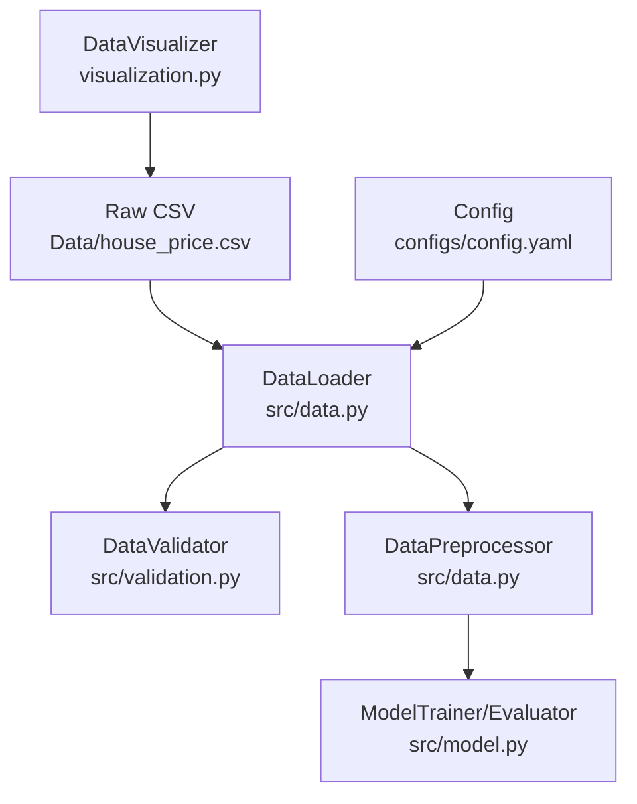
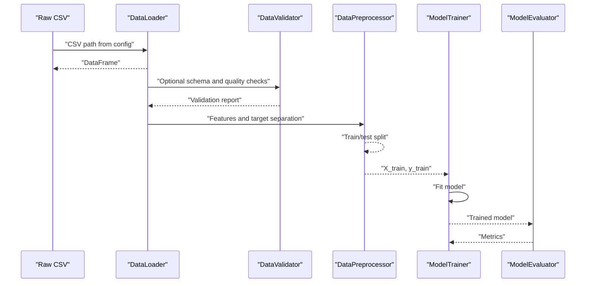
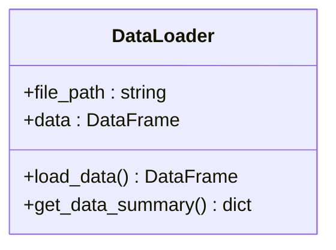
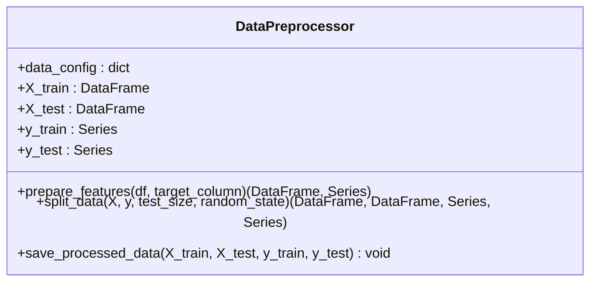
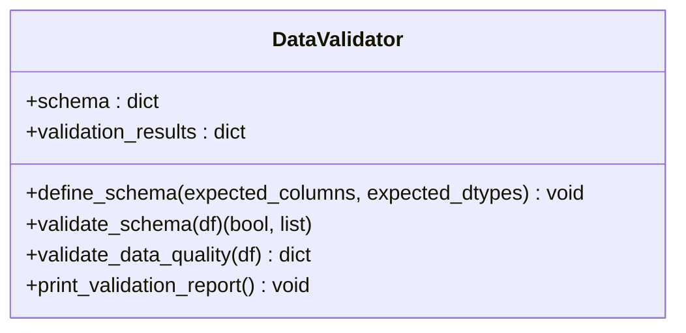
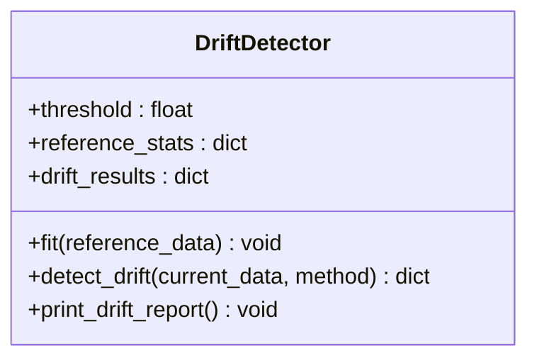
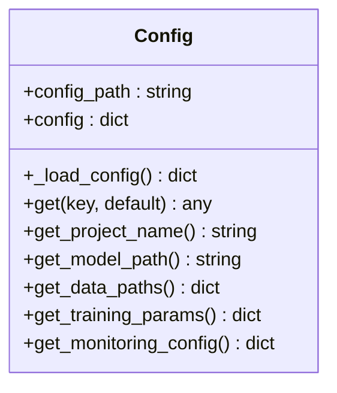
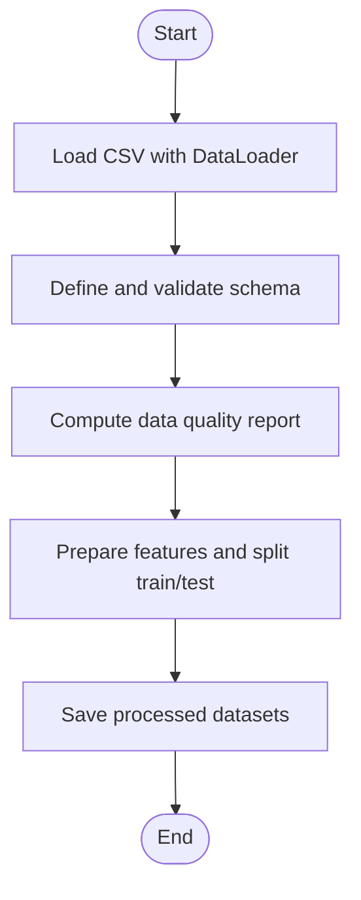
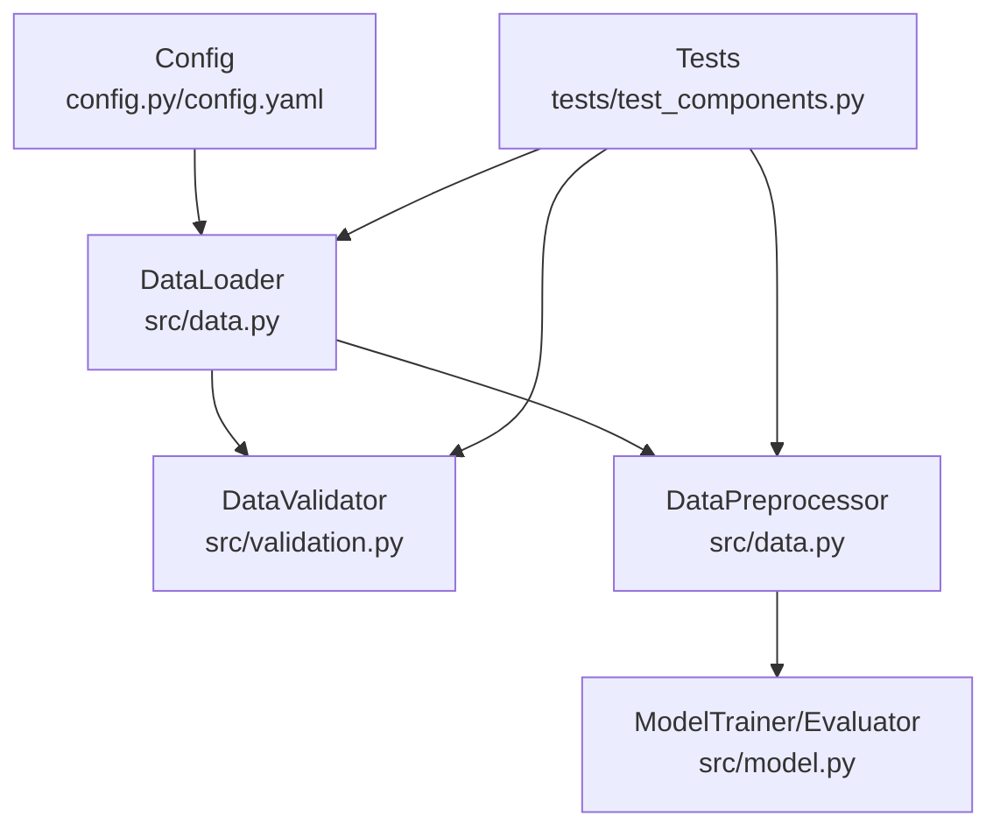
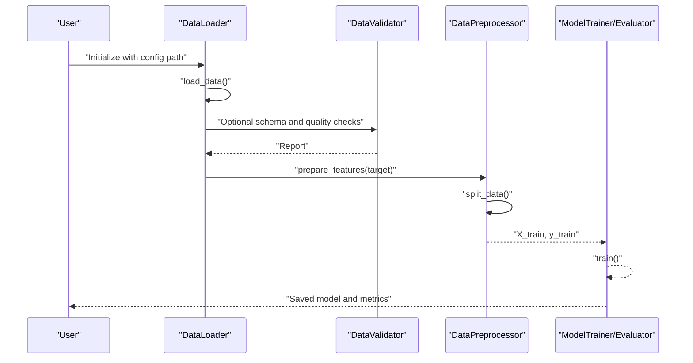

# Data Processing Pipeline

<cite>
**Referenced Files in This Document**
- [data.py](file://src/data.py)
- [validation.py](file://src/validation.py)
- [config.py](file://src/config.py)
- [config.yaml](file://configs/config.yaml)
- [house_price.csv](file://Data/house_price.csv)
- [test_components.py](file://tests/test_components.py)
- [visualization.py](file://visualization.py)
- [app.py](file://app.py)
- [model.py](file://src/model.py)
</cite>

## Table of Contents
1. [Introduction](#introduction)
2. [Project Structure](#project-structure)
3. [Core Components](#core-components)
4. [Architecture Overview](#architecture-overview)
5. [Detailed Component Analysis](#detailed-component-analysis)
6. [Dependency Analysis](#dependency-analysis)
7. [Performance Considerations](#performance-considerations)
8. [Troubleshooting Guide](#troubleshooting-guide)
9. [Conclusion](#conclusion)
10. [Appendices](#appendices)

## Introduction
This document describes the data processing pipeline used to transform raw CSV data into model-ready datasets. It covers data loading, validation, preprocessing, and feature engineering, with emphasis on the DataLoader and DataPreprocessor classes. It also documents data quality checks, drift detection, and the end-to-end flow from raw CSV through preprocessing to training and evaluation. Guidance is included for extending the pipeline with additional features and custom preprocessing steps.

## Project Structure
The pipeline is organized around modular components:
- Data ingestion and preprocessing: src/data.py
- Data validation and drift detection: src/validation.py
- Configuration management: src/config.py and configs/config.yaml
- Tests validating components: tests/test_components.py
- Example data: Data/house_price.csv
- Visualization and exploratory analysis: visualization.py
- Application entry point and example usage: app.py
- Model training and evaluation: src/model.py

**Diagram sources**
- [house_price.csv](file://Data/house_price.csv)
- [config.yaml](file://configs/config.yaml)
- [data.py](file://src/data.py)
- [validation.py](file://src/validation.py)
- [model.py](file://src/model.py)
- [visualization.py](file://visualization.py)

**Section sources**
- [data.py](file://src/data.py)
- [validation.py](file://src/validation.py)
- [config.py](file://src/config.py)
- [config.yaml](file://configs/config.yaml)

## Core Components
- DataLoader: Loads CSV data, validates presence of data, and provides a summary of shape, columns, missing values, and dtypes.
- DataPreprocessor: Separates features and target, splits into train/test sets, and saves processed datasets.
- DataValidator: Validates schema, detects missing values, identifies outliers via IQR, and computes a quality score.
- DriftDetector: Computes drift between reference/current data using KS test, PSI, or mean-shift methods.
- Config: Centralized configuration for data paths, test size, random state, and other pipeline settings.

Practical usage patterns:
- Load CSV with DataLoader, inspect summary, and optionally validate schema and quality.
- Prepare features and split data with DataPreprocessor.
- Optionally detect drift against a reference dataset.
- Train and evaluate models with ModelTrainer and ModelEvaluator.

**Section sources**
- [data.py](file://src/data.py)
- [validation.py](file://src/validation.py)
- [config.py](file://src/config.py)
- [config.yaml](file://configs/config.yaml)

## Architecture Overview
The pipeline follows a staged flow: ingest raw CSV, validate and assess quality, engineer features, split into train/test, and persist processed datasets. Optional drift detection can be performed against a reference baseline.

**Diagram sources**
- [data.py](file://src/data.py)
- [validation.py](file://src/validation.py)
- [model.py](file://src/model.py)

## Detailed Component Analysis

### DataLoader
Responsibilities:
- Load CSV data from a configured path.
- Provide a concise summary of shape, columns, missing counts, and dtypes.
- Raise explicit errors for missing files or other exceptions.

Key behaviors:
- Reads CSV using pandas.
- Stores DataFrame in memory for downstream steps.
- Summarizes missing values per column and data types.

Common usage:
- Initialize with optional file path override; otherwise uses config.
- Call load_data() to populate internal DataFrame.
- Call get_data_summary() to inspect data characteristics.

**Diagram sources**
- [data.py](file://src/data.py)

**Section sources**
- [data.py](file://src/data.py)
- [config.py](file://src/config.py)
- [config.yaml](file://configs/config.yaml)

### DataPreprocessor
Responsibilities:
- Separate features (X) and target (y) by dropping the target column.
- Split into train/test sets using scikit-learn’s train_test_split with configurable test size and random state.
- Save processed datasets to CSV for reproducibility.

Key behaviors:
- Uses configuration values for test size and random state.
- Concatenates target back to feature sets before saving.
- Prints split sizes for visibility.

**Diagram sources**
- [data.py](file://src/data.py)

**Section sources**
- [data.py](file://src/data.py)
- [config.py](file://src/config.py)
- [config.yaml](file://configs/config.yaml)

### DataValidator
Responsibilities:
- Define expected schema (columns and dtypes).
- Validate schema against incoming data.
- Compute comprehensive data quality report including missing values, duplicates, and outliers.
- Calculate a quality score derived from penalties for missingness, outliers, and duplicates.

Key behaviors:
- Schema validation compares expected columns and dtypes.
- Outlier detection uses IQR for numeric columns.
- Quality score is normalized and penalizes data defects.

**Diagram sources**
- [validation.py](file://src/validation.py)

**Section sources**
- [validation.py](file://src/validation.py)

### DriftDetector
Responsibilities:
- Establish reference statistics from a baseline dataset.
- Detect distribution drift between reference and current data using:
  - Kolmogorov–Smirnov test (KS test)
  - Population Stability Index (PSI)
  - Simple mean-shift normalized by reference standard deviation

Key behaviors:
- Requires fitting on reference data before drift detection.
- Reports whether drift was detected and lists affected features with scores and details.

**Diagram sources**
- [validation.py](file://src/validation.py)

**Section sources**
- [validation.py](file://src/validation.py)
- [config.yaml](file://configs/config.yaml)

### Configuration Management
Responsibilities:
- Load YAML configuration.
- Provide nested key access with dot notation.
- Supply data paths, test size, random state, and training parameters.

Key behaviors:
- Centralizes configurable values for data paths and pipeline parameters.
- Provides defaults when keys are missing.

**Diagram sources**
- [config.py](file://src/config.py)
- [config.yaml](file://configs/config.yaml)

**Section sources**
- [config.py](file://src/config.py)
- [config.yaml](file://configs/config.yaml)

### Example Data Formats and Usage Patterns
- CSV format: The pipeline expects a CSV with a target column named Price. The example dataset includes numeric features such as Area, Bedrooms, Bathrooms, Stories, Parking, Age, Location, and Price.
- Target extraction: The DataPreprocessor separates the target column (Price) from features.
- Train/test split: The DataPreprocessor uses configurable test size and random state.

**Diagram sources**
- [data.py](file://src/data.py)
- [validation.py](file://src/validation.py)
- [house_price.csv](file://Data/house_price.csv)

**Section sources**
- [house_price.csv](file://Data/house_price.csv)
- [data.py](file://src/data.py)
- [validation.py](file://src/validation.py)

## Dependency Analysis
The pipeline components depend on configuration and pandas/numpy/scikit-learn for data manipulation and splitting. Tests validate each component independently and together.

**Diagram sources**
- [config.py](file://src/config.py)
- [config.yaml](file://configs/config.yaml)
- [data.py](file://src/data.py)
- [validation.py](file://src/validation.py)
- [model.py](file://src/model.py)
- [test_components.py](file://tests/test_components.py)

**Section sources**
- [test_components.py](file://tests/test_components.py)
- [data.py](file://src/data.py)
- [validation.py](file://src/validation.py)
- [config.py](file://src/config.py)

## Performance Considerations
- Data loading: CSV parsing is O(n*m) where n is rows and m is columns. For large datasets, consider chunked reading or optimized dtypes.
- Train/test split: scikit-learn’s implementation is efficient; ensure appropriate random_state for reproducibility.
- Drift detection: KS test and PSI computations scale with number of numeric features and samples. For very large datasets, consider sampling or approximate methods.
- Saving processed data: CSV writes are I/O bound; ensure sufficient disk throughput.

## Troubleshooting Guide
Common issues and resolutions:
- Missing data file: DataLoader raises explicit errors when the CSV path is invalid or inaccessible. Verify the raw path in configuration.
- Target column not found: DataPreprocessor raises an error if the target column is missing. Confirm the target column name matches the dataset.
- No data loaded before summary: DataLoader requires prior load_data() call before get_data_summary().
- Drift detection without reference: DriftDetector requires fitting on reference data before detecting drift.
- Schema mismatch: DataValidator reports missing columns and dtype mismatches; align dataset columns and types with expectations.

Quality and validation tips:
- Use DataValidator to compute a quality score and identify missing values and outliers.
- Apply IQR-based outlier detection for numeric features.
- Periodically re-fit drift detectors on fresh reference data to maintain sensitivity.

**Section sources**
- [data.py](file://src/data.py)
- [validation.py](file://src/validation.py)
- [config.py](file://src/config.py)

## Conclusion
The pipeline provides a clear, modular foundation for loading, validating, preprocessing, and preparing datasets for modeling. It integrates schema validation, quality scoring, and drift detection to support robust MLOps practices. Extending the pipeline involves adding new preprocessing steps, integrating additional validation rules, and incorporating domain-specific transformations while maintaining configuration-driven behavior.

## Appendices

### End-to-End Data Flow

**Diagram sources**
- [data.py](file://src/data.py)
- [validation.py](file://src/validation.py)
- [model.py](file://src/model.py)

### Practical Examples and Guidance
- Handling different data formats:
  - Extend DataLoader to support additional formats (Parquet, JSON) by adding new loaders and updating configuration.
- Managing categorical variables:
  - Integrate pandas get_dummies or scikit-learn OneHotEncoder in a new preprocessing stage after feature separation.
- Scaling numerical features:
  - Add StandardScaler or MinMaxScaler in a new step after splitting; fit on training data only and transform both sets.
- Addressing data drift:
  - Fit DriftDetector on the initial training dataset; periodically re-compute drift against new batches and trigger alerts when drift exceeds thresholds.
- Extending the pipeline:
  - Add new preprocessing stages by subclassing or composing steps in DataPreprocessor.
  - Introduce custom validation rules in DataValidator and update schema definitions accordingly.

[No sources needed since this section provides general guidance]