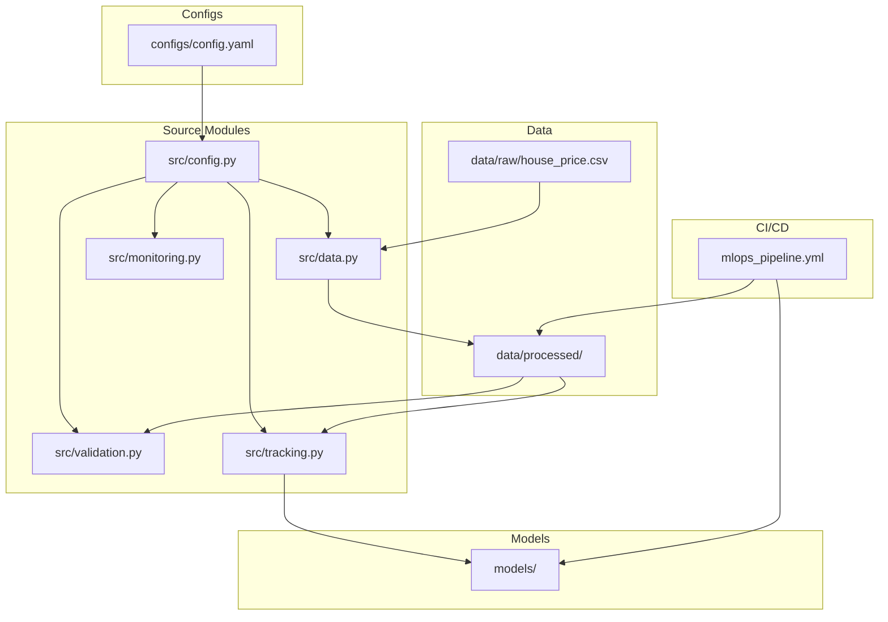
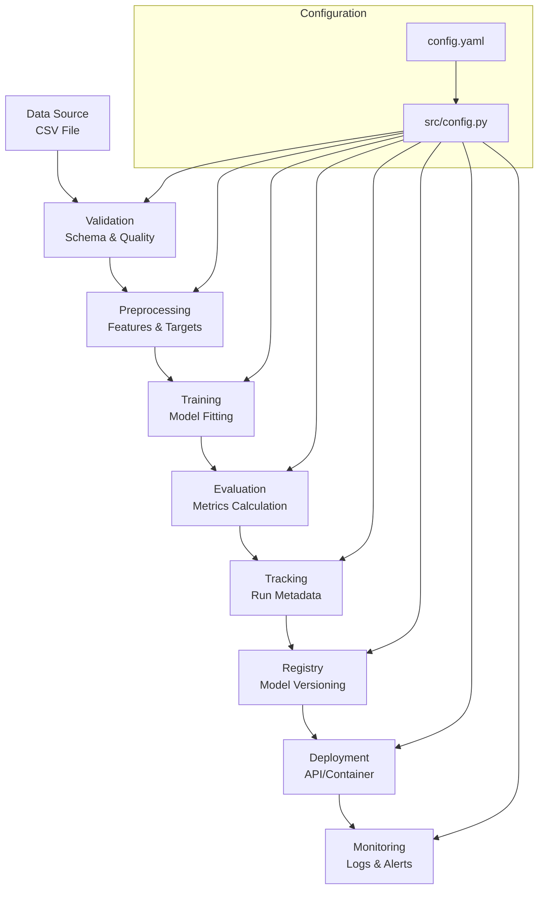
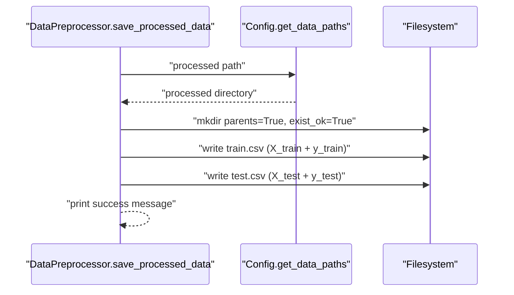
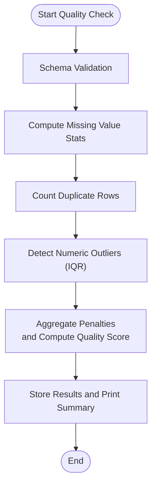
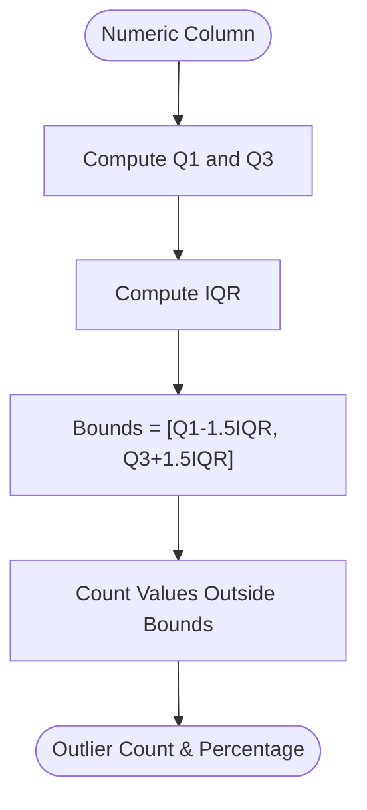
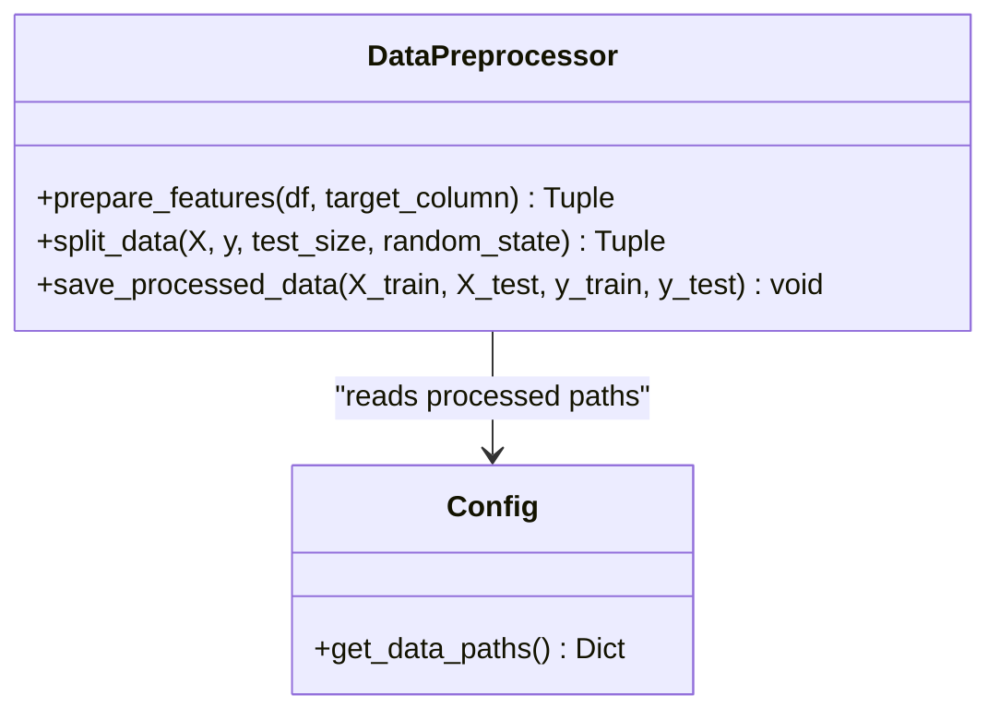
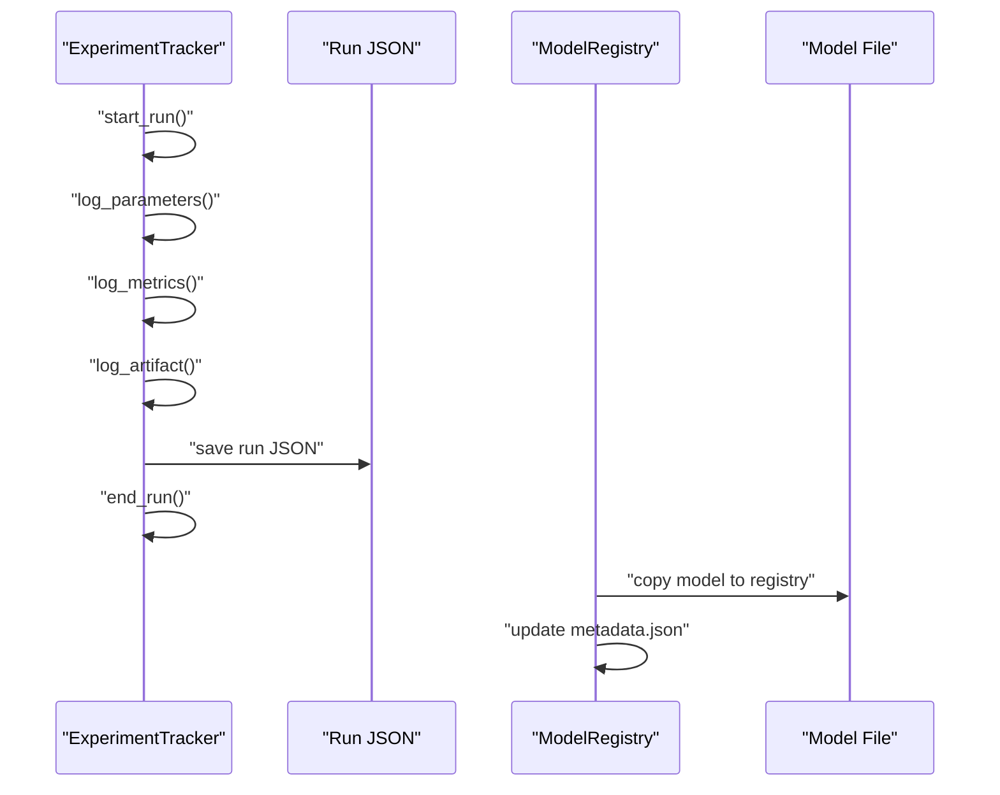
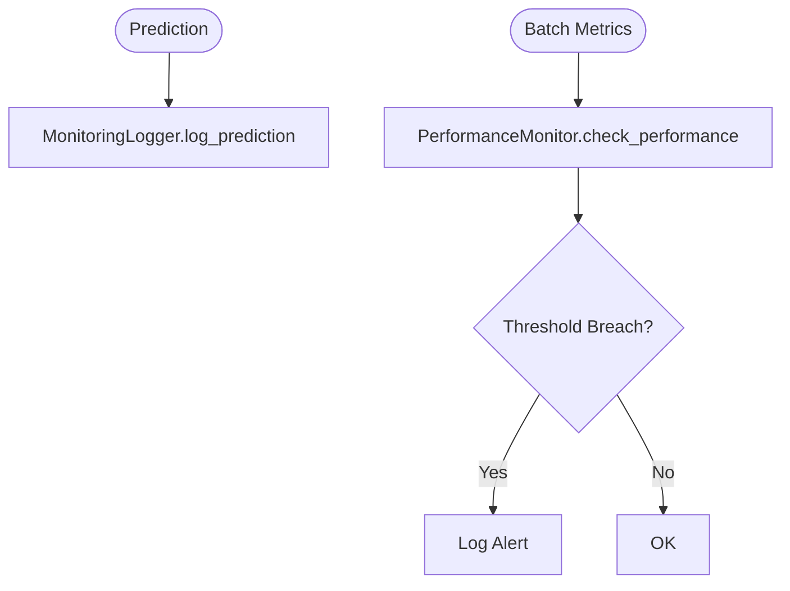
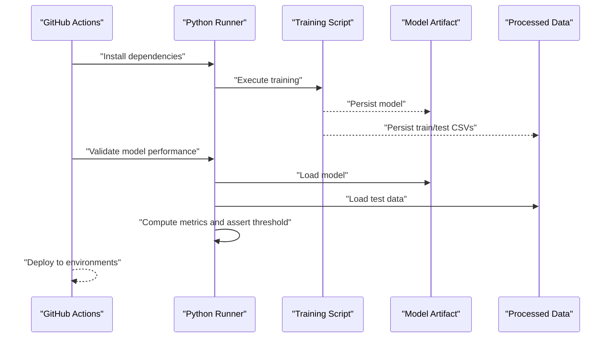
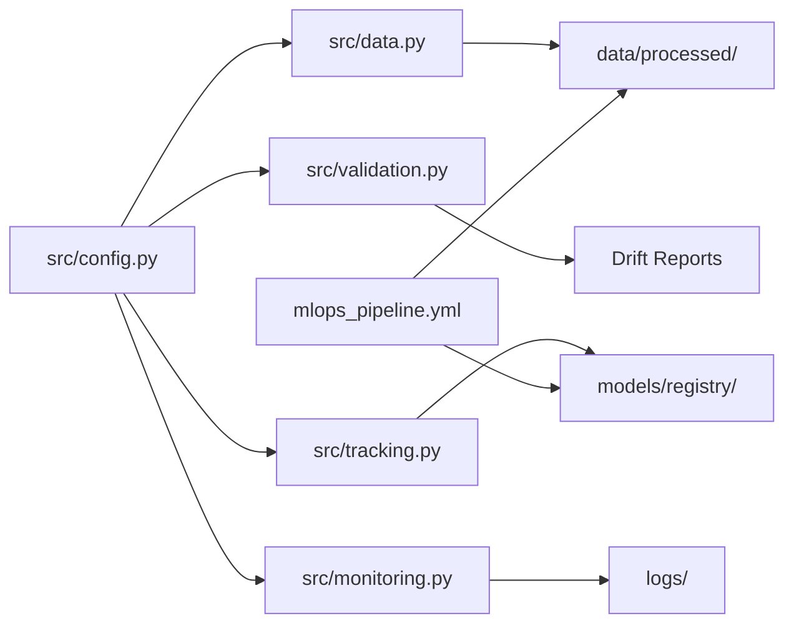

# Data Quality Assurance and Storage

<cite>
**Referenced Files in This Document**
- [data.py](file://src/data.py)
- [validation.py](file://src/validation.py)
- [tracking.py](file://src/tracking.py)
- [monitoring.py](file://src/monitoring.py)
- [config.py](file://src/config.py)
- [config.yaml](file://configs/config.yaml)
- [mlops_pipeline.yml](file://.github/workflows/mlops_pipeline.yml)
- [ARCHITECTURE.md](file://ARCHITECTURE.md)
- [MLOPS_WORKFLOW.md](file://MLOPS_WORKFLOW.md)
- [test_components.py](file://tests/test_components.py)
- [PROJECT_SUMMARY.md](file://PROJECT_SUMMARY.md)
</cite>

## Table of Contents
1. [Introduction](#introduction)
2. [Project Structure](#project-structure)
3. [Core Components](#core-components)
4. [Architecture Overview](#architecture-overview)
5. [Detailed Component Analysis](#detailed-component-analysis)
6. [Dependency Analysis](#dependency-analysis)
7. [Performance Considerations](#performance-considerations)
8. [Troubleshooting Guide](#troubleshooting-guide)
9. [Conclusion](#conclusion)
10. [Appendices](#appendices)

## Introduction
This document explains the data quality assurance and storage mechanisms implemented in the MLOps pipeline. It focuses on:
- save_processed_data functionality for data persistence, file organization, and reproducibility
- Data quality checks for missing values, outliers, and consistency validation
- Processed data storage with train/test separation, metadata preservation, and version control considerations
- Examples of validation workflows, quality metrics, and automated QA processes
- Data lineage tracking, audit trails, and best practices for maintaining data integrity across the machine learning lifecycle

## Project Structure
The project follows a modular layout with dedicated areas for configuration, data, models, pipelines, and source modules. The data quality and storage features are primarily implemented in the src/ modules and orchestrated via configuration and CI/CD.



**Diagram sources**
- [config.yaml:1-60](file://configs/config.yaml#L1-L60)
- [config.py:1-63](file://src/config.py#L1-L63)
- [data.py:1-109](file://src/data.py#L1-L109)
- [validation.py:1-243](file://src/validation.py#L1-L243)
- [tracking.py:1-218](file://src/tracking.py#L1-L218)
- [monitoring.py:1-218](file://src/monitoring.py#L1-L218)
- [mlops_pipeline.yml:1-180](file://.github/workflows/mlops_pipeline.yml#L1-L180)

**Section sources**
- [ARCHITECTURE.md:273-294](file://ARCHITECTURE.md#L273-L294)
- [PROJECT_SUMMARY.md:42-83](file://PROJECT_SUMMARY.md#L42-L83)

## Core Components
- Data loading and preprocessing: DataLoader and DataPreprocessor handle CSV ingestion, basic summaries, feature/target separation, train/test split, and persisted dataset saving.
- Data validation and drift detection: DataValidator performs schema and quality checks; DriftDetector compares distributions against a reference dataset.
- Experiment tracking and model registry: ExperimentTracker logs runs with parameters and metrics; ModelRegistry persists and catalogs model versions.
- Monitoring and logging: MonitoringLogger records predictions and performance; PerformanceMonitor compares metrics to baselines and raises alerts.

**Section sources**
- [data.py:13-109](file://src/data.py#L13-L109)
- [validation.py:14-243](file://src/validation.py#L14-L243)
- [tracking.py:14-218](file://src/tracking.py#L14-L218)
- [monitoring.py:15-218](file://src/monitoring.py#L15-L218)

## Architecture Overview
The system enforces quality and reproducibility through explicit stages: data ingestion, validation, preprocessing, training, evaluation, registry, and monitoring. Configuration centralizes paths and thresholds; CI/CD validates model performance and automates deployment.



**Diagram sources**
- [ARCHITECTURE.md:53-86](file://ARCHITECTURE.md#L53-L86)
- [config.yaml:1-60](file://configs/config.yaml#L1-L60)
- [config.py:1-63](file://src/config.py#L1-L63)

## Detailed Component Analysis

### Data Persistence and Reproducibility: save_processed_data
The save_processed_data method ensures reproducible datasets by persisting both training and test splits with targets included. It organizes outputs under the configured processed directory and prints a confirmation upon completion.

Key behaviors:
- Reads processed paths from configuration
- Concatenates features and target for each split before saving
- Creates the output directory if it does not exist
- Saves two CSV files: train and test



**Diagram sources**
- [data.py:90-109](file://src/data.py#L90-L109)
- [config.py:45-52](file://src/config.py#L45-L52)

**Section sources**
- [data.py:90-109](file://src/data.py#L90-L109)
- [config.py:45-52](file://src/config.py#L45-L52)

### Data Quality Checks: Missing Values, Outliers, Consistency
The DataValidator module provides:
- Schema validation: column presence and dtype compatibility
- Quality report: missing values per column, duplicates, outliers by IQR, and a composite quality score
- Reporting utilities to print a human-readable summary



**Diagram sources**
- [validation.py:28-99](file://src/validation.py#L28-L99)

**Section sources**
- [validation.py:28-99](file://src/validation.py#L28-L99)

### Outlier Detection Methodology
Outlier detection uses the Interquartile Range (IQR) method on numeric columns:
- Compute Q1 and Q3
- Calculate IQR = Q3 - Q1
- Define bounds: lower = Q1 - 1.5*IQR, upper = Q3 + 1.5*IQR
- Count values outside bounds



**Diagram sources**
- [validation.py:74-88](file://src/validation.py#L74-L88)

**Section sources**
- [validation.py:74-88](file://src/validation.py#L74-L88)

### Drift Detection: Reference vs. Current Data
The DriftDetector supports three methods:
- Kolmogorov-Smirnov (KS) test on numeric features
- Population Stability Index (PSI)
- Mean-shift normalized by reference standard deviation

It requires fitting on reference data and then detects drift on current data, returning per-feature scores and a list of affected features.

```mermaid
sequenceDiagram
participant RD as "Reference Data"
participant CD as "Current Data"
participant DD as "DriftDetector"
participant KS as "KS Test"
participant PSI as "PSI Calculator"
RD->>DD : "fit(reference_data)"
CD->>DD : "detect_drift(current_data, method)"
alt method == ks_test
DD->>KS : "compare distributions"
KS-->>DD : "statistic, p-value"
else method == psi
DD->>PSI : "bucket reference, compute PSI"
PSI-->>DD : "drift_score"
else mean_shift
DD : "compute normalized mean difference"
end
DD-->>CD : "drift_report"
```

**Diagram sources**
- [validation.py:132-199](file://src/validation.py#L132-L199)
- [validation.py:201-224](file://src/validation.py#L201-L224)

**Section sources**
- [validation.py:132-199](file://src/validation.py#L132-L199)
- [validation.py:201-224](file://src/validation.py#L201-L224)

### Processed Data Storage System: Train/Test Separation and Metadata
- Train/test split is performed deterministically using configuration-specified test size and random state.
- After splitting, both X and y are separated for train and test sets.
- Processed datasets are saved as CSV files with targets included, enabling reproducible re-training and evaluation.



**Diagram sources**
- [data.py:55-109](file://src/data.py#L55-L109)
- [config.py:45-52](file://src/config.py#L45-L52)

**Section sources**
- [data.py:69-88](file://src/data.py#L69-L88)
- [data.py:90-109](file://src/data.py#L90-L109)
- [config.py:45-52](file://src/config.py#L45-L52)

### Experiment Tracking and Model Registry: Audit Trails and Version Control
- ExperimentTracker captures run metadata (parameters, metrics, artifacts) and persists each run as a JSON file.
- ModelRegistry maintains a registry of model versions, copies model artifacts, and stores metadata for retrieval and comparison.



**Diagram sources**
- [tracking.py:25-82](file://src/tracking.py#L25-L82)
- [tracking.py:150-182](file://src/tracking.py#L150-L182)

**Section sources**
- [tracking.py:25-82](file://src/tracking.py#L25-L82)
- [tracking.py:150-182](file://src/tracking.py#L150-L182)

### Monitoring and Alerts: Prediction Logging and Performance Baseline Checks
- MonitoringLogger logs predictions and performance metrics to structured JSON files and console logs.
- PerformanceMonitor compares current metrics to a baseline and raises alerts when thresholds are crossed.



**Diagram sources**
- [monitoring.py:43-121](file://src/monitoring.py#L43-L121)
- [monitoring.py:162-201](file://src/monitoring.py#L162-L201)

**Section sources**
- [monitoring.py:43-121](file://src/monitoring.py#L43-L121)
- [monitoring.py:162-201](file://src/monitoring.py#L162-L201)

### Automated Quality Assurance Processes in CI/CD
The CI/CD pipeline validates model performance post-training and ensures reproducibility:
- Builds Docker image
- Runs model training validation
- Loads the trained model and test data, computes R², and enforces a minimum threshold
- Deploys to staging and production with notifications



**Diagram sources**
- [mlops_pipeline.yml:10-126](file://.github/workflows/mlops_pipeline.yml#L10-L126)

**Section sources**
- [mlops_pipeline.yml:10-126](file://.github/workflows/mlops_pipeline.yml#L10-L126)

## Dependency Analysis
The modules depend on shared configuration and each other in a layered manner:
- Config centralizes paths and parameters
- Data module depends on Config for paths and uses sklearn for splitting
- Validation module depends on Config and scipy/numpy for drift detection
- Tracking and monitoring modules depend on Config for experiment names and logging
- CI/CD workflow depends on saved artifacts and processed datasets



**Diagram sources**
- [config.py:1-63](file://src/config.py#L1-L63)
- [data.py:1-109](file://src/data.py#L1-L109)
- [validation.py:1-243](file://src/validation.py#L1-L243)
- [tracking.py:1-218](file://src/tracking.py#L1-L218)
- [monitoring.py:1-218](file://src/monitoring.py#L1-L218)
- [mlops_pipeline.yml:1-180](file://.github/workflows/mlops_pipeline.yml#L1-L180)

**Section sources**
- [config.py:1-63](file://src/config.py#L1-L63)
- [data.py:1-109](file://src/data.py#L1-L109)
- [validation.py:1-243](file://src/validation.py#L1-L243)
- [tracking.py:1-218](file://src/tracking.py#L1-L218)
- [monitoring.py:1-218](file://src/monitoring.py#L1-L218)
- [mlops_pipeline.yml:1-180](file://.github/workflows/mlops_pipeline.yml#L1-L180)

## Performance Considerations
- Deterministic splits: fixed random state and test size ensure reproducible train/test partitions.
- Efficient IQR outlier detection: vectorized quantile computations minimize overhead.
- Drift detection: KS test and PSI are suitable for moderate dataset sizes; consider sampling for very large datasets.
- Logging: JSON logs are append-only and periodically saved to avoid memory pressure.

[No sources needed since this section provides general guidance]

## Troubleshooting Guide
Common issues and remedies:
- Data drift detected: review feature distributions, re-train with recent data, and update baselines.
- Quality score low: investigate missing values and outliers; apply imputation or filtering.
- Model performance degradation: compare current metrics to baseline, trigger retraining if thresholds exceeded.
- CI/CD model validation fails: confirm processed test data exists and meets schema expectations.

**Section sources**
- [MLOPS_WORKFLOW.md:361-381](file://MLOPS_WORKFLOW.md#L361-L381)
- [monitoring.py:162-201](file://src/monitoring.py#L162-L201)
- [validation.py:28-99](file://src/validation.py#L28-L99)

## Conclusion
The system integrates robust data quality checks, deterministic preprocessing, and comprehensive experiment tracking to ensure reproducibility and reliability. Processed datasets are persisted alongside model artifacts, while drift detection and monitoring provide continuous oversight. CI/CD automates validation and deployment, closing the loop from data to production.

[No sources needed since this section summarizes without analyzing specific files]

## Appendices

### Configuration Keys Relevant to Data Quality and Storage
- data.raw_path: Source CSV location
- data.processed_path: Output directory for processed datasets
- data.test_size and data.random_state: Split parameters for reproducibility
- monitoring.drift_threshold and monitoring.performance_threshold: Alert thresholds

**Section sources**
- [config.yaml:9-16](file://configs/config.yaml#L9-L16)
- [config.yaml:42-46](file://configs/config.yaml#L42-L46)

### Example Workflows and References
- Data validation workflow: [MLOPS_WORKFLOW.md:19-28](file://MLOPS_WORKFLOW.md#L19-L28)
- Drift detection workflow: [MLOPS_WORKFLOW.md:187-195](file://MLOPS_WORKFLOW.md#L187-L195)
- Performance monitoring workflow: [MLOPS_WORKFLOW.md:178-207](file://MLOPS_WORKFLOW.md#L178-L207)
- CI/CD model validation: [mlops_pipeline.yml:90-125](file://.github/workflows/mlops_pipeline.yml#L90-L125)

### Unit Tests Demonstrating Data Quality and Storage Behavior
- Data quality checks: [test_components.py:159-184](file://tests/test_components.py#L159-L184)
- Drift detection: [test_components.py:189-204](file://tests/test_components.py#L189-L204)
- Processed data persistence: [data.py:90-109](file://src/data.py#L90-L109)