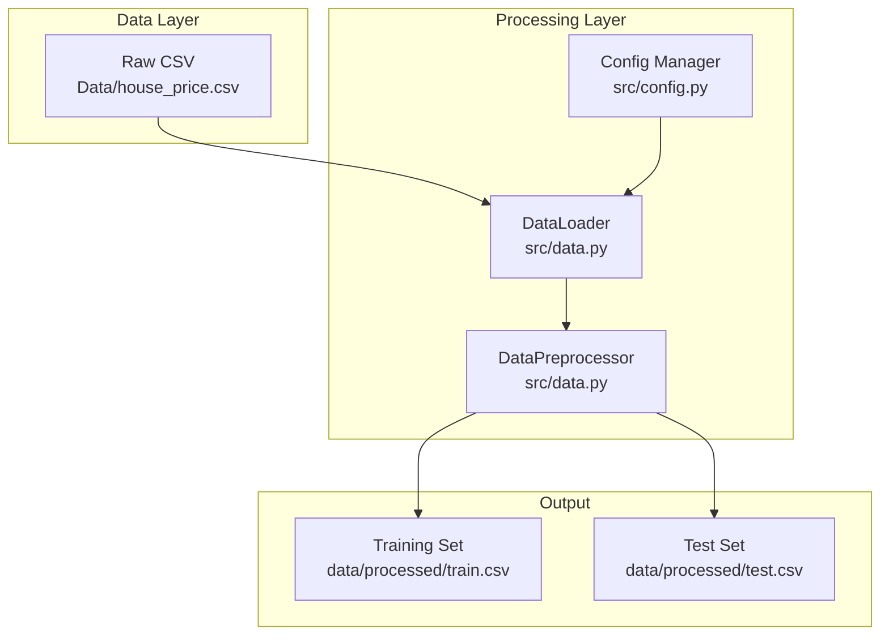
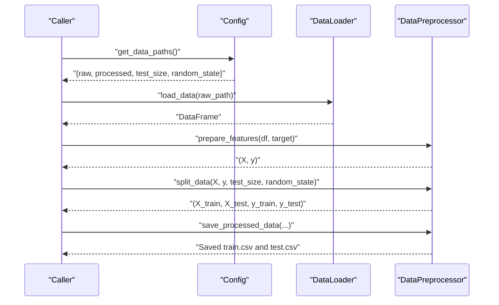
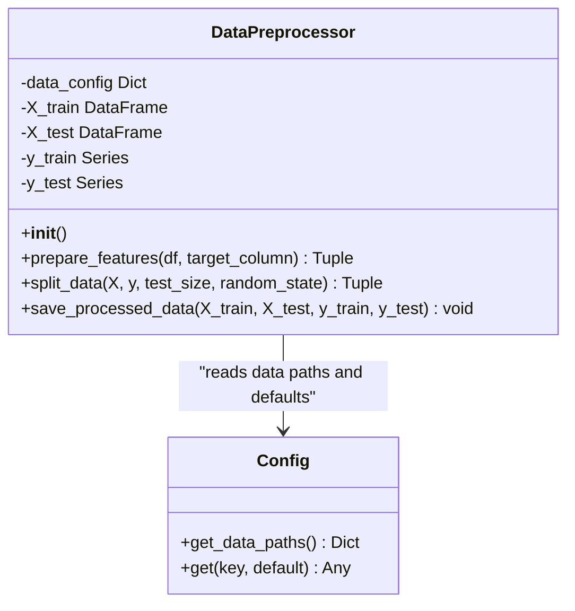
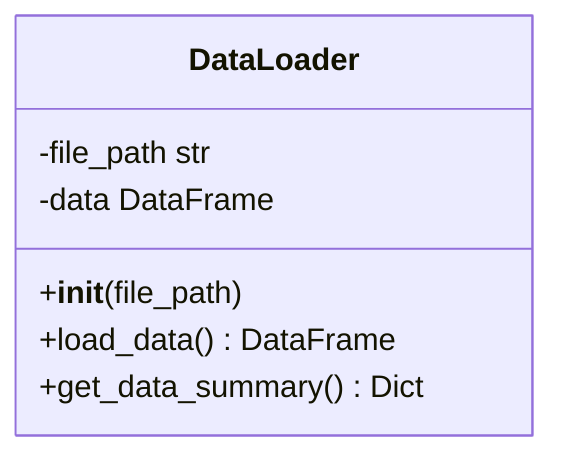
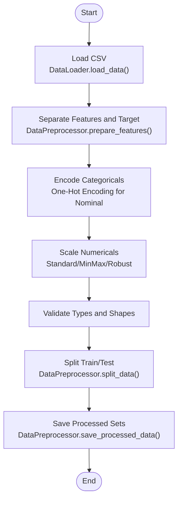
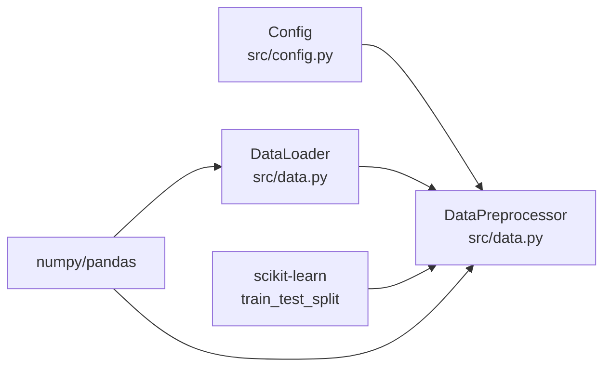

# Feature Engineering and Preprocessing

<cite>
**Referenced Files in This Document**
- [data.py](file://House_Price_Prediction-main/housing1/src/data.py)
- [config.py](file://House_Price_Prediction-main/housing1/src/config.py)
- [house_price.csv](file://House_Price_Prediction-main/housing1/Data/house_price.csv)
- [README.md](file://House_Price_Prediction-main/housing1/README.md)
- [ARCHITECTURE.md](file://House_Price_Prediction-main/housing1/ARCHITECTURE.md)
- [MLOPS_WORKFLOW.md](file://House_Price_Prediction-main/housing1/MLOPS_WORKFLOW.md)
</cite>

## Table of Contents
1. [Introduction](#introduction)
2. [Project Structure](#project-structure)
3. [Core Components](#core-components)
4. [Architecture Overview](#architecture-overview)
5. [Detailed Component Analysis](#detailed-component-analysis)
6. [Dependency Analysis](#dependency-analysis)
7. [Performance Considerations](#performance-considerations)
8. [Troubleshooting Guide](#troubleshooting-guide)
9. [Conclusion](#conclusion)
10. [Appendices](#appendices)

## Introduction
This document explains the feature engineering and preprocessing capabilities implemented in the project. It focuses on the DataPreprocessor class and its role in separating features and targets, splitting datasets, and saving processed data. It also provides practical guidance for preparing house price prediction features such as area, bedrooms, bathrooms, stories, parking spaces, age, and location encoding, including best practices for categorical variables, numerical scaling, and data type conversions. Guidance is included for extending preprocessing to new features and custom transformations.

## Project Structure
The preprocessing and data handling logic resides primarily in the src/data.py module, with configuration managed via src/config.py. Sample data is provided in Data/house_price.csv. The README, ARCHITECTURE, and MLOPS_WORKFLOW documents describe the overall pipeline and workflow.

**Diagram sources**
- [data.py:13-109](file://House_Price_Prediction-main/housing1/src/data.py#L13-L109)
- [config.py:10-63](file://House_Price_Prediction-main/housing1/src/config.py#L10-L63)
- [house_price.csv:1-12](file://House_Price_Prediction-main/housing1/Data/house_price.csv#L1-L12)

**Section sources**
- [data.py:13-109](file://House_Price_Prediction-main/housing1/src/data.py#L13-L109)
- [config.py:10-63](file://House_Price_Prediction-main/housing1/src/config.py#L10-L63)
- [house_price.csv:1-12](file://House_Price_Prediction-main/housing1/Data/house_price.csv#L1-L12)
- [README.md](file://House_Price_Prediction-main/housing1/README.md)
- [ARCHITECTURE.md](file://House_Price_Prediction-main/housing1/ARCHITECTURE.md)
- [MLOPS_WORKFLOW.md](file://House_Price_Prediction-main/housing1/MLOPS_WORKFLOW.md)

## Core Components
- DataLoader: Loads CSV data, validates presence, and provides summary statistics.
- DataPreprocessor: Separates features and target, splits data into train/test sets, and saves processed datasets.

Key responsibilities:
- Feature-target separation using column dropping and selection.
- Train-test split with configurable test size and random state.
- Saving processed datasets to the configured processed path.

**Section sources**
- [data.py:13-109](file://House_Price_Prediction-main/housing1/src/data.py#L13-L109)
- [config.py:45-52](file://House_Price_Prediction-main/housing1/src/config.py#L45-L52)

## Architecture Overview
The preprocessing pipeline integrates configuration-driven paths and parameters with data loading and splitting logic.

**Diagram sources**
- [data.py:13-109](file://House_Price_Prediction-main/housing1/src/data.py#L13-L109)
- [config.py:45-52](file://House_Price_Prediction-main/housing1/src/config.py#L45-L52)

## Detailed Component Analysis

### DataPreprocessor
The DataPreprocessor class encapsulates preprocessing logic:
- prepare_features: Drops the target column to form features and extracts the target series.
- split_data: Uses scikit-learn’s train_test_split with configurable parameters from configuration.
- save_processed_data: Saves combined training and test sets to CSV for reproducibility.

**Diagram sources**
- [data.py:45-109](file://House_Price_Prediction-main/housing1/src/data.py#L45-L109)
- [config.py:45-52](file://House_Price_Prediction-main/housing1/src/config.py#L45-L52)

**Section sources**
- [data.py:45-109](file://House_Price_Prediction-main/housing1/src/data.py#L45-L109)
- [config.py:45-52](file://House_Price_Prediction-main/housing1/src/config.py#L45-L52)

### DataLoader
The DataLoader class handles data ingestion and validation:
- load_data: Reads CSV into a DataFrame and prints shape.
- get_data_summary: Returns shape, columns, missing counts, and dtypes.

**Diagram sources**
- [data.py:13-43](file://House_Price_Prediction-main/housing1/src/data.py#L13-L43)

**Section sources**
- [data.py:13-43](file://House_Price_Prediction-main/housing1/src/data.py#L13-L43)

### Data Preparation Workflow for House Price Features
The dataset includes the following features:
- Numerical: Area, Bedrooms, Bathrooms, Stories, Parking, Age
- Categorical: Location
- Target: Price

Recommended preparation steps:
- Feature-target separation: Use prepare_features to drop the target column and extract the target series.
- Categorical encoding:
  - Nominal variables (e.g., Location): Use one-hot encoding to avoid imposing ordinal relationships.
  - Ordinal variables (if present): Use ordinal encoding or label encoding when order matters.
- Numerical scaling:
  - Normalize or standardize numerical features to mitigate scale differences.
  - Consider robust scaling if outliers are present.
- Data type conversions:
  - Ensure numerical columns are numeric types.
  - Convert categorical columns to appropriate types (object or category) for downstream encoders.
- Missing values:
  - Impute missing values or remove rows/columns depending on data characteristics.
- Validation:
  - Confirm shapes and dtypes after transformations.
  - Save processed datasets for reproducibility.

**Diagram sources**
- [data.py:45-109](file://House_Price_Prediction-main/housing1/src/data.py#L45-L109)
- [house_price.csv:1-12](file://House_Price_Prediction-main/housing1/Data/house_price.csv#L1-L12)

**Section sources**
- [data.py:45-109](file://House_Price_Prediction-main/housing1/src/data.py#L45-L109)
- [house_price.csv:1-12](file://House_Price_Prediction-main/housing1/Data/house_price.csv#L1-L12)

### Extending Preprocessing for Additional Features and Custom Transformations
To extend preprocessing:
- Add new categorical columns to the dataset and apply appropriate encoding strategies.
- Incorporate new numerical features and select suitable scaling methods.
- Introduce custom transformers using scikit-learn compatible APIs and integrate them into the preprocessing pipeline.
- Persist preprocessing configurations and fitted transformers for reproducibility and deployment.

Best practices:
- Keep preprocessing deterministic by setting seeds and saving preprocessing artifacts.
- Use separate preprocessing steps for training and inference to avoid data leakage.
- Log and track preprocessing parameters and transformations for auditability.

**Section sources**
- [data.py:45-109](file://House_Price_Prediction-main/housing1/src/data.py#L45-L109)
- [config.py:45-52](file://House_Price_Prediction-main/housing1/src/config.py#L45-L52)

## Dependency Analysis
The preprocessing module depends on configuration for paths and hyperparameters, and on scikit-learn for splitting.

**Diagram sources**
- [data.py:1-109](file://House_Price_Prediction-main/housing1/src/data.py#L1-L109)
- [config.py:1-63](file://House_Price_Prediction-main/housing1/src/config.py#L1-L63)

**Section sources**
- [data.py:1-109](file://House_Price_Prediction-main/housing1/src/data.py#L1-L109)
- [config.py:1-63](file://House_Price_Prediction-main/housing1/src/config.py#L1-L63)

## Performance Considerations
- Prefer vectorized operations with pandas and numpy for efficient transformations.
- Use appropriate scaling methods based on data distribution and model requirements.
- Minimize repeated transformations by persisting preprocessing artifacts and applying identical transformations during inference.
- Monitor memory usage when handling large datasets and consider chunked processing if needed.

## Troubleshooting Guide
Common issues and resolutions:
- Missing target column: prepare_features raises an error if the target is not found; verify column names match the dataset.
- Data file not found: DataLoader.load_data raises a specific error if the raw path is invalid; check configuration and file existence.
- Incorrect data types: Ensure numerical and categorical columns are typed appropriately before encoding and scaling.
- Reproducibility: Use saved processed datasets and fixed random seeds to reproduce results consistently.

**Section sources**
- [data.py:27-30](file://House_Price_Prediction-main/housing1/src/data.py#L27-L30)
- [data.py:61-62](file://House_Price_Prediction-main/housing1/src/data.py#L61-L62)
- [data.py:98-108](file://House_Price_Prediction-main/housing1/src/data.py#L98-L108)

## Conclusion
The DataPreprocessor provides a focused, configurable foundation for feature-target separation, train-test splitting, and saving processed datasets. By combining it with sound preprocessing practices—such as proper categorical encoding, numerical scaling, and dtype conversions—you can build robust pipelines for house price prediction. Extend the pipeline with custom transformers and maintain reproducibility through configuration and artifact persistence.

## Appendices
- Dataset columns and sample rows are defined in the dataset file.
- Refer to project documentation for broader MLOps pipeline context and workflow.

**Section sources**
- [house_price.csv:1-12](file://House_Price_Prediction-main/housing1/Data/house_price.csv#L1-L12)
- [README.md](file://House_Price_Prediction-main/housing1/README.md)
- [ARCHITECTURE.md](file://House_Price_Prediction-main/housing1/ARCHITECTURE.md)
- [MLOPS_WORKFLOW.md](file://House_Price_Prediction-main/housing1/MLOPS_WORKFLOW.md)