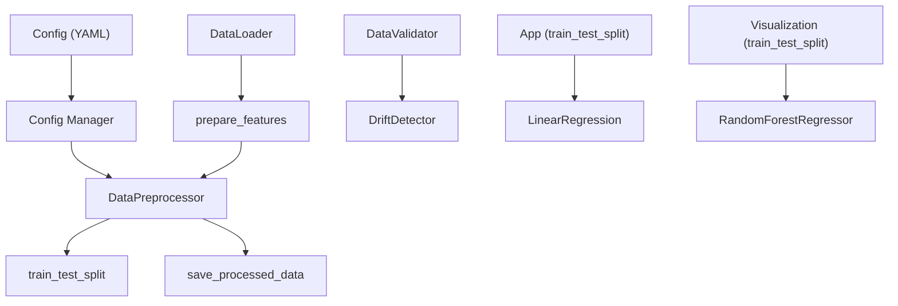
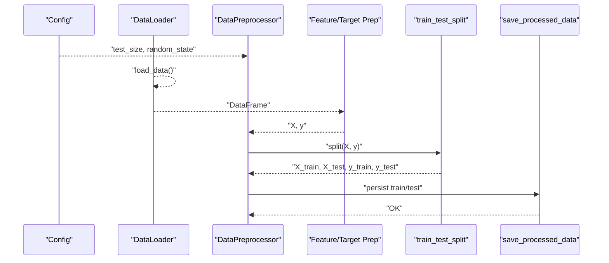
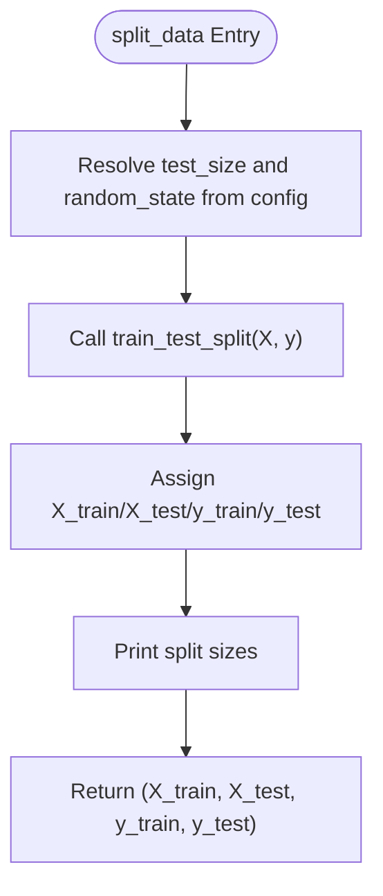
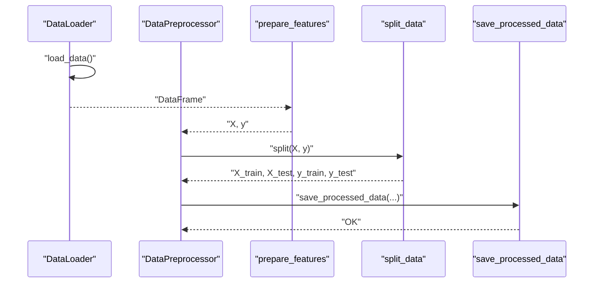
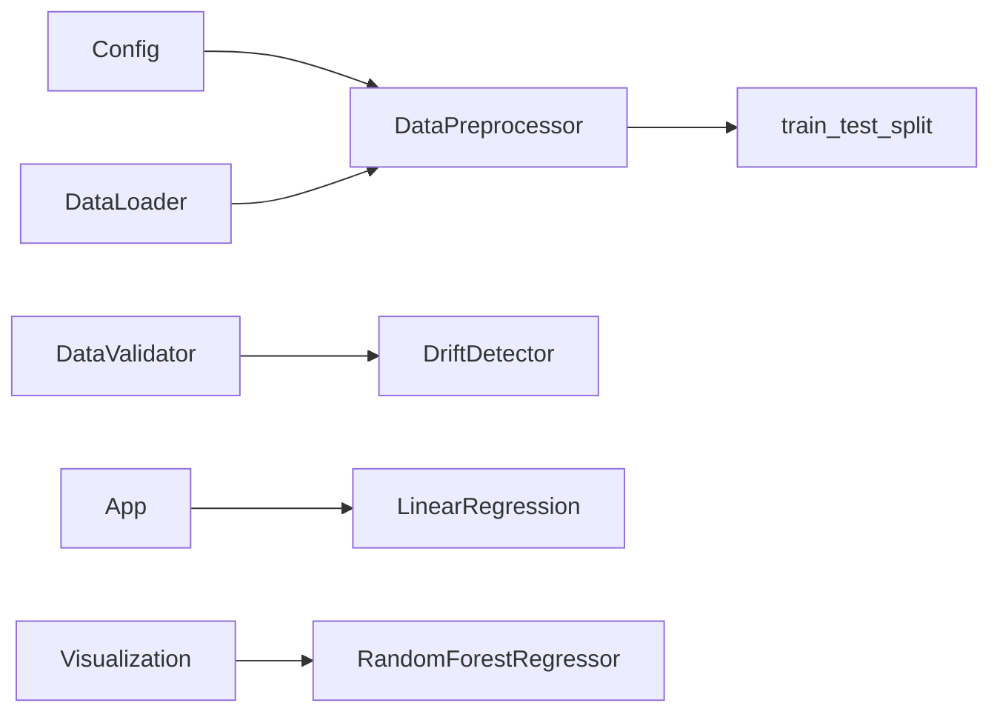

# Train-Test Splitting and Data Preparation

<cite>
**Referenced Files in This Document**
- [data.py](file://src/data.py)
- [config.py](file://src/config.py)
- [config.yaml](file://configs/config.yaml)
- [validation.py](file://src/validation.py)
- [model.py](file://src/model.py)
- [app.py](file://app.py)
- [visualization.py](file://visualization.py)
- [test_components.py](file://tests/test_components.py)
- [ARCHITECTURE.md](file://ARCHITECTURE.md)
- [MLOPS_WORKFLOW.md](file://MLOPS_WORKFLOW.md)
</cite>

## Table of Contents
1. [Introduction](#introduction)
2. [Project Structure](#project-structure)
3. [Core Components](#core-components)
4. [Architecture Overview](#architecture-overview)
5. [Detailed Component Analysis](#detailed-component-analysis)
6. [Dependency Analysis](#dependency-analysis)
7. [Performance Considerations](#performance-considerations)
8. [Troubleshooting Guide](#troubleshooting-guide)
9. [Conclusion](#conclusion)
10. [Appendices](#appendices)

## Introduction
This document explains the train-test splitting and data preparation workflow used in the project. It focuses on the split_data method implementation, including configurable test sizes and random state management for reproducible partitions. It also covers dataset organization, feature matrix construction, target vector extraction, and data serialization for model training. Guidance is provided for maintaining data integrity, handling imbalanced datasets, preparing data for various ML algorithms, optimizing split ratios, and ensuring representative sampling.

## Project Structure
The data preparation pipeline centers around a small set of modules:
- Data loading and preprocessing: src/data.py
- Configuration management: src/config.py and configs/config.yaml
- Data validation and drift detection: src/validation.py
- Model training and evaluation: src/model.py
- Application-level splitting and visualization: app.py and visualization.py
- Tests validating the splitting behavior: tests/test_components.py
- Architectural overview and workflow: ARCHITECTURE.md and MLOPS_WORKFLOW.md

**Diagram sources**
- [config.yaml:1-60](file://configs/config.yaml#L1-L60)
- [config.py:45-52](file://src/config.py#L45-L52)
- [data.py:69-88](file://src/data.py#L69-L88)
- [data.py:90-108](file://src/data.py#L90-L108)
- [validation.py:14-199](file://src/validation.py#L14-L199)
- [app.py:27-34](file://app.py#L27-L34)
- [visualization.py:158-169](file://visualization.py#L158-L169)

**Section sources**
- [ARCHITECTURE.md:53-113](file://ARCHITECTURE.md#L53-L113)
- [MLOPS_WORKFLOW.md:232-259](file://MLOPS_WORKFLOW.md#L232-L259)

## Core Components
- DataLoader: Loads CSV data and provides summary statistics.
- DataPreprocessor: Separates features and targets, splits into train/test, and serializes processed datasets.
- Config: Centralizes configuration including test_size and random_state defaults.
- DataValidator and DriftDetector: Validate schema and data quality, and detect distribution drift.
- ModelTrainer and ModelEvaluator: Train models and compute evaluation metrics using the prepared splits.

Key implementation references:
- Feature separation: [prepare_features:55-67](file://src/data.py#L55-L67)
- Train-test split: [split_data:69-88](file://src/data.py#L69-L88)
- Reproducible saving: [save_processed_data:90-108](file://src/data.py#L90-L108)
- Configuration defaults: [get_data_paths:45-52](file://src/config.py#L45-L52)
- YAML configuration: [config.yaml:9-16](file://configs/config.yaml#L9-L16)

**Section sources**
- [data.py:13-108](file://src/data.py#L13-L108)
- [config.py:10-63](file://src/config.py#L10-L63)
- [config.yaml:9-16](file://configs/config.yaml#L9-L16)

## Architecture Overview
The data preparation pipeline follows a clean, layered approach:
- Configuration drives defaults for test_size and random_state.
- DataLoader loads raw CSV data.
- DataPreprocessor constructs features and targets, performs the split, and persists train/test sets.
- DataValidator and DriftDetector support data quality and stability checks.
- ModelTrainer consumes the prepared splits for training and evaluation.

**Diagram sources**
- [config.py:45-52](file://src/config.py#L45-L52)
- [data.py:20-31](file://src/data.py#L20-L31)
- [data.py:55-67](file://src/data.py#L55-L67)
- [data.py:69-88](file://src/data.py#L69-L88)
- [data.py:90-108](file://src/data.py#L90-L108)

## Detailed Component Analysis

### DataPreprocessor: split_data and save_processed_data
The DataPreprocessor orchestrates splitting and persistence:
- Defaults for test_size and random_state are drawn from configuration.
- The split is performed via scikit-learn’s train_test_split.
- After splitting, train and test sets are persisted as CSV files for reproducibility.

**Diagram sources**
- [data.py:69-88](file://src/data.py#L69-L88)
- [config.py:45-52](file://src/config.py#L45-L52)

Implementation highlights:
- Configurable test_size and random_state: [split_data:73-78](file://src/data.py#L73-L78)
- Scikit-learn split invocation: [split_data:80-82](file://src/data.py#L80-L82)
- Persistence of train/test sets: [save_processed_data:90-108](file://src/data.py#L90-L108)

Best practices embedded in the implementation:
- Reproducibility via explicit random_state.
- Consistent split ratio via configuration-driven defaults.
- Post-split persistence for auditability and re-runs.

**Section sources**
- [data.py:69-108](file://src/data.py#L69-L108)
- [config.py:45-52](file://src/config.py#L45-L52)

### Data Preparation Workflow: Features, Targets, and Serialization
The workflow proceeds as follows:
- Load raw CSV via DataLoader.
- Separate features (X) and target (y) using prepare_features.
- Split into train/test using split_data.
- Persist datasets for later model training.

**Diagram sources**
- [data.py:20-31](file://src/data.py#L20-L31)
- [data.py:55-67](file://src/data.py#L55-L67)
- [data.py:69-88](file://src/data.py#L69-L88)
- [data.py:90-108](file://src/data.py#L90-L108)

**Section sources**
- [data.py:20-108](file://src/data.py#L20-L108)

### Configuration-Driven Defaults
Configuration values drive default behavior:
- test_size default: [config.yaml](file://configs/config.yaml#L13)
- random_state default: [config.yaml](file://configs/config.yaml#L14)
- Centralized retrieval: [get_data_paths:45-52](file://src/config.py#L45-L52)

Implications:
- Changing config.yaml alters the default split ratio and reproducibility seed across the pipeline.
- Consistency across environments is ensured by centralizing configuration.

**Section sources**
- [config.yaml:9-16](file://configs/config.yaml#L9-L16)
- [config.py:45-52](file://src/config.py#L45-L52)

### Cross-Validation Preparation
While the current implementation uses a single train/test split, cross-validation can be prepared by replacing the single split with scikit-learn’s cross-validation iterators (e.g., KFold, StratifiedKFold) and adapting the training loop to iterate over folds. This would:
- Maintain the same feature/target separation via prepare_features.
- Replace the single split with CV splits.
- Aggregate metrics across folds for robust evaluation.

[No sources needed since this section provides general guidance]

### Data Integrity and Representative Sampling
Guidelines derived from the codebase and best practices:
- Validate schema and data quality prior to splitting using DataValidator.
- Detect distribution drift post-split using DriftDetector to ensure representative sampling over time.
- For imbalanced datasets, consider stratification in train_test_split and stratified CV to preserve label distributions.

Relevant components:
- Schema and quality validation: [DataValidator:14-99](file://src/validation.py#L14-L99)
- Drift detection: [DriftDetector:124-199](file://src/validation.py#L124-L199)

**Section sources**
- [validation.py:14-199](file://src/validation.py#L14-L199)

### Examples of Different Splitting Strategies
- Fixed deterministic split: [split_data:69-88](file://src/data.py#L69-L88) with config-driven test_size and random_state.
- Application-level split: [app.py:27-34](file://app.py#L27-L34) demonstrates a fixed 0.2 test_size and random_state=42.
- Visualization split: [visualization.py:158-169](file://visualization.py#L158-L169) shows a similar pattern for demo purposes.

Recommendations:
- For reproducibility, always pass explicit random_state.
- For time series or grouped data, replace random split with temporal or group-aware splits.
- For imbalanced classes, consider stratify=y in train_test_split.

**Section sources**
- [data.py:69-88](file://src/data.py#L69-L88)
- [app.py:27-34](file://app.py#L27-L34)
- [visualization.py:158-169](file://visualization.py#L158-L169)

### Optimizing Split Ratios
- Start with the configured default (e.g., 0.2) and adjust based on dataset size and computational budget.
- Larger test sets provide more reliable estimates but reduce training data; smaller test sets increase variance in estimates.
- Use cross-validation to mitigate sensitivity to a single split.

[No sources needed since this section provides general guidance]

### Preparing Data for Various ML Algorithms
- Linear models: No scaling required, but consider feature engineering and encoding.
- Tree-based models: train_test_split supports stratification; consider categorical encoding.
- Neural networks: often benefit from feature scaling; apply StandardScaler or MinMaxScaler after splitting.

[No sources needed since this section provides general guidance]

## Dependency Analysis
The primary dependencies among data-related components are:
- DataPreprocessor depends on Config for defaults.
- DataLoader supplies the DataFrame consumed by DataPreprocessor.
- DataValidator and DriftDetector operate independently but complement DataPreprocessor by ensuring data quality and stability.

**Diagram sources**
- [config.py:45-52](file://src/config.py#L45-L52)
- [data.py:13-108](file://src/data.py#L13-L108)
- [validation.py:14-199](file://src/validation.py#L14-L199)
- [app.py:27-34](file://app.py#L27-L34)
- [visualization.py:158-169](file://visualization.py#L158-L169)

**Section sources**
- [data.py:13-108](file://src/data.py#L13-L108)
- [validation.py:14-199](file://src/validation.py#L14-L199)

## Performance Considerations
- Persisting train/test sets enables fast re-runs without recomputation.
- Using appropriate random_state ensures consistent results across runs.
- For large datasets, consider memory-efficient serialization and chunked processing.

[No sources needed since this section provides general guidance]

## Troubleshooting Guide
Common issues and resolutions:
- Target column not found: prepare_features raises a clear error if the target is missing. Verify column names and casing.
  - Reference: [prepare_features:61-62](file://src/data.py#L61-L62)
- Data file not found: DataLoader raises a specific error when the CSV path is invalid.
  - Reference: [DataLoader.load_data:27-30](file://src/data.py#L27-L30)
- Incorrect split sizes: Ensure test_size and random_state are correctly resolved from configuration.
  - Reference: [split_data:77-78](file://src/data.py#L77-L78)
- Drift detection: Use DriftDetector to confirm that current data distributions match the reference.
  - Reference: [DriftDetector:124-199](file://src/validation.py#L124-L199)
- Reproducibility: Always pass random_state explicitly; avoid relying solely on defaults.
  - Reference: [split_data:74-78](file://src/data.py#L74-L78)

**Section sources**
- [data.py:27-30](file://src/data.py#L27-L30)
- [data.py:61-62](file://src/data.py#L61-L62)
- [data.py:74-78](file://src/data.py#L74-L78)
- [validation.py:124-199](file://src/validation.py#L124-L199)

## Conclusion
The project implements a clean, configurable, and reproducible train-test splitting workflow. Configuration-driven defaults ensure consistency, while explicit random_state management guarantees reproducibility. The DataPreprocessor encapsulates feature/target separation, splitting, and persistence, enabling straightforward integration with model training and evaluation. Complementary validation and drift detection components help maintain data integrity and representative sampling over time.

## Appendices

### Appendix A: Configuration Options for Splitting
- test_size: Controls the proportion of the dataset to include in the test split.
- random_state: Controls the shuffling for reproducible output.

References:
- [config.yaml:13-14](file://configs/config.yaml#L13-L14)
- [config.py:45-52](file://src/config.py#L45-L52)

### Appendix B: Example Usage References
- Single deterministic split: [split_data:69-88](file://src/data.py#L69-L88)
- Application-level split: [app.py:27-34](file://app.py#L27-L34)
- Visualization split: [visualization.py:158-169](file://visualization.py#L158-L169)
- Unit tests validating split behavior: [test_components.py:81-95](file://tests/test_components.py#L81-L95)