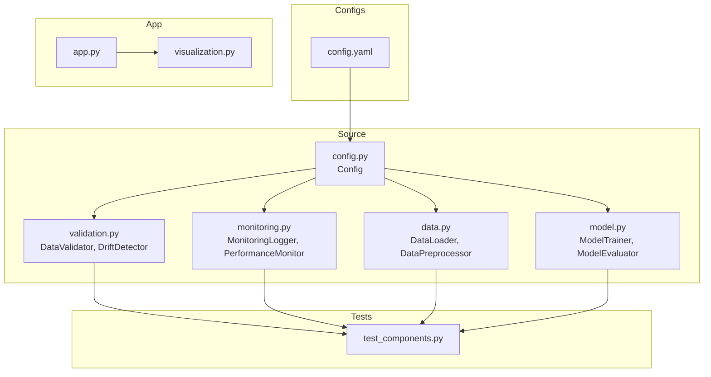
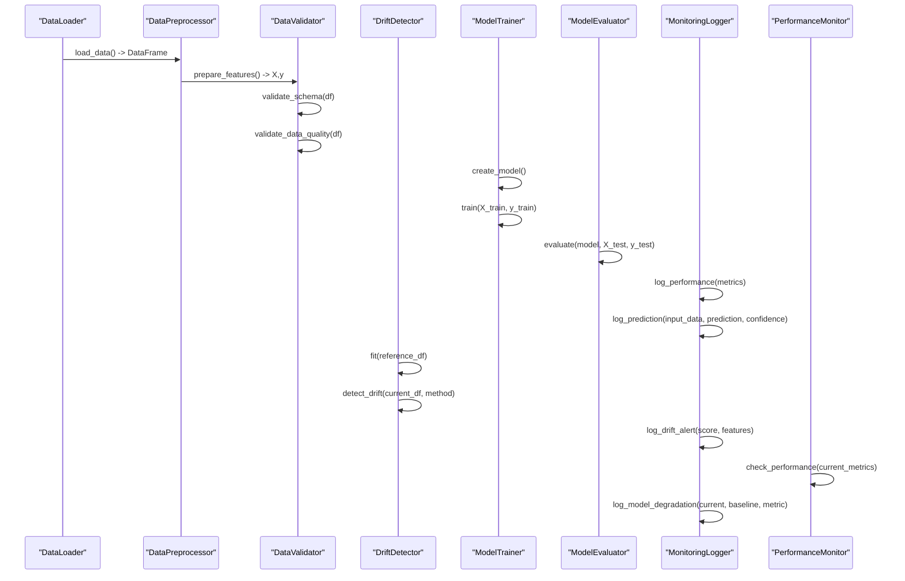
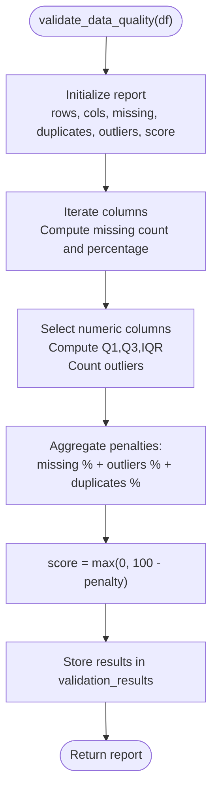
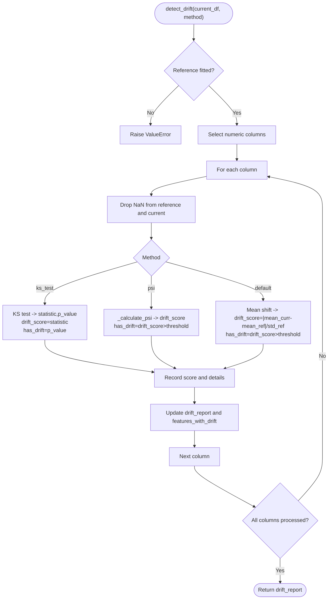
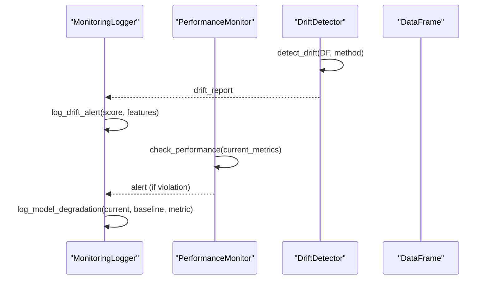
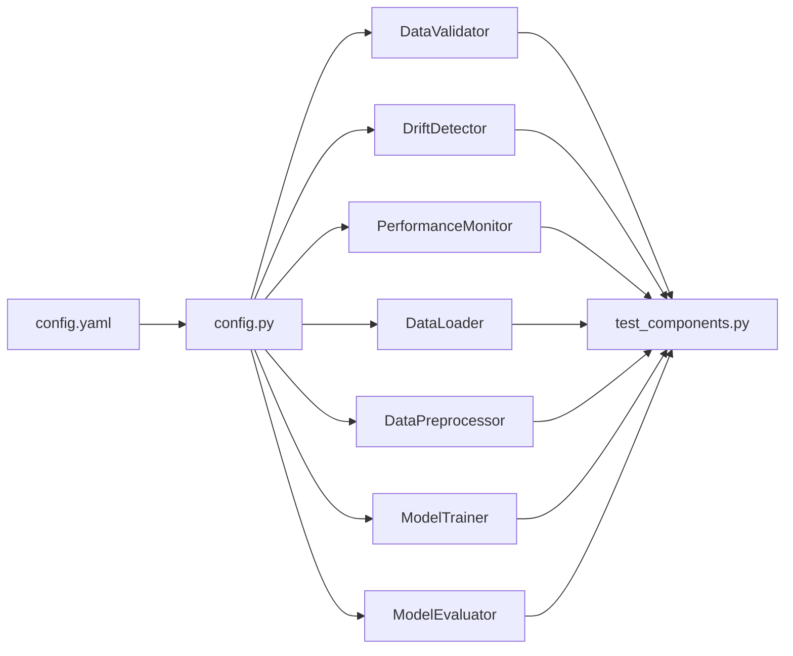

# Data Validation & Drift Detection

<cite>
**Referenced Files in This Document**
- [validation.py](file://House_Price_Prediction-main/housing1/src/validation.py)
- [monitoring.py](file://House_Price_Prediction-main/housing1/src/monitoring.py)
- [config.py](file://House_Price_Prediction-main/housing1/src/config.py)
- [config.yaml](file://House_Price_Prediction-main/housing1/configs/config.yaml)
- [data.py](file://House_Price_Prediction-main/housing1/src/data.py)
- [model.py](file://House_Price_Prediction-main/housing1/src/model.py)
- [test_components.py](file://House_Price_Prediction-main/housing1/tests/test_components.py)
- [visualization.py](file://House_Price_Prediction-main/housing1/visualization.py)
- [app.py](file://House_Price_Prediction-main/housing1/app.py)
</cite>

## Table of Contents
1. [Introduction](#introduction)
2. [Project Structure](#project-structure)
3. [Core Components](#core-components)
4. [Architecture Overview](#architecture-overview)
5. [Detailed Component Analysis](#detailed-component-analysis)
6. [Dependency Analysis](#dependency-analysis)
7. [Performance Considerations](#performance-considerations)
8. [Troubleshooting Guide](#troubleshooting-guide)
9. [Conclusion](#conclusion)
10. [Appendices](#appendices)

## Introduction
This document provides comprehensive guidance on data validation and drift detection for production-grade machine learning systems. It focuses on two core capabilities:
- DataValidator: Statistical validation, missing value detection, outlier identification, and data integrity checks.
- DriftDetector: Statistical tests for concept drift, threshold-based drift detection, and alert generation.

It also covers monitoring thresholds, false positive handling, drift mitigation strategies, and how to customize validation rules and extend drift detection for specialized use cases.

## Project Structure
The validation and drift detection functionality resides primarily in the src module, with configuration managed centrally and tests validating core behaviors.

**Diagram sources**
- [validation.py:1-243](file://House_Price_Prediction-main/housing1/src/validation.py#L1-L243)
- [monitoring.py:1-218](file://House_Price_Prediction-main/housing1/src/monitoring.py#L1-L218)
- [config.py:1-63](file://House_Price_Prediction-main/housing1/src/config.py#L1-L63)
- [config.yaml:1-60](file://House_Price_Prediction-main/housing1/configs/config.yaml#L1-L60)
- [data.py:1-109](file://House_Price_Prediction-main/housing1/src/data.py#L1-L109)
- [model.py:1-155](file://House_Price_Prediction-main/housing1/src/model.py#L1-L155)
- [test_components.py:1-209](file://House_Price_Prediction-main/housing1/tests/test_components.py#L1-L209)
- [app.py:1-109](file://House_Price_Prediction-main/housing1/app.py#L1-L109)
- [visualization.py:1-344](file://House_Price_Prediction-main/housing1/visualization.py#L1-L344)

**Section sources**
- [validation.py:1-243](file://House_Price_Prediction-main/housing1/src/validation.py#L1-L243)
- [monitoring.py:1-218](file://House_Price_Prediction-main/housing1/src/monitoring.py#L1-L218)
- [config.py:1-63](file://House_Price_Prediction-main/housing1/src/config.py#L1-L63)
- [config.yaml:1-60](file://House_Price_Prediction-main/housing1/configs/config.yaml#L1-L60)
- [data.py:1-109](file://House_Price_Prediction-main/housing1/src/data.py#L1-L109)
- [model.py:1-155](file://House_Price_Prediction-main/housing1/src/model.py#L1-L155)
- [test_components.py:1-209](file://House_Price_Prediction-main/housing1/tests/test_components.py#L1-L209)
- [app.py:1-109](file://House_Price_Prediction-main/housing1/app.py#L1-L109)
- [visualization.py:1-344](file://House_Price_Prediction-main/housing1/visualization.py#L1-L344)

## Core Components
- DataValidator: Provides schema validation, missing value detection, outlier detection using IQR, and a composite quality score.
- DriftDetector: Computes drift between reference and current data using Kolmogorov-Smirnov test, Population Stability Index (PSI), or a simple mean-shift metric.
- MonitoringLogger: Centralized logging for predictions, performance metrics, drift alerts, and model degradation.
- PerformanceMonitor: Threshold-based performance monitoring with degradation alerts.

Key configuration values for thresholds and behavior are defined in config.yaml and consumed via config.py.

**Section sources**
- [validation.py:14-243](file://House_Price_Prediction-main/housing1/src/validation.py#L14-L243)
- [monitoring.py:15-218](file://House_Price_Prediction-main/housing1/src/monitoring.py#L15-L218)
- [config.py:10-63](file://House_Price_Prediction-main/housing1/src/config.py#L10-L63)
- [config.yaml:41-47](file://House_Price_Prediction-main/housing1/configs/config.yaml#L41-L47)

## Architecture Overview
The validation and drift detection pipeline integrates with data loading, model training, and monitoring.

**Diagram sources**
- [data.py:13-109](file://House_Price_Prediction-main/housing1/src/data.py#L13-L109)
- [validation.py:14-243](file://House_Price_Prediction-main/housing1/src/validation.py#L14-L243)
- [model.py:17-155](file://House_Price_Prediction-main/housing1/src/model.py#L17-L155)
- [monitoring.py:15-218](file://House_Price_Prediction-main/housing1/src/monitoring.py#L15-L218)

## Detailed Component Analysis

### DataValidator
Responsibilities:
- Define expected schema (columns and dtypes).
- Validate schema against incoming dataframes.
- Compute comprehensive data quality report including:
  - Missing values per column (count and percentage).
  - Duplicate rows.
  - Outliers using IQR for numeric columns.
  - Composite quality score derived from penalties.

Processing logic:
- Schema validation compares expected columns and dtypes.
- Missing values are counted and aggregated.
- Outliers are detected via quartiles and IQR bounds.
- Quality score is computed as a percentage penalty based on missing values, outliers, and duplicates.

**Diagram sources**
- [validation.py:51-99](file://House_Price_Prediction-main/housing1/src/validation.py#L51-L99)

Practical usage:
- Use define_schema to enforce column presence and dtypes.
- Call validate_data_quality to produce a quality report and score.
- Use print_validation_report for human-readable summaries.

Validation metrics:
- total_rows, total_columns, duplicate_rows, missing_values, outliers, quality_score.

**Section sources**
- [validation.py:14-122](file://House_Price_Prediction-main/housing1/src/validation.py#L14-L122)
- [validation.py:51-99](file://House_Price_Prediction-main/housing1/src/validation.py#L51-L99)
- [test_components.py:156-184](file://House_Price_Prediction-main/housing1/tests/test_components.py#L156-L184)

### DriftDetector
Responsibilities:
- Fit on reference data to capture baseline statistics.
- Detect drift in current data using configurable methods:
  - ks_test: Kolmogorov-Smirnov two-sample test with threshold on p-value.
  - psi: Population Stability Index with bucketing.
  - mean_shift: Normalized mean difference between distributions.

Processing logic:
- For each numeric column present in reference:
  - Drop NaNs from reference and current.
  - Apply selected method to compute drift_score and decision.
  - Aggregate per-feature scores and build a drift report.

**Diagram sources**
- [validation.py:124-243](file://House_Price_Prediction-main/housing1/src/validation.py#L124-L243)

Drift scoring algorithms:
- ks_test: Uses two-sample Kolmogorov-Smirnov statistic as drift score; significance threshold controls drift detection.
- psi: Population Stability Index computed via histogram buckets; drift detected when PSI exceeds threshold.
- mean_shift: Normalized mean difference; drift detected when normalized difference exceeds threshold.

Thresholds:
- Drift threshold is configurable and defaults to a small value; configured in monitoring section of config.yaml.

Alert generation:
- MonitoringLogger.log_drift_alert records drift events with severity derived from drift_score and affected features.

**Section sources**
- [validation.py:124-243](file://House_Price_Prediction-main/housing1/src/validation.py#L124-L243)
- [monitoring.py:82-94](file://House_Price_Prediction-main/housing1/src/monitoring.py#L82-L94)
- [config.yaml:43-44](file://House_Price_Prediction-main/housing1/configs/config.yaml#L43-L44)

### MonitoringLogger and PerformanceMonitor
MonitoringLogger:
- Logs predictions with input, prediction, and optional confidence.
- Logs performance metrics with batch identifiers.
- Emits drift alerts with severity based on drift_score and affected features.
- Emits model degradation alerts with percentage change and severity.

PerformanceMonitor:
- Compares current metrics to baseline using a configurable threshold.
- Supports different behaviors for higher-is-better (e.g., R²) vs lower-is-better (e.g., MAE) metrics.
- Aggregates violations and produces alerts.

**Diagram sources**
- [monitoring.py:82-121](file://House_Price_Prediction-main/housing1/src/monitoring.py#L82-L121)
- [monitoring.py:162-201](file://House_Price_Prediction-main/housing1/src/monitoring.py#L162-L201)
- [validation.py:143-199](file://House_Price_Prediction-main/housing1/src/validation.py#L143-L199)

**Section sources**
- [monitoring.py:15-218](file://House_Price_Prediction-main/housing1/src/monitoring.py#L15-L218)
- [validation.py:124-199](file://House_Price_Prediction-main/housing1/src/validation.py#L124-L199)

### Practical Examples

#### Validating Incoming Data
- Define schema expectations for required columns and dtypes.
- Validate schema and data quality on incoming batches.
- Use the quality score to gate downstream processing or trigger remediation.

Example steps:
- Initialize DataValidator.
- Define schema with expected_columns and expected_dtypes.
- Call validate_schema and validate_data_quality.
- Review print_validation_report for quick diagnostics.

**Section sources**
- [validation.py:21-49](file://House_Price_Prediction-main/housing1/src/validation.py#L21-L49)
- [validation.py:28-99](file://House_Price_Prediction-main/housing1/src/validation.py#L28-L99)
- [test_components.py:156-184](file://House_Price_Prediction-main/housing1/tests/test_components.py#L156-L184)

#### Detecting Concept Drift in Production
- Fit DriftDetector on a representative reference dataset.
- Periodically compute drift on current data using ks_test, psi, or mean_shift.
- Log drift alerts and take action when drift_detected is true.

Example steps:
- Initialize DriftDetector with threshold.
- Fit on reference_df.
- Detect drift on current_df.
- Log drift alerts via MonitoringLogger.

**Section sources**
- [validation.py:132-199](file://House_Price_Prediction-main/housing1/src/validation.py#L132-L199)
- [monitoring.py:82-94](file://House_Price_Prediction-main/housing1/src/monitoring.py#L82-L94)
- [test_components.py:186-205](file://House_Price_Prediction-main/housing1/tests/test_components.py#L186-L205)

#### Handling Data Quality Issues
- If missing_values or outliers are detected, consider imputation or filtering.
- If duplicate_rows exceed acceptable thresholds, deduplicate or investigate data sources.
- Use the quality_score to decide whether to proceed with inference or retrain.

**Section sources**
- [validation.py:51-99](file://House_Price_Prediction-main/housing1/src/validation.py#L51-L99)

### Customization and Extension

#### Customizing Validation Rules
- Extend DataValidator.define_schema to include stricter dtype checks or additional constraints.
- Introduce new quality metrics (e.g., cardinality checks, correlation thresholds) in validate_data_quality.
- Add domain-specific rules (e.g., range checks, categorical value validation) in validate_data_quality.

#### Extending Drift Detection
- Add new methods in detect_drift (e.g., Wasserstein distance, Anderson-Darling).
- Tune thresholds per feature or metric family.
- Incorporate categorical drift detection (e.g., Chi-square for categorical distributions).

#### Monitoring Thresholds and Mitigation
- Adjust drift_threshold and performance_threshold in config.yaml.
- Implement automated remediation workflows:
  - Retrain model on recent data.
  - Trigger reprocessing of flagged batches.
  - Pause serving until drift is addressed.

**Section sources**
- [config.yaml:43-46](file://House_Price_Prediction-main/housing1/configs/config.yaml#L43-L46)
- [monitoring.py:162-201](file://House_Price_Prediction-main/housing1/src/monitoring.py#L162-L201)

## Dependency Analysis
The components depend on configuration values for thresholds and paths. The validation and drift detection modules are standalone and can be integrated into broader pipelines.

**Diagram sources**
- [config.yaml:1-60](file://House_Price_Prediction-main/housing1/configs/config.yaml#L1-L60)
- [config.py:10-63](file://House_Price_Prediction-main/housing1/src/config.py#L10-L63)
- [validation.py:14-243](file://House_Price_Prediction-main/housing1/src/validation.py#L14-L243)
- [monitoring.py:15-218](file://House_Price_Prediction-main/housing1/src/monitoring.py#L15-L218)
- [data.py:13-109](file://House_Price_Prediction-main/housing1/src/data.py#L13-L109)
- [model.py:17-155](file://House_Price_Prediction-main/housing1/src/model.py#L17-L155)
- [test_components.py:1-209](file://House_Price_Prediction-main/housing1/tests/test_components.py#L1-209)

**Section sources**
- [config.py:10-63](file://House_Price_Prediction-main/housing1/src/config.py#L10-L63)
- [config.yaml:1-60](file://House_Price_Prediction-main/housing1/configs/config.yaml#L1-L60)

## Performance Considerations
- Drift detection scales with the number of numeric columns; consider feature selection or dimensionality reduction for large datasets.
- PSI computation involves histogram bucketing; tune buckets for stability and performance.
- MonitoringLogger writes JSON logs periodically; ensure log rotation and storage capacity planning.
- Use batched processing for large datasets to avoid memory pressure during drift detection.

## Troubleshooting Guide
Common issues and resolutions:
- No reference data fitted: Ensure DriftDetector.fit is called before detect_drift.
- Missing columns in current data: Align feature sets with reference or handle missing features gracefully.
- High drift scores with low p-values: Investigate data collection drift or feature engineering changes.
- Excessive false positives: Increase drift_threshold or switch to PSI for categorical stability.
- Performance degradation alerts: Compare current metrics to baseline and retrain if degradation exceeds thresholds.

**Section sources**
- [validation.py:149-150](file://House_Price_Prediction-main/housing1/src/validation.py#L149-L150)
- [monitoring.py:167-168](file://House_Price_Prediction-main/housing1/src/monitoring.py#L167-L168)
- [monitoring.py:114-118](file://House_Price_Prediction-main/housing1/src/monitoring.py#L114-L118)

## Conclusion
The DataValidator and DriftDetector provide robust mechanisms for maintaining data quality and detecting concept drift in production. Combined with MonitoringLogger and PerformanceMonitor, they enable proactive monitoring, alerting, and remediation workflows. By tuning thresholds, extending detection methods, and integrating with model retraining pipelines, teams can sustain model performance and data integrity over time.

## Appendices

### Validation Metrics Summary
- total_rows, total_columns, duplicate_rows
- missing_values: per-column count and percentage
- outliers: per-column count and percentage
- quality_score: composite score derived from penalties

**Section sources**
- [validation.py:51-99](file://House_Price_Prediction-main/housing1/src/validation.py#L51-L99)

### Drift Scoring Methods
- ks_test: Two-sample Kolmogorov-Smirnov statistic; drift when p-value < threshold.
- psi: Population Stability Index; drift when PSI > threshold.
- mean_shift: Normalized mean difference; drift when difference > threshold.

**Section sources**
- [validation.py:168-184](file://House_Price_Prediction-main/housing1/src/validation.py#L168-L184)
- [validation.py:201-224](file://House_Price_Prediction-main/housing1/src/validation.py#L201-L224)

### Monitoring Thresholds
- Drift threshold: configured under monitoring section.
- Performance threshold: used by PerformanceMonitor to compare current metrics to baseline.

**Section sources**
- [config.yaml:43-46](file://House_Price_Prediction-main/housing1/configs/config.yaml#L43-L46)
- [monitoring.py:152-153](file://House_Price_Prediction-main/housing1/src/monitoring.py#L152-L153)