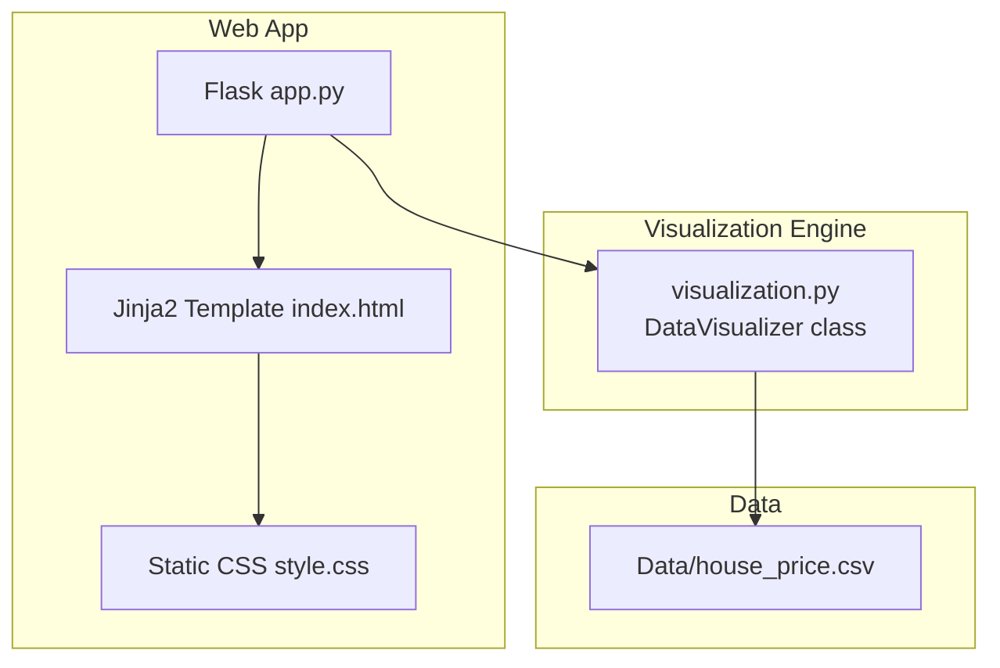
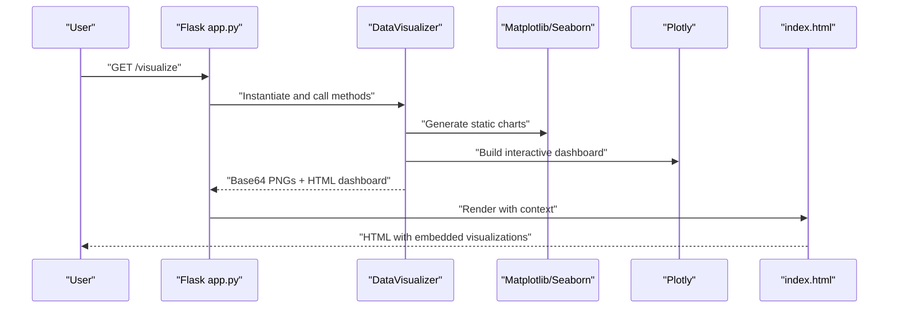
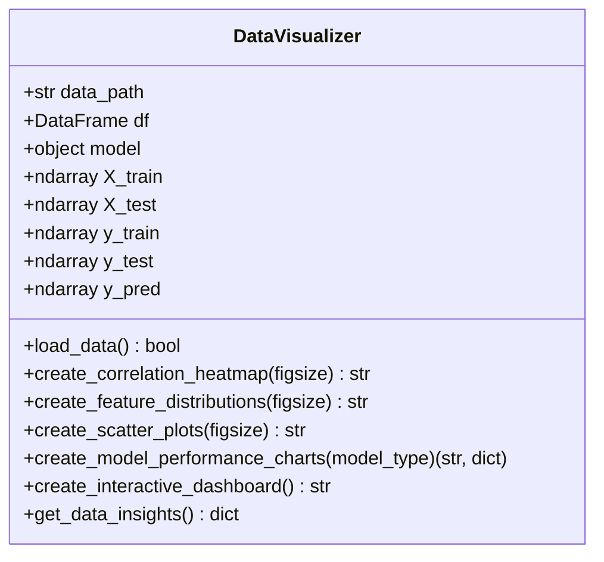
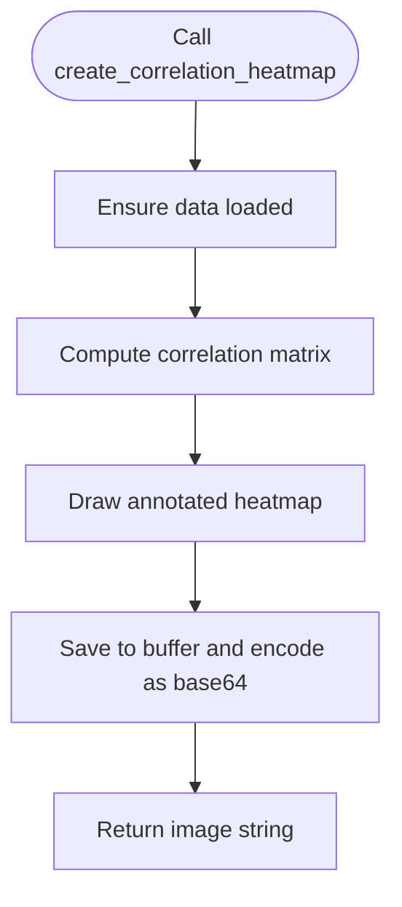
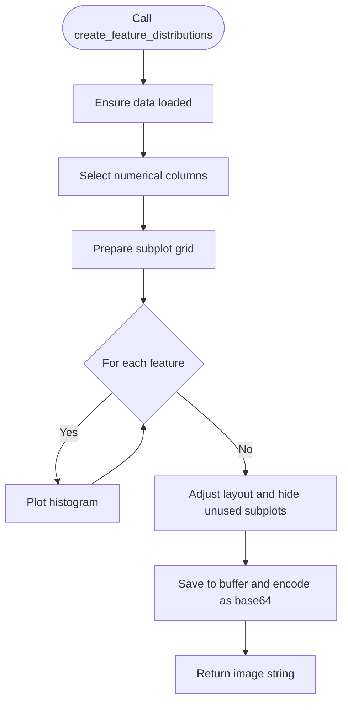
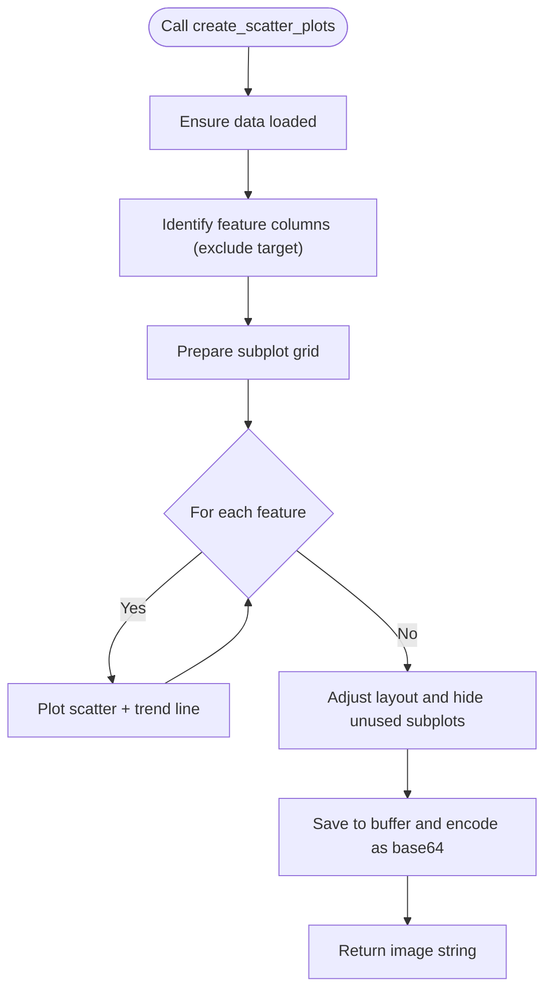
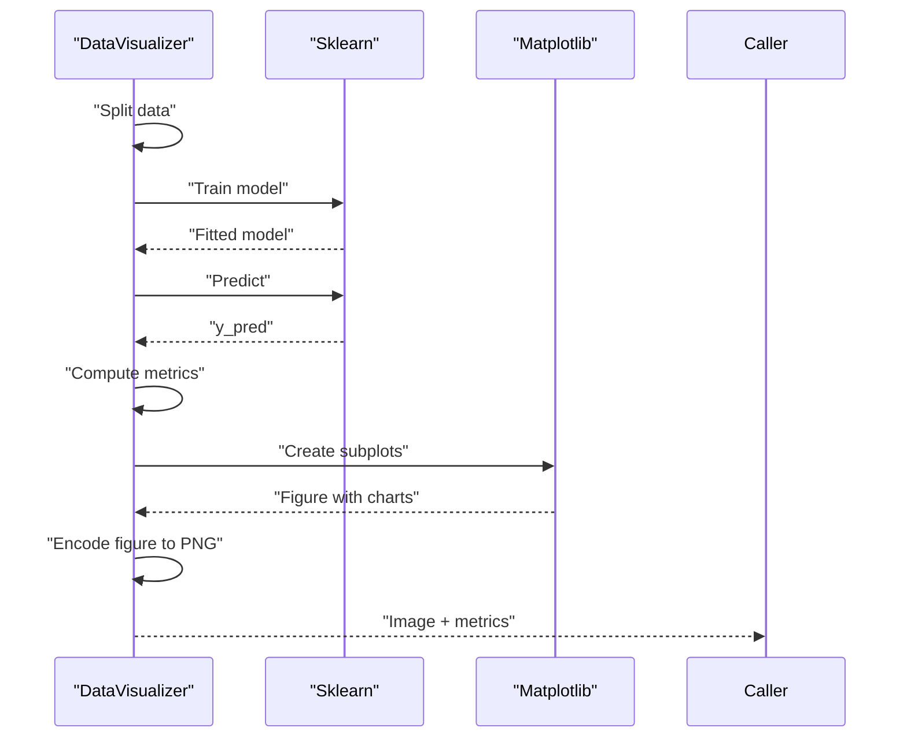
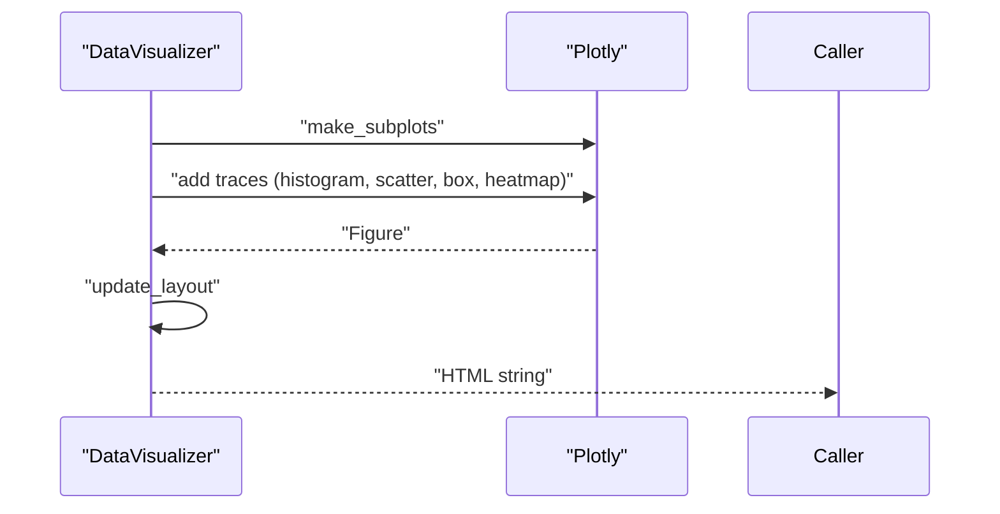
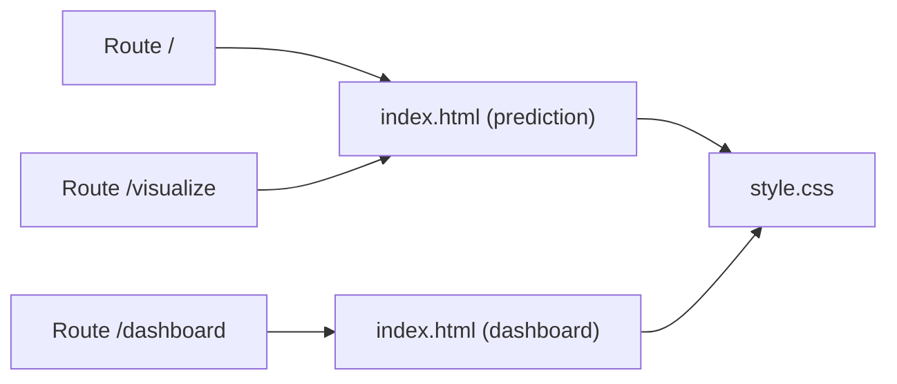
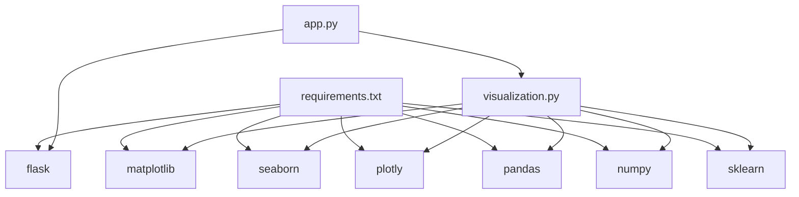

# Data Visualization

<cite>
**Referenced Files in This Document**
- [visualization.py](file://visualization.py)
- [setup_visualization.py](file://setup_visualization.py)
- [VIZ_GUIDE.md](file://VIZ_GUIDE.md)
- [VISUAL_ENHANCEMENT.md](file://VISUAL_ENHANCEMENT.md)
- [app.py](file://app.py)
- [index.html](file://templates/index.html)
- [style.css](file://static/css/style.css)
- [house_price.csv](file://Data/house_price.csv)
- [requirements.txt](file://requirements.txt)
- [config.yaml](file://configs/config.yaml)
</cite>

## Table of Contents
1. [Introduction](#introduction)
2. [Project Structure](#project-structure)
3. [Core Components](#core-components)
4. [Architecture Overview](#architecture-overview)
5. [Detailed Component Analysis](#detailed-component-analysis)
6. [Dependency Analysis](#dependency-analysis)
7. [Performance Considerations](#performance-considerations)
8. [Troubleshooting Guide](#troubleshooting-guide)
9. [Conclusion](#conclusion)
10. [Appendices](#appendices)

## Introduction
This document explains the data visualization capabilities of the House Price Prediction application. It covers static and interactive charting, correlation analysis, distribution plots, model performance visualization, and the integrated web dashboard. It also documents styling, responsive design, performance considerations, and extension points for adding new chart types and customizations.

## Project Structure
The visualization system is implemented as a modular Python package integrated with a Flask web application. Key elements:
- Visualization engine: a dedicated module that generates Matplotlib and Plotly visualizations
- Web routes: Flask endpoints that render visualizations into HTML templates
- Frontend: Jinja2 templates and CSS for layout, styling, and responsive presentation
- Data: CSV dataset with numerical and categorical features suitable for statistical analysis

**Diagram sources**
- [app.py:1-109](file://app.py#L1-L109)
- [index.html:1-145](file://templates/index.html#L1-L145)
- [style.css:1-456](file://static/css/style.css#L1-L456)
- [visualization.py:1-344](file://visualization.py#L1-L344)
- [house_price.csv:1-12](file://Data/house_price.csv#L1-L12)

**Section sources**
- [app.py:1-109](file://app.py#L1-L109)
- [index.html:1-145](file://templates/index.html#L1-L145)
- [style.css:1-456](file://static/css/style.css#L1-L456)
- [visualization.py:1-344](file://visualization.py#L1-L344)
- [house_price.csv:1-12](file://Data/house_price.csv#L1-L12)

## Core Components
- DataVisualizer: encapsulates all visualization logic, including loading data, computing statistics, generating static Matplotlib charts, and creating interactive Plotly dashboards.
- Flask routes: serve the main prediction page, the static visualizations page, and the interactive dashboard page.
- Templates and styling: present visualizations with responsive layouts, animations, and modern UI effects.

Key responsibilities:
- Data ingestion and validation
- Statistical summaries and insights
- Static chart generation (PNG via base64)
- Interactive dashboard creation (HTML embeds)
- Metrics computation and display

**Section sources**
- [visualization.py:23-313](file://visualization.py#L23-L313)
- [app.py:64-98](file://app.py#L64-L98)
- [index.html:21-79](file://templates/index.html#L21-L79)

## Architecture Overview
The visualization pipeline integrates data processing, chart generation, and web rendering:

**Diagram sources**
- [app.py:64-98](file://app.py#L64-L98)
- [visualization.py:36-313](file://visualization.py#L36-L313)
- [index.html:21-79](file://templates/index.html#L21-L79)

## Detailed Component Analysis

### DataVisualizer Class
The core class orchestrates all visualization tasks. It supports:
- Loading CSV data
- Computing descriptive statistics and insights
- Generating correlation heatmaps
- Creating feature distribution histograms
- Producing scatter plots with trend lines
- Building model performance charts (actual vs predicted, residuals, feature importance, metrics)
- Constructing an interactive dashboard with Plotly

**Diagram sources**
- [visualization.py:23-313](file://visualization.py#L23-L313)

**Section sources**
- [visualization.py:23-313](file://visualization.py#L23-L313)

### Visualization Methods

#### Correlation Heatmap
- Purpose: visualize pairwise correlations among numerical features
- Implementation: computes correlation matrix and renders a colored heatmap
- Output: base64-encoded PNG image

**Diagram sources**
- [visualization.py:46-65](file://visualization.py#L46-L65)

**Section sources**
- [visualization.py:46-65](file://visualization.py#L46-L65)

#### Feature Distribution Histograms
- Purpose: inspect distributions of numerical features
- Implementation: iterates numerical columns and draws histograms
- Output: base64-encoded PNG image

**Diagram sources**
- [visualization.py:67-99](file://visualization.py#L67-L99)

**Section sources**
- [visualization.py:67-99](file://visualization.py#L67-L99)

#### Scatter Plots (Features vs Target)
- Purpose: explore relationships between features and target (Price)
- Implementation: plots scatter with trend lines per feature
- Output: base64-encoded PNG image

**Diagram sources**
- [visualization.py:101-143](file://visualization.py#L101-L143)

**Section sources**
- [visualization.py:101-143](file://visualization.py#L101-L143)

#### Model Performance Charts
- Purpose: evaluate regression model performance
- Implementation: trains selected model, predicts, computes metrics, and produces:
  - Actual vs Predicted scatter with reference line
  - Residuals plot
  - Feature importance (coefficients or importances)
  - Metrics bar chart with values
- Output: base64-encoded PNG image and metrics dictionary

**Diagram sources**
- [visualization.py:145-235](file://visualization.py#L145-L235)

**Section sources**
- [visualization.py:145-235](file://visualization.py#L145-L235)

#### Interactive Dashboard
- Purpose: provide an interactive overview of distributions, relationships, and correlations
- Implementation: Plotly subplots combining:
  - Price histogram
  - Area vs Price scatter
  - Bedrooms vs Price box plot
  - Correlation heatmap
- Output: HTML embed (CDN-hosted Plotly)

**Diagram sources**
- [visualization.py:237-289](file://visualization.py#L237-L289)

**Section sources**
- [visualization.py:237-289](file://visualization.py#L237-L289)

### Web Integration and Rendering
- Flask routes:
  - "/" serves the prediction form
  - "/visualize" renders static visualizations and metrics
  - "/dashboard" renders the interactive dashboard
- Templates:
  - index.html conditionally renders visualization sections and dashboard
  - Uses Jinja2 to inject base64 images and dashboard HTML
- Styling:
  - style.css provides modern UI, animations, responsive layout, and background effects

**Diagram sources**
- [app.py:33-98](file://app.py#L33-L98)
- [index.html:1-145](file://templates/index.html#L1-L145)
- [style.css:1-456](file://static/css/style.css#L1-L456)

**Section sources**
- [app.py:33-98](file://app.py#L33-L98)
- [index.html:1-145](file://templates/index.html#L1-L145)
- [style.css:1-456](file://static/css/style.css#L1-L456)

## Dependency Analysis
- Visualization stack: Matplotlib, Seaborn, Plotly
- Data and ML: Pandas, NumPy, scikit-learn
- Web framework: Flask
- Configuration and deployment: PyYAML, Gunicorn (production), optional MLOps tools

**Diagram sources**
- [visualization.py:5-21](file://visualization.py#L5-L21)
- [requirements.txt:11-14](file://requirements.txt#L11-L14)
- [requirements.txt:2,4-5:2-5](file://requirements.txt#L2-L5)
- [app.py:1,11:1-12](file://app.py#L1-L12)

**Section sources**
- [requirements.txt:11-14](file://requirements.txt#L11-L14)
- [requirements.txt:2,4-5:2-5](file://requirements.txt#L2-L5)
- [visualization.py:5-21](file://visualization.py#L5-L21)
- [app.py:1,11:1-12](file://app.py#L1-L12)

## Performance Considerations
- Static chart generation:
  - Charts are rendered to PNG buffers and returned as base64 strings, minimizing server-side state and enabling client-side caching.
  - Matplotlib uses an Agg backend for non-interactive rendering suitable for server environments.
- Interactive dashboard:
  - Plotly figures are serialized to HTML with CDN-hosted JavaScript, reducing payload size and leveraging browser caching.
- Large datasets:
  - Current implementation operates on the full dataset. For very large datasets, consider sampling, pre-aggregation, or pagination of charts.
- Rendering optimization:
  - Reuse figure instances where possible and avoid unnecessary re-computation.
  - Keep subplot grids compact to reduce memory footprint.

[No sources needed since this section provides general guidance]

## Troubleshooting Guide
Common issues and resolutions:
- Missing visualization libraries:
  - Use the setup script to install Matplotlib, Seaborn, and Plotly.
- Data loading failures:
  - Ensure the CSV path exists and matches the expected column names.
- Empty or invalid data:
  - The visualization module checks for None and attempts to load data automatically; verify dataset integrity.
- Interactive dashboard not rendering:
  - Confirm the template injects the HTML safely and that the browser supports the included CDN resources.
- Styling anomalies:
  - Verify static asset paths and CSS class names in the template.

**Section sources**
- [setup_visualization.py:8-28](file://setup_visualization.py#L8-L28)
- [visualization.py:36-44](file://visualization.py#L36-L44)
- [index.html:76-78](file://templates/index.html#L76-L78)
- [style.css:1-456](file://static/css/style.css#L1-L456)

## Conclusion
The visualization module delivers a comprehensive toolkit for exploratory data analysis and model interpretation, integrating static and interactive visualizations into a cohesive web application. With clear extension points, it supports future enhancements such as additional chart types, advanced statistical tests, and export capabilities.

[No sources needed since this section summarizes without analyzing specific files]

## Appendices

### Supported Chart Types and Capabilities
- Correlation analysis: correlation heatmap
- Distribution analysis: histograms for numerical features
- Relationship analysis: scatter plots with trend lines
- Model performance: actual vs predicted, residuals, feature importance, metrics
- Interactive dashboard: histogram, scatter, box plot, and correlation matrix

**Section sources**
- [VIZ_GUIDE.md:9-46](file://VIZ_GUIDE.md#L9-L46)
- [visualization.py:46,67,101,145,237](file://visualization.py#L46,L67,L101,L145,L237)

### Practical Examples
- From house price data:
  - Correlation heatmap to identify feature relationships
  - Distribution plots to detect skewness and outliers
  - Scatter plots to visualize feature-target associations
- Performance reports:
  - Model performance charts and metrics summary
- Interactive analytics dashboards:
  - Single-page interactive dashboard with multiple Plotly charts

**Section sources**
- [VIZ_GUIDE.md:127-154](file://VIZ_GUIDE.md#L127-L154)
- [visualization.py:315-341](file://visualization.py#L315-L341)

### Chart Styling, Color Schemes, and Themes
- Matplotlib styling:
  - Apply styles and Seaborn themes for improved aesthetics
- Plotly styling:
  - Pass theme parameters to figures for consistent styling
- Web styling:
  - Modern UI with gradients, animations, and responsive design

**Section sources**
- [VIZ_GUIDE.md:184-187](file://VIZ_GUIDE.md#L184-L187)
- [VISUAL_ENHANCEMENT.md:63-69](file://VISUAL_ENHANCEMENT.md#L63-L69)
- [style.css:1-456](file://static/css/style.css#L1-L456)

### Responsive Visualization Design
- Mobile-friendly layout and adaptive chart sizing
- Consistent spacing, typography, and touch-friendly controls

**Section sources**
- [VISUAL_ENHANCEMENT.md:153-158](file://VISUAL_ENHANCEMENT.md#L153-L158)
- [style.css:394-418](file://static/css/style.css#L394-L418)

### Extending Visualization Capabilities
- Add new visualization methods to DataVisualizer
- Update Flask routes and templates to integrate new views
- Customize chart styles and themes as needed

**Section sources**
- [VIZ_GUIDE.md:178-182](file://VIZ_GUIDE.md#L178-L182)

### Data Schema Reference
- Expected columns: Area, Bedrooms, Bathrooms, Stories, Parking, Age, Location, Price

**Section sources**
- [house_price.csv:1](file://Data/house_price.csv#L1)

### Configuration and Environment
- API configuration and logging settings
- Production deployment considerations

**Section sources**
- [config.yaml:49-54](file://configs/config.yaml#L49-L54)