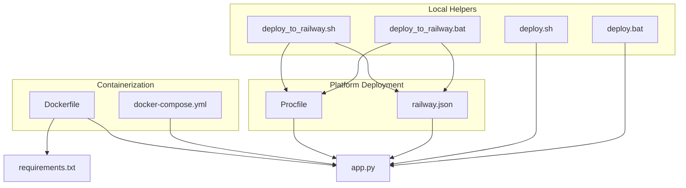
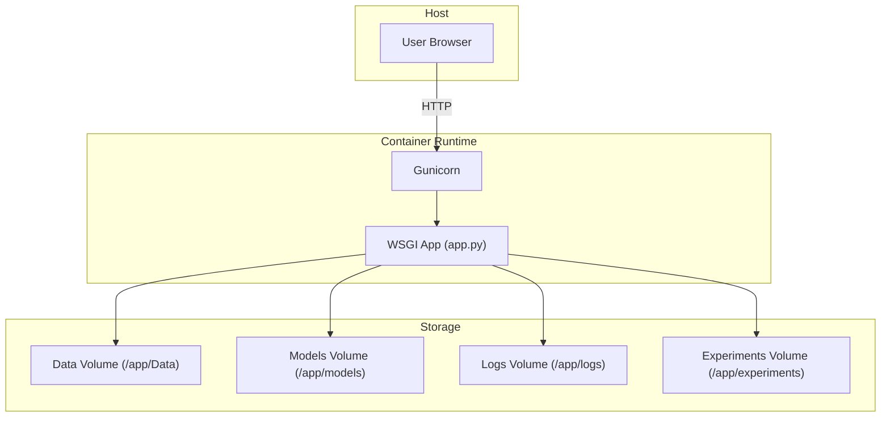
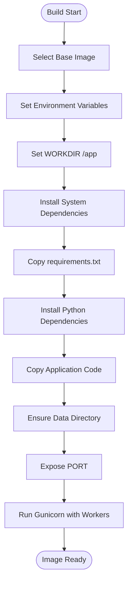
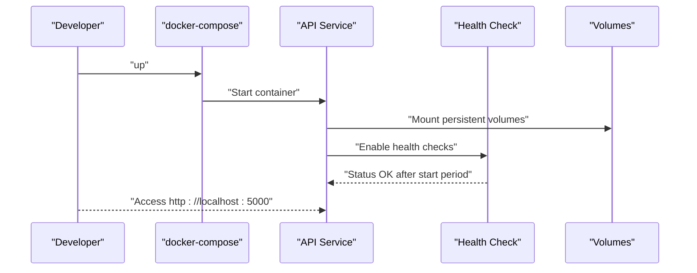
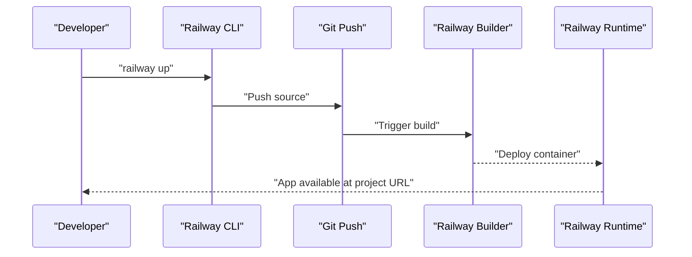
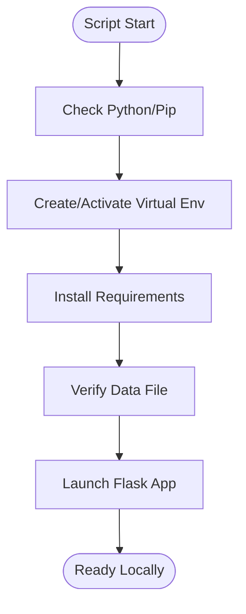
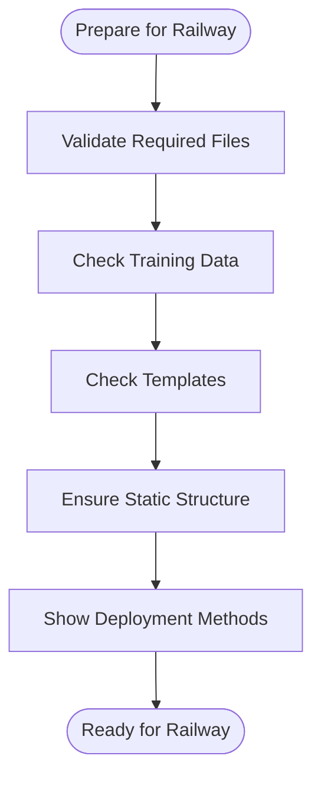
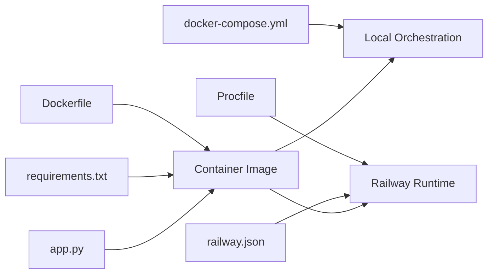

# Deployment Guide

<cite>
**Referenced Files in This Document**
- [Dockerfile](file://House_Price_Prediction-main/housing1/Dockerfile)
- [docker-compose.yml](file://House_Price_Prediction-main/housing1/docker-compose.yml)
- [Procfile](file://House_Price_Prediction-main/housing1/Procfile)
- [railway.json](file://House_Price_Prediction-main/housing1/railway.json)
- [deploy.sh](file://House_Price_Prediction-main/housing1/deploy.sh)
- [deploy.bat](file://House_Price_Prediction-main/housing1/deploy.bat)
- [deploy_to_railway.sh](file://House_Price_Prediction-main/housing1/deploy_to_railway.sh)
- [deploy_to_railway.bat](file://House_Price_Prediction-main/housing1/deploy_to_railway.bat)
- [requirements.txt](file://House_Price_Prediction-main/housing1/requirements.txt)
- [app.py](file://House_Price_Prediction-main/housing1/app.py)
</cite>

## Table of Contents
1. [Introduction](#introduction)
2. [Project Structure](#project-structure)
3. [Core Components](#core-components)
4. [Architecture Overview](#architecture-overview)
5. [Detailed Component Analysis](#detailed-component-analysis)
6. [Dependency Analysis](#dependency-analysis)
7. [Performance Considerations](#performance-considerations)
8. [Troubleshooting Guide](#troubleshooting-guide)
9. [Conclusion](#conclusion)
10. [Appendices](#appendices)

## Introduction
This guide documents how to containerize and deploy the House Price Prediction application using Docker, run it locally with Docker Compose, and deploy it to Railway. It also covers production-grade deployment strategies such as health checks, load balancing, monitoring, security, backups, disaster recovery, and deployment automation including blue-green deployments and rollbacks.

## Project Structure
The deployment assets are organized under the housing1 directory:
- Containerization: Dockerfile, docker-compose.yml
- Platform deployment: Procfile, railway.json
- Local deployment helpers: deploy.sh, deploy.bat
- Production deployment preparation: deploy_to_railway.sh, deploy_to_railway.bat
- Application runtime: requirements.txt, app.py

**Diagram sources**
- [Dockerfile](file://House_Price_Prediction-main/housing1/Dockerfile)
- [docker-compose.yml](file://House_Price_Prediction-main/housing1/docker-compose.yml)
- [Procfile](file://House_Price_Prediction-main/housing1/Procfile)
- [railway.json](file://House_Price_Prediction-main/housing1/railway.json)
- [deploy.sh](file://House_Price_Prediction-main/housing1/deploy.sh)
- [deploy.bat](file://House_Price_Prediction-main/housing1/deploy.bat)
- [deploy_to_railway.sh](file://House_Price_Prediction-main/housing1/deploy_to_railway.sh)
- [deploy_to_railway.bat](file://House_Price_Prediction-main/housing1/deploy_to_railway.bat)
- [requirements.txt](file://House_Price_Prediction-main/housing1/requirements.txt)
- [app.py](file://House_Price_Prediction-main/housing1/app.py)

**Section sources**
- [Dockerfile](file://House_Price_Prediction-main/housing1/Dockerfile)
- [docker-compose.yml](file://House_Price_Prediction-main/housing1/docker-compose.yml)
- [Procfile](file://House_Price_Prediction-main/housing1/Procfile)
- [railway.json](file://House_Price_Prediction-main/housing1/railway.json)
- [deploy.sh](file://House_Price_Prediction-main/housing1/deploy.sh)
- [deploy.bat](file://House_Price_Prediction-main/housing1/deploy.bat)
- [deploy_to_railway.sh](file://House_Price_Prediction-main/housing1/deploy_to_railway.sh)
- [deploy_to_railway.bat](file://House_Price_Prediction-main/housing1/deploy_to_railway.bat)
- [requirements.txt](file://House_Price_Prediction-main/housing1/requirements.txt)
- [app.py](file://House_Price_Prediction-main/housing1/app.py)

## Core Components
- Container image definition: The Dockerfile sets the base image, installs system and Python dependencies, exposes a dynamic port, and runs the app via Gunicorn.
- Local orchestration: docker-compose.yml defines a service with health checks, persistent volumes for data and models, and a production-like Gunicorn command.
- Platform-specific process: Procfile declares the process type and Gunicorn command for platforms that require it.
- Railway configuration: railway.json specifies the builder, start command, and included/excluded files for Railway’s build pipeline.
- Local deployment scripts: deploy.sh and deploy.bat prepare environments and run the Flask app locally.
- Railway deployment preparation: deploy_to_railway.sh and deploy_to_railway.bat validate required files and outline Railway deployment methods.

**Section sources**
- [Dockerfile](file://House_Price_Prediction-main/housing1/Dockerfile)
- [docker-compose.yml](file://House_Price_Prediction-main/housing1/docker-compose.yml)
- [Procfile](file://House_Price_Prediction-main/housing1/Procfile)
- [railway.json](file://House_Price_Prediction-main/housing1/railway.json)
- [deploy.sh](file://House_Price_Prediction-main/housing1/deploy.sh)
- [deploy.bat](file://House_Price_Prediction-main/housing1/deploy.bat)
- [deploy_to_railway.sh](file://House_Price_Prediction-main/housing1/deploy_to_railway.sh)
- [deploy_to_railway.bat](file://House_Price_Prediction-main/housing1/deploy_to_railway.bat)

## Architecture Overview
The application runs as a single containerized web service behind a WSGI server. For local development and production, the same container image is used, with differences in process invocation and orchestration.

**Diagram sources**
- [docker-compose.yml](file://House_Price_Prediction-main/housing1/docker-compose.yml)
- [Dockerfile](file://House_Price_Prediction-main/housing1/Dockerfile)
- [app.py](file://House_Price_Prediction-main/housing1/app.py)

## Detailed Component Analysis

### Dockerfile Configuration
- Base image: Python slim image selected for a smaller footprint.
- Environment variables: Bytecode and buffering controls are set for containerized runs.
- Working directory: The app is staged under /app.
- System dependencies: Build tools are installed to support Python package compilation.
- Python dependencies: Installed from requirements.txt with caching disabled.
- Application copy: The entire project is copied into the image.
- Directories: Data directory is ensured at runtime.
- Port exposure: The container exposes the port defined by the PORT environment variable.
- Command: Gunicorn binds to 0.0.0.0 with workers configured to serve requests.

**Diagram sources**
- [Dockerfile](file://House_Price_Prediction-main/housing1/Dockerfile)

**Section sources**
- [Dockerfile](file://House_Price_Prediction-main/housing1/Dockerfile)

### docker-compose Orchestration
- Service: api service built from the current directory.
- Ports: Host:5000 mapped to container:5000 for local testing.
- Environment: Sets production mode and configuration path.
- Volumes: Persistent storage for data, models, logs, and experiments.
- Health check: Uses curl against a /health endpoint with timing and retry policy.
- Restart policy: Unset failures trigger restart.
- Optional monitoring: Prometheus and Grafana are commented as optional services.

**Diagram sources**
- [docker-compose.yml](file://House_Price_Prediction-main/housing1/docker-compose.yml)

**Section sources**
- [docker-compose.yml](file://House_Price_Prediction-main/housing1/docker-compose.yml)

### Procfile and Railway Integration
- Procfile defines the web process and Gunicorn command for platforms requiring a Procfile.
- railway.json configures:
  - Builder: Heroku-style buildpacks.
  - Start command: Gunicorn bound to PORT with workers.
  - Filesystem inclusion/exclusion: Controls what is packaged for deployment.

**Diagram sources**
- [Procfile](file://House_Price_Prediction-main/housing1/Procfile)
- [railway.json](file://House_Price_Prediction-main/housing1/railway.json)

**Section sources**
- [Procfile](file://House_Price_Prediction-main/housing1/Procfile)
- [railway.json](file://House_Price_Prediction-main/housing1/railway.json)

### Local Deployment Scripts
- deploy.sh and deploy.bat:
  - Validate Python and pip presence.
  - Create and activate a virtual environment.
  - Install dependencies from requirements.txt.
  - Verify the presence of the training data file.
  - Launch the Flask app locally.

**Diagram sources**
- [deploy.sh](file://House_Price_Prediction-main/housing1/deploy.sh)
- [deploy.bat](file://House_Price_Prediction-main/housing1/deploy.bat)
- [requirements.txt](file://House_Price_Prediction-main/housing1/requirements.txt)
- [app.py](file://House_Price_Prediction-main/housing1/app.py)

**Section sources**
- [deploy.sh](file://House_Price_Prediction-main/housing1/deploy.sh)
- [deploy.bat](file://House_Price_Prediction-main/housing1/deploy.bat)
- [requirements.txt](file://House_Price_Prediction-main/housing1/requirements.txt)
- [app.py](file://House_Price_Prediction-main/housing1/app.py)

### Railway Deployment Preparation Scripts
- deploy_to_railway.sh and deploy_to_railway.bat:
  - Validate presence of app.py, requirements.txt, and Procfile.
  - Confirm Data/house_price.csv and templates/index.html exist.
  - Ensure static directory structure is present.
  - Print Railway deployment methods (CLI, Dashboard, Git).
  - Provide post-deployment URL guidance.

**Diagram sources**
- [deploy_to_railway.sh](file://House_Price_Prediction-main/housing1/deploy_to_railway.sh)
- [deploy_to_railway.bat](file://House_Price_Prediction-main/housing1/deploy_to_railway.bat)
- [Procfile](file://House_Price_Prediction-main/housing1/Procfile)
- [railway.json](file://House_Price_Prediction-main/housing1/railway.json)

**Section sources**
- [deploy_to_railway.sh](file://House_Price_Prediction-main/housing1/deploy_to_railway.sh)
- [deploy_to_railway.bat](file://House_Price_Prediction-main/housing1/deploy_to_railway.bat)
- [Procfile](file://House_Price_Prediction-main/housing1/Procfile)
- [railway.json](file://House_Price_Prediction-main/housing1/railway.json)

## Dependency Analysis
- Container image depends on:
  - Base OS packages installed in the image.
  - Python dependencies resolved from requirements.txt.
  - Application code and configuration files.
- Runtime dependencies:
  - Gunicorn as the WSGI server.
  - Flask app module referenced by the WSGI entry point.
- Orchestration dependencies:
  - docker-compose orchestrates the API service and mounts persistent volumes.
  - Railway builder and runtime interpret Procfile and railway.json.

**Diagram sources**
- [Dockerfile](file://House_Price_Prediction-main/housing1/Dockerfile)
- [requirements.txt](file://House_Price_Prediction-main/housing1/requirements.txt)
- [app.py](file://House_Price_Prediction-main/housing1/app.py)
- [Procfile](file://House_Price_Prediction-main/housing1/Procfile)
- [railway.json](file://House_Price_Prediction-main/housing1/railway.json)
- [docker-compose.yml](file://House_Price_Prediction-main/housing1/docker-compose.yml)

**Section sources**
- [Dockerfile](file://House_Price_Prediction-main/housing1/Dockerfile)
- [requirements.txt](file://House_Price_Prediction-main/housing1/requirements.txt)
- [app.py](file://House_Price_Prediction-main/housing1/app.py)
- [Procfile](file://House_Price_Prediction-main/housing1/Procfile)
- [railway.json](file://House_Price_Prediction-main/housing1/railway.json)
- [docker-compose.yml](file://House_Price_Prediction-main/housing1/docker-compose.yml)

## Performance Considerations
- Worker tuning: Adjust the number of Gunicorn workers based on CPU cores and memory capacity.
- Health checks: Use the provided health check configuration to ensure rolling updates and auto-healing work reliably.
- Load balancing: Place a reverse proxy or platform-managed load balancer in front of the service to distribute traffic.
- Resource limits: Set CPU and memory limits in your container runtime or platform to prevent noisy-neighbor issues.
- Caching: Persist models and logs to volumes to avoid repeated initialization overhead.
- Monitoring: Integrate metrics collection and alerting to track latency, error rates, and resource utilization.

[No sources needed since this section provides general guidance]

## Troubleshooting Guide
- Port conflicts: Ensure the host port is free when running locally with docker-compose.
- Missing data: The application requires the training data file; scripts will fail if missing.
- Template or static assets: Ensure templates and static directories exist; the preparation scripts can create minimal structures.
- Health check failures: Verify the /health endpoint is implemented and reachable.
- Railway build errors: Confirm Procfile and railway.json are present and correct; review included/excluded files.

**Section sources**
- [docker-compose.yml](file://House_Price_Prediction-main/housing1/docker-compose.yml)
- [deploy.sh](file://House_Price_Prediction-main/housing1/deploy.sh)
- [deploy.bat](file://House_Price_Prediction-main/housing1/deploy.bat)
- [deploy_to_railway.sh](file://House_Price_Prediction-main/housing1/deploy_to_railway.sh)
- [deploy_to_railway.bat](file://House_Price_Prediction-main/housing1/deploy_to_railway.bat)

## Conclusion
This guide outlined how to containerize the House Price Prediction application, run it locally with Docker Compose, and deploy it to Railway. It also provided production-focused recommendations for health checks, load balancing, monitoring, security, backups, disaster recovery, and deployment automation.

[No sources needed since this section summarizes without analyzing specific files]

## Appendices

### Production Deployment Strategies
- Load balancing: Use a platform load balancer or a reverse proxy to distribute traffic across multiple instances.
- Health checks: Keep the existing health check configuration to enable safe rolling updates.
- Monitoring: Integrate metrics and logs; consider adding Prometheus and Grafana services if desired.
- Security:
  - Restrict inbound traffic to necessary ports.
  - Use secrets management for sensitive configuration.
  - Enable HTTPS termination at the platform or reverse proxy.
- Backups and disaster recovery:
  - Back up persisted volumes (models, logs, experiments).
  - Automate snapshotting of critical data directories.
  - Test restoration procedures regularly.

[No sources needed since this section provides general guidance]

### Deployment Automation and Rollbacks
- Blue-green deployments:
  - Maintain two identical environments; switch traffic between them.
  - Validate the new version with health checks and smoke tests before switching.
- Rollback procedures:
  - Keep previous container images tagged.
  - Re-deploy the last known good image and re-apply configuration changes if necessary.
- CI/CD integration:
  - Automate building the image, pushing to a registry, and deploying to the platform.
  - Gate deployments with automated tests and approvals.

[No sources needed since this section provides general guidance]