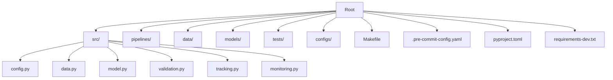
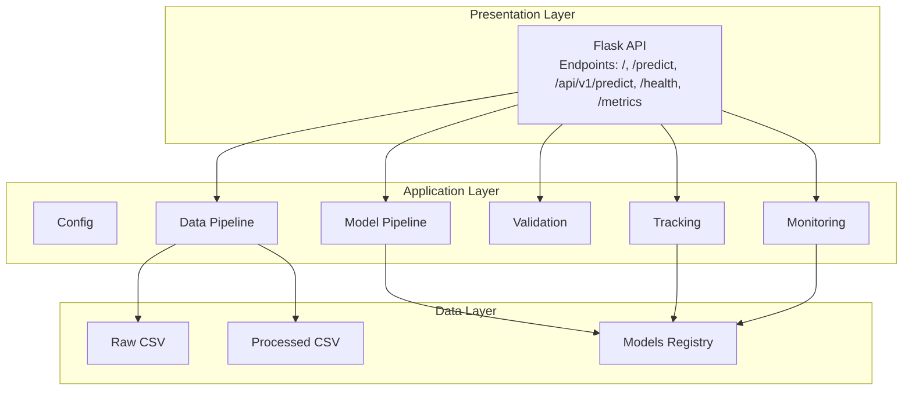
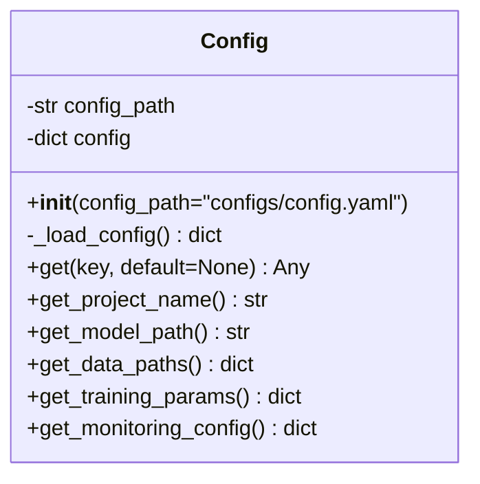
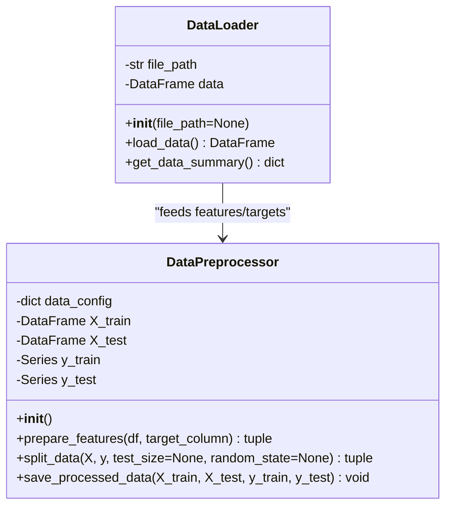
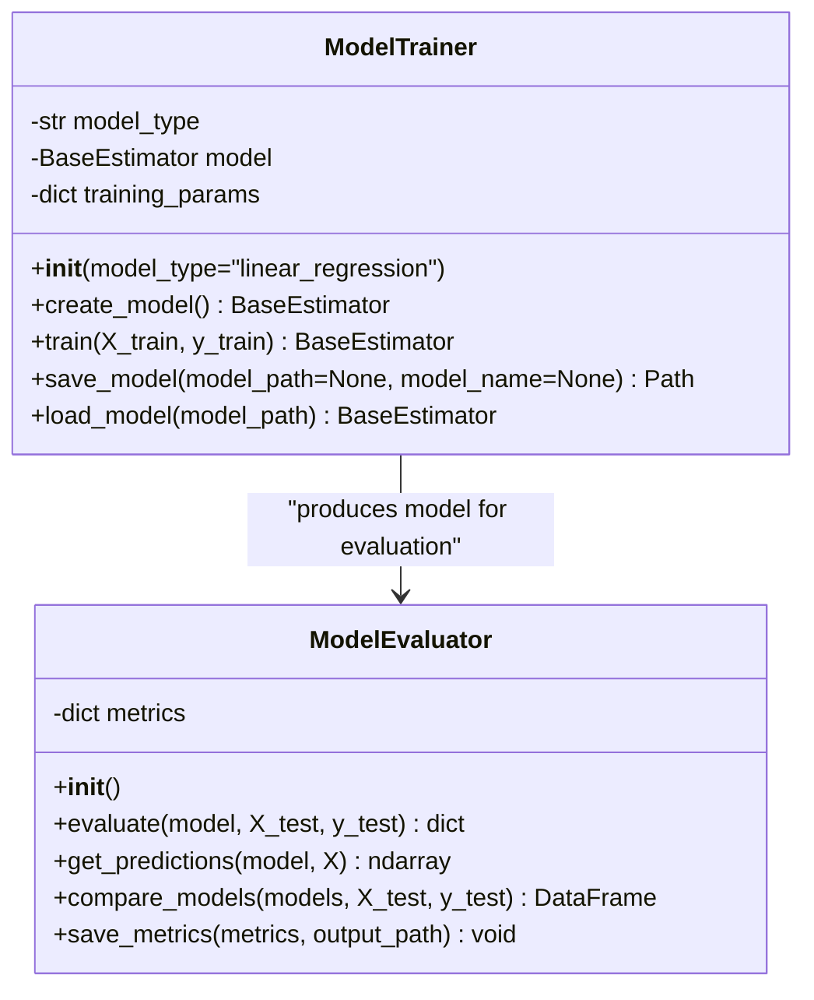
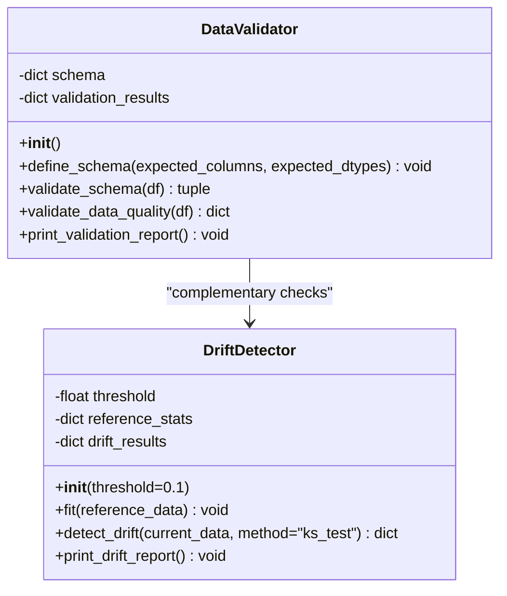
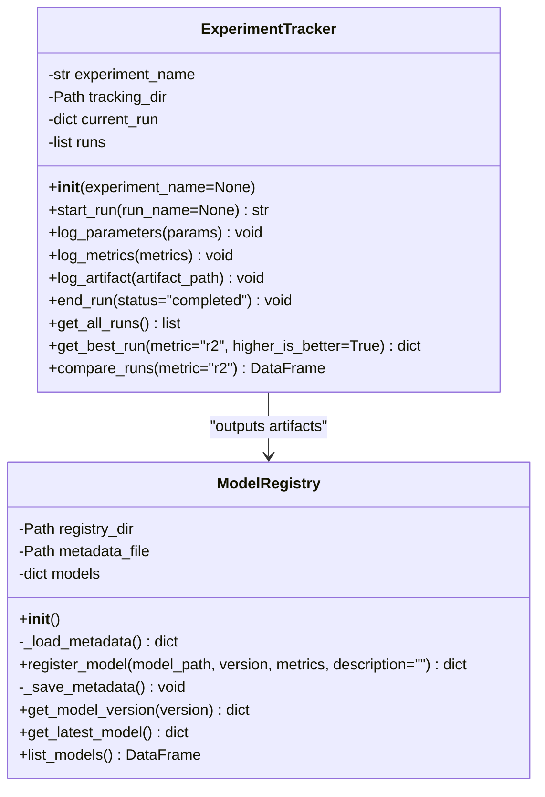
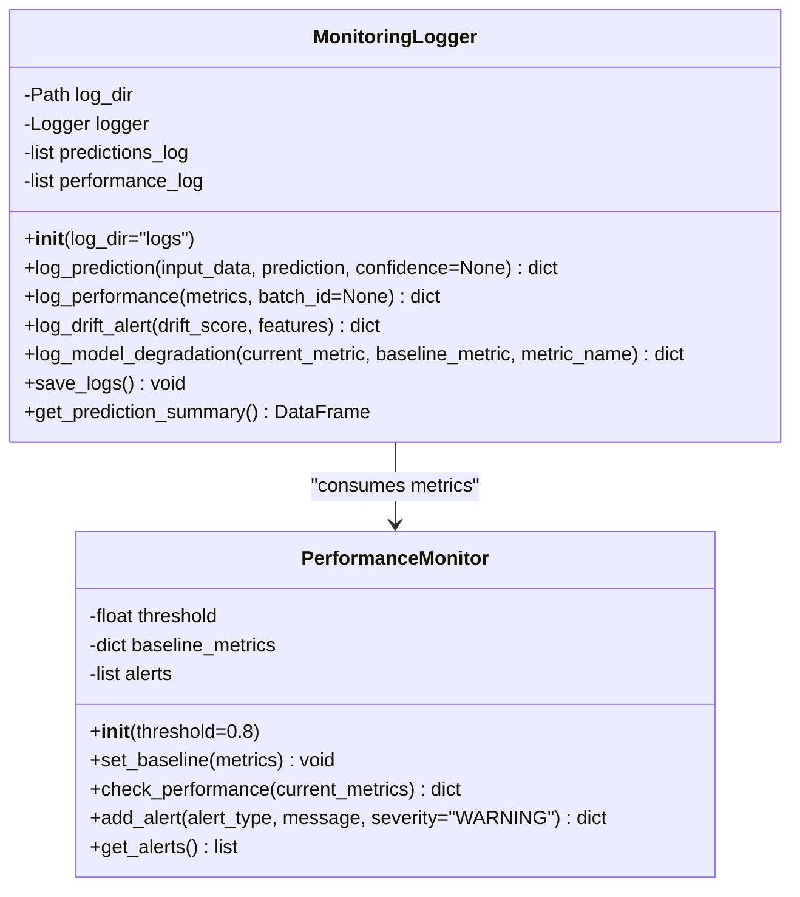
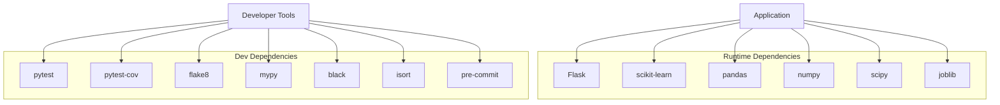

# Development Guidelines

<cite>
**Referenced Files in This Document**
- [README.md](file://README.md)
- [SETUP.md](file://SETUP.md)
- [QUICKSTART.md](file://QUICKSTART.md)
- [ARCHITECTURE.md](file://ARCHITECTURE.md)
- [MLOPS_WORKFLOW.md](file://MLOPS_WORKFLOW.md)
- [.pre-commit-config.yaml](file://.pre-commit-config.yaml)
- [pyproject.toml](file://pyproject.toml)
- [requirements-dev.txt](file://requirements-dev.txt)
- [Makefile](file://Makefile)
- [src/config.py](file://src/config.py)
- [src/data.py](file://src/data.py)
- [src/model.py](file://src/model.py)
- [src/validation.py](file://src/validation.py)
- [src/tracking.py](file://src/tracking.py)
- [src/monitoring.py](file://src/monitoring.py)
- [tests/test_components.py](file://tests/test_components.py)
</cite>

## Table of Contents
1. [Introduction](#introduction)
2. [Project Structure](#project-structure)
3. [Core Components](#core-components)
4. [Architecture Overview](#architecture-overview)
5. [Detailed Component Analysis](#detailed-component-analysis)
6. [Dependency Analysis](#dependency-analysis)
7. [Performance Considerations](#performance-considerations)
8. [Troubleshooting Guide](#troubleshooting-guide)
9. [Contribution Workflow](#contribution-workflow)
10. [Code Quality and Standards](#code-quality-and-standards)
11. [Development Environment Setup](#development-environment-setup)
12. [Debugging and Profiling](#debugging-and-profiling)
13. [Conclusion](#conclusion)

## Introduction
This document provides comprehensive development guidelines for the MLOps House Price Prediction project. It covers code standards, contribution workflows, best practices, development environment setup, quality checks, and operational guidance. The project follows modern MLOps practices with modular architecture, automated testing, experiment tracking, model registry, monitoring, and CI/CD readiness.

## Project Structure
The project is organized into clear functional areas:
- Source code: src/ with modules for configuration, data, model, validation, tracking, and monitoring
- Pipelines: pipelines/ containing training pipeline scripts
- Data: data/raw and data/processed for datasets
- Models: models/ and models/registry for persisted artifacts
- Tests: tests/ with unit tests
- Configuration: configs/config.yaml
- Dev tooling: Makefile, pyproject.toml, .pre-commit-config.yaml, requirements-dev.txt
- Documentation: README.md, SETUP.md, QUICKSTART.md, ARCHITECTURE.md, MLOPS_WORKFLOW.md

**Diagram sources**
- [ARCHITECTURE.md](file://ARCHITECTURE.md)
- [src/config.py](file://src/config.py)
- [src/data.py](file://src/data.py)
- [src/model.py](file://src/model.py)
- [src/validation.py](file://src/validation.py)
- [src/tracking.py](file://src/tracking.py)
- [src/monitoring.py](file://src/monitoring.py)

**Section sources**
- [ARCHITECTURE.md](file://ARCHITECTURE.md)
- [README.md](file://README.md)

## Core Components
Key modules and their responsibilities:
- Configuration: centralized YAML-based configuration management
- Data: data loading, preprocessing, and saving processed datasets
- Model: training, evaluation, persistence, and loading of ML models
- Validation: data quality checks and drift detection
- Tracking: experiment runs and model registry
- Monitoring: structured logging, performance metrics, and alerts

Implementation highlights:
- Strong typing with type hints across modules
- Centralized configuration via a Config class
- Modular APIs for training, evaluation, validation, and monitoring
- JSON-based experiment tracking and model registry

**Section sources**
- [src/config.py](file://src/config.py)
- [src/data.py](file://src/data.py)
- [src/model.py](file://src/model.py)
- [src/validation.py](file://src/validation.py)
- [src/tracking.py](file://src/tracking.py)
- [src/monitoring.py](file://src/monitoring.py)

## Architecture Overview
The system follows a layered architecture:
- Presentation: Flask API serving predictions and dashboards
- Application: Python modules implementing ML workflows
- Data: CSV files and processed datasets
- Models: persisted artifacts with registry
- Observability: structured logs and metrics

**Diagram sources**
- [ARCHITECTURE.md](file://ARCHITECTURE.md)
- [src/config.py](file://src/config.py)
- [src/data.py](file://src/data.py)
- [src/model.py](file://src/model.py)
- [src/validation.py](file://src/validation.py)
- [src/tracking.py](file://src/tracking.py)
- [src/monitoring.py](file://src/monitoring.py)

## Detailed Component Analysis

### Configuration Management
The Config class centralizes configuration loading and retrieval with dot-notation access for nested keys. It provides typed getters for project name, model paths, data paths, training parameters, and monitoring configuration.

**Diagram sources**
- [src/config.py](file://src/config.py)

**Section sources**
- [src/config.py](file://src/config.py)

### Data Pipeline
The data pipeline handles loading, validation, preprocessing, and saving processed datasets. It separates features and targets, splits into train/test sets, and persists processed data for reproducibility.

**Diagram sources**
- [src/data.py](file://src/data.py)

**Section sources**
- [src/data.py](file://src/data.py)

### Model Training and Evaluation
The model module creates, trains, evaluates, saves, and loads models. It supports multiple algorithms and computes standard regression metrics.

**Diagram sources**
- [src/model.py](file://src/model.py)

**Section sources**
- [src/model.py](file://src/model.py)

### Validation and Drift Detection
DataValidator performs schema and quality checks, while DriftDetector compares distributions using multiple methods to detect data drift.

**Diagram sources**
- [src/validation.py](file://src/validation.py)

**Section sources**
- [src/validation.py](file://src/validation.py)

### Experiment Tracking and Model Registry
ExperimentTracker logs runs with parameters, metrics, and artifacts. ModelRegistry manages model versions and metadata.

**Diagram sources**
- [src/tracking.py](file://src/tracking.py)

**Section sources**
- [src/tracking.py](file://src/tracking.py)

### Monitoring and Performance Alerts
MonitoringLogger logs predictions and performance metrics, while PerformanceMonitor compares current metrics against baselines to detect degradation.

**Diagram sources**
- [src/monitoring.py](file://src/monitoring.py)

**Section sources**
- [src/monitoring.py](file://src/monitoring.py)

## Dependency Analysis
The project relies on a curated set of libraries and tools:
- Runtime: Flask, scikit-learn, pandas, numpy, scipy, joblib
- Development: pytest, pytest-cov, flake8, mypy, black, isort, pre-commit
- DevOps: Docker, GitHub Actions (CI/CD), Makefile tasks

**Diagram sources**
- [requirements-dev.txt](file://requirements-dev.txt)
- [ARCHITECTURE.md](file://ARCHITECTURE.md)

**Section sources**
- [requirements-dev.txt](file://requirements-dev.txt)
- [ARCHITECTURE.md](file://ARCHITECTURE.md)

## Performance Considerations
- Use joblib for efficient model serialization, especially for large numpy arrays
- Persist processed datasets to reduce repeated preprocessing overhead
- Monitor prediction volume and response times; consider horizontal scaling with multiple Gunicorn workers
- Set baseline metrics and alert thresholds to detect performance degradation early
- Optimize model loading and consider caching strategies for inference

[No sources needed since this section provides general guidance]

## Troubleshooting Guide
Common issues and resolutions:
- Import errors: ensure virtual environment is activated and reinstall dependencies
- Port conflicts: change port in configuration
- Model not found: train a model first
- Test failures: reinstall development dependencies
- Data drift: investigate schema mismatches and quality issues
- API slowness: increase workers, optimize model loading, add caching

**Section sources**
- [SETUP.md](file://SETUP.md)
- [QUICKSTART.md](file://QUICKSTART.md)
- [MLOPS_WORKFLOW.md](file://MLOPS_WORKFLOW.md)

## Contribution Workflow
Follow these steps to contribute:
1. Fork the repository
2. Create a feature branch (git checkout -b feature/amazing-feature)
3. Commit changes (git commit -m 'Add amazing feature')
4. Push to the branch (git push origin feature/amazing-feature)
5. Open a Pull Request

Development guidelines:
- Write tests for new features
- Follow PEP 8 style guidelines
- Add type hints to functions
- Update documentation as needed
- Use meaningful commit messages

**Section sources**
- [README.md](file://README.md)

## Code Quality and Standards

### Coding Conventions
- PEP 8 compliance enforced via flake8 and black
- Type hints required for functions and classes
- Line length limit: 120 characters
- Black formatting profile aligned with isort

### Documentation Standards
- Docstrings for modules and classes
- Inline comments for complex logic
- README updates for new features
- Architecture and workflow documentation maintained

### Pre-commit Hooks and Linting
Configure pre-commit hooks to automate quality checks:
- trailing-whitespace, end-of-file-fixer
- YAML/JSON validation
- Large file detection
- Black formatting
- isort import sorting
- flake8 linting
- mypy type checking

Quality commands:
- make lint: run flake8
- make type-check: run mypy
- make format: run black and isort
- make test: run pytest with coverage

**Section sources**
- [.pre-commit-config.yaml](file://.pre-commit-config.yaml)
- [pyproject.toml](file://pyproject.toml)
- [Makefile](file://Makefile)

## Development Environment Setup
Recommended setup process:
1. Clone repository
2. Create virtual environment
3. Install dependencies (make install)
4. Setup project structure (make setup)
5. Verify installation (make test)

Quick start commands:
- make install: install production and development dependencies
- make setup: create required directories
- make train: run training pipeline
- make api: start development API server
- make test: run tests with coverage

**Section sources**
- [SETUP.md](file://SETUP.md)
- [QUICKSTART.md](file://QUICKSTART.md)
- [Makefile](file://Makefile)

## Debugging and Profiling
Debugging techniques:
- Use structured logging in MonitoringLogger
- Enable verbose test output (pytest -v)
- Print intermediate results during training
- Validate data quality before training

Profiling guidance:
- Monitor response times and error rates
- Track prediction volume trends
- Compare model performance metrics over time
- Use PerformanceMonitor to detect degradation

**Section sources**
- [src/monitoring.py](file://src/monitoring.py)
- [src/model.py](file://src/model.py)
- [tests/test_components.py](file://tests/test_components.py)

## Conclusion
This project establishes a robust foundation for MLOps development with clear architecture, comprehensive testing, experiment tracking, model registry, and monitoring. By following the development guidelines, contribution workflow, and quality standards outlined above, contributors can maintain code quality, ensure reproducibility, and support continuous delivery and monitoring in production.