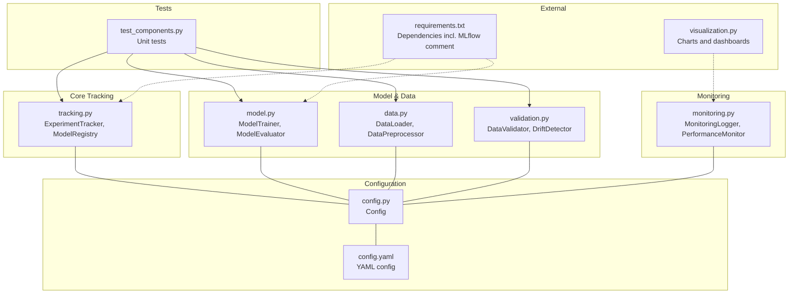
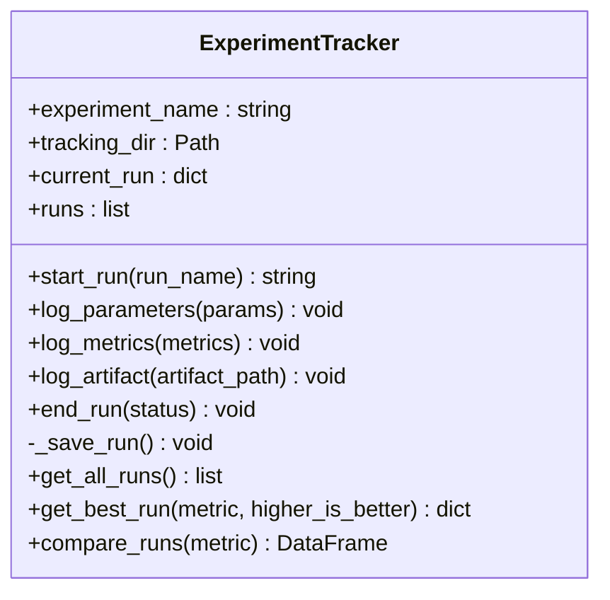
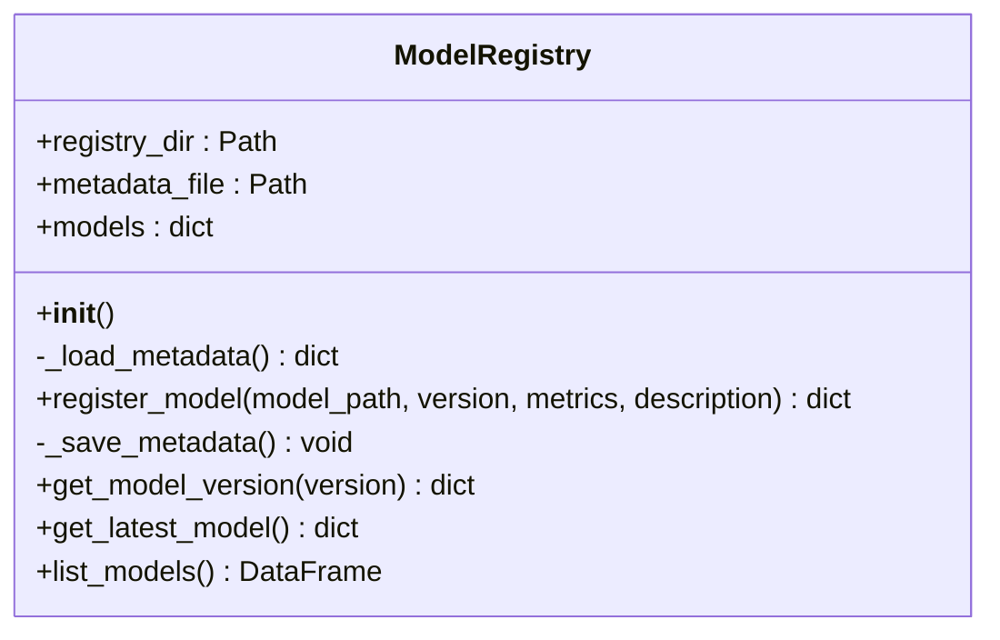
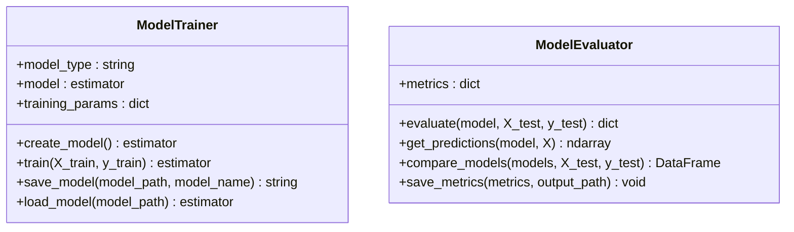
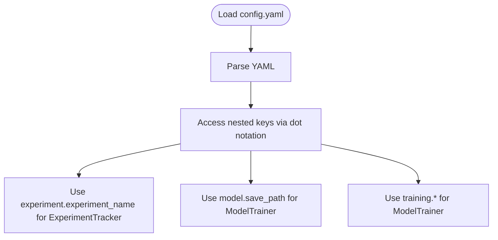
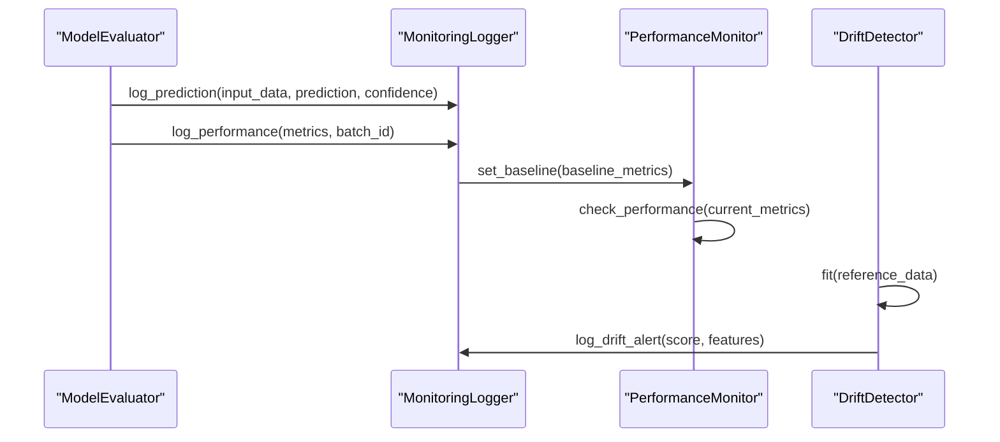
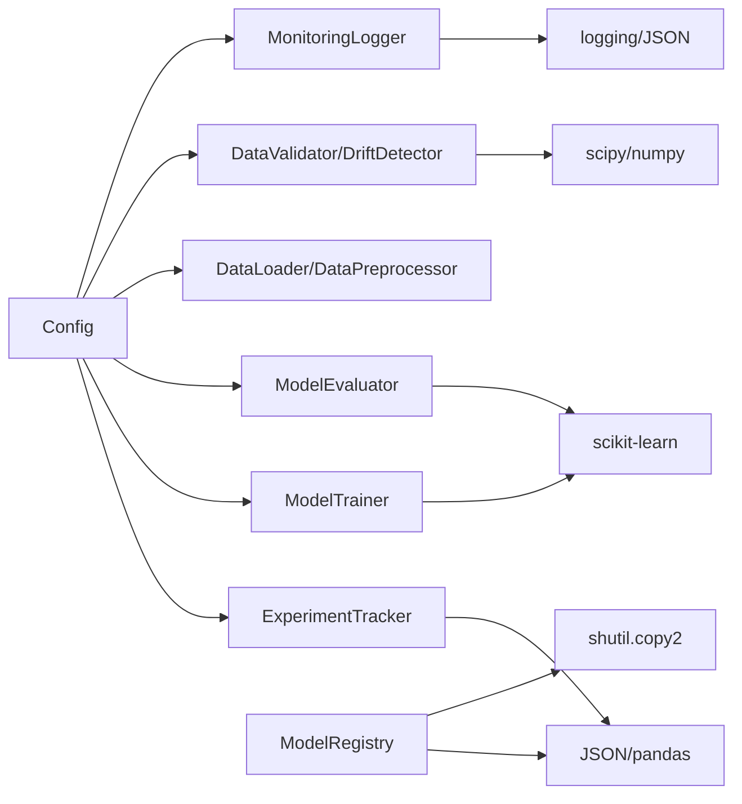

# Experiment Tracking & Registry

<cite>
**Referenced Files in This Document**
- [tracking.py](file://House_Price_Prediction-main/housing1/src/tracking.py)
- [config.py](file://House_Price_Prediction-main/housing1/src/config.py)
- [model.py](file://House_Price_Prediction-main/housing1/src/model.py)
- [config.yaml](file://House_Price_Prediction-main/housing1/configs/config.yaml)
- [requirements.txt](file://House_Price_Prediction-main/housing1/requirements.txt)
- [data.py](file://House_Price_Prediction-main/housing1/src/data.py)
- [validation.py](file://House_Price_Prediction-main/housing1/src/validation.py)
- [monitoring.py](file://House_Price_Prediction-main/housing1/src/monitoring.py)
- [visualization.py](file://House_Price_Prediction-main/housing1/visualization.py)
- [test_components.py](file://House_Price_Prediction-main/housing1/tests/test_components.py)
</cite>

## Table of Contents
1. [Introduction](#introduction)
2. [Project Structure](#project-structure)
3. [Core Components](#core-components)
4. [Architecture Overview](#architecture-overview)
5. [Detailed Component Analysis](#detailed-component-analysis)
6. [Dependency Analysis](#dependency-analysis)
7. [Performance Considerations](#performance-considerations)
8. [Troubleshooting Guide](#troubleshooting-guide)
9. [Conclusion](#conclusion)
10. [Appendices](#appendices)

## Introduction
This document explains the experiment tracking and model registry capabilities implemented in the project. It focuses on:
- ExperimentTracker: run lifecycle, parameter logging, metric tracking, artifact logging, and run comparison.
- ModelRegistry: model versioning, performance comparison, and production model selection.
- Practical examples for tracking experiments, comparing configurations, and maintaining model lineage.
- Experiment database structure, run artifact storage, and model artifact management.
- Best practices for organizing experiments, managing parameter sweeps, and interpreting results.
- Guidance on extending the system for custom metrics and experiment types.

The system currently persists experiment runs and model metadata locally as JSON files and copies model artifacts to a registry folder. The configuration file includes an MLflow tracking URI placeholder, indicating potential future integration with MLflow.

## Project Structure
The experiment tracking and registry functionality resides primarily under the src directory, with configuration and tests supporting the components.

**Diagram sources**
- [tracking.py:14-218](file://House_Price_Prediction-main/housing1/src/tracking.py#L14-L218)
- [config.py:10-63](file://House_Price_Prediction-main/housing1/src/config.py#L10-L63)
- [model.py:17-155](file://House_Price_Prediction-main/housing1/src/model.py#L17-L155)
- [data.py:13-109](file://House_Price_Prediction-main/housing1/src/data.py#L13-L109)
- [validation.py:14-243](file://House_Price_Prediction-main/housing1/src/validation.py#L14-L243)
- [monitoring.py:15-218](file://House_Price_Prediction-main/housing1/src/monitoring.py#L15-L218)
- [config.yaml:1-60](file://House_Price_Prediction-main/housing1/configs/config.yaml#L1-L60)
- [requirements.txt:1-24](file://House_Price_Prediction-main/housing1/requirements.txt#L1-L24)
- [visualization.py:23-344](file://House_Price_Prediction-main/housing1/visualization.py#L23-L344)

**Section sources**
- [tracking.py:14-218](file://House_Price_Prediction-main/housing1/src/tracking.py#L14-L218)
- [config.py:10-63](file://House_Price_Prediction-main/housing1/src/config.py#L10-L63)
- [config.yaml:1-60](file://House_Price_Prediction-main/housing1/configs/config.yaml#L1-L60)

## Core Components
- ExperimentTracker: Manages experiment runs, logs parameters and metrics, tracks artifacts, saves runs to JSON, and compares runs.
- ModelRegistry: Registers model versions, maintains metadata, lists models, and retrieves latest model.
- ModelTrainer and ModelEvaluator: Provide training and evaluation utilities used in experiments.
- Config: Centralized configuration access for experiment names, model paths, and training parameters.
- MonitoringLogger and PerformanceMonitor: Log predictions/performance and detect performance degradation and data drift.

Key responsibilities:
- ExperimentTracker: run lifecycle, parameter/metric/artifact logging, run persistence, best-run selection, run comparison.
- ModelRegistry: model version registration, metadata persistence, model listing and retrieval.
- ModelTrainer/Evaluator: model creation, training, evaluation, and metrics computation.
- Config: centralized access to YAML configuration values.
- Monitoring: operational logging and drift/performance monitoring.

**Section sources**
- [tracking.py:14-218](file://House_Price_Prediction-main/housing1/src/tracking.py#L14-L218)
- [model.py:17-155](file://House_Price_Prediction-main/housing1/src/model.py#L17-L155)
- [config.py:10-63](file://House_Price_Prediction-main/housing1/src/config.py#L10-L63)
- [monitoring.py:15-218](file://House_Price_Prediction-main/housing1/src/monitoring.py#L15-L218)

## Architecture Overview
The system separates concerns across modules:
- Experiment tracking persists runs as JSON files under an experiment directory.
- Model registry stores model artifacts and metadata in a dedicated folder.
- Configuration drives experiment names, model paths, and training parameters.
- Monitoring integrates with the pipeline to log operational metrics and drift alerts.

```mermaid
graph TB
subgraph "Experiment Layer"
ET["ExperimentTracker<br/>start_run/log_parameters/log_metrics/log_artifact/end_run/get_all_runs/get_best_run/compare_runs"]
ED["Experiments Dir<br/>JSON run files"]
end
subgraph "Model Registry Layer"
MR["ModelRegistry<br/>register_model/_load_metadata/_save_metadata/get_model_version/get_latest_model/list_models"]
MD["Models Registry Dir<br/>metadata.json + model artifacts"]
end
subgraph "Pipeline"
MT["ModelTrainer<br/>create_model/train/save_model/load_model"]
ME["ModelEvaluator<br/>evaluate/get_predictions/compare_models/save_metrics"]
DL["DataLoader/DataPreprocessor<br/>load_data/split_data/prepare_features"]
DV["DataValidator/DriftDetector<br/>validate_data_quality/detect_drift"]
end
subgraph "Config"
CFG["Config<br/>get_training_params/get_model_path/get_data_paths"]
YAML["config.yaml<br/>experiment, model, training, monitoring"]
end
ET --> ED
MR --> MD
MT --> CFG
ME --> CFG
DL --> CFG
DV --> CFG
YAML --> CFG
```

**Diagram sources**
- [tracking.py:14-218](file://House_Price_Prediction-main/housing1/src/tracking.py#L14-L218)
- [model.py:17-155](file://House_Price_Prediction-main/housing1/src/model.py#L17-L155)
- [data.py:13-109](file://House_Price_Prediction-main/housing1/src/data.py#L13-L109)
- [validation.py:14-243](file://House_Price_Prediction-main/housing1/src/validation.py#L14-L243)
- [config.py:10-63](file://House_Price_Prediction-main/housing1/src/config.py#L10-L63)
- [config.yaml:1-60](file://House_Price_Prediction-main/housing1/configs/config.yaml#L1-L60)

## Detailed Component Analysis

### ExperimentTracker
Responsibilities:
- Start and end runs with timestamps and status.
- Log parameters, metrics, and artifacts.
- Persist runs as JSON files under an experiment directory.
- Retrieve all runs, select best run by metric, and compare runs.

**Diagram sources**
- [tracking.py:14-132](file://House_Price_Prediction-main/housing1/src/tracking.py#L14-L132)

Key behaviors:
- Run creation: generates a unique run ID with timestamp and initializes parameters, metrics, and artifacts.
- Parameter and metric logging: updates current run dictionaries.
- Artifact logging: records file paths associated with the run.
- Persistence: writes run JSON to the experiment directory.
- Best run selection: filters completed runs and sorts by a chosen metric.
- Comparison: builds a DataFrame of completed runs with selected metrics.

Practical usage examples (paths):
- Start a run and log parameters: [tracking.py:25-47](file://House_Price_Prediction-main/housing1/src/tracking.py#L25-L47)
- Log metrics and artifacts: [tracking.py:49-60](file://House_Price_Prediction-main/housing1/src/tracking.py#L49-L60)
- End run and persist: [tracking.py:61-82](file://House_Price_Prediction-main/housing1/src/tracking.py#L61-L82)
- Select best run: [tracking.py:94-113](file://House_Price_Prediction-main/housing1/src/tracking.py#L94-L113)
- Compare runs: [tracking.py:115-131](file://House_Price_Prediction-main/housing1/src/tracking.py#L115-L131)

**Section sources**
- [tracking.py:14-132](file://House_Price_Prediction-main/housing1/src/tracking.py#L14-L132)

### ModelRegistry
Responsibilities:
- Register new model versions with metrics and description.
- Maintain metadata JSON with model entries and latest version.
- Copy model artifacts to registry and provide listing and retrieval.

**Diagram sources**
- [tracking.py:134-218](file://House_Price_Prediction-main/housing1/src/tracking.py#L134-L218)

Key behaviors:
- Metadata loading: reads existing registry metadata or initializes empty structure.
- Registration: adds a new model entry, updates latest version, persists metadata, and copies the model file.
- Retrieval: fetches a specific version or the latest model.
- Listing: converts registry entries into a DataFrame for quick inspection.

Practical usage examples (paths):
- Register a model: [tracking.py:150-183](file://House_Price_Prediction-main/housing1/src/tracking.py#L150-L183)
- List models: [tracking.py:203-217](file://House_Price_Prediction-main/housing1/src/tracking.py#L203-L217)
- Get latest model: [tracking.py:197-201](file://House_Price_Prediction-main/housing1/src/tracking.py#L197-L201)

**Section sources**
- [tracking.py:134-218](file://House_Price_Prediction-main/housing1/src/tracking.py#L134-L218)

### ModelTrainer and ModelEvaluator
- ModelTrainer: creates and trains models based on configuration, saves and loads models.
- ModelEvaluator: computes standard regression metrics and compares multiple models.

**Diagram sources**
- [model.py:17-155](file://House_Price_Prediction-main/housing1/src/model.py#L17-L155)

Practical usage examples (paths):
- Create and train a model: [model.py:25-60](file://House_Price_Prediction-main/housing1/src/model.py#L25-L60)
- Evaluate and compare models: [model.py:96-144](file://House_Price_Prediction-main/housing1/src/model.py#L96-L144)

**Section sources**
- [model.py:17-155](file://House_Price_Prediction-main/housing1/src/model.py#L17-L155)

### Configuration and Experiment Metadata
- Config: loads YAML configuration and exposes getters for project, data, model, and training settings.
- config.yaml: defines experiment tracking settings, including experiment name and MLflow tracking URI placeholder.

**Diagram sources**
- [config.py:17-37](file://House_Price_Prediction-main/housing1/src/config.py#L17-L37)
- [config.yaml:35-39](file://House_Price_Prediction-main/housing1/configs/config.yaml#L35-L39)

**Section sources**
- [config.py:10-63](file://House_Price_Prediction-main/housing1/src/config.py#L10-L63)
- [config.yaml:1-60](file://House_Price_Prediction-main/housing1/configs/config.yaml#L1-L60)

### Monitoring and Drift Detection
- MonitoringLogger: logs predictions, performance metrics, drift alerts, and model degradation with file-backed persistence.
- PerformanceMonitor: compares current metrics against baseline thresholds and raises alerts.
- DataValidator and DriftDetector: validate schema and data quality, and detect drift using KS test, PSI, or mean-shift.

**Diagram sources**
- [monitoring.py:43-121](file://House_Price_Prediction-main/housing1/src/monitoring.py#L43-L121)
- [monitoring.py:152-202](file://House_Price_Prediction-main/housing1/src/monitoring.py#L152-L202)
- [validation.py:132-199](file://House_Price_Prediction-main/housing1/src/validation.py#L132-L199)

**Section sources**
- [monitoring.py:15-218](file://House_Price_Prediction-main/housing1/src/monitoring.py#L15-L218)
- [validation.py:14-243](file://House_Price_Prediction-main/housing1/src/validation.py#L14-L243)

## Dependency Analysis
- ExperimentTracker depends on Config for experiment naming and on JSON/pandas for persistence and reporting.
- ModelRegistry depends on JSON and shutil for metadata and artifact copying.
- ModelTrainer/Evaluator depend on scikit-learn and configuration for training and evaluation.
- MonitoringLogger depends on logging and JSON for persistent logs.
- DataValidator/DriftDetector depend on pandas, numpy, and scipy for statistical checks.

**Diagram sources**
- [tracking.py:14-218](file://House_Price_Prediction-main/housing1/src/tracking.py#L14-L218)
- [model.py:17-155](file://House_Price_Prediction-main/housing1/src/model.py#L17-L155)
- [data.py:13-109](file://House_Price_Prediction-main/housing1/src/data.py#L13-L109)
- [validation.py:14-243](file://House_Price_Prediction-main/housing1/src/validation.py#L14-L243)
- [monitoring.py:15-218](file://House_Price_Prediction-main/housing1/src/monitoring.py#L15-L218)
- [config.py:10-63](file://House_Price_Prediction-main/housing1/src/config.py#L10-L63)

**Section sources**
- [tracking.py:14-218](file://House_Price_Prediction-main/housing1/src/tracking.py#L14-L218)
- [model.py:17-155](file://House_Price_Prediction-main/housing1/src/model.py#L17-L155)
- [data.py:13-109](file://House_Price_Prediction-main/housing1/src/data.py#L13-L109)
- [validation.py:14-243](file://House_Price_Prediction-main/housing1/src/validation.py#L14-L243)
- [monitoring.py:15-218](file://House_Price_Prediction-main/housing1/src/monitoring.py#L15-L218)
- [config.py:10-63](file://House_Price_Prediction-main/housing1/src/config.py#L10-L63)

## Performance Considerations
- JSON serialization overhead: ExperimentTracker and ModelRegistry write JSON files per run/model. For large-scale experiments, consider batching writes or switching to a database-backed tracker.
- Artifact duplication: ModelRegistry copies model files. For large models, consider storing artifacts in a shared storage system and referencing them by path.
- Metric computation: ModelEvaluator uses scikit-learn metrics. For large datasets, ensure efficient data structures and consider chunked evaluation.
- Monitoring logs: Persistent logs can grow quickly. Implement log rotation and retention policies.

[No sources needed since this section provides general guidance]

## Troubleshooting Guide
Common issues and resolutions:
- Missing configuration file: Config gracefully handles missing YAML files and returns defaults. Verify config.yaml exists and is readable.
- No model to save: ModelTrainer.save_model raises an error if no model is trained. Train a model first.
- Model file not found: ModelTrainer.load_model raises FileNotFoundError if the path does not exist.
- No runs found: ExperimentTracker.get_all_runs returns an empty list if the experiment directory is empty.
- No drift results: DriftDetector requires fit() to be called before detect_drift().
- Monitoring logs not saved: MonitoringLogger.save_logs only writes logs if there is data to persist.

**Section sources**
- [config.py:17-24](file://House_Price_Prediction-main/housing1/src/config.py#L17-L24)
- [model.py:62-87](file://House_Price_Prediction-main/housing1/src/model.py#L62-L87)
- [tracking.py:84-92](file://House_Price_Prediction-main/housing1/src/tracking.py#L84-L92)
- [validation.py:149-150](file://House_Price_Prediction-main/housing1/src/validation.py#L149-L150)
- [monitoring.py:122-139](file://House_Price_Prediction-main/housing1/src/monitoring.py#L122-L139)

## Conclusion
The project provides a lightweight, local-first experiment tracking and model registry system suitable for small to medium-sized projects. It offers:
- Clear run lifecycle management with parameter, metric, and artifact logging.
- Local persistence of runs and model metadata.
- Utilities for model evaluation and performance monitoring.
- Extensible configuration and room for integrating external systems like MLflow.

For production deployments, consider migrating to a database-backed tracker, centralizing artifacts, and adding CI/CD hooks for automated experiment runs.

[No sources needed since this section summarizes without analyzing specific files]

## Appendices

### Experiment Database Structure
- Experiment directory: experiments/<experiment_name>/
- Run files: JSON files named by run_id.json containing run metadata, parameters, metrics, artifacts, and timestamps.
- Best practice: keep run names descriptive and include hyperparameters in parameters for easy filtering.

**Section sources**
- [tracking.py:17-20](file://House_Price_Prediction-main/housing1/src/tracking.py#L17-L20)
- [tracking.py:75-82](file://House_Price_Prediction-main/housing1/src/tracking.py#L75-L82)

### Run Artifact Storage
- Artifacts are recorded as file paths in the run JSON. Ensure paths are absolute or relative to a known base directory for reproducibility.
- For model artifacts, use ModelRegistry.register_model to copy and version models.

**Section sources**
- [tracking.py:55-59](file://House_Price_Prediction-main/housing1/src/tracking.py#L55-L59)
- [tracking.py:174-177](file://House_Price_Prediction-main/housing1/src/tracking.py#L174-L177)

### Model Artifact Management
- ModelRegistry stores model.pkl files under models/registry/ and maintains metadata.json.
- Use register_model to add versions with metrics and descriptions.

**Section sources**
- [tracking.py:137-141](file://House_Price_Prediction-main/housing1/src/tracking.py#L137-L141)
- [tracking.py:150-183](file://House_Price_Prediction-main/housing1/src/tracking.py#L150-L183)

### Practical Examples

- Track a model experiment:
  - Start run: [tracking.py:25-41](file://House_Price_Prediction-main/housing1/src/tracking.py#L25-L41)
  - Log parameters and metrics: [tracking.py:43-53](file://House_Price_Prediction-main/housing1/src/tracking.py#L43-L53)
  - Log artifacts: [tracking.py:55-59](file://House_Price_Prediction-main/housing1/src/tracking.py#L55-L59)
  - End run: [tracking.py:61-73](file://House_Price_Prediction-main/housing1/src/tracking.py#L61-L73)
  - Compare runs: [tracking.py:115-131](file://House_Price_Prediction-main/housing1/src/tracking.py#L115-L131)

- Compare different configurations:
  - Train multiple models: [model.py:25-60](file://House_Price_Prediction-main/housing1/src/model.py#L25-L60)
  - Evaluate and compare: [model.py:128-144](file://House_Price_Prediction-main/housing1/src/model.py#L128-L144)

- Maintain model lineage:
  - Register versions: [tracking.py:150-183](file://House_Price_Prediction-main/housing1/src/tracking.py#L150-L183)
  - List and inspect: [tracking.py:203-217](file://House_Price_Prediction-main/housing1/src/tracking.py#L203-L217)

- Operational monitoring:
  - Log predictions and performance: [monitoring.py:43-80](file://House_Price_Prediction-main/housing1/src/monitoring.py#L43-L80)
  - Detect drift: [validation.py:143-199](file://House_Price_Prediction-main/housing1/src/validation.py#L143-L199)
  - Check performance: [monitoring.py:162-201](file://House_Price_Prediction-main/housing1/src/monitoring.py#L162-L201)

**Section sources**
- [tracking.py:25-73](file://House_Price_Prediction-main/housing1/src/tracking.py#L25-L73)
- [tracking.py:115-131](file://House_Price_Prediction-main/housing1/src/tracking.py#L115-L131)
- [model.py:25-60](file://House_Price_Prediction-main/housing1/src/model.py#L25-L60)
- [model.py:128-144](file://House_Price_Prediction-main/housing1/src/model.py#L128-L144)
- [tracking.py:150-183](file://House_Price_Prediction-main/housing1/src/tracking.py#L150-L183)
- [tracking.py:203-217](file://House_Price_Prediction-main/housing1/src/tracking.py#L203-L217)
- [monitoring.py:43-80](file://House_Price_Prediction-main/housing1/src/monitoring.py#L43-L80)
- [validation.py:143-199](file://House_Price_Prediction-main/housing1/src/validation.py#L143-L199)
- [monitoring.py:162-201](file://House_Price_Prediction-main/housing1/src/monitoring.py#L162-L201)

### Best Practices
- Experiment organization:
  - Use descriptive run names and include key hyperparameters in parameters for easy filtering.
  - Group related runs under the same experiment_name.
- Parameter sweep management:
  - Iterate over parameter grids, start a run per combination, and log all relevant parameters.
  - Use compare_runs to analyze results and select the best configuration.
- Result interpretation:
  - Prefer higher-is-better metrics (e.g., R²) and lower-is-better metrics (e.g., MAE) consistently.
  - Use get_best_run to select the top-performing run based on a chosen metric.
- Extending the system:
  - Add custom metrics to ModelEvaluator.evaluate and log them via ExperimentTracker.log_metrics.
  - Extend ExperimentTracker to support additional artifact types (e.g., plots, logs).
  - Integrate MLflow by enabling the commented dependency and adapting ExperimentTracker to use MLflow APIs.

**Section sources**
- [tracking.py:94-113](file://House_Price_Prediction-main/housing1/src/tracking.py#L94-L113)
- [model.py:105-118](file://House_Price_Prediction-main/housing1/src/model.py#L105-L118)
- [requirements.txt:22-23](file://House_Price_Prediction-main/housing1/requirements.txt#L22-L23)

### Unit Tests
- Tests cover configuration, data loading/preprocessing, model training/evaluation, and drift detection.
- Use these tests as references for expected behavior and integration points.

**Section sources**
- [test_components.py:18-209](file://House_Price_Prediction-main/housing1/tests/test_components.py#L18-L209)