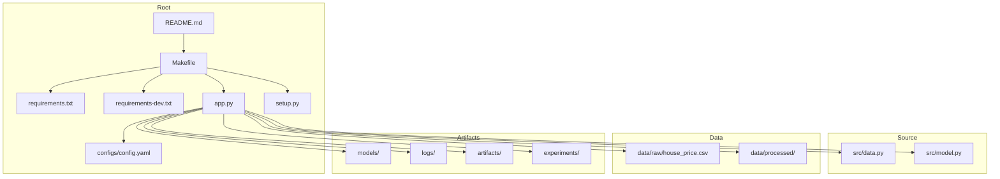
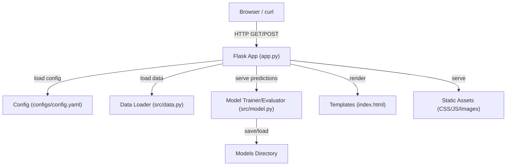
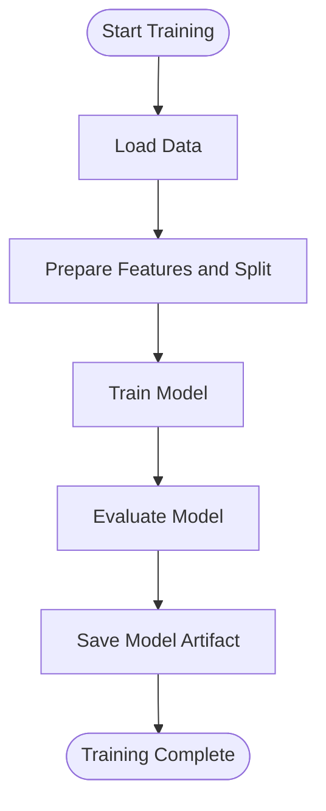
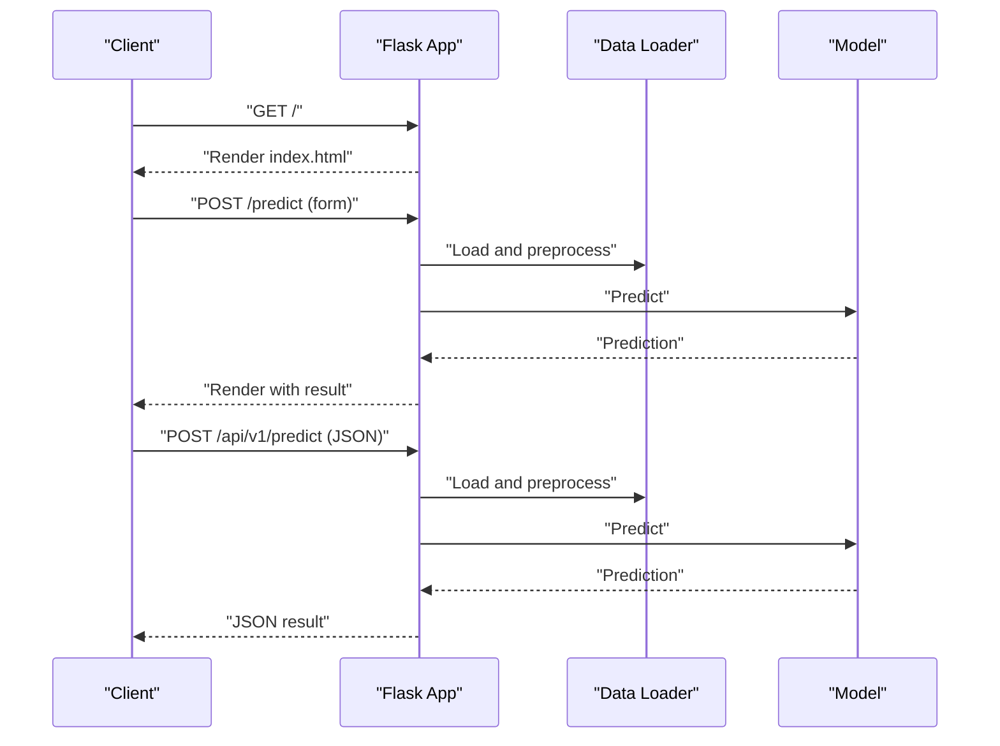

# Getting Started

<cite>
**Referenced Files in This Document**
- [README.md](file://README.md)
- [SETUP.md](file://SETUP.md)
- [QUICKSTART.md](file://QUICKSTART.md)
- [Makefile](file://Makefile)
- [requirements.txt](file://requirements.txt)
- [requirements-dev.txt](file://requirements-dev.txt)
- [app.py](file://app.py)
- [setup.py](file://setup.py)
- [configs/config.yaml](file://configs/config.yaml)
- [src/data.py](file://src/data.py)
- [src/model.py](file://src/model.py)
</cite>

## Table of Contents
1. [Introduction](#introduction)
2. [Project Structure](#project-structure)
3. [Core Components](#core-components)
4. [Architecture Overview](#architecture-overview)
5. [Detailed Component Analysis](#detailed-component-analysis)
6. [Dependency Analysis](#dependency-analysis)
7. [Performance Considerations](#performance-considerations)
8. [Troubleshooting Guide](#troubleshooting-guide)
9. [Conclusion](#conclusion)
10. [Appendices](#appendices)

## Introduction
This guide helps you install, configure, and run the House Price Prediction MLOps project locally and deploy it to production. It covers prerequisites, virtual environment setup, dependency installation via Makefile, project initialization, training a model, running the API locally, and making predictions through both the web interface and the REST API. It also includes troubleshooting tips and verification steps for both development and production environments.

## Project Structure
The project follows a modular MLOps layout with dedicated directories for data, models, configuration, source code, tests, and UI assets. The Makefile centralizes common tasks such as installing dependencies, setting up directories, training the model, running tests, and starting the API.



**Diagram sources**
- [README.md](file://README.md)
- [Makefile](file://Makefile)
- [requirements.txt](file://requirements.txt)
- [requirements-dev.txt](file://requirements-dev.txt)
- [app.py](file://app.py)
- [setup.py](file://setup.py)
- [configs/config.yaml](file://configs/config.yaml)
- [src/data.py](file://src/data.py)
- [src/model.py](file://src/model.py)

**Section sources**
- [README.md](file://README.md)
- [Makefile](file://Makefile)

## Core Components
- Flask web application serving predictions and visualizations
- Data ingestion and preprocessing utilities
- Model training and evaluation utilities
- Configuration management via YAML
- Makefile-driven workflows for installation, setup, training, testing, and API startup

Key capabilities:
- Train a linear regression model or switch to ensemble variants
- Serve predictions via a web form and a JSON REST endpoint
- Visualize data distributions, correlations, and model performance
- Centralized configuration for data paths, model settings, monitoring, API, and logging

**Section sources**
- [app.py](file://app.py)
- [src/data.py](file://src/data.py)
- [src/model.py](file://src/model.py)
- [configs/config.yaml](file://configs/config.yaml)

## Architecture Overview
The system integrates data loading, preprocessing, training, evaluation, and serving into a cohesive pipeline. The Flask app exposes routes for the UI and REST API, loads a pre-trained model, and renders visualizations.



**Diagram sources**
- [app.py](file://app.py)
- [configs/config.yaml](file://configs/config.yaml)
- [src/data.py](file://src/data.py)
- [src/model.py](file://src/model.py)

## Detailed Component Analysis

### Installation and Setup
Follow these steps to prepare your environment and initialize the project.

Prerequisites
- Python 3.10 or higher
- pip
- Git
- Docker (optional, for containerization)

Virtual environment
- Create and activate a virtual environment using your OS-specific commands.

Install dependencies
- Use Makefile targets to install production and development dependencies.
- Alternatively, install requirements directly.

Initialize project structure
- Use Makefile setup or run the setup script to create directories and configuration.

Verification
- Run tests to confirm the environment is ready.

**Section sources**
- [README.md](file://README.md)
- [SETUP.md](file://SETUP.md)
- [Makefile](file://Makefile)
- [requirements.txt](file://requirements.txt)
- [requirements-dev.txt](file://requirements-dev.txt)
- [setup.py](file://setup.py)

### Training a Model
You can train a model using the Makefile or by invoking the training module directly. The training pipeline expects a CSV file with specific feature columns and a target column named Price.

Workflow
- Ensure data is placed under the raw data directory.
- Run the training target to produce a persisted model artifact.
- Confirm the model file exists in the models directory.



**Diagram sources**
- [src/data.py](file://src/data.py)
- [src/model.py](file://src/model.py)

**Section sources**
- [Makefile](file://Makefile)
- [src/data.py](file://src/data.py)
- [src/model.py](file://src/model.py)

### Running the API Locally
Start the Flask API in development mode using the Makefile. The application listens on the configured host and port, with production deployments using the PORT environment variable.

Endpoints
- Web UI: /
- Form-based prediction: POST /predict
- REST prediction: POST /api/v1/predict (JSON payload)
- Health check: GET /health
- Metrics: GET /metrics
- Visualizations: GET /visualize, GET /dashboard



**Diagram sources**
- [app.py](file://app.py)

**Section sources**
- [README.md](file://README.md)
- [Makefile](file://Makefile)
- [app.py](file://app.py)

### Making Predictions
Two ways to make predictions:
- Web form: Submit feature values via the UI.
- REST API: Send a JSON payload to the prediction endpoint.

Expected outcomes
- The UI displays a formatted predicted price.
- The REST API returns a JSON response containing the prediction.

**Section sources**
- [README.md](file://README.md)
- [app.py](file://app.py)

### Configuration
Edit the configuration file to adjust data paths, model settings, training parameters, monitoring thresholds, API host/port, and logging.

Key areas
- Data paths and sizes
- Model type and save location
- Training parameters
- Monitoring thresholds
- API host, port, worker count
- Logging level and file

**Section sources**
- [configs/config.yaml](file://configs/config.yaml)

## Dependency Analysis
The project relies on Flask for the web server, scikit-learn for modeling, NumPy and Pandas for data, Plotly and Matplotlib for visualizations, Prometheus client for metrics, and Gunicorn for production WSGI. Development dependencies include pytest, flake8, mypy, black, and isort for quality and formatting.

```mermaid
graph LR
Flask["Flask"]
Sklearn["scikit-learn"]
Numpy["NumPy"]
Pandas["Pandas"]
Plotly["Plotly"]
Matplotlib["Matplotlib"]
Prometheus["Prometheus Client"]
Gunicorn["Gunicorn"]
Pytest["pytest"]
Flake8["flake8"]
Mypy["mypy"]
Black["black"]
Isort["isort"]
Flask --> Sklearn
Flask --> Pandas
Flask --> Numpy
Flask --> Prometheus
Gunicorn --> Flask
Plotly --> Flask
Matplotlib --> Flask
Pytest -.dev.| --> Flask
Flake8 -.dev.| --> Flask
Mypy -.dev.| --> Flask
Black -.dev.| --> Flask
Isort -.dev.| --> Flask
```

**Diagram sources**
- [requirements.txt](file://requirements.txt)
- [requirements-dev.txt](file://requirements-dev.txt)

**Section sources**
- [requirements.txt](file://requirements.txt)
- [requirements-dev.txt](file://requirements-dev.txt)

## Performance Considerations
- Use production-grade WSGI (Gunicorn) for deployments to improve concurrency and stability.
- Persist and reuse trained models to avoid retraining on every request.
- Monitor model performance and data drift to maintain accuracy over time.
- Optimize data loading and preprocessing to reduce latency.

[No sources needed since this section provides general guidance]

## Troubleshooting Guide
Common issues and resolutions:
- Import errors: Ensure the virtual environment is activated and reinstall dependencies if needed.
- Port conflicts: Change the port in the configuration file and restart the API.
- Model not found: Train a model first using the Makefile or training module.
- Tests failing: Reinstall development dependencies and rerun tests.
- Data file missing: Place the CSV file in the expected raw data path.

Verification steps:
- Confirm the data file exists in the raw directory.
- Verify model artifacts are present after training.
- Check API health endpoint and REST response.
- Review logs in the logs directory for errors.

**Section sources**
- [SETUP.md](file://SETUP.md)
- [QUICKSTART.md](file://QUICKSTART.md)
- [README.md](file://README.md)

## Conclusion
You now have a complete path to install the project, train a model, run the API locally, and make predictions through the UI and REST endpoints. Use the Makefile for streamlined workflows, keep configuration aligned with your environment, and leverage monitoring and logging for operational visibility. For production, deploy using the provided configuration and environment variables.

[No sources needed since this section summarizes without analyzing specific files]

## Appendices

### Quick Start Commands
- Install dependencies: make install
- Initialize project: make setup
- Train model: make train
- Run API: make api
- Health check: curl http://localhost:5000/health
- REST prediction: curl -X POST http://localhost:5000/api/v1/predict -H "Content-Type: application/json" -d '{...}'

**Section sources**
- [QUICKSTART.md](file://QUICKSTART.md)
- [Makefile](file://Makefile)
- [README.md](file://README.md)