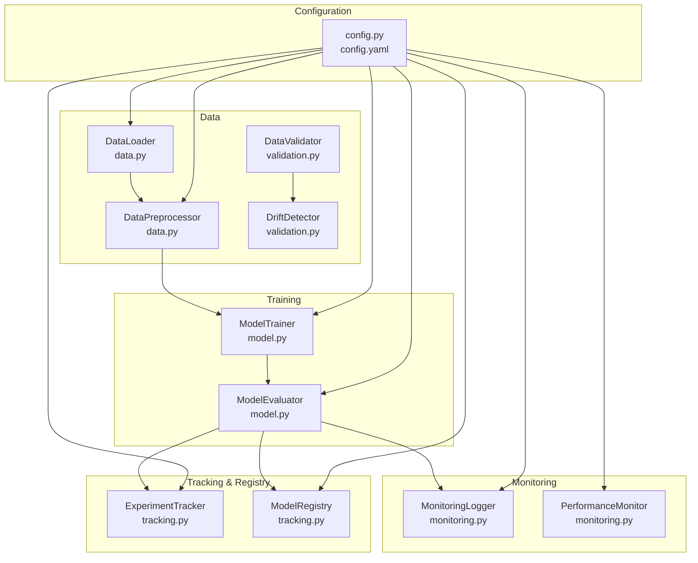
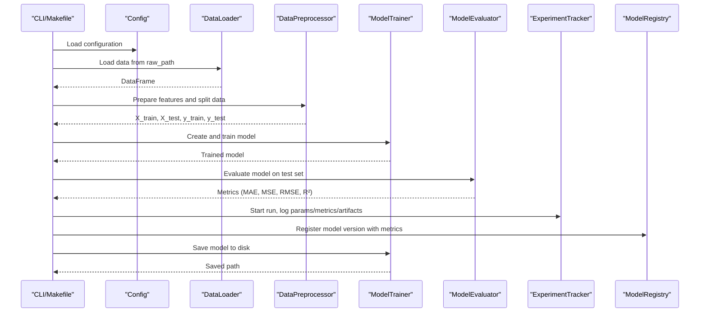
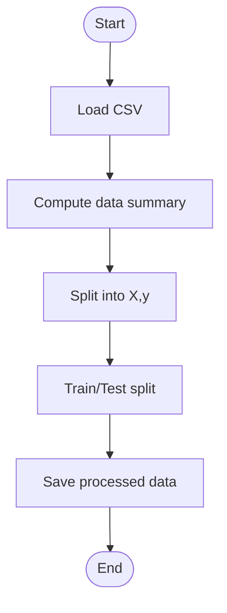
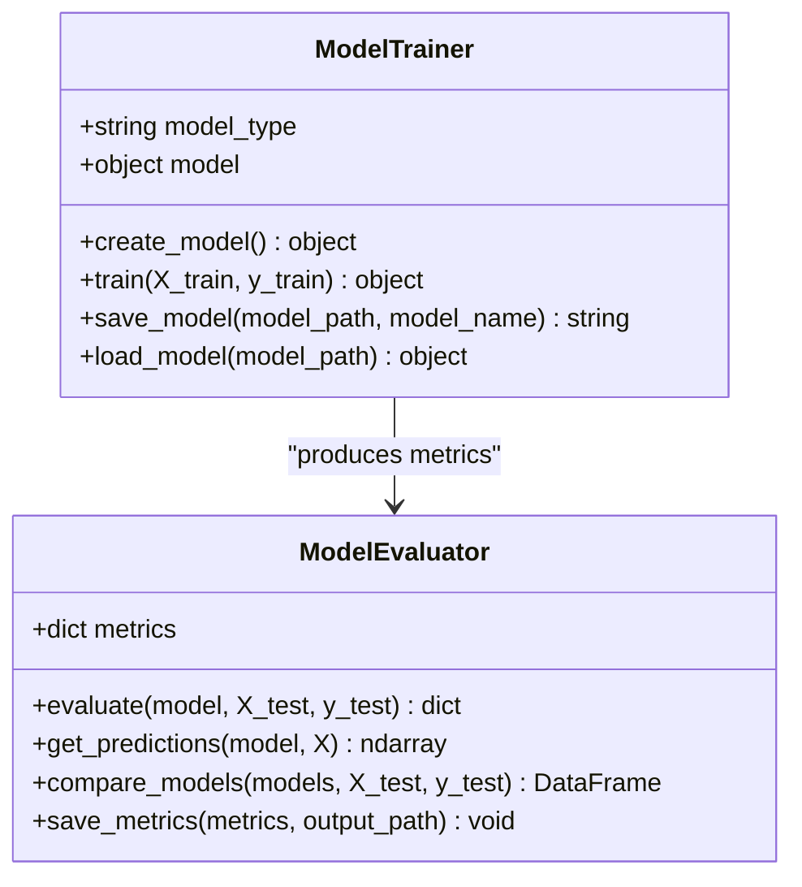
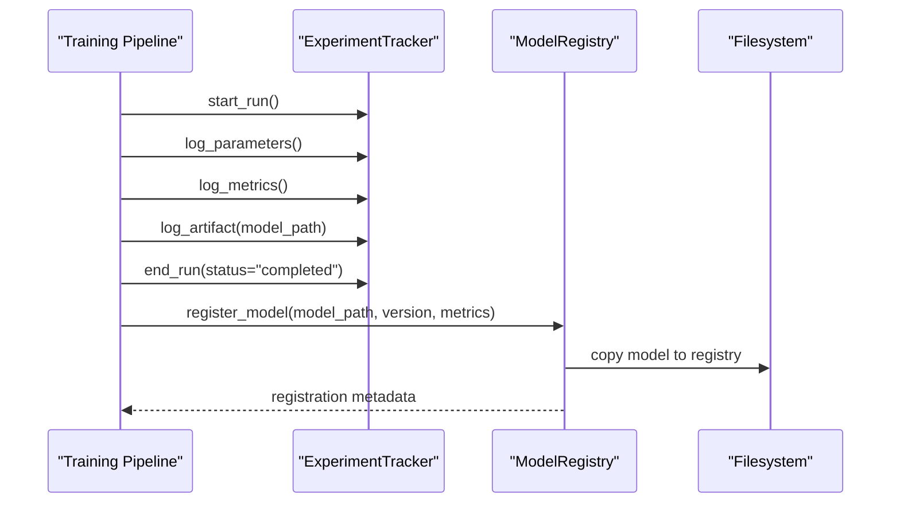
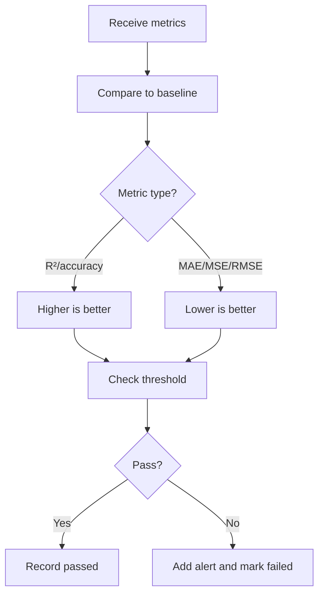
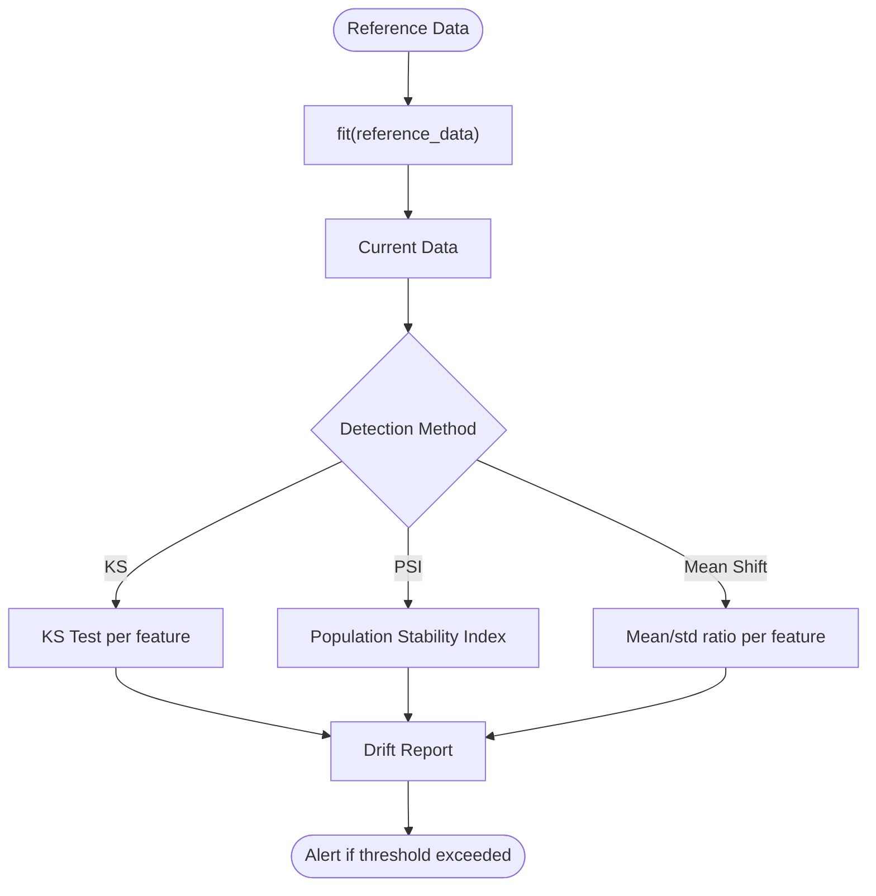
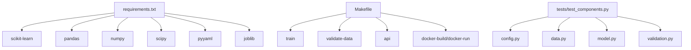

# Automated Training Pipeline

<cite>
**Referenced Files in This Document**
- [config.yaml](file://configs/config.yaml)
- [config.example.yaml](file://configs/config.example.yaml)
- [config.py](file://src/config.py)
- [data.py](file://src/data.py)
- [model.py](file://src/model.py)
- [tracking.py](file://src/tracking.py)
- [monitoring.py](file://src/monitoring.py)
- [validation.py](file://src/validation.py)
- [Makefile](file://Makefile)
- [requirements.txt](file://requirements.txt)
- [README.md](file://README.md)
- [QUICKSTART.md](file://QUICKSTART.md)
- [test_components.py](file://tests/test_components.py)
</cite>

## Table of Contents
1. [Introduction](#introduction)
2. [Project Structure](#project-structure)
3. [Core Components](#core-components)
4. [Architecture Overview](#architecture-overview)
5. [Detailed Component Analysis](#detailed-component-analysis)
6. [Dependency Analysis](#dependency-analysis)
7. [Performance Considerations](#performance-considerations)
8. [Troubleshooting Guide](#troubleshooting-guide)
9. [Conclusion](#conclusion)
10. [Appendices](#appendices)

## Introduction
This document explains the automated model training pipeline for house price prediction. It covers data loading, model training across multiple algorithms, evaluation, persistence, configuration, experiment tracking, model registry, monitoring, and the relationship to deployment validation. Practical examples demonstrate running the pipeline locally, configuring parameters, interpreting results, and handling failures. Guidance is also provided for model versioning, experiment tracking integration, and automated performance monitoring.

## Project Structure
The training pipeline is organized around modular components:
- Configuration management centralizes settings for data, model, training, monitoring, and API.
- Data loading and preprocessing handle ingestion, validation, and train/test splits.
- Model training and evaluation implement multiple algorithms and metrics.
- Experiment tracking and model registry manage versions and artifacts.
- Monitoring logs predictions and performance, and validates against thresholds.
- Makefile provides convenient commands to orchestrate training, validation, and deployment tasks.

**Diagram sources**
- [config.py:10-63](file://src/config.py#L10-L63)
- [config.yaml:1-60](file://configs/config.yaml#L1-L60)
- [data.py:13-109](file://src/data.py#L13-L109)
- [validation.py:14-243](file://src/validation.py#L14-L243)
- [model.py:17-155](file://src/model.py#L17-L155)
- [tracking.py:14-218](file://src/tracking.py#L14-L218)
- [monitoring.py:15-218](file://src/monitoring.py#L15-L218)

**Section sources**
- [README.md:53-98](file://README.md#L53-L98)
- [Makefile:36-42](file://Makefile#L36-L42)

## Core Components
- Configuration management: Loads YAML settings and exposes getters for data paths, model paths, training parameters, and monitoring configuration.
- Data loading and preprocessing: Loads CSV data, computes summaries, separates features/target, splits into train/test sets, and persists processed datasets.
- Model training and evaluation: Creates and trains linear regression, random forest, and gradient boosting models; evaluates via MAE, MSE, RMSE, R²; saves models; compares multiple models.
- Experiment tracking and registry: Starts runs, logs parameters/metrics/artifacts, persists run metadata, selects best run, registers model versions, and maintains a registry with metadata.
- Monitoring and performance validation: Logs predictions and performance metrics, detects data drift, and enforces performance thresholds.

**Section sources**
- [config.py:10-63](file://src/config.py#L10-L63)
- [data.py:13-109](file://src/data.py#L13-L109)
- [model.py:17-155](file://src/model.py#L17-L155)
- [tracking.py:14-218](file://src/tracking.py#L14-L218)
- [monitoring.py:15-218](file://src/monitoring.py#L15-L218)
- [validation.py:14-243](file://src/validation.py#L14-L243)

## Architecture Overview
The training pipeline orchestrates data ingestion, preprocessing, model training, evaluation, persistence, and experiment tracking. Monitoring integrates post-training to validate ongoing performance and drift.

**Diagram sources**
- [Makefile:36-42](file://Makefile#L36-L42)
- [config.py:17-58](file://src/config.py#L17-L58)
- [data.py:20-88](file://src/data.py#L20-L88)
- [model.py:25-87](file://src/model.py#L25-L87)
- [tracking.py:25-82](file://src/tracking.py#L25-L82)
- [monitoring.py:62-80](file://src/monitoring.py#L62-L80)

## Detailed Component Analysis

### Configuration Management
- Centralized YAML configuration supports nested keys and defaults.
- Provides project name, model save path, data paths, training parameters, and monitoring settings.
- Training parameters include max_iter, tolerance, early_stopping, and patience.

**Section sources**
- [config.py:17-58](file://src/config.py#L17-L58)
- [config.yaml:28-34](file://configs/config.yaml#L28-L34)
- [config.example.yaml:26-31](file://configs/config.example.yaml#L26-L31)

### Data Loading and Preprocessing
- DataLoader reads CSV, prints shape, and raises explicit errors on missing files.
- DataPreprocessor separates features and target, splits into train/test sets using configurable test_size and random_state, and persists processed datasets.

**Diagram sources**
- [data.py:20-88](file://src/data.py#L20-L88)

**Section sources**
- [data.py:20-88](file://src/data.py#L20-L88)

### Model Training and Evaluation
- ModelTrainer supports linear regression, random forest, and gradient boosting. Hyperparameters are read from configuration where applicable.
- Training prints lifecycle events and persists models using joblib.
- ModelEvaluator computes MAE, MSE, RMSE, R², prints metrics, and supports multi-model comparison and metric persistence.

**Diagram sources**
- [model.py:17-155](file://src/model.py#L17-L155)

**Section sources**
- [model.py:25-87](file://src/model.py#L25-L87)
- [model.py:96-155](file://src/model.py#L96-L155)

### Experiment Tracking and Model Registry
- ExperimentTracker starts runs, logs parameters/metrics/artifacts, persists run metadata, and retrieves best runs by metric.
- ModelRegistry registers model versions with metrics and metadata, copies artifacts, and lists versions.

**Diagram sources**
- [tracking.py:25-82](file://src/tracking.py#L25-L82)
- [tracking.py:150-183](file://src/tracking.py#L150-L183)

**Section sources**
- [tracking.py:25-132](file://src/tracking.py#L25-L132)
- [tracking.py:150-218](file://src/tracking.py#L150-L218)

### Monitoring and Performance Validation
- MonitoringLogger logs predictions and performance metrics to files and console, and supports drift alerts and performance degradation alerts.
- PerformanceMonitor compares current metrics to baseline using configurable thresholds and flags violations.

**Diagram sources**
- [monitoring.py:162-201](file://src/monitoring.py#L162-L201)

**Section sources**
- [monitoring.py:62-121](file://src/monitoring.py#L62-L121)
- [monitoring.py:162-201](file://src/monitoring.py#L162-L201)

### Data Validation and Drift Detection
- DataValidator defines schema expectations, validates dtypes/columns, computes quality score, and prints reports.
- DriftDetector computes reference statistics and detects drift using KS test, PSI, or mean-shift methods.

**Diagram sources**
- [validation.py:132-199](file://src/validation.py#L132-L199)

**Section sources**
- [validation.py:28-99](file://src/validation.py#L28-L99)
- [validation.py:132-243](file://src/validation.py#L132-L243)

## Dependency Analysis
- Core dependencies include scikit-learn, pandas, numpy, scipy, pyyaml, joblib, and optional experiment tracking integrations (MLflow/W&B commented in requirements).
- Makefile commands orchestrate training, validation, API, Docker, and cleanup.
- Tests validate configuration, data loading/preprocessing, model training/prediction, evaluation metrics, and drift detection.

**Diagram sources**
- [requirements.txt:1-24](file://requirements.txt#L1-L24)
- [Makefile:36-120](file://Makefile#L36-L120)
- [test_components.py:12-209](file://tests/test_components.py#L12-L209)

**Section sources**
- [requirements.txt:1-24](file://requirements.txt#L1-L24)
- [Makefile:36-120](file://Makefile#L36-L120)
- [test_components.py:12-209](file://tests/test_components.py#L12-L209)

## Performance Considerations
- Use joblib for model persistence to efficiently handle large numpy arrays.
- Persist processed datasets to avoid recomputation and ensure reproducibility.
- Prefer standardized metrics (MAE/MSE/RMSE/R²) for consistent evaluation across algorithms.
- Monitor performance thresholds and drift to proactively detect regressions and data shifts.

[No sources needed since this section provides general guidance]

## Troubleshooting Guide
Common issues and resolutions:
- Data file not found: Ensure the raw CSV path matches configuration and exists.
- Missing dependencies: Install via Makefile or requirements.
- Port conflicts: Adjust API port in configuration.
- Model not found: Train a new model or load an existing one.
- Tests failing: Reinstall dev dependencies and rerun tests.

**Section sources**
- [data.py:27-30](file://src/data.py#L27-L30)
- [config.yaml:48-54](file://configs/config.yaml#L48-L54)
- [QUICKSTART.md:89-108](file://QUICKSTART.md#L89-L108)
- [Makefile:24-28](file://Makefile#L24-L28)
- [test_components.py:21-31](file://tests/test_components.py#L21-L31)

## Conclusion
The automated training pipeline provides a robust, configurable, and testable workflow for building, evaluating, and persisting machine learning models. It integrates experiment tracking, model registry, monitoring, and validation to support continuous improvement and safe deployment. By leveraging configuration-driven settings and Makefile commands, teams can reproduce training runs, compare models, and maintain model versions with confidence.

[No sources needed since this section summarizes without analyzing specific files]

## Appendices

### Practical Examples

- Running the training pipeline locally:
  - Use Makefile targets to install dependencies, setup directories, and train models.
  - Example commands: make install, make setup, make train, make train-rf.

- Configuring training parameters:
  - Edit configs/config.yaml to adjust data paths, model type, training hyperparameters, monitoring thresholds, and API settings.

- Interpreting training results:
  - Review printed metrics (MAE, MSE, RMSE, R²) and saved metrics files.
  - Use ExperimentTracker to compare runs and select the best model by metric.

- Handling training failures:
  - Validate data quality and schema using DataValidator and DriftDetector.
  - Check configuration correctness and reinstall dependencies if needed.

- Model versioning and registry:
  - Register models via ModelRegistry with version, metrics, and description.
  - Retrieve latest model or specific versions for deployment.

- Experiment tracking integration:
  - Start runs, log parameters/metrics/artifacts, and persist run metadata.
  - Optionally integrate MLflow or W&B by uncommenting dependencies in requirements.

- Automated performance monitoring:
  - Log predictions and performance metrics during inference.
  - Enforce performance thresholds and detect data drift to trigger alerts.

**Section sources**
- [Makefile:36-120](file://Makefile#L36-L120)
- [config.yaml:9-59](file://configs/config.yaml#L9-L59)
- [tracking.py:25-132](file://src/tracking.py#L25-L132)
- [monitoring.py:62-121](file://src/monitoring.py#L62-L121)
- [validation.py:28-99](file://src/validation.py#L28-L99)
- [README.md:158-181](file://README.md#L158-L181)