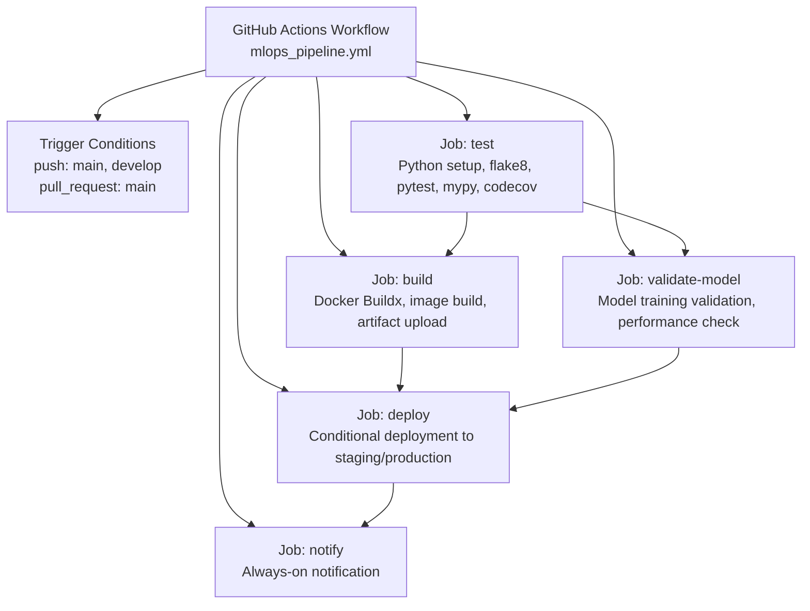
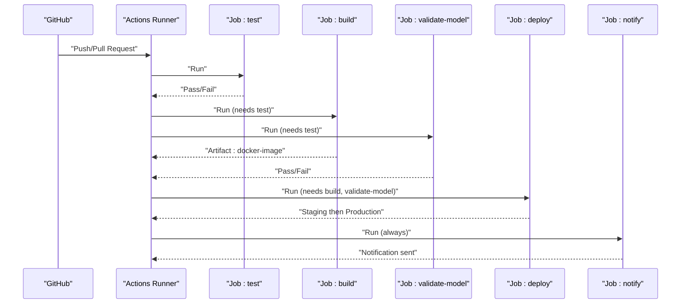
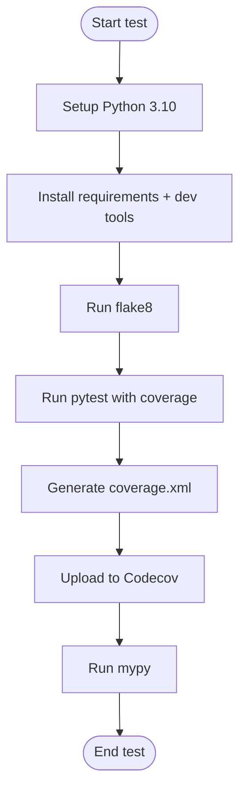
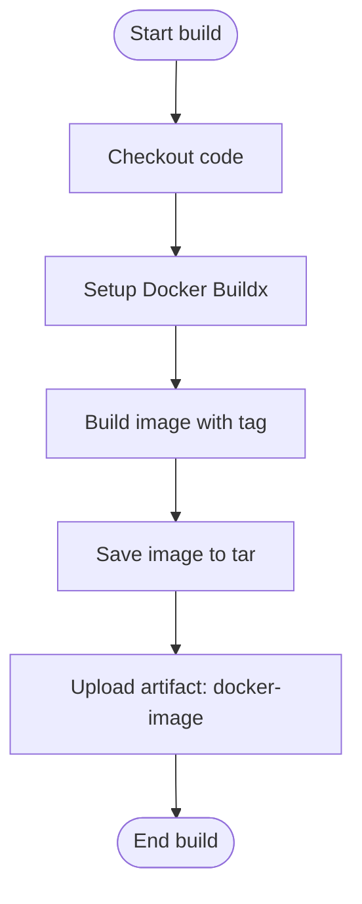
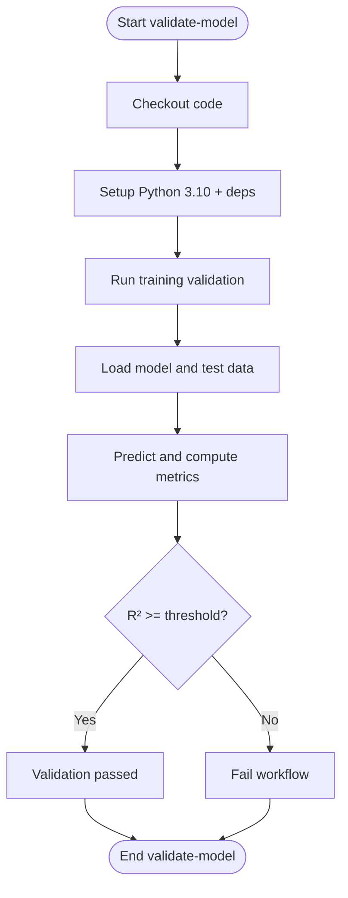
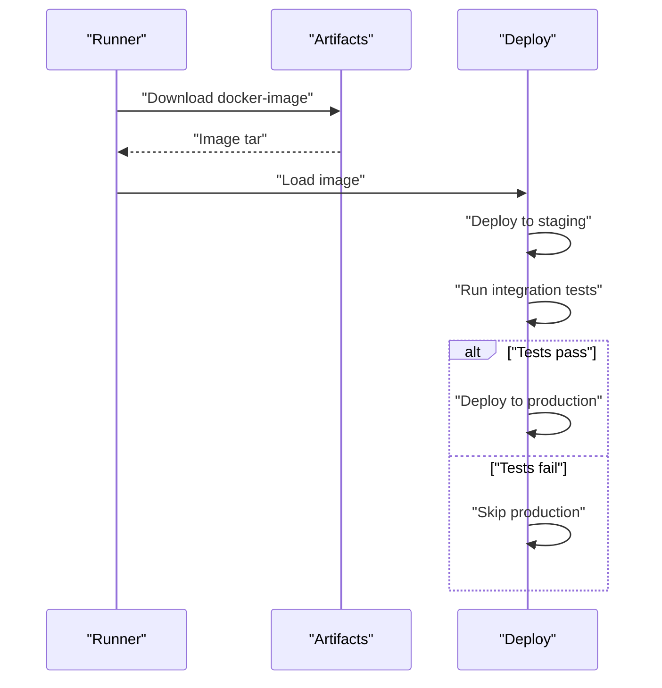
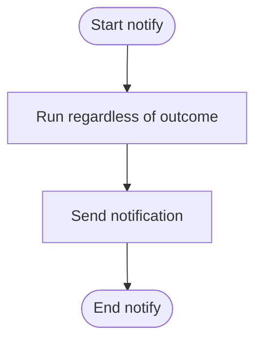
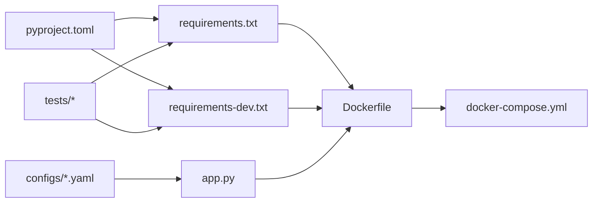

# CI/CD Pipeline Configuration

<cite>
**Referenced Files in This Document**
- [mlops_pipeline.yml](file://House_Price_Prediction-main/housing1/.github/workflows/mlops_pipeline.yml)
- [Dockerfile](file://House_Price_Prediction-main/housing1/Dockerfile)
- [pyproject.toml](file://House_Price_Prediction-main/housing1/pyproject.toml)
- [requirements.txt](file://House_Price_Prediction-main/housing1/requirements.txt)
- [requirements-dev.txt](file://House_Price_Prediction-main/housing1/requirements-dev.txt)
- [app.py](file://House_Price_Prediction-main/housing1/app.py)
- [docker-compose.yml](file://House_Price_Prediction-main/housing1/docker-compose.yml)
- [deploy.sh](file://House_Price_Prediction-main/housing1/deploy.sh)
- [deploy.bat](file://House_Price_Prediction-main/housing1/deploy.bat)
- [conftest.py](file://House_Price_Prediction-main/housing1/tests/conftest.py)
- [test_components.py](file://House_Price_Prediction-main/housing1/tests/test_components.py)
- [config.yaml](file://House_Price_Prediction-main/housing1/configs/config.yaml)
- [config.example.yaml](file://House_Price_Prediction-main/housing1/configs/config.example.yaml)
</cite>

## Table of Contents
1. [Introduction](#introduction)
2. [Project Structure](#project-structure)
3. [Core Components](#core-components)
4. [Architecture Overview](#architecture-overview)
5. [Detailed Component Analysis](#detailed-component-analysis)
6. [Dependency Analysis](#dependency-analysis)
7. [Performance Considerations](#performance-considerations)
8. [Troubleshooting Guide](#troubleshooting-guide)
9. [Conclusion](#conclusion)
10. [Appendices](#appendices)

## Introduction
This document explains the CI/CD pipeline implemented via GitHub Actions for the House Price Prediction MLOps project. It covers triggers, jobs, dependencies, artifacts, and deployment logic, and provides guidance for customization, adding new stages, and troubleshooting. The pipeline includes linting, unit testing with coverage, type checking, Docker image building, automated model training and performance validation, staged deployments, and notifications.

## Project Structure
The pipeline is defined in a single workflow file and integrates with project configuration, dependencies, and deployment scripts. Key elements:
- Workflow definition and jobs in the GitHub Actions workflow file
- Python project configuration and tooling settings
- Containerization via Dockerfile and docker-compose for local/CI runtime
- Local deployment scripts for manual verification
- Test configuration and unit tests

**Diagram sources**
- [mlops_pipeline.yml:1-180](file://House_Price_Prediction-main/housing1/.github/workflows/mlops_pipeline.yml#L1-L180)

**Section sources**
- [mlops_pipeline.yml:1-180](file://House_Price_Prediction-main/housing1/.github/workflows/mlops_pipeline.yml#L1-L180)

## Core Components
- Trigger conditions: The workflow runs on pushes to main and develop, and on pull requests targeting main.
- Jobs and stages:
  - test: Python setup, flake8 linting, pytest unit tests with coverage, mypy type checking, and Codecov upload.
  - build: Docker Buildx setup, image build tagged with commit SHA, saved as tar, uploaded as artifact.
  - validate-model: Python setup, installs dependencies, runs training validation, evaluates model performance against a threshold.
  - deploy: Conditional deployment to staging and production when the ref is main; includes optional integration tests.
  - notify: Always runs after deployment to send notifications.

Key behaviors:
- Job dependencies: build and validate-model depend on test; deploy depends on both build and validate-model; notify depends on deploy.
- Artifacts: Docker image tar is uploaded from build and downloaded during deploy.
- Conditional execution: deploy runs only on main; notify runs regardless of outcome.

**Section sources**
- [mlops_pipeline.yml:3-180](file://House_Price_Prediction-main/housing1/.github/workflows/mlops_pipeline.yml#L3-L180)

## Architecture Overview
The pipeline orchestrates a continuous delivery flow from code changes to containerized deployment and notifications.

**Diagram sources**
- [mlops_pipeline.yml:9-180](file://House_Price_Prediction-main/housing1/.github/workflows/mlops_pipeline.yml#L9-L180)

## Detailed Component Analysis

### Trigger Conditions
- Push events:
  - Branches: main, develop
- Pull Request events:
  - Branches: main
- Implication: PRs target main; builds run on main and develop; test coverage and type checks run on all changes.

**Section sources**
- [mlops_pipeline.yml:3-7](file://House_Price_Prediction-main/housing1/.github/workflows/mlops_pipeline.yml#L3-L7)

### Test Stage
- Python setup: Ubuntu runner, Python 3.10.
- Dependencies: installs project requirements and dev tools (pytest, pytest-cov, flake8, mypy).
- Linting: flake8 applied to src/, pipelines/, and api.py with a line length limit.
- Unit testing: pytest runs tests/ with coverage enabled; coverage XML is generated.
- Coverage reporting: uploads coverage.xml to Codecov with flags unittests.
- Type checking: mypy runs with ignore-missing-imports.

**Diagram sources**
- [mlops_pipeline.yml:10-46](file://House_Price_Prediction-main/housing1/.github/workflows/mlops_pipeline.yml#L10-L46)

**Section sources**
- [mlops_pipeline.yml:10-46](file://House_Price_Prediction-main/housing1/.github/workflows/mlops_pipeline.yml#L10-L46)
- [pyproject.toml:28-57](file://House_Price_Prediction-main/housing1/pyproject.toml#L28-L57)
- [requirements.txt:1-24](file://House_Price_Prediction-main/housing1/requirements.txt#L1-L24)
- [requirements-dev.txt:1-17](file://House_Price_Prediction-main/housing1/requirements-dev.txt#L1-L17)

### Build Stage
- Depends on: test
- Docker Buildx: sets up build infrastructure.
- Image build: builds a Docker image tagged with the commit SHA.
- Artifact: saves the image as a tar file and uploads as docker-image artifact.

**Diagram sources**
- [mlops_pipeline.yml:48-72](file://House_Price_Prediction-main/housing1/.github/workflows/mlops_pipeline.yml#L48-L72)
- [Dockerfile:1-39](file://House_Price_Prediction-main/housing1/Dockerfile#L1-L39)

**Section sources**
- [mlops_pipeline.yml:48-72](file://House_Price_Prediction-main/housing1/.github/workflows/mlops_pipeline.yml#L48-L72)
- [Dockerfile:1-39](file://House_Price_Prediction-main/housing1/Dockerfile#L1-L39)

### Validate-Model Stage
- Depends on: test
- Python setup and dependencies installation.
- Training validation: executes training logic (placeholder) to validate training pipeline.
- Performance check: loads a trained model and test data, computes R², and enforces a minimum threshold; fails if below threshold.

**Diagram sources**
- [mlops_pipeline.yml:73-126](file://House_Price_Prediction-main/housing1/.github/workflows/mlops_pipeline.yml#L73-L126)

**Section sources**
- [mlops_pipeline.yml:73-126](file://House_Price_Prediction-main/housing1/.github/workflows/mlops_pipeline.yml#L73-L126)

### Deploy Stage
- Depends on: build, validate-model
- Conditional: runs only when the ref is main.
- Artifact download: retrieves the docker-image artifact.
- Load image: restores the tar to a Docker image.
- Staging: placeholder for staging deployment steps.
- Integration tests: placeholder for post-deployment integration checks.
- Production: conditional deployment to production if integration tests pass.

**Diagram sources**
- [mlops_pipeline.yml:127-167](file://House_Price_Prediction-main/housing1/.github/workflows/mlops_pipeline.yml#L127-L167)

**Section sources**
- [mlops_pipeline.yml:127-167](file://House_Price_Prediction-main/housing1/.github/workflows/mlops_pipeline.yml#L127-L167)

### Notify Stage
- Depends on: deploy
- Always runs: uses always() to ensure notifications are sent regardless of previous job outcomes.
- Placeholder: includes commented examples for integrating with external services.

**Diagram sources**
- [mlops_pipeline.yml:168-180](file://House_Price_Prediction-main/housing1/.github/workflows/mlops_pipeline.yml#L168-L180)

**Section sources**
- [mlops_pipeline.yml:168-180](file://House_Price_Prediction-main/housing1/.github/workflows/mlops_pipeline.yml#L168-L180)

### Environment Variables and Configuration
- Dockerfile defines environment variables for Python behavior and Flask app binding.
- docker-compose sets production environment and binds volumes for persistent data and logs.
- Flask app reads PORT from environment and defaults to 5000.
- Configuration files define project, data, model, training, monitoring, API, and logging settings.

**Section sources**
- [Dockerfile:6-10](file://House_Price_Prediction-main/housing1/Dockerfile#L6-L10)
- [docker-compose.yml:8-16](file://House_Price_Prediction-main/housing1/docker-compose.yml#L8-L16)
- [app.py:106-110](file://House_Price_Prediction-main/housing1/app.py#L106-L110)
- [config.yaml:9-60](file://House_Price_Prediction-main/housing1/configs/config.yaml#L9-L60)
- [config.example.yaml:9-53](file://House_Price_Prediction-main/housing1/configs/config.example.yaml#L9-L53)

## Dependency Analysis
- Tooling and configuration:
  - pyproject.toml centralizes pytest, mypy, coverage, and formatting configurations.
  - requirements.txt enumerates runtime dependencies; requirements-dev.txt enumerates development/testing/type-checking dependencies.
- Runtime and packaging:
  - Dockerfile defines the container image, environment variables, and startup command.
  - docker-compose defines service configuration and health checks for local/CI usage.
- Tests:
  - conftest.py configures pytest markers and path adjustments.
  - test_components.py validates core components (config, data, model, validation).

**Diagram sources**
- [pyproject.toml:1-57](file://House_Price_Prediction-main/housing1/pyproject.toml#L1-L57)
- [requirements.txt:1-24](file://House_Price_Prediction-main/housing1/requirements.txt#L1-L24)
- [requirements-dev.txt:1-17](file://House_Price_Prediction-main/housing1/requirements-dev.txt#L1-L17)
- [Dockerfile:1-39](file://House_Price_Prediction-main/housing1/Dockerfile#L1-L39)
- [docker-compose.yml:1-52](file://House_Price_Prediction-main/housing1/docker-compose.yml#L1-L52)
- [app.py:1-113](file://House_Price_Prediction-main/housing1/app.py#L1-L113)
- [config.yaml:1-60](file://House_Price_Prediction-main/housing1/configs/config.yaml#L1-L60)
- [conftest.py:1-20](file://House_Price_Prediction-main/housing1/tests/conftest.py#L1-L20)
- [test_components.py:1-209](file://House_Price_Prediction-main/housing1/tests/test_components.py#L1-L209)

**Section sources**
- [pyproject.toml:1-57](file://House_Price_Prediction-main/housing1/pyproject.toml#L1-L57)
- [requirements.txt:1-24](file://House_Price_Prediction-main/housing1/requirements.txt#L1-L24)
- [requirements-dev.txt:1-17](file://House_Price_Prediction-main/housing1/requirements-dev.txt#L1-L17)
- [Dockerfile:1-39](file://House_Price_Prediction-main/housing1/Dockerfile#L1-L39)
- [docker-compose.yml:1-52](file://House_Price_Prediction-main/housing1/docker-compose.yml#L1-L52)
- [app.py:1-113](file://House_Price_Prediction-main/housing1/app.py#L1-L113)
- [config.yaml:1-60](file://House_Price_Prediction-main/housing1/configs/config.yaml#L1-L60)
- [conftest.py:1-20](file://House_Price_Prediction-main/housing1/tests/conftest.py#L1-L20)
- [test_components.py:1-209](file://House_Price_Prediction-main/housing1/tests/test_components.py#L1-L209)

## Performance Considerations
- Parallelism: pytest-xdist is included in development dependencies; consider enabling parallel execution in CI for faster test runs.
- Caching: Docker Buildx and pip caches can improve build times; ensure cache keys are stable across commits.
- Coverage scope: coverage configuration excludes tests and __init__.py; adjust to match project structure.
- Type checking: mypy ignore-missing-imports reduces strictness; enable stricter settings in CI for improved reliability.

[No sources needed since this section provides general guidance]

## Troubleshooting Guide
Common issues and resolutions:
- Lint failures:
  - Symptom: flake8 step fails.
  - Action: Review reported violations and adjust code or flake8 configuration.
- Test failures:
  - Symptom: pytest step fails or coverage below threshold.
  - Action: Inspect failing tests, fix logic, or adjust thresholds; verify test data availability.
- Type checking errors:
  - Symptom: mypy step fails.
  - Action: Add type hints or adjust ignore-missing-imports setting.
- Docker build failures:
  - Symptom: build step fails.
  - Action: Verify Dockerfile, dependencies, and build context; confirm Buildx is set up.
- Model validation failures:
  - Symptom: validate-model step fails due to low R² or missing data.
  - Action: Ensure test data exists and meets expectations; adjust threshold if needed.
- Deployment failures:
  - Symptom: deploy step does not reach production.
  - Action: Confirm artifact download succeeded; verify staging deployment; check integration tests.
- Notifications not sent:
  - Symptom: notify step does not run.
  - Action: Confirm always() condition and external integration logic.

**Section sources**
- [mlops_pipeline.yml:27-46](file://House_Price_Prediction-main/housing1/.github/workflows/mlops_pipeline.yml#L27-L46)
- [mlops_pipeline.yml:90-126](file://House_Price_Prediction-main/housing1/.github/workflows/mlops_pipeline.yml#L90-L126)
- [mlops_pipeline.yml:127-167](file://House_Price_Prediction-main/housing1/.github/workflows/mlops_pipeline.yml#L127-L167)
- [mlops_pipeline.yml:168-180](file://House_Price_Prediction-main/housing1/.github/workflows/mlops_pipeline.yml#L168-L180)

## Conclusion
The CI/CD pipeline establishes a robust foundation for quality assurance, reproducible builds, and safe deployments. It integrates linting, testing, type checking, containerization, model validation, staged deployments, and notifications. By leveraging job dependencies, artifacts, and conditional execution, it ensures reliable delivery while remaining extensible for future enhancements.

[No sources needed since this section summarizes without analyzing specific files]

## Appendices

### Practical Examples and Customization
- Customize linting:
  - Adjust flake8 arguments or configuration in the test stage.
- Add new stages:
  - Define a new job with appropriate needs and insert it into the workflow.
- Integrate external services:
  - Replace placeholders in deploy and notify stages with real deployment and notification commands.
- Manage secrets:
  - Store sensitive values as GitHub Secrets and reference them in the workflow.

**Section sources**
- [mlops_pipeline.yml:10-180](file://House_Price_Prediction-main/housing1/.github/workflows/mlops_pipeline.yml#L10-L180)

### Security Considerations
- Least privilege: Grant minimal permissions to workflow runners and external integrations.
- Secrets management: Avoid hardcoding credentials; use encrypted secrets and environment variables.
- Artifact retention: Limit artifact retention policies to reduce exposure.
- Container hardening: Pin base images, scan images, and restrict capabilities in containers.

[No sources needed since this section provides general guidance]

### Environment Variable Management
- Dockerfile: Sets Python and Flask environment variables.
- docker-compose: Defines production environment and mounts volumes for persistent storage.
- Flask app: Reads PORT from environment with a fallback.

**Section sources**
- [Dockerfile:6-10](file://House_Price_Prediction-main/housing1/Dockerfile#L6-L10)
- [docker-compose.yml:8-16](file://House_Price_Prediction-main/housing1/docker-compose.yml#L8-L16)
- [app.py:106-110](file://House_Price_Prediction-main/housing1/app.py#L106-L110)

### Integration with External Services
- Codecov: Coverage reports are uploaded from the test stage.
- Deployment hooks: Replace placeholders in deploy stage with commands for your platform (e.g., Kubernetes, cloud provider CLI).
- Notifications: Replace placeholder in notify stage with your preferred integration (e.g., Slack, email).

**Section sources**
- [mlops_pipeline.yml:37-41](file://House_Price_Prediction-main/housing1/.github/workflows/mlops_pipeline.yml#L37-L41)
- [mlops_pipeline.yml:145-166](file://House_Price_Prediction-main/housing1/.github/workflows/mlops_pipeline.yml#L145-L166)
- [mlops_pipeline.yml:174-178](file://House_Price_Prediction-main/housing1/.github/workflows/mlops_pipeline.yml#L174-L178)