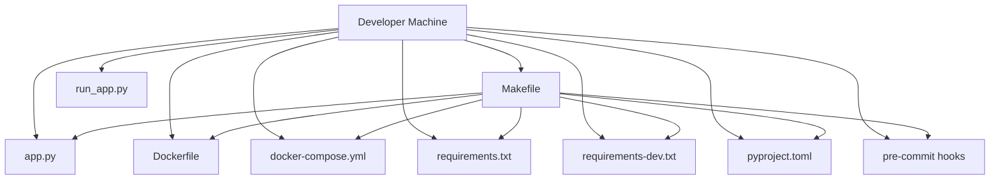
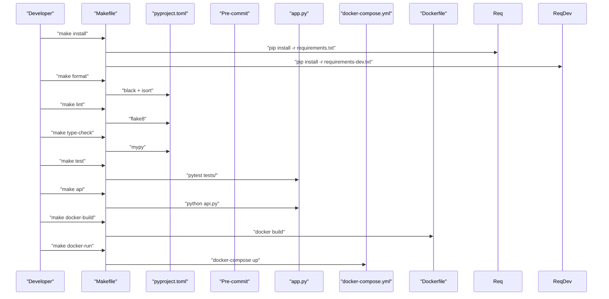
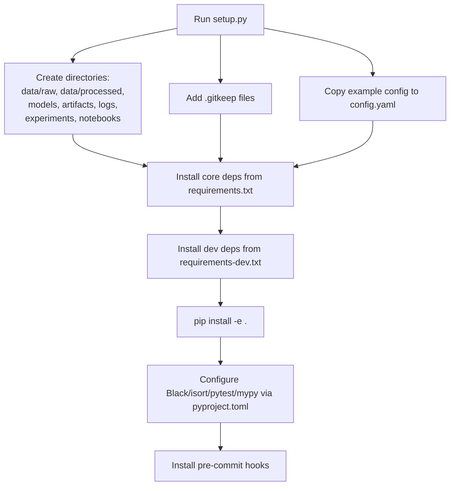
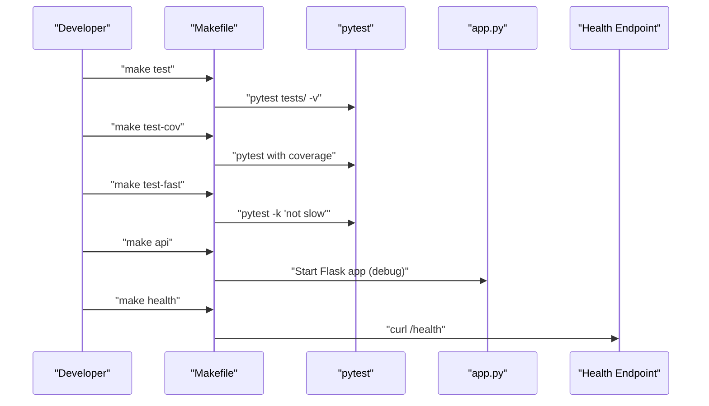
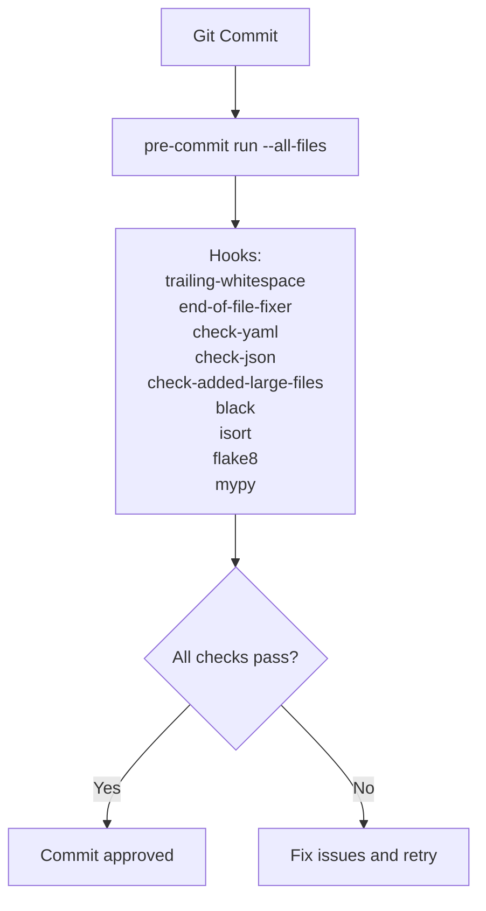
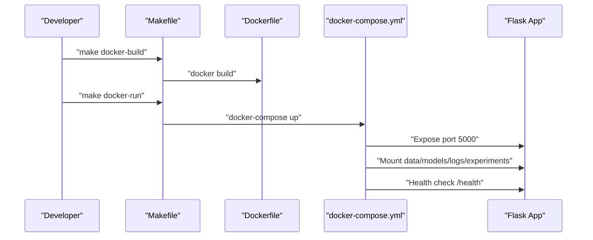
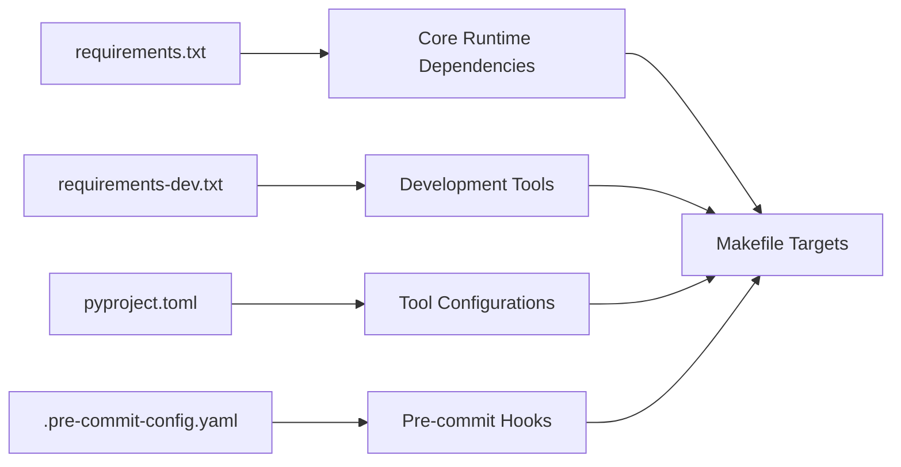

# Development Workflows and Commands

<cite>
**Referenced Files in This Document**
- [Makefile](file://House_Price_Prediction-main/housing1/Makefile)
- [setup.py](file://House_Price_Prediction-main/housing1/setup.py)
- [pyproject.toml](file://House_Price_Prediction-main/housing1/pyproject.toml)
- [requirements.txt](file://House_Price_Prediction-main/housing1/requirements.txt)
- [requirements-dev.txt](file://House_Price_Prediction-main/housing1/requirements-dev.txt)
- [.pre-commit-config.yaml](file://House_Price_Prediction-main/housing1/.pre-commit-config.yaml)
- [Dockerfile](file://House_Price_Prediction-main/housing1/Dockerfile)
- [docker-compose.yml](file://House_Price_Prediction-main/housing1/docker-compose.yml)
- [app.py](file://House_Price_Prediction-main/housing1/app.py)
- [run_app.py](file://House_Price_Prediction-main/housing1/run_app.py)
- [tests/conftest.py](file://House_Price_Prediction-main/housing1/tests/conftest.py)
</cite>

## Table of Contents
1. [Introduction](#introduction)
2. [Project Structure](#project-structure)
3. [Core Components](#core-components)
4. [Architecture Overview](#architecture-overview)
5. [Detailed Component Analysis](#detailed-component-analysis)
6. [Dependency Analysis](#dependency-analysis)
7. [Performance Considerations](#performance-considerations)
8. [Troubleshooting Guide](#troubleshooting-guide)
9. [Conclusion](#conclusion)
10. [Appendices](#appendices)

## Introduction
This document describes the development workflows and commands for the MLOps House Price Prediction project. It covers Makefile targets for setup, testing, linting, formatting, cleaning, building, and deployment; development environment setup and dependency management; local testing and debugging; pre-commit hooks integration; and practical examples for common development tasks. It also documents the setup.py configuration, package management, and development dependencies.

## Project Structure
The project follows a feature-based layout with dedicated directories for data, models, artifacts, configurations, pipelines, monitoring, and source code. The Makefile orchestrates most developer tasks, while Docker and docker-compose support local and production deployments. Pre-commit enforces code quality automatically.

**Diagram sources**
- [Makefile](file://House_Price_Prediction-main/housing1/Makefile)
- [pyproject.toml](file://House_Price_Prediction-main/housing1/pyproject.toml)
- [requirements.txt](file://House_Price_Prediction-main/housing1/requirements.txt)
- [requirements-dev.txt](file://House_Price_Prediction-main/housing1/requirements-dev.txt)
- [.pre-commit-config.yaml](file://House_Price_Prediction-main/housing1/.pre-commit-config.yaml)
- [Dockerfile](file://House_Price_Prediction-main/housing1/Dockerfile)
- [docker-compose.yml](file://House_Price_Prediction-main/housing1/docker-compose.yml)
- [app.py](file://House_Price_Prediction-main/housing1/app.py)
- [run_app.py](file://House_Price_Prediction-main/housing1/run_app.py)

**Section sources**
- [Makefile](file://House_Price_Prediction-main/housing1/Makefile)
- [Dockerfile](file://House_Price_Prediction-main/housing1/Dockerfile)
- [docker-compose.yml](file://House_Price_Prediction-main/housing1/docker-compose.yml)

## Core Components
- Makefile: Centralized developer workflow with targets for installation, training, testing, linting, formatting, data validation, API startup, Docker operations, cleanup, CI/CD checks, and setup.
- setup.py: Project initialization script that creates directories, adds placeholder files, and copies example configuration.
- pyproject.toml: Tool configuration for Black, isort, pytest, mypy, and coverage.
- Requirements: requirements.txt for runtime/core dependencies; requirements-dev.txt for development/testing/lint/type-check/format tools.
- Pre-commit: Automated quality checks on commit.
- Docker: Containerization for local and production runs.
- Tests: Pytest configuration and markers for selective test execution.

**Section sources**
- [Makefile](file://House_Price_Prediction-main/housing1/Makefile)
- [setup.py](file://House_Price_Prediction-main/housing1/setup.py)
- [pyproject.toml](file://House_Price_Prediction-main/housing1/pyproject.toml)
- [requirements.txt](file://House_Price_Prediction-main/housing1/requirements.txt)
- [requirements-dev.txt](file://House_Price_Prediction-main/housing1/requirements-dev.txt)
- [.pre-commit-config.yaml](file://House_Price_Prediction-main/housing1/.pre-commit-config.yaml)
- [Dockerfile](file://House_Price_Prediction-main/housing1/Dockerfile)
- [docker-compose.yml](file://House_Price_Prediction-main/housing1/docker-compose.yml)
- [tests/conftest.py](file://House_Price_Prediction-main/housing1/tests/conftest.py)

## Architecture Overview
The development workflow integrates local scripts, Makefile orchestration, containerization, and automated quality gates.

**Diagram sources**
- [Makefile](file://House_Price_Prediction-main/housing1/Makefile)
- [pyproject.toml](file://House_Price_Prediction-main/housing1/pyproject.toml)
- [requirements.txt](file://House_Price_Prediction-main/housing1/requirements.txt)
- [requirements-dev.txt](file://House_Price_Prediction-main/housing1/requirements-dev.txt)
- [Dockerfile](file://House_Price_Prediction-main/housing1/Dockerfile)
- [docker-compose.yml](file://House_Price_Prediction-main/housing1/docker-compose.yml)
- [app.py](file://House_Price_Prediction-main/housing1/app.py)

## Detailed Component Analysis

### Makefile Targets and Workflows
- help: Lists all available targets with brief descriptions.
- install: Upgrades pip and installs core and development requirements.
- install-dev: Installs the project in editable mode plus dev tools (pytest, coverage, flake8, mypy, black, isort).
- train: Runs the training pipeline with default target.
- train-rf: Runs training with a specific model type.
- test: Executes unit tests with verbose output.
- test-cov: Runs tests with coverage reporting to HTML and terminal.
- test-fast: Skips slow tests using markers.
- lint: Enforces style via flake8 with line length and source display.
- type-check: Performs static type checking with mypy, ignoring missing imports.
- format: Applies Black and isort to source, pipelines, tests, and API file.
- validate-data: Loads data and runs data quality validation via dedicated modules.
- api: Starts the Flask API locally.
- api-prod: Starts the production-grade Gunicorn server.
- docker-build: Builds the Docker image.
- docker-run: Runs the containerized API on port 5000.
- docker-stop: Stops running containers for the image.
- register-model: Lists registered models via the model registry module.
- monitor: Initializes monitoring logger and indicates log output location.
- experiments: Lists experiment runs via the experiment tracker.
- best-experiment: Identifies the best run by a metric.
- ci: Runs lint, tests, and type-check as CI gate.
- cd: Prepares CD by ensuring the image is built.
- setup: Creates directories and backs up configuration.
- clean: Removes caches, coverage, logs, models, artifacts, and experiment run artifacts.
- deploy: Placeholder for production deployment steps.
- health: Checks API health endpoint.
- version: Prints project version.

```mermaid
flowchart TD
Start(["Developer Command"]) --> Target{"Target Selected"}
Target --> |install| Install["Upgrade pip<br/>Install requirements.txt<br/>Install requirements-dev.txt"]
Target --> |install-dev| InstallDev["Install editable project<br/>Install pytest, coverage, flake8, mypy, black, isort"]
Target --> |train| Train["Run training pipeline"]
Target --> |test| Test["pytest tests/ -v"]
Target --> |test-cov| TestCov["pytest with coverage reports"]
Target --> |test-fast| TestFast["pytest excluding 'slow' tests"]
Target --> |lint| Lint["flake8 on src, pipelines, api.py"]
Target --> |type-check| TypeCheck["mypy on src"]
Target --> |format| Format["black + isort on src, pipelines, tests, api.py"]
Target --> |validate-data| Validate["Load data + run DataValidator"]
Target --> |api| Api["Start Flask app"]
Target --> |api-prod| ApiProd["Start Gunicorn server"]
Target --> |docker-build| DockerBuild["docker build"]
Target --> |docker-run| DockerRun["docker-compose up"]
Target --> |docker-stop| DockerStop["docker stop running containers"]
Target --> |register-model| RegisterModel["List registered models"]
Target --> |monitor| Monitor["Initialize MonitoringLogger"]
Target --> |experiments| Experiments["List experiment runs"]
Target --> |best-experiment| BestExp["Get best run by metric"]
Target --> |ci| Ci["lint + test + type-check"]
Target --> |cd| Cd["Ensure docker image built"]
Target --> |setup| Setup["Create dirs + backup config"]
Target --> |clean| Clean["Remove caches, logs, models, artifacts, experiments"]
Target --> |deploy| Deploy["Production deployment steps"]
Target --> |health| Health["curl /health"]
Target --> |version| Version["Print version"]
Install --> End(["Done"])
InstallDev --> End
Train --> End
Test --> End
TestCov --> End
TestFast --> End
Lint --> End
TypeCheck --> End
Format --> End
Validate --> End
Api --> End
ApiProd --> End
DockerBuild --> End
DockerRun --> End
DockerStop --> End
RegisterModel --> End
Monitor --> End
Experiments --> End
BestExp --> End
Ci --> End
Cd --> End
Setup --> End
Clean --> End
Deploy --> End
Health --> End
Version --> End
```

**Diagram sources**
- [Makefile](file://House_Price_Prediction-main/housing1/Makefile)

**Section sources**
- [Makefile](file://House_Price_Prediction-main/housing1/Makefile)

### Development Environment Setup
- Initialize project directories and configuration:
  - Use the setup script to create directories, add placeholder files, and copy example configuration if needed.
- Install dependencies:
  - Core dependencies via requirements.txt.
  - Development dependencies via requirements-dev.txt.
  - Editable install for iterative development.
- Configure tools:
  - Black and isort settings via pyproject.toml.
  - Pytest configuration and coverage settings via pyproject.toml.
  - MyPy settings for type checking via pyproject.toml.
- Pre-commit integration:
  - Hooks for trailing whitespace, end-of-file fixes, YAML/JSON checks, large file detection, Black, isort, flake8, and mypy.

**Diagram sources**
- [setup.py](file://House_Price_Prediction-main/housing1/setup.py)
- [requirements.txt](file://House_Price_Prediction-main/housing1/requirements.txt)
- [requirements-dev.txt](file://House_Price_Prediction-main/housing1/requirements-dev.txt)
- [pyproject.toml](file://House_Price_Prediction-main/housing1/pyproject.toml)
- [.pre-commit-config.yaml](file://House_Price_Prediction-main/housing1/.pre-commit-config.yaml)

**Section sources**
- [setup.py](file://House_Price_Prediction-main/housing1/setup.py)
- [requirements.txt](file://House_Price_Prediction-main/housing1/requirements.txt)
- [requirements-dev.txt](file://House_Price_Prediction-main/housing1/requirements-dev.txt)
- [pyproject.toml](file://House_Price_Prediction-main/housing1/pyproject.toml)
- [.pre-commit-config.yaml](file://House_Price_Prediction-main/housing1/.pre-commit-config.yaml)

### Local Testing Procedures and Debugging
- Unit tests:
  - Run tests with verbose output.
  - Run tests with coverage to HTML and terminal reports.
  - Skip slow tests using markers.
- Test configuration:
  - Pytest configuration and markers are defined in conftest.py.
- Debugging:
  - Flask app runs with debug enabled locally and production server (Gunicorn) for production-like runs.
  - Health check endpoint is available for readiness verification.

**Diagram sources**
- [Makefile](file://House_Price_Prediction-main/housing1/Makefile)
- [tests/conftest.py](file://House_Price_Prediction-main/housing1/tests/conftest.py)
- [app.py](file://House_Price_Prediction-main/housing1/app.py)

**Section sources**
- [Makefile](file://House_Price_Prediction-main/housing1/Makefile)
- [tests/conftest.py](file://House_Price_Prediction-main/housing1/tests/conftest.py)
- [app.py](file://House_Price_Prediction-main/housing1/app.py)

### Code Formatting and Pre-commit Hooks Integration
- Formatting:
  - Apply Black and isort to source, pipelines, tests, and API file.
- Pre-commit:
  - Hooks enforce trailing-whitespace removal, EOF fixes, YAML/JSON checks, large file limits, Black, isort, flake8, and mypy.
  - Additional type stubs are included for mypy.

**Diagram sources**
- [.pre-commit-config.yaml](file://House_Price_Prediction-main/housing1/.pre-commit-config.yaml)
- [Makefile](file://House_Price_Prediction-main/housing1/Makefile)

**Section sources**
- [.pre-commit-config.yaml](file://House_Price_Prediction-main/housing1/.pre-commit-config.yaml)
- [Makefile](file://House_Price_Prediction-main/housing1/Makefile)

### Local Deployment Testing with Docker
- Build:
  - Build the Docker image with the provided Dockerfile.
- Run:
  - Use docker-compose to start the API service, exposing port 5000 and mounting data, models, logs, and experiments directories.
- Health check:
  - docker-compose includes a health check against the API’s health endpoint.
- Production server:
  - The container uses Gunicorn to serve the Flask app.

**Diagram sources**
- [Makefile](file://House_Price_Prediction-main/housing1/Makefile)
- [Dockerfile](file://House_Price_Prediction-main/housing1/Dockerfile)
- [docker-compose.yml](file://House_Price_Prediction-main/housing1/docker-compose.yml)

**Section sources**
- [Makefile](file://House_Price_Prediction-main/housing1/Makefile)
- [Dockerfile](file://House_Price_Prediction-main/housing1/Dockerfile)
- [docker-compose.yml](file://House_Price_Prediction-main/housing1/docker-compose.yml)

### Practical Examples of Common Development Tasks
- Install dependencies and set up the environment:
  - make install
  - make install-dev
  - python setup.py
- Run training:
  - make train
  - make train-rf
- Validate data:
  - make validate-data
- Run tests:
  - make test
  - make test-cov
  - make test-fast
- Lint and type-check:
  - make lint
  - make type-check
- Format code:
  - make format
- Start API:
  - make api
  - make api-prod
- Docker workflow:
  - make docker-build
  - make docker-run
  - make docker-stop
- Cleanup:
  - make clean
- CI/CD preparation:
  - make ci
  - make cd
- Setup project:
  - make setup
- Health check:
  - make health
- Version:
  - make version

**Section sources**
- [Makefile](file://House_Price_Prediction-main/housing1/Makefile)
- [setup.py](file://House_Price_Prediction-main/housing1/setup.py)

### Development Best Practices and Team Collaboration
- Consistent formatting:
  - Use Black and isort via Makefile or pre-commit to maintain uniform style.
- Static analysis:
  - Run flake8 and mypy regularly to catch style and type issues early.
- Coverage:
  - Use pytest with coverage to track test coverage and improve test quality.
- Pre-commit:
  - Enforce quality gates on every commit to avoid CI failures.
- Containerization:
  - Use Docker and docker-compose for reproducible local and production environments.
- Experiment tracking and monitoring:
  - Use provided modules to list experiments and manage monitoring logs.

**Section sources**
- [Makefile](file://House_Price_Prediction-main/housing1/Makefile)
- [.pre-commit-config.yaml](file://House_Price_Prediction-main/housing1/.pre-commit-config.yaml)
- [pyproject.toml](file://House_Price_Prediction-main/housing1/pyproject.toml)

## Dependency Analysis
- Core runtime dependencies are defined in requirements.txt and installed during make install.
- Development dependencies (testing, linting, formatting, type checking) are defined in requirements-dev.txt and installed via make install-dev.
- Tool configurations (Black, isort, pytest, mypy, coverage) are centralized in pyproject.toml.
- Pre-commit hooks integrate with these tools to automate quality checks.

**Diagram sources**
- [requirements.txt](file://House_Price_Prediction-main/housing1/requirements.txt)
- [requirements-dev.txt](file://House_Price_Prediction-main/housing1/requirements-dev.txt)
- [pyproject.toml](file://House_Price_Prediction-main/housing1/pyproject.toml)
- [.pre-commit-config.yaml](file://House_Price_Prediction-main/housing1/.pre-commit-config.yaml)
- [Makefile](file://House_Price_Prediction-main/housing1/Makefile)

**Section sources**
- [requirements.txt](file://House_Price_Prediction-main/housing1/requirements.txt)
- [requirements-dev.txt](file://House_Price_Prediction-main/housing1/requirements-dev.txt)
- [pyproject.toml](file://House_Price_Prediction-main/housing1/pyproject.toml)
- [.pre-commit-config.yaml](file://House_Price_Prediction-main/housing1/.pre-commit-config.yaml)
- [Makefile](file://House_Price_Prediction-main/housing1/Makefile)

## Performance Considerations
- Prefer running tests with coverage selectively (e.g., skipping slow tests) to reduce iteration time.
- Use parallel testing capabilities where applicable to speed up test runs.
- Keep Docker image lean by relying on slim base images and installing only required dependencies.
- Use caching for pre-commit hooks to avoid redundant checks on unchanged files.

[No sources needed since this section provides general guidance]

## Troubleshooting Guide
- API not running:
  - Use the health check target to verify readiness.
- Port conflicts:
  - Ensure port 5000 is free or adjust the port via environment variables.
- Missing dependencies:
  - Re-run make install and make install-dev to ensure all dependencies are present.
- Docker issues:
  - Rebuild the image and confirm docker-compose mounts the correct directories.
- Coverage reports not generated:
  - Verify pytest configuration and coverage settings in pyproject.toml.

**Section sources**
- [Makefile](file://House_Price_Prediction-main/housing1/Makefile)
- [docker-compose.yml](file://House_Price_Prediction-main/housing1/docker-compose.yml)
- [pyproject.toml](file://House_Price_Prediction-main/housing1/pyproject.toml)

## Conclusion
This guide consolidates the development workflows, commands, and tooling for the MLOps House Price Prediction project. By leveraging the Makefile, setup.py, pyproject.toml, requirements files, pre-commit hooks, Docker, and docker-compose, developers can efficiently manage environment setup, testing, linting, formatting, and deployment. Following the recommended best practices ensures consistent code quality and smooth collaboration.

[No sources needed since this section summarizes without analyzing specific files]

## Appendices

### Appendix A: Quick Reference of Makefile Targets
- make install
- make install-dev
- make train
- make train-rf
- make test
- make test-cov
- make test-fast
- make lint
- make type-check
- make format
- make validate-data
- make api
- make api-prod
- make docker-build
- make docker-run
- make docker-stop
- make register-model
- make monitor
- make experiments
- make best-experiment
- make ci
- make cd
- make setup
- make clean
- make deploy
- make health
- make version

**Section sources**
- [Makefile](file://House_Price_Prediction-main/housing1/Makefile)

### Appendix B: Tool Configuration Highlights
- Black: Line length 120, target Python 3.10.
- isort: Profile black, line length 120.
- pytest: Min version 7.0, coverage enabled, test paths configured.
- mypy: Python 3.10, ignore missing imports.
- Coverage: Source path src, exclusions for tests and __init__.py.

**Section sources**
- [pyproject.toml](file://House_Price_Prediction-main/housing1/pyproject.toml)