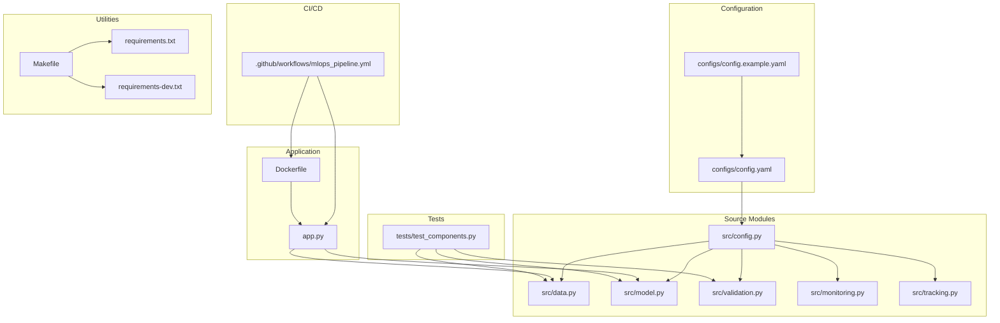
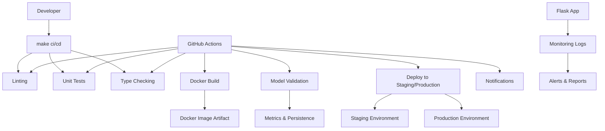
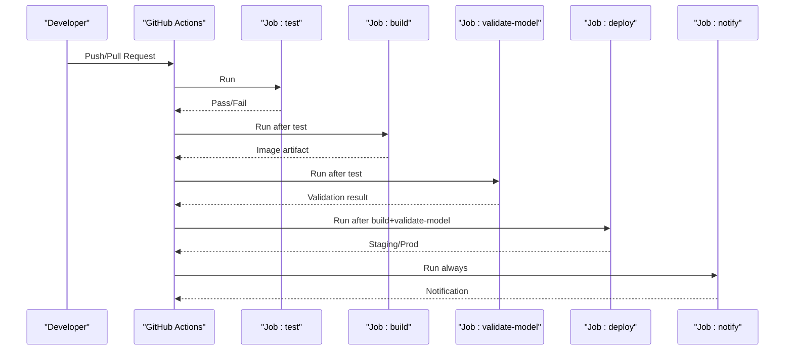
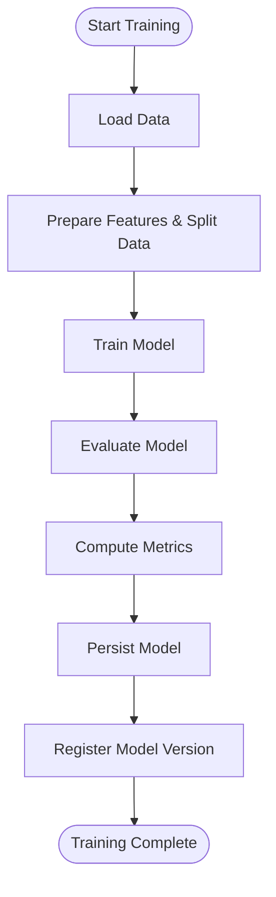
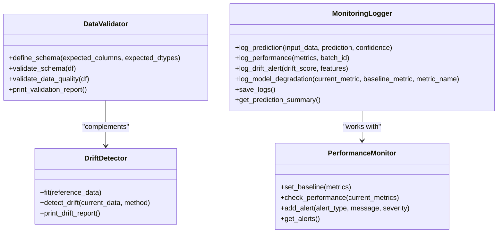
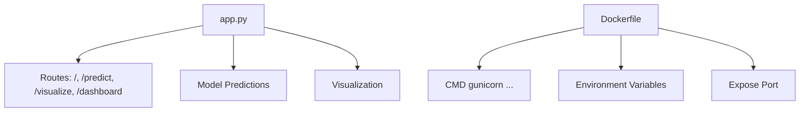
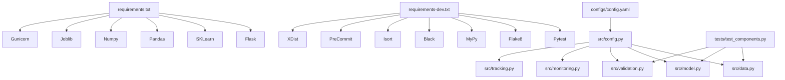

# MLOps Pipeline

<cite>
**Referenced Files in This Document**
- [mlops_pipeline.yml](file://House_Price_Prediction-main/housing1/.github/workflows/mlops_pipeline.yml)
- [Makefile](file://House_Price_Prediction-main/housing1/Makefile)
- [requirements.txt](file://House_Price_Prediction-main/housing1/requirements.txt)
- [requirements-dev.txt](file://House_Price_Prediction-main/housing1/requirements-dev.txt)
- [config.yaml](file://House_Price_Prediction-main/housing1/configs/config.yaml)
- [config.example.yaml](file://House_Price_Prediction-main/housing1/configs/config.example.yaml)
- [Dockerfile](file://House_Price_Prediction-main/housing1/Dockerfile)
- [app.py](file://House_Price_Prediction-main/housing1/app.py)
- [src/config.py](file://House_Price_Prediction-main/housing1/src/config.py)
- [src/data.py](file://House_Price_Prediction-main/housing1/src/data.py)
- [src/model.py](file://House_Price_Prediction-main/housing1/src/model.py)
- [src/validation.py](file://House_Price_Prediction-main/housing1/src/validation.py)
- [src/monitoring.py](file://House_Price_Prediction-main/housing1/src/monitoring.py)
- [src/tracking.py](file://House_Price_Prediction-main/housing1/src/tracking.py)
- [tests/test_components.py](file://House_Price_Prediction-main/housing1/tests/test_components.py)
</cite>

## Table of Contents
1. [Introduction](#introduction)
2. [Project Structure](#project-structure)
3. [Core Components](#core-components)
4. [Architecture Overview](#architecture-overview)
5. [Detailed Component Analysis](#detailed-component-analysis)
6. [Dependency Analysis](#dependency-analysis)
7. [Performance Considerations](#performance-considerations)
8. [Troubleshooting Guide](#troubleshooting-guide)
9. [Conclusion](#conclusion)
10. [Appendices](#appendices)

## Introduction
This document describes the complete MLOps CI/CD pipeline and automated processes for the House Price Prediction project. It covers GitHub Actions stages (testing, building, validating, deploying), Makefile commands for local development and automation, the training pipeline with evaluation and persistence, and operational practices such as triggers, manual intervention points, rollback strategies, and monitoring integration. The goal is to provide a clear, actionable guide for contributors and operators to understand, extend, and maintain the pipeline reliably.

## Project Structure
The repository follows a modular structure with clear separation of concerns:
- Workflows: GitHub Actions pipeline definition
- Configuration: YAML-based configuration for data, model, training, monitoring, API, and logging
- Source modules: Data loading, preprocessing, modeling, validation, monitoring, and experiment tracking
- Tests: Unit tests for core components
- Packaging and deployment: Docker image build and runtime configuration
- Utilities: Makefile for local automation and developer workflows

**Diagram sources**
- [mlops_pipeline.yml:1-180](file://House_Price_Prediction-main/housing1/.github/workflows/mlops_pipeline.yml#L1-L180)
- [config.yaml:1-60](file://House_Price_Prediction-main/housing1/configs/config.yaml#L1-L60)
- [config.example.yaml:1-53](file://House_Price_Prediction-main/housing1/configs/config.example.yaml#L1-L53)
- [src/config.py:1-63](file://House_Price_Prediction-main/housing1/src/config.py#L1-L63)
- [src/data.py:1-109](file://House_Price_Prediction-main/housing1/src/data.py#L1-L109)
- [src/model.py:1-155](file://House_Price_Prediction-main/housing1/src/model.py#L1-L155)
- [src/validation.py:1-243](file://House_Price_Prediction-main/housing1/src/validation.py#L1-L243)
- [src/monitoring.py:1-218](file://House_Price_Prediction-main/housing1/src/monitoring.py#L1-L218)
- [src/tracking.py:1-218](file://House_Price_Prediction-main/housing1/src/tracking.py#L1-L218)
- [app.py:1-109](file://House_Price_Prediction-main/housing1/app.py#L1-L109)
- [Dockerfile:1-39](file://House_Price_Prediction-main/housing1/Dockerfile#L1-L39)
- [tests/test_components.py:1-209](file://House_Price_Prediction-main/housing1/tests/test_components.py#L1-L209)
- [Makefile:1-159](file://House_Price_Prediction-main/housing1/Makefile#L1-L159)
- [requirements.txt:1-24](file://House_Price_Prediction-main/housing1/requirements.txt#L1-L24)
- [requirements-dev.txt:1-17](file://House_Price_Prediction-main/housing1/requirements-dev.txt#L1-L17)

**Section sources**
- [mlops_pipeline.yml:1-180](file://House_Price_Prediction-main/housing1/.github/workflows/mlops_pipeline.yml#L1-L180)
- [Makefile:1-159](file://House_Price_Prediction-main/housing1/Makefile#L1-L159)

## Core Components
- CI/CD pipeline: GitHub Actions workflow orchestrating linting, unit tests, type checking, coverage, Docker image build, model validation, and deployment to staging and production with notifications.
- Local automation: Makefile targets for installation, training, testing, linting, type checking, formatting, data validation, API startup, Docker build/run, model registry inspection, monitoring logs, experiment tracking, CI/CD readiness, setup, cleanup, health checks, and version reporting.
- Configuration: Centralized YAML configuration for project metadata, data paths, model settings, training parameters, experiment tracking, monitoring thresholds, API settings, and logging.
- Data and model lifecycle: Data loading and preprocessing, model training and evaluation, metrics computation, model persistence, and model registry.
- Validation and monitoring: Data quality validation, drift detection, and performance monitoring with alerts and logs.
- Application: Flask web app serving predictions and dashboards, packaged via Docker and orchestrated by Gunicorn.

**Section sources**
- [mlops_pipeline.yml:1-180](file://House_Price_Prediction-main/housing1/.github/workflows/mlops_pipeline.yml#L1-L180)
- [Makefile:1-159](file://House_Price_Prediction-main/housing1/Makefile#L1-L159)
- [config.yaml:1-60](file://House_Price_Prediction-main/housing1/configs/config.yaml#L1-L60)
- [src/config.py:1-63](file://House_Price_Prediction-main/housing1/src/config.py#L1-L63)
- [src/data.py:1-109](file://House_Price_Prediction-main/housing1/src/data.py#L1-L109)
- [src/model.py:1-155](file://House_Price_Prediction-main/housing1/src/model.py#L1-L155)
- [src/validation.py:1-243](file://House_Price_Prediction-main/housing1/src/validation.py#L1-L243)
- [src/monitoring.py:1-218](file://House_Price_Prediction-main/housing1/src/monitoring.py#L1-L218)
- [src/tracking.py:1-218](file://House_Price_Prediction-main/housing1/src/tracking.py#L1-L218)
- [app.py:1-109](file://House_Price_Prediction-main/housing1/app.py#L1-L109)
- [Dockerfile:1-39](file://House_Price_Prediction-main/housing1/Dockerfile#L1-L39)

## Architecture Overview
The MLOps pipeline integrates local development and remote CI/CD with automated quality gates, reproducible builds, and observability.

**Diagram sources**
- [mlops_pipeline.yml:1-180](file://House_Price_Prediction-main/housing1/.github/workflows/mlops_pipeline.yml#L1-L180)
- [Makefile:118-124](file://House_Price_Prediction-main/housing1/Makefile#L118-L124)
- [Dockerfile:1-39](file://House_Price_Prediction-main/housing1/Dockerfile#L1-L39)
- [src/monitoring.py:1-218](file://House_Price_Prediction-main/housing1/src/monitoring.py#L1-L218)

## Detailed Component Analysis

### GitHub Actions Pipeline
The workflow defines four primary jobs orchestrated by dependencies and conditions:
- test: Runs linting, unit tests with coverage, uploads coverage, and type checking.
- build: Builds a Docker image, saves it as a tarball, and uploads it as an artifact.
- validate-model: Installs dependencies, validates training, and evaluates model performance against a threshold.
- deploy: Deploys to staging and production environments conditionally, runs integration tests, and sends notifications.

**Diagram sources**
- [mlops_pipeline.yml:1-180](file://House_Price_Prediction-main/housing1/.github/workflows/mlops_pipeline.yml#L1-L180)

Key behaviors:
- Triggers: push to main/develop and pull_request to main.
- Dependencies: build waits for test; validate-model waits for test; deploy waits for build and validate-model.
- Conditions: deploy runs only on main branch; notify runs regardless of outcome.
- Artifacts: Docker image tarball is uploaded and later downloaded for deployment.
- Validation: model performance threshold enforced during validation.

**Section sources**
- [mlops_pipeline.yml:3-180](file://House_Price_Prediction-main/housing1/.github/workflows/mlops_pipeline.yml#L3-L180)

### Makefile Commands and Local Workflows
Common targets include installation, training, testing, linting, type checking, formatting, data validation, API startup, Docker operations, model registry inspection, monitoring logs, experiment tracking, CI/CD readiness, setup, cleanup, health checks, and version reporting.

```mermaid
flowchart TD
Start(["make <target>"]) --> Install["install/install-dev"]
Start --> Train["train/train-rf"]
Start --> TestTargets["test/test-cov/test-fast"]
Start --> Quality["lint/type-check/format"]
Start --> DataVal["validate-data"]
Start --> API["api/api-prod"]
Start --> DockerOps["docker-build/docker-run/docker-stop"]
Start --> Registry["register-model"]
Start --> Monitor["monitor"]
Start --> Experiments["experiments/best-experiment"]
Start --> CI["ci"]
Start --> CD["cd"]
Start --> Setup["setup"]
Start --> Clean["clean"]
Start --> Health["health"]
Start --> Ver["version"]
```

Operational highlights:
- CI target aggregates lint, test, and type-check.
- CD target prepares Docker image for release.
- Data validation uses configured paths and validators.
- API supports local dev and production Gunicorn deployment.
- Docker operations build/run/stop the containerized app.

**Section sources**
- [Makefile:1-159](file://House_Price_Prediction-main/housing1/Makefile#L1-L159)

### Training Pipeline Script and Automated Processes
The training pipeline integrates data loading, preprocessing, model training, evaluation, metrics logging, and model persistence. Configuration drives model type, training parameters, and output paths.

Implementation details:
- Data loading and preprocessing use configuration-driven paths and splits.
- Model trainer supports multiple model types with configurable parameters.
- Evaluator computes MAE, MSE, RMSE, and R².
- Model persistence uses joblib with configuration-defined save path.
- Experiment tracking and registry enable reproducibility and version control.

**Diagram sources**
- [src/data.py:1-109](file://House_Price_Prediction-main/housing1/src/data.py#L1-L109)
- [src/model.py:1-155](file://House_Price_Prediction-main/housing1/src/model.py#L1-L155)
- [src/tracking.py:1-218](file://House_Price_Prediction-main/housing1/src/tracking.py#L1-L218)
- [config.yaml:1-60](file://House_Price_Prediction-main/housing1/configs/config.yaml#L1-L60)

**Section sources**
- [src/data.py:1-109](file://House_Price_Prediction-main/housing1/src/data.py#L1-L109)
- [src/model.py:1-155](file://House_Price_Prediction-main/housing1/src/model.py#L1-L155)
- [src/tracking.py:1-218](file://House_Price_Prediction-main/housing1/src/tracking.py#L1-L218)
- [config.yaml:1-60](file://House_Price_Prediction-main/housing1/configs/config.yaml#L1-L60)

### Validation and Monitoring
Validation ensures data quality and detects drift; monitoring tracks performance and logs alerts.

**Diagram sources**
- [src/validation.py:1-243](file://House_Price_Prediction-main/housing1/src/validation.py#L1-L243)
- [src/monitoring.py:1-218](file://House_Price_Prediction-main/housing1/src/monitoring.py#L1-L218)

**Section sources**
- [src/validation.py:1-243](file://House_Price_Prediction-main/housing1/src/validation.py#L1-L243)
- [src/monitoring.py:1-218](file://House_Price_Prediction-main/housing1/src/monitoring.py#L1-L218)

### API and Containerization
The Flask application serves predictions and dashboards, packaged via Docker and run with Gunicorn.

Operational notes:
- Dockerfile installs dependencies, copies project, exposes port, and runs with Gunicorn.
- Flask app reads environment variables for port and runs in production mode when deployed.

**Diagram sources**
- [app.py:1-109](file://House_Price_Prediction-main/housing1/app.py#L1-L109)
- [Dockerfile:1-39](file://House_Price_Prediction-main/housing1/Dockerfile#L1-L39)

**Section sources**
- [app.py:1-109](file://House_Price_Prediction-main/housing1/app.py#L1-L109)
- [Dockerfile:1-39](file://House_Price_Prediction-main/housing1/Dockerfile#L1-L39)

## Dependency Analysis
External and internal dependencies shape pipeline reliability and performance.

Observations:
- Core runtime depends on Flask, scikit-learn, pandas, numpy, joblib, and gunicorn.
- Development tools support linting, type checking, formatting, parallel testing, and pre-commit hooks.
- Configuration drives all modules, ensuring consistent behavior across training, validation, and monitoring.

**Diagram sources**
- [requirements.txt:1-24](file://House_Price_Prediction-main/housing1/requirements.txt#L1-L24)
- [requirements-dev.txt:1-17](file://House_Price_Prediction-main/housing1/requirements-dev.txt#L1-L17)
- [config.yaml:1-60](file://House_Price_Prediction-main/housing1/configs/config.yaml#L1-L60)
- [src/config.py:1-63](file://House_Price_Prediction-main/housing1/src/config.py#L1-L63)
- [src/data.py:1-109](file://House_Price_Prediction-main/housing1/src/data.py#L1-L109)
- [src/model.py:1-155](file://House_Price_Prediction-main/housing1/src/model.py#L1-L155)
- [src/validation.py:1-243](file://House_Price_Prediction-main/housing1/src/validation.py#L1-L243)
- [src/monitoring.py:1-218](file://House_Price_Prediction-main/housing1/src/monitoring.py#L1-L218)
- [src/tracking.py:1-218](file://House_Price_Prediction-main/housing1/src/tracking.py#L1-L218)
- [tests/test_components.py:1-209](file://House_Price_Prediction-main/housing1/tests/test_components.py#L1-L209)

**Section sources**
- [requirements.txt:1-24](file://House_Price_Prediction-main/housing1/requirements.txt#L1-L24)
- [requirements-dev.txt:1-17](file://House_Price_Prediction-main/housing1/requirements-dev.txt#L1-L17)
- [config.yaml:1-60](file://House_Price_Prediction-main/housing1/configs/config.yaml#L1-L60)
- [src/config.py:1-63](file://House_Price_Prediction-main/housing1/src/config.py#L1-L63)
- [tests/test_components.py:1-209](file://House_Price_Prediction-main/housing1/tests/test_components.py#L1-L209)

## Performance Considerations
- Parallelization: Use pytest-xdist for parallel unit tests to reduce CI time.
- Coverage: pytest-cov generates XML reports for Codecov integration.
- Type checking: mypy with ignore-missing-imports balances strictness with third-party stubs.
- Formatting and linting: black and isort improve readability and reduce diffs.
- Model persistence: joblib is efficient for scikit-learn models; consider compression and metadata for large models.
- Monitoring: structured logs and alerts enable quick incident response; tune thresholds to minimize noise while catching real issues.

[No sources needed since this section provides general guidance]

## Troubleshooting Guide
Common issues and remedies:
- Missing data file: DataLoader raises explicit errors when the raw data path is invalid; verify config paths.
- Model not found: ModelTrainer.save_model requires a trained model; ensure training completes before saving.
- Validation failures: DataValidator and DriftDetector produce detailed reports; inspect logs and adjust thresholds.
- Monitoring gaps: MonitoringLogger writes to files and console; confirm log directory permissions and rotation.
- CI failures: Review lint, test, and type-check outputs; ensure dependencies match requirements.
- Docker build/run issues: Verify Dockerfile steps, environment variables, and port exposure.

**Section sources**
- [src/data.py:20-31](file://House_Price_Prediction-main/housing1/src/data.py#L20-L31)
- [src/model.py:62-87](file://House_Price_Prediction-main/housing1/src/model.py#L62-L87)
- [src/validation.py:101-122](file://House_Price_Prediction-main/housing1/src/validation.py#L101-L122)
- [src/monitoring.py:122-139](file://House_Price_Prediction-main/housing1/src/monitoring.py#L122-L139)
- [mlops_pipeline.yml:27-46](file://House_Price_Prediction-main/housing1/.github/workflows/mlops_pipeline.yml#L27-L46)
- [Dockerfile:1-39](file://House_Price_Prediction-main/housing1/Dockerfile#L1-L39)

## Conclusion
The MLOps pipeline establishes a robust foundation for continuous delivery of the House Price Prediction model. It enforces quality gates, automates reproducible builds, validates model performance, and integrates monitoring and notifications. The Makefile streamlines local workflows, while configuration centralizes behavior across components. Extending the pipeline—adding manual approval steps, advanced monitoring, or parallelized stages—remains straightforward given the modular design and clear separation of concerns.

[No sources needed since this section summarizes without analyzing specific files]

## Appendices

### Practical Examples
- Pipeline triggers:
  - Branch pushes to main and develop initiate the workflow.
  - Pull requests to main trigger the same stages for review.
- Manual intervention points:
  - Deployment to production currently executes unconditionally; consider adding a manual approval gate before production deployment.
- Rollback procedures:
  - Use the model registry to identify previous versions and redeploy the last known-good model.
  - Revert to the previously tagged Docker image if necessary.
- Monitoring integration:
  - Extend notifications to Slack or email; integrate Prometheus metrics and Grafana dashboards for broader observability.

[No sources needed since this section provides general guidance]