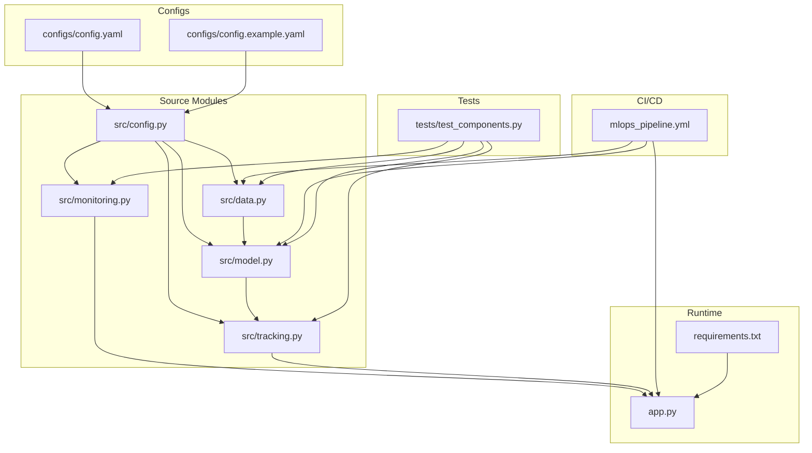
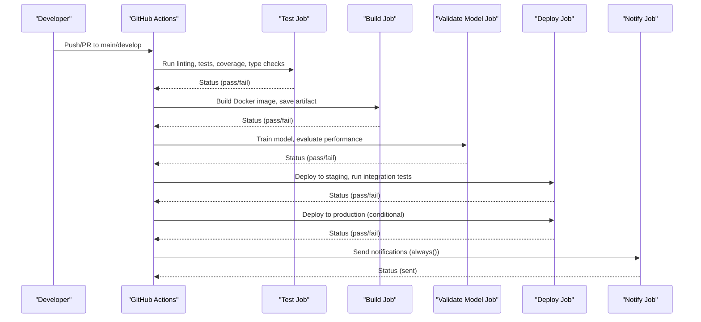
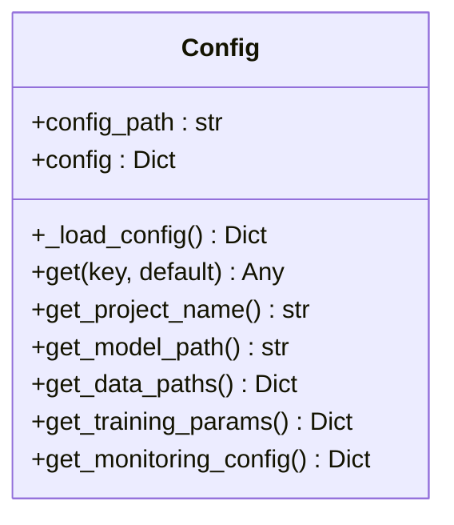
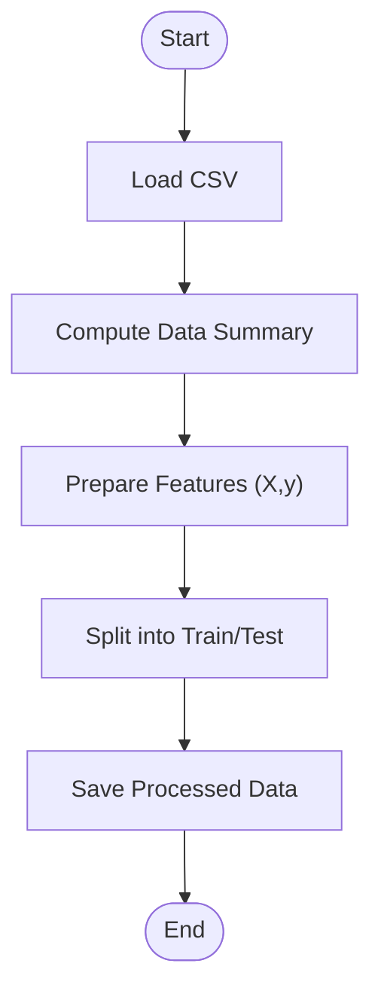
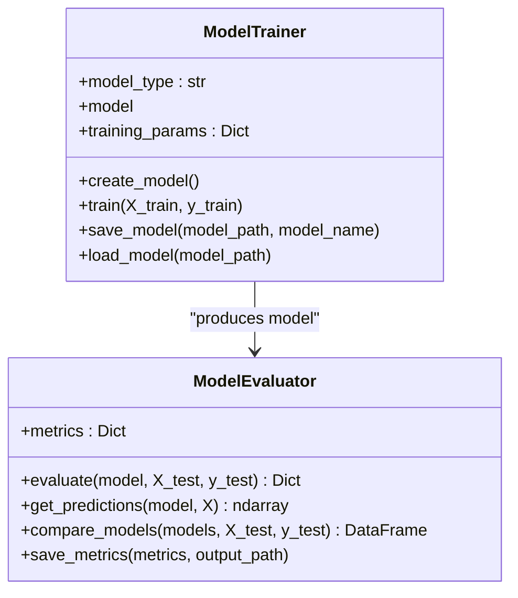
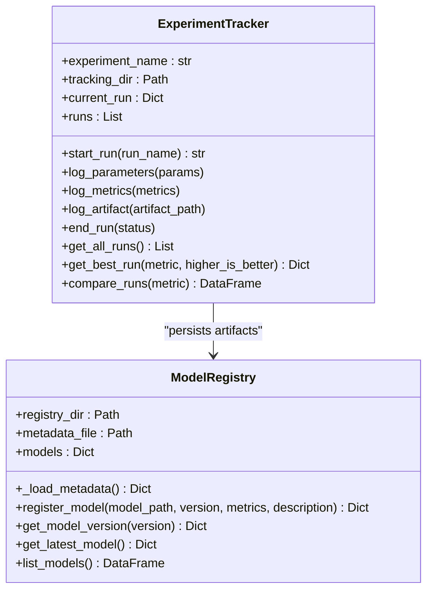
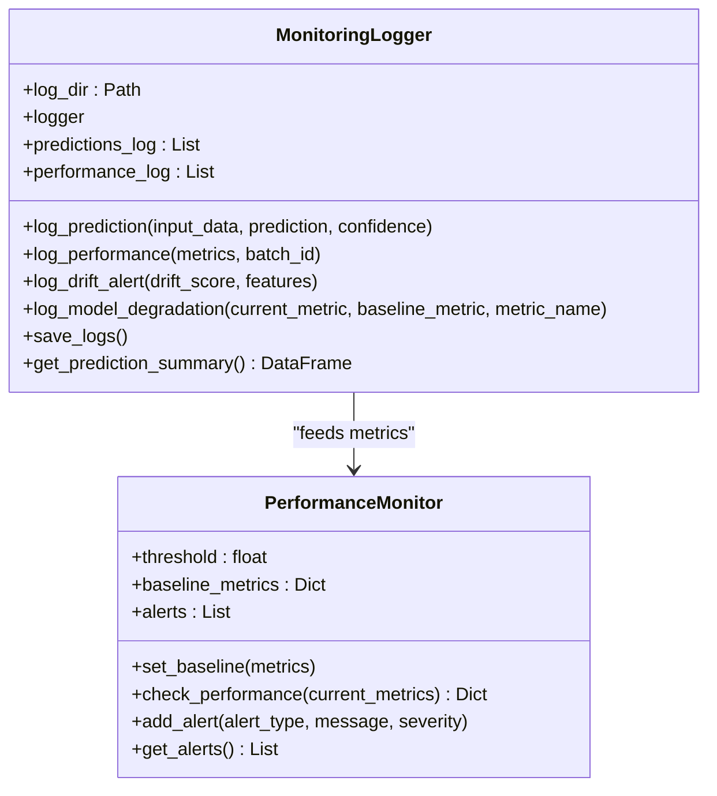
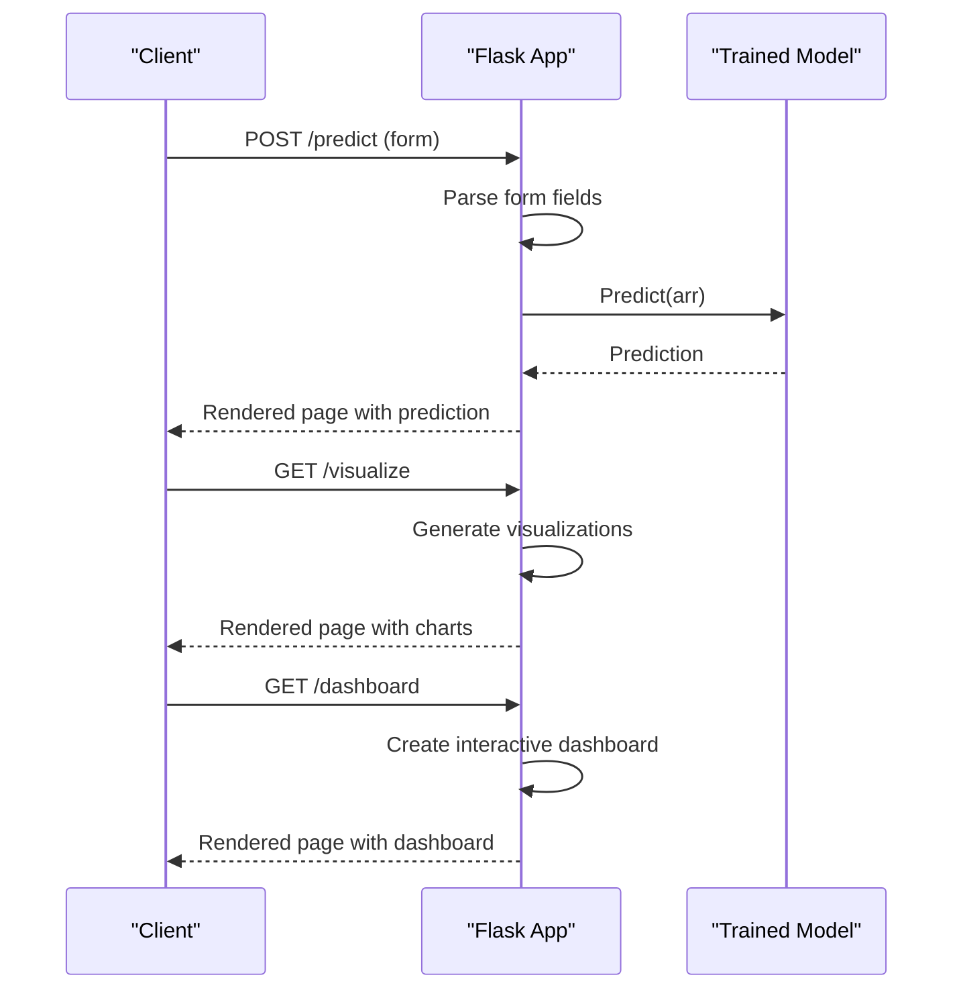
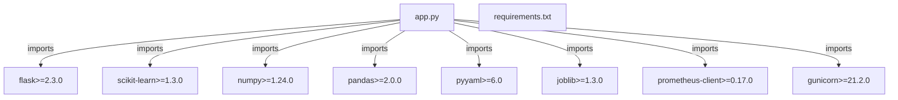

# Pipeline Monitoring and Maintenance

<cite>
**Referenced Files in This Document**
- [config.yaml](file://configs/config.yaml)
- [config.example.yaml](file://configs/config.example.yaml)
- [mlops_pipeline.yml](file://.github/workflows/mlops_pipeline.yml)
- [config.py](file://src/config.py)
- [monitoring.py](file://src/monitoring.py)
- [tracking.py](file://src/tracking.py)
- [data.py](file://src/data.py)
- [model.py](file://src/model.py)
- [app.py](file://app.py)
- [requirements.txt](file://requirements.txt)
- [test_components.py](file://tests/test_components.py)
- [README.md](file://README.md)
</cite>

## Table of Contents
1. [Introduction](#introduction)
2. [Project Structure](#project-structure)
3. [Core Components](#core-components)
4. [Architecture Overview](#architecture-overview)
5. [Detailed Component Analysis](#detailed-component-analysis)
6. [Dependency Analysis](#dependency-analysis)
7. [Performance Considerations](#performance-considerations)
8. [Troubleshooting Guide](#troubleshooting-guide)
9. [Conclusion](#conclusion)
10. [Appendices](#appendices)

## Introduction
This document provides comprehensive guidance for monitoring and maintaining the MLOps pipeline that trains and serves a house price prediction model. It covers health checks, performance metrics, operational procedures, monitoring integration points, alerting mechanisms, failure detection strategies, optimization techniques, debugging practices, maintenance procedures, updates, rollbacks, disaster recovery, and continuous improvement. The content is grounded in the repository’s configuration, pipeline workflows, and source modules.

## Project Structure
The repository organizes MLOps components into modular Python packages, a GitHub Actions workflow for CI/CD, configuration files, and supporting scripts. Key areas include:
- Configuration management via YAML
- Data ingestion and preprocessing
- Model training and evaluation
- Experiment tracking and model registry
- Monitoring and logging
- API service and visualization
- CI/CD pipeline for automated testing, building, validation, and deployment
- Tests validating components and drift detection

**Diagram sources**
- [config.yaml:1-60](file://configs/config.yaml#L1-L60)
- [config.example.yaml:1-53](file://configs/config.example.yaml#L1-L53)
- [config.py:1-63](file://src/config.py#L1-L63)
- [data.py:1-109](file://src/data.py#L1-L109)
- [model.py:1-155](file://src/model.py#L1-L155)
- [monitoring.py:1-218](file://src/monitoring.py#L1-L218)
- [tracking.py:1-218](file://src/tracking.py#L1-L218)
- [app.py:1-113](file://app.py#L1-L113)
- [requirements.txt:1-24](file://requirements.txt#L1-L24)
- [.github/workflows/mlops_pipeline.yml:1-180](file://.github/workflows/mlops_pipeline.yml#L1-L180)
- [tests/test_components.py:1-209](file://tests/test_components.py#L1-L209)

**Section sources**
- [README.md:53-98](file://README.md#L53-L98)
- [config.yaml:1-60](file://configs/config.yaml#L1-L60)
- [mlops_pipeline.yml:1-180](file://.github/workflows/mlops_pipeline.yml#L1-L180)

## Core Components
- Configuration management centralizes project settings, data paths, model parameters, experiment tracking, monitoring thresholds, API settings, and logging configuration.
- Data pipeline handles loading, validation, and splitting datasets for training and testing.
- Model training and evaluation compute performance metrics and manage model persistence.
- Experiment tracking and model registry maintain run metadata and model versions.
- Monitoring logs predictions, performance metrics, drift alerts, and degradation warnings.
- API exposes endpoints for predictions, visualizations, and dashboards.

Key responsibilities:
- Centralized configuration via YAML and a typed Config class
- Modular data loading and preprocessing
- Pluggable model trainers and evaluators
- Persistent experiment tracking and model registry
- Structured monitoring and alerting
- Web API for inference and visualization

**Section sources**
- [config.py:1-63](file://src/config.py#L1-L63)
- [config.yaml:1-60](file://configs/config.yaml#L1-L60)
- [config.example.yaml:1-53](file://configs/config.example.yaml#L1-L53)
- [data.py:1-109](file://src/data.py#L1-L109)
- [model.py:1-155](file://src/model.py#L1-L155)
- [tracking.py:1-218](file://src/tracking.py#L1-L218)
- [monitoring.py:1-218](file://src/monitoring.py#L1-L218)
- [app.py:1-113](file://app.py#L1-L113)

## Architecture Overview
The pipeline integrates configuration-driven components, a CI/CD workflow, and runtime services. The workflow validates training and performance, builds artifacts, and deploys to staging and production environments. Monitoring and tracking modules persist logs and metrics for observability.

**Diagram sources**
- [.github/workflows/mlops_pipeline.yml:1-180](file://.github/workflows/mlops_pipeline.yml#L1-L180)

**Section sources**
- [.github/workflows/mlops_pipeline.yml:1-180](file://.github/workflows/mlops_pipeline.yml#L1-L180)

## Detailed Component Analysis

### Configuration Management
The Config class loads YAML configuration and supports nested key retrieval. It exposes getters for project, data, training, and monitoring settings. This enables centralized control of thresholds, paths, and runtime parameters.

**Diagram sources**
- [config.py:1-63](file://src/config.py#L1-L63)
- [config.yaml:1-60](file://configs/config.yaml#L1-L60)
- [config.example.yaml:1-53](file://configs/config.example.yaml#L1-L53)

Operational implications:
- Change model type, metrics, thresholds, and logging levels by editing the YAML file.
- Use the Config class to enforce defaults and avoid hardcoding.

**Section sources**
- [config.py:1-63](file://src/config.py#L1-L63)
- [config.yaml:1-60](file://configs/config.yaml#L1-L60)
- [config.example.yaml:1-53](file://configs/config.example.yaml#L1-L53)

### Data Pipeline
The data pipeline loads CSV data, computes summaries, separates features and targets, splits datasets, and saves processed data for reproducibility.

**Diagram sources**
- [data.py:1-109](file://src/data.py#L1-L109)

Best practices:
- Validate data shapes and dtypes before training.
- Persist processed datasets to ensure reproducible experiments.

**Section sources**
- [data.py:1-109](file://src/data.py#L1-L109)

### Model Training and Evaluation
Training supports multiple model types with configurable parameters. Evaluation computes MAE, MSE, RMSE, and R². Metrics and models are persisted for later use and registry.

**Diagram sources**
- [model.py:1-155](file://src/model.py#L1-L155)

Operational tips:
- Use early stopping and patience settings during training.
- Save models and metrics after evaluation for experiment tracking.

**Section sources**
- [model.py:1-155](file://src/model.py#L1-L155)

### Experiment Tracking and Model Registry
ExperimentTracker records runs with parameters, metrics, and artifacts. ModelRegistry maintains model versions, metadata, and latest model selection.

**Diagram sources**
- [tracking.py:1-218](file://src/tracking.py#L1-L218)

Operational tips:
- Tag runs with meaningful names and log artifacts (models, plots).
- Use registry to select the best-performing model and promote versions.

**Section sources**
- [tracking.py:1-218](file://src/tracking.py#L1-L218)

### Monitoring and Alerts
MonitoringLogger captures predictions, performance metrics, drift alerts, and model degradation warnings. PerformanceMonitor compares current metrics against baselines and thresholds.

**Diagram sources**
- [monitoring.py:1-218](file://src/monitoring.py#L1-L218)

Alerting logic:
- Drift alerts escalate based on score thresholds.
- Degradation alerts compute percentage change and severity.
- Performance checks enforce baseline thresholds per metric type.

**Section sources**
- [monitoring.py:1-218](file://src/monitoring.py#L1-L218)

### API Service
The Flask API provides routes for predictions, visualizations, and dashboards. It loads a pre-trained model and serves inference requests.

**Diagram sources**
- [app.py:1-113](file://app.py#L1-L113)

Operational notes:
- Production mode disables debug and binds to configured host/port.
- Visualization routes rely on a dedicated visualization module.

**Section sources**
- [app.py:1-113](file://app.py#L1-L113)

## Dependency Analysis
External dependencies include Flask, scikit-learn, NumPy, Pandas, PyYAML, joblib, Prometheus client, and Gunicorn. These enable web serving, ML modeling, serialization, observability, and production WSGI deployment.

**Diagram sources**
- [requirements.txt:1-24](file://requirements.txt#L1-L24)
- [app.py:1-113](file://app.py#L1-L113)

**Section sources**
- [requirements.txt:1-24](file://requirements.txt#L1-L24)

## Performance Considerations
- Parallelism: RandomForestRegressor leverages parallel jobs via configuration.
- Early stopping and patience: Training parameters reduce unnecessary iterations.
- Serialization: joblib is used for efficient model persistence.
- Observability: Prometheus client enables metrics exposure for monitoring systems.
- API scaling: Gunicorn provides a production-grade WSGI server.

Recommendations:
- Profile training time and adjust n_estimators and n_jobs for Random Forest.
- Monitor response times and throughput; scale workers based on load.
- Use caching for repeated predictions and visualization generation.

**Section sources**
- [model.py:30-40](file://src/model.py#L30-L40)
- [model.py:73-77](file://src/model.py#L73-L77)
- [requirements.txt:16-20](file://requirements.txt#L16-L20)

## Troubleshooting Guide
Common issues and resolutions:
- Data file not found: Ensure the raw data path exists and is readable.
  - Reference: [data.py:22-30](file://src/data.py#L22-L30)
- Missing model file: Verify model save path and that training completed.
  - Reference: [model.py:82-86](file://src/model.py#L82-L86)
- Configuration errors: Validate YAML syntax and required keys.
  - Reference: [config.py:17-24](file://src/config.py#L17-L24)
- Drift detection failures: Confirm reference and current datasets alignment.
  - Reference: [test_components.py:189-204](file://tests/test_components.py#L189-L204)
- CI/CD failures: Review workflow stages for linting, tests, validation, and deployment steps.
  - Reference: [.github/workflows/mlops_pipeline.yml:10-180](file://.github/workflows/mlops_pipeline.yml#L10-L180)

Debugging steps:
- Inspect logs: application logs, monitoring logs, predictions, and performance logs.
  - Reference: [README.md:436-450](file://README.md#L436-L450)
- Validate metrics thresholds and degradation alerts.
  - Reference: [monitoring.py:103-120](file://src/monitoring.py#L103-L120)
- Re-run targeted tests to isolate regressions.
  - Reference: [test_components.py:1-209](file://tests/test_components.py#L1-L209)

**Section sources**
- [data.py:22-30](file://src/data.py#L22-L30)
- [model.py:82-86](file://src/model.py#L82-L86)
- [config.py:17-24](file://src/config.py#L17-L24)
- [test_components.py:189-204](file://tests/test_components.py#L189-L204)
- [.github/workflows/mlops_pipeline.yml:10-180](file://.github/workflows/mlops_pipeline.yml#L10-L180)
- [README.md:436-450](file://README.md#L436-L450)
- [monitoring.py:103-120](file://src/monitoring.py#L103-L120)

## Conclusion
The pipeline integrates configuration-driven components, robust monitoring, experiment tracking, and a CI/CD workflow to ensure reliable model training and inference. By leveraging structured logging, alerting, and registry practices, teams can maintain high pipeline health, quickly detect failures, optimize performance, and sustain continuous improvement.

## Appendices

### Monitoring Integration Points
- Logs: application, monitoring, predictions, performance
  - Reference: [README.md:436-450](file://README.md#L436-L450)
- Metrics: prediction volume, performance (MAE, MSE, RMSE, R²), drift scores, response times, error rates
  - Reference: [README.md:444-449](file://README.md#L444-L449)
- Drift and degradation alerts
  - Reference: [monitoring.py:82-120](file://src/monitoring.py#L82-L120)

### Alerting Mechanisms
- Drift alerts escalate by score thresholds
  - Reference: [monitoring.py:82-94](file://src/monitoring.py#L82-L94)
- Model degradation alerts compute percentage change and severity
  - Reference: [monitoring.py:96-120](file://src/monitoring.py#L96-L120)

### Failure Detection Strategies
- CI/CD stages: linting, unit tests, type checks, coverage, Docker build, model validation, staging/production deployment
  - Reference: [.github/workflows/mlops_pipeline.yml:10-180](file://.github/workflows/mlops_pipeline.yml#L10-L180)
- Data quality and drift validation in tests
  - Reference: [test_components.py:159-204](file://tests/test_components.py#L159-L204)

### Optimization Techniques
- Parallel execution: Random Forest parallel jobs
  - Reference: [model.py:30-40](file://src/model.py#L30-L40)
- Early stopping and patience during training
  - Reference: [config.yaml:28-34](file://configs/config.yaml#L28-L34)
- Efficient model serialization with joblib
  - Reference: [model.py:73-77](file://src/model.py#L73-L77)

### Resource Utilization Monitoring
- Prometheus client for metrics exposure
  - Reference: [requirements.txt:16-18](file://requirements.txt#L16-L18)
- Gunicorn for production WSGI serving
  - Reference: [requirements.txt:19-21](file://requirements.txt#L19-L21)

### Practical Examples
- Debugging pipeline components using unit tests
  - Reference: [test_components.py:1-209](file://tests/test_components.py#L1-L209)
- Running the API in development and production modes
  - Reference: [app.py:105-113](file://app.py#L105-L113)
- Viewing logs and metrics locations
  - Reference: [README.md:436-450](file://README.md#L436-L450)

### Maintenance Procedures
- Update configuration and re-run validation
  - Reference: [config.yaml:1-60](file://configs/config.yaml#L1-L60)
- Retrain and register new model versions
  - Reference: [tracking.py:150-183](file://src/tracking.py#L150-L183)
- Rollback strategies using model registry
  - Reference: [tracking.py:190-201](file://src/tracking.py#L190-L201)

### Disaster Recovery Planning
- Preserve processed datasets and model artifacts
  - Reference: [data.py:90-109](file://src/data.py#L90-L109)
- Maintain experiment runs and artifacts for auditability
  - Reference: [tracking.py:75-82](file://src/tracking.py#L75-L82)
- CI/CD artifacts for reproducible deployments
  - Reference: [.github/workflows/mlops_pipeline.yml:55-72](file://.github/workflows/mlops_pipeline.yml#L55-L72)

### Continuous Improvement Practices
- Regularly review monitoring logs and alerts
  - Reference: [monitoring.py:122-139](file://src/monitoring.py#L122-L139)
- Compare runs and select best models
  - Reference: [tracking.py:94-113](file://src/tracking.py#L94-L113)
- Iterate on thresholds and parameters based on performance
  - Reference: [config.yaml:41-46](file://configs/config.yaml#L41-L46)