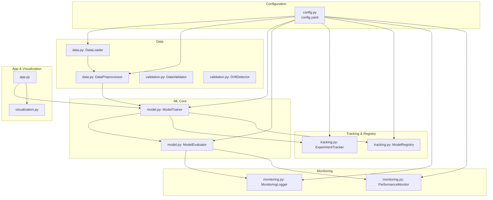
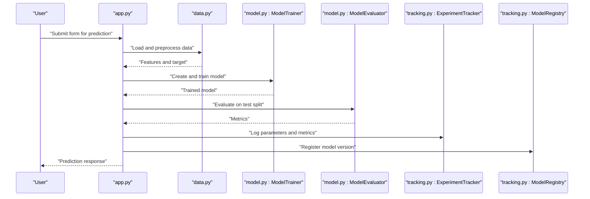
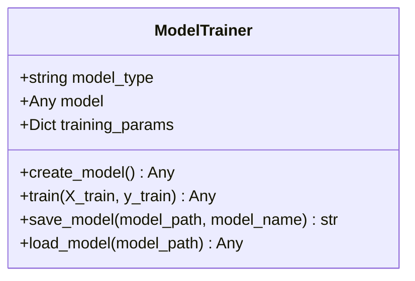
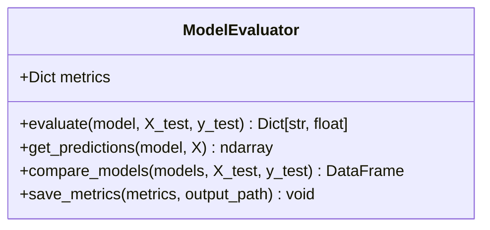
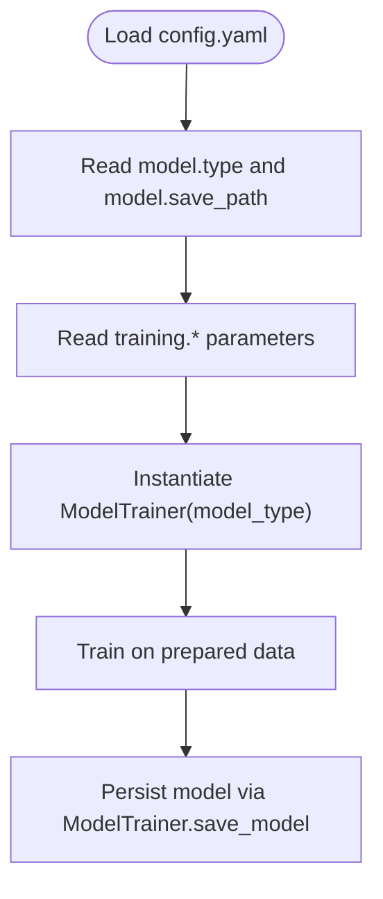
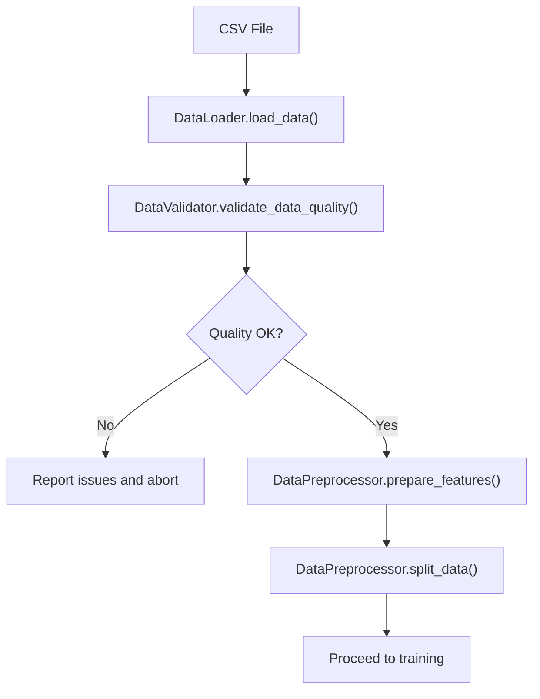
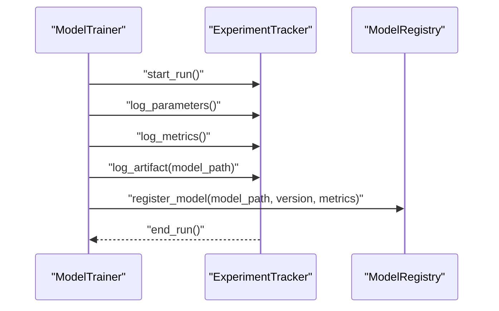
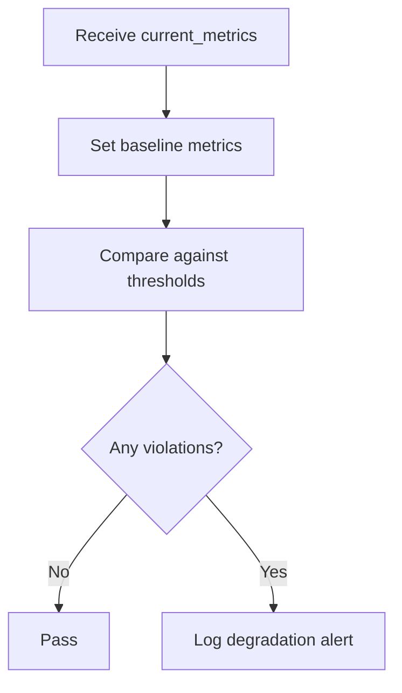
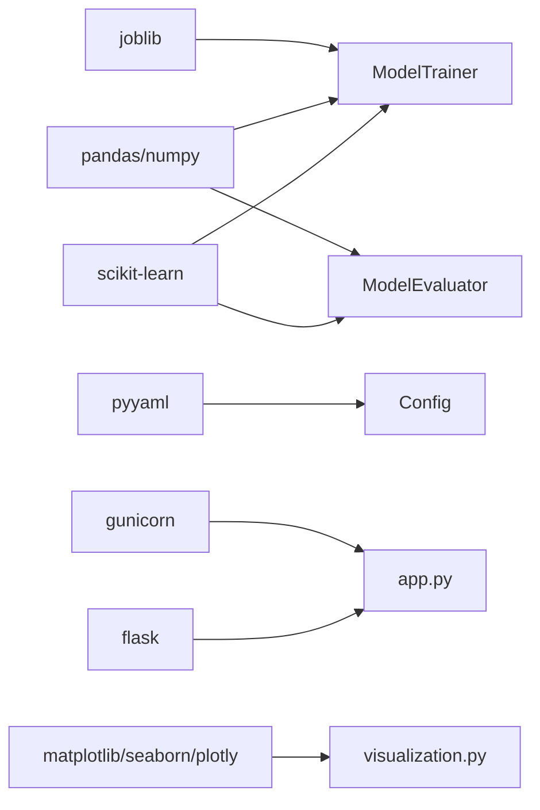

# Machine Learning Models

<cite>
**Referenced Files in This Document**
- [model.py](file://src/model.py)
- [config.py](file://src/config.py)
- [config.yaml](file://configs/config.yaml)
- [data.py](file://src/data.py)
- [tracking.py](file://src/tracking.py)
- [monitoring.py](file://src/monitoring.py)
- [validation.py](file://src/validation.py)
- [Dockerfile](file://Dockerfile)
- [requirements.txt](file://requirements.txt)
- [app.py](file://app.py)
- [test_components.py](file://tests/test_components.py)
- [visualization.py](file://visualization.py)
</cite>

## Table of Contents
1. [Introduction](#introduction)
2. [Project Structure](#project-structure)
3. [Core Components](#core-components)
4. [Architecture Overview](#architecture-overview)
5. [Detailed Component Analysis](#detailed-component-analysis)
6. [Dependency Analysis](#dependency-analysis)
7. [Performance Considerations](#performance-considerations)
8. [Troubleshooting Guide](#troubleshooting-guide)
9. [Conclusion](#conclusion)
10. [Appendices](#appendices)

## Introduction
This document explains the machine learning model system for the House Price Prediction project. It covers the multi-model training and evaluation pipeline, including the ModelTrainer class supporting Linear Regression, Random Forest, and Gradient Boosting; the ModelEvaluator implementation with MAE, MSE, RMSE, and R² metrics; model persistence via serialization and versioning; configuration-driven model selection; and production deployment considerations. Practical examples demonstrate training different model types, comparing performance metrics, and selecting optimal models.

## Project Structure
The machine learning stack is organized around modular components:
- Configuration management centralizes paths, model settings, and training parameters.
- Data loading and preprocessing provide clean train/test splits and optional saving of processed datasets.
- ModelTrainer encapsulates model creation, training, and persistence.
- ModelEvaluator computes performance metrics, compares models, and saves metrics.
- Experiment tracking and model registry support reproducibility and version control.
- Monitoring and validation ensure data quality and drift detection.
- Visualization supports exploratory analysis and performance reporting.
- Deployment is containerized with a production WSGI server.

**Diagram sources**
- [config.py](file://src/config.py)
- [config.yaml](file://configs/config.yaml)
- [data.py](file://src/data.py)
- [model.py](file://src/model.py)
- [tracking.py](file://src/tracking.py)
- [monitoring.py](file://src/monitoring.py)
- [app.py](file://app.py)
- [visualization.py](file://visualization.py)

**Section sources**
- [config.py](file://src/config.py)
- [config.yaml](file://configs/config.yaml)
- [data.py](file://src/data.py)
- [model.py](file://src/model.py)
- [tracking.py](file://src/tracking.py)
- [monitoring.py](file://src/monitoring.py)
- [app.py](file://app.py)
- [visualization.py](file://visualization.py)

## Core Components
- ModelTrainer: Creates, trains, serializes, and loads scikit-learn models. Supports Linear Regression, Random Forest, and Gradient Boosting. Uses configuration for training parameters and model save paths.
- ModelEvaluator: Computes MAE, MSE, RMSE, R²; compares multiple models; and persists metrics to disk.
- Configuration: Centralized YAML configuration for project, data, model, training, experiment tracking, monitoring, API, and logging settings.
- Data Pipeline: Loads CSV data, validates schema and quality, prepares features, splits into train/test sets, and optionally saves processed datasets.
- Experiment Tracking and Registry: Logs runs with parameters and metrics; registers model versions with metadata and artifacts.
- Monitoring and Validation: Logs predictions and performance; detects data drift; enforces performance thresholds.
- Visualization: Provides charts for correlations, distributions, scatter plots, and performance diagnostics.
- Deployment: Containerized with a production WSGI server and exposed port.

**Section sources**
- [model.py](file://src/model.py)
- [config.py](file://src/config.py)
- [config.yaml](file://configs/config.yaml)
- [data.py](file://src/data.py)
- [tracking.py](file://src/tracking.py)
- [monitoring.py](file://src/monitoring.py)
- [validation.py](file://src/validation.py)
- [visualization.py](file://visualization.py)
- [Dockerfile](file://Dockerfile)

## Architecture Overview
The system follows a layered architecture:
- Configuration layer supplies settings to all modules.
- Data layer handles ingestion, validation, and preprocessing.
- ML layer encapsulates training, evaluation, and persistence.
- Observability layer tracks experiments and monitors performance.
- Presentation layer serves predictions and dashboards.

**Diagram sources**
- [app.py](file://app.py)
- [data.py](file://src/data.py)
- [model.py](file://src/model.py)
- [tracking.py](file://src/tracking.py)

## Detailed Component Analysis

### ModelTrainer: Multi-Model Training and Persistence
- Supported algorithms: Linear Regression, Random Forest, Gradient Boosting.
- Creation: Selects model class based on configuration and applies training parameters (e.g., max_iter).
- Training: Fits the model on provided features and target.
- Persistence: Saves model using joblib to configured path; loading supported via joblib.

**Diagram sources**
- [model.py](file://src/model.py)

**Section sources**
- [model.py](file://src/model.py)
- [config.py](file://src/config.py)
- [config.yaml](file://configs/config.yaml)

### ModelEvaluator: Metrics, Comparison, and Persistence
- Metrics: Computes MAE, MSE, RMSE, R².
- Model comparison: Accepts a dictionary of models and returns a DataFrame of metrics.
- Persistence: Writes metrics to a text file for auditability.

**Diagram sources**
- [model.py](file://src/model.py)

**Section sources**
- [model.py](file://src/model.py)

### Configuration-Driven Model Selection
- Centralized configuration defines model type, name, save path, and training parameters.
- ModelTrainer reads training parameters from configuration.
- Data paths and preprocessing parameters are also configurable.

**Diagram sources**
- [config.yaml](file://configs/config.yaml)
- [config.py](file://src/config.py)
- [model.py](file://src/model.py)

**Section sources**
- [config.yaml](file://configs/config.yaml)
- [config.py](file://src/config.py)
- [model.py](file://src/model.py)

### Data Loading, Validation, and Preprocessing
- DataLoader: Reads CSV, prints shape, and raises explicit errors on missing files.
- DataPreprocessor: Separates features/target, splits into train/test sets, and optionally saves processed datasets.
- DataValidator: Validates schema, checks missing values, duplicates, outliers, and computes a quality score.
- DriftDetector: Compares current data against reference statistics using KS test, PSI, or mean-shift.

**Diagram sources**
- [data.py](file://src/data.py)
- [validation.py](file://src/validation.py)

**Section sources**
- [data.py](file://src/data.py)
- [validation.py](file://src/validation.py)

### Experiment Tracking and Model Registry
- ExperimentTracker: Starts runs, logs parameters and metrics, saves run artifacts, and retrieves best runs by metric.
- ModelRegistry: Registers model versions with metrics and metadata, maintains latest version, and lists all versions.

**Diagram sources**
- [tracking.py](file://src/tracking.py)
- [model.py](file://src/model.py)

**Section sources**
- [tracking.py](file://src/tracking.py)

### Monitoring and Performance Thresholds
- MonitoringLogger: Logs predictions and performance metrics to files and console.
- PerformanceMonitor: Compares current metrics to baseline thresholds and raises alerts.

**Diagram sources**
- [monitoring.py](file://src/monitoring.py)

**Section sources**
- [monitoring.py](file://src/monitoring.py)

### Visualization Support
- DataVisualizer: Generates correlation heatmaps, feature distributions, scatter plots, and performance charts; creates an interactive dashboard.

**Section sources**
- [visualization.py](file://visualization.py)

### Practical Examples

#### Train Different Model Types
- Configure model.type to select among linear_regression, random_forest, gradient_boosting.
- Instantiate ModelTrainer with the desired type and call train with prepared features and target.
- Save the model and optionally register it with ModelRegistry.

**Section sources**
- [config.yaml](file://configs/config.yaml)
- [model.py](file://src/model.py)
- [tracking.py](file://src/tracking.py)

#### Compare Performance Metrics Across Models
- Build a dictionary of trained models.
- Use ModelEvaluator.compare_models to compute and return a DataFrame of metrics per model.
- Select the best model by R² or lowest RMSE depending on preference.

**Section sources**
- [model.py](file://src/model.py)

#### Select Optimal Models
- Use ExperimentTracker.get_best_run to pick the run with the highest R² or best metrics.
- Alternatively, sort ModelRegistry.list_models by desired metric.

**Section sources**
- [tracking.py](file://src/tracking.py)
- [monitoring.py](file://src/monitoring.py)

## Dependency Analysis
Key dependencies and their roles:
- scikit-learn: Core ML algorithms and metrics.
- pandas/numpy: Data manipulation and numerical operations.
- joblib: Efficient model serialization.
- pyyaml: Configuration parsing.
- flask/gunicorn: Web app and production server.
- matplotlib/seaborn/plotly: Visualization.

**Diagram sources**
- [requirements.txt](file://requirements.txt)
- [model.py](file://src/model.py)
- [config.py](file://src/config.py)
- [app.py](file://app.py)
- [visualization.py](file://visualization.py)

**Section sources**
- [requirements.txt](file://requirements.txt)
- [model.py](file://src/model.py)
- [config.py](file://src/config.py)
- [app.py](file://app.py)
- [visualization.py](file://visualization.py)

## Performance Considerations
- Overfitting prevention:
  - Use Random Forest or Gradient Boosting for tree-based models; tune n_estimators and max_depth.
  - Employ cross-validation and hold-out test sets; monitor validation curves.
  - Regularization for Linear Regression via solver and penalties if extended.
- Hyperparameter tuning:
  - Integrate GridSearchCV or RandomizedSearchCV with ModelTrainer to sweep hyperparameters.
  - Track experiments with ExperimentTracker to compare runs systematically.
- Early stopping and patience:
  - Leverage training parameters from configuration; consider convergence criteria and max_iter.
- Batch training:
  - Iterate over model types and hyperparameter combinations; persist each model and metrics.
  - Use ModelRegistry to manage versions and roll back if performance degrades.

[No sources needed since this section provides general guidance]

## Troubleshooting Guide
- Configuration not found:
  - Ensure config.yaml exists and Config loads it; verify paths for data and model save locations.
- Data loading failures:
  - DataLoader raises explicit exceptions for missing files; confirm raw_path and file permissions.
- Model persistence errors:
  - ModelTrainer.save_model requires a trained model; verify model instantiation and save_path.
- Evaluation errors:
  - ModelEvaluator.evaluate expects compatible shapes; ensure X_test and y_test align with training features.
- Monitoring and drift:
  - DriftDetector requires reference statistics; call fit before detect_drift.
  - PerformanceMonitor needs baseline metrics; set baseline before checking performance.

**Section sources**
- [config.py](file://src/config.py)
- [data.py](file://src/data.py)
- [model.py](file://src/model.py)
- [monitoring.py](file://src/monitoring.py)
- [validation.py](file://src/validation.py)

## Conclusion
The system provides a robust, configuration-driven machine learning pipeline with multi-model support, comprehensive evaluation, experiment tracking, and model registry. It integrates data validation, drift detection, and monitoring to support reliable production deployments. Extending the pipeline with cross-validation, hyperparameter tuning, and automated batch training will further strengthen model lifecycle management.

[No sources needed since this section summarizes without analyzing specific files]

## Appendices

### Production Deployment Checklist
- Containerize with Docker using the provided Dockerfile.
- Set environment variables for port and Flask app binding.
- Use Gunicorn as the production WSGI server.
- Persist models and metrics to mounted volumes or cloud storage.
- Enable experiment tracking and model registry for auditability.

**Section sources**
- [Dockerfile](file://Dockerfile)
- [app.py](file://app.py)
- [tracking.py](file://src/tracking.py)

### Unit Tests Coverage
- Configuration, data loading, preprocessing, model training, evaluation, data validation, and drift detection are covered by unit tests.

**Section sources**
- [test_components.py](file://tests/test_components.py)