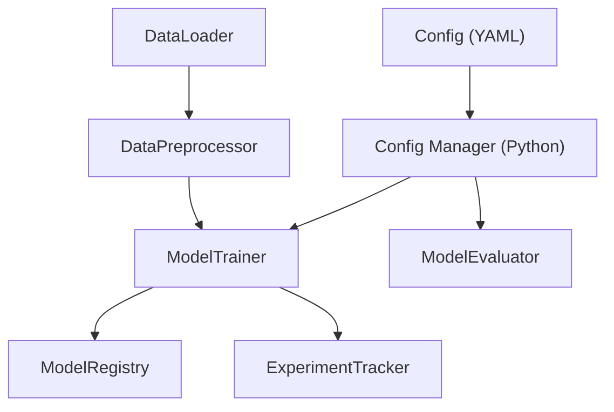
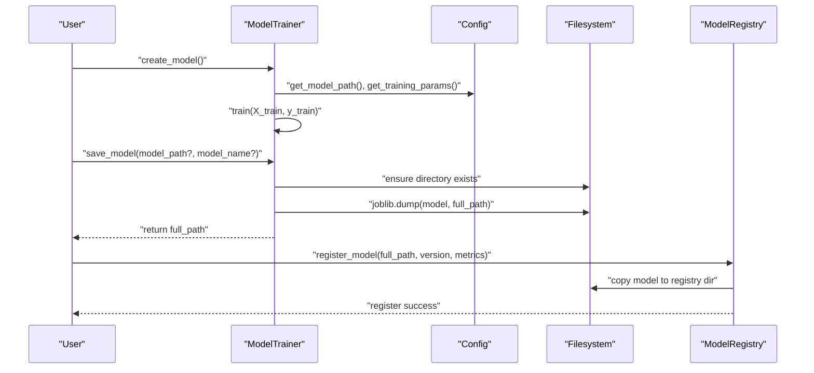
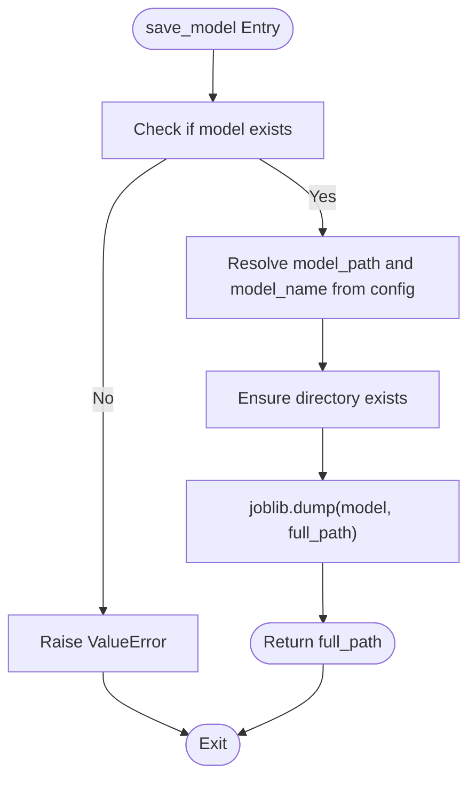
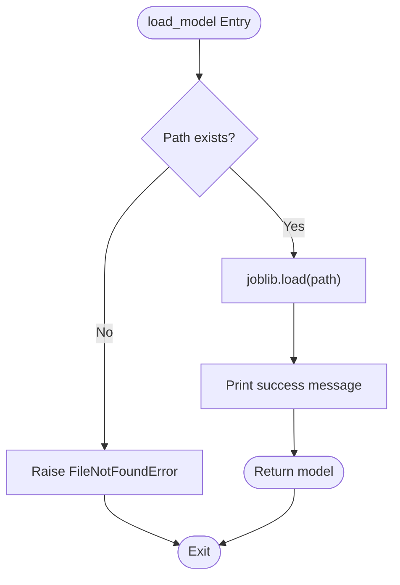
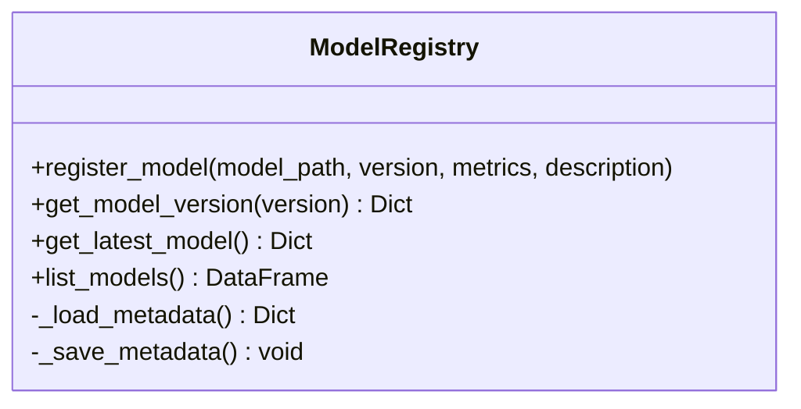
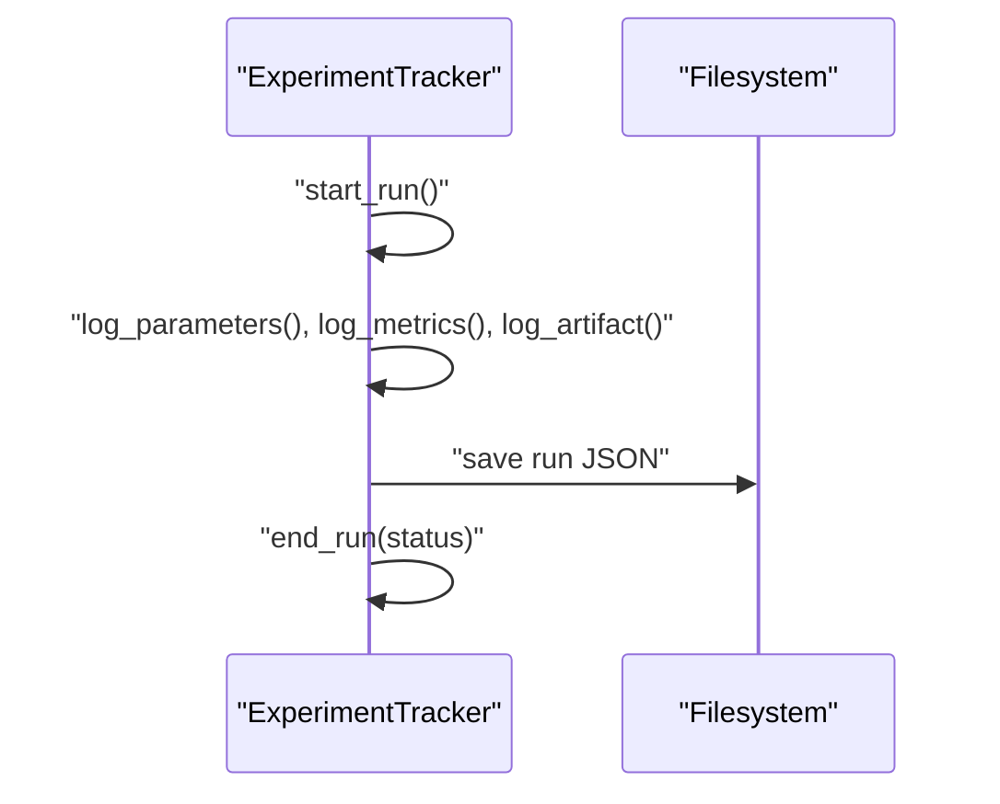
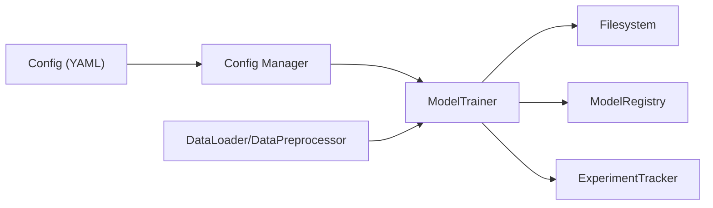

# Model Persistence and Versioning

<cite>
**Referenced Files in This Document**
- [src/model.py](file://House_Price_Prediction-main/housing1/src/model.py)
- [src/config.py](file://House_Price_Prediction-main/housing1/src/config.py)
- [configs/config.yaml](file://House_Price_Prediction-main/housing1/configs/config.yaml)
- [src/tracking.py](file://House_Price_Prediction-main/housing1/src/tracking.py)
- [src/validation.py](file://House_Price_Prediction-main/housing1/src/validation.py)
- [src/data.py](file://House_Price_Prediction-main/housing1/src/data.py)
- [tests/test_components.py](file://House_Price_Prediction-main/housing1/tests/test_components.py)
- [model.py](file://House_Price_Prediction-main/housing1/model.py)
</cite>

## Table of Contents
1. [Introduction](#introduction)
2. [Project Structure](#project-structure)
3. [Core Components](#core-components)
4. [Architecture Overview](#architecture-overview)
5. [Detailed Component Analysis](#detailed-component-analysis)
6. [Dependency Analysis](#dependency-analysis)
7. [Performance Considerations](#performance-considerations)
8. [Troubleshooting Guide](#troubleshooting-guide)
9. [Conclusion](#conclusion)
10. [Appendices](#appendices)

## Introduction
This document explains the model persistence and versioning systems implemented in the project. It covers how models are serialized and stored using joblib, how they are loaded and validated, and how versioning and registry mechanisms are used to manage multiple model iterations. It also provides guidance on naming conventions, directory layout, error handling, backward compatibility, migration procedures, and production deployment considerations for model artifacts.

## Project Structure
The model persistence and versioning logic is primarily implemented in the following modules:
- Model training, saving, and loading: [src/model.py](file://House_Price_Prediction-main/housing1/src/model.py)
- Configuration management: [src/config.py](file://House_Price_Prediction-main/housing1/src/config.py) and [configs/config.yaml](file://House_Price_Prediction-main/housing1/configs/config.yaml)
- Model registry and experiment tracking: [src/tracking.py](file://House_Price_Prediction-main/housing1/src/tracking.py)
- Data loading and preprocessing (context for training data): [src/data.py](file://House_Price_Prediction-main/housing1/src/data.py)
- Validation utilities (schema and drift): [src/validation.py](file://House_Price_Prediction-main/housing1/src/validation.py)
- Unit tests validating model persistence and loading: [tests/test_components.py](file://House_Price_Prediction-main/housing1/tests/test_components.py)
- Legacy standalone model script (for historical reference): [model.py](file://House_Price_Prediction-main/housing1/model.py)

**Diagram sources**
- [configs/config.yaml:1-60](file://House_Price_Prediction-main/housing1/configs/config.yaml#L1-L60)
- [src/config.py:1-63](file://House_Price_Prediction-main/housing1/src/config.py#L1-L63)
- [src/model.py:17-87](file://House_Price_Prediction-main/housing1/src/model.py#L17-L87)
- [src/tracking.py:134-218](file://House_Price_Prediction-main/housing1/src/tracking.py#L134-L218)
- [src/data.py:13-109](file://House_Price_Prediction-main/housing1/src/data.py#L13-L109)

**Section sources**
- [src/model.py:17-87](file://House_Price_Prediction-main/housing1/src/model.py#L17-L87)
- [src/config.py:42-55](file://House_Price_Prediction-main/housing1/src/config.py#L42-L55)
- [configs/config.yaml:17-27](file://House_Price_Prediction-main/housing1/configs/config.yaml#L17-L27)

## Core Components
- ModelTrainer: Creates, trains, saves, and loads scikit-learn models using joblib. It reads model save path and name from configuration and ensures directories exist before writing.
- ModelEvaluator: Computes evaluation metrics and supports batch predictions and model comparison.
- ModelRegistry: Manages model versions, maintains metadata, and copies artifacts into a registry directory.
- ExperimentTracker: Logs runs, parameters, metrics, and artifacts for experiment reproducibility.
- Config: Centralized configuration provider for model paths, data paths, and training parameters.

Key responsibilities:
- Serialization: joblib is used for saving scikit-learn models efficiently.
- Directory management: Ensures save directories exist before persisting artifacts.
- Naming conventions: Uses configured model name and extension (.pkl).
- Versioning: Registry tracks versions and metadata; ExperimentTracker logs artifacts per run.

**Section sources**
- [src/model.py:17-87](file://House_Price_Prediction-main/housing1/src/model.py#L17-L87)
- [src/tracking.py:134-218](file://House_Price_Prediction-main/housing1/src/tracking.py#L134-L218)
- [src/config.py:42-55](file://House_Price_Prediction-main/housing1/src/config.py#L42-L55)
- [configs/config.yaml:17-27](file://House_Price_Prediction-main/housing1/configs/config.yaml#L17-L27)

## Architecture Overview
The model lifecycle integrates configuration-driven persistence, registry-based versioning, and experiment tracking.

**Diagram sources**
- [src/model.py:25-77](file://House_Price_Prediction-main/housing1/src/model.py#L25-L77)
- [src/config.py:42-55](file://House_Price_Prediction-main/housing1/src/config.py#L42-L55)
- [src/tracking.py:150-183](file://House_Price_Prediction-main/housing1/src/tracking.py#L150-L183)

## Detailed Component Analysis

### Model Persistence with Joblib
- Saving: The trainer constructs the full path from configuration, ensures the directory exists, and persists the model using joblib.dump. This is efficient for scikit-learn estimators containing NumPy arrays.
- Loading: The trainer validates the file existence and loads the model via joblib.load, printing a success message upon completion.

**Diagram sources**
- [src/model.py:62-77](file://House_Price_Prediction-main/housing1/src/model.py#L62-L77)

**Section sources**
- [src/model.py:62-87](file://House_Price_Prediction-main/housing1/src/model.py#L62-L87)
- [src/config.py:42-43](file://House_Price_Prediction-main/housing1/src/config.py#L42-L43)
- [configs/config.yaml:17-21](file://House_Price_Prediction-main/housing1/configs/config.yaml#L17-L21)

### Model Loading and Validation
- Existence check: The loader verifies the model file exists before attempting to load.
- Error handling: Raises FileNotFoundError if the path does not exist; otherwise loads the model and prints a success message.
- Validation: Use DataValidator and DriftDetector to validate schema and detect data drift prior to loading or inference to ensure model reliability.

**Diagram sources**
- [src/model.py:79-87](file://House_Price_Prediction-main/housing1/src/model.py#L79-L87)
- [src/validation.py:14-122](file://House_Price_Prediction-main/housing1/src/validation.py#L14-L122)

**Section sources**
- [src/model.py:79-87](file://House_Price_Prediction-main/housing1/src/model.py#L79-L87)
- [src/validation.py:14-122](file://House_Price_Prediction-main/housing1/src/validation.py#L14-L122)

### Model Versioning and Registry
- Registration: The registry stores model metadata (version, path, metrics, timestamp) and copies the persisted model into a versioned artifact location.
- Metadata: Maintains a JSON file with a list of models and the latest version.
- Listing and retrieval: Provides methods to list versions, fetch latest, and retrieve specific versions.

**Diagram sources**
- [src/tracking.py:134-218](file://House_Price_Prediction-main/housing1/src/tracking.py#L134-L218)

**Section sources**
- [src/tracking.py:134-218](file://House_Price_Prediction-main/housing1/src/tracking.py#L134-L218)

### Experiment Tracking and Artifact Logging
- Run lifecycle: Start, log parameters/metrics/artifacts, and end a run; each run is persisted as a JSON file.
- Best run selection: Retrieve the best run by a chosen metric.
- Artifact linkage: Registering a model version also logs the artifact path in the experiment run.

**Diagram sources**
- [src/tracking.py:25-83](file://House_Price_Prediction-main/housing1/src/tracking.py#L25-L83)

**Section sources**
- [src/tracking.py:25-132](file://House_Price_Prediction-main/housing1/src/tracking.py#L25-L132)

### Practical Examples

- Saving a trained model:
  - Use the trainer’s save method with optional overrides for path and filename; the configuration determines defaults.
  - Example reference: [src/model.py:62-77](file://House_Price_Prediction-main/housing1/src/model.py#L62-L77)

- Loading a model for inference:
  - Use the trainer’s load method with the full path; ensure the file exists.
  - Example reference: [src/model.py:79-87](file://House_Price_Prediction-main/housing1/src/model.py#L79-L87)

- Managing multiple model versions:
  - Register versions via the registry after saving; list and select versions as needed.
  - Example reference: [src/tracking.py:150-183](file://House_Price_Prediction-main/housing1/src/tracking.py#L150-L183)

- Backward compatibility and migration:
  - Maintain stable model signatures and avoid breaking changes to input features.
  - Use schema validation and drift detection to catch environment shifts.
  - Example reference: [src/validation.py:21-122](file://House_Price_Prediction-main/housing1/src/validation.py#L21-L122)

**Section sources**
- [src/model.py:62-87](file://House_Price_Prediction-main/housing1/src/model.py#L62-L87)
- [src/tracking.py:150-183](file://House_Price_Prediction-main/housing1/src/tracking.py#L150-L183)
- [src/validation.py:21-122](file://House_Price_Prediction-main/housing1/src/validation.py#L21-L122)

## Dependency Analysis
- ModelTrainer depends on configuration for model path and training parameters.
- ModelRegistry and ExperimentTracker depend on filesystem paths and JSON metadata.
- Data modules support training data preparation and validation.

**Diagram sources**
- [configs/config.yaml:17-27](file://House_Price_Prediction-main/housing1/configs/config.yaml#L17-L27)
- [src/config.py:42-55](file://House_Price_Prediction-main/housing1/src/config.py#L42-L55)
- [src/model.py:17-87](file://House_Price_Prediction-main/housing1/src/model.py#L17-L87)
- [src/tracking.py:134-218](file://House_Price_Prediction-main/housing1/src/tracking.py#L134-L218)
- [src/data.py:13-109](file://House_Price_Prediction-main/housing1/src/data.py#L13-L109)

**Section sources**
- [src/model.py:17-87](file://House_Price_Prediction-main/housing1/src/model.py#L17-L87)
- [src/tracking.py:134-218](file://House_Price_Prediction-main/housing1/src/tracking.py#L134-L218)
- [src/data.py:13-109](file://House_Price_Prediction-main/housing1/src/data.py#L13-L109)

## Performance Considerations
- Serialization choice: joblib is optimized for NumPy arrays and scikit-learn models, reducing overhead compared to pickle for large internal arrays.
- Directory operations: Ensure parent directories are created once per save to avoid repeated filesystem overhead.
- Compression: joblib supports compression options during dump; consider enabling compression for large models to reduce storage footprint.
- Artifact size: Prefer removing unnecessary attributes from models post-training and keep only essential metadata.

[No sources needed since this section provides general guidance]

## Troubleshooting Guide
Common issues and resolutions:
- Model file not found during load:
  - Verify the path exists and matches the configured save path and filename.
  - Reference: [src/model.py:79-87](file://House_Price_Prediction-main/housing1/src/model.py#L79-L87)

- No model to save:
  - Ensure training was performed before saving.
  - Reference: [src/model.py:62-66](file://House_Price_Prediction-main/housing1/src/model.py#L62-L66)

- Schema mismatch or data drift:
  - Use DataValidator to check expected columns and dtypes; use DriftDetector to compare distributions against reference data.
  - References: [src/validation.py:14-122](file://House_Price_Prediction-main/housing1/src/validation.py#L14-L122), [src/validation.py:124-243](file://House_Price_Prediction-main/housing1/src/validation.py#L124-L243)

- Registry metadata corruption:
  - Recreate metadata by re-registering models or restoring from experiment artifacts.
  - Reference: [src/tracking.py:143-148](file://House_Price_Prediction-main/housing1/src/tracking.py#L143-L148)

**Section sources**
- [src/model.py:62-87](file://House_Price_Prediction-main/housing1/src/model.py#L62-L87)
- [src/validation.py:14-122](file://House_Price_Prediction-main/housing1/src/validation.py#L14-L122)
- [src/validation.py:124-243](file://House_Price_Prediction-main/housing1/src/validation.py#L124-L243)
- [src/tracking.py:143-148](file://House_Price_Prediction-main/housing1/src/tracking.py#L143-L148)

## Conclusion
The project implements robust model persistence using joblib, centralized configuration for paths and names, and a registry-based versioning system. Together with experiment tracking and validation utilities, this enables reliable model lifecycle management, reproducibility, and operational safety. Production deployments should leverage compression, schema validation, and drift monitoring to maintain model integrity and performance.

[No sources needed since this section summarizes without analyzing specific files]

## Appendices

### Configuration Keys for Model Persistence
- model.save_path: Directory where models are saved.
- model.name: Base name for saved models.
- training.*: Training parameters consumed by the trainer.

**Section sources**
- [configs/config.yaml:17-33](file://House_Price_Prediction-main/housing1/configs/config.yaml#L17-L33)
- [src/config.py:42-55](file://House_Price_Prediction-main/housing1/src/config.py#L42-L55)

### Legacy Model Script Reference
- A standalone script demonstrates basic model training and pickle-based persistence for historical context.
- Reference: [model.py:1-32](file://House_Price_Prediction-main/housing1/model.py#L1-L32)