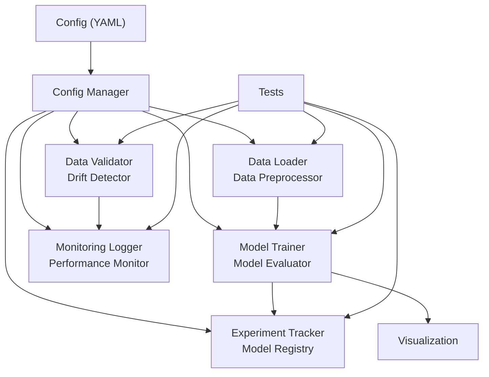
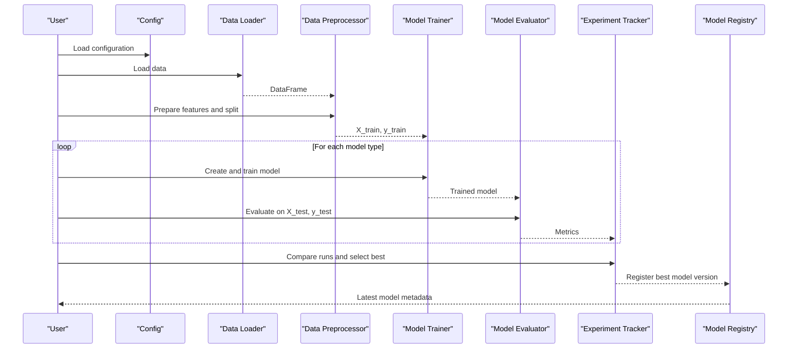
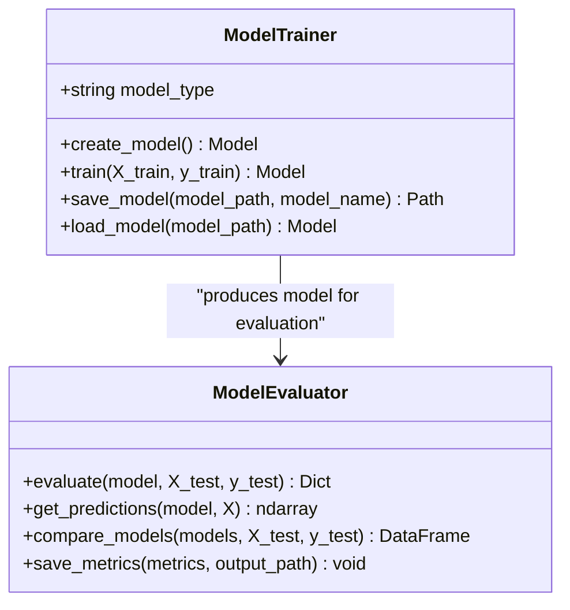
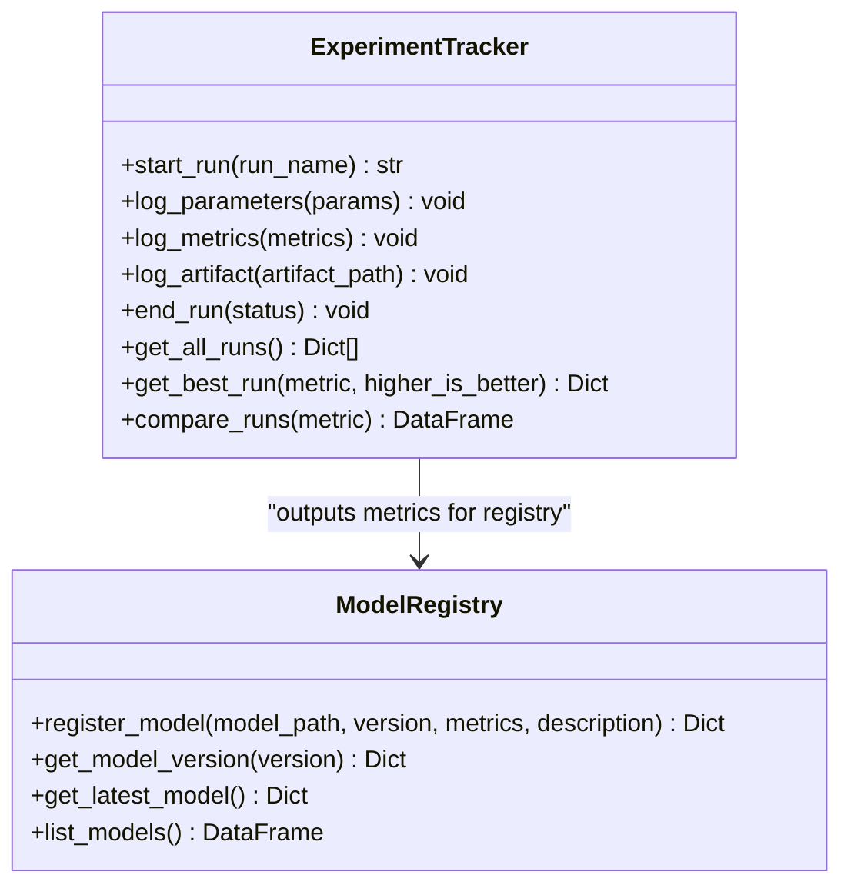
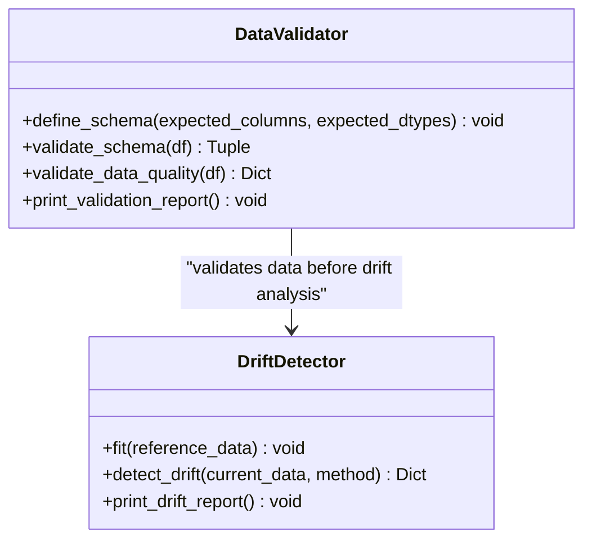
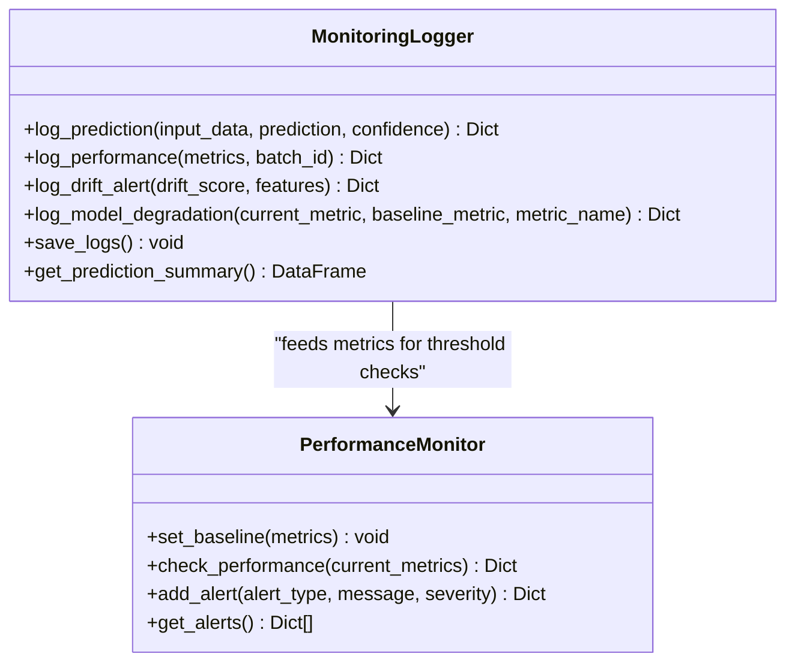
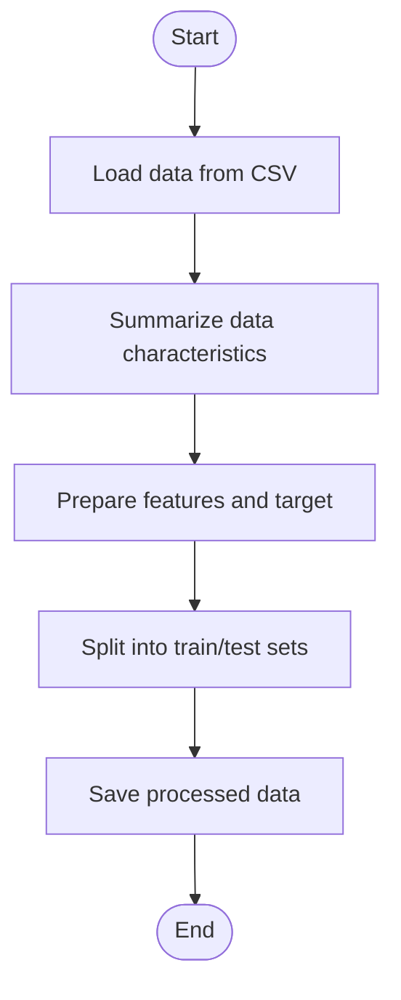
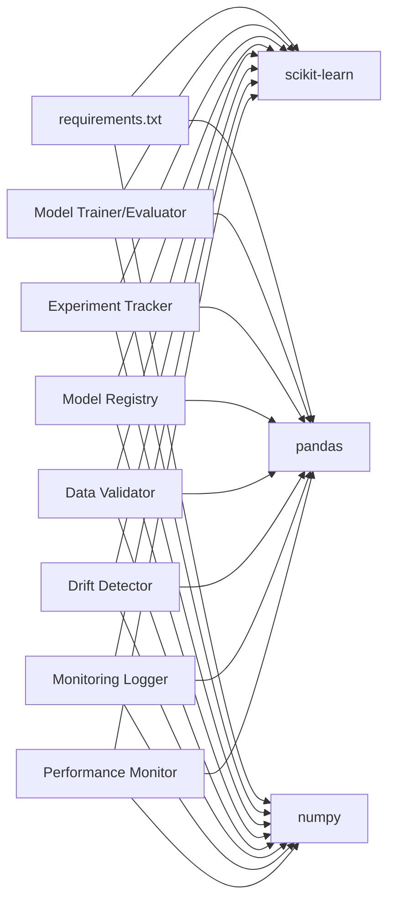

# Model Selection and Comparison

<cite>
**Referenced Files in This Document**
- [model.py](file://src/model.py)
- [tracking.py](file://src/tracking.py)
- [validation.py](file://src/validation.py)
- [monitoring.py](file://src/monitoring.py)
- [data.py](file://src/data.py)
- [config.py](file://src/config.py)
- [config.yaml](file://configs/config.yaml)
- [test_components.py](file://tests/test_components.py)
- [visualization.py](file://visualization.py)
- [requirements.txt](file://requirements.txt)
- [README.md](file://README.md)
</cite>

## Table of Contents
1. [Introduction](#introduction)
2. [Project Structure](#project-structure)
3. [Core Components](#core-components)
4. [Architecture Overview](#architecture-overview)
5. [Detailed Component Analysis](#detailed-component-analysis)
6. [Dependency Analysis](#dependency-analysis)
7. [Performance Considerations](#performance-considerations)
8. [Troubleshooting Guide](#troubleshooting-guide)
9. [Conclusion](#conclusion)
10. [Appendices](#appendices)

## Introduction
This document describes a practical, production-ready model selection and comparison methodology implemented in the repository. It covers automated evaluation of multiple models, performance benchmarking, standardized metrics, and selection criteria grounded in business requirements. It also details comparative analysis using standardized metrics and statistical significance testing, decision-making frameworks for choosing optimal models considering performance and computational efficiency, and production readiness assessments. Practical examples demonstrate how to run comparative experiments, interpret results, and make informed model selection decisions. Interpretability, bias-variance trade-offs, and production monitoring are addressed to ensure robust deployments.

## Project Structure
The repository organizes MLOps capabilities across modular components:
- Configuration management centralizes settings for data, model, training, monitoring, and API.
- Data ingestion and preprocessing provide clean, reproducible datasets.
- Model training and evaluation encapsulate model creation, training, and metric computation.
- Experiment tracking and model registry enable reproducible comparisons and version control.
- Data validation and drift detection monitor data quality and distribution shifts.
- Performance monitoring tracks operational metrics and degradation alerts.
- Visualization supports exploratory analysis and model diagnostics.
- Tests validate core components and workflows.

**Diagram sources**
- [config.yaml:1-60](file://configs/config.yaml#L1-L60)
- [config.py:1-63](file://src/config.py#L1-L63)
- [data.py:1-109](file://src/data.py#L1-L109)
- [model.py:1-155](file://src/model.py#L1-L155)
- [tracking.py:1-218](file://src/tracking.py#L1-L218)
- [validation.py:1-243](file://src/validation.py#L1-L243)
- [monitoring.py:1-218](file://src/monitoring.py#L1-L218)
- [visualization.py:1-348](file://visualization.py#L1-L348)
- [test_components.py:1-209](file://tests/test_components.py#L1-L209)

**Section sources**
- [README.md:53-98](file://README.md#L53-L98)
- [config.yaml:1-60](file://configs/config.yaml#L1-L60)
- [config.py:1-63](file://src/config.py#L1-L63)

## Core Components
- Configuration Management: Centralizes project settings, data paths, model metrics, training parameters, monitoring thresholds, and API configuration.
- Data Pipeline: Loads, validates, and splits data into reproducible training and test sets.
- Model Training and Evaluation: Creates, trains, evaluates, compares, and persists models with standardized metrics.
- Experiment Tracking and Registry: Logs runs, metrics, and artifacts; registers model versions with metadata.
- Data Validation and Drift Detection: Validates schema and quality; detects distribution drift using multiple methods.
- Performance Monitoring: Tracks predictions, performance metrics, drift alerts, and degradation thresholds.
- Visualization: Provides exploratory data analysis and model diagnostic charts.
- Tests: Validate configuration, data handling, model training, evaluation, and drift detection.

**Section sources**
- [config.py:1-63](file://src/config.py#L1-L63)
- [data.py:1-109](file://src/data.py#L1-L109)
- [model.py:1-155](file://src/model.py#L1-L155)
- [tracking.py:1-218](file://src/tracking.py#L1-L218)
- [validation.py:1-243](file://src/validation.py#L1-L243)
- [monitoring.py:1-218](file://src/monitoring.py#L1-L218)
- [visualization.py:1-348](file://visualization.py#L1-L348)
- [test_components.py:1-209](file://tests/test_components.py#L1-L209)

## Architecture Overview
The model selection and comparison workflow integrates configuration-driven data handling, training, evaluation, and monitoring. Automated evaluation supports multi-model comparison, while experiment tracking and registry facilitate reproducibility and version control. Monitoring ensures production readiness by detecting performance degradation and data drift.

**Diagram sources**
- [config.py:1-63](file://src/config.py#L1-L63)
- [data.py:1-109](file://src/data.py#L1-L109)
- [model.py:1-155](file://src/model.py#L1-L155)
- [tracking.py:1-218](file://src/tracking.py#L1-L218)

## Detailed Component Analysis

### Model Training and Evaluation
- Model creation supports linear regression, random forest, and gradient boosting via configuration-driven instantiation.
- Training fits models on prepared data and persists them using efficient serialization.
- Evaluation computes MAE, MSE, RMSE, and R²; comparison aggregates metrics across multiple models into a tabular format for ranking.

**Diagram sources**
- [model.py:17-87](file://src/model.py#L17-L87)
- [model.py:90-155](file://src/model.py#L90-L155)

**Section sources**
- [model.py:17-87](file://src/model.py#L17-L87)
- [model.py:90-155](file://src/model.py#L90-L155)

### Experiment Tracking and Model Registry
- ExperimentTracker logs parameters, metrics, artifacts, and run metadata; supports retrieving best runs by metric and comparing runs.
- ModelRegistry manages model versions, metadata, and persistence, enabling rollback and auditability.

**Diagram sources**
- [tracking.py:14-132](file://src/tracking.py#L14-L132)
- [tracking.py:134-218](file://src/tracking.py#L134-L218)

**Section sources**
- [tracking.py:14-132](file://src/tracking.py#L14-L132)
- [tracking.py:134-218](file://src/tracking.py#L134-L218)

### Data Validation and Drift Detection
- DataValidator defines schema expectations, validates dtypes and columns, and computes a quality score with missing values and outlier counts.
- DriftDetector supports KS test, PSI, and mean-shift methods to detect distribution drift and produce actionable reports.

**Diagram sources**
- [validation.py:14-122](file://src/validation.py#L14-L122)
- [validation.py:124-243](file://src/validation.py#L124-L243)

**Section sources**
- [validation.py:14-122](file://src/validation.py#L14-L122)
- [validation.py:124-243](file://src/validation.py#L124-L243)

### Performance Monitoring
- MonitoringLogger records predictions and performance metrics, emits drift alerts, and logs degradation with severity thresholds.
- PerformanceMonitor compares current metrics against baseline thresholds and raises alerts for violations.

**Diagram sources**
- [monitoring.py:15-147](file://src/monitoring.py#L15-L147)
- [monitoring.py:149-218](file://src/monitoring.py#L149-L218)

**Section sources**
- [monitoring.py:15-147](file://src/monitoring.py#L15-L147)
- [monitoring.py:149-218](file://src/monitoring.py#L149-L218)

### Data Pipeline and Configuration
- DataLoader loads CSV data and summarizes shape, columns, missing values, and dtypes.
- DataPreprocessor separates features and target, splits into train/test sets, and saves processed datasets for reproducibility.
- Config loads YAML settings and exposes getters for project, data, training, and monitoring configurations.

**Diagram sources**
- [data.py:13-43](file://src/data.py#L13-L43)
- [data.py:45-109](file://src/data.py#L45-L109)
- [config.py:10-63](file://src/config.py#L10-L63)

**Section sources**
- [data.py:13-43](file://src/data.py#L13-L43)
- [data.py:45-109](file://src/data.py#L45-L109)
- [config.py:10-63](file://src/config.py#L10-L63)

### Visualization for Comparative Insights
- Visualization module creates correlation heatmaps, feature distributions, scatter plots, and model performance charts to support interpretability and diagnostics.

**Section sources**
- [visualization.py:23-348](file://visualization.py#L23-L348)

## Dependency Analysis
The system relies on scikit-learn for modeling and evaluation, pandas/numpy for data manipulation, and optional experiment tracking libraries for advanced tracking. The configuration system decouples runtime behavior from code, enabling flexible experimentation.

**Diagram sources**
- [requirements.txt:1-24](file://requirements.txt#L1-L24)
- [model.py:10-14](file://src/model.py#L10-L14)
- [tracking.py:1-12](file://src/tracking.py#L1-L12)
- [validation.py:4-12](file://src/validation.py#L4-L12)
- [monitoring.py:4-13](file://src/monitoring.py#L4-L13)

**Section sources**
- [requirements.txt:1-24](file://requirements.txt#L1-L24)

## Performance Considerations
- Metric selection: MAE, RMSE, and R² provide complementary perspectives—MAE is robust to outliers, RMSE penalizes larger errors, and R² indicates explained variance. Use R² for regression interpretability and MAE/RMSE for error magnitude.
- Computational efficiency: Random forest and gradient boosting are more computationally intensive than linear regression; choose based on latency and resource constraints.
- Cross-validation: Extend evaluation to k-fold cross-validation for robust estimates of performance variability.
- Early stopping and regularization: Tune hyperparameters to balance bias and variance; monitor validation curves to prevent overfitting.
- Monitoring thresholds: Set realistic baselines and degradation thresholds to avoid false positives while catching meaningful drops.

[No sources needed since this section provides general guidance]

## Troubleshooting Guide
- Data loading failures: Ensure the raw data path exists and is readable; verify CSV formatting and encoding.
- Schema mismatches: Use DataValidator to confirm expected columns and dtypes; address missing or mismatched types.
- Drift detection: Investigate features flagged by DriftDetector; consider retraining with updated data or feature engineering.
- Performance degradation: Review MonitoringLogger alerts and PerformanceMonitor results; compare against baseline metrics and adjust thresholds.
- Experiment tracking: Confirm ExperimentTracker writes run files and that ModelRegistry persists model copies with correct metadata.

**Section sources**
- [data.py:20-31](file://src/data.py#L20-L31)
- [validation.py:28-49](file://src/validation.py#L28-L49)
- [validation.py:143-199](file://src/validation.py#L143-L199)
- [monitoring.py:82-120](file://src/monitoring.py#L82-L120)
- [tracking.py:75-82](file://src/tracking.py#L75-L82)
- [tracking.py:174-179](file://src/tracking.py#L174-L179)

## Conclusion
This repository provides a complete, production-grade framework for model selection and comparison. By combining standardized metrics, automated evaluation, experiment tracking, and monitoring, teams can make informed decisions grounded in data, performance, and operational reliability. The modular design enables easy extension to additional models, metrics, and monitoring signals, supporting iterative improvement and robust deployments.

[No sources needed since this section summarizes without analyzing specific files]

## Appendices

### Practical Examples: Running Comparative Experiments
- Prepare data: Load and preprocess data using the data pipeline.
- Define models: Instantiate multiple ModelTrainer instances with different model types.
- Train and evaluate: Train each model and collect metrics via ModelEvaluator.
- Compare and rank: Use ModelEvaluator.compare_models to tabulate metrics and rank models.
- Select best: Choose the best model by a chosen metric (e.g., highest R² or lowest RMSE).
- Track and register: Log the run with ExperimentTracker and register the model with ModelRegistry.

**Section sources**
- [data.py:45-109](file://src/data.py#L45-L109)
- [model.py:17-87](file://src/model.py#L17-L87)
- [model.py:90-155](file://src/model.py#L90-L155)
- [tracking.py:14-132](file://src/tracking.py#L14-L132)
- [tracking.py:134-218](file://src/tracking.py#L134-L218)

### Statistical Significance Testing
- For small datasets, consider permutation tests or bootstrap confidence intervals to assess whether differences in metrics are significant.
- For large-scale A/B testing, apply proper hypothesis testing (e.g., t-tests) on paired predictions across held-out sets.
- Document effect sizes alongside p-values to inform business decisions.

[No sources needed since this section provides general guidance]

### Decision-Making Framework
- Business requirements: Align selection with business KPIs (e.g., cost of prediction error, interpretability needs).
- Performance metrics: Prefer R² for explanatory power; use MAE/RMSE for error magnitude.
- Bias-variance trade-off: Choose simpler models for stability and interpretability; use ensemble methods for predictive power when justified.
- Computational efficiency: Consider latency, memory, and throughput constraints.
- Production readiness: Validate data drift, monitor performance, and maintain model registry with clear lineage.

[No sources needed since this section provides general guidance]