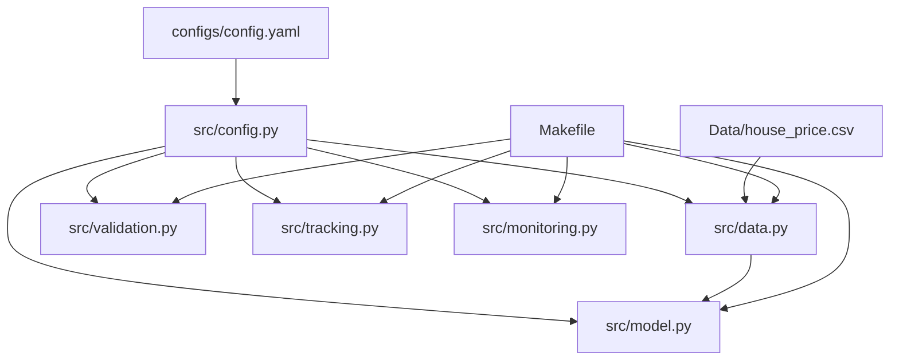
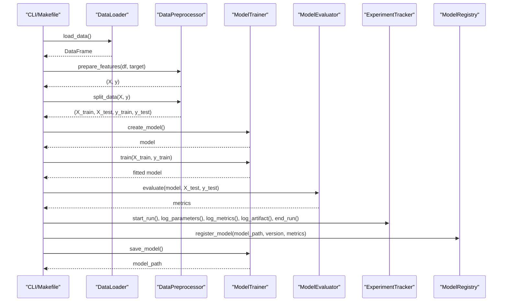
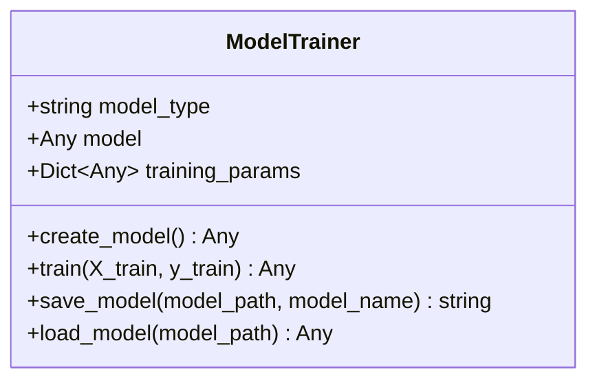
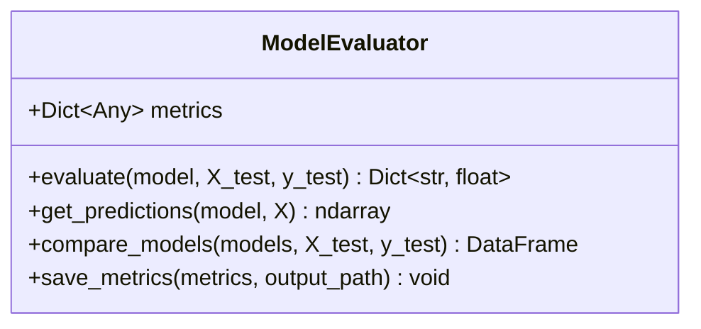
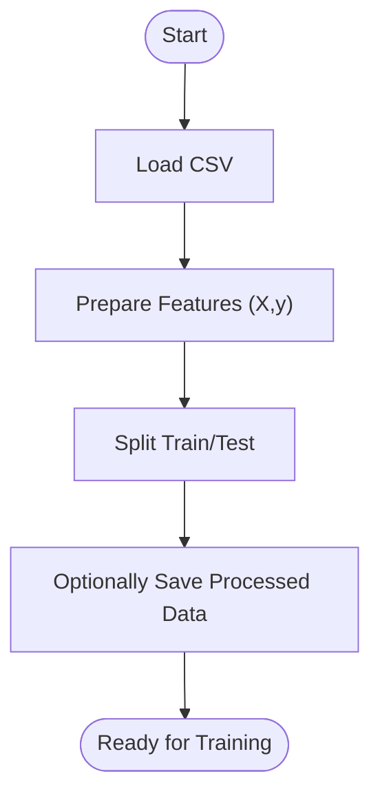
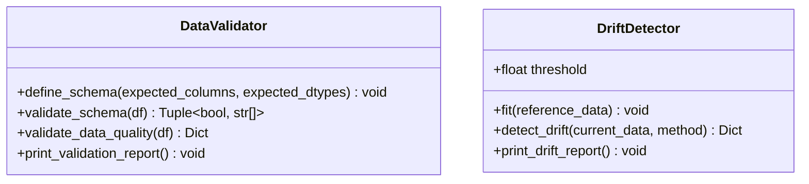
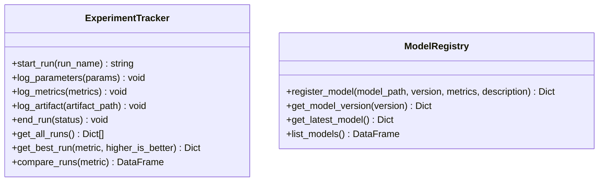
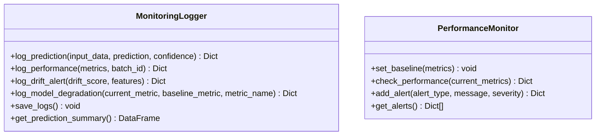
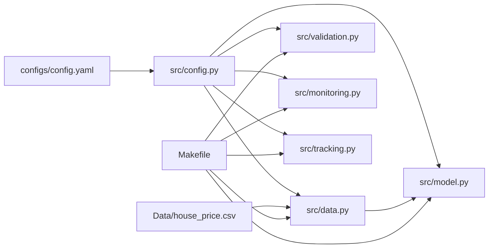

# Model Training and Evaluation

<cite>
**Referenced Files in This Document**
- [model.py](file://src/model.py)
- [data.py](file://src/data.py)
- [config.py](file://src/config.py)
- [config.yaml](file://configs/config.yaml)
- [validation.py](file://src/validation.py)
- [tracking.py](file://src/tracking.py)
- [monitoring.py](file://src/monitoring.py)
- [Makefile](file://Makefile)
- [test_components.py](file://tests/test_components.py)
- [house_price.csv](file://Data/house_price.csv)
- [ARCHITECTURE.md](file://ARCHITECTURE.md)
</cite>

## Table of Contents
1. [Introduction](#introduction)
2. [Project Structure](#project-structure)
3. [Core Components](#core-components)
4. [Architecture Overview](#architecture-overview)
5. [Detailed Component Analysis](#detailed-component-analysis)
6. [Dependency Analysis](#dependency-analysis)
7. [Performance Considerations](#performance-considerations)
8. [Troubleshooting Guide](#troubleshooting-guide)
9. [Conclusion](#conclusion)
10. [Appendices](#appendices)

## Introduction
This document describes the model training and evaluation subsystem of the house price prediction MLOps pipeline. It focuses on:
- The ModelTrainer class implementing a factory-like model creation pattern and a straightforward training pipeline
- The ModelEvaluator class providing performance metrics computation, predictions, and model comparison
- Supported algorithms (Linear Regression, Random Forest, Gradient Boosting), their parameters, and recommended use cases
- The end-to-end training workflow from data preparation to model persistence
- Practical examples for training, evaluation, and comparison
- Training optimization techniques, cross-validation considerations, and production-ready practices

## Project Structure
The training and evaluation logic resides primarily in the src package, with configuration managed via YAML and orchestrated by the Makefile. The dataset is stored under Data.

**Diagram sources**
- [config.yaml:1-60](file://configs/config.yaml#L1-L60)
- [config.py:1-63](file://src/config.py#L1-L63)
- [model.py:1-155](file://src/model.py#L1-L155)
- [data.py:1-109](file://src/data.py#L1-L109)
- [validation.py:1-243](file://src/validation.py#L1-L243)
- [tracking.py:1-218](file://src/tracking.py#L1-L218)
- [monitoring.py:1-218](file://src/monitoring.py#L1-L218)
- [Makefile:1-159](file://Makefile#L1-L159)
- [house_price.csv:1-12](file://Data/house_price.csv#L1-L12)

**Section sources**
- [config.yaml:1-60](file://configs/config.yaml#L1-L60)
- [config.py:1-63](file://src/config.py#L1-L63)
- [model.py:1-155](file://src/model.py#L1-L155)
- [data.py:1-109](file://src/data.py#L1-L109)
- [validation.py:1-243](file://src/validation.py#L1-L243)
- [tracking.py:1-218](file://src/tracking.py#L1-L218)
- [monitoring.py:1-218](file://src/monitoring.py#L1-L218)
- [Makefile:1-159](file://Makefile#L1-L159)
- [house_price.csv:1-12](file://Data/house_price.csv#L1-L12)

## Core Components
- ModelTrainer: Creates, trains, saves, and loads models. Implements a simple factory pattern selecting among supported algorithms.
- ModelEvaluator: Computes MAE, MSE, RMSE, R²; generates predictions; compares multiple models; persists metrics.
- Data modules: DataLoader, DataPreprocessor handle ingestion, feature/target separation, and train/test splits.
- Validation and monitoring: DataValidator and DriftDetector support data quality and drift detection; MonitoringLogger and PerformanceMonitor track runtime performance and drift alerts.
- Experiment tracking and registry: ExperimentTracker logs runs and metrics; ModelRegistry manages model versions and artifacts.

**Section sources**
- [model.py:17-87](file://src/model.py#L17-L87)
- [model.py:90-155](file://src/model.py#L90-L155)
- [data.py:13-109](file://src/data.py#L13-L109)
- [validation.py:14-243](file://src/validation.py#L14-L243)
- [monitoring.py:15-218](file://src/monitoring.py#L15-L218)
- [tracking.py:14-218](file://src/tracking.py#L14-L218)

## Architecture Overview
The training pipeline follows a clear flow: data ingestion and validation, preprocessing and train/test split, model training, evaluation, and model persistence. Experiment tracking and registry capture metadata for reproducibility and versioning.

**Diagram sources**
- [Makefile:37-41](file://Makefile#L37-L41)
- [data.py:20-88](file://src/data.py#L20-L88)
- [model.py:25-87](file://src/model.py#L25-L87)
- [model.py:96-155](file://src/model.py#L96-L155)
- [tracking.py:25-132](file://src/tracking.py#L25-L132)
- [tracking.py:150-183](file://src/tracking.py#L150-L183)

**Section sources**
- [ARCHITECTURE.md:53-86](file://ARCHITECTURE.md#L53-L86)
- [Makefile:37-41](file://Makefile#L37-L41)
- [data.py:20-88](file://src/data.py#L20-L88)
- [model.py:25-87](file://src/model.py#L25-L87)
- [model.py:96-155](file://src/model.py#L96-L155)
- [tracking.py:25-132](file://src/tracking.py#L25-L132)
- [tracking.py:150-183](file://src/tracking.py#L150-L183)

## Detailed Component Analysis

### ModelTrainer: Factory, Training, Persistence
- Factory pattern: create_model selects among linear_regression, random_forest, gradient_boosting, and raises on unknown type. Training parameters are sourced from configuration.
- Training: train fits the selected model on provided features and targets.
- Persistence: save_model uses joblib to serialize the model; load_model restores it from disk.

**Diagram sources**
- [model.py:17-87](file://src/model.py#L17-L87)

**Section sources**
- [model.py:17-87](file://src/model.py#L17-L87)
- [config.py:54-55](file://src/config.py#L54-L55)
- [config.yaml:28-33](file://configs/config.yaml#L28-L33)

### ModelEvaluator: Metrics, Predictions, Comparison
- Metrics: evaluate computes MAE, MSE, RMSE, R² and prints a formatted report.
- Predictions: get_predictions returns raw predictions for given features.
- Comparison: compare_models evaluates multiple models and returns a DataFrame of results.
- Persistence: save_metrics writes metrics to a text file.

**Diagram sources**
- [model.py:90-155](file://src/model.py#L90-L155)

**Section sources**
- [model.py:90-155](file://src/model.py#L90-L155)

### Data Preparation and Splitting
- DataLoader: loads CSV data and provides summary statistics.
- DataPreprocessor: separates features and target, splits into train/test sets using configurable test size and random state, and optionally saves processed datasets.

**Diagram sources**
- [data.py:20-108](file://src/data.py#L20-L108)

**Section sources**
- [data.py:13-109](file://src/data.py#L13-L109)
- [config.yaml:9-16](file://configs/config.yaml#L9-L16)

### Validation and Drift Detection
- DataValidator: validates schema and performs quality checks including missing values, duplicates, and outlier detection; prints a comprehensive report.
- DriftDetector: computes drift against reference statistics using KS-test, PSI, or mean-shift thresholds.

**Diagram sources**
- [validation.py:14-243](file://src/validation.py#L14-L243)

**Section sources**
- [validation.py:14-243](file://src/validation.py#L14-L243)
- [config.yaml:41-46](file://configs/config.yaml#L41-L46)

### Experiment Tracking and Model Registry
- ExperimentTracker: starts runs, logs parameters and metrics, artifacts, and persists run metadata to JSON.
- ModelRegistry: registers model versions with associated metrics and copies artifacts for long-term storage.

**Diagram sources**
- [tracking.py:14-218](file://src/tracking.py#L14-L218)

**Section sources**
- [tracking.py:14-218](file://src/tracking.py#L14-L218)
- [config.yaml:35-39](file://configs/config.yaml#L35-L39)

### Monitoring and Performance Checks
- MonitoringLogger: logs predictions, performance metrics, drift alerts, and model degradation with structured entries and file persistence.
- PerformanceMonitor: compares current metrics to a baseline and flags violations based on thresholds.

**Diagram sources**
- [monitoring.py:15-218](file://src/monitoring.py#L15-L218)

**Section sources**
- [monitoring.py:15-218](file://src/monitoring.py#L15-L218)
- [config.yaml:41-46](file://configs/config.yaml#L41-L46)

## Dependency Analysis
The training and evaluation components depend on configuration for paths, parameters, and thresholds. The Makefile orchestrates end-to-end execution.

**Diagram sources**
- [config.yaml:1-60](file://configs/config.yaml#L1-L60)
- [config.py:1-63](file://src/config.py#L1-L63)
- [model.py:1-155](file://src/model.py#L1-L155)
- [data.py:1-109](file://src/data.py#L1-L109)
- [validation.py:1-243](file://src/validation.py#L1-L243)
- [monitoring.py:1-218](file://src/monitoring.py#L1-L218)
- [tracking.py:1-218](file://src/tracking.py#L1-L218)
- [Makefile:1-159](file://Makefile#L1-L159)
- [house_price.csv:1-12](file://Data/house_price.csv#L1-L12)

**Section sources**
- [config.yaml:1-60](file://configs/config.yaml#L1-L60)
- [config.py:1-63](file://src/config.py#L1-L63)
- [model.py:1-155](file://src/model.py#L1-L155)
- [data.py:1-109](file://src/data.py#L1-L109)
- [validation.py:1-243](file://src/validation.py#L1-L243)
- [monitoring.py:1-218](file://src/monitoring.py#L1-L218)
- [tracking.py:1-218](file://src/tracking.py#L1-L218)
- [Makefile:1-159](file://Makefile#L1-L159)
- [house_price.csv:1-12](file://Data/house_price.csv#L1-L12)

## Performance Considerations
- Algorithm selection:
  - Linear Regression: Fast, interpretable, good baseline; sensitive to outliers and feature scaling.
  - Random Forest: Robust to outliers, handles mixed features well, provides feature importance; computationally heavier.
  - Gradient Boosting: Often strong predictive performance; requires careful tuning and can overfit without regularization.
- Hyperparameters and configuration:
  - Training parameters are read from configuration; adjust max_iter and related tolerances as needed.
  - For Random Forest, consider n_estimators and random_state; n_jobs can leverage CPU cores.
  - For Gradient Boosting, tune learning_rate, n_estimators, max_depth, subsample, and others via a grid/random search.
- Cross-validation:
  - Use scikit-learn’s cross_validate or GridSearchCV to estimate generalization performance and reduce variance in metrics.
- Early stopping and patience:
  - While the current training loop does not implement explicit early stopping, Gradient Boosting supports early stopping internally; configure accordingly.
- Data quality and drift:
  - Validate data quality and monitor drift to maintain stable performance; retrain when drift exceeds thresholds.

[No sources needed since this section provides general guidance]

## Troubleshooting Guide
- Unknown model type during creation:
  - Ensure model_type matches supported values; otherwise, a ValueError is raised.
- No model to save:
  - Train a model before attempting to save.
- Data file not found:
  - Verify raw_path in configuration and that the dataset exists.
- Missing target column:
  - Ensure the target_column exists in the DataFrame before feature separation.
- Drift detected:
  - Investigate affected features and consider retraining with updated data.
- Monitoring alerts:
  - Review logs for drift and degradation alerts; address promptly.

**Section sources**
- [model.py:41-42](file://src/model.py#L41-L42)
- [model.py:64-66](file://src/model.py#L64-L66)
- [data.py:27-30](file://src/data.py#L27-L30)
- [data.py:61-62](file://src/data.py#L61-L62)
- [validation.py:149-150](file://src/validation.py#L149-L150)
- [monitoring.py:82-94](file://src/monitoring.py#L82-L94)

## Conclusion
The model training and evaluation subsystem provides a clear, extensible foundation for building, evaluating, and managing regression models. By leveraging configuration-driven parameters, robust data handling, comprehensive evaluation metrics, and experiment tracking, teams can iterate quickly while maintaining production readiness. Extending the pipeline with cross-validation, hyperparameter tuning, and automated retraining on drift alerts will further strengthen reliability and performance.

[No sources needed since this section summarizes without analyzing specific files]

## Appendices

### Practical Examples

- Train a Linear Regression model:
  - Use the Makefile target to run training; the default model type is linear_regression.
  - After training, evaluate with ModelEvaluator and compare with other models if desired.

- Train Random Forest:
  - Use the dedicated Makefile target for random_forest to select the algorithm and run the pipeline.

- Evaluate and compare models:
  - Use ModelEvaluator.evaluate to compute metrics for a single model.
  - Use ModelEvaluator.compare_models to benchmark multiple models on the same test set.

- Persist and register models:
  - Save the trained model using ModelTrainer.save_model.
  - Register the model version with ModelRegistry.register_model including metrics for traceability.

- Validate data and detect drift:
  - Run data quality checks with DataValidator and print reports.
  - Fit a reference distribution and detect drift against current data using DriftDetector.

- Track experiments:
  - Start runs with ExperimentTracker, log parameters and metrics, and persist artifacts.
  - Retrieve best runs and compare across experiments.

**Section sources**
- [Makefile:37-41](file://Makefile#L37-L41)
- [Makefile:40-41](file://Makefile#L40-L41)
- [model.py:96-155](file://src/model.py#L96-L155)
- [tracking.py:25-132](file://src/tracking.py#L25-L132)
- [tracking.py:150-183](file://src/tracking.py#L150-L183)
- [validation.py:101-122](file://src/validation.py#L101-L122)
- [validation.py:132-199](file://src/validation.py#L132-L199)