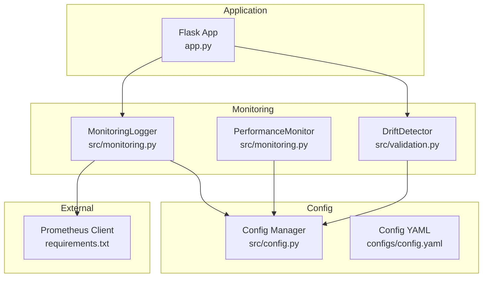
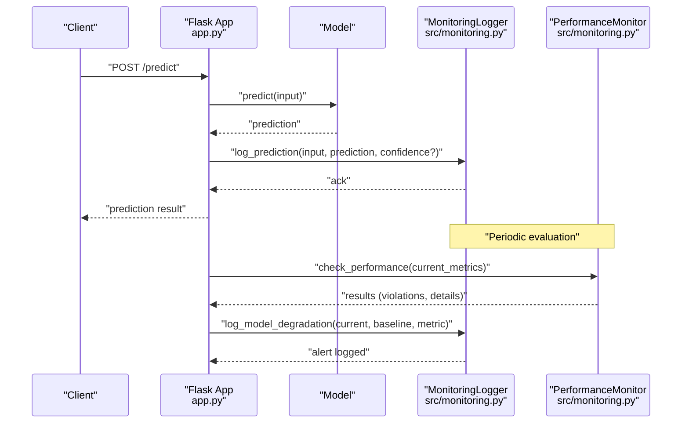
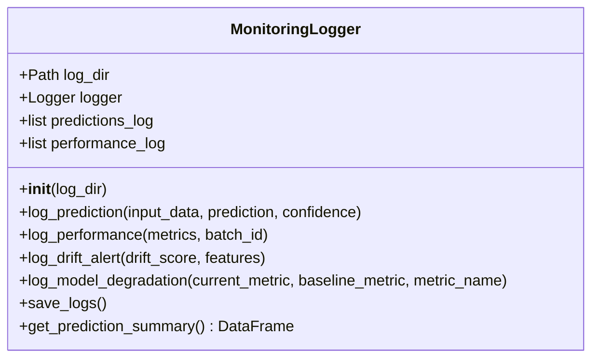
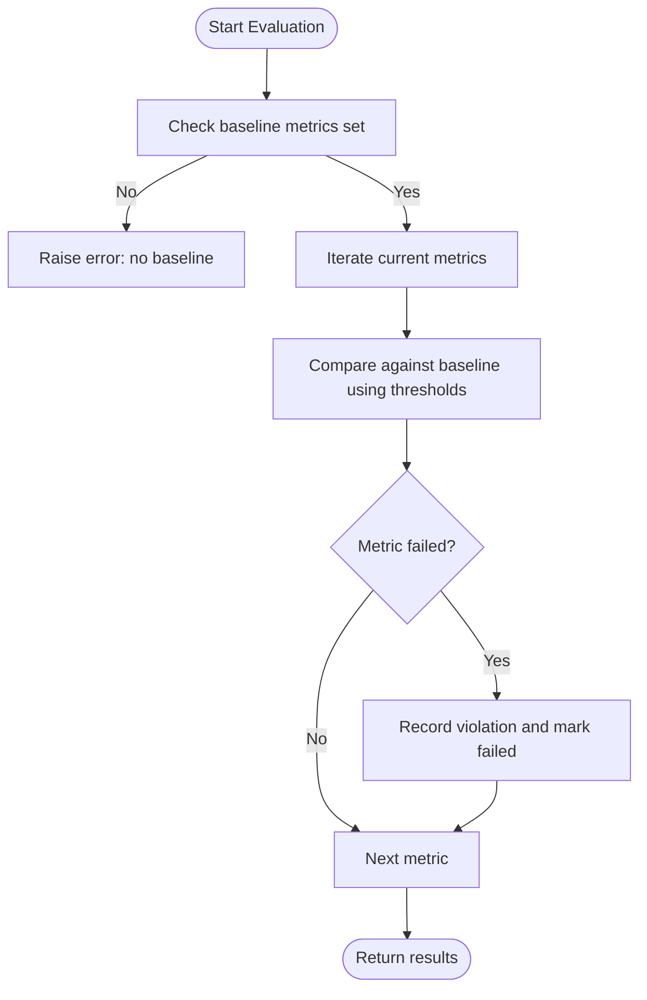
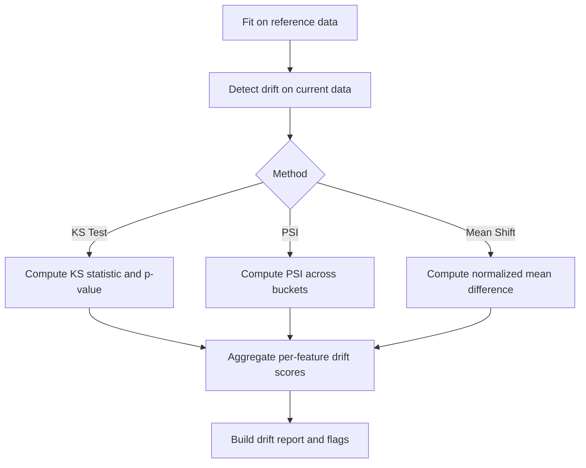
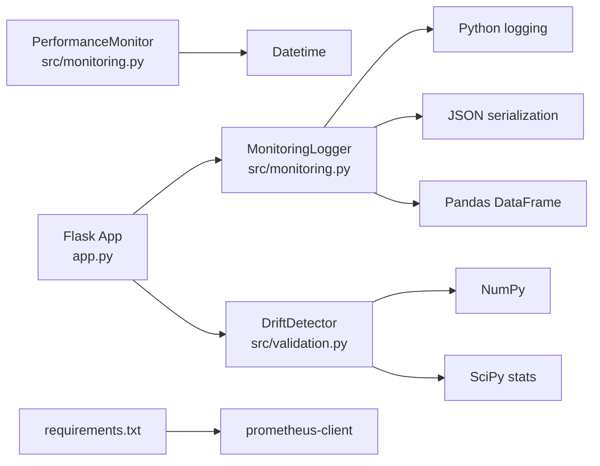

# Monitoring & Alerting

<cite>
**Referenced Files in This Document**
- [monitoring.py](file://House_Price_Prediction-main/housing1/src/monitoring.py)
- [validation.py](file://House_Price_Prediction-main/housing1/src/validation.py)
- [config.py](file://House_Price_Prediction-main/housing1/src/config.py)
- [config.yaml](file://House_Price_Prediction-main/housing1/configs/config.yaml)
- [requirements.txt](file://House_Price_Prediction-main/housing1/requirements.txt)
- [app.py](file://House_Price_Prediction-main/housing1/app.py)
- [test_components.py](file://House_Price_Prediction-main/housing1/tests/test_components.py)
</cite>

## Table of Contents
1. [Introduction](#introduction)
2. [Project Structure](#project-structure)
3. [Core Components](#core-components)
4. [Architecture Overview](#architecture-overview)
5. [Detailed Component Analysis](#detailed-component-analysis)
6. [Dependency Analysis](#dependency-analysis)
7. [Performance Considerations](#performance-considerations)
8. [Troubleshooting Guide](#troubleshooting-guide)
9. [Conclusion](#conclusion)
10. [Appendices](#appendices)

## Introduction
This document provides production-grade monitoring and alerting guidance for the House Price Prediction MLOps system. It focuses on the MonitoringLogger class for prediction logging, performance metrics collection, drift and degradation alerts, and system health monitoring. It also covers alert configuration thresholds, anomaly detection strategies, escalation procedures, dashboard setup, log management, metrics aggregation, and best practices for minimizing performance impact. Guidance is included for extending the system with custom metrics and integrating with external monitoring platforms.

## Project Structure
The monitoring and alerting functionality is primarily implemented in the monitoring module and supported by configuration and validation utilities. The Flask application exposes prediction endpoints that can be instrumented with monitoring hooks.

**Diagram sources**
- [monitoring.py](file://House_Price_Prediction-main/housing1/src/monitoring.py)
- [validation.py](file://House_Price_Prediction-main/housing1/src/validation.py)
- [config.py](file://House_Price_Prediction-main/housing1/src/config.py)
- [config.yaml](file://House_Price_Prediction-main/housing1/configs/config.yaml)
- [requirements.txt](file://House_Price_Prediction-main/housing1/requirements.txt)
- [app.py](file://House_Price_Prediction-main/housing1/app.py)

**Section sources**
- [monitoring.py](file://House_Price_Prediction-main/housing1/src/monitoring.py)
- [validation.py](file://House_Price_Prediction-main/housing1/src/validation.py)
- [config.py](file://House_Price_Prediction-main/housing1/src/config.py)
- [config.yaml](file://House_Price_Prediction-main/housing1/configs/config.yaml)
- [requirements.txt](file://House_Price_Prediction-main/housing1/requirements.txt)
- [app.py](file://House_Price_Prediction-main/housing1/app.py)

## Core Components
- MonitoringLogger: Centralized logging for predictions, performance metrics, drift alerts, and model degradation events. Provides structured JSON persistence and in-memory summaries for quick analysis.
- PerformanceMonitor: Threshold-based performance checks against baseline metrics with violation tracking and alert registration.
- DriftDetector: Detects data drift using statistical tests and PSI, enabling early warning of distribution shifts.
- Config Manager: Loads monitoring thresholds and operational settings from YAML configuration.

Key responsibilities:
- Prediction logging with timestamps and optional confidence scores.
- Performance metrics logging with batch identification.
- Drift detection alerts with severity classification.
- Model degradation alerts with percentage change computation.
- Persistence of logs to JSON files for offline analysis.
- In-memory summaries for DataFrame-based analytics.

**Section sources**
- [monitoring.py](file://House_Price_Prediction-main/housing1/src/monitoring.py)
- [validation.py](file://House_Price_Prediction-main/housing1/src/validation.py)
- [config.py](file://House_Price_Prediction-main/housing1/src/config.py)
- [config.yaml](file://House_Price_Prediction-main/housing1/configs/config.yaml)

## Architecture Overview
The monitoring stack integrates with the Flask application via prediction endpoints. MonitoringLogger writes to both file and console handlers, while PerformanceMonitor evaluates metrics against configured baselines. DriftDetector supports periodic checks to surface distribution shifts.

**Diagram sources**
- [app.py](file://House_Price_Prediction-main/housing1/app.py)
- [monitoring.py](file://House_Price_Prediction-main/housing1/src/monitoring.py)

## Detailed Component Analysis

### MonitoringLogger
Responsibilities:
- Logs individual predictions with input features, prediction value, and optional confidence.
- Aggregates performance metrics per batch with timestamps and batch identifiers.
- Emits drift alerts with severity derived from drift scores and affected features.
- Emits model degradation alerts with computed percentage change and severity thresholds.
- Persists logs to JSON files with timestamps for offline analysis.
- Provides a DataFrame summary of logged predictions for quick inspection.

Implementation highlights:
- Structured log entries with ISO timestamps.
- Console and file handlers for real-time visibility and archival.
- Severity thresholds for drift and degradation alerts.
- Batch-aware performance logging with configurable batch IDs.

**Diagram sources**
- [monitoring.py](file://House_Price_Prediction-main/housing1/src/monitoring.py)

**Section sources**
- [monitoring.py](file://House_Price_Prediction-main/housing1/src/monitoring.py)

### PerformanceMonitor
Responsibilities:
- Sets baseline metrics for comparison.
- Evaluates current metrics against baseline using configurable thresholds.
- Classifies violations by metric type (higher-is-better vs lower-is-better).
- Maintains an alert registry with timestamps, types, severities, and messages.
- Returns structured results indicating pass/fail per metric and overall compliance.

**Diagram sources**
- [monitoring.py](file://House_Price_Prediction-main/housing1/src/monitoring.py)

**Section sources**
- [monitoring.py](file://House_Price_Prediction-main/housing1/src/monitoring.py)

### DriftDetector
Responsibilities:
- Establishes reference statistics from historical data.
- Detects drift using multiple methods: Kolmogorov-Smirnov test, PSI, or mean-shift normalized by standard deviation.
- Builds a drift report with per-feature scores, means, and drift flags.
- Prints a human-readable drift report.

**Diagram sources**
- [validation.py](file://House_Price_Prediction-main/housing1/src/validation.py)

**Section sources**
- [validation.py](file://House_Price_Prediction-main/housing1/src/validation.py)

### Configuration Integration
The Config manager reads monitoring thresholds and operational settings from YAML, including drift thresholds, performance thresholds, check frequency, and alert contact information. These values inform MonitoringLogger and PerformanceMonitor behavior.

**Section sources**
- [config.py](file://House_Price_Prediction-main/housing1/src/config.py)
- [config.yaml](file://House_Price_Prediction-main/housing1/configs/config.yaml)

## Dependency Analysis
External dependencies supporting monitoring:
- Prometheus client enables exporting metrics for scraping by Prometheus-compatible systems.
- Flask application provides the runtime environment for prediction endpoints.

**Diagram sources**
- [monitoring.py](file://House_Price_Prediction-main/housing1/src/monitoring.py)
- [validation.py](file://House_Price_Prediction-main/housing1/src/validation.py)
- [app.py](file://House_Price_Prediction-main/housing1/app.py)
- [requirements.txt](file://House_Price_Prediction-main/housing1/requirements.txt)

**Section sources**
- [requirements.txt](file://House_Price_Prediction-main/housing1/requirements.txt)
- [monitoring.py](file://House_Price_Prediction-main/housing1/src/monitoring.py)
- [validation.py](file://House_Price_Prediction-main/housing1/src/validation.py)
- [app.py](file://House_Price_Prediction-main/housing1/app.py)

## Performance Considerations
- Logging overhead: File and console handlers are synchronous; consider asynchronous handlers or batching for high-throughput scenarios.
- JSON persistence: Periodic saving of logs avoids memory pressure but may block during large writes; schedule saves off-peak.
- DataFrame summaries: get_prediction_summary creates a DataFrame from in-memory lists; avoid frequent summarization in hot paths.
- Drift detection: PSI and KS tests are efficient for moderate datasets; for large-scale drift checks, consider sampling or approximate methods.
- Threshold tuning: Start with conservative thresholds and adjust based on observed false positives/negatives.

[No sources needed since this section provides general guidance]

## Troubleshooting Guide
Common issues and resolutions:
- Missing baseline metrics: PerformanceMonitor raises an error when no baseline is set. Ensure baseline is established before evaluating current metrics.
- No drift results: DriftDetector requires reference statistics; call fit() with historical data before detect_drift().
- Log files not created: Verify log directory exists and permissions are sufficient; MonitoringLogger auto-creates the directory.
- Alerts not appearing: Confirm logging level and handler configuration; ensure drift and degradation thresholds are met.

**Section sources**
- [monitoring.py](file://House_Price_Prediction-main/housing1/src/monitoring.py)
- [validation.py](file://House_Price_Prediction-main/housing1/src/validation.py)

## Conclusion
The MonitoringLogger and PerformanceMonitor provide a solid foundation for production observability, capturing predictions, performance, drift, and degradation signals. Combined with configuration-driven thresholds and drift detection, the system supports proactive alerting and continuous model health monitoring. Extending the system with custom metrics and integrating with external monitoring platforms is straightforward through structured logging and metrics export.

[No sources needed since this section summarizes without analyzing specific files]

## Appendices

### Practical Examples

- Setting up monitoring dashboards:
  - Use exported metrics (via prometheus-client) and a dashboarding solution to visualize prediction volumes, performance trends, and drift indicators.
  - Aggregate logs periodically to CSV/Parquet for long-term trend analysis.

- Configuring alerts:
  - Define drift_threshold and performance_threshold in the configuration YAML.
  - Translate PerformanceMonitor results into alert events with severity levels (CRITICAL, WARNING, HIGH, MEDIUM).

- Analyzing system performance:
  - Review saved logs for prediction anomalies and degradation trends.
  - Use get_prediction_summary to compute daily aggregates and outlier detection.

- Log management and metrics aggregation:
  - Rotate logs by date/time and archive to remote storage.
  - Aggregate metrics by batch_id and feature groups for drift analysis.

- Minimizing performance impact:
  - Defer expensive computations to scheduled tasks.
  - Use sampling for drift detection on large datasets.
  - Tune logging verbosity and handler buffering.

- Extending with custom metrics:
  - Add new metric keys to performance logs and update PerformanceMonitor evaluation logic.
  - Integrate with external platforms by exporting metrics and logs to centralized systems.

**Section sources**
- [monitoring.py](file://House_Price_Prediction-main/housing1/src/monitoring.py)
- [validation.py](file://House_Price_Prediction-main/housing1/src/validation.py)
- [config.yaml](file://House_Price_Prediction-main/housing1/configs/config.yaml)
- [requirements.txt](file://House_Price_Prediction-main/housing1/requirements.txt)