# Core Features and Capabilities

<cite>
**Referenced Files in This Document**
- [README.md](file://README.md)
- [ARCHITECTURE.md](file://ARCHITECTURE.md)
- [PROJECT_SUMMARY.md](file://PROJECT_SUMMARY.md)
- [QUICKSTART.md](file://QUICKSTART.md)
- [MLOPS_WORKFLOW.md](file://MLOPS_WORKFLOW.md)
- [config.py](file://src/config.py)
- [data.py](file://src/data.py)
- [model.py](file://src/model.py)
- [tracking.py](file://src/tracking.py)
- [validation.py](file://src/validation.py)
- [monitoring.py](file://src/monitoring.py)
- [config.yaml](file://configs/config.yaml)
- [train.py](file://pipelines/train.py)
- [api.py](file://api.py)
- [app.py](file://app.py)
- [Makefile](file://Makefile)
- [Dockerfile](file://Dockerfile)
- [Procfile](file://Procfile)
- [railway.json](file://railway.json)
- [mlops_pipeline.yml](file://.github/workflows/mlops_pipeline.yml)
- [test_components.py](file://tests/test_components.py)
- [visualization.py](file://visualization.py)
- [index.html](file://templates/index.html)
- [style.css](file://static/css/style.css)
</cite>

## Table of Contents
1. [Introduction](#introduction)
2. [Project Structure](#project-structure)
3. [Core Components](#core-components)
4. [Architecture Overview](#architecture-overview)
5. [Detailed Component Analysis](#detailed-component-analysis)
6. [Dependency Analysis](#dependency-analysis)
7. [Performance Considerations](#performance-considerations)
8. [Troubleshooting Guide](#troubleshooting-guide)
9. [Conclusion](#conclusion)
10. [Appendices](#appendices)

## Introduction
This document presents the complete feature set and capabilities of the House Price Prediction MLOps project. It explains how modular architecture, automated training pipelines, experiment tracking, model registry, data validation, drift detection, performance monitoring, RESTful API, data visualizations, modern UI, comprehensive testing, CI/CD pipeline, and Railway deployment readiness work together to deliver a production-ready machine learning system. Each feature’s purpose, implementation approach, and business value are outlined, with practical examples, configuration options, and integration patterns.

## Project Structure
The project follows a modular layout with clear separation of concerns:
- Configuration management via YAML
- Source modules for data, model, tracking, validation, and monitoring
- Pipelines for automated training
- API layer built on Flask
- Templates and static assets for the UI
- Tests, CI/CD, Docker, and Railway deployment artifacts

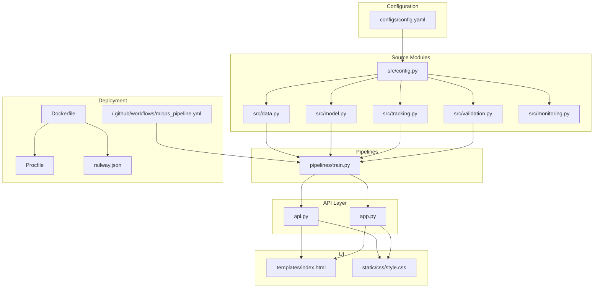

**Diagram sources**
- [config.py:10-63](file://src/config.py#L10-L63)
- [data.py:13-109](file://src/data.py#L13-L109)
- [model.py:17-155](file://src/model.py#L17-L155)
- [tracking.py:14-218](file://src/tracking.py#L14-L218)
- [validation.py:14-243](file://src/validation.py#L14-L243)
- [monitoring.py:15-218](file://src/monitoring.py#L15-L218)
- [train.py](file://pipelines/train.py)
- [api.py](file://api.py)
- [app.py](file://app.py)
- [index.html](file://templates/index.html)
- [style.css](file://static/css/style.css)
- [Dockerfile](file://Dockerfile)
- [Procfile](file://Procfile)
- [railway.json](file://railway.json)
- [.github/workflows/mlops_pipeline.yml](file://.github/workflows/mlops_pipeline.yml)

**Section sources**
- [README.md:53-98](file://README.md#L53-L98)
- [ARCHITECTURE.md:273-294](file://ARCHITECTURE.md#L273-L294)

## Core Components
This section outlines the core MLOps capabilities and their roles:

- Modular Architecture: Clean separation of configuration, data, model, tracking, validation, and monitoring modules enables maintainability and testability.
- Automated Training Pipeline: End-to-end pipeline automates data loading, validation, preprocessing, training, evaluation, experiment tracking, and model registration.
- Experiment Tracking: Captures parameters, metrics, and artifacts per run for reproducible comparisons.
- Model Registry: Version-controlled model storage with metadata and latest model retrieval.
- Data Validation: Schema and quality checks, plus drift detection between reference and current data.
- Performance Monitoring: Structured logging for predictions, performance metrics, drift alerts, and model degradation.
- RESTful API: Flask-based endpoints for health checks, metrics, visualizations, and predictions (form and JSON).
- Data Visualizations: Visualization utilities and UI templates for insights.
- Modern UI: HTML templates and CSS for an engaging user experience.
- Comprehensive Testing: Unit tests and CI/CD integration.
- CI/CD Pipeline: GitHub Actions workflow for linting, testing, building, validating, and deploying.
- Railway Deployment Ready: Dockerfile, Procfile, railway.json, and scripts for seamless deployment.

**Section sources**
- [README.md:27-52](file://README.md#L27-L52)
- [PROJECT_SUMMARY.md:85-138](file://PROJECT_SUMMARY.md#L85-L138)

## Architecture Overview
The system architecture integrates user-facing UI/API with internal ML modules and external systems like experiment tracking and model registry.

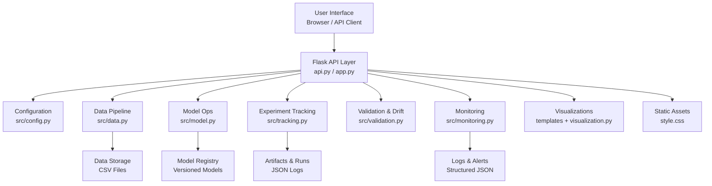

**Diagram sources**
- [ARCHITECTURE.md:3-51](file://ARCHITECTURE.md#L3-L51)
- [api.py](file://api.py)
- [app.py](file://app.py)
- [config.py:10-63](file://src/config.py#L10-L63)
- [data.py:13-109](file://src/data.py#L13-L109)
- [model.py:17-155](file://src/model.py#L17-L155)
- [tracking.py:14-218](file://src/tracking.py#L14-L218)
- [validation.py:14-243](file://src/validation.py#L14-L243)
- [monitoring.py:15-218](file://src/monitoring.py#L15-L218)
- [index.html](file://templates/index.html)
- [style.css](file://static/css/style.css)

## Detailed Component Analysis

### Configuration Management
Purpose: Centralized, environment-aware configuration via YAML.
Implementation: A Config class loads YAML, supports nested key access, and exposes typed getters for data paths, model paths, training parameters, and monitoring configuration.
Business Value: Enables easy customization without code changes, supports reproducibility across environments.

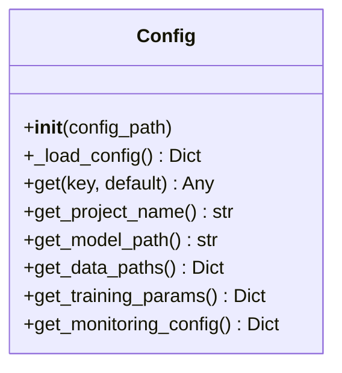

**Diagram sources**
- [config.py:10-63](file://src/config.py#L10-L63)
- [config.yaml](file://configs/config.yaml)

**Section sources**
- [config.py:10-63](file://src/config.py#L10-L63)
- [config.yaml](file://configs/config.yaml)

### Data Pipeline
Purpose: Robust data loading, preprocessing, and splitting.
Implementation: DataLoader reads CSV, DataPreprocessor separates features/target, splits train/test, and optionally saves processed datasets.
Business Value: Ensures reproducible data preparation and consistent dataset versions.

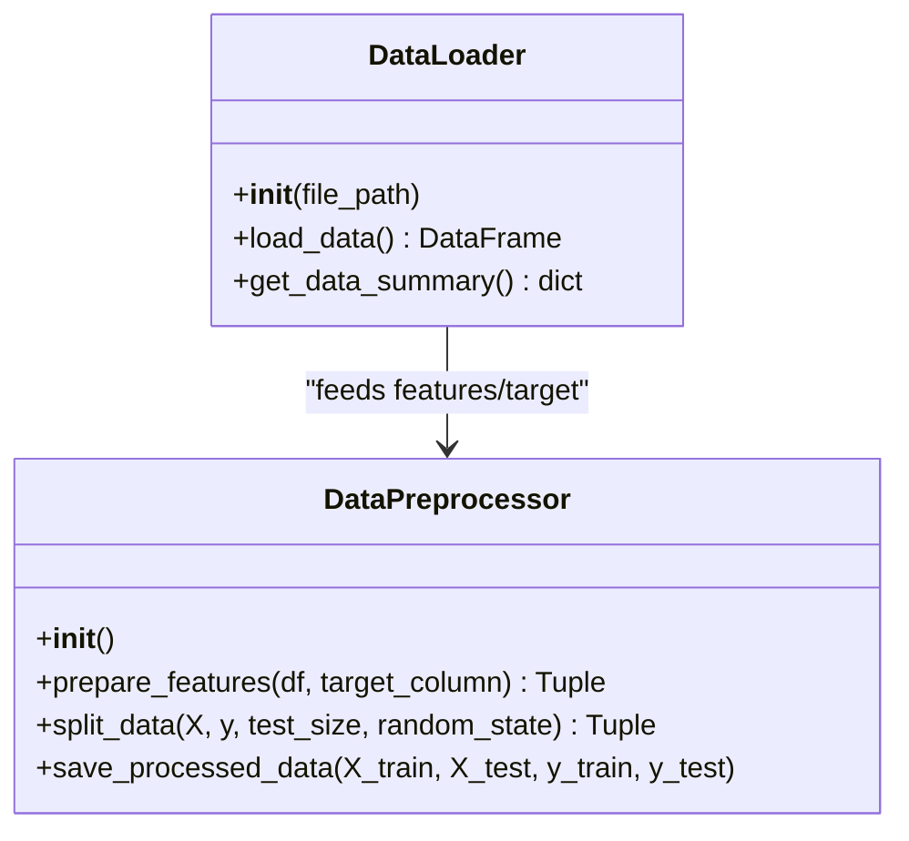

**Diagram sources**
- [data.py:13-109](file://src/data.py#L13-L109)

**Section sources**
- [data.py:13-109](file://src/data.py#L13-L109)

### Model Training and Evaluation
Purpose: Train, evaluate, save, and compare models.
Implementation: ModelTrainer creates and trains models (Linear Regression, Random Forest, Gradient Boosting), ModelEvaluator computes metrics (MAE, MSE, RMSE, R²), and supports model persistence/loading.
Business Value: Provides automated, standardized model lifecycle management with performance quantification.

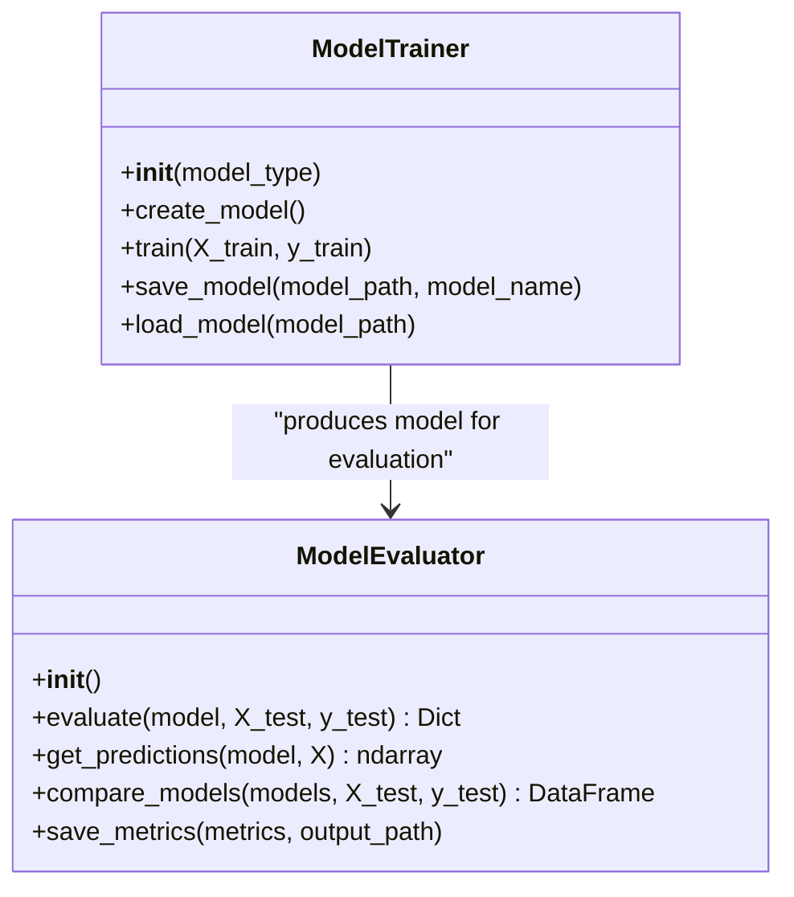

**Diagram sources**
- [model.py:17-155](file://src/model.py#L17-L155)

**Section sources**
- [model.py:17-155](file://src/model.py#L17-L155)

### Experiment Tracking
Purpose: Capture runs, parameters, metrics, and artifacts for reproducibility and comparison.
Implementation: ExperimentTracker manages run lifecycle and persists runs as JSON; supports best-run selection; ModelRegistry maintains model versions with metadata and latest model pointer.
Business Value: Enables A/B testing, auditability, and informed retraining decisions.

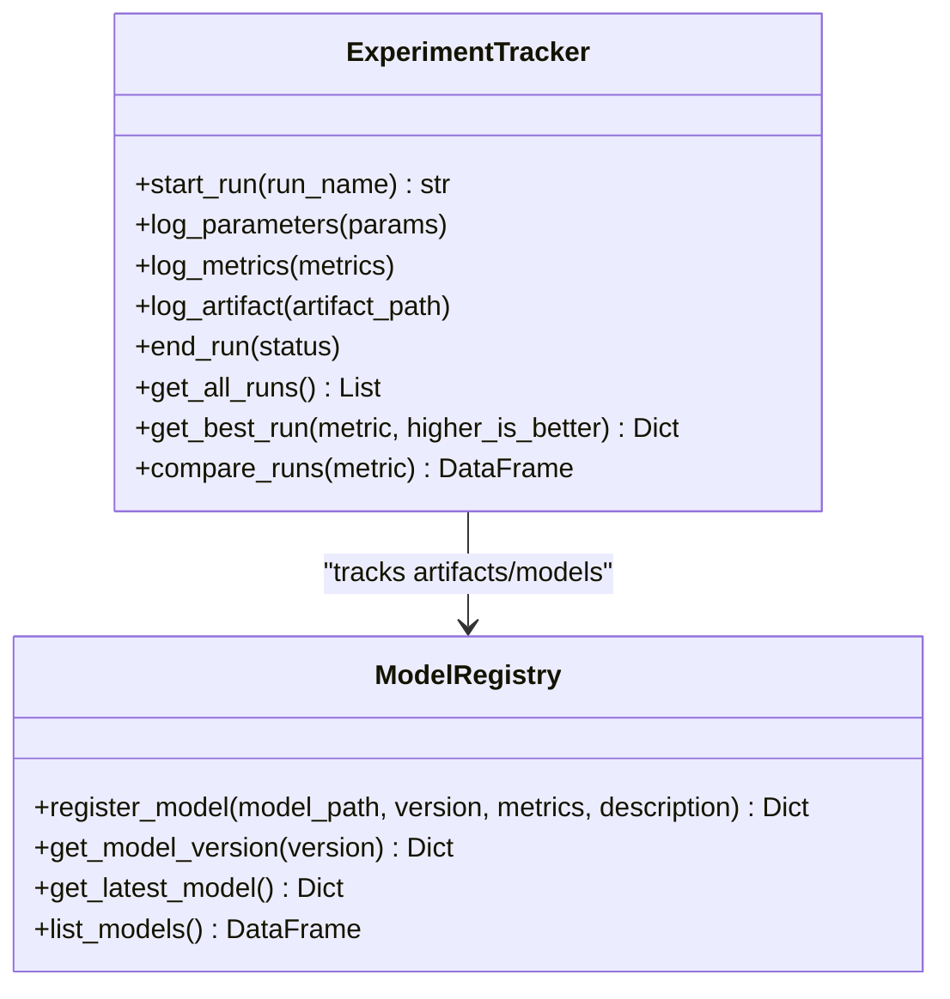

**Diagram sources**
- [tracking.py:14-218](file://src/tracking.py#L14-L218)

**Section sources**
- [tracking.py:14-218](file://src/tracking.py#L14-L218)

### Data Validation and Drift Detection
Purpose: Ensure data quality and detect distribution shifts in production.
Implementation: DataValidator performs schema and quality checks (missing values, duplicates, outliers) and computes a quality score; DriftDetector compares reference/current distributions using KS-test, PSI, or mean-shift metrics.
Business Value: Prevents degraded performance and informs proactive remediation.

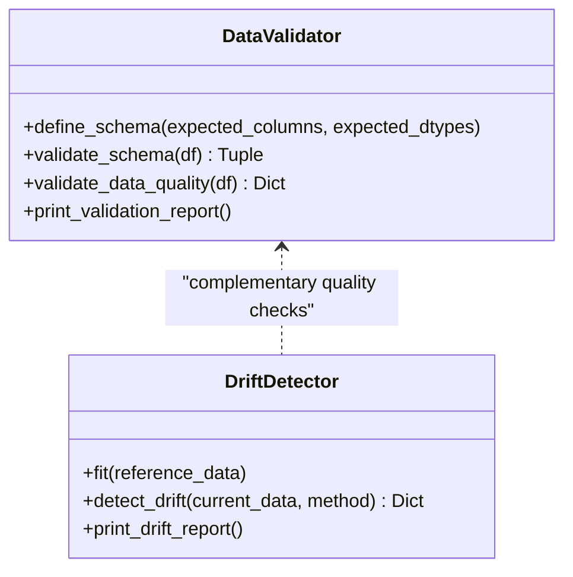

**Diagram sources**
- [validation.py:14-243](file://src/validation.py#L14-L243)

**Section sources**
- [validation.py:14-243](file://src/validation.py#L14-L243)

### Performance Monitoring
Purpose: Log predictions, performance metrics, drift alerts, and model degradation.
Implementation: MonitoringLogger writes structured logs and JSON files for predictions and performance; PerformanceMonitor compares current metrics against baselines and raises alerts.
Business Value: Enables real-time observability and automated alerting for maintenance and retraining triggers.

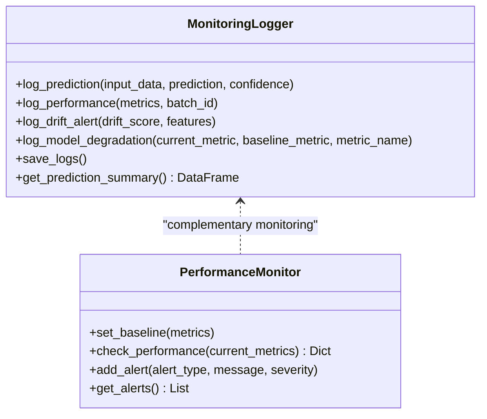

**Diagram sources**
- [monitoring.py:15-218](file://src/monitoring.py#L15-L218)

**Section sources**
- [monitoring.py:15-218](file://src/monitoring.py#L15-L218)

### Automated Training Pipeline
Purpose: End-to-end automation from data to registry.
Implementation: The training pipeline orchestrates data loading/validation/preprocessing, model training/evaluation, experiment tracking, and model registration.
Business Value: Reduces manual effort, ensures reproducibility, and accelerates iteration cycles.

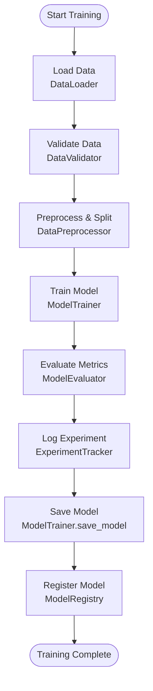

**Diagram sources**
- [data.py:13-109](file://src/data.py#L13-L109)
- [validation.py:14-243](file://src/validation.py#L14-L243)
- [model.py:17-155](file://src/model.py#L17-L155)
- [tracking.py:14-218](file://src/tracking.py#L14-L218)
- [monitoring.py:15-218](file://src/monitoring.py#L15-L218)

**Section sources**
- [MLOPS_WORKFLOW.md:48-63](file://MLOPS_WORKFLOW.md#L48-L63)
- [train.py](file://pipelines/train.py)

### RESTful API and UI
Purpose: Serve predictions and insights via a modern web interface.
Implementation: Flask routes expose health, metrics, visualizations, and prediction endpoints; templates and CSS provide the UI; Railway-ready Procfile and Dockerfile enable deployment.
Business Value: Delivers a production-grade, user-friendly interface for stakeholders and developers.

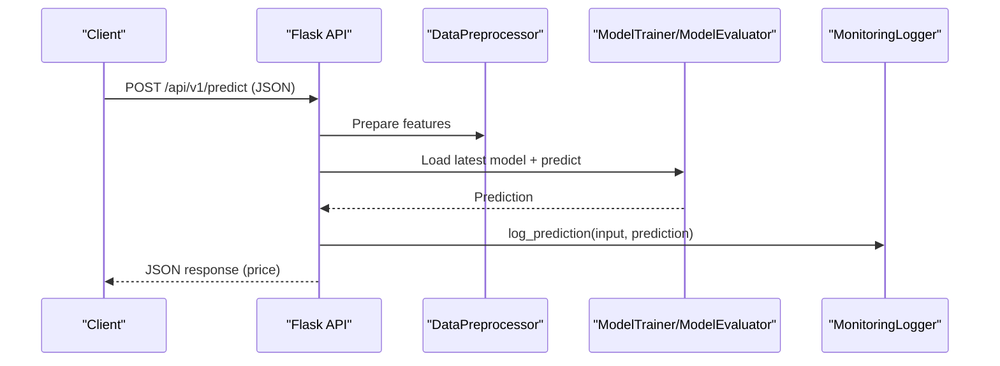

**Diagram sources**
- [api.py](file://api.py)
- [app.py](file://app.py)
- [data.py:45-109](file://src/data.py#L45-L109)
- [model.py:17-155](file://src/model.py#L17-L155)
- [monitoring.py:15-218](file://src/monitoring.py#L15-L218)

**Section sources**
- [README.md:391-434](file://README.md#L391-L434)
- [index.html](file://templates/index.html)
- [style.css](file://static/css/style.css)

### Data Visualizations
Purpose: Enable exploratory analysis and dashboarding.
Implementation: Visualization utilities and templates integrate with the UI to render charts and summaries.
Business Value: Improves interpretability and supports data-driven decisions.

**Section sources**
- [README.md:391-434](file://README.md#L391-L434)
- [visualization.py](file://visualization.py)

### Testing Suite
Purpose: Ensure correctness and reliability across components.
Implementation: Pytest-based tests cover configuration, data, model, validation, and drift detection; Makefile targets simplify running tests and coverage.
Business Value: Catches regressions early and supports continuous delivery.

**Section sources**
- [README.md:451-465](file://README.md#L451-L465)
- [test_components.py](file://tests/test_components.py)

### CI/CD Pipeline
Purpose: Automate quality gates and deployments.
Implementation: GitHub Actions workflow executes linting, tests, type checks, Docker builds, model validation, staging/prod deployments.
Business Value: Reduces risk, accelerates feedback loops, and enforces standards.

**Section sources**
- [README.md:467-489](file://README.md#L467-L489)
- [.github/workflows/mlops_pipeline.yml](file://.github/workflows/mlops_pipeline.yml)

### Railway Deployment Readiness
Purpose: Simplify cloud deployment.
Implementation: Dockerfile, Procfile, railway.json, and deployment scripts streamline Railway setup; environment variables and logs are supported out-of-the-box.
Business Value: Enables zero-friction production deployments with scaling and monitoring.

**Section sources**
- [README.md:200-269](file://README.md#L200-L269)
- [Dockerfile](file://Dockerfile)
- [Procfile](file://Procfile)
- [railway.json](file://railway.json)

## Dependency Analysis
The modules exhibit low coupling and high cohesion, with centralized configuration guiding behavior across components.

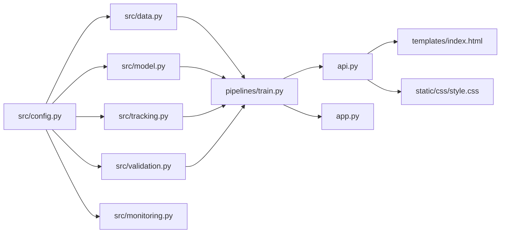

**Diagram sources**
- [config.py:10-63](file://src/config.py#L10-L63)
- [data.py:13-109](file://src/data.py#L13-L109)
- [model.py:17-155](file://src/model.py#L17-L155)
- [tracking.py:14-218](file://src/tracking.py#L14-L218)
- [validation.py:14-243](file://src/validation.py#L14-L243)
- [monitoring.py:15-218](file://src/monitoring.py#L15-L218)
- [train.py](file://pipelines/train.py)
- [api.py](file://api.py)
- [app.py](file://app.py)
- [index.html](file://templates/index.html)
- [style.css](file://static/css/style.css)

**Section sources**
- [ARCHITECTURE.md:88-149](file://ARCHITECTURE.md#L88-L149)

## Performance Considerations
- Model Persistence: Use efficient serialization (joblib) for scikit-learn models to reduce load times.
- Logging: Structured JSON logs improve parsing and downstream analytics; consider asynchronous logging for high-throughput APIs.
- Drift Detection: Choose appropriate methods (KS-test vs PSI) depending on data characteristics and computational budget.
- API Scaling: Use Gunicorn with multiple workers in production; consider caching frequent predictions and optimizing model loading.
- Data I/O: Persist processed datasets to avoid repeated preprocessing; validate schema early to fail fast.

[No sources needed since this section provides general guidance]

## Troubleshooting Guide
Common issues and resolutions:
- Port conflicts: Adjust the API port in configuration.
- Model not found: Train a model using the pipeline before starting the API.
- Test failures: Reinstall development dependencies and rerun tests.
- Drift alerts: Investigate feature distributions and consider retraining with recent data.
- API slowness: Increase workers, optimize model loading, and add caching.

**Section sources**
- [QUICKSTART.md:89-113](file://QUICKSTART.md#L89-L113)
- [MLOPS_WORKFLOW.md:361-382](file://MLOPS_WORKFLOW.md#L361-L382)

## Conclusion
The House Price Prediction MLOps project delivers a comprehensive, production-ready system combining modular architecture, automated pipelines, robust experiment tracking, model registry, data validation, drift detection, performance monitoring, RESTful API, visualizations, modern UI, testing, CI/CD, and Railway deployment readiness. These capabilities collectively ensure reproducibility, observability, scalability, and ease of operation for real-world ML applications.

[No sources needed since this section summarizes without analyzing specific files]

## Appendices

### Practical Examples and Integration Patterns
- Training a model: Use the Makefile target or invoke the training pipeline directly.
- Experiment tracking: Start runs, log parameters and metrics, and retrieve best runs.
- Model registry: Register versions with metrics and retrieve the latest model.
- Data validation: Validate schema and quality, then print reports.
- Drift detection: Fit reference statistics and detect drift in current data.
- Monitoring: Log predictions and performance; configure baseline thresholds.
- API usage: Health checks, metrics, visualizations, and prediction endpoints.
- UI customization: Extend templates and styles for dashboards and visualizations.
- CI/CD: Trigger workflows on pushes; run all checks locally via Makefile.
- Deployment: Build Docker image, run container, or deploy to Railway using provided artifacts.

**Section sources**
- [README.md:100-181](file://README.md#L100-L181)
- [MLOPS_WORKFLOW.md:65-208](file://MLOPS_WORKFLOW.md#L65-L208)
- [Makefile](file://Makefile)