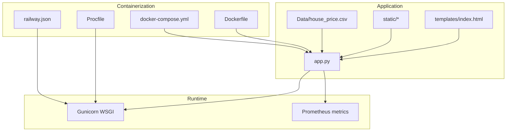
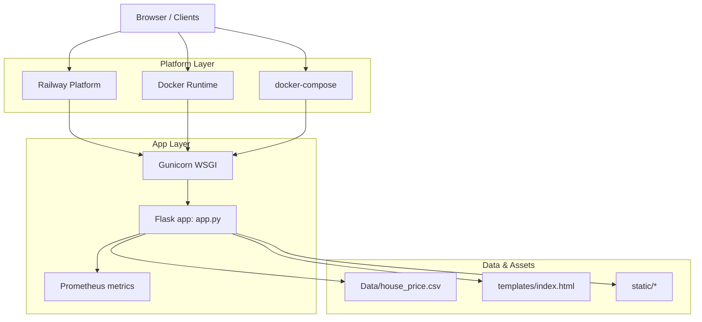
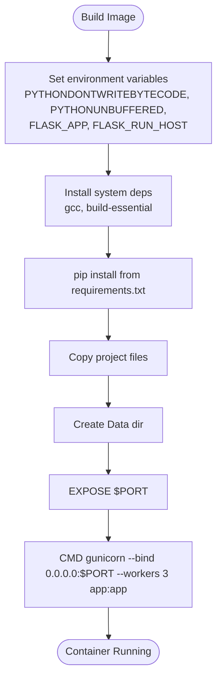
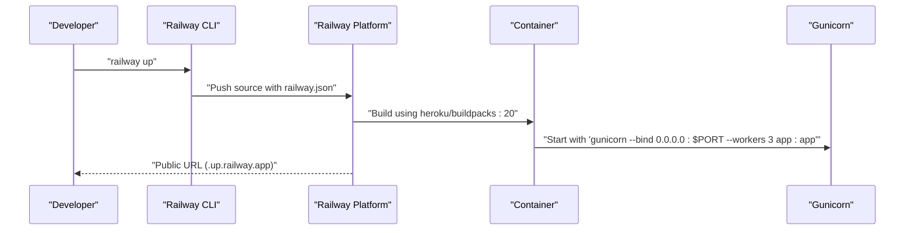
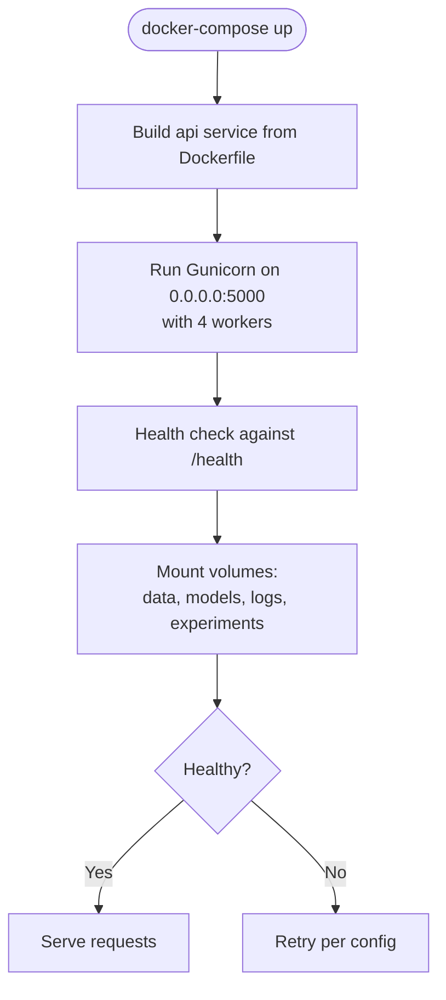
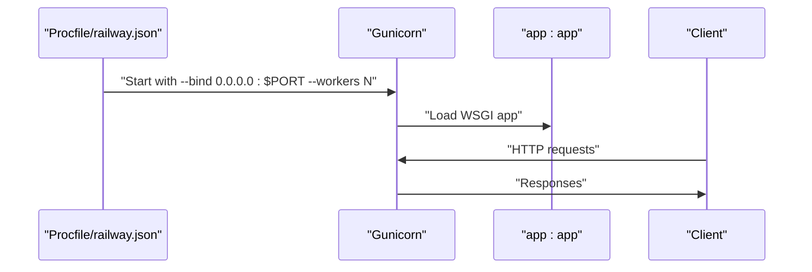
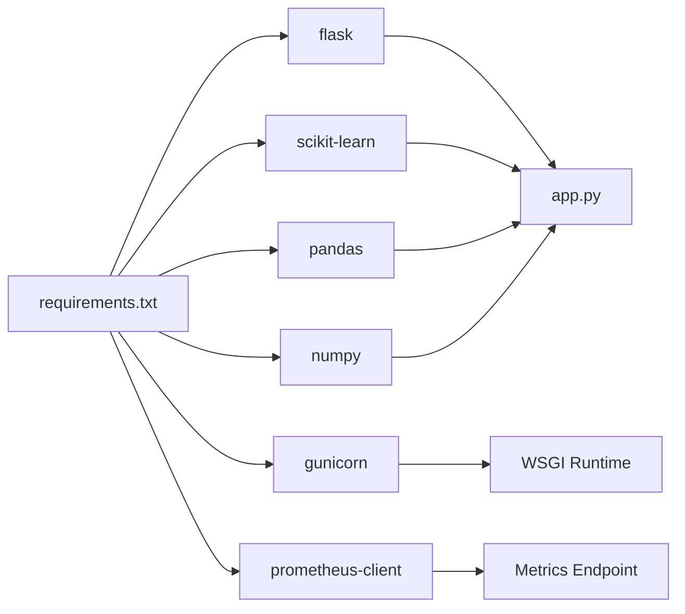

# Deployment and Production Readiness

<cite>
**Referenced Files in This Document**
- [Dockerfile](file://House_Price_Prediction-main/housing1/Dockerfile)
- [docker-compose.yml](file://House_Price_Prediction-main/housing1/docker-compose.yml)
- [Procfile](file://House_Price_Prediction-main/housing1/Procfile)
- [railway.json](file://House_Price_Prediction-main/housing1/railway.json)
- [DEPLOYMENT_GUIDE.md](file://House_Price_Prediction-main/housing1/DEPLOYMENT_GUIDE.md)
- [RAILWAY_DEPLOYMENT.md](file://House_Price_Prediction-main/housing1/RAILWAY_DEPLOYMENT.md)
- [DEPLOYMENT_COMPLETE.md](file://House_Price_Prediction-main/housing1/DEPLOYMENT_COMPLETE.md)
- [requirements.txt](file://House_Price_Prediction-main/housing1/requirements.txt)
</cite>

## Table of Contents
1. [Introduction](#introduction)
2. [Project Structure](#project-structure)
3. [Core Components](#core-components)
4. [Architecture Overview](#architecture-overview)
5. [Detailed Component Analysis](#detailed-component-analysis)
6. [Dependency Analysis](#dependency-analysis)
7. [Performance Considerations](#performance-considerations)
8. [Troubleshooting Guide](#troubleshooting-guide)
9. [Conclusion](#conclusion)
10. [Appendices](#appendices)

## Introduction
This document provides comprehensive deployment and production readiness guidance for the House Price Prediction application. It covers containerization with Docker multi-stage-like practices, Railway deployment, production-grade WSGI configuration with Gunicorn, environment and secrets management, monitoring and logging, health checks, security considerations, validation and rollback strategies, and CI/CD integration.

## Project Structure
The repository includes production-ready deployment assets:
- Containerization: Dockerfile defines the runtime environment and binds to a dynamic port.
- Process orchestration: Procfile declares the WSGI command for platforms like Railway.
- Platform configuration: railway.json configures the builder and start command.
- Compose-based local orchestration: docker-compose.yml defines service health checks and persistent volumes.
- Dependencies: requirements.txt lists Flask, ML libraries, Prometheus client, and Gunicorn.

**Diagram sources**
- [Dockerfile:1-39](file://House_Price_Prediction-main/housing1/Dockerfile#L1-L39)
- [docker-compose.yml:1-52](file://House_Price_Prediction-main/housing1/docker-compose.yml#L1-L52)
- [Procfile:1-1](file://House_Price_Prediction-main/housing1/Procfile#L1-L1)
- [railway.json:1-20](file://House_Price_Prediction-main/housing1/railway.json#L1-L20)

**Section sources**
- [Dockerfile:1-39](file://House_Price_Prediction-main/housing1/Dockerfile#L1-L39)
- [docker-compose.yml:1-52](file://House_Price_Prediction-main/housing1/docker-compose.yml#L1-L52)
- [Procfile:1-1](file://House_Price_Prediction-main/housing1/Procfile#L1-L1)
- [railway.json:1-20](file://House_Price_Prediction-main/housing1/railway.json#L1-L20)
- [requirements.txt:1-24](file://House_Price_Prediction-main/housing1/requirements.txt#L1-L24)

## Core Components
- Docker image definition and runtime binding to a dynamic port via environment variables.
- Gunicorn WSGI server configured with worker count and host/port binding.
- Railway-specific configuration for build and start commands.
- Compose-based service with health checks and persistent storage for data, models, logs, and experiments.
- Dependencies pinned for Flask, ML libraries, Prometheus client, and Gunicorn.

Key production-readiness elements:
- Dynamic port binding via environment variables.
- Persistent volumes for models, logs, and experiments.
- Health check endpoint usage in compose.
- Gunicorn workers configured for concurrency.

**Section sources**
- [Dockerfile:34-39](file://House_Price_Prediction-main/housing1/Dockerfile#L34-L39)
- [docker-compose.yml:17-23](file://House_Price_Prediction-main/housing1/docker-compose.yml#L17-L23)
- [Procfile:1-1](file://House_Price_Prediction-main/housing1/Procfile#L1-L1)
- [railway.json:5-8](file://House_Price_Prediction-main/housing1/railway.json#L5-L8)
- [requirements.txt:19-20](file://House_Price_Prediction-main/housing1/requirements.txt#L19-L20)

## Architecture Overview
The production architecture centers on a containerized Flask application served by Gunicorn. Railway and docker-compose provide deployment and orchestration layers, while Prometheus metrics are integrated for observability.

**Diagram sources**
- [Dockerfile:34-39](file://House_Price_Prediction-main/housing1/Dockerfile#L34-L39)
- [Procfile:1-1](file://House_Price_Prediction-main/housing1/Procfile#L1-L1)
- [railway.json:5-8](file://House_Price_Prediction-main/housing1/railway.json#L5-L8)
- [docker-compose.yml:16-23](file://House_Price_Prediction-main/housing1/docker-compose.yml#L16-L23)

## Detailed Component Analysis

### Docker Containerization
- Base image: Python slim with build-essential for compilation needs.
- Environment variables:
  - Bytecode and buffering disabled for deterministic logs and Python behavior.
  - Flask app entrypoint and host binding.
- System dependencies: gcc and build-essential installed for compiled packages.
- Python dependencies: installed from requirements.txt.
- Working directory and project copy.
- Data directory creation at runtime.
- Port exposure via environment variable.
- Application startup via Gunicorn with host, port, and worker count.

**Diagram sources**
- [Dockerfile:6-39](file://House_Price_Prediction-main/housing1/Dockerfile#L6-L39)

**Section sources**
- [Dockerfile:1-39](file://House_Price_Prediction-main/housing1/Dockerfile#L1-L39)

### Railway Deployment
- Builder: Heroku buildpacks base.
- Start command: Gunicorn bound to $PORT with 3 workers.
- Filesystem filtering excludes unnecessary files.
- Railway automatically manages PORT and environment variables.

**Diagram sources**
- [railway.json:2-8](file://House_Price_Prediction-main/housing1/railway.json#L2-L8)
- [Procfile:1-1](file://House_Price_Prediction-main/housing1/Procfile#L1-L1)

**Section sources**
- [RAILWAY_DEPLOYMENT.md:1-204](file://House_Price_Prediction-main/housing1/RAILWAY_DEPLOYMENT.md#L1-L204)
- [railway.json:1-20](file://House_Price_Prediction-main/housing1/railway.json#L1-L20)

### docker-compose Orchestration
- Service: api with build context and port mapping.
- Environment: production mode and config path.
- Volumes: persistent storage for data, models, logs, experiments.
- Health check: probes the /health endpoint with retries and start period.
- Restart policy: unless-stopped.
- Gunicorn command: bind to 0.0.0.0:5000 with 4 workers.

**Diagram sources**
- [docker-compose.yml:4-23](file://House_Price_Prediction-main/housing1/docker-compose.yml#L4-L23)

**Section sources**
- [docker-compose.yml:1-52](file://House_Price_Prediction-main/housing1/docker-compose.yml#L1-L52)

### Gunicorn WSGI Configuration
- Workers: configured via command-line arguments in Procfile and railway.json.
- Bind address: 0.0.0.0 for external access.
- Port: dynamic via $PORT environment variable.
- Production readiness: workers tuned for CPU cores; combined with containerization for horizontal scaling.

**Diagram sources**
- [Procfile:1-1](file://House_Price_Prediction-main/housing1/Procfile#L1-L1)
- [railway.json:6-6](file://House_Price_Prediction-main/housing1/railway.json#L6-L6)

**Section sources**
- [Procfile:1-1](file://House_Price_Prediction-main/housing1/Procfile#L1-L1)
- [railway.json:6-6](file://House_Price_Prediction-main/housing1/railway.json#L6-L6)
- [requirements.txt:20-20](file://House_Price_Prediction-main/housing1/requirements.txt#L20-L20)

### Environment Variable Management and Secrets
- Dynamic port: $PORT is used in both Dockerfile and Railway configuration.
- Config path: configurable via environment variable for application configuration.
- Recommendations:
  - Store secrets in platform-provided secret stores (Railway variables).
  - Mount secrets as files or environment variables depending on platform.
  - Avoid committing secrets to source control.

**Section sources**
- [Dockerfile:35-35](file://House_Price_Prediction-main/housing1/Dockerfile#L35-L35)
- [railway.json:6-6](file://House_Price_Prediction-main/housing1/railway.json#L6-L6)
- [docker-compose.yml:8-10](file://House_Price_Prediction-main/housing1/docker-compose.yml#L8-L10)

### Monitoring Setup and Logging
- Prometheus client included in dependencies for metrics collection.
- Health check endpoint: used in docker-compose healthcheck against /health.
- Recommendations:
  - Expose a /metrics endpoint using the Prometheus client.
  - Centralize logs to stdout/stderr for container platforms.
  - Use structured logging with correlation IDs for traceability.

**Section sources**
- [requirements.txt:17-17](file://House_Price_Prediction-main/housing1/requirements.txt#L17-L17)
- [docker-compose.yml:17-21](file://House_Price_Prediction-main/housing1/docker-compose.yml#L17-L21)

### Security Considerations, SSL/TLS, and Access Control
- SSL/TLS:
  - Terminate TLS at the platform ingress or a reverse proxy in front of the container.
  - Use HTTPS URLs provided by Railway for public endpoints.
- Access control:
  - Restrict access to internal endpoints (e.g., /metrics) behind VPN or platform-level access policies.
  - Add basic authentication or API keys if exposing administrative endpoints.
- Hardening:
  - Run as non-root user inside the container.
  - Pin dependency versions and scan images regularly.

**Section sources**
- [RAILWAY_DEPLOYMENT.md:148-150](file://House_Price_Prediction-main/housing1/RAILWAY_DEPLOYMENT.md#L148-L150)

### Deployment Validation and Rollback Strategies
- Validation:
  - Confirm application responds to GET / and returns expected HTML.
  - Verify model training and predictions via sample inputs.
  - Check health endpoint for readiness.
- Rollback:
  - Railway supports redeploying previous successful builds.
  - Use immutable tags and blue/green deployments for zero-downtime rollbacks.

**Section sources**
- [DEPLOYMENT_GUIDE.md:147-161](file://House_Price_Prediction-main/housing1/DEPLOYMENT_GUIDE.md#L147-L161)
- [docker-compose.yml:17-21](file://House_Price_Prediction-main/housing1/docker-compose.yml#L17-L21)

### CI/CD Pipeline Integration
- Recommended flow:
  - Build: docker build with cache optimization.
  - Test: run unit tests and linting.
  - Scan: image vulnerability scanning.
  - Push: tagged image to registry.
  - Deploy: apply manifests or trigger platform deployment.
- Railway:
  - Connect repository for automatic deployments on push.
  - Use Railway variables for environment-specific configuration.

**Section sources**
- [RAILWAY_DEPLOYMENT.md:152-158](file://House_Price_Prediction-main/housing1/RAILWAY_DEPLOYMENT.md#L152-L158)

## Dependency Analysis
The application’s runtime stack relies on Flask, ML libraries, and Gunicorn. The Dockerfile installs dependencies from requirements.txt, and Railway uses a builder compatible with Python applications.

**Diagram sources**
- [requirements.txt:1-24](file://House_Price_Prediction-main/housing1/requirements.txt#L1-L24)
- [Dockerfile:25-26](file://House_Price_Prediction-main/housing1/Dockerfile#L25-L26)

**Section sources**
- [requirements.txt:1-24](file://House_Price_Prediction-main/housing1/requirements.txt#L1-L24)
- [Dockerfile:22-26](file://House_Price_Prediction-main/housing1/Dockerfile#L22-L26)

## Performance Considerations
- Worker tuning:
  - Adjust Gunicorn worker count based on CPU cores and memory.
  - Use multiple workers behind a load balancer for horizontal scaling.
- Container sizing:
  - Allocate sufficient CPU/memory limits to avoid throttling.
- Model inference:
  - Cache preprocessed data and reuse model artifacts across requests.
- Observability:
  - Track latency, error rates, and throughput via Prometheus metrics.

[No sources needed since this section provides general guidance]

## Troubleshooting Guide
Common issues and resolutions:
- Module or file not found errors: ensure dependencies are installed and data files exist.
- Permission denied on port: change port or run with elevated privileges.
- Port already in use: identify and terminate the process occupying the port.
- Application crashes after deployment: inspect platform logs and verify environment variables and file paths.

**Section sources**
- [DEPLOYMENT_GUIDE.md:129-146](file://House_Price_Prediction-main/housing1/DEPLOYMENT_GUIDE.md#L129-L146)
- [RAILWAY_DEPLOYMENT.md:124-144](file://House_Price_Prediction-main/housing1/RAILWAY_DEPLOYMENT.md#L124-L144)

## Conclusion
The House Price Prediction application is production-ready with containerization, Gunicorn WSGI, health checks, and Railway deployment support. By following the outlined practices—secure configuration, observability, validation, and CI/CD—you can reliably operate the application at scale.

[No sources needed since this section summarizes without analyzing specific files]

## Appendices

### Appendix A: Railway Deployment Step-by-Step
- Install Railway CLI and log in.
- Initialize and link the project.
- Deploy using railway up.
- Monitor logs and manage environment variables via the CLI.

**Section sources**
- [RAILWAY_DEPLOYMENT.md:14-44](file://House_Price_Prediction-main/housing1/RAILWAY_DEPLOYMENT.md#L14-L44)

### Appendix B: Local Production Simulation with docker-compose
- Build and start services.
- Verify health checks and persistent volume mounts.
- Scale workers as needed and monitor resource usage.

**Section sources**
- [docker-compose.yml:1-52](file://House_Price_Prediction-main/housing1/docker-compose.yml#L1-L52)

### Appendix C: Environment Variables Reference
- PORT: dynamically assigned by platform; used by Gunicorn and Flask.
- CONFIG_PATH: path to application configuration file.
- FLASK_ENV: set to production for production deployments.

**Section sources**
- [Dockerfile:10-10](file://House_Price_Prediction-main/housing1/Dockerfile#L10-L10)
- [docker-compose.yml:8-10](file://House_Price_Prediction-main/housing1/docker-compose.yml#L8-L10)