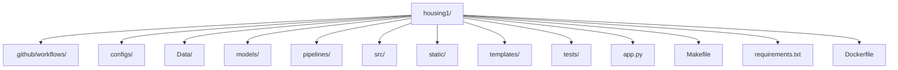
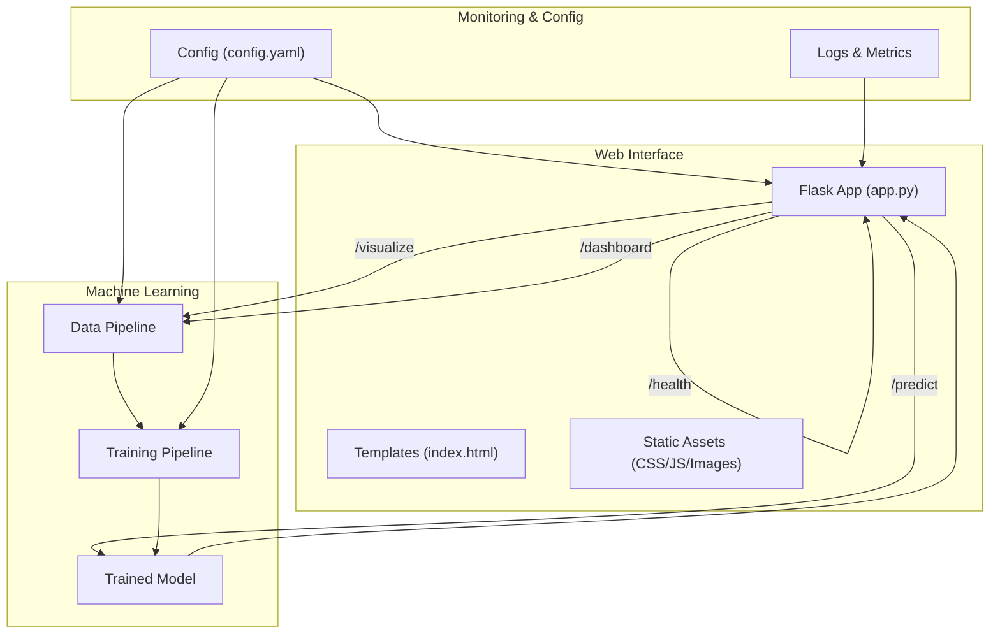

# Getting Started Guide

<cite>
**Referenced Files in This Document**
- [README.md](file://House_Price_Prediction-main/housing1/README.md)
- [SETUP.md](file://House_Price_Prediction-main/housing1/SETUP.md)
- [QUICKSTART.md](file://House_Price_Prediction-main/housing1/QUICKSTART.md)
- [Makefile](file://House_Price_Prediction-main/housing1/Makefile)
- [pyproject.toml](file://House_Price_Prediction-main/housing1/pyproject.toml)
- [requirements.txt](file://House_Price_Prediction-main/housing1/requirements.txt)
- [app.py](file://House_Price_Prediction-main/housing1/app.py)
- [main.py](file://House_Price_Prediction-main/housing1/main.py)
</cite>

## Table of Contents
1. [Introduction](#introduction)
2. [Project Structure](#project-structure)
3. [Prerequisites](#prerequisites)
4. [Step-by-Step Installation](#step-by-step-installation)
5. [Quick Start Examples](#quick-start-examples)
6. [First Prediction Tutorial](#first-prediction-tutorial)
7. [Makefile Commands Reference](#makefile-commands-reference)
8. [Operating System Specific Instructions](#operating-system-specific-instructions)
9. [Verification Steps](#verification-steps)
10. [Troubleshooting Guide](#troubleshooting-guide)
11. [Architecture Overview](#architecture-overview)
12. [Conclusion](#conclusion)

## Introduction
This guide helps you quickly set up and run the House Price Prediction MLOps project. You will install prerequisites, create a virtual environment, install dependencies, initialize the project, train a model, run the API, and access the web interface. The project supports both development and production modes and includes Docker support for containerized deployment.

## Project Structure
The project follows a modular MLOps layout with separate directories for data, models, pipelines, source code, configuration, tests, and web assets.



**Diagram sources**
- [README.md:53-98](file://House_Price_Prediction-main/housing1/README.md#L53-L98)

**Section sources**
- [README.md:53-98](file://House_Price_Prediction-main/housing1/README.md#L53-L98)

## Prerequisites
Ensure you have the following installed on your system:
- Python 3.10 or higher
- pip package manager
- Git
- Docker (optional, for containerization)

**Section sources**
- [README.md:121-125](file://House_Price_Prediction-main/housing1/README.md#L121-L125)
- [SETUP.md:3-11](file://House_Price_Prediction-main/housing1/SETUP.md#L3-L11)

## Step-by-Step Installation
Follow these steps to install and set up the project:

1. **Clone the repository**
   ```bash
   git clone <your-repo-url>
   cd housing1
   ```

2. **Create a virtual environment (recommended)**
   - Windows:
     ```bash
     python -m venv venv
     venv\Scripts\activate
     ```
   - macOS/Linux:
     ```bash
     python3 -m venv venv
     source venv/bin/activate
     ```

3. **Install dependencies**
   - Recommended: use Makefile
     ```bash
     make install
     ```
   - Manual installation:
     ```bash
     pip install -r requirements.txt
     pip install -r requirements-dev.txt
     ```

4. **Initialize project structure**
   ```bash
   make setup
   ```

5. **Verify installation**
   ```bash
   make test
   ```

**Section sources**
- [README.md:126-156](file://House_Price_Prediction-main/housing1/README.md#L126-L156)
- [SETUP.md:12-60](file://House_Price_Prediction-main/housing1/SETUP.md#L12-L60)

## Quick Start Examples
Execute these commands to quickly get the system running:

- Train a model:
  ```bash
  make train
  ```

- Start the API server (development):
  ```bash
  make api
  ```

- Visit the web interface:
  ```
  http://localhost:5000
  ```

- Alternatively, use Docker:
  ```bash
  docker-compose up --build
  ```

**Section sources**
- [README.md:100-117](file://House_Price_Prediction-main/housing1/README.md#L100-L117)
- [QUICKSTART.md:21-37](file://House_Price_Prediction-main/housing1/QUICKSTART.md#L21-L37)

## First Prediction Tutorial
Perform your first prediction using the web interface or REST API:

1. **Web Form Prediction**
   - Open the browser and navigate to `http://localhost:5000`
   - Fill in form fields (Area, Bedrooms, Bathrooms, Stories, Parking, Age, Location)
   - Submit the form to see the predicted house price

2. **REST API Prediction**
   - Send a POST request to `/api/v1/predict` with JSON payload containing the same feature fields
   - Example payload keys: Area, Bedrooms, Bathrooms, Stories, Parking, Age, Location
   - Expected response: predicted house price value

3. **Health Check**
   - Verify the service is running:
     ```bash
     curl http://localhost:5000/health
     ```

**Section sources**
- [README.md:183-198](file://House_Price_Prediction-main/housing1/README.md#L183-L198)
- [QUICKSTART.md:50-68](file://House_Price_Prediction-main/housing1/QUICKSTART.md#L50-L68)

## Makefile Commands Reference
Common Makefile targets for development and operations:

- `make install`: Install production and development dependencies
- `make setup`: Create required directories (data/raw, data/processed, models, artifacts, logs, experiments)
- `make train`: Run the training pipeline
- `make api`: Start the development API server
- `make api-prod`: Start the production API server using Gunicorn
- `make test`: Run unit tests
- `make test-cov`: Run tests with coverage report
- `make lint`: Run code linting (flake8)
- `make type-check`: Run type checking (mypy)
- `make format`: Auto-format code (black, isort)
- `make docker-build`: Build Docker image
- `make docker-run`: Run Docker container
- `make docker-stop`: Stop running containers
- `make clean`: Clean cached files and generated artifacts
- `make health`: Health check for the API

Additional MLOps targets:
- `make validate-data`: Validate data quality
- `make register-model`: List registered models
- `make monitor`: Show monitoring logs location
- `make experiments`: List experiment runs
- `make best-experiment`: Show best experiment by metric
- `make ci`: Run CI checks (lint, test, type-check)
- `make cd`: Prepare CD pipeline (Docker build)
- `make version`: Print project version

**Section sources**
- [Makefile:1-159](file://House_Price_Prediction-main/housing1/Makefile#L1-L159)

## Operating System Specific Instructions
- **Windows**
  - Virtual environment activation:
    ```cmd
    venv\Scripts\activate
    ```
  - Port configuration: Update `configs/config.yaml` if port 5000 is in use
  - Docker: Use Docker Desktop or WSL2 backend

- **macOS**
  - Python 3.10+:
    ```bash
    python3 -m venv venv
    source venv/bin/activate
    ```

- **Linux**
  - Same as macOS; ensure Python 3.10+ and pip are available

**Section sources**
- [SETUP.md:21-33](file://House_Price_Prediction-main/housing1/SETUP.md#L21-L33)
- [QUICKSTART.md:89-102](file://House_Price_Prediction-main/housing1/QUICKSTART.md#L89-L102)

## Verification Steps
To ensure proper installation and initial functionality:

1. **Run tests**
   ```bash
   make test
   ```

2. **Train a model**
   ```bash
   make train
   ```

3. **Start API and health check**
   ```bash
   make api
   # In another terminal
   curl http://localhost:5000/health
   ```

4. **Open web interface**
   - Navigate to `http://localhost:5000` in your browser

5. **Clean up (optional)**
   ```bash
   make clean
   ```

**Section sources**
- [README.md:153-156](file://House_Price_Prediction-main/housing1/README.md#L153-L156)
- [QUICKSTART.md:50-68](file://House_Price_Prediction-main/housing1/QUICKSTART.md#L50-L68)

## Troubleshooting Guide
Common issues and resolutions:

- **Import errors**
  - Ensure the virtual environment is activated
  - Reinstall dependencies:
    ```bash
    pip install -r requirements.txt --force-reinstall
    ```

- **Port already in use**
  - Change port in `configs/config.yaml`:
    ```yaml
    api:
      port: 5001
    ```

- **Model not found**
  - Train a new model:
    ```bash
    make train
    ```

- **Tests failing**
  - Reinstall development dependencies:
    ```bash
    make install-dev
    ```

- **Docker build/run issues**
  - Build image:
    ```bash
    make docker-build
    ```
  - Run container:
    ```bash
    make docker-run
    ```

- **Code quality issues**
  - Run linters and type checker:
    ```bash
    make lint
    make type-check
    make format
    ```

**Section sources**
- [SETUP.md:88-111](file://House_Price_Prediction-main/housing1/SETUP.md#L88-L111)
- [QUICKSTART.md:89-108](file://House_Price_Prediction-main/housing1/QUICKSTART.md#L89-L108)

## Architecture Overview
High-level architecture showing how components interact during training, API serving, and web interface rendering.



**Diagram sources**
- [README.md:53-98](file://House_Price_Prediction-main/housing1/README.md#L53-L98)
- [app.py:1-113](file://House_Price_Prediction-main/housing1/app.py#L1-L113)

## Conclusion
You have successfully installed the House Price Prediction project, trained a model, started the API server, and accessed the web interface. Use the Makefile for efficient development workflows, refer to the troubleshooting section for common issues, and explore the MLOps components for advanced capabilities like experiment tracking, model registry, and monitoring.