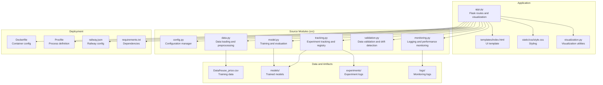
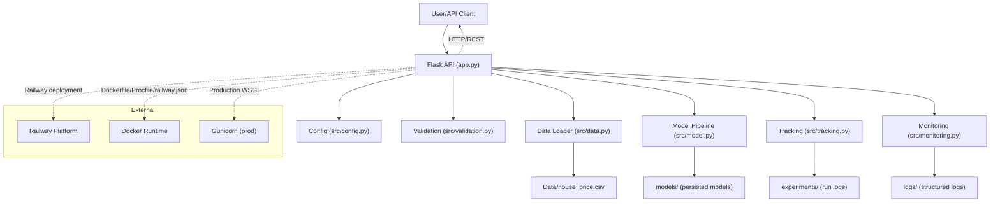
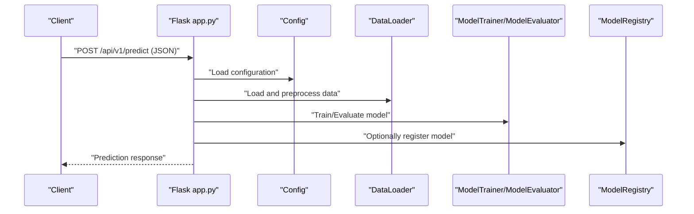
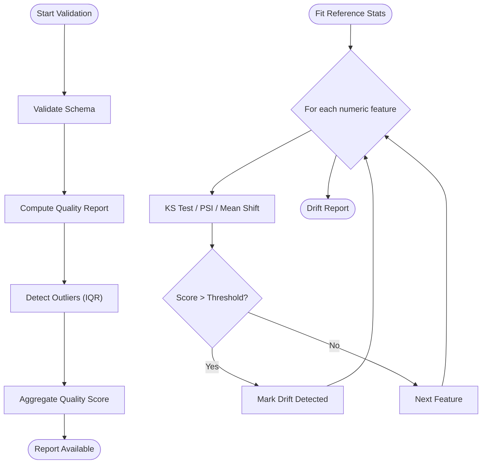
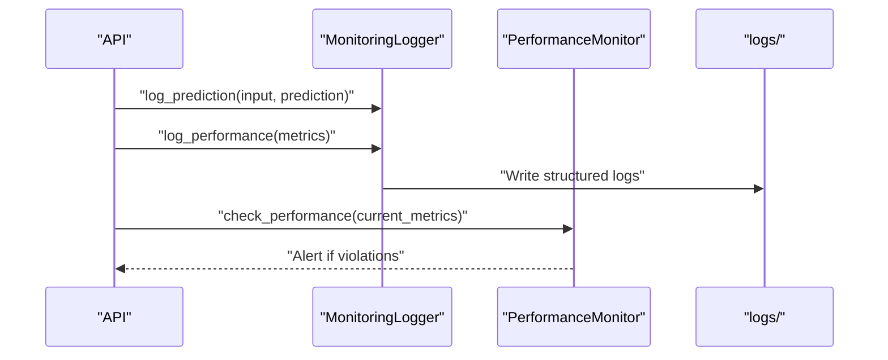
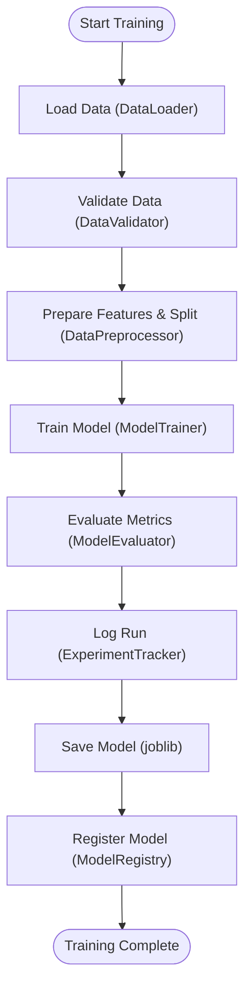
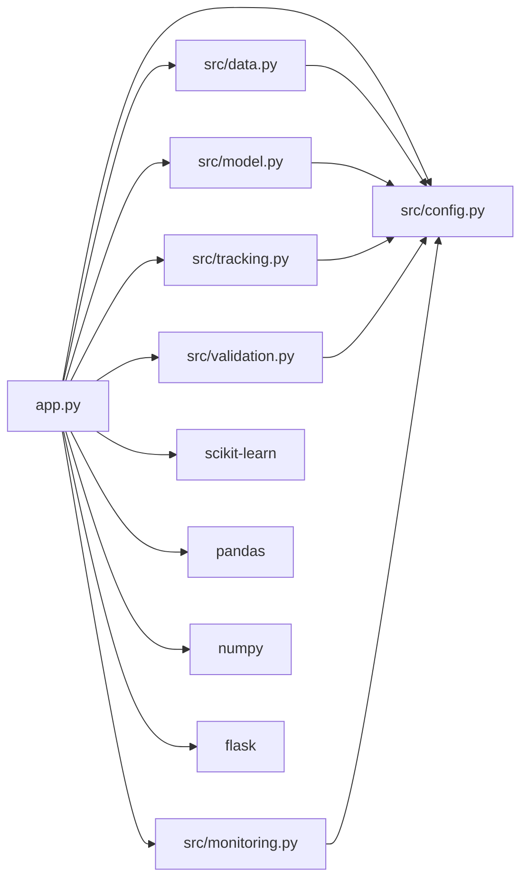

# Project Overview

<cite>
**Referenced Files in This Document**
- [README.md](file://README.md)
- [ARCHITECTURE.md](file://ARCHITECTURE.md)
- [MLOPS_WORKFLOW.md](file://MLOPS_WORKFLOW.md)
- [DEPLOYMENT_GUIDE.md](file://DEPLOYMENT_GUIDE.md)
- [app.py](file://app.py)
- [main.py](file://main.py)
- [src/config.py](file://src/config.py)
- [src/data.py](file://src/data.py)
- [src/model.py](file://src/model.py)
- [src/tracking.py](file://src/tracking.py)
- [src/validation.py](file://src/validation.py)
- [src/monitoring.py](file://src/monitoring.py)
</cite>

## Table of Contents
1. [Introduction](#introduction)
2. [Project Structure](#project-structure)
3. [Core Components](#core-components)
4. [Architecture Overview](#architecture-overview)
5. [Detailed Component Analysis](#detailed-component-analysis)
6. [Dependency Analysis](#dependency-analysis)
7. [Performance Considerations](#performance-considerations)
8. [Troubleshooting Guide](#troubleshooting-guide)
9. [Conclusion](#conclusion)
10. [Appendices](#appendices)

## Introduction
This project is a production-ready MLOps application for real estate price prediction. It combines a Flask web interface with scikit-learn machine learning, automated training pipelines, experiment tracking, model registry, data validation, drift detection, monitoring, and CI/CD integration. The system emphasizes modularity, observability, and reproducibility, enabling teams to build, deploy, monitor, and iterate on ML models efficiently.

Key capabilities include:
- Automated training pipelines with experiment tracking and model registry
- Data validation and drift detection for production robustness
- RESTful API and interactive web UI for predictions and visualizations
- Monitoring and alerting for performance and data drift
- Docker containerization and Railway deployment readiness

## Project Structure
The repository follows a modular layout separating configuration, data, ML pipelines, source code, and deployment assets. The top-level application entry points and supporting files are organized to support both local development and cloud deployment.



**Diagram sources**
- [app.py:1-109](file://app.py#L1-L109)
- [src/config.py:1-63](file://src/config.py#L1-L63)
- [src/data.py:1-109](file://src/data.py#L1-L109)
- [src/model.py:1-155](file://src/model.py#L1-L155)
- [src/tracking.py:1-218](file://src/tracking.py#L1-L218)
- [src/validation.py:1-243](file://src/validation.py#L1-L243)
- [src/monitoring.py:1-218](file://src/monitoring.py#L1-L218)

**Section sources**
- [README.md:53-98](file://README.md#L53-L98)
- [ARCHITECTURE.md:273-294](file://ARCHITECTURE.md#L273-L294)

## Core Components
This section highlights the primary building blocks that enable the MLOps workflow and production-grade features.

- Configuration Management
  - Centralized YAML configuration with nested accessors for project, data, model, and monitoring settings.
  - Provides consistent defaults and environment-aware overrides.

- Data Pipeline
  - Loads CSV data, validates schema, prepares features, splits into train/test sets, and persists processed datasets.

- Model Training and Evaluation
  - Supports multiple model types with standardized training, evaluation, and persistence via joblib.

- Experiment Tracking and Model Registry
  - Records runs with parameters, metrics, and artifacts; maintains a registry of model versions with metadata.

- Data Validation and Drift Detection
  - Validates schema and quality, computes quality scores, and detects feature drift using configurable methods.

- Monitoring and Alerts
  - Structured logging for predictions and performance; monitors degradation against baselines and emits alerts.

- Web API and UI
  - Flask routes for form-based and RESTful predictions, visualizations, and dashboards; environment-aware port binding.

**Section sources**
- [src/config.py:10-63](file://src/config.py#L10-L63)
- [src/data.py:13-109](file://src/data.py#L13-L109)
- [src/model.py:17-155](file://src/model.py#L17-L155)
- [src/tracking.py:14-218](file://src/tracking.py#L14-L218)
- [src/validation.py:14-243](file://src/validation.py#L14-L243)
- [src/monitoring.py:15-218](file://src/monitoring.py#L15-L218)
- [app.py:14-109](file://app.py#L14-L109)

## Architecture Overview
The system integrates a clean separation of concerns across modules, with explicit data and control flows for training, inference, and monitoring.



**Diagram sources**
- [app.py:14-109](file://app.py#L14-L109)
- [src/config.py:10-63](file://src/config.py#L10-L63)
- [src/data.py:13-109](file://src/data.py#L13-L109)
- [src/model.py:17-155](file://src/model.py#L17-L155)
- [src/tracking.py:14-218](file://src/tracking.py#L14-L218)
- [src/validation.py:14-243](file://src/validation.py#L14-L243)
- [src/monitoring.py:15-218](file://src/monitoring.py#L15-L218)

## Detailed Component Analysis

### Flask Web API and UI
The Flask application exposes:
- GET /: renders the main UI with prediction form and optional visualizations
- POST /predict: form-based prediction endpoint
- POST /api/v1/predict: RESTful prediction endpoint
- GET /visualize: renders correlation heatmaps, distributions, scatter plots, and performance charts
- GET /dashboard: renders an interactive dashboard
- GET /health: health check endpoint
- GET /metrics: model metrics endpoint



**Diagram sources**
- [app.py:33-62](file://app.py#L33-L62)
- [src/config.py:10-63](file://src/config.py#L10-L63)
- [src/data.py:13-109](file://src/data.py#L13-L109)
- [src/model.py:17-155](file://src/model.py#L17-L155)
- [src/tracking.py:134-218](file://src/tracking.py#L134-L218)

**Section sources**
- [app.py:33-99](file://app.py#L33-L99)
- [README.md:391-434](file://README.md#L391-L434)

### Experiment Tracking and Model Registry
The system tracks experiments with parameters, metrics, and artifacts, and maintains a registry of model versions with metadata and persisted artifacts.

```mermaid
classDiagram
class ExperimentTracker {
+start_run(run_name) str
+log_parameters(params) void
+log_metrics(metrics) void
+log_artifact(artifact_path) void
+end_run(status) void
+get_all_runs() List
+get_best_run(metric, higher_is_better) Dict
+compare_runs(metric) DataFrame
}
class ModelRegistry {
+register_model(model_path, version, metrics, description) Dict
+get_model_version(version) Dict
+get_latest_model() Dict
+list_models() DataFrame
}
ExperimentTracker --> "writes to" experiments/
ModelRegistry --> "copies model to" models/registry/
```

**Diagram sources**
- [src/tracking.py:14-218](file://src/tracking.py#L14-L218)

**Section sources**
- [src/tracking.py:14-218](file://src/tracking.py#L14-L218)
- [MLOPS_WORKFLOW.md:65-134](file://MLOPS_WORKFLOW.md#L65-L134)

### Data Validation and Drift Detection
DataValidator performs schema and quality checks, while DriftDetector compares current data against reference statistics using configurable methods.



**Diagram sources**
- [src/validation.py:14-243](file://src/validation.py#L14-L243)

**Section sources**
- [src/validation.py:14-243](file://src/validation.py#L14-L243)
- [MLOPS_WORKFLOW.md:187-208](file://MLOPS_WORKFLOW.md#L187-L208)

### Monitoring and Alerts
MonitoringLogger records predictions and performance metrics, and PerformanceMonitor evaluates current metrics against baselines to trigger alerts.



**Diagram sources**
- [src/monitoring.py:15-218](file://src/monitoring.py#L15-L218)

**Section sources**
- [src/monitoring.py:15-218](file://src/monitoring.py#L15-L218)
- [MLOPS_WORKFLOW.md:165-208](file://MLOPS_WORKFLOW.md#L165-L208)

### Training Pipeline
The training pipeline orchestrates data loading, validation, preprocessing, training, evaluation, tracking, saving, and registration.



**Diagram sources**
- [src/data.py:13-109](file://src/data.py#L13-L109)
- [src/validation.py:14-243](file://src/validation.py#L14-L243)
- [src/model.py:17-155](file://src/model.py#L17-L155)
- [src/tracking.py:14-218](file://src/tracking.py#L14-L218)

**Section sources**
- [MLOPS_WORKFLOW.md:37-64](file://MLOPS_WORKFLOW.md#L37-L64)

## Dependency Analysis
The application relies on a clear set of internal and external dependencies. Internally, modules depend on shared configuration and utilities. Externally, it leverages Flask for the web framework, scikit-learn for ML, and standard libraries for data and logging.



**Diagram sources**
- [app.py:14-109](file://app.py#L14-L109)
- [src/config.py:10-63](file://src/config.py#L10-L63)
- [src/data.py:13-109](file://src/data.py#L13-L109)
- [src/model.py:17-155](file://src/model.py#L17-L155)
- [src/tracking.py:14-218](file://src/tracking.py#L14-L218)
- [src/validation.py:14-243](file://src/validation.py#L14-L243)
- [src/monitoring.py:15-218](file://src/monitoring.py#L15-L218)

**Section sources**
- [ARCHITECTURE.md:204-228](file://ARCHITECTURE.md#L204-L228)
- [README.md:44-51](file://README.md#L44-L51)

## Performance Considerations
- Model Persistence: Uses joblib for efficient serialization of scikit-learn models.
- Logging: Structured JSON logs for performance and predictions to enable downstream analytics.
- Scalability: Designed for horizontal scaling with a WSGI server in production and containerization.
- Monitoring: Baseline thresholds and drift detection help maintain model reliability over time.

[No sources needed since this section provides general guidance]

## Troubleshooting Guide
Common issues and resolutions:
- Missing dependencies: Ensure all packages from requirements.txt are installed.
- Missing data file: Confirm Data/house_price.csv exists and is readable.
- Port conflicts: Adjust PORT or stop processes using the port.
- Model loading failures: Verify model paths and that models were saved during training.

Operational checks:
- Health endpoint: Use GET /health to verify service availability.
- Prediction test: Use curl to POST to /api/v1/predict with a valid JSON payload.
- Logs inspection: Review logs/app.log and logs/monitoring.log for errors and drift alerts.

**Section sources**
- [DEPLOYMENT_GUIDE.md:129-162](file://DEPLOYMENT_GUIDE.md#L129-L162)
- [README.md:436-450](file://README.md#L436-L450)

## Conclusion
This MLOps project demonstrates a production-ready approach to building, deploying, and monitoring a house price prediction system. Its modular architecture, comprehensive MLOps tooling, and deployment readiness make it suitable for iterative development and reliable operation in cloud environments.

[No sources needed since this section summarizes without analyzing specific files]

## Appendices

### API Endpoints Overview
- GET /: Home page with prediction form and optional visualizations
- POST /predict: Form-based prediction
- POST /api/v1/predict: RESTful prediction endpoint
- GET /health: Health check
- GET /metrics: Model metrics
- GET /visualize: Visualizations
- GET /dashboard: Interactive dashboard

**Section sources**
- [README.md:391-434](file://README.md#L391-L434)

### Deployment Options
- Local development with provided scripts
- Manual deployment with virtual environment and app.py
- Production deployment with Gunicorn
- Docker containerization with Dockerfile and Procfile
- Railway deployment with railway.json and Procfile

**Section sources**
- [DEPLOYMENT_GUIDE.md:7-216](file://DEPLOYMENT_GUIDE.md#L7-L216)
- [README.md:200-269](file://README.md#L200-L269)