# System Architecture and Design

<cite>
**Referenced Files in This Document**
- [app.py](file://House_Price_Prediction-main/housing1/app.py)
- [run_app.py](file://House_Price_Prediction-main/housing1/run_app.py)
- [src/__init__.py](file://House_Price_Prediction-main/housing1/src/__init__.py)
- [src/config.py](file://House_Price_Prediction-main/housing1/src/config.py)
- [src/data.py](file://House_Price_Prediction-main/housing1/src/data.py)
- [src/model.py](file://House_Price_Prediction-main/housing1/src/model.py)
- [src/validation.py](file://House_Price_Prediction-main/housing1/src/validation.py)
- [src/monitoring.py](file://House_Price_Prediction-main/housing1/src/monitoring.py)
- [src/tracking.py](file://House_Price_Prediction-main/housing1/src/tracking.py)
- [visualization.py](file://House_Price_Prediction-main/housing1/visualization.py)
- [configs/config.yaml](file://House_Price_Prediction-main/housing1/configs/config.yaml)
- [Dockerfile](file://House_Price_Prediction-main/housing1/Dockerfile)
- [docker-compose.yml](file://House_Price_Prediction-main/housing1/docker-compose.yml)
- [.github/workflows/mlops_pipeline.yml](file://House_Price_Prediction-main/housing1/.github/workflows/mlops_pipeline.yml)
- [requirements.txt](file://House_Price_Prediction-main/housing1/requirements.txt)
- [templates/index.html](file://House_Price_Prediction-main/housing1/templates/index.html)
</cite>

## Table of Contents
1. [Introduction](#introduction)
2. [Project Structure](#project-structure)
3. [Core Components](#core-components)
4. [Architecture Overview](#architecture-overview)
5. [Detailed Component Analysis](#detailed-component-analysis)
6. [Dependency Analysis](#dependency-analysis)
7. [Performance Considerations](#performance-considerations)
8. [Troubleshooting Guide](#troubleshooting-guide)
9. [Conclusion](#conclusion)
10. [Appendices](#appendices)

## Introduction
This document describes the system architecture and design of the House Price Prediction system. It explains the high-level design patterns (modular architecture, MVC-like separation, factory pattern for model creation, strategy pattern for interchangeable model implementations, and configuration pattern for centralized settings), component interactions among the Flask application, data processing modules, machine learning components, and monitoring systems, and the end-to-end data flow from CSV loading through model inference to web interface rendering. It also covers system boundaries, integration patterns, technical decisions, infrastructure requirements, scalability considerations, deployment topology, and MLOps principles embedded in the design.

## Project Structure
The project follows a modular layout with clear separation of concerns:
- Web application entrypoint and routes
- Source modules for configuration, data, modeling, validation, monitoring, and experiment tracking
- Visualization utilities
- Configuration files and templates
- Containerization and orchestration assets
- GitHub Actions CI/CD pipeline

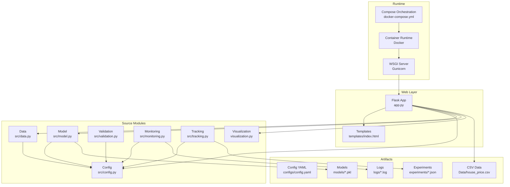

**Diagram sources**
- [app.py:1-113](file://House_Price_Prediction-main/housing1/app.py#L1-L113)
- [templates/index.html:1-145](file://House_Price_Prediction-main/housing1/templates/index.html#L1-L145)
- [src/config.py:1-63](file://House_Price_Prediction-main/housing1/src/config.py#L1-L63)
- [src/data.py:1-109](file://House_Price_Prediction-main/housing1/src/data.py#L1-L109)
- [src/model.py:1-155](file://House_Price_Prediction-main/housing1/src/model.py#L1-L155)
- [src/validation.py:1-243](file://House_Price_Prediction-main/housing1/src/validation.py#L1-L243)
- [src/monitoring.py:1-218](file://House_Price_Prediction-main/housing1/src/monitoring.py#L1-L218)
- [src/tracking.py:1-218](file://House_Price_Prediction-main/housing1/src/tracking.py#L1-L218)
- [visualization.py:1-348](file://House_Price_Prediction-main/housing1/visualization.py#L1-L348)
- [configs/config.yaml:1-60](file://House_Price_Prediction-main/housing1/configs/config.yaml#L1-L60)
- [Dockerfile:1-39](file://House_Price_Prediction-main/housing1/Dockerfile#L1-L39)
- [docker-compose.yml:1-52](file://House_Price_Prediction-main/housing1/docker-compose.yml#L1-L52)

**Section sources**
- [app.py:1-113](file://House_Price_Prediction-main/housing1/app.py#L1-L113)
- [templates/index.html:1-145](file://House_Price_Prediction-main/housing1/templates/index.html#L1-L145)
- [configs/config.yaml:1-60](file://House_Price_Prediction-main/housing1/configs/config.yaml#L1-L60)
- [Dockerfile:1-39](file://House_Price_Prediction-main/housing1/Dockerfile#L1-L39)
- [docker-compose.yml:1-52](file://House_Price_Prediction-main/housing1/docker-compose.yml#L1-L52)

## Core Components
- Flask application: Provides routes for prediction, visualization, and dashboard rendering, integrates with visualization utilities, and loads a pre-trained model for inference.
- Data layer: Loads CSV data, validates schema and quality, prepares features, splits datasets, and persists processed artifacts.
- Model layer: Factory-style model creation supporting multiple regressors, training, evaluation, persistence, and loading.
- Validation and drift detection: Validates data schema and quality, detects feature drift using configurable methods.
- Monitoring and logging: Logs predictions and performance, tracks drift alerts, and maintains structured logs.
- Experiment tracking and registry: Tracks experiment runs, logs parameters and metrics, and registers model versions.
- Visualization: Generates static charts and interactive dashboards for insights and performance analysis.
- Configuration: Centralized YAML-based configuration for project, data, model, training, monitoring, API, and logging settings.
- Packaging and runtime: Docker containerization with Gunicorn, orchestrated via docker-compose.

**Section sources**
- [app.py:1-113](file://House_Price_Prediction-main/housing1/app.py#L1-L113)
- [src/data.py:1-109](file://House_Price_Prediction-main/housing1/src/data.py#L1-L109)
- [src/model.py:1-155](file://House_Price_Prediction-main/housing1/src/model.py#L1-L155)
- [src/validation.py:1-243](file://House_Price_Prediction-main/housing1/src/validation.py#L1-L243)
- [src/monitoring.py:1-218](file://House_Price_Prediction-main/housing1/src/monitoring.py#L1-L218)
- [src/tracking.py:1-218](file://House_Price_Prediction-main/housing1/src/tracking.py#L1-L218)
- [visualization.py:1-348](file://House_Price_Prediction-main/housing1/visualization.py#L1-L348)
- [src/config.py:1-63](file://House_Price_Prediction-main/housing1/src/config.py#L1-L63)

## Architecture Overview
The system employs a layered, modular architecture with clear separation between presentation, business logic, data, and model components. It follows an MVC-like pattern at the web layer (routes and templates), while the backend encapsulates data processing, model management, validation, monitoring, and experiment tracking as cohesive modules. A configuration-driven approach centralizes settings, enabling easy adaptation across environments.

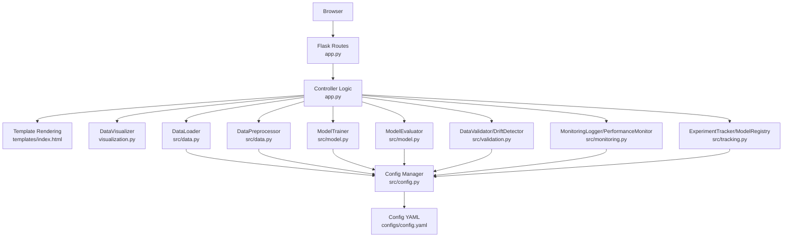

**Diagram sources**
- [app.py:1-113](file://House_Price_Prediction-main/housing1/app.py#L1-L113)
- [templates/index.html:1-145](file://House_Price_Prediction-main/housing1/templates/index.html#L1-L145)
- [visualization.py:1-348](file://House_Price_Prediction-main/housing1/visualization.py#L1-L348)
- [src/data.py:1-109](file://House_Price_Prediction-main/housing1/src/data.py#L1-L109)
- [src/model.py:1-155](file://House_Price_Prediction-main/housing1/src/model.py#L1-L155)
- [src/validation.py:1-243](file://House_Price_Prediction-main/housing1/src/validation.py#L1-L243)
- [src/monitoring.py:1-218](file://House_Price_Prediction-main/housing1/src/monitoring.py#L1-L218)
- [src/tracking.py:1-218](file://House_Price_Prediction-main/housing1/src/tracking.py#L1-L218)
- [src/config.py:1-63](file://House_Price_Prediction-main/housing1/src/config.py#L1-L63)
- [configs/config.yaml:1-60](file://House_Price_Prediction-main/housing1/configs/config.yaml#L1-L60)

## Detailed Component Analysis

### Flask Application (Presentation and Routing)
- Responsibilities: Serve HTML templates, accept form submissions, perform inference using a preloaded model, and render results or visualizations.
- Key flows:
  - GET "/" renders the prediction form.
  - POST "/predict" reads form inputs, constructs a feature vector, predicts price, and returns a rendered page with the result.
  - GET "/visualize" generates and displays static charts and metrics.
  - GET "/dashboard" creates an interactive Plotly dashboard.
- Production runtime: Uses Gunicorn via Docker and docker-compose.

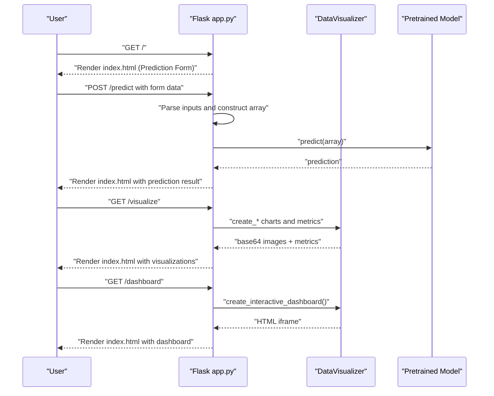

**Diagram sources**
- [app.py:37-113](file://House_Price_Prediction-main/housing1/app.py#L37-L113)
- [visualization.py:23-317](file://House_Price_Prediction-main/housing1/visualization.py#L23-L317)

**Section sources**
- [app.py:1-113](file://House_Price_Prediction-main/housing1/app.py#L1-L113)
- [templates/index.html:1-145](file://House_Price_Prediction-main/housing1/templates/index.html#L1-L145)

### Data Processing Module (DataLoader, DataPreprocessor)
- DataLoader: Loads CSV data with robust error handling and prints summary statistics.
- DataPreprocessor: Separates features/target, splits into train/test sets using configuration-driven parameters, and saves processed datasets.

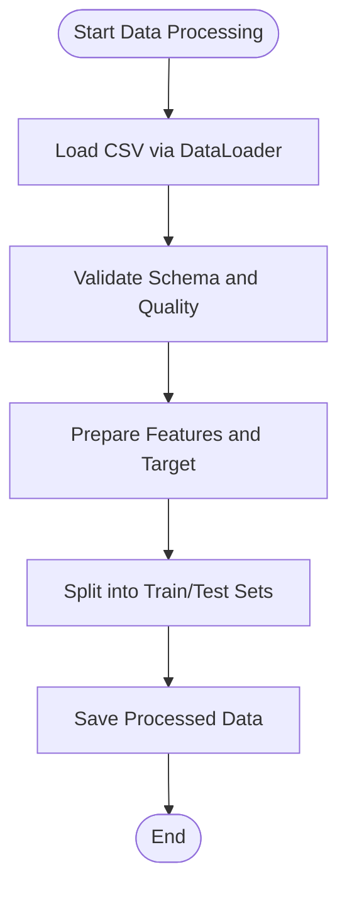

**Diagram sources**
- [src/data.py:13-109](file://House_Price_Prediction-main/housing1/src/data.py#L13-L109)

**Section sources**
- [src/data.py:1-109](file://House_Price_Prediction-main/housing1/src/data.py#L1-L109)
- [configs/config.yaml:9-16](file://House_Price_Prediction-main/housing1/configs/config.yaml#L9-L16)

### Model Management (ModelTrainer, ModelEvaluator)
- ModelTrainer: Factory-style creation of linear regression, random forest, or gradient boosting models based on configuration; supports training, saving, and loading.
- ModelEvaluator: Computes MAE, MSE, RMSE, R²; compares multiple models; persists metrics.

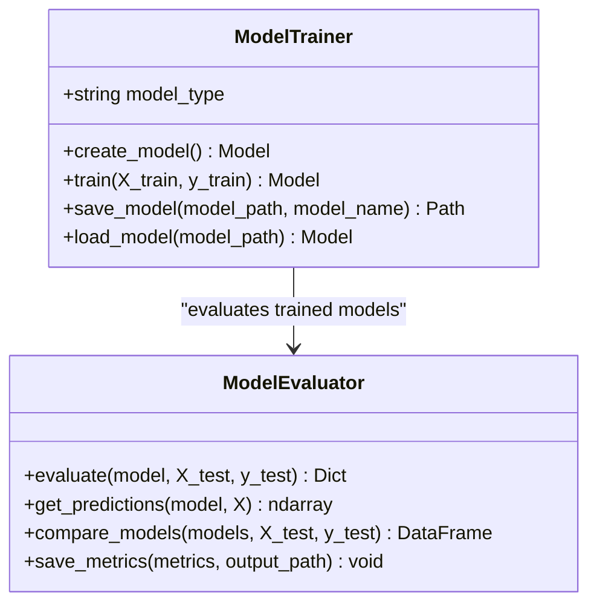

**Diagram sources**
- [src/model.py:17-155](file://House_Price_Prediction-main/housing1/src/model.py#L17-L155)

**Section sources**
- [src/model.py:1-155](file://House_Price_Prediction-main/housing1/src/model.py#L1-L155)
- [configs/config.yaml:17-27](file://House_Price_Prediction-main/housing1/configs/config.yaml#L17-L27)

### Validation and Drift Detection
- DataValidator: Enforces schema and reports quality metrics including missing values, duplicates, and outlier counts.
- DriftDetector: Computes drift using KS-test, PSI, or mean-shift thresholds against reference statistics.

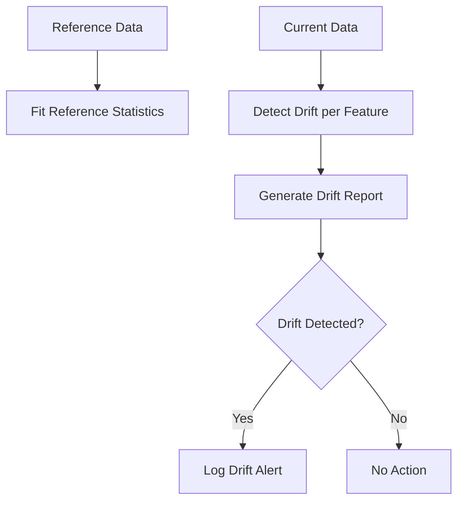

**Diagram sources**
- [src/validation.py:124-243](file://House_Price_Prediction-main/housing1/src/validation.py#L124-L243)

**Section sources**
- [src/validation.py:1-243](file://House_Price_Prediction-main/housing1/src/validation.py#L1-L243)
- [configs/config.yaml:41-47](file://House_Price_Prediction-main/housing1/configs/config.yaml#L41-L47)

### Monitoring and Logging
- MonitoringLogger: Logs predictions, performance metrics, drift alerts, and degradations; persists logs to JSON files.
- PerformanceMonitor: Compares current metrics to baseline thresholds and raises alerts.

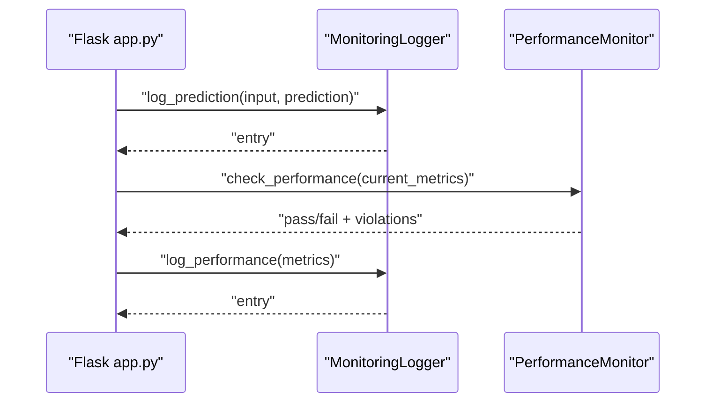

**Diagram sources**
- [src/monitoring.py:15-218](file://House_Price_Prediction-main/housing1/src/monitoring.py#L15-L218)
- [app.py:42-66](file://House_Price_Prediction-main/housing1/app.py#L42-L66)

**Section sources**
- [src/monitoring.py:1-218](file://House_Price_Prediction-main/housing1/src/monitoring.py#L1-L218)
- [configs/config.yaml:41-47](file://House_Price_Prediction-main/housing1/configs/config.yaml#L41-L47)

### Experiment Tracking and Registry
- ExperimentTracker: Starts runs, logs parameters and metrics, saves artifacts, and compiles run comparisons.
- ModelRegistry: Registers model versions with metadata, copies artifacts, and lists versions.

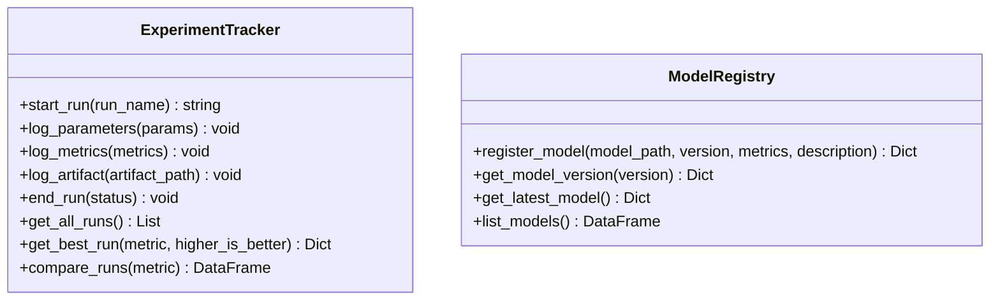

**Diagram sources**
- [src/tracking.py:14-218](file://House_Price_Prediction-main/housing1/src/tracking.py#L14-L218)

**Section sources**
- [src/tracking.py:1-218](file://House_Price_Prediction-main/housing1/src/tracking.py#L1-L218)
- [configs/config.yaml:35-40](file://House_Price_Prediction-main/housing1/configs/config.yaml#L35-L40)

### Visualization Utilities
- DataVisualizer: Loads data, computes correlations, distributions, scatter plots, performance charts, and interactive dashboards; returns base64-encoded images or Plotly HTML.

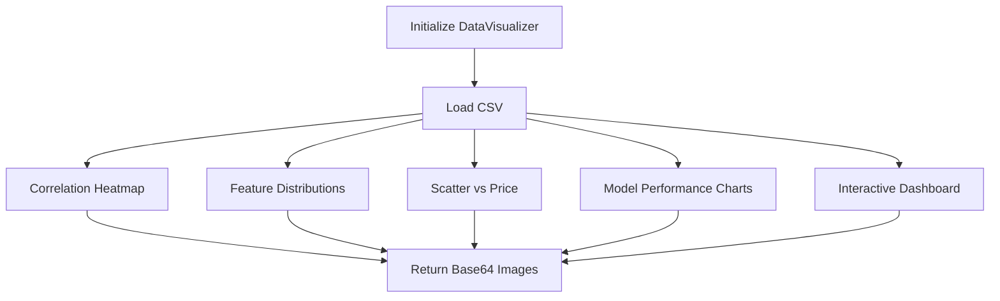

**Diagram sources**
- [visualization.py:23-317](file://House_Price_Prediction-main/housing1/visualization.py#L23-L317)

**Section sources**
- [visualization.py:1-348](file://House_Price_Prediction-main/housing1/visualization.py#L1-L348)

### Configuration Pattern
- Centralized YAML configuration drives project metadata, data paths, model settings, training parameters, monitoring thresholds, API settings, and logging format.
- Config class provides safe access with nested key resolution and defaults.

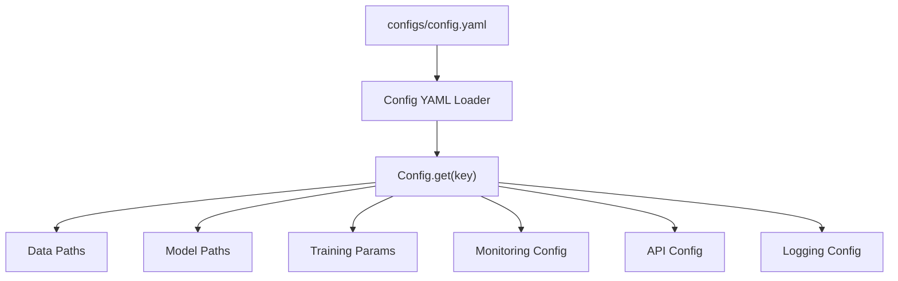

**Diagram sources**
- [configs/config.yaml:1-60](file://House_Price_Prediction-main/housing1/configs/config.yaml#L1-L60)
- [src/config.py:10-63](file://House_Price_Prediction-main/housing1/src/config.py#L10-L63)

**Section sources**
- [src/config.py:1-63](file://House_Price_Prediction-main/housing1/src/config.py#L1-L63)
- [configs/config.yaml:1-60](file://House_Price_Prediction-main/housing1/configs/config.yaml#L1-L60)

## Dependency Analysis
The system exhibits low coupling and high cohesion across modules, with explicit dependencies flowing from the Flask app to data, model, validation, monitoring, and tracking modules. Configuration is injected centrally to avoid hardcoding.

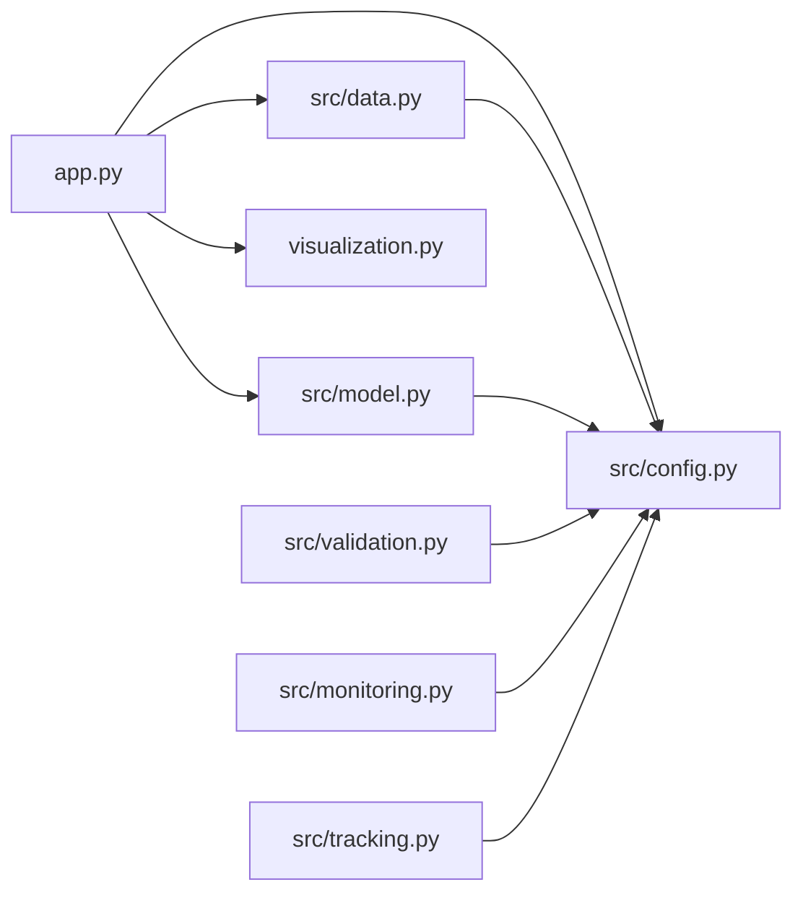

**Diagram sources**
- [app.py:1-113](file://House_Price_Prediction-main/housing1/app.py#L1-L113)
- [src/config.py:1-63](file://House_Price_Prediction-main/housing1/src/config.py#L1-L63)
- [src/data.py:1-109](file://House_Price_Prediction-main/housing1/src/data.py#L1-L109)
- [src/model.py:1-155](file://House_Price_Prediction-main/housing1/src/model.py#L1-L155)
- [src/validation.py:1-243](file://House_Price_Prediction-main/housing1/src/validation.py#L1-L243)
- [src/monitoring.py:1-218](file://House_Price_Prediction-main/housing1/src/monitoring.py#L1-L218)
- [src/tracking.py:1-218](file://House_Price_Prediction-main/housing1/src/tracking.py#L1-L218)
- [visualization.py:1-348](file://House_Price_Prediction-main/housing1/visualization.py#L1-L348)

**Section sources**
- [requirements.txt:1-24](file://House_Price_Prediction-main/housing1/requirements.txt#L1-L24)

## Performance Considerations
- Model persistence: Uses joblib for efficient serialization of scikit-learn estimators.
- Visualization: Non-interactive Matplotlib backend ensures headless operation; images are base64-encoded for inline rendering.
- Data processing: Efficient pandas operations and train/test split with configurable parameters.
- Scalability: Containerized deployment with Gunicorn allows horizontal scaling via multiple workers; docker-compose exposes health checks for readiness.

[No sources needed since this section provides general guidance]

## Troubleshooting Guide
- Data loading errors: DataLoader raises explicit exceptions if the CSV is missing or unreadable.
- Schema and quality issues: DataValidator reports missing columns, dtype mismatches, duplicates, and outlier counts.
- Drift detection: DriftDetector requires reference statistics; ensure fit() is called before detect_drift().
- Monitoring: MonitoringLogger writes structured logs; verify log directory permissions and timestamps.
- Experiment tracking: ExperimentTracker saves runs as JSON; confirm experiment directories exist.
- Model registry: ModelRegistry copies artifacts; ensure destination paths are writable.
- Flask routes: POST /predict expects numeric form fields; invalid inputs trigger error handling and render an error message.

**Section sources**
- [src/data.py:20-31](file://House_Price_Prediction-main/housing1/src/data.py#L20-L31)
- [src/validation.py:28-50](file://House_Price_Prediction-main/housing1/src/validation.py#L28-L50)
- [src/validation.py:132-151](file://House_Price_Prediction-main/housing1/src/validation.py#L132-L151)
- [src/monitoring.py:122-139](file://House_Price_Prediction-main/housing1/src/monitoring.py#L122-L139)
- [src/tracking.py:75-83](file://House_Price_Prediction-main/housing1/src/tracking.py#L75-L83)
- [app.py:42-66](file://House_Price_Prediction-main/housing1/app.py#L42-L66)

## Conclusion
The House Price Prediction system demonstrates a clean, modular architecture that separates concerns across data, model, validation, monitoring, and experiment tracking modules. It leverages configuration-driven settings, a factory-style model creation pattern, and a strategy-like selection of model implementations. The Flask application provides a straightforward MVC-like interface, while Docker and docker-compose enable containerized, scalable deployments. The MLOps pipeline integrates testing, validation, and deployment automation, ensuring reliability and reproducibility.

[No sources needed since this section summarizes without analyzing specific files]

## Appendices

### System Context Diagram
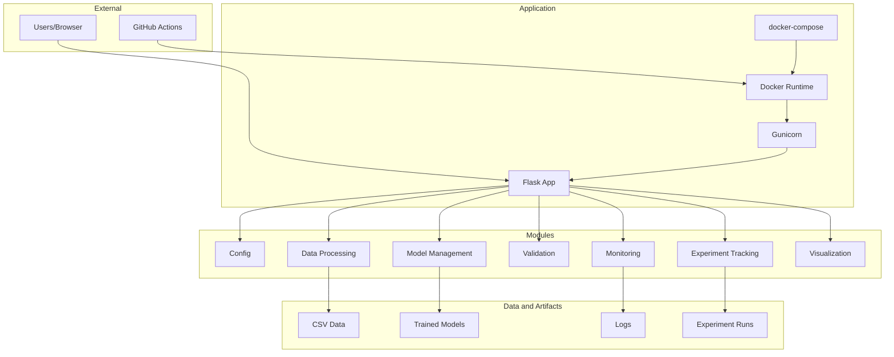

**Diagram sources**
- [app.py:1-113](file://House_Price_Prediction-main/housing1/app.py#L1-L113)
- [Dockerfile:1-39](file://House_Price_Prediction-main/housing1/Dockerfile#L1-L39)
- [docker-compose.yml:1-52](file://House_Price_Prediction-main/housing1/docker-compose.yml#L1-L52)
- [.github/workflows/mlops_pipeline.yml:1-180](file://House_Price_Prediction-main/housing1/.github/workflows/mlops_pipeline.yml#L1-L180)

### Data Flow from CSV to Web Rendering
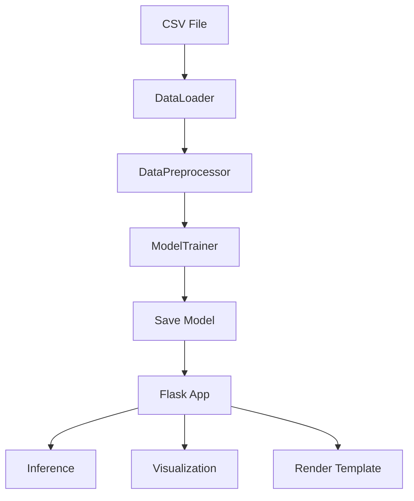

**Diagram sources**
- [src/data.py:20-109](file://House_Price_Prediction-main/housing1/src/data.py#L20-L109)
- [src/model.py:62-87](file://House_Price_Prediction-main/housing1/src/model.py#L62-L87)
- [app.py:42-113](file://House_Price_Prediction-main/housing1/app.py#L42-L113)
- [templates/index.html:1-145](file://House_Price_Prediction-main/housing1/templates/index.html#L1-L145)

### Technology Stack and Compatibility
- Core: Flask, NumPy, Pandas, scikit-learn, SciPy
- Visualization: Matplotlib, Seaborn, Plotly
- Monitoring: Prometheus client
- Production: Gunicorn
- Packaging: Docker
- CI/CD: GitHub Actions

**Section sources**
- [requirements.txt:1-24](file://House_Price_Prediction-main/housing1/requirements.txt#L1-L24)

### Deployment Topology and Infrastructure
- Single-service container exposing port 5000, with persistent volumes for data, models, logs, and experiments.
- Health checks configured for readiness.
- Environment variables support host binding and worker count.

**Section sources**
- [Dockerfile:1-39](file://House_Price_Prediction-main/housing1/Dockerfile#L1-L39)
- [docker-compose.yml:1-52](file://House_Price_Prediction-main/housing1/docker-compose.yml#L1-L52)

### MLOps Principles Integrated
- Centralized configuration for reproducibility.
- Experiment tracking with parameter and metric logging.
- Model registry for versioning and provenance.
- Automated CI/CD pipeline with linting, testing, type checking, model validation, and staged deployments.
- Monitoring and logging for observability.

**Section sources**
- [configs/config.yaml:1-60](file://House_Price_Prediction-main/housing1/configs/config.yaml#L1-L60)
- [src/tracking.py:14-218](file://House_Price_Prediction-main/housing1/src/tracking.py#L14-L218)
- [src/monitoring.py:15-218](file://House_Price_Prediction-main/housing1/src/monitoring.py#L15-L218)
- [.github/workflows/mlops_pipeline.yml:1-180](file://House_Price_Prediction-main/housing1/.github/workflows/mlops_pipeline.yml#L1-L180)