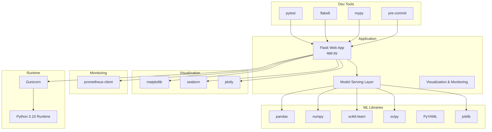
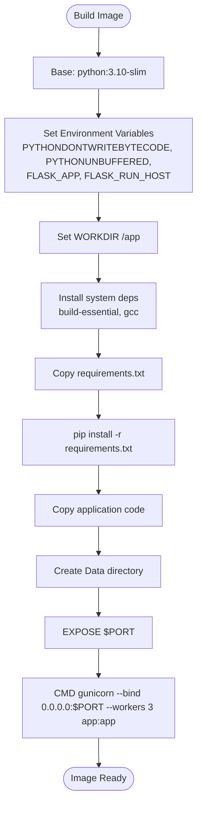
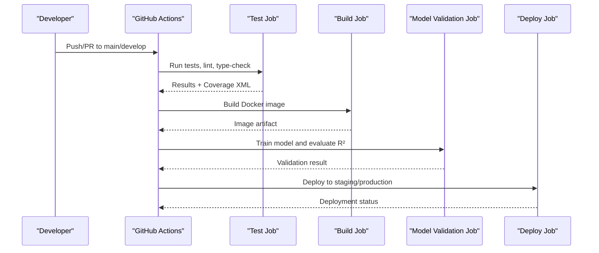

# Technology Stack and Dependencies

<cite>
**Referenced Files in This Document**
- [requirements.txt](file://requirements.txt)
- [requirements-dev.txt](file://House_Price_Prediction-main\housing1\requirements-dev.txt)
- [pyproject.toml](file://House_Price_Prediction-main\housing1\pyproject.toml)
- [.pre-commit-config.yaml](file://House_Price_Prediction-main\housing1\.pre-commit-config.yaml)
- [Dockerfile](file://House_Price_Prediction-main\housing1\Dockerfile)
- [railway.json](file://House_Price_Prediction-main\housing1\railway.json)
- [.github/workflows/mlops_pipeline.yml](file://House_Price_Prediction-main\housing1\.github\workflows\mlops_pipeline.yml)
- [Procfile](file://House_Price_Prediction-main\housing1\Procfile)
- [setup.py](file://House_Price_Prediction-main\housing1\setup.py)
</cite>

## Table of Contents
1. [Introduction](#introduction)
2. [Project Structure](#project-structure)
3. [Core Dependencies](#core-dependencies)
4. [Development Dependencies](#development-dependencies)
5. [Containerization and Deployment](#containerization-and-deployment)
6. [MLOps Pipeline and Automation](#mlops-pipeline-and-automation)
7. [Version Compatibility and Upgrade Considerations](#version-compatibility-and-upgrade-considerations)
8. [Security Implications and Vulnerability Assessment](#security-implications-and-vulnerability-assessment)
9. [Rationale and MLOps Alignment](#rationale-and-mlops-alignment)
10. [Dependency Management Best Practices](#dependency-management-best-practices)
11. [Conclusion](#conclusion)

## Introduction
This document provides a comprehensive overview of the technology stack and dependencies used in the House Price Prediction project. It explains the roles of each dependency in the system architecture, outlines development and production tooling, documents containerization and deployment configurations, and provides guidance on version compatibility, upgrades, security, and MLOps alignment.

## Project Structure
The project follows a modular MLOps layout with clear separation of concerns:
- Data ingestion and preprocessing
- Model training and validation
- API serving via Flask
- Visualization and monitoring
- CI/CD automation and containerization

[No sources needed since this diagram shows conceptual workflow, not actual code structure]

## Core Dependencies
The core runtime dependencies define the ML and web stack:

- Flask (>=2.3.0): WSGI web framework powering the prediction API.
- pandas (>=2.0.0): Data manipulation and preprocessing.
- numpy (>=1.24.0): Numerical computing for model inputs and metrics.
- scikit-learn (>=1.3.0): Machine learning models and utilities.
- scipy (>=1.11.0): Scientific computing for statistics and optimization.
- PyYAML (>=6.0): Configuration parsing and management.
- click (>=8.1.0): Command-line interface utilities.
- joblib (>=1.3.0): Efficient caching and persistence for ML pipelines.

These libraries collectively enable data processing, model training, inference, and API exposure.

**Section sources**
- [requirements.txt:1-21](file://requirements.txt#L1-L21)

## Development Dependencies
Development-time tooling ensures code quality, type safety, and consistency:

- pytest (>=7.4.0): Test runner and assertion library.
- pytest-cov (>=4.1.0): Coverage reporting.
- flake8 (>=6.1.0): Static linting for style and errors.
- mypy (>=1.5.0): Static type checker.
- black (>=23.7.0): Code formatter.
- isort (>=5.12.0): Import sorting.
- pre-commit (>=3.4.0): Git hook manager for automated checks.
- pytest-xdist (>=3.3.0): Parallel test execution.
- pytest-mock (>=3.11.0): Mocking for tests.
- types-PyYAML (>=6.0.0), types-requests (>=2.31.0): Type stubs for third-party packages.

These tools integrate with pre-commit hooks and CI to enforce standards and catch issues early.

**Section sources**
- [requirements-dev.txt:1-17](file://House_Price_Prediction-main\housing1\requirements-dev.txt#L1-L17)
- [.pre-commit-config.yaml:1-36](file://House_Price_Prediction-main\housing1\.pre-commit-config.yaml#L1-L36)
- [pyproject.toml:28-57](file://House_Price_Prediction-main\housing1\pyproject.toml#L28-L57)

## Containerization and Deployment
Containerization and deployment configurations ensure reproducible builds and scalable deployments:

- Dockerfile: Defines a Python 3.10 slim base image, installs system and Python dependencies, copies the application, exposes the PORT, and starts the app with Gunicorn.
- Procfile: Declares the web process for platforms that require a Procfile (e.g., Heroku/Railway).
- railway.json: Specifies the builder and start command for Railway deployments, excluding unnecessary files from the deployment package.
- setup.py: Provides project initialization utilities for directory creation, placeholder files, and configuration copying.

**Diagram sources**
- [Dockerfile:1-39](file://House_Price_Prediction-main\housing1\Dockerfile#L1-L39)

**Section sources**
- [Dockerfile:1-39](file://House_Price_Prediction-main\housing1\Dockerfile#L1-L39)
- [Procfile:1-1](file://House_Price_Prediction-main\housing1\Procfile#L1-L1)
- [railway.json:1-20](file://House_Price_Prediction-main\housing1\railway.json#L1-L20)
- [setup.py:1-75](file://House_Price_Prediction-main\housing1\setup.py#L1-L75)

## MLOps Pipeline and Automation
The GitHub Actions pipeline automates testing, linting, type checking, Docker image building, model validation, and deployment orchestration:

- Test job: Sets up Python 3.10, installs production and dev dependencies, runs flake8, pytest with coverage, and uploads coverage to Codecov.
- Build job: Builds a Docker image tagged with the commit SHA and saves it as an artifact.
- Validate-model job: Installs dependencies and validates model training and performance thresholds.
- Deploy job: Deploys to staging and production environments (placeholders for actual commands).

**Diagram sources**
- [.github/workflows/mlops_pipeline.yml:1-180](file://House_Price_Prediction-main\housing1\.github\workflows\mlops_pipeline.yml#L1-L180)

**Section sources**
- [.github/workflows/mlops_pipeline.yml:1-180](file://House_Price_Prediction-main\housing1\.github\workflows\mlops_pipeline.yml#L1-L180)

## Version Compatibility and Upgrade Considerations
- Python runtime: The project targets Python 3.10 across Docker, Railway, and CI. Upgrading requires verifying compatibility of all dependencies with Python 3.10 and ensuring CI and Dockerfiles align.
- Flask >=2.3.0: Ensure extensions and middleware remain compatible with the Flask major version.
- pandas >=2.0.0: Major version updates may change indexing and groupby behaviors; review data processing logic.
- numpy >=1.24.0: Newer versions introduce deprecations; update array APIs accordingly.
- scikit-learn >=1.3.0: New estimators and changed defaults may impact training; validate hyperparameters and metrics.
- matplotlib >=3.5.0, seaborn >=0.11.0, plotly >=5.0.0: Visualization updates may alter rendering; test dashboards and reports.
- gunicorn >=21.2.0: Verify worker configuration and environment variable handling.

Upgrade strategy:
- Pin minor versions in requirements.txt for stability.
- Use pre-commit hooks and CI to catch regressions early.
- Maintain a changelog of breaking changes per dependency.

**Section sources**
- [Dockerfile:4](file://House_Price_Prediction-main\housing1\Dockerfile#L4)
- [mlops_pipeline.yml:19](file://House_Price_Prediction-main\housing1\.github\workflows\mlops_pipeline.yml#L19)
- [railway.json:3](file://House_Price_Prediction-main\housing1\railway.json#L3)
- [requirements.txt:1-21](file://requirements.txt#L1-L21)

## Security Implications and Vulnerability Assessment
- Dependency pinning: Pin major and minor versions to reduce drift and limit blast radius of vulnerabilities.
- Pre-release scanning: Integrate SCA tools (e.g., pip-audit, Dependabot) to monitor for known vulnerabilities.
- Least privilege: Restrict Railway deployment filesystem exclusions to necessary files only.
- Secrets management: Avoid committing secrets; use platform-specific secret stores.
- Image hygiene: Use slim base images, minimize installed packages, and rebuild regularly.

Recommended practices:
- Automate vulnerability scans in CI.
- Maintain an SBOM (Software Bill of Materials) for auditability.
- Rotate credentials and review access logs periodically.

[No sources needed since this section provides general guidance]

## Rationale and MLOps Alignment
- Flask + Gunicorn: Lightweight web framework with a production-grade ASGI server for predictable scaling.
- pandas + numpy + scikit-learn: Industry-standard stack for data processing, numerical computation, and ML modeling.
- Visualization trio: Matplotlib for publication-ready plots, Seaborn for statistical visualizations, Plotly for interactive dashboards.
- Prometheus client: Enables observability and alerting for model performance and API metrics.
- pytest + flake8 + mypy: Ensures code quality, type safety, and reliability.
- Docker + Railway: Streamlines reproducible deployments and environment parity.
- GitHub Actions: Automates testing, validation, and deployment with clear stages.

These choices support MLOps by enabling reproducibility, observability, automation, and scalable delivery.

[No sources needed since this section summarizes without analyzing specific files]

## Dependency Management Best Practices
- Lock files: Prefer requirements.txt for reproducibility; keep requirements-dev.txt separate for dev-only tools.
- Pre-commit hooks: Enforce formatting, linting, and type checks locally before pushing.
- CI enforcement: Mirror local checks in CI to prevent drift.
- Coverage thresholds: Establish minimum coverage and guard against regression.
- Semantic versioning: Use patch/minor pins for stability; track breaking changes in major versions.
- Documentation: Maintain a changelog and upgrade guide for dependencies.

**Section sources**
- [requirements-dev.txt:1-17](file://House_Price_Prediction-main\housing1\requirements-dev.txt#L1-L17)
- [.pre-commit-config.yaml:1-36](file://House_Price_Prediction-main\housing1\.pre-commit-config.yaml#L1-L36)
- [pyproject.toml:28-57](file://House_Price_Prediction-main\housing1\pyproject.toml#L28-L57)

## Conclusion
The House Price Prediction project employs a robust, modern Python stack optimized for MLOps. Core dependencies provide a strong foundation for data science and web serving, while development tools and CI/CD ensure quality and reliability. Containerization and Railway configurations enable scalable, repeatable deployments. Adhering to the recommended practices and staying vigilant about version compatibility and security will sustain the project’s maturity and performance.

[No sources needed since this section summarizes without analyzing specific files]