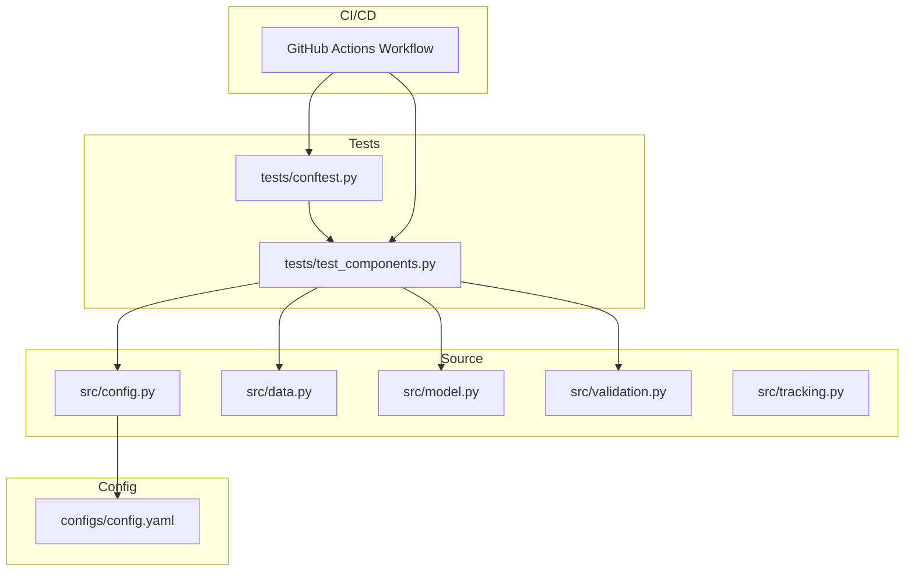
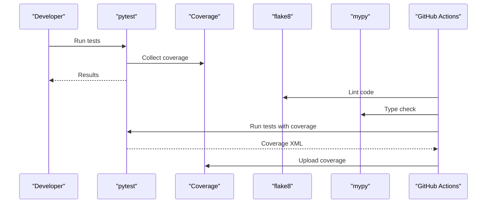
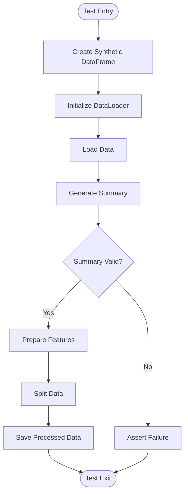
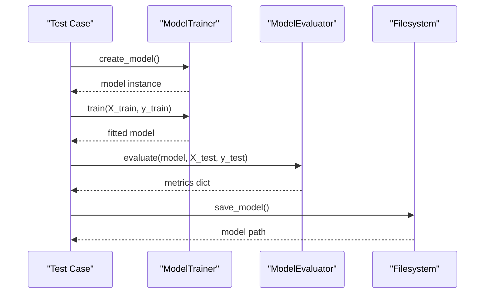
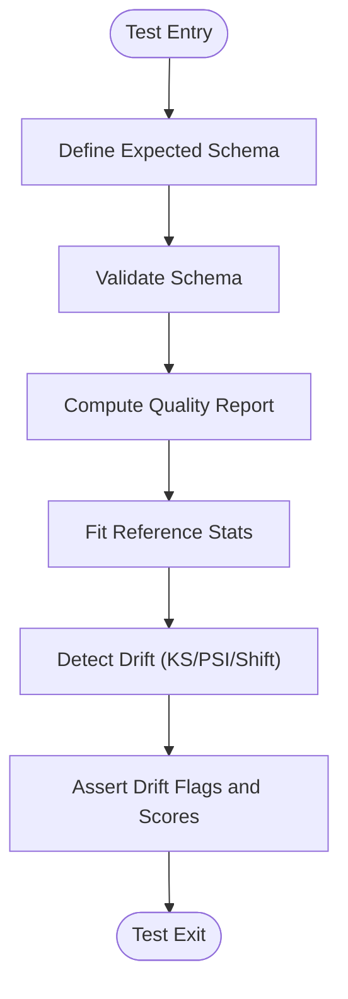
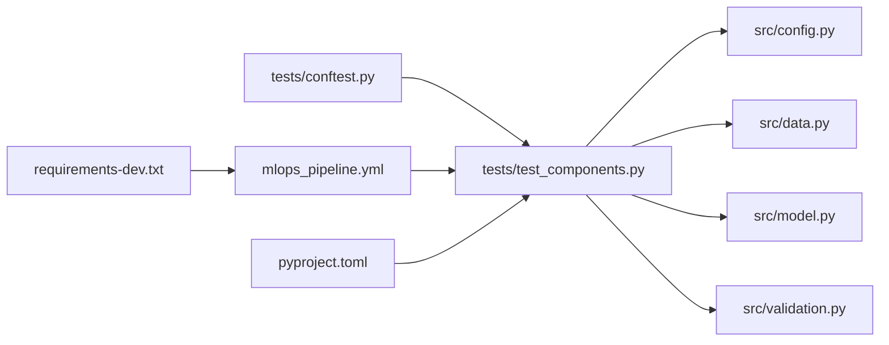

# Testing Strategy

<cite>
**Referenced Files in This Document**
- [tests/conftest.py](file://tests/conftest.py)
- [tests/test_components.py](file://tests/test_components.py)
- [src/config.py](file://src/config.py)
- [src/data.py](file://src/data.py)
- [src/model.py](file://src/model.py)
- [src/validation.py](file://src/validation.py)
- [configs/config.yaml](file://configs/config.yaml)
- [.github/workflows/mlops_pipeline.yml](file://.github/workflows/mlops_pipeline.yml)
- [requirements-dev.txt](file://requirements-dev.txt)
- [pyproject.toml](file://pyproject.toml)
- [Makefile](file://Makefile)
- [src/tracking.py](file://src/tracking.py)
</cite>

## Table of Contents
1. [Introduction](#introduction)
2. [Project Structure](#project-structure)
3. [Core Components](#core-components)
4. [Architecture Overview](#architecture-overview)
5. [Detailed Component Analysis](#detailed-component-analysis)
6. [Dependency Analysis](#dependency-analysis)
7. [Performance Considerations](#performance-considerations)
8. [Troubleshooting Guide](#troubleshooting-guide)
9. [Conclusion](#conclusion)
10. [Appendices](#appendices)

## Introduction
This document defines a comprehensive testing strategy for the MLOps house price prediction project. It covers unit testing, integration testing, and quality assurance practices grounded in the existing pytest suite, fixtures, and CI/CD pipeline. It explains how to test data processing components, machine learning models, and the API surface, and provides guidance on test data management, assertion strategies, mocking, edge cases, coverage, continuous integration, and performance testing. The goal is to ensure reliable, maintainable, and scalable tests that support safe releases and continuous delivery.

## Project Structure
The testing effort is organized around:
- A pytest package under tests/ with shared configuration via conftest.py
- Unit tests for core components (configuration, data loading/preprocessing, model training/evaluation, validation/drift detection)
- Continuous integration via GitHub Actions that runs linting, tests, coverage, and type checks
- Developer-friendly Makefile targets for local testing and coverage reporting

**Diagram sources**
- [tests/conftest.py:1-20](file://tests/conftest.py#L1-L20)
- [tests/test_components.py:1-209](file://tests/test_components.py#L1-L209)
- [src/config.py:1-63](file://src/config.py#L1-L63)
- [src/data.py:1-109](file://src/data.py#L1-L109)
- [src/model.py:1-155](file://src/model.py#L1-L155)
- [src/validation.py:1-243](file://src/validation.py#L1-L243)
- [configs/config.yaml:1-60](file://configs/config.yaml#L1-L60)
- [.github/workflows/mlops_pipeline.yml:1-180](file://.github/workflows/mlops_pipeline.yml#L1-L180)

**Section sources**
- [tests/conftest.py:1-20](file://tests/conftest.py#L1-L20)
- [tests/test_components.py:1-209](file://tests/test_components.py#L1-L209)
- [pyproject.toml:28-34](file://pyproject.toml#L28-L34)

## Core Components
This section outlines the testing approach for each major component group.

- Configuration management
  - Verify YAML loading, nested key retrieval, and defaults
  - Validate data paths, model paths, training parameters, and monitoring thresholds
  - Use parameterized tests for different config keys and edge cases (missing keys, wrong types)

- Data loading and preprocessing
  - Test successful loading, error handling for missing files, and summary generation
  - Validate feature separation, target extraction, and train/test split logic
  - Assert shapes, dtypes, and split proportions align with configuration

- Model training and evaluation
  - Test model creation for supported types, training completion, and prediction positivity
  - Evaluate metrics computation (MAE, MSE, RMSE, R²) and comparison across models
  - Validate model persistence and loading paths

- Data validation and drift detection
  - Schema validation (columns, dtypes), data quality scoring, missing values, and outlier detection
  - Drift detection using KS-test, PSI, and mean-shift methods with configurable thresholds

- Experiment tracking and registry
  - Log runs, parameters, metrics, and artifacts; retrieve best runs and compare across runs
  - Register models with version metadata and list versions

Practical examples (described):
- Use pytest fixtures to provide temporary directories and minimal datasets for data loading and preprocessing tests.
- Mock external filesystem calls when testing model persistence and loading.
- Parameterize tests for different model types and drift detection methods.
- Use assertions to validate dictionary keys and numeric ranges for metrics and drift scores.

**Section sources**
- [tests/test_components.py:18-38](file://tests/test_components.py#L18-L38)
- [tests/test_components.py:40-62](file://tests/test_components.py#L40-L62)
- [tests/test_components.py:64-95](file://tests/test_components.py#L64-L95)
- [tests/test_components.py:97-134](file://tests/test_components.py#L97-L134)
- [tests/test_components.py:136-154](file://tests/test_components.py#L136-L154)
- [tests/test_components.py:156-184](file://tests/test_components.py#L156-L184)
- [tests/test_components.py:186-205](file://tests/test_components.py#L186-L205)
- [src/config.py:17-58](file://src/config.py#L17-L58)
- [src/data.py:20-42](file://src/data.py#L20-L42)
- [src/data.py:55-88](file://src/data.py#L55-L88)
- [src/model.py:25-87](file://src/model.py#L25-L87)
- [src/model.py:96-127](file://src/model.py#L96-L127)
- [src/validation.py:51-99](file://src/validation.py#L51-L99)
- [src/validation.py:143-199](file://src/validation.py#L143-L199)
- [src/tracking.py:25-74](file://src/tracking.py#L25-L74)
- [src/tracking.py:94-113](file://src/tracking.py#L94-L113)

## Architecture Overview
The testing architecture integrates pytest, coverage, linting, and type checking into a CI pipeline. The workflow:
- Sets up Python, installs dependencies (including development tools), runs flake8, executes pytest with coverage, uploads coverage, and performs mypy type checks
- Builds a Docker image and validates model training and performance thresholds post-tests
- Supports optional integration testing stages for staging and production deployment

**Diagram sources**
- [.github/workflows/mlops_pipeline.yml:10-47](file://.github/workflows/mlops_pipeline.yml#L10-L47)
- [pyproject.toml:28-34](file://pyproject.toml#L28-L34)

**Section sources**
- [.github/workflows/mlops_pipeline.yml:1-180](file://.github/workflows/mlops_pipeline.yml#L1-L180)
- [pyproject.toml:28-34](file://pyproject.toml#L28-L34)

## Detailed Component Analysis

### Configuration Tests
Approach:
- Instantiate Config with a real config.yaml path and assert presence of loaded config
- Retrieve nested keys using dot notation and verify defaults
- Validate data paths and training parameters derived from configuration

Best practices:
- Keep a minimal config.yaml for tests; avoid relying on environment-specific values
- Use parametrized tests for different keys and expected defaults

**Section sources**
- [tests/test_components.py:18-38](file://tests/test_components.py#L18-L38)
- [src/config.py:26-58](file://src/config.py#L26-L58)
- [configs/config.yaml:1-60](file://configs/config.yaml#L1-L60)

### Data Loading and Preprocessing Tests
Approach:
- Create small synthetic DataFrames to test summaries and feature preparation
- Validate train/test split proportions and random seeds from configuration
- Assert saved processed data files exist after save operations

Edge cases:
- Missing target column during feature preparation
- Empty or malformed CSV files
- Non-numeric columns causing downstream errors

Fixtures:
- Use a pytest fixture to create a temporary CSV file and a temporary directory for processed data

**Diagram sources**
- [tests/test_components.py:40-62](file://tests/test_components.py#L40-L62)
- [tests/test_components.py:64-95](file://tests/test_components.py#L64-L95)
- [src/data.py:20-42](file://src/data.py#L20-L42)
- [src/data.py:55-88](file://src/data.py#L55-L88)

**Section sources**
- [tests/test_components.py:40-95](file://tests/test_components.py#L40-L95)
- [src/data.py:20-88](file://src/data.py#L20-L88)

### Model Trainer and Evaluator Tests
Approach:
- Test model creation for supported types and training completion
- Validate predictions are produced and positive (for price predictions)
- Compute and assert metrics (MAE, MSE, RMSE, R²) and compare multiple models

Fixtures:
- Use a fixture to provide a minimal dataset and a temporary model save directory

**Diagram sources**
- [tests/test_components.py:97-134](file://tests/test_components.py#L97-L134)
- [tests/test_components.py:136-154](file://tests/test_components.py#L136-L154)
- [src/model.py:25-87](file://src/model.py#L25-L87)
- [src/model.py:96-127](file://src/model.py#L96-L127)

**Section sources**
- [tests/test_components.py:97-154](file://tests/test_components.py#L97-L154)
- [src/model.py:25-127](file://src/model.py#L25-L127)

### Data Validator and Drift Detector Tests
Approach:
- Define schema expectations and validate against datasets with missing columns and incorrect dtypes
- Compute quality reports and assert penalties and scores
- Detect drift using KS-test, PSI, and mean-shift methods; assert drift flags and scores

Fixtures:
- Use a fixture to generate reference/current datasets with controlled distributions

**Diagram sources**
- [tests/test_components.py:156-184](file://tests/test_components.py#L156-L184)
- [tests/test_components.py:186-205](file://tests/test_components.py#L186-L205)
- [src/validation.py:21-49](file://src/validation.py#L21-L49)
- [src/validation.py:51-99](file://src/validation.py#L51-L99)
- [src/validation.py:143-199](file://src/validation.py#L143-L199)

**Section sources**
- [tests/test_components.py:156-205](file://tests/test_components.py#L156-L205)
- [src/validation.py:21-199](file://src/validation.py#L21-L199)

### Experiment Tracking and Model Registry Tests
Approach:
- Start runs, log parameters and metrics, save artifacts, and end runs
- Retrieve best runs and compare across runs
- Register models with versions and inspect metadata

Fixtures:
- Use a temporary directory for experiment tracking and model registry

**Section sources**
- [src/tracking.py:25-74](file://src/tracking.py#L25-L74)
- [src/tracking.py:94-113](file://src/tracking.py#L94-L113)
- [src/tracking.py:150-183](file://src/tracking.py#L150-L183)
- [src/tracking.py:203-217](file://src/tracking.py#L203-L217)

## Dependency Analysis
Key relationships:
- tests/test_components.py depends on src/config.py, src/data.py, src/model.py, and src/validation.py
- conftest.py configures pytest markers and adds src to the path for imports
- CI workflow depends on pytest configuration and coverage settings in pyproject.toml
- requirements-dev.txt provides pytest plugins for advanced testing capabilities

**Diagram sources**
- [tests/conftest.py:1-20](file://tests/conftest.py#L1-L20)
- [tests/test_components.py:1-209](file://tests/test_components.py#L1-L209)
- [src/config.py:1-63](file://src/config.py#L1-L63)
- [src/data.py:1-109](file://src/data.py#L1-L109)
- [src/model.py:1-155](file://src/model.py#L1-L155)
- [src/validation.py:1-243](file://src/validation.py#L1-L243)
- [.github/workflows/mlops_pipeline.yml:1-180](file://.github/workflows/mlops_pipeline.yml#L1-L180)
- [pyproject.toml:28-34](file://pyproject.toml#L28-L34)
- [requirements-dev.txt:1-17](file://requirements-dev.txt#L1-L17)

**Section sources**
- [tests/conftest.py:1-20](file://tests/conftest.py#L1-L20)
- [tests/test_components.py:1-209](file://tests/test_components.py#L1-L209)
- [pyproject.toml:28-34](file://pyproject.toml#L28-L34)
- [requirements-dev.txt:1-17](file://requirements-dev.txt#L1-L17)

## Performance Considerations
- Prefer synthetic or minimal datasets in unit tests to keep execution fast
- Use pytest markers to categorize slow tests and skip them during quick local runs
- Leverage pytest-xdist for parallel test execution when appropriate
- Avoid heavy I/O in unit tests; mock filesystem and network operations
- Use fixtures to cache expensive setup (e.g., reference datasets for drift detection) across related tests

[No sources needed since this section provides general guidance]

## Troubleshooting Guide
Common issues and resolutions:
- Config file not found or unreadable
  - Ensure the config path is correct and accessible in the test environment
  - Use a dedicated test config or patch the path in tests

- Data loading failures
  - Validate file existence and permissions
  - Assert proper exceptions are raised for missing files

- Model training or evaluation errors
  - Confirm model type selection and parameter defaults
  - Validate shapes and dtypes of input features and targets

- Coverage gaps
  - Run coverage with verbose reporting to identify missing lines
  - Add targeted tests for uncovered branches and exception paths

- CI failures
  - Reproduce locally using the same Python version and installed packages
  - Review lint and type check outputs; fix style and type issues

**Section sources**
- [src/config.py:17-24](file://src/config.py#L17-L24)
- [src/data.py:22-30](file://src/data.py#L22-L30)
- [src/model.py:62-87](file://src/model.py#L62-L87)
- [pyproject.toml:41-56](file://pyproject.toml#L41-L56)
- [.github/workflows/mlops_pipeline.yml:27-46](file://.github/workflows/mlops_pipeline.yml#L27-L46)

## Conclusion
The project’s testing strategy combines robust unit tests, CI-driven quality gates, and developer-friendly tooling. By focusing on deterministic fixtures, parameterized scenarios, and clear assertion strategies, teams can confidently extend the test suite for new features while maintaining reliability. The CI pipeline ensures consistent linting, testing, coverage, and type checking, forming strong quality gates before deployment.

[No sources needed since this section summarizes without analyzing specific files]

## Appendices

### Test Organization and Fixtures
- conftest.py
  - Adds src to the Python path
  - Registers pytest markers for slow and integration tests
- Recommended fixtures
  - Temporary directories for data/model outputs
  - Minimal synthetic datasets for data loading and preprocessing
  - Mocked filesystem for model persistence tests

**Section sources**
- [tests/conftest.py:1-20](file://tests/conftest.py#L1-L20)

### Writing Effective Tests
- Use descriptive test names and docstrings
- Keep tests independent; avoid shared mutable state
- Prefer parametrize for multiple inputs and configurations
- Assert meaningful outcomes (keys, ranges, shapes) rather than trivial pass conditions

[No sources needed since this section provides general guidance]

### Mocking External Dependencies
- Use pytest-mock to patch filesystem operations and model persistence
- Mock network calls if present in future extensions
- Replace expensive operations with lightweight mocks

**Section sources**
- [requirements-dev.txt:10-12](file://requirements-dev.txt#L10-L12)

### Test Coverage Requirements
- Target high coverage for core logic (data processing, model evaluation, validation)
- Use coverage thresholds and branch coverage to guide improvements
- Exclude generated code and tests directories from coverage

**Section sources**
- [pyproject.toml:41-56](file://pyproject.toml#L41-L56)
- [.github/workflows/mlops_pipeline.yml:32-41](file://.github/workflows/mlops_pipeline.yml#L32-L41)

### Continuous Integration Testing
- Lint, test, and type check on pushes and pull requests
- Upload coverage to Codecov for visibility
- Post-test model validation checks R² threshold
- Optional integration tests in staging and production deployment steps

**Section sources**
- [.github/workflows/mlops_pipeline.yml:1-180](file://.github/workflows/mlops_pipeline.yml#L1-L180)

### Extending the Test Suite
- Follow existing class-per-module naming and assertion patterns
- Add fixtures for new components and reuse them across tests
- Introduce integration tests for end-to-end flows and API endpoints
- Maintain Makefile targets for local verification before commits

**Section sources**
- [Makefile:44-60](file://Makefile#L44-L60)
- [Makefile:119-124](file://Makefile#L119-L124)