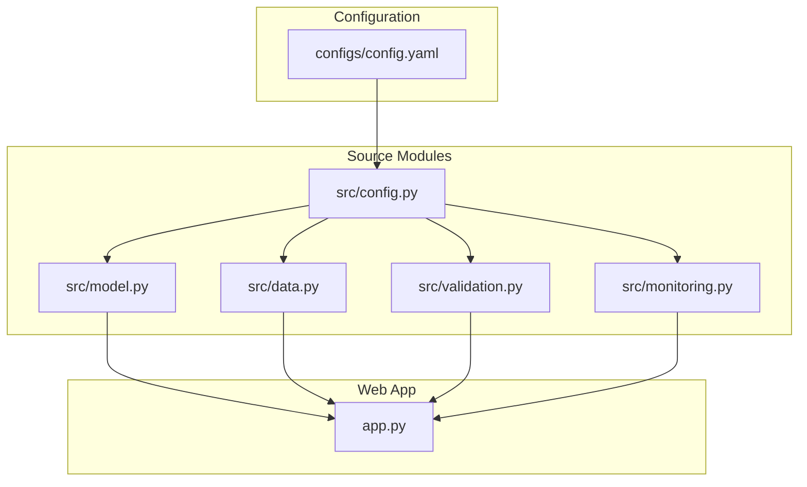
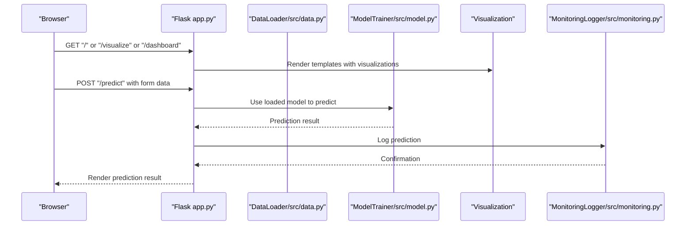
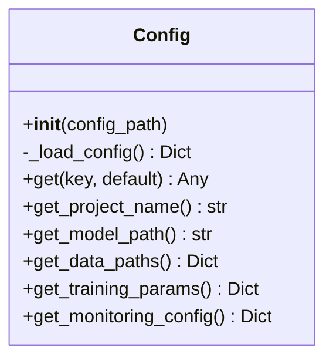
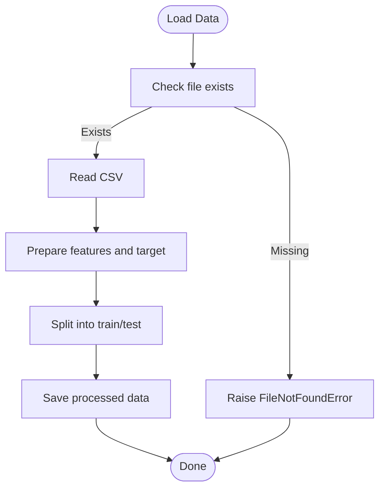
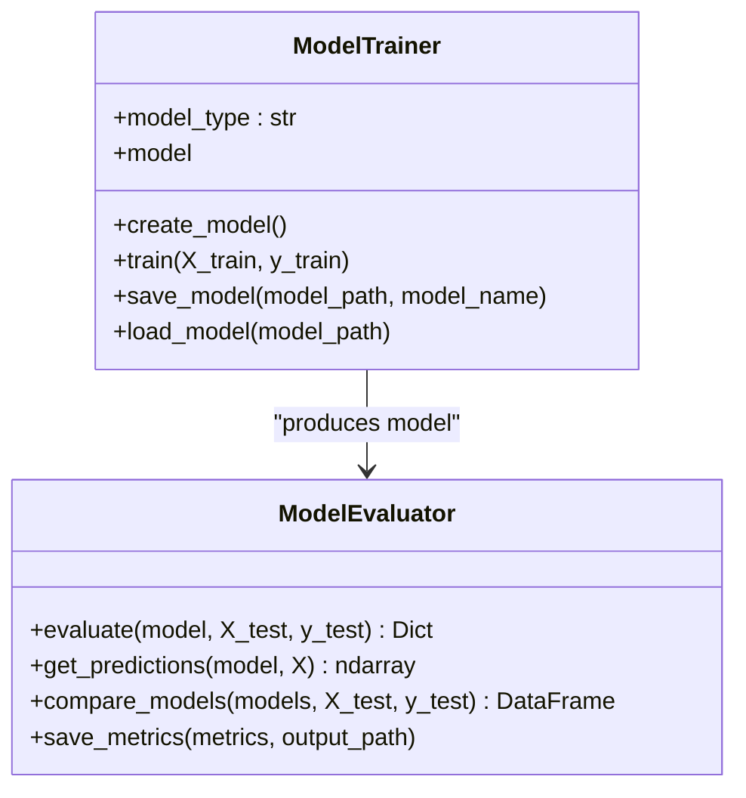
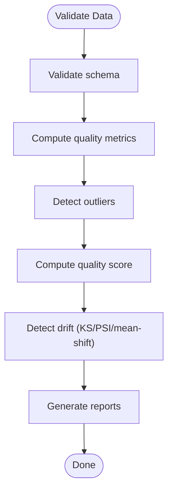
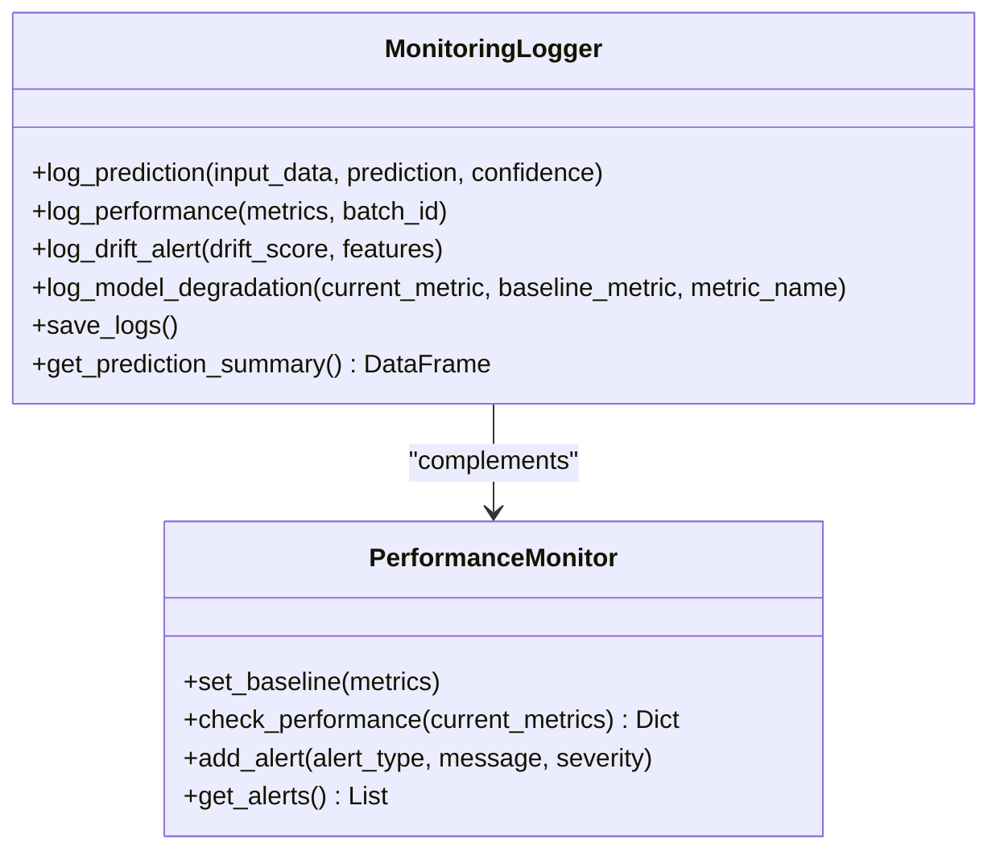
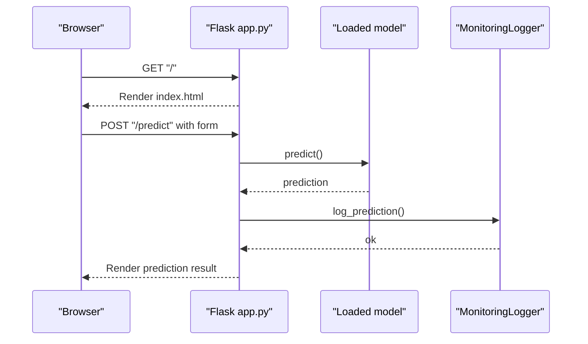
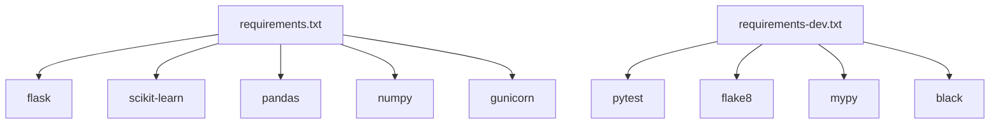

# Troubleshooting & FAQ

<cite>
**Referenced Files in This Document**
- [README.md](file://README.md)
- [SETUP.md](file://SETUP.md)
- [DEPLOYMENT_GUIDE.md](file://DEPLOYMENT_GUIDE.md)
- [DEPLOYMENT_COMPLETE.md](file://DEPLOYMENT_COMPLETE.md)
- [RAILWAY_DEPLOYMENT.md](file://RAILWAY_DEPLOYMENT.md)
- [requirements.txt](file://requirements.txt)
- [requirements-dev.txt](file://requirements-dev.txt)
- [configs/config.yaml](file://configs/config.yaml)
- [src/config.py](file://src/config.py)
- [src/data.py](file://src/data.py)
- [src/model.py](file://src/model.py)
- [src/validation.py](file://src/validation.py)
- [src/monitoring.py](file://src/monitoring.py)
- [app.py](file://app.py)
</cite>

## Table of Contents
1. [Introduction](#introduction)
2. [Project Structure](#project-structure)
3. [Core Components](#core-components)
4. [Architecture Overview](#architecture-overview)
5. [Detailed Component Analysis](#detailed-component-analysis)
6. [Dependency Analysis](#dependency-analysis)
7. [Performance Considerations](#performance-considerations)
8. [Troubleshooting Guide](#troubleshooting-guide)
9. [FAQ](#faq)
10. [Conclusion](#conclusion)

## Introduction
This document provides a comprehensive troubleshooting and FAQ guide for the MLOps House Price Prediction application. It covers installation and environment setup issues, dependency conflicts, debugging data processing and model training failures, web application crashes, API endpoint problems, performance tuning, deployment troubleshooting (including containerization and cloud platforms), diagnostic commands, log analysis, and escalation procedures. It also includes frequently asked questions about configuration, model performance, and system limitations with clear, actionable answers.

## Project Structure
The project follows a modular layout with clear separation between configuration, data, model training, validation, monitoring, and the Flask web application. Key directories and files include:
- Configuration: configs/config.yaml
- Source modules: src/* (config, data, model, validation, monitoring)
- Web app: app.py
- Dependencies: requirements.txt, requirements-dev.txt
- Deployment docs and scripts: DEPLOYMENT_GUIDE.md, DEPLOYMENT_COMPLETE.md, RAILWAY_DEPLOYMENT.md
- Top-level documentation: README.md

**Diagram sources**
- [configs/config.yaml:1-60](file://configs/config.yaml#L1-L60)
- [src/config.py:1-63](file://src/config.py#L1-L63)
- [src/data.py:1-109](file://src/data.py#L1-L109)
- [src/model.py:1-155](file://src/model.py#L1-L155)
- [src/validation.py:1-243](file://src/validation.py#L1-L243)
- [src/monitoring.py:1-218](file://src/monitoring.py#L1-L218)
- [app.py:1-113](file://app.py#L1-L113)

**Section sources**
- [README.md:53-98](file://README.md#L53-L98)
- [configs/config.yaml:1-60](file://configs/config.yaml#L1-L60)

## Core Components
- Configuration management: centralized YAML configuration with programmatic access and nested key retrieval.
- Data pipeline: loading CSV data, schema validation, preprocessing, and train/test split.
- Model training and evaluation: multiple model types, metrics computation, and persistence.
- Validation and drift detection: schema checks, data quality metrics, and drift detection.
- Monitoring: structured logging, prediction logs, performance metrics, and alerts.
- Web application: Flask routes for UI, predictions, visualizations, and dashboards.

**Section sources**
- [src/config.py:1-63](file://src/config.py#L1-L63)
- [src/data.py:1-109](file://src/data.py#L1-L109)
- [src/model.py:1-155](file://src/model.py#L1-L155)
- [src/validation.py:1-243](file://src/validation.py#L1-L243)
- [src/monitoring.py:1-218](file://src/monitoring.py#L1-L218)
- [app.py:1-113](file://app.py#L1-L113)

## Architecture Overview
The application integrates configuration-driven components to load data, train a model, and expose a web API. The Flask app orchestrates routes, loads the trained model, and renders visualizations.

**Diagram sources**
- [app.py:37-102](file://app.py#L37-L102)
- [src/model.py:79-87](file://src/model.py#L79-L87)
- [src/monitoring.py:43-80](file://src/monitoring.py#L43-L80)

## Detailed Component Analysis

### Configuration Management
- Loads YAML configuration and supports dot-notation access to nested keys.
- Provides convenience getters for project name, model save path, data paths, training parameters, and monitoring config.

**Diagram sources**
- [src/config.py:10-63](file://src/config.py#L10-L63)

**Section sources**
- [src/config.py:1-63](file://src/config.py#L1-L63)
- [configs/config.yaml:1-60](file://configs/config.yaml#L1-L60)

### Data Pipeline
- Loads CSV data with robust error handling for missing files.
- Prepares features and target, splits into train/test sets, and saves processed datasets.

**Diagram sources**
- [src/data.py:20-109](file://src/data.py#L20-L109)

**Section sources**
- [src/data.py:1-109](file://src/data.py#L1-L109)

### Model Training and Evaluation
- Creates and trains models based on configuration, persists models, and evaluates with multiple metrics.
- Supports linear regression, random forest, and gradient boosting.

**Diagram sources**
- [src/model.py:17-155](file://src/model.py#L17-L155)

**Section sources**
- [src/model.py:1-155](file://src/model.py#L1-L155)

### Validation and Drift Detection
- Validates schema and data quality, computes quality score, and detects drift using multiple methods.

**Diagram sources**
- [src/validation.py:51-243](file://src/validation.py#L51-L243)

**Section sources**
- [src/validation.py:1-243](file://src/validation.py#L1-L243)

### Monitoring
- Structured logging for predictions and performance, drift alerts, and degradation warnings.
- Periodic saving of logs to timestamped files.

**Diagram sources**
- [src/monitoring.py:15-218](file://src/monitoring.py#L15-L218)

**Section sources**
- [src/monitoring.py:1-218](file://src/monitoring.py#L1-L218)

### Web Application
- Flask routes for home page, prediction form submission, visualization, and dashboard.
- Uses environment variable PORT for binding and serves static assets.

**Diagram sources**
- [app.py:37-66](file://app.py#L37-L66)
- [src/monitoring.py:43-60](file://src/monitoring.py#L43-L60)

**Section sources**
- [app.py:1-113](file://app.py#L1-L113)

## Dependency Analysis
- Production dependencies include Flask, NumPy, Pandas, scikit-learn, Matplotlib, Seaborn, Plotly, Prometheus client, and Gunicorn.
- Development dependencies include pytest, flake8, mypy, black, isort, pre-commit, and related testing utilities.

**Diagram sources**
- [requirements.txt:1-24](file://requirements.txt#L1-L24)
- [requirements-dev.txt:1-17](file://requirements-dev.txt#L1-L17)

**Section sources**
- [requirements.txt:1-24](file://requirements.txt#L1-L24)
- [requirements-dev.txt:1-17](file://requirements-dev.txt#L1-L17)

## Performance Considerations
- Model training parameters (e.g., max_iter, tolerance) are configurable and influence convergence and speed.
- Use production-grade WSGI servers (e.g., Gunicorn) for improved throughput and stability.
- Prefer joblib for model persistence to handle large numpy arrays efficiently.
- Monitor performance metrics and set baseline thresholds to detect regressions early.
- Optimize visualization rendering and avoid heavy computations on hot paths.

[No sources needed since this section provides general guidance]

## Troubleshooting Guide

### Installation and Environment Setup
Common issues and resolutions:
- Import errors: Ensure the virtual environment is activated and reinstall dependencies.
- Port already in use: Change the port in configuration or kill the process occupying the port.
- Model not found: Train a model first before running predictions.

**Section sources**
- [SETUP.md:88-111](file://SETUP.md#L88-L111)
- [DEPLOYMENT_GUIDE.md:129-162](file://DEPLOYMENT_GUIDE.md#L129-L162)

### Data Processing Errors
Symptoms and fixes:
- Data file not found: Verify the CSV exists in the expected path and matches the configuration.
- Schema mismatch: Use the validation module to inspect expected columns and dtypes.
- Missing values or duplicates: Review the validation report and clean the dataset accordingly.

**Section sources**
- [src/data.py:20-42](file://src/data.py#L20-L42)
- [src/validation.py:28-49](file://src/validation.py#L28-L49)
- [src/validation.py:51-99](file://src/validation.py#L51-L99)

### Model Training Failures
Symptoms and fixes:
- Unknown model type: Confirm the model type in configuration is supported.
- Training convergence issues: Adjust training parameters (e.g., max_iter, tolerance).
- Persistence errors: Ensure the model save path exists and is writable.

**Section sources**
- [src/model.py:25-45](file://src/model.py#L25-L45)
- [src/model.py:62-77](file://src/model.py#L62-L77)

### Web Application Crashes
Symptoms and fixes:
- Module import errors: Reinstall dependencies per the deployment guide.
- Permission denied on port: Use a different port or kill the conflicting process.
- Static files not loading: Ensure the static directory is present and Flask serves it.

**Section sources**
- [DEPLOYMENT_GUIDE.md:129-162](file://DEPLOYMENT_GUIDE.md#L129-L162)
- [app.py:14-15](file://app.py#L14-L15)

### API Endpoint Problems
Symptoms and fixes:
- Prediction endpoint returns error: Validate input parameters and ensure the model is loaded.
- Health check or metrics endpoints unavailable: Confirm route definitions and logging configuration.

**Section sources**
- [app.py:42-66](file://app.py#L42-L66)
- [README.md:391-434](file://README.md#L391-L434)

### Performance Troubleshooting
Symptoms and fixes:
- Slow predictions: Profile the prediction path, reduce unnecessary computations, and consider caching.
- Memory issues: Monitor model sizes, avoid loading multiple models simultaneously, and use efficient serialization.
- Resource constraints: Scale horizontally with multiple worker processes and optimize visualization generation.

**Section sources**
- [src/monitoring.py:149-218](file://src/monitoring.py#L149-L218)
- [src/model.py:62-77](file://src/model.py#L62-L77)

### Deployment Troubleshooting
Local deployment:
- Use provided scripts or manual steps to start the application.
- Verify prerequisites and dependencies before running.

Containerization:
- Build and run the Docker image as documented.
- Ensure the data file is included and paths are correct inside the container.

Cloud platform (Railway):
- Build failures: Confirm all dependencies are compatible and build tools are available.
- Application crashes: Check logs, verify PORT usage, and confirm required files are present.
- Static files not loading: Ensure the static directory is correctly placed.

**Section sources**
- [DEPLOYMENT_GUIDE.md:1-216](file://DEPLOYMENT_GUIDE.md#L1-L216)
- [DEPLOYMENT_COMPLETE.md:1-114](file://DEPLOYMENT_COMPLETE.md#L1-L114)
- [RAILWAY_DEPLOYMENT.md:1-204](file://RAILWAY_DEPLOYMENT.md#L1-L204)

### Diagnostic Commands and Log Analysis
- Check application status: Use curl or browser to access the home page.
- Review logs: Inspect application logs, monitoring logs, and prediction/performance logs.
- Railway-specific diagnostics: Use Railway CLI to view logs, open the app, and manage environment variables.

**Section sources**
- [DEPLOYMENT_GUIDE.md:147-162](file://DEPLOYMENT_GUIDE.md#L147-L162)
- [RAILWAY_DEPLOYMENT.md:161-174](file://RAILWAY_DEPLOYMENT.md#L161-L174)
- [README.md:436-450](file://README.md#L436-L450)

### Escalation Procedures
- For persistent issues, gather logs, reproduce steps, and consult the deployment and troubleshooting guides.
- For cloud-specific issues, leverage platform documentation and support channels.

**Section sources**
- [RAILWAY_DEPLOYMENT.md:195-201](file://RAILWAY_DEPLOYMENT.md#L195-L201)
- [README.md:552-557](file://README.md#L552-L557)

## FAQ

Q1: How do I fix “ModuleNotFoundError” during startup?
- Reinstall dependencies using the provided requirements files and ensure the virtual environment is activated.

Q2: The application starts but shows a blank page or static files are missing.
- Verify the static directory exists and Flask is configured to serve it.

Q3: How do I change the port the application listens on?
- Update the API configuration port setting and ensure the environment variable is respected.

Q4: Why does the prediction endpoint fail?
- Validate input parameters match the expected schema and ensure the model was trained and loaded.

Q5: How do I monitor model performance and detect drift?
- Use the monitoring module to log predictions and metrics, and the validation module to detect drift.

Q6: How do I deploy this application to the cloud?
- Follow the Railway deployment guide, ensuring all required files are present and dependencies are satisfied.

Q7: What should I check if the Docker build fails?
- Confirm compatibility of dependencies and ensure build tools are available in the container.

Q8: How can I improve prediction performance?
- Tune training parameters, persist models efficiently, and optimize visualization rendering.

Q9: How do I verify the data is correctly formatted?
- Use the validation module to check schema, missing values, duplicates, and outliers.

Q10: Where are logs stored and how do I analyze them?
- Logs are written to designated files; review application logs, monitoring logs, and prediction/performance logs.

**Section sources**
- [DEPLOYMENT_GUIDE.md:129-162](file://DEPLOYMENT_GUIDE.md#L129-L162)
- [src/monitoring.py:15-42](file://src/monitoring.py#L15-L42)
- [src/validation.py:51-99](file://src/validation.py#L51-L99)
- [RAILWAY_DEPLOYMENT.md:124-144](file://RAILWAY_DEPLOYMENT.md#L124-L144)
- [README.md:436-450](file://README.md#L436-L450)

## Conclusion
This guide consolidates practical troubleshooting steps, diagnostic techniques, and FAQs for the MLOps House Price Prediction application. By following the outlined procedures—covering installation, environment setup, data processing, model training, web application operation, performance tuning, and deployment—you can quickly resolve common issues and maintain a reliable system.