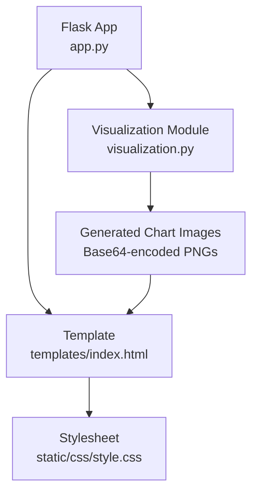
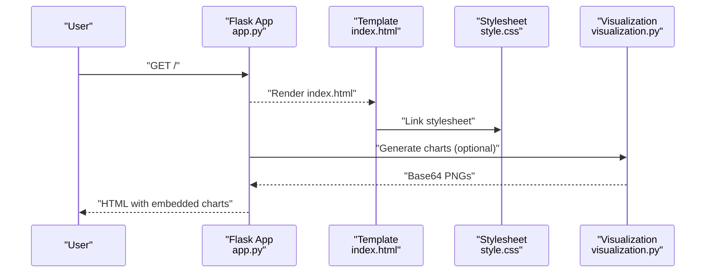
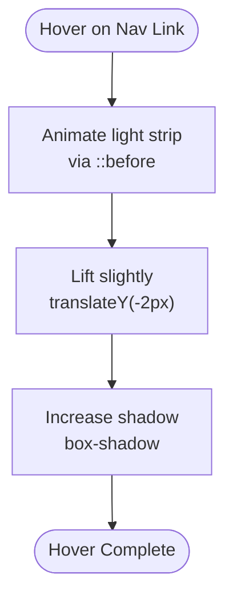
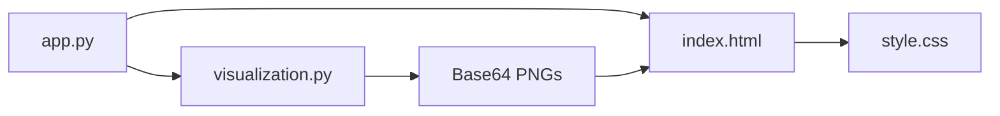

# CSS Styling and Design

<cite>
**Referenced Files in This Document**
- [style.css](file://House_Price_Prediction-main/housing1/static/css/style.css)
- [index.html](file://House_Price_Prediction-main/housing1/templates/index.html)
- [app.py](file://House_Price_Prediction-main/housing1/app.py)
- [visualization.py](file://House_Price_Prediction-main/housing1/visualization.py)
- [VISUAL_ENHANCEMENT.md](file://House_Price_Prediction-main/housing1/VISUAL_ENHANCEMENT.md)
- [VIZ_GUIDE.md](file://House_Price_Prediction-main/housing1/VIZ_GUIDE.md)
</cite>

## Table of Contents
1. [Introduction](#introduction)
2. [Project Structure](#project-structure)
3. [Core Components](#core-components)
4. [Architecture Overview](#architecture-overview)
5. [Detailed Component Analysis](#detailed-component-analysis)
6. [Dependency Analysis](#dependency-analysis)
7. [Performance Considerations](#performance-considerations)
8. [Troubleshooting Guide](#troubleshooting-guide)
9. [Conclusion](#conclusion)
10. [Appendices](#appendices)

## Introduction
This document explains the CSS styling system and visual design implementation for the House Price Prediction MLOps application. It covers stylesheet organization, color schemes, typography, responsive design, layout patterns (flexbox/grid concepts), spacing conventions, component styling, interactive elements (hover effects, transitions, animations), and practical examples such as form styling, card layouts, chart container styling, and dashboard widget presentation. It also addresses browser compatibility, performance optimization via efficient selectors, and maintainable CSS architecture patterns.

## Project Structure
The styling system is organized around a single stylesheet integrated into the Flask application and rendered within the Jinja2 template. The visualization pipeline generates chart images embedded into the page, while the CSS handles layout, effects, and responsiveness.

**Diagram sources**
- [app.py:37-102](file://House_Price_Prediction-main/housing1/app.py#L37-L102)
- [index.html:7](file://House_Price_Prediction-main/housing1/templates/index.html#L7)
- [style.css:1-456](file://House_Price_Prediction-main/housing1/static/css/style.css#L1-L456)
- [visualization.py:50-239](file://House_Price_Prediction-main/housing1/visualization.py#L50-L239)

**Section sources**
- [app.py:14-113](file://House_Price_Prediction-main/housing1/app.py#L14-L113)
- [index.html:1-145](file://House_Price_Prediction-main/housing1/templates/index.html#L1-L145)
- [style.css:1-456](file://House_Price_Prediction-main/housing1/static/css/style.css#L1-L456)
- [visualization.py:23-348](file://House_Price_Prediction-main/housing1/visualization.py#L23-L348)

## Core Components
- Global reset and base styles: normalize margins/paddings and establish box sizing.
- Body background: gradient with animated floating SVG pattern and radial gradients for depth.
- Container: glass-morphism effect with backdrop blur, subtle grain overlay, and layered shadows.
- Typography: modern sans-serif stack, consistent sizing, and text shadows for readability.
- Navigation menu: gradient background, rounded chips with hover and active states, animated shine effect.
- Form section: gradient background with staggered input animations, focus states, and shadow transitions.
- Buttons: gradient backgrounds, hover shine, transform effects, and active press-down.
- Results area: gradient border, centered text, bounce-in entrance.
- Visualization section: white card with soft shadows, bordered chart containers, and hover scaling on images.
- Dashboard container: white card with shadow and entrance animation.
- Metrics table: striped rows, gradient header, hover highlighting.
- Animations: slide-in, fade-in, fade-up/down, and bounce-in with delays for staggered effects.
- Responsive breakpoints: mobile-first adjustments for navigation stacking and reduced paddings.

**Section sources**
- [style.css:2-17](file://House_Price_Prediction-main/housing1/static/css/style.css#L2-L17)
- [style.css:19-48](file://House_Price_Prediction-main/housing1/static/css/style.css#L19-L48)
- [style.css:50-74](file://House_Price_Prediction-main/housing1/static/css/style.css#L50-L74)
- [style.css:76-100](file://House_Price_Prediction-main/housing1/static/css/style.css#L76-L100)
- [style.css:102-151](file://House_Price_Prediction-main/housing1/static/css/style.css#L102-L151)
- [style.css:153-197](file://House_Price_Prediction-main/housing1/static/css/style.css#L153-L197)
- [style.css:199-235](file://House_Price_Prediction-main/housing1/static/css/style.css#L199-L235)
- [style.css:237-249](file://House_Price_Prediction-main/housing1/static/css/style.css#L237-L249)
- [style.css:251-270](file://House_Price_Prediction-main/housing1/static/css/style.css#L251-L270)
- [style.css:297-304](file://House_Price_Prediction-main/housing1/static/css/style.css#L297-L304)
- [style.css:306-335](file://House_Price_Prediction-main/housing1/static/css/style.css#L306-L335)
- [style.css:337-392](file://House_Price_Prediction-main/housing1/static/css/style.css#L337-L392)
- [style.css:394-418](file://House_Price_Prediction-main/housing1/static/css/style.css#L394-L418)

## Architecture Overview
The visual architecture integrates server-side rendering with client-side CSS animations and effects. The Flask app renders the Jinja2 template, injecting visualization assets generated by the visualization module. The stylesheet defines the layout, color, typography, and motion design.

**Diagram sources**
- [app.py:37-102](file://House_Price_Prediction-main/housing1/app.py#L37-L102)
- [index.html:7](file://House_Price_Prediction-main/housing1/templates/index.html#L7)
- [style.css:1-456](file://House_Price_Prediction-main/housing1/static/css/style.css#L1-L456)
- [visualization.py:50-239](file://House_Price_Prediction-main/housing1/visualization.py#L50-L239)

## Detailed Component Analysis

### Global Reset and Base Styles
- Establishes border-box sizing and removes default margins/padding.
- Sets a full-viewport gradient background with fixed attachment and hidden horizontal overflow.
- Adds animated floating SVG pattern via ::after and radial gradients via ::before for depth.

**Section sources**
- [style.css:2-17](file://House_Price_Prediction-main/housing1/static/css/style.css#L2-L17)
- [style.css:19-48](file://House_Price_Prediction-main/housing1/static/css/style.css#L19-L48)

### Container and Background Effects
- Central container uses semi-transparent white background, rounded corners, soft shadow, backdrop blur, and a subtle grain overlay.
- Entrance animation slides content from below with fade-in.

**Section sources**
- [style.css:50-74](file://House_Price_Prediction-main/housing1/static/css/style.css#L50-L74)
- [style.css:337-347](file://House_Price_Prediction-main/housing1/static/css/style.css#L337-L347)

### Typography and Headings
- Uses a modern sans-serif stack for readability.
- H1 features centered alignment, text shadow, and a gradient-accent underline with a width-grow animation.

**Section sources**
- [style.css:8-16](file://House_Price_Prediction-main/housing1/static/css/style.css#L8-L16)
- [style.css:76-100](file://House_Price_Prediction-main/housing1/static/css/style.css#L76-L100)

### Navigation Menu
- Centered menu with gradient background and rounded chips.
- Hover effects include animated shine, slight lift, and increased shadow.
- Active state uses a stronger glow.

**Diagram sources**
- [style.css:112-151](file://House_Price_Prediction-main/housing1/static/css/style.css#L112-L151)

**Section sources**
- [style.css:102-151](file://House_Price_Prediction-main/housing1/static/css/style.css#L102-L151)

### Form Section and Inputs
- Gradient background container with staggered input animations.
- Input groups include labels and inputs/selects styled with rounded corners, soft shadows, and transitions.
- Focus state increases elevation and changes background for clarity.

**Section sources**
- [style.css:153-197](file://House_Price_Prediction-main/housing1/static/css/style.css#L153-L197)
- [style.css:162-172](file://House_Price_Prediction-main/housing1/static/css/style.css#L162-L172)

### Buttons
- Gradient button with hover shine, lift, and expanded shadow.
- Press-down effect on click for tactile feedback.

**Section sources**
- [style.css:199-235](file://House_Price_Prediction-main/housing1/static/css/style.css#L199-L235)
- [style.css:431-433](file://House_Price_Prediction-main/housing1/static/css/style.css#L431-L433)

### Results Area
- Gradient border, centered text, and bounce entrance animation.

**Section sources**
- [style.css:237-249](file://House_Price_Prediction-main/housing1/static/css/style.css#L237-L249)

### Visualization Section and Chart Containers
- Card-style visualization section with white background, soft border, and subtle shadow.
- Chart containers include titles, images, and hover zoom effect.

**Section sources**
- [style.css:251-270](file://House_Price_Prediction-main/housing1/static/css/style.css#L251-L270)
- [style.css:272-295](file://House_Price_Prediction-main/housing1/static/css/style.css#L272-L295)

### Dashboard Container
- White card with shadow and entrance animation.

**Section sources**
- [style.css:297-304](file://House_Price_Prediction-main/housing1/static/css/style.css#L297-L304)

### Metrics Table
- Striped rows, gradient header, and hover highlight for interactivity.

**Section sources**
- [style.css:306-335](file://House_Price_Prediction-main/housing1/static/css/style.css#L306-L335)

### Animations and Transitions
- Staggered entrance animations for inputs and sections.
- Smooth transitions for hover states and focus states.
- Bounce effect for important results.

**Section sources**
- [style.css:162-172](file://House_Price_Prediction-main/housing1/static/css/style.css#L162-L172)
- [style.css:337-392](file://House_Price_Prediction-main/housing1/static/css/style.css#L337-L392)

### Responsive Design
- Mobile-first adjustments: stacked navigation links, reduced paddings, smaller font sizes for headings and inputs.

**Section sources**
- [style.css:394-418](file://House_Price_Prediction-main/housing1/static/css/style.css#L394-L418)

### Interactive Elements and Effects
- Scrollbar styling with gradient thumb and hover transition.
- Footer with fade-in entrance.

**Section sources**
- [style.css:421-428](file://House_Price_Prediction-main/housing1/static/css/style.css#L421-L428)
- [style.css:439-456](file://House_Price_Prediction-main/housing1/static/css/style.css#L439-L456)

### Practical Examples

#### Form Styling
- Enclosed in a gradient card with staggered input animations.
- Inputs use rounded corners, soft shadows, and transitions; focus state elevates and brightens.

**Section sources**
- [style.css:153-197](file://House_Price_Prediction-main/housing1/static/css/style.css#L153-L197)
- [index.html:81-127](file://House_Price_Prediction-main/housing1/templates/index.html#L81-L127)

#### Card Layouts
- Container and visualization/dashboard sections use white backgrounds, rounded corners, and soft shadows to create depth.

**Section sources**
- [style.css:50-74](file://House_Price_Prediction-main/housing1/static/css/style.css#L50-L74)
- [style.css:251-270](file://House_Price_Prediction-main/housing1/static/css/style.css#L251-L270)
- [style.css:297-304](file://House_Price_Prediction-main/housing1/static/css/style.css#L297-L304)

#### Chart Container Styling
- Consistent borders, shadows, and hover zoom on images; titles use gradient text effect.

**Section sources**
- [style.css:261-295](file://House_Price_Prediction-main/housing1/static/css/style.css#L261-L295)

#### Dashboard Widget Presentation
- Interactive dashboard content is embedded via Plotly HTML; styled cards and containers provide consistent presentation.

**Section sources**
- [visualization.py:241-293](file://House_Price_Prediction-main/housing1/visualization.py#L241-L293)
- [index.html:76-78](file://House_Price_Prediction-main/housing1/templates/index.html#L76-L78)

## Dependency Analysis
The visual system depends on:
- Flask routing to render the template and inject visualization assets.
- Jinja2 template linking the stylesheet and embedding base64-encoded chart images.
- Visualization module generating static images and interactive dashboards.

**Diagram sources**
- [app.py:37-102](file://House_Price_Prediction-main/housing1/app.py#L37-L102)
- [index.html:7](file://House_Price_Prediction-main/housing1/templates/index.html#L7)
- [style.css:1-456](file://House_Price_Prediction-main/housing1/static/css/style.css#L1-L456)
- [visualization.py:50-239](file://House_Price_Prediction-main/housing1/visualization.py#L50-L239)

**Section sources**
- [app.py:37-102](file://House_Price_Prediction-main/housing1/app.py#L37-L102)
- [index.html:7](file://House_Price_Prediction-main/housing1/templates/index.html#L7)
- [visualization.py:50-239](file://House_Price_Prediction-main/housing1/visualization.py#L50-L239)

## Performance Considerations
- Efficient selectors: prefer class-based selectors and avoid deep nesting to reduce specificity and improve maintainability.
- Hardware-accelerated animations: leverage transforms and opacity for smoother performance.
- Minimal asset footprint: inline SVG patterns as data URIs and keep images optimized; rely on base64 embedding for simplicity.
- Progressive enhancement: ensure core content remains usable without JavaScript; animations degrade gracefully.
- CSS delivery: include a single stylesheet and defer non-critical animations until after initial render.

[No sources needed since this section provides general guidance]

## Troubleshooting Guide
- Navigation active state: verify active class logic in the template and corresponding CSS for active styling.
- Chart rendering: confirm base64 images are passed correctly from the visualization module and embedded in the template.
- Responsive layout: test on small screens to ensure stacked navigation and adjusted paddings take effect.
- Browser compatibility: verify gradient support, backdrop-filter, and keyframe animations across target browsers.

**Section sources**
- [index.html:14-19](file://House_Price_Prediction-main/housing1/templates/index.html#L14-L19)
- [app.py:68-89](file://House_Price_Prediction-main/housing1/app.py#L68-L89)
- [style.css:394-418](file://House_Price_Prediction-main/housing1/static/css/style.css#L394-L418)

## Conclusion
The CSS styling system delivers a modern, visually engaging interface with layered backgrounds, glass-morphism containers, and smooth animations. It supports responsive behavior, consistent typography, and interactive elements. The integration with the visualization pipeline ensures that charts and dashboards are presented professionally within a cohesive design language.

[No sources needed since this section summarizes without analyzing specific files]

## Appendices

### Color Scheme Reference
- Primary gradient: purple-to-indigo for backgrounds and accents.
- Secondary accent: pink-to-coral for navigation chips.
- Button gradient: red-to-orange with hover transitions.
- Text: high-contrast for readability.

**Section sources**
- [VISUAL_ENHANCEMENT.md:63-69](file://House_Price_Prediction-main/housing1/VISUAL_ENHANCEMENT.md#L63-L69)

### Typography Choices
- Font family: modern sans-serif stack for clarity.
- Headings: centered, with text shadows and gradient underlines.
- Inputs and labels: consistent sizing and weights for readability.

**Section sources**
- [style.css:8-16](file://House_Price_Prediction-main/housing1/static/css/style.css#L8-L16)
- [style.css:174-180](file://House_Price_Prediction-main/housing1/static/css/style.css#L174-L180)

### Layout Patterns and Spacing
- Flexbox/grid concepts: although pure CSS Grid/Flex is not explicitly used, the layout relies on block-level containers and media queries for responsiveness.
- Spacing: consistent padding/margins across containers and inputs; reduced spacing on mobile.

**Section sources**
- [style.css:50-61](file://House_Price_Prediction-main/housing1/static/css/style.css#L50-L61)
- [style.css:394-418](file://House_Price_Prediction-main/housing1/static/css/style.css#L394-L418)

### Browser Compatibility Notes
- Gradients, shadows, and animations are widely supported in modern browsers.
- Backdrop filter and advanced effects may require vendor prefixes or fallbacks on older browsers.

**Section sources**
- [VISUAL_ENHANCEMENT.md:159-163](file://House_Price_Prediction-main/housing1/VISUAL_ENHANCEMENT.md#L159-L163)

### Maintaining the CSS Architecture
- Keep styles modular: separate concerns into containers, forms, navigation, and utilities.
- Use consistent naming: BEM-like class names aid readability and prevent conflicts.
- Centralize color and typography tokens in comments or a design system document for easy updates.

**Section sources**
- [VISUAL_ENHANCEMENT.md:121-134](file://House_Price_Prediction-main/housing1/VISUAL_ENHANCEMENT.md#L121-L134)