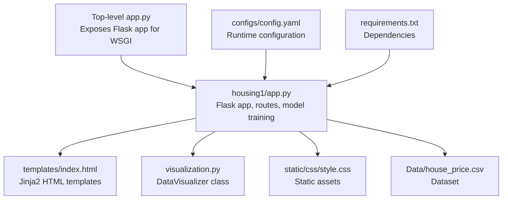
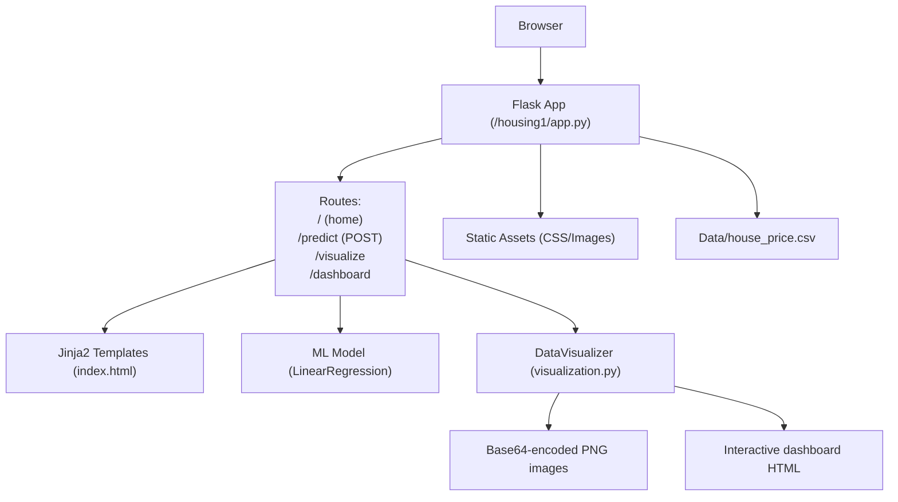
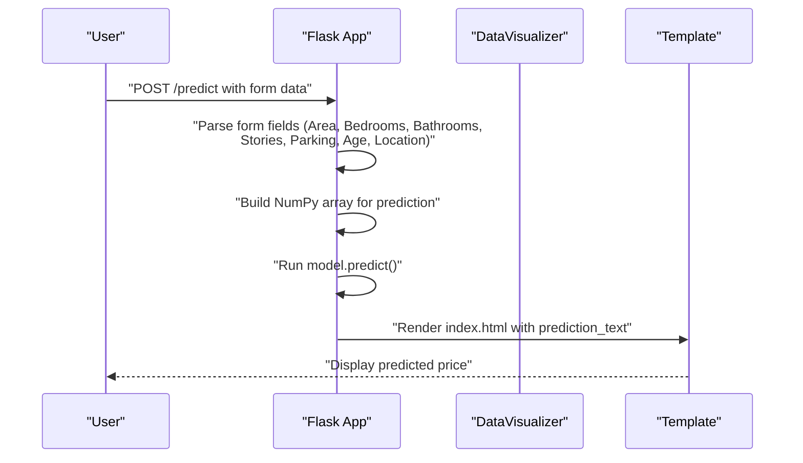
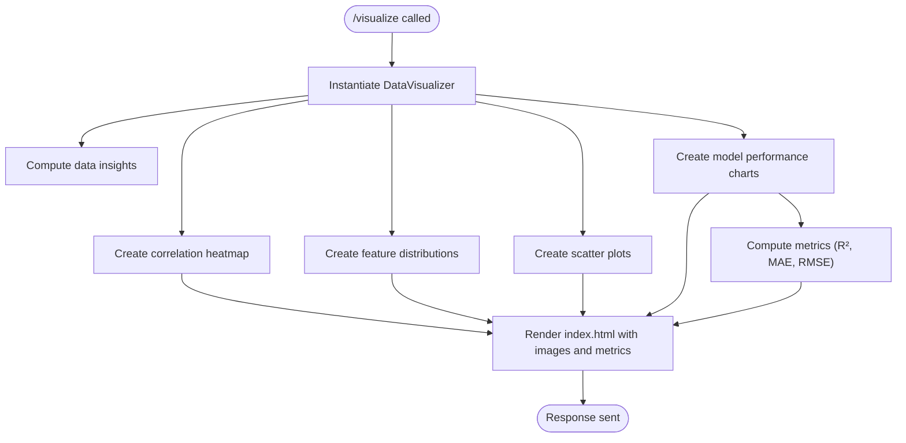
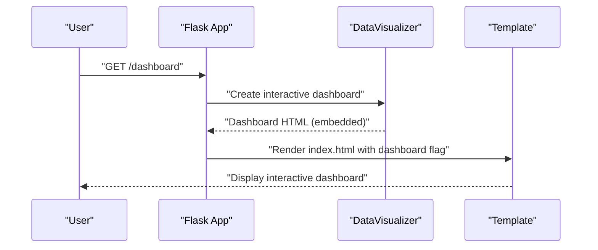
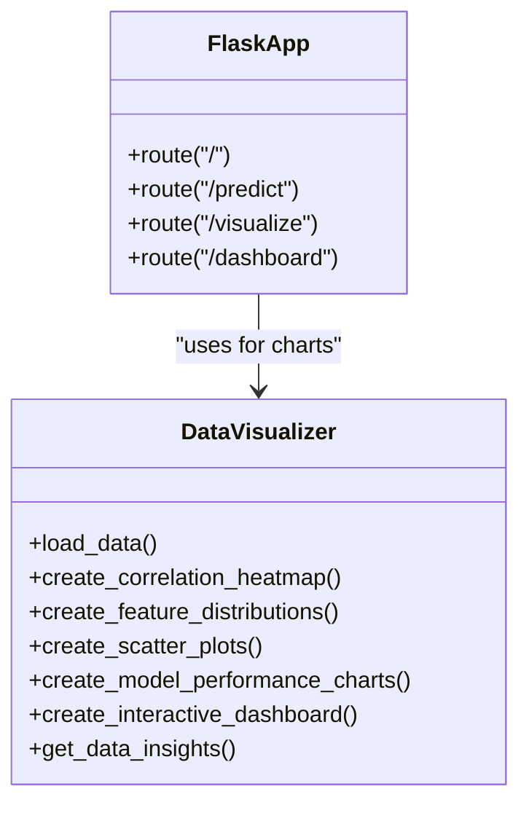
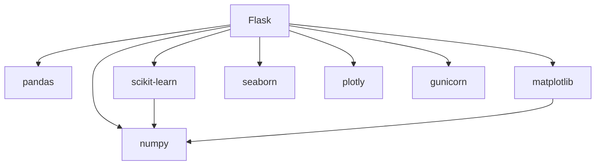

# Flask Application Architecture

<cite>
**Referenced Files in This Document**
- [app.py](file://House_Price_Prediction-main/housing1/app.py)
- [run_app.py](file://House_Price_Prediction-main/housing1/run_app.py)
- [config.yaml](file://House_Price_Prediction-main/housing1/configs/config.yaml)
- [config.example.yaml](file://House_Price_Prediction-main/housing1/configs/config.example.yaml)
- [config.py](file://House_Price_Prediction-main/housing1/src/config.py)
- [visualization.py](file://House_Price_Prediction-main/housing1/visualization.py)
- [index.html](file://House_Price_Prediction-main/housing1/templates/index.html)
- [requirements.txt](file://House_Price_Prediction-main/housing1/requirements.txt)
- [app.py](file://app.py)
</cite>

## Table of Contents
1. [Introduction](#introduction)
2. [Project Structure](#project-structure)
3. [Core Components](#core-components)
4. [Architecture Overview](#architecture-overview)
5. [Detailed Component Analysis](#detailed-component-analysis)
6. [Dependency Analysis](#dependency-analysis)
7. [Performance Considerations](#performance-considerations)
8. [Troubleshooting Guide](#troubleshooting-guide)
9. [Conclusion](#conclusion)
10. [Appendices](#appendices)

## Introduction
This document explains the Flask application architecture and routing system for a house price prediction web app. It covers Flask initialization, configuration, route definitions (GET and POST), parameter handling, response formatting, integration with machine learning models, data visualization components, and the Jinja2 template rendering system. It also provides practical examples of route handlers, error handling mechanisms, environment-based configuration, and guidance for production deployment, including port configuration and differences between development and production modes.

## Project Structure
The application is organized around a Flask app with supporting modules for visualization, configuration, and templating. The top-level entry script adjusts the Python path and working directory to target the housing1 subproject, then exposes the Flask app for WSGI servers.

**Diagram sources**
- [app.py:1-113](file://House_Price_Prediction-main/housing1/app.py#L1-L113)
- [index.html:1-145](file://House_Price_Prediction-main/housing1/templates/index.html#L1-L145)
- [visualization.py:1-348](file://House_Price_Prediction-main/housing1/visualization.py#L1-L348)
- [config.yaml:1-60](file://House_Price_Prediction-main/housing1/configs/config.yaml#L1-L60)
- [requirements.txt:1-24](file://House_Price_Prediction-main/housing1/requirements.txt#L1-L24)
- [app.py:1-22](file://app.py#L1-L22)

**Section sources**
- [app.py:1-113](file://House_Price_Prediction-main/housing1/app.py#L1-L113)
- [app.py:1-22](file://app.py#L1-L22)

## Core Components
- Flask application initialization and static asset configuration
- Route handlers for homepage, prediction, visualizations, and dashboard
- Machine learning model training and prediction pipeline
- Data visualization utilities and interactive dashboards
- Template rendering with dynamic content injection
- Environment-aware configuration and port selection

**Section sources**
- [app.py:14-35](file://House_Price_Prediction-main/housing1/app.py#L14-L35)
- [app.py:37-102](file://House_Price_Prediction-main/housing1/app.py#L37-L102)
- [visualization.py:23-316](file://House_Price_Prediction-main/housing1/visualization.py#L23-L316)
- [index.html:1-145](file://House_Price_Prediction-main/housing1/templates/index.html#L1-L145)

## Architecture Overview
The Flask app initializes, loads and trains a model on startup, defines routes for serving the UI, performing predictions, and generating visualizations. Visualization utilities produce static images and interactive dashboards embedded in the template.

**Diagram sources**
- [app.py:37-102](file://House_Price_Prediction-main/housing1/app.py#L37-L102)
- [visualization.py:23-316](file://House_Price_Prediction-main/housing1/visualization.py#L23-L316)
- [index.html:1-145](file://House_Price_Prediction-main/housing1/templates/index.html#L1-L145)

## Detailed Component Analysis

### Flask Application Initialization and Configuration
- The Flask app is created and configured with a static folder for assets.
- The dataset is loaded and a LinearRegression model is trained during application startup.
- Port configuration supports environment variables for production deployments.

Key behaviors:
- Static folder configuration for serving CSS/images.
- Dataset path resolution relative to the app’s directory.
- Model training performed once at startup.

**Section sources**
- [app.py:14-35](file://House_Price_Prediction-main/housing1/app.py#L14-L35)
- [app.py:105-113](file://House_Price_Prediction-main/housing1/app.py#L105-L113)

### Route Definitions and Handlers

#### Home Route (/)
- Purpose: Render the main page with the prediction form.
- Behavior: Renders the index template without any visualization flags.

**Section sources**
- [app.py:37-39](file://House_Price_Prediction-main/housing1/app.py#L37-L39)
- [index.html:80-138](file://House_Price_Prediction-main/housing1/templates/index.html#L80-L138)

#### Prediction Route (/predict)
- Method: POST
- Purpose: Accept form inputs, prepare a feature vector, run inference, and render the result.
- Parameter handling:
  - Reads numeric fields from the form: Area, Bedrooms, Bathrooms, Stories, Parking, Age, Location.
  - Converts inputs to floats and constructs a NumPy array for prediction.
- Response formatting:
  - On success: renders the index template with a formatted prediction text.
  - On error: catches exceptions and displays an error message via the template.

**Diagram sources**
- [app.py:42-66](file://House_Price_Prediction-main/housing1/app.py#L42-L66)
- [index.html:129-136](file://House_Price_Prediction-main/housing1/templates/index.html#L129-L136)

**Section sources**
- [app.py:42-66](file://House_Price_Prediction-main/housing1/app.py#L42-L66)
- [index.html:80-138](file://House_Price_Prediction-main/housing1/templates/index.html#L80-L138)

#### Visualization Route (/visualize)
- Purpose: Generate and display static visualizations and metrics.
- Behavior:
  - Creates a DataVisualizer instance.
  - Produces correlation heatmap, feature distributions, scatter plots, and model performance charts.
  - Computes performance metrics and data insights.
  - Renders the index template with flags and image data injected as base64 strings.

**Diagram sources**
- [app.py:68-89](file://House_Price_Prediction-main/housing1/app.py#L68-L89)
- [visualization.py:23-239](file://House_Price_Prediction-main/housing1/visualization.py#L23-L239)
- [index.html:21-72](file://House_Price_Prediction-main/housing1/templates/index.html#L21-L72)

**Section sources**
- [app.py:68-89](file://House_Price_Prediction-main/housing1/app.py#L68-L89)
- [visualization.py:23-239](file://House_Price_Prediction-main/housing1/visualization.py#L23-L239)
- [index.html:21-72](file://House_Price_Prediction-main/housing1/templates/index.html#L21-L72)

#### Dashboard Route (/dashboard)
- Purpose: Render an interactive dashboard powered by Plotly.
- Behavior:
  - Creates a DataVisualizer instance.
  - Builds an interactive dashboard with multiple subplots.
  - Embeds the dashboard HTML into the template for rendering.

**Diagram sources**
- [app.py:92-102](file://House_Price_Prediction-main/housing1/app.py#L92-L102)
- [visualization.py:241-293](file://House_Price_Prediction-main/housing1/visualization.py#L241-L293)
- [index.html:73-79](file://House_Price_Prediction-main/housing1/templates/index.html#L73-L79)

**Section sources**
- [app.py:92-102](file://House_Price_Prediction-main/housing1/app.py#L92-L102)
- [visualization.py:241-293](file://House_Price_Prediction-main/housing1/visualization.py#L241-L293)
- [index.html:73-79](file://House_Price_Prediction-main/housing1/templates/index.html#L73-L79)

### Template Rendering System
- The Jinja2 template index.html conditionally renders:
  - The prediction form by default.
  - Visualization sections with multiple charts and metrics.
  - An interactive dashboard with embedded Plotly HTML.
- Images are embedded as base64-encoded PNG data URIs for immediate display.
- Navigation highlights the active tab based on flags passed from routes.

**Section sources**
- [index.html:1-145](file://House_Price_Prediction-main/housing1/templates/index.html#L1-L145)

### Machine Learning Integration
- Model training:
  - The dataset is loaded and split into features and target.
  - A LinearRegression model is fitted on the training split.
- Prediction:
  - The trained model is used to predict house prices from user-provided features.
- Visualization metrics:
  - Performance charts and metrics are computed using scikit-learn metrics.

**Diagram sources**
- [visualization.py:23-316](file://House_Price_Prediction-main/housing1/visualization.py#L23-L316)
- [app.py:37-102](file://House_Price_Prediction-main/housing1/app.py#L37-L102)

**Section sources**
- [app.py:21-34](file://House_Price_Prediction-main/housing1/app.py#L21-L34)
- [visualization.py:149-239](file://House_Price_Prediction-main/housing1/visualization.py#L149-L239)

### Environment-Based Configuration and Deployment
- Port configuration:
  - The app reads the PORT environment variable with a fallback to 5000.
- Production vs development:
  - In production contexts, debug is disabled; in development, debug is enabled.
- Top-level entry script:
  - Adjusts Python path and working directory to the housing1 subproject.
  - Exposes the Flask app for WSGI servers like gunicorn.

**Section sources**
- [app.py:105-113](file://House_Price_Prediction-main/housing1/app.py#L105-L113)
- [app.py:1-22](file://app.py#L1-L22)
- [config.yaml:48-54](file://House_Price_Prediction-main/housing1/configs/config.yaml#L48-L54)
- [config.example.yaml:43-47](file://House_Price_Prediction-main/housing1/configs/config.example.yaml#L43-L47)

## Dependency Analysis
The Flask app depends on several libraries for data processing, modeling, visualization, and production deployment. The requirements file lists core dependencies, visualization libraries, monitoring/logging utilities, and a production WSGI server.

**Diagram sources**
- [requirements.txt:1-24](file://House_Price_Prediction-main/housing1/requirements.txt#L1-L24)

**Section sources**
- [requirements.txt:1-24](file://House_Price_Prediction-main/housing1/requirements.txt#L1-L24)

## Performance Considerations
- Model training occurs at startup; keep datasets reasonably sized to minimize cold-start latency.
- Visualization generation creates multiple figures; consider caching or pre-generating images for repeated requests.
- Using a non-interactive Matplotlib backend avoids GUI dependencies in server environments.
- For production, use a WSGI server (e.g., gunicorn) and disable debug mode to reduce overhead.

[No sources needed since this section provides general guidance]

## Troubleshooting Guide
Common issues and remedies:
- Missing data file:
  - Ensure the CSV dataset exists at the expected path resolved by the app.
- Missing dependencies:
  - Install required packages listed in the requirements file.
- Port conflicts:
  - Set the PORT environment variable to an available port.
- Debugging in development:
  - Enable debug mode locally; disable in production.

**Section sources**
- [run_app.py:36-42](file://House_Price_Prediction-main/housing1/run_app.py#L36-L42)
- [requirements.txt:1-24](file://House_Price_Prediction-main/housing1/requirements.txt#L1-L24)
- [app.py:105-113](file://House_Price_Prediction-main/housing1/app.py#L105-L113)

## Conclusion
The Flask application integrates a trained machine learning model with a responsive web interface. Routes serve the prediction form, compute predictions, and render visualizations and interactive dashboards. Environment-aware configuration and a production-ready entry script support deployment. The architecture balances simplicity with extensibility for future enhancements.

[No sources needed since this section summarizes without analyzing specific files]

## Appendices

### Practical Examples of Route Handlers
- Home handler: renders the index template.
- Prediction handler: parses form inputs, runs inference, and renders the result.
- Visualization handler: generates multiple charts and metrics and injects them into the template.
- Dashboard handler: builds an interactive Plotly dashboard and embeds it in the template.

**Section sources**
- [app.py:37-102](file://House_Price_Prediction-main/housing1/app.py#L37-L102)
- [index.html:1-145](file://House_Price_Prediction-main/housing1/templates/index.html#L1-L145)

### Configuration Reference
- API configuration includes host, port, debug, and worker settings suitable for development and production.
- Example configuration demonstrates recommended defaults and environment-specific overrides.

**Section sources**
- [config.yaml:48-54](file://House_Price_Prediction-main/housing1/configs/config.yaml#L48-L54)
- [config.example.yaml:43-47](file://House_Price_Prediction-main/housing1/configs/config.example.yaml#L43-L47)