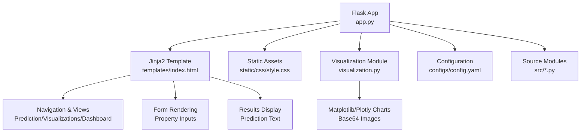
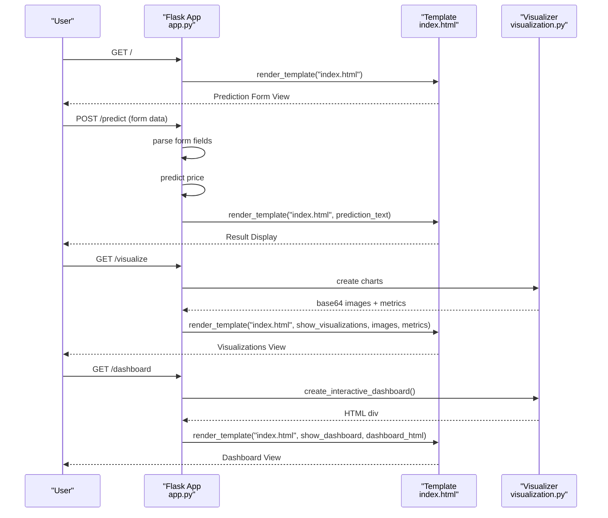
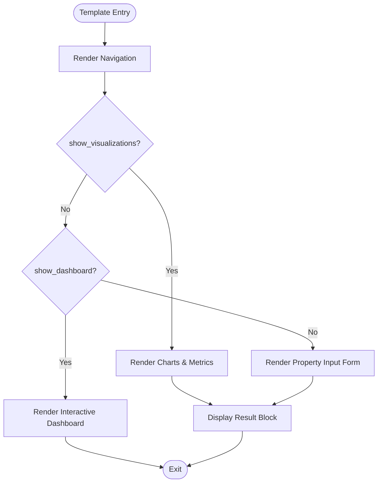
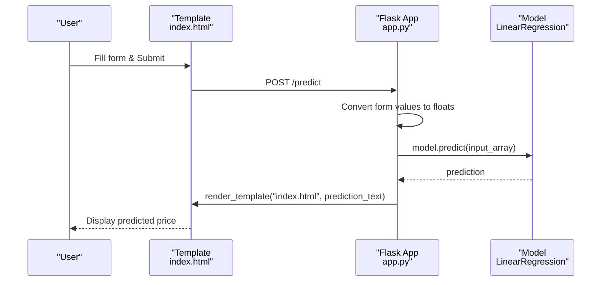
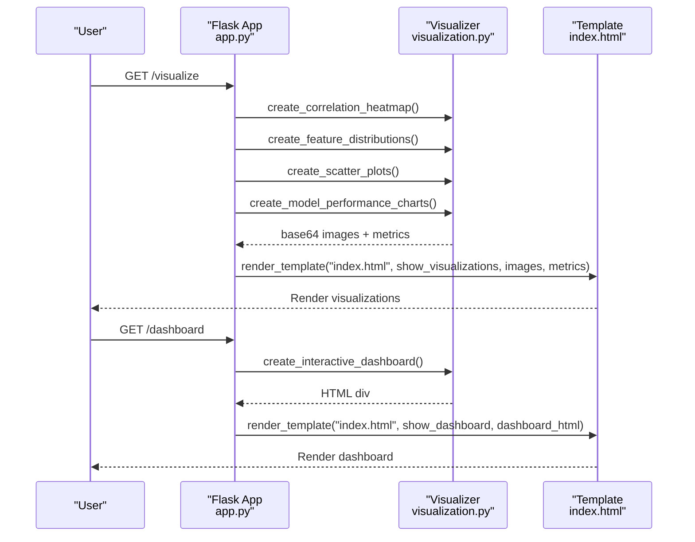
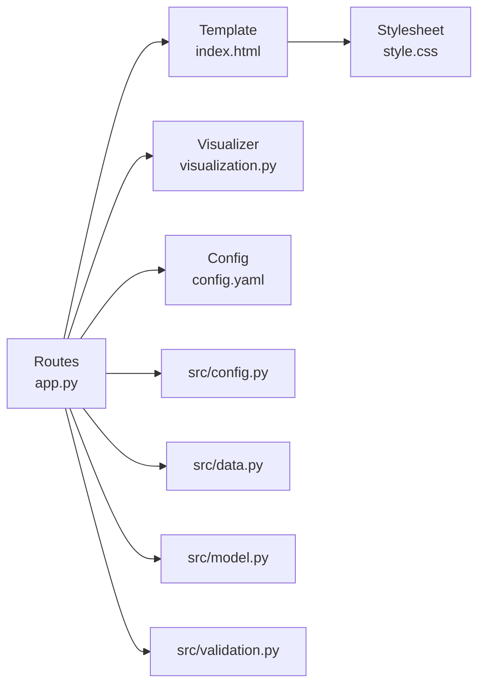

# HTML Templates and Forms

<cite>
**Referenced Files in This Document**
- [index.html](file://House_Price_Prediction-main/housing1/templates/index.html)
- [app.py](file://House_Price_Prediction-main/housing1/app.py)
- [style.css](file://House_Price_Prediction-main/housing1/static/css/style.css)
- [visualization.py](file://House_Price_Prediction-main/housing1/visualization.py)
- [config.yaml](file://House_Price_Prediction-main/housing1/configs/config.yaml)
- [config.py](file://House_Price_Prediction-main/housing1/src/config.py)
- [data.py](file://House_Price_Prediction-main/housing1/src/data.py)
- [model.py](file://House_Price_Prediction-main/housing1/src/model.py)
- [validation.py](file://House_Price_Prediction-main/housing1/src/validation.py)
- [test_components.py](file://House_Price_Prediction-main/housing1/tests/test_components.py)
</cite>

## Table of Contents
1. [Introduction](#introduction)
2. [Project Structure](#project-structure)
3. [Core Components](#core-components)
4. [Architecture Overview](#architecture-overview)
5. [Detailed Component Analysis](#detailed-component-analysis)
6. [Dependency Analysis](#dependency-analysis)
7. [Performance Considerations](#performance-considerations)
8. [Troubleshooting Guide](#troubleshooting-guide)
9. [Conclusion](#conclusion)
10. [Appendices](#appendices)

## Introduction
This document explains the HTML templates and form handling system used in the House Price Prediction application. It focuses on the Jinja2 template structure, variable interpolation, conditional rendering, and navigation between views. It also documents the property input form, including field validation, user-friendly labels, and how results are displayed. The document covers template inheritance patterns, block definitions, and dynamic content insertion for visualizations and dashboards. Practical examples illustrate form submission handling, error display formatting, and responsive layout adaptation. Finally, it addresses template security considerations, XSS prevention, and cross-browser compatibility for form elements.

## Project Structure
The application follows a clear separation of concerns:
- Flask routes render Jinja2 templates and pass data to the frontend.
- Templates define views and conditional blocks for predictions, visualizations, and dashboards.
- Static assets (CSS) provide responsive styling and animations.
- Visualization utilities generate images and interactive dashboards for rendering in templates.

**Diagram sources**
- [app.py:37-102](file://House_Price_Prediction-main/housing1/app.py#L37-L102)
- [index.html:14-138](file://House_Price_Prediction-main/housing1/templates/index.html#L14-L138)
- [style.css:1-456](file://House_Price_Prediction-main/housing1/static/css/style.css#L1-L456)
- [visualization.py:23-316](file://House_Price_Prediction-main/housing1/visualization.py#L23-L316)
- [config.yaml:1-60](file://House_Price_Prediction-main/housing1/configs/config.yaml#L1-L60)

**Section sources**
- [app.py:14-113](file://House_Price_Prediction-main/housing1/app.py#L14-L113)
- [index.html:1-145](file://House_Price_Prediction-main/housing1/templates/index.html#L1-L145)
- [style.css:1-456](file://House_Price_Prediction-main/housing1/static/css/style.css#L1-L456)

## Core Components
- Template engine: Jinja2 via Flask’s render_template.
- Routes:
  - Home route renders the base template.
  - Prediction route handles POST requests and returns prediction results.
  - Visualization route renders charts and metrics.
  - Dashboard route renders an interactive Plotly dashboard.
- Template variables:
  - show_visualizations, show_dashboard toggle views.
  - Base64-encoded image data for charts.
  - Metrics and insights dictionaries.
  - prediction_text for displaying results.
- Styling: CSS provides responsive design and animations.

Key template features:
- Conditional rendering using Jinja2 conditionals.
- Variable interpolation for images and metrics.
- Safe rendering of HTML content for interactive dashboards.
- Navigation menu with active state based on current view.

**Section sources**
- [app.py:37-102](file://House_Price_Prediction-main/housing1/app.py#L37-L102)
- [index.html:14-138](file://House_Price_Prediction-main/housing1/templates/index.html#L14-L138)
- [style.css:394-418](file://House_Price_Prediction-main/housing1/static/css/style.css#L394-L418)

## Architecture Overview
The template-driven architecture integrates Flask routes, Jinja2 templates, and visualization utilities to deliver dynamic content.

**Diagram sources**
- [app.py:37-102](file://House_Price_Prediction-main/housing1/app.py#L37-L102)
- [index.html:14-138](file://House_Price_Prediction-main/housing1/templates/index.html#L14-L138)
- [visualization.py:50-293](file://House_Price_Prediction-main/housing1/visualization.py#L50-L293)

## Detailed Component Analysis

### Template Structure and Conditional Rendering
- Navigation menu toggles active state based on current view.
- Conditional blocks switch between:
  - Prediction form view.
  - Visualizations view with charts and metrics.
  - Dashboard view with interactive Plotly content.
- Variables passed from routes:
  - show_visualizations, show_dashboard.
  - Base64-encoded images for charts.
  - Metrics dictionary and insights object.
  - prediction_text for result display.

**Diagram sources**
- [index.html:14-138](file://House_Price_Prediction-main/housing1/templates/index.html#L14-L138)

**Section sources**
- [index.html:14-138](file://House_Price_Prediction-main/housing1/templates/index.html#L14-L138)

### Property Input Form and Validation
- Form fields:
  - Number inputs for Area, Bedrooms, Bathrooms, Stories, Parking, Age.
  - Select dropdown for Location.
- Labels and placeholders provide user-friendly guidance.
- Submission handled via POST to /predict.
- Route parses numeric fields, constructs input array, predicts price, and returns result.

**Diagram sources**
- [index.html:83-127](file://House_Price_Prediction-main/housing1/templates/index.html#L83-L127)
- [app.py:42-66](file://House_Price_Prediction-main/housing1/app.py#L42-L66)

Validation and error handling:
- Route attempts conversion to float for each field.
- On success, prediction is formatted and returned.
- On exception, an error message is rendered.

Real-time feedback:
- The template displays a result block that updates after submission.
- Placeholder text indicates expected input format.

**Section sources**
- [index.html:83-127](file://House_Price_Prediction-main/housing1/templates/index.html#L83-L127)
- [app.py:42-66](file://House_Price_Prediction-main/housing1/app.py#L42-L66)

### Dynamic Content Insertion for Visualizations and Dashboard
- Visualizations:
  - Correlation heatmap, feature distributions, scatter plots, and performance charts are generated as base64 PNG images.
  - Metrics (R², MAE, RMSE) are passed as a dictionary and formatted in the template.
  - Data insights include shape, numeric columns, and price statistics.
- Dashboard:
  - An interactive Plotly figure is embedded as HTML using a safe rendering mechanism.

**Diagram sources**
- [app.py:68-102](file://House_Price_Prediction-main/housing1/app.py#L68-L102)
- [visualization.py:50-293](file://House_Price_Prediction-main/housing1/visualization.py#L50-L293)
- [index.html:21-79](file://House_Price_Prediction-main/housing1/templates/index.html#L21-L79)

**Section sources**
- [app.py:68-102](file://House_Price_Prediction-main/housing1/app.py#L68-L102)
- [visualization.py:50-293](file://House_Price_Prediction-main/housing1/visualization.py#L50-L293)
- [index.html:21-79](file://House_Price_Prediction-main/housing1/templates/index.html#L21-L79)

### Template Inheritance Patterns and Blocks
- The project does not implement Jinja2 template inheritance with extends and blocks.
- The single template file serves all views and uses conditional rendering to switch content dynamically.
- Navigation and view-specific sections are controlled via variables passed from routes.

Practical implication:
- Keep view-specific content within conditional blocks in the single template.
- Pass only necessary variables to avoid template bloat.

**Section sources**
- [index.html:14-138](file://House_Price_Prediction-main/housing1/templates/index.html#L14-L138)

### Responsive Layout Adaptation
- CSS media queries adapt layout for mobile devices.
- Adjustments include container padding, font sizes, and navigation layout.
- Input groups and buttons maintain usability across screen sizes.

**Section sources**
- [style.css:394-418](file://House_Price_Prediction-main/housing1/static/css/style.css#L394-L418)

### Cross-Browser Compatibility for Form Elements
- Number inputs and select dropdowns are widely supported.
- Placeholders improve UX without relying on JavaScript.
- Ensure consistent styling across browsers using vendor-neutral CSS.

**Section sources**
- [index.html:83-122](file://House_Price_Prediction-main/housing1/templates/index.html#L83-L122)
- [style.css:174-197](file://House_Price_Prediction-main/housing1/static/css/style.css#L174-L197)

## Dependency Analysis
The template system depends on:
- Flask routes to supply data to the template.
- Visualization utilities to produce images and interactive content.
- Static CSS for responsive styling.

**Diagram sources**
- [app.py:37-102](file://House_Price_Prediction-main/housing1/app.py#L37-L102)
- [index.html:14-138](file://House_Price_Prediction-main/housing1/templates/index.html#L14-L138)
- [style.css:1-456](file://House_Price_Prediction-main/housing1/static/css/style.css#L1-L456)
- [visualization.py:23-316](file://House_Price_Prediction-main/housing1/visualization.py#L23-L316)
- [config.yaml:1-60](file://House_Price_Prediction-main/housing1/configs/config.yaml#L1-L60)
- [config.py:10-63](file://House_Price_Prediction-main/housing1/src/config.py#L10-L63)
- [data.py:13-109](file://House_Price_Prediction-main/housing1/src/data.py#L13-L109)
- [model.py:17-155](file://House_Price_Prediction-main/housing1/src/model.py#L17-L155)
- [validation.py:14-243](file://House_Price_Prediction-main/housing1/src/validation.py#L14-L243)

**Section sources**
- [app.py:37-102](file://House_Price_Prediction-main/housing1/app.py#L37-L102)
- [index.html:14-138](file://House_Price_Prediction-main/housing1/templates/index.html#L14-L138)
- [style.css:1-456](file://House_Price_Prediction-main/housing1/static/css/style.css#L1-L456)
- [visualization.py:23-316](file://House_Price_Prediction-main/housing1/visualization.py#L23-L316)

## Performance Considerations
- Base64-encoded images increase HTML payload size. Consider serving images via static routes for scalability.
- Interactive dashboards rely on client-side JavaScript; ensure efficient HTML rendering and minimal DOM updates.
- Keep the number of variables passed to templates reasonable to reduce template rendering overhead.

[No sources needed since this section provides general guidance]

## Troubleshooting Guide
Common issues and resolutions:
- Form submission errors:
  - Verify numeric fields are properly converted; handle exceptions gracefully and display user-friendly messages.
  - Ensure required attributes are present on inputs to leverage browser validation.
- Chart rendering failures:
  - Confirm visualization functions return valid base64 strings and metrics dictionary.
  - Validate that the template receives all expected variables.
- Dashboard embedding:
  - Use safe rendering for HTML content and ensure Plotly resources are included.

**Section sources**
- [app.py:42-66](file://House_Price_Prediction-main/housing1/app.py#L42-L66)
- [visualization.py:50-293](file://House_Price_Prediction-main/housing1/visualization.py#L50-L293)
- [index.html:76-78](file://House_Price_Prediction-main/housing1/templates/index.html#L76-L78)

## Conclusion
The template and form system leverages Jinja2 conditionals and variable interpolation to deliver a unified, responsive interface across prediction, visualization, and dashboard views. The property input form is straightforward, with clear labels and immediate result feedback. Visualization utilities integrate seamlessly to render charts and metrics, while the dashboard embeds interactive content safely. Following the outlined practices ensures maintainability, security, and cross-browser compatibility.

[No sources needed since this section summarizes without analyzing specific files]

## Appendices

### Practical Examples

- Form submission handling:
  - Submit the property form to /predict.
  - The route parses numeric inputs, runs prediction, and returns a formatted result.
  - The template displays the result in a dedicated block.

- Error display formatting:
  - On exceptions during prediction, the route passes an error message to the template.
  - The template renders the message prominently for user awareness.

- Responsive layout adaptation:
  - The stylesheet adjusts spacing, typography, and navigation for smaller screens.
  - Input groups and buttons remain usable across devices.

**Section sources**
- [index.html:83-136](file://House_Price_Prediction-main/housing1/templates/index.html#L83-L136)
- [app.py:42-66](file://House_Price_Prediction-main/housing1/app.py#L42-L66)
- [style.css:394-418](file://House_Price_Prediction-main/housing1/static/css/style.css#L394-L418)

### Security Considerations and XSS Prevention
- Sanitization:
  - The template renders user-provided prediction_text directly. To prevent XSS, escape or sanitize any user-controlled content before rendering.
- Safe HTML rendering:
  - The dashboard content is marked safe for rendering. Ensure the content originates from trusted sources and is validated.
- Input validation:
  - Enforce numeric conversion and bounds checking on the server side.
- CSP:
  - Consider adding Content-Security-Policy headers to restrict script execution.

[No sources needed since this section provides general guidance]