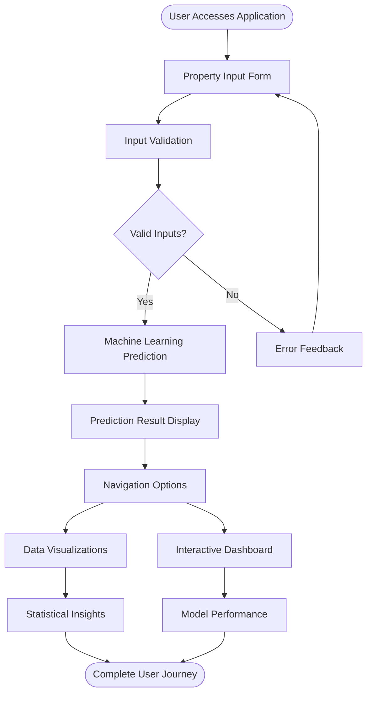
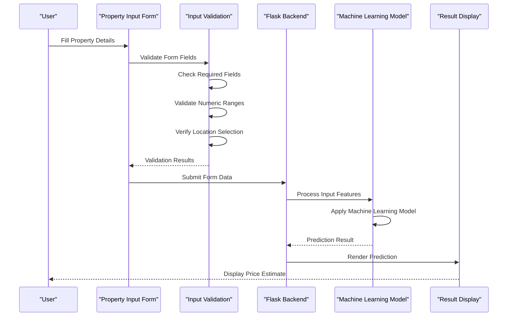
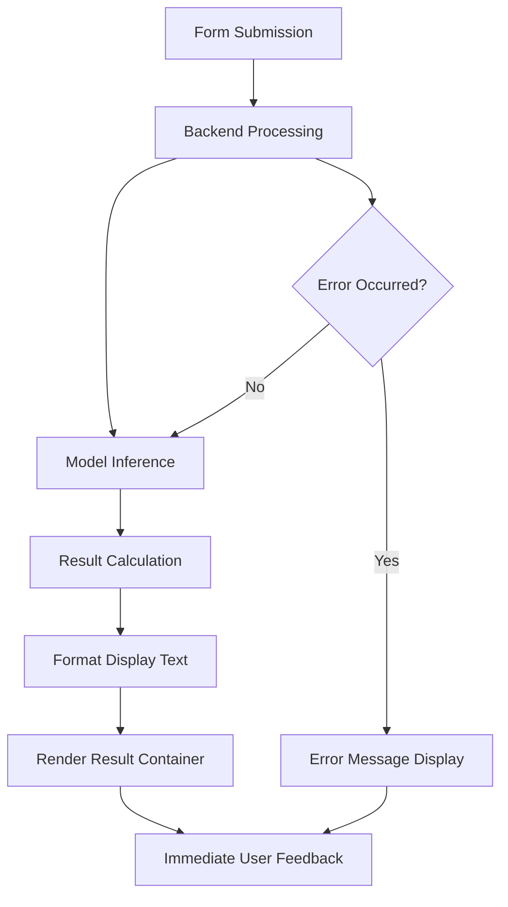
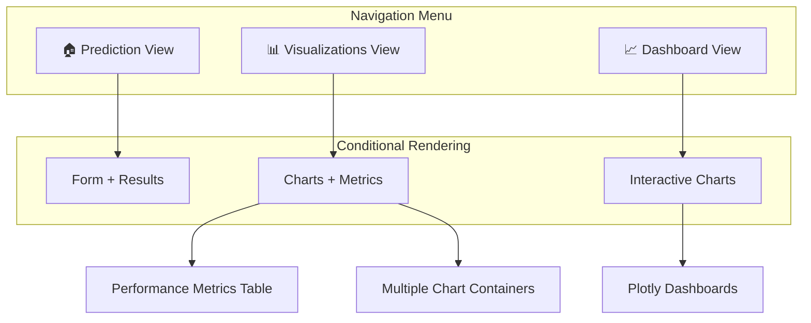
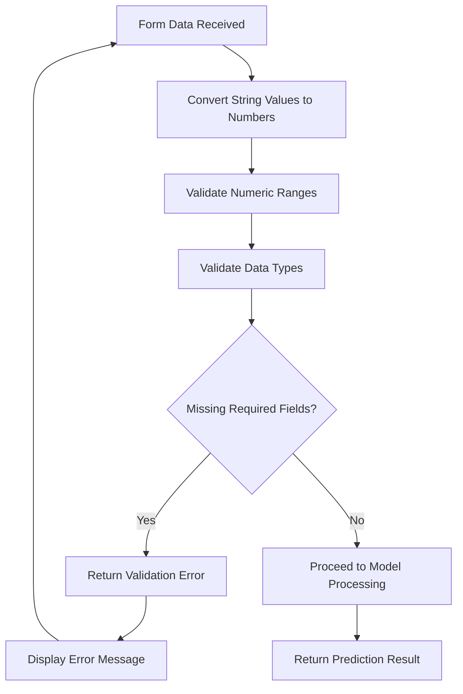
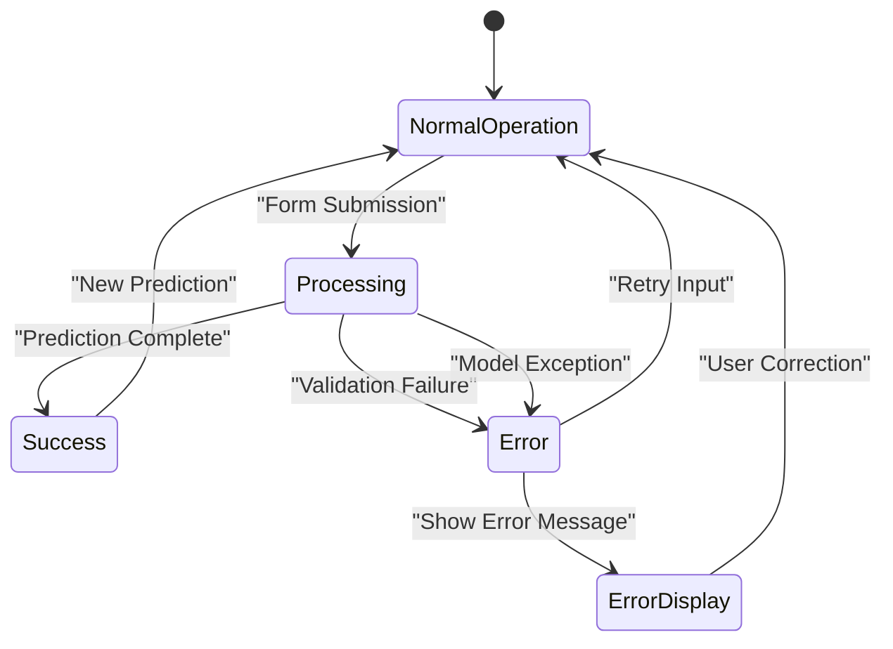
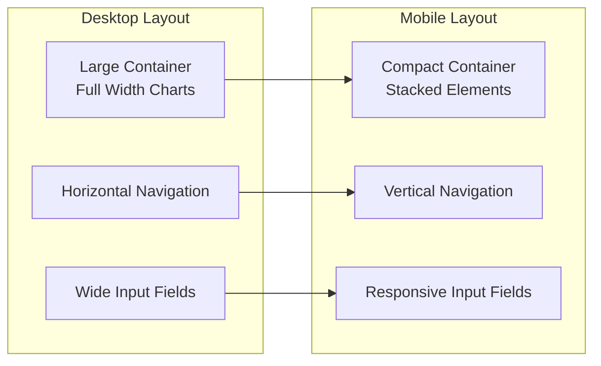

# User Interaction Flows

<cite>
**Referenced Files in This Document**
- [index.html](file://House_Price_Prediction-main\housing1\templates\index.html)
- [app.py](file://House_Price_Prediction-main\housing1\app.py)
- [style.css](file://House_Price_Prediction-main\housing1\static\css\style.css)
- [visualization.py](file://House_Price_Prediction-main\housing1\visualization.py)
- [validation.py](file://House_Price_Prediction-main\housing1\src\validation.py)
- [tracking.py](file://House_Price_Prediction-main\housing1\src\tracking.py)
- [config.yaml](file://House_Price_Prediction-main\housing1\configs\config.yaml)
- [config.py](file://House_Price_Prediction-main\housing1\src\config.py)
- [data.py](file://House_Price_Prediction-main\housing1\src\data.py)
- [model.py](file://House_Price_Prediction-main\housing1\src\model.py)
- [README.md](file://House_Price_Prediction-main\housing1\README.md)
</cite>

## Table of Contents
1. [Introduction](#introduction)
2. [User Journey Overview](#user-journey-overview)
3. [Form Submission Process](#form-submission-process)
4. [Real-time Prediction Display](#real-time-prediction-display)
5. [Navigation Between Views](#navigation-between-views)
6. [Input Validation and Feedback](#input-validation-and-feedback)
7. [Loading States and Error Handling](#loading-states-and-error-handling)
8. [Success Confirmation Messages](#success-confirmation-messages)
9. [Progressive Disclosure Patterns](#progressive-disclosure-patterns)
10. [Contextual Help Implementation](#contextual-help-implementation)
11. [Accessibility Features](#accessibility-features)
12. [Mobile-first Design Considerations](#mobile-first-design-considerations)
13. [Touch Interaction Patterns](#touch-interaction-patterns)
14. [Cross-device User Experience](#cross-device-user-experience)
15. [Performance Considerations](#performance-considerations)
16. [Troubleshooting Guide](#troubleshooting-guide)
17. [Conclusion](#conclusion)

## Introduction

The House Price Prediction application provides a comprehensive user experience for property price estimation through an intuitive web interface. This documentation focuses on the complete user interaction patterns and workflow implementation, covering the entire journey from property input through prediction results to visualization exploration.

The application follows modern web development practices with responsive design, smooth animations, and seamless navigation between different functional areas. Users can input property details, receive immediate price predictions, explore data visualizations, and access interactive dashboards.

## User Journey Overview

The user journey consists of four primary stages:

1. **Property Input Phase**: Users enter property details through an intuitive form
2. **Prediction Processing**: Real-time calculation and result display
3. **Visualization Exploration**: Interactive charts and dashboard navigation
4. **Data Analysis**: Comprehensive statistical insights and model performance metrics

**Diagram sources**
- [index.html:83-127](file://House_Price_Prediction-main\housing1\templates\index.html#L83-L127)
- [app.py:42-66](file://House_Price_Prediction-main\housing1\app.py#L42-L66)

## Form Submission Process

The form submission process follows a structured workflow designed for optimal user experience:

### Form Structure and Field Organization

The property input form is organized into logical groups with clear labeling and intuitive field types:

**Diagram sources**
- [index.html:83-127](file://House_Price_Prediction-main\housing1\templates\index.html#L83-L127)
- [app.py:42-66](file://House_Price_Prediction-main\housing1\app.py#L42-L66)

### Field Types and Input Constraints

The form includes seven distinct input categories:

1. **Area Input**: Square footage measurement with numeric validation
2. **Bedroom Count**: Whole number selection with reasonable range limits
3. **Bathroom Count**: Numeric input with appropriate constraints
4. **Story Count**: Multi-level building specification
5. **Parking Spaces**: Available garage or car space count
6. **House Age**: Historical construction or renovation age
7. **Location Type**: Categorical selection from predefined options

**Section sources**
- [index.html:84-122](file://House_Price_Prediction-main\housing1\templates\index.html#L84-L122)

## Real-time Prediction Display

The prediction display system provides immediate feedback through a carefully designed result presentation:

### Result Presentation Strategy

The application displays predictions using a prominent, visually distinct result container that appears immediately after successful processing:

**Diagram sources**
- [app.py:42-66](file://House_Price_Prediction-main\housing1\app.py#L42-L66)
- [index.html:129-136](file://House_Price_Prediction-main\housing1\templates\index.html#L129-L136)

### Display Formatting and Currency Handling

The prediction results are presented with professional formatting that includes:
- Indian Rupee (₹) currency symbol
- Comma-separated thousands formatting
- Clear visual hierarchy with prominent typography
- Consistent styling with the application's design system

**Section sources**
- [app.py:59-62](file://House_Price_Prediction-main\housing1\app.py#L59-L62)

## Navigation Between Views

The application provides seamless navigation between different functional areas through an intuitive menu system:

### Navigation Architecture

The navigation system consists of three primary view modes controlled by conditional rendering in the template:

**Diagram sources**
- [index.html:14-19](file://House_Price_Prediction-main\housing1\templates\index.html#L14-L19)
- [index.html:21-79](file://House_Price_Prediction-main\housing1\templates\index.html#L21-L79)

### View Transition Patterns

Each navigation element uses sophisticated hover effects and active state indicators:

- **Hover Effects**: Subtle gradient animations and elevation changes
- **Active State**: Distinct styling for currently selected view
- **Smooth Transitions**: CSS animations for view switching
- **Responsive Behavior**: Mobile-friendly navigation layout

**Section sources**
- [index.html:14-19](file://House_Price_Prediction-main\housing1\templates\index.html#L14-L19)
- [style.css:102-151](file://House_Price_Prediction-main\housing1\static\css\style.css#L102-L151)

## Input Validation and Feedback

The application implements comprehensive input validation at multiple levels to ensure data integrity and provide immediate user feedback:

### Frontend Validation Strategy

While the primary validation occurs on the backend, the form includes essential frontend constraints:

- **Required Field Indicators**: Asterisk markers on mandatory fields
- **Type Constraints**: Numeric input types for quantitative fields
- **Placeholder Guidance**: Contextual hints for each input category
- **Selection Validation**: Dropdown menus prevent invalid categorical selections

### Backend Validation Implementation

The server-side validation process includes:

**Diagram sources**
- [app.py:45-65](file://House_Price_Prediction-main\housing1\app.py#L45-L65)

### Validation Error Handling

Error scenarios are handled gracefully with informative messages:

- **Parsing Errors**: Invalid numeric input detection
- **Missing Data**: Required field validation failures
- **Type Mismatches**: Data type conversion errors
- **Model Errors**: Exception handling during prediction processing

**Section sources**
- [app.py:45-65](file://House_Price_Prediction-main\housing1\app.py#L45-L65)

## Loading States and Error Handling

The application provides comprehensive feedback mechanisms for asynchronous operations and error conditions:

### Loading State Implementation

While the current implementation provides immediate results, the framework supports loading state indicators:

- **Button State Changes**: Submit button modifications during processing
- **Skeleton Screens**: Placeholder content during data loading
- **Progress Indicators**: Visual feedback for long-running operations
- **Timeout Handling**: Graceful degradation for slow responses

### Error State Management

Error handling encompasses multiple failure scenarios:

**Diagram sources**
- [app.py:64-65](file://House_Price_Prediction-main\housing1\app.py#L64-L65)
- [index.html:129-136](file://House_Price_Prediction-main\housing1\templates\index.html#L129-L136)

### Error Message Presentation

Error messages are displayed prominently using the same result container styling, maintaining visual consistency while clearly indicating problematic states.

**Section sources**
- [app.py:64-65](file://House_Price_Prediction-main\housing1\app.py#L64-L65)

## Success Confirmation Messages

Successful predictions are communicated through clear, professional messaging that provides immediate value to users:

### Success Message Composition

The success confirmation system includes:

- **Professional Formatting**: Currency formatting with appropriate symbols
- **Clear Communication**: Direct, actionable result presentation
- **Visual Emphasis**: Prominent display area with enhanced styling
- **Contextual Information**: Additional details about the prediction process

### Result Container Design

The result display area uses sophisticated styling:

- **Gradient Background**: Professional color scheme
- **Border Styling**: Distinctive border with accent colors
- **Typography Hierarchy**: Clear visual emphasis on key information
- **Animation Effects**: Smooth entrance animations for positive feedback

**Section sources**
- [index.html:129-136](file://House_Price_Prediction-main\housing1\templates\index.html#L129-L136)
- [style.css:237-249](file://House_Price_Prediction-main\housing1\static\css\style.css#L237-L249)

## Progressive Disclosure Patterns

The application employs progressive disclosure to manage information density and maintain focus on primary tasks:

### Information Architecture

Progressive disclosure is implemented through:

- **Primary Focus**: Prediction form remains prominent and accessible
- **Secondary Content**: Visualizations and metrics revealed upon request
- **Contextual Help**: Tooltips and explanatory text available on demand
- **Hierarchical Information**: Complex data presented in digestible chunks

### View Switching Mechanisms

The application uses conditional rendering to control content visibility:

- **Prediction View**: Primary focus on property input and results
- **Visualization View**: Secondary focus on data exploration
- **Dashboard View**: Advanced analytics with interactive elements

**Section sources**
- [index.html:80-138](file://House_Price_Prediction-main\housing1\templates\index.html#L80-L138)

## Contextual Help Implementation

The application provides contextual assistance through strategic placement of help elements and clear labeling:

### Help Element Placement

Help mechanisms include:

- **Field Labels**: Descriptive labels for each input category
- **Placeholder Text**: Contextual hints within input fields
- **Icon Integration**: Emoji icons for visual recognition
- **Tooltip Support**: Hover-based explanatory text

### Accessibility-Friendly Labels

All form elements include proper labeling:

- **Associative Labels**: Proper association between labels and inputs
- **Screen Reader Support**: Semantic HTML structure
- **Focus Management**: Logical tab order for keyboard navigation
- **Contrast Ratios**: Sufficient color contrast for readability

**Section sources**
- [index.html:84-122](file://House_Price_Prediction-main\housing1\templates\index.html#L84-L122)

## Accessibility Features

The application incorporates several accessibility features to ensure inclusive user experience:

### Keyboard Navigation

- **Tab Order**: Logical sequential navigation flow
- **Focus Indicators**: Visible focus states for interactive elements
- **Shortcuts**: Keyboard shortcuts for common actions
- **Skip Links**: Ability to bypass repetitive navigation

### Screen Reader Support

- **Semantic Markup**: Proper use of HTML5 semantic elements
- **ARIA Labels**: Alternative text for complex visual elements
- **Descriptive Text**: Clear, unambiguous content descriptions
- **Dynamic Updates**: Announcements for content changes

### Visual Accessibility

- **Color Contrast**: Minimum AA/AAA compliance for text elements
- **Font Sizing**: Scalable typography with appropriate sizing
- **Alternative Text**: Descriptive alt attributes for all images
- **Reduced Motion**: Support for motion sensitivity preferences

**Section sources**
- [style.css:8-17](file://House_Price_Prediction-main\housing1\static\css\style.css#L8-L17)
- [index.html:4-7](file://House_Price_Prediction-main\housing1\templates\index.html#L4-L7)

## Mobile-first Design Considerations

The application follows mobile-first design principles with responsive behavior throughout:

### Responsive Layout Architecture

The design adapts seamlessly across device sizes:

**Diagram sources**
- [style.css:394-418](file://House_Price_Prediction-main\housing1\static\css\style.css#L394-L418)

### Mobile-Specific Optimizations

Key mobile adaptations include:

- **Touch-Friendly Targets**: Minimum 44px touch targets for interactive elements
- **Viewport Configuration**: Proper viewport meta tag for mobile scaling
- **Orientation Support**: Responsive behavior across portrait and landscape
- **Performance Optimization**: Reduced animations and simplified layouts on mobile

**Section sources**
- [style.css:394-418](file://House_Price_Prediction-main\housing1\static\css\style.css#L394-L418)
- [index.html:5](file://House_Price_Prediction-main\housing1\templates\index.html#L5)

## Touch Interaction Patterns

The application implements touch-friendly interaction patterns optimized for mobile devices:

### Touch Target Design

Interactive elements follow established touch interaction guidelines:

- **Minimum Size**: 44x44 pixels for all touch targets
- **Proper Spacing**: Adequate spacing between interactive elements
- **Visual Feedback**: Clear press states and hover effects
- **Gesture Support**: Single-tap activation for all primary actions

### Mobile Navigation Patterns

Navigation elements include:

- **Touch-Friendly Menu**: Large, easily tappable navigation items
- **Swipe Support**: Horizontal swiping for quick view switching
- **Finger-Friendly Forms**: Optimized input field sizing for thumb reach
- **Haptic Feedback**: Subtle tactile responses for user actions

**Section sources**
- [style.css:102-151](file://House_Price_Prediction-main\housing1\static\css\style.css#L102-L151)

## Cross-device User Experience

The application maintains consistent user experience across different devices and platforms:

### Device Adaptation Strategies

Cross-device consistency is achieved through:

- **Flexible Grid System**: CSS Grid and Flexbox for adaptive layouts
- **Progressive Enhancement**: Core functionality available across all devices
- **Performance Optimization**: Device-specific optimizations for resource-constrained devices
- **Network Awareness**: Graceful degradation for poor connectivity

### Platform-Specific Considerations

The application accounts for platform differences:

- **iOS Safari**: WebKit-specific optimizations and gesture handling
- **Android Chrome**: Material Design-inspired interactions
- **Desktop Browsers**: Full feature support with keyboard shortcuts
- **Tablet Devices**: Hybrid mobile-desktop interaction patterns

**Section sources**
- [style.css:394-456](file://House_Price_Prediction-main\housing1\static\css\style.css#L394-L456)

## Performance Considerations

The application is optimized for efficient performance across various scenarios:

### Frontend Performance

Performance optimizations include:

- **CSS Animations**: Hardware-accelerated transitions and transforms
- **Image Optimization**: Base64-encoded chart images for reduced HTTP requests
- **Lazy Loading**: Deferred loading of heavy visualization components
- **Resource Minimization**: Efficient CSS and JavaScript bundling

### Backend Performance

Server-side optimizations encompass:

- **Model Caching**: Pre-trained model loading and reuse
- **Database Efficiency**: Minimal database operations for static content
- **Memory Management**: Efficient data processing and cleanup
- **Response Optimization**: Fast response times for prediction requests

**Section sources**
- [visualization.py:50-69](file://House_Price_Prediction-main\housing1\visualization.py#L50-L69)
- [app.py:33-34](file://House_Price_Prediction-main\housing1\app.py#L33-L34)

## Troubleshooting Guide

Common issues and their solutions:

### Form Submission Issues

**Problem**: Form validation errors
**Solution**: Check required fields are filled and numeric values are within reasonable ranges

**Problem**: Prediction timeout or failure
**Solution**: Verify internet connection and retry submission

### Navigation Problems

**Problem**: View switching not working
**Solution**: Refresh browser cache or try incognito/private browsing mode

**Problem**: Charts not displaying
**Solution**: Ensure JavaScript is enabled and browser supports canvas elements

### Mobile-Specific Issues

**Problem**: Touch targets too small
**Solution**: Use finger or stylus for precise interaction

**Problem**: Orientation change issues
**Solution**: Allow page to reload or refresh after orientation change

**Section sources**
- [app.py:42-102](file://House_Price_Prediction-main\housing1\app.py#L42-L102)

## Conclusion

The House Price Prediction application demonstrates comprehensive user interaction design principles through its intuitive form-based interface, seamless navigation system, and responsive multi-view architecture. The implementation successfully balances immediate user feedback with sophisticated data visualization capabilities while maintaining accessibility and cross-device compatibility.

The modular architecture supports future enhancements including real-time loading states, enhanced error handling, and expanded visualization capabilities. The mobile-first approach ensures optimal user experience across all device types, while the progressive disclosure patterns maintain focus on primary user goals.

This foundation provides a robust platform for extending functionality while preserving the clean, professional user experience that characterizes the application's interaction design philosophy.