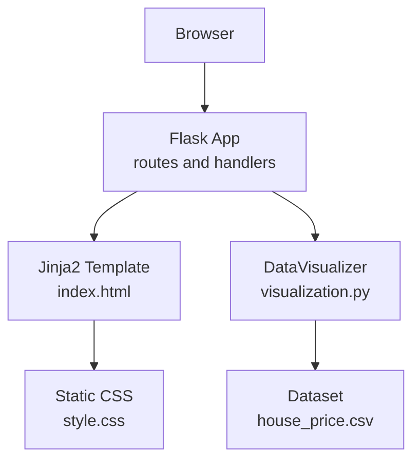
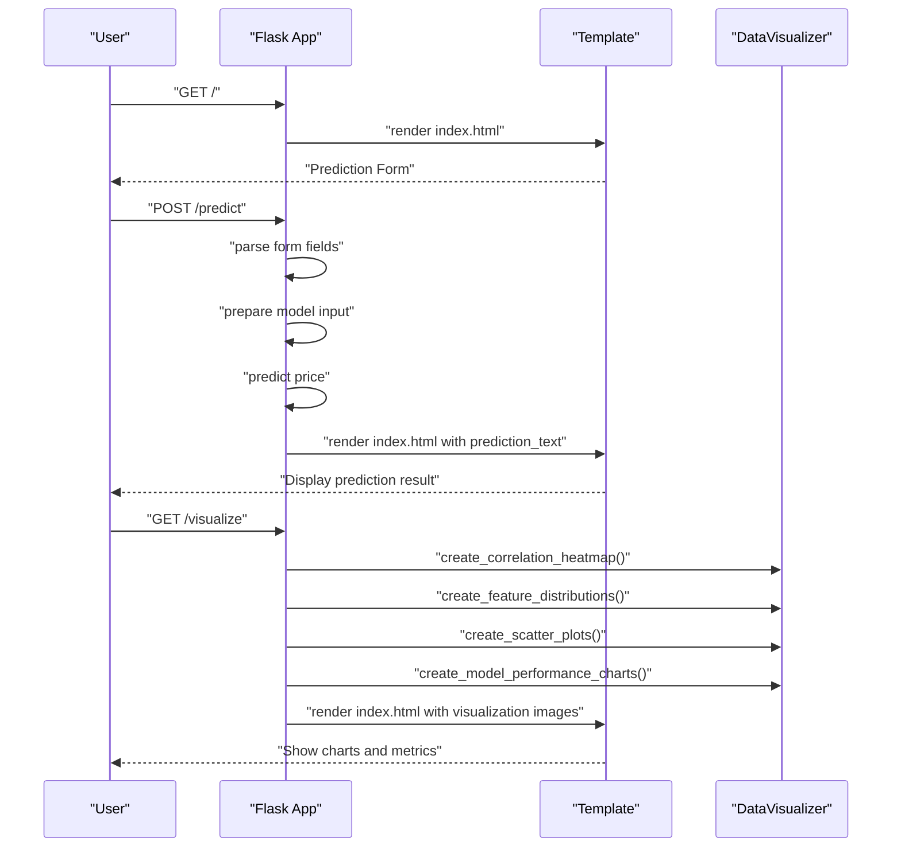
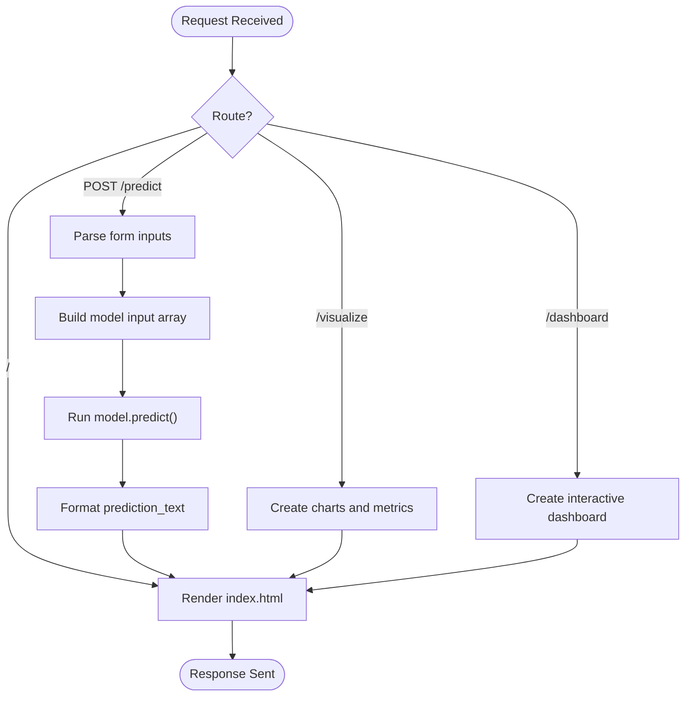
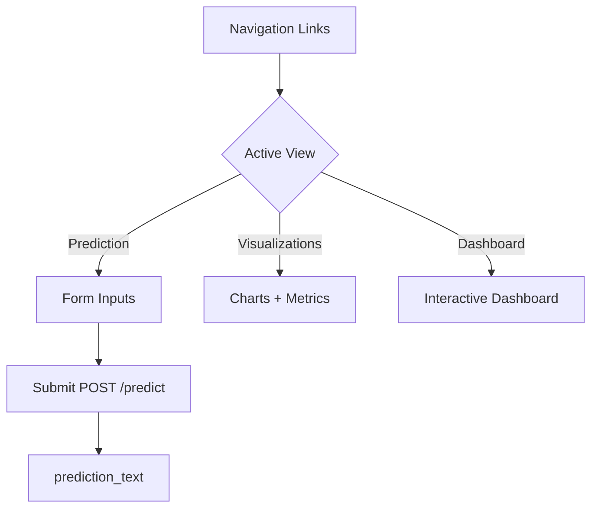
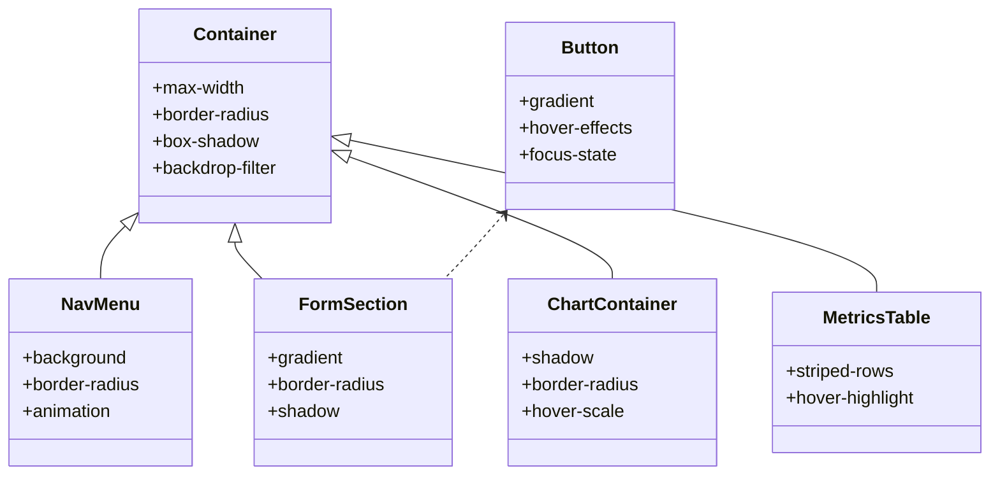
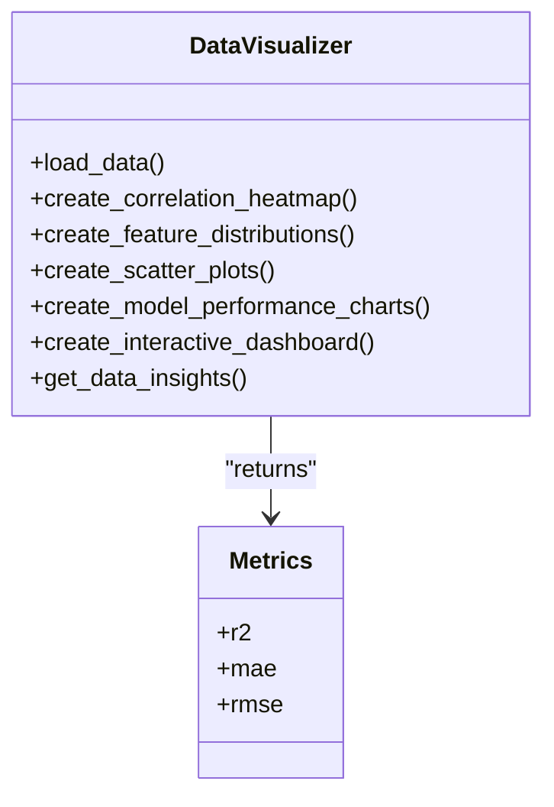
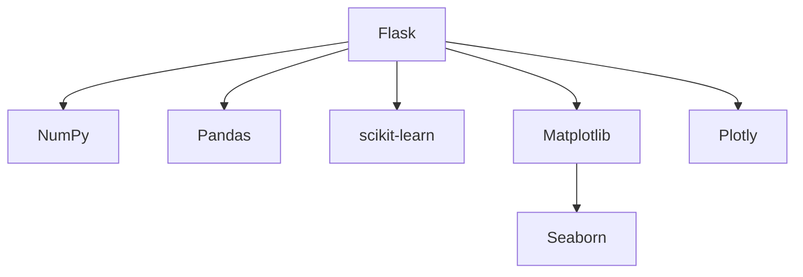
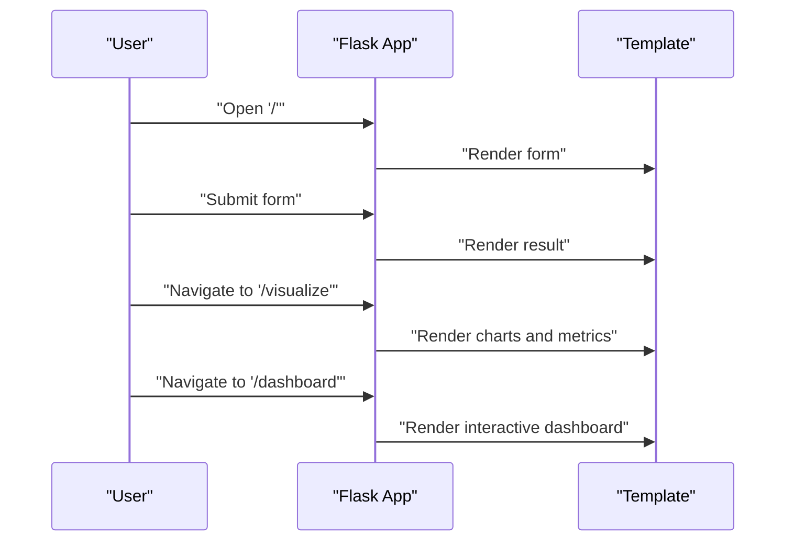

# Web Application Interface

<cite>
**Referenced Files in This Document**
- [app.py](file://House_Price_Prediction-main/housing1/app.py)
- [index.html](file://House_Price_Prediction-main/housing1/templates/index.html)
- [style.css](file://House_Price_Prediction-main/housing1/static/css/style.css)
- [visualization.py](file://House_Price_Prediction-main/housing1/visualization.py)
- [run_app.py](file://House_Price_Prediction-main/housing1/run_app.py)
- [requirements.txt](file://requirements.txt)
- [house_price.csv](file://House_Price_Prediction-main/housing1/Data/house_price.csv)
</cite>

## Table of Contents
1. [Introduction](#introduction)
2. [Project Structure](#project-structure)
3. [Core Components](#core-components)
4. [Architecture Overview](#architecture-overview)
5. [Detailed Component Analysis](#detailed-component-analysis)
6. [Dependency Analysis](#dependency-analysis)
7. [Performance Considerations](#performance-considerations)
8. [Troubleshooting Guide](#troubleshooting-guide)
9. [Conclusion](#conclusion)
10. [Appendices](#appendices)

## Introduction
This document describes the web application interface built with Flask for the house price prediction project. It covers the Flask application structure, route definitions, template rendering, static asset management, and interactive visualization features. It also documents the HTML templates, form handling, data visualization integration, responsive design, modern UI effects, and cross-browser compatibility. Practical examples illustrate form submission handling, real-time prediction display, and interactive chart rendering. Accessibility considerations, mobile responsiveness, and performance optimization are addressed for effective web delivery.

## Project Structure
The web application is organized around a Flask application that serves an HTML template, renders dynamic content, and generates visualizations. Static assets (CSS) and templates are served via Flask’s built-in mechanisms. The visualization module produces Matplotlib and Plotly charts for display in the browser.

**Diagram sources**
- [app.py:33-109](file://House_Price_Prediction-main/housing1/app.py#L33-L109)
- [index.html:1-145](file://House_Price_Prediction-main/housing1/templates/index.html#L1-L145)
- [style.css:1-456](file://House_Price_Prediction-main/housing1/static/css/style.css#L1-L456)
- [visualization.py:23-344](file://House_Price_Prediction-main/housing1/visualization.py#L23-L344)
- [house_price.csv:1-12](file://House_Price_Prediction-main/housing1/Data/house_price.csv#L1-L12)

**Section sources**
- [app.py:14-109](file://House_Price_Prediction-main/housing1/app.py#L14-L109)
- [index.html:1-145](file://House_Price_Prediction-main/housing1/templates/index.html#L1-L145)
- [style.css:1-456](file://House_Price_Prediction-main/housing1/static/css/style.css#L1-L456)
- [visualization.py:23-344](file://House_Price_Prediction-main/housing1/visualization.py#L23-L344)
- [requirements.txt:1-21](file://requirements.txt#L1-L21)

## Core Components
- Flask application with routes for prediction, visualization, and dashboard.
- Jinja2 template rendering with conditional sections for navigation, forms, and visualization displays.
- Static CSS for modern UI effects, animations, and responsive design.
- Visualization module generating Matplotlib and Plotly charts embedded as base64-encoded images or interactive dashboards.

Key responsibilities:
- Route handlers: serve the homepage, process form submissions, and render visualizations.
- Template engine: conditionally renders prediction form, results, and visualization sections.
- Static assets: CSS styling and animations for UI polish and responsive layout.
- Visualization: creates correlation heatmaps, distributions, scatter plots, performance charts, and interactive dashboards.

**Section sources**
- [app.py:33-109](file://House_Price_Prediction-main/housing1/app.py#L33-L109)
- [index.html:14-138](file://House_Price_Prediction-main/housing1/templates/index.html#L14-L138)
- [style.css:1-456](file://House_Price_Prediction-main/housing1/static/css/style.css#L1-L456)
- [visualization.py:23-344](file://House_Price_Prediction-main/housing1/visualization.py#L23-L344)

## Architecture Overview
The Flask application exposes three primary routes:
- GET "/": Renders the prediction form and result area.
- POST "/predict": Processes form inputs, runs inference, and returns the predicted price.
- GET "/visualize": Generates and displays static visualizations.
- GET "/dashboard": Renders an interactive Plotly dashboard.

**Diagram sources**
- [app.py:33-85](file://House_Price_Prediction-main/housing1/app.py#L33-L85)
- [index.html:21-72](file://House_Price_Prediction-main/housing1/templates/index.html#L21-L72)
- [visualization.py:46-235](file://House_Price_Prediction-main/housing1/visualization.py#L46-L235)

## Detailed Component Analysis

### Flask Application Routes and Handlers
- Home route ("/"): Renders the main page with the prediction form and optional result display.
- Prediction route ("/predict", POST): Parses numeric inputs, constructs a model-ready array, predicts the price, and returns the formatted result.
- Visualization route ("/visualize"): Creates multiple charts and metrics, passing them to the template for display.
- Dashboard route ("/dashboard"): Builds an interactive Plotly dashboard and injects it safely into the template.

**Diagram sources**
- [app.py:33-109](file://House_Price_Prediction-main/housing1/app.py#L33-L109)

**Section sources**
- [app.py:33-109](file://House_Price_Prediction-main/housing1/app.py#L33-L109)

### HTML Templates and Form Handling
- Navigation menu toggles between Prediction, Visualizations, and Dashboard views.
- Prediction form collects numeric inputs and a categorical selection for location.
- Results display updates after prediction submission.
- Visualization section shows multiple charts and a metrics table.
- Dashboard section embeds an interactive Plotly chart container.

**Diagram sources**
- [index.html:14-138](file://House_Price_Prediction-main/housing1/templates/index.html#L14-L138)

**Section sources**
- [index.html:14-138](file://House_Price_Prediction-main/housing1/templates/index.html#L14-L138)

### CSS Styling, Animations, and Responsive Design
- Modern gradient backgrounds, backdrop blur, and subtle animated SVG patterns.
- Animated transitions for headings, inputs, buttons, and containers.
- Hover effects and focus states for form controls and navigation links.
- Responsive breakpoints for mobile devices adjusting layout and typography.
- Cross-browser scrollbar styling for consistent UI across browsers.

**Diagram sources**
- [style.css:50-335](file://House_Price_Prediction-main/housing1/static/css/style.css#L50-L335)

**Section sources**
- [style.css:1-456](file://House_Price_Prediction-main/housing1/static/css/style.css#L1-L456)

### Visualization Module and Data Insights
- Loads dataset and computes descriptive statistics and insights.
- Generates Matplotlib charts: correlation heatmap, feature distributions, scatter plots, and performance charts.
- Produces Plotly interactive dashboard with multiple subplots.
- Returns base64-encoded images and metrics for embedding in templates.

**Diagram sources**
- [visualization.py:23-344](file://House_Price_Prediction-main/housing1/visualization.py#L23-L344)

**Section sources**
- [visualization.py:23-344](file://House_Price_Prediction-main/housing1/visualization.py#L23-L344)

### Static Asset Management
- Flask configured to serve static files from the "static" folder.
- CSS linked via Flask’s url_for helper for cache-busting and correct paths.
- Images embedded as base64 data URIs for immediate rendering without extra requests.

**Section sources**
- [app.py:14-15](file://House_Price_Prediction-main/housing1/app.py#L14-L15)
- [index.html:7](file://House_Price_Prediction-main/housing1/templates/index.html#L7)

### Session Handling
- No explicit session handling is implemented in the current codebase.
- User state is maintained via template variables passed through routes.

**Section sources**
- [app.py:33-109](file://House_Price_Prediction-main/housing1/app.py#L33-L109)

## Dependency Analysis
External dependencies include Flask, NumPy, Pandas, scikit-learn, Matplotlib, Seaborn, and Plotly. These enable web serving, numerical computation, machine learning modeling, and visualization generation.

**Diagram sources**
- [requirements.txt:1-21](file://requirements.txt#L1-L21)

**Section sources**
- [requirements.txt:1-21](file://requirements.txt#L1-L21)

## Performance Considerations
- Chart generation uses Matplotlib with a non-interactive backend and saves to in-memory buffers to avoid filesystem writes.
- Base64 encoding of images avoids additional HTTP requests but increases HTML payload size; consider CDN hosting for large images.
- Interactive dashboards rely on Plotly’s client-side rendering; ensure dataset sizes remain reasonable for smooth interactivity.
- CSS animations and backdrop filters are optimized for modern browsers; older browsers may degrade gracefully.
- Pre-warming dependencies and ensuring the dataset is present reduces runtime errors and improves perceived performance.

[No sources needed since this section provides general guidance]

## Troubleshooting Guide
Common issues and resolutions:
- Missing dataset: The run script checks for the presence of the dataset and exits with an error if not found.
- Dependency installation: The run script attempts to install missing packages automatically.
- Port binding: The application reads the PORT environment variable; ensure it is set when deploying.
- Debug mode: Local development enables debug mode; production deployments disable it.

**Section sources**
- [run_app.py:36-42](file://House_Price_Prediction-main/housing1/run_app.py#L36-L42)
- [run_app.py:22-25](file://House_Price_Prediction-main/housing1/run_app.py#L22-L25)
- [app.py:101-109](file://House_Price_Prediction-main/housing1/app.py#L101-L109)

## Conclusion
The Flask-based web application delivers a modern, responsive interface for house price prediction. It integrates form-based input handling, real-time prediction rendering, and rich visualizations through Matplotlib and Plotly. The design emphasizes accessibility, cross-browser compatibility, and performance, with clear separation of concerns between routing, templating, and visualization logic.

[No sources needed since this section summarizes without analyzing specific files]

## Appendices

### User Interaction Flows
- Property input: User fills the prediction form and submits.
- Prediction result: Backend computes the price and renders the result.
- Visualization exploration: User navigates to the visualization or dashboard pages to explore charts and metrics.

**Diagram sources**
- [app.py:33-98](file://House_Price_Prediction-main/housing1/app.py#L33-L98)
- [index.html:14-138](file://House_Price_Prediction-main/housing1/templates/index.html#L14-L138)

### Practical Examples
- Form submission handling: The POST "/predict" route parses inputs, prepares a model-ready array, predicts the price, and returns a formatted result.
- Real-time prediction display: The template conditionally renders the prediction result after submission.
- Interactive chart rendering: The visualization route generates Matplotlib charts and metrics, while the dashboard route builds an interactive Plotly dashboard.

**Section sources**
- [app.py:38-62](file://House_Price_Prediction-main/housing1/app.py#L38-L62)
- [app.py:64-98](file://House_Price_Prediction-main/housing1/app.py#L64-L98)
- [index.html:83-136](file://House_Price_Prediction-main/housing1/templates/index.html#L83-L136)